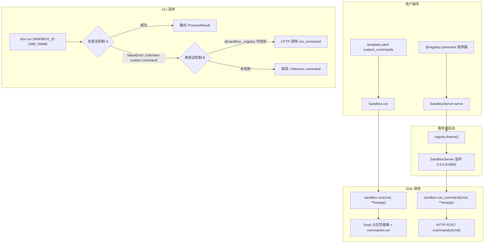
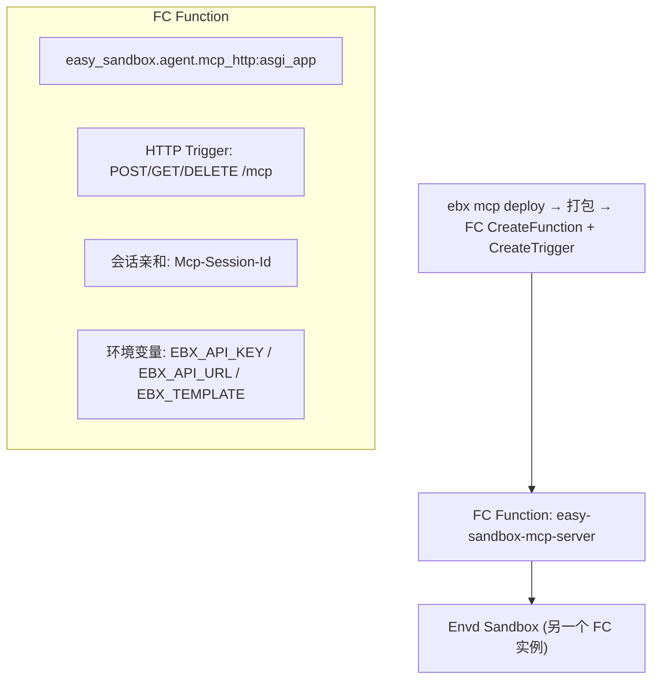

# CLI / MCP / Testing — Comprehensive Design Reference (historical snapshot)

> **⚠️ DEPRECATED DIRECTORY — `.agents/design/` is no longer an active directory.**
>
> Per the design document governance decision (2026-09-24, ref #108):
> - **Stable public content** has been absorbed into `docs/{en,zh}/design/` topic documents:
>   - CLI command tree & template subcommands → `cli-design.md`
>   - MCP FC deployment architecture → `mcp-server.md`
> - **ADR/internal decisions** belong in `.agents/notes/{proposed,implemented,rejected}/`
> - **Process research** belongs in `.agents/research/`
> - **Evidence** belongs in `.agents/evidence/`
>
> This file is retained as a **read-only historical artifact**. Do not add new content here.
> New design work should go to `docs/{en,zh}/design/` (public) or `.agents/notes/` (ADR).

> **Not an ADR.** This file is a comprehensive design reference, not an
> Architecture Decision Record. It was originally drafted in Chinese and is
> kept here as a historical snapshot of the CLI/MCP/testing design work.
>
> **Location:** `.agents/design/` (outside the ADR lifecycle directories
> `.agents/notes/{proposed,implemented,rejected}/`).
>
> **Status of content:**
> - Chapter 1 (CLI final command tree, 43 commands) — **superseded** by
>   `.agents/notes/implemented/feature/2026-09-23-cli-command-reduction.md`.
> - Chapter 4 (MCP Server FC deployment plan) — related to
>   `.agents/notes/implemented/feature/2026-09-23-mcp-fc-streamable-http.md`.
> - Chapter 6 (.agents directory conventions) — superseded by
>   `.agents/notes/README.md` (canonical template).
> - Remaining chapters (2/3/5/7) — kept as design reference material only.
>
> **Language:** the go-forward language convention for `.agents/` engineering
> records is English. This snapshot is kept in its original Chinese as-is,
> matching how the human evidence reports under `.agents/evidence/` are
> retained without translation.
>
> Original front-matter follows.

---

- Original title (zh): CLI / MCP / 测试 完整设计文档
- Original status: proposed (superseded — no longer part of the ADR lifecycle)
- Type: feature (design reference)
- Created: 2026-09-23
- Author: AI Agent
- Related ADRs: 2026-09-03-sdk-capability-surface,
  2026-09-23-cli-command-reduction, 2026-09-23-mcp-fc-streamable-http

---

## 目录

1. [CLI 最终命令结构（43 个命令）](#第-1-章cli-最终命令结构43-个命令)
2. [顶层快捷方式可配置化](#第-2-章顶层快捷方式可配置化)
3. [自定义命令设计](#第-3-章自定义命令设计)
4. [MCP Server FC 部署方案](#第-4-章mcp-server-fc-部署方案)
5. [CLI 测试方案](#第-5-章cli-测试方案)
6. [.agents 目录规范](#第-6-章agents-目录规范)
7. [实施计划和优先级](#第-7-章实施计划和优先级)

---

## 第 1 章：CLI 最终命令结构（43 个命令）

### 1.1 完整命令树

```
ebx
├── create              # 顶层快捷 → sandbox create
├── list                # 顶层快捷 → sandbox list
├── info                # 顶层快捷 → sandbox info
├── kill                # 顶层快捷 → sandbox kill
├── exec                # 顶层快捷 → sandbox exec
├── connect             # 顶层快捷 → sandbox connect
├── run                 # 顶层快捷 → sandbox run（自定义命令）
├── upload              # 顶层快捷 → sandbox upload
├── download            # 顶层快捷 → sandbox download
├── deploy              # 顶层快捷 → 项目部署（NL/传统）
├── install             # 顶层快捷 → template install
│
├── sandbox             # 沙箱管理组
│   ├── create
│   ├── list
│   ├── info
│   ├── kill
│   ├── exec
│   ├── connect
│   ├── upload
│   ├── download
│   ├── run
│   ├── capabilities    # 查看沙箱能力集
│   ├── shell-stream    # 流式 Shell 执行
│   ├── files           # 文件操作子组
│   │   ├── list
│   │   ├── stat
│   │   ├── mkdir
│   │   ├── rm
│   │   ├── mv
│   │   └── search
│   ├── process         # 进程管理子组
│   │   ├── list
│   │   ├── start
│   │   ├── info
│   │   └── signal
│   └── system          # 系统信息子组
│       ├── info
│       ├── env
│       ├── ports
│       ├── packages
│       └── metrics
│
├── template            # 模板管理组
│   ├── deploy          # 一键 build→push→create（原 build-local）
│   ├── build           # 只构建 Docker 镜像 + push + 注册
│   ├── push            # 只推送已有镜像到 ACR
│   ├── create          # 只调 CreateTemplate API
│   ├── install         # 从 GitHub/本地安装模板源码
│   ├── list            # 列出模板
│   ├── info            # 查看模板详情
│   ├── delete          # 删除模板
│   └── search          # 搜索模板
│
├── config              # 配置管理组
│   ├── get
│   ├── set
│   ├── list
│   └── reset
│
└── mcp                 # MCP Server 管理组
    ├── install         # 写入 IDE 配置
    ├── start           # 本地 STDIO 启动
    ├── status          # 查看状态
    └── deploy          # 【新增】部署到 FC
```

### 1.2 命令详细参数与状态

#### 1.2.1 顶层快捷方式（11 个）

| # | 命令 | 参数 | 实现状态 | 能力组 |
|---|------|------|---------|--------|
| 1 | `ebx create [DESCRIPTION]` | `--template -T`, `--upload -u`, `--timeout -t`, `--env -e`(多值), `--metadata -m`(多值) | 可用已测试 | sandbox |
| 2 | `ebx list` | `--status -s`(choice), `--limit -l` | 可用已测试 | sandbox |
| 3 | `ebx info SANDBOX_ID` | — | 可用已测试 | sandbox |
| 4 | `ebx kill [SANDBOX_ID]` | `--all`, `--yes -y` | 可用已测试 | sandbox |
| 5 | `ebx exec SANDBOX_ID COMMAND` | `--timeout -t`, `--cwd` | 可用已测试 | sandbox |
| 6 | `ebx connect SANDBOX_ID` | — | 可用已测试 | sandbox |
| 7 | `ebx run SANDBOX_ID COMMAND_NAME` | `--arg -a`(多值), 支持 `--key value` 透传 | 可用已测试 | sandbox |
| 8 | `ebx upload SANDBOX_ID LOCAL REMOTE` | — | 可用已测试 | sandbox |
| 9 | `ebx download SANDBOX_ID REMOTE LOCAL` | — | 可用已测试 | sandbox |
| 10 | `ebx deploy [PATH] [INSTRUCTION]` | `--instruction -i`, `--max-wall-time`, `--max-tool-calls`, `--alias -a`, `--watch`, `--traditional` | 可用已测试 | deploy |
| 11 | `ebx install TEMPLATE_REF` | `--registry-url`, `--registry-type`, `--token`, `--alias -a` | 可用已测试 | template |

#### 1.2.2 sandbox 子组（17 个）

**files 子组（6 个）**

| # | 命令 | 参数 | 实现状态 | 能力组 |
|---|------|------|---------|--------|
| 12 | `sandbox files list SANDBOX_ID` | `--path -p`(默认 /home/user), `--recursive -r` | 可用待测试 | files |
| 13 | `sandbox files stat SANDBOX_ID` | `--path -p`(必填) | 可用待测试 | files |
| 14 | `sandbox files mkdir SANDBOX_ID` | `--path -p`(必填) | 可用待测试 | files |
| 15 | `sandbox files rm SANDBOX_ID` | `--path -p`(必填), `--yes -y` | 可用待测试 | files |
| 16 | `sandbox files mv SANDBOX_ID` | `--source -s`(必填), `--dest -d`(必填) | 可用待测试 | files |
| 17 | `sandbox files search SANDBOX_ID` | `--path -p`(必填), `--pattern`(必填), `--max-depth` | 可用待测试 | files |

**process 子组（4 个）**

| # | 命令 | 参数 | 实现状态 | 能力组 |
|---|------|------|---------|--------|
| 18 | `sandbox process list SANDBOX_ID` | — | 可用待测试 | process |
| 19 | `sandbox process start SANDBOX_ID` | `--command -c`(必填), `--timeout -t`, `--cwd` | 可用待测试 | process |
| 20 | `sandbox process info SANDBOX_ID PID` | — | 可用待测试 | process |
| 21 | `sandbox process signal SANDBOX_ID PID` | `--signal -s`(默认15) | 可用待测试 | process |

**system 子组（5 个）**

| # | 命令 | 参数 | 实现状态 | 能力组 |
|---|------|------|---------|--------|
| 22 | `sandbox system info SANDBOX_ID` | — | 可用待测试 | system |
| 23 | `sandbox system env SANDBOX_ID` | `--filter -f` | 可用待测试 | system |
| 24 | `sandbox system ports SANDBOX_ID` | — | 可用待测试 | system |
| 25 | `sandbox system packages SANDBOX_ID` | `--manager -m`(pip/npm) | 可用待测试 | system |
| 26 | `sandbox system metrics SANDBOX_ID` | — | 可用待测试 | system |

**独立子命令（2 个）**

| # | 命令 | 参数 | 实现状态 | 能力组 |
|---|------|------|---------|--------|
| 27 | `sandbox capabilities SANDBOX_ID` | — | 可用待测试 | system |
| 28 | `sandbox shell-stream SANDBOX_ID` | `--command -c`(必填), `--timeout -t`, `--cwd` | 可用待测试 | shell |

#### 1.2.3 template 组（9 个）

| # | 命令 | 参数 | 实现状态 | 能力组 |
|---|------|------|---------|--------|
| 29 | `template deploy TEMPLATE_DIR` | 同 `template build`（一键 build→push→create） | 可用待测试（需重命名 build-local→deploy） | template |
| 30 | `template build TEMPLATE_DIR` | `--acr-registry`, `--acr-namespace`(必填), `--acr-repo`, `--acr-username`, `--acr-password`, `--acree-instance-id`, `--vpc-id`, `--vswitch-ids`, `--security-group-id`, `--alias -a`, `--tag -t`, `--platform`, `--cpu`, `--memory`, `--start-cmd`, `--ready-cmd`, `--timeout`, `--dockerfile -f`, `--disk-size`, `--internet-access/--no-internet-access`, `--official-api/--legacy-api`, `--team-id`, `--envd-inject/--no-envd-inject`, `--generation` | 可用已测试 | template |
| 31 | `template push IMAGE` | `--acr-registry`, `--acr-namespace`(必填), `--acr-username`, `--acr-password`, `--acree-instance-id` | 可用已测试 | template |
| 32 | `template create IMAGE` | `--name -n`(必填), `--team-id`, `--cpu`, `--memory`, `--disk-size`, `--internet-access/--no-internet-access`, `--start-cmd`, `--ready-cmd`, `--generation`, `--envd-inject/--no-envd-inject`, `--registry-type`, `--acree-instance-id`, `--registry-username`, `--registry-password` | 可用已测试 | template |
| 33 | `template install TEMPLATE_REF` | `--registry-url`, `--registry-type`, `--token`, `--alias -a` | 可用已测试 | template |
| 34 | `template list` | `--official-api/--no-official-api` | 可用已测试 | template |
| 35 | `template info TEMPLATE_ID` | `--official-api/--no-official-api` | 可用已测试 | template |
| 36 | `template delete TEMPLATE_ID` | — | 可用已测试 | template |
| 37 | `template search QUERY` | `--tag -t`, `--status -s` | 可用已测试 | template |

> **注意**：
> - `template deploy` = 原 `build-local`（一键 build→push→create 的端到端流水线）
> - `template build` = 当前的 `build` 命令（完整流程：本地构建 Docker 镜像 → ACR 推送 → 调 CreateTemplate API）
> - `template push` = 只推送已有本地镜像到 ACR
> - `template create` = 只调 CreateTemplate API（镜像已在 ACR 中）

#### 1.2.4 config 组（4 个）

| # | 命令 | 参数 | 实现状态 | 能力组 |
|---|------|------|---------|--------|
| 38 | `config get KEY` | — | 可用已测试 | config |
| 39 | `config set KEY VALUE` | — | 可用已测试 | config |
| 40 | `config list` | — | 可用已测试 | config |
| 41 | `config reset` | `--yes -y` | 可用已测试 | config |

#### 1.2.5 mcp 组（3+1 个）

| # | 命令 | 参数 | 实现状态 | 能力组 |
|---|------|------|---------|--------|
| 42 | `mcp install` | `--target`(必填: cursor/claude/vscode) | 可用已测试 | mcp |
| 43 | `mcp start` | `--template`, `--api-key`, `--api-url`, `--domain` | 可用已测试 | mcp |
| 44 | `mcp status` | — | 可用已测试 | mcp |
| 45 | `mcp deploy` | `--name`, `--region`, `--template`, `--memory`, `--timeout`, `--auth-token-file`/`--generate-token`, `--enable-session-affinity`, `--api-key`, `--custom-domain` | **待实现** | mcp |

### 1.3 已删除的命令（18 个）

以下命令组已从 CLI 中移除（简化 CLI 表面积、减少维护负担）：

| 已删除命令组 | 命令数量 | 删除原因 |
|-------------|---------|---------|
| `auth` (login, logout, status) | 3 | 认证统一通过 `config set api_key` 和环境变量处理 |
| `session` (save, load, list, delete, export) | 5 | Session 功能移入 SDK 层，CLI 不再直接暴露 |
| `secret` (set, get, list, delete) | 4 | 秘钥管理通过环境变量和 `.env` 文件处理 |
| `skill` (list, info, run, install, search) | 5 | 技能系统尚未稳定，暂时移除 CLI 入口 |
| `template cache` | 1 | 缓存操作合并到 `template install`/`template list` |
| **合计** | **18** | |

### 1.4 设计决策

**决策**：将 CLI 命令从 60+ 个精简至 43 个，聚焦核心操作。

**理由**：
1. 降低用户认知负担——新用户只需记忆 5 个命令组
2. 减少代码维护面——每个移除的命令节省约 50-100 行代码 + 对应测试
3. `auth` / `secret` / `session` 的功能由 SDK 或 `config` 命令覆盖

**替代方案**：
- 保留所有命令但标记 `[deprecated]` → 拒绝：增加帮助文档噪音
- 只保留顶层快捷方式不要 `sandbox` 子组 → 拒绝：`sandbox files list` 结构性更清晰

---

## 第 2 章：顶层快捷方式可配置化

### 2.1 需求

用户希望自定义 `ebx <shortcut>` 映射到哪个子命令，甚至添加自己的快捷方式。

### 2.2 config.toml 中 `[shortcuts]` 段设计

```toml
# ~/.ebx/config.toml

[transport]
api_key = "..."
region = "cn-hangzhou"

[shortcuts]
# 默认快捷方式（出厂预置，可覆盖）
create = "sandbox create"
list = "sandbox list"
info = "sandbox info"
kill = "sandbox kill"
exec = "sandbox exec"
connect = "sandbox connect"
run = "sandbox run"
upload = "sandbox upload"
download = "sandbox download"
deploy = "deploy"
install = "template install"

# 用户自定义快捷方式
files = "sandbox files list"
ps = "sandbox process list"
sysinfo = "sandbox system info"
```

### 2.3 默认快捷方式列表

出厂预置的 11 个快捷方式（与当前 `main.py` LazyGroup 一致）：

| 快捷方式 | 映射目标 |
|---------|---------|
| `create` | `sandbox create` |
| `list` | `sandbox list` |
| `info` | `sandbox info` |
| `kill` | `sandbox kill` |
| `exec` | `sandbox exec` |
| `connect` | `sandbox connect` |
| `run` | `sandbox run` |
| `upload` | `sandbox upload` |
| `download` | `sandbox download` |
| `deploy` | `deploy` (顶层) |
| `install` | `template install` |

### 2.4 冲突检测

**保留名称**（命令组名不可被快捷方式覆盖）：
- `sandbox`, `template`, `config`, `mcp`
- `--help`, `--version`, `--json`, `--quiet`, `--verbose`

冲突检测规则：
1. 快捷方式名称不得与保留命令组名重名
2. 同名快捷方式后定义的覆盖先定义的（用户配置覆盖默认配置）
3. 检测到冲突时输出警告但不阻塞启动

### 2.5 实现方式

```python
# main.py LazyGroup 启动时读取 config.toml [shortcuts]
class LazyGroup(click.Group):
    def __init__(self, *args, lazy_subcommands=None, **kwargs):
        super().__init__(*args, **kwargs)
        self._lazy_subcommands = lazy_subcommands or {}
        # 从 config.toml 加载用户自定义快捷方式
        self._load_user_shortcuts()

    def _load_user_shortcuts(self):
        """读取 ~/.ebx/config.toml [shortcuts] 段，动态注册别名命令。"""
        config_path = Path.home() / ".ebx" / "config.toml"
        if not config_path.is_file():
            return
        try:
            import tomllib
        except ImportError:
            import tomli as tomllib
        try:
            with open(config_path, "rb") as f:
                data = tomllib.load(f)
            shortcuts = data.get("shortcuts", {})
        except Exception:
            return

        RESERVED = {"sandbox", "template", "config", "mcp"}
        for name, target in shortcuts.items():
            if name in RESERVED:
                # 警告但不阻塞
                continue
            # 将 "sandbox create" 解析为模块路径
            resolved = self._resolve_shortcut_target(target)
            if resolved:
                self._lazy_subcommands[name] = resolved

    def _resolve_shortcut_target(self, target: str) -> str | None:
        """将 'sandbox create' 形式的目标解析为 lazy import 路径。"""
        # 预定义映射表
        SHORTCUT_MAP = {
            "sandbox create": "easy_sandbox.cli.commands.sandbox:create",
            "sandbox list": "easy_sandbox.cli.commands.sandbox:list_cmd",
            "sandbox info": "easy_sandbox.cli.commands.sandbox:info",
            # ... 完整映射
        }
        return SHORTCUT_MAP.get(target)
```

### 2.6 设计决策

**决策**：通过 `config.toml [shortcuts]` 实现声明式快捷方式配置。

**理由**：
1. 无需修改源码即可自定义 CLI 行为
2. TOML 格式人类可读可编辑
3. 与现有 `config.toml` 文件共存，无需新增配置文件

**替代方案**：
- 通过环境变量 `EBX_ALIASES` 配置 → 拒绝：不适合多条映射，不持久化
- 通过插件机制 → 拒绝：过度设计，当前阶段不需要
- 放在 `~/.ebx/shortcuts.yaml` 单独文件 → 拒绝：多一个文件增加复杂度

---

## 第 3 章：自定义命令设计

### 3.1 两种机制对比

| 维度 | 机制 A：template.yaml 声明式 | 机制 B：@registry.command 注册式 |
|------|---|---|
| **定义方式** | YAML `custom_commands` 段 | Python `@registry.command("name")` 装饰器 |
| **执行方式** | Shell 命令 + 占位符替换 (`{file}` → 参数值) | HTTP POST 到容器内 SandboxServer |
| **执行入口** | `Sandbox.run(cmd_name, **kwargs)` | `Sandbox.run_command(cmd_name, **kwargs)` |
| **适用场景** | 简单 Shell 命令（`pytest`, `npm run dev`） | 复杂 Python 逻辑（数据处理、多步骤工作流） |
| **需要能力** | `shell` | `ports` + SandboxServer 运行中 |
| **参数类型** | 字符串占位符 | 带类型的 `CommandArg`（string/integer/float/boolean） |
| **发现机制** | `template.yaml` 文件解析 | `registry.freeze()` 锁定注册表 |
| **沙箱内依赖** | 无（直接 Shell） | 需要 `easy_sandbox.server` 包 |

### 3.2 注册→执行→测试完整链路



#### 3.2.1 机制 A 完整流程

1. **定义**：`template.yaml` 中声明 `custom_commands`
   ```yaml
   custom_commands:
     dev:
       command: "npm run dev"
     test:
       command: "pytest {file} -v"
       description: "Run tests"
   ```
2. **解析**：`Sandbox.create()` / `Sandbox.connect()` 时解析 `template.yaml`
3. **执行**：`sandbox.run("test", file="tests/test_api.py")` → 替换为 `pytest tests/test_api.py -v` → `sandbox.commands.run(replaced_cmd)`
4. **CLI**：`ebx run <id> test --arg file=tests/test_api.py`

#### 3.2.2 机制 B 完整流程

1. **注册**：Python 代码中使用装饰器
   ```python
   from easy_sandbox.server.registry import registry

   @registry.command("greet")
   def greet(name: str) -> str:
       return f"Hello, {name}!"

   registry.freeze()
   ```
2. **服务启动**：`SandboxServer.serve()` → 注册路由 `POST /commands/{cmd_name}`
3. **SDK 调用**：`sandbox.run_command("greet", name="World")` → `HTTP POST :9000/commands/greet {"name": "World"}`
4. **CLI 调用**：`ebx run <id> greet --name World`
5. **回退逻辑**：`ebx run` 先尝试机制 A（`sandbox.run()`），捕获 `ValueError("Unknown custom command")` 后尝试机制 B（`sandbox.run_command()`）

### 3.3 自定义命令测试方案

#### 3.3.1 单元测试

```python
# tests/test_cli/test_run_command.py
class TestRunCustomCommand:
    def test_mechanism_a_happy(self, runner, sb):
        """机制 A：template 自定义命令正常执行。"""
        sb.run = AsyncMock(return_value=ProcessResult(
            stdout="ok\n", stderr="", exit_code=0, execution_time=0.5
        ))
        with _patch_connect(sb):
            r = runner.invoke(cli, ["run", "sbx-test", "dev"])
        assert r.exit_code == 0

    def test_mechanism_b_fallback(self, runner, sb):
        """机制 A 失败后回退到机制 B。"""
        sb.run = AsyncMock(side_effect=ValueError("Unknown custom command 'greet'"))
        sb.run_command = AsyncMock(return_value="Hello, World!")
        # 注入 _sb._registry
        with _patch_connect(sb), _patch_registry({"greet": ...}):
            r = runner.invoke(cli, ["run", "sbx-test", "greet", "--name", "World"])
        assert r.exit_code == 0

    def test_both_fail(self, runner, sb):
        """两种机制都找不到命令。"""
        sb.run = AsyncMock(side_effect=ValueError("Unknown custom command"))
        with _patch_connect(sb), _patch_registry({}):
            r = runner.invoke(cli, ["run", "sbx-test", "nonexistent"])
        assert r.exit_code == 2
```

#### 3.3.2 集成测试

```python
# tests/integration/test_custom_commands.py
@pytest.mark.integration
class TestCustomCommandsIntegration:
    async def test_registry_command_roundtrip(self):
        """真实 Server 启动 + HTTP 调用。"""
        from easy_sandbox.server.registry import CommandRegistry
        from easy_sandbox.server.app import SandboxServer

        reg = CommandRegistry()
        @reg.command("add")
        def add(a: int, b: int) -> int:
            return a + b
        reg.freeze()

        server = SandboxServer(registry=reg, port=0)  # 随机端口
        async with server:
            result = await server.call_command("add", a=1, b=2)
            assert result == 3
```

#### 3.3.3 E2E 测试

```bash
# scripts/e2e_custom_commands.py
# 1. ebx create --template python-hello
# 2. 写入带 @registry.command 的 Python 文件
# 3. ebx run <id> <custom_cmd> --arg key=value
# 4. 验证输出
```

### 3.4 设计决策

**决策**：保留两种机制并在 `ebx run` 中实现自动回退。

**理由**：
1. 机制 A 零门槛——只需 YAML 配置
2. 机制 B 支持复杂逻辑——适合 Agent 场景
3. 自动回退对用户透明，无需指定使用哪种机制

**替代方案**：
- 只保留机制 A → 拒绝：无法支持复杂 Python 逻辑
- 要求用户显式指定 `--mechanism a/b` → 拒绝：增加认知负担
- 统一为 HTTP 机制 → 拒绝：简单 Shell 命令不应强制依赖 Server

---

## 第 4 章：MCP Server FC 部署方案

### 4.1 当前实现分析

#### 4.1.1 CLI 命令层

现有 3 个 MCP 命令（`src/easy_sandbox/cli/commands/mcp.py`）：

| 命令 | 行为 | 传输方式 |
|------|------|---------|
| `mcp install --target {cursor,claude,vscode}` | 将 MCP 配置写入 IDE JSON 文件 | — |
| `mcp start` | 本地 STDIO 模式启动 MCP Server | STDIO |
| `mcp status` | 打印服务器信息、工具数量、IDE 安装状态 | — |

#### 4.1.2 MCP Server 核心 (`SandboxMCPServer`)

文件：`src/easy_sandbox/agent/mcp.py`

- **协议**：自包含 JSON-RPC 2.0，不依赖官方 `mcp` SDK
- **协议版本**：`2024-11-05`
- **传输**：STDIO（`asyncio.StreamReader` + `connect_write_pipe`）
- **支持方法**：`initialize`, `notifications/initialized`, `tools/list`, `tools/call`, `ping`
- **未实现**：`resources/*`, `prompts/*`, `logging/setLevel`
- **无 Session**：STDIO 模型下进程即会话

#### 4.1.3 注册的工具（7 个 P0 工具）

文件：`src/easy_sandbox/agent/tools.py`

| Tool | 后端 API | 必填参数 |
|------|----------|----------|
| `create_sandbox` | `Sandbox.create` | (无) |
| `run_code` | `sandbox.run_code` | `code` |
| `run_command` | `sandbox.commands.run` | `command` |
| `read_file` | `sandbox.files.read` | `path` |
| `write_file` | `sandbox.files.write` | `path`, `content` |
| `list_files` | `sandbox.files.list` | (无，默认 `/app`) |
| `kill_sandbox` | `manager.kill_sandbox` | (无) |

#### 4.1.4 沙箱生命周期 (`SandboxManager`)

- **懒创建**：首次未指定 `sandbox_id` 的调用自动创建默认沙箱
- **多沙箱**：显式传 `sandbox_id` 查内存 map，再走 `Sandbox.connect()`
- **清理**：`shutdown()` 在 STDIO EOF 时销毁所有沙箱（best-effort）
- **风险**：进程崩溃/SIGKILL 时云端沙箱可能残留

### 4.2 FC 部署架构

#### 4.2.1 阿里云 FC 关键事实

- FC 已官方原生支持 **MCP Streamable HTTP 亲和**（2025 上线）
- 基于 MCP 2025-03-26/2025-06-18 规范，通过 `Mcp-Session-Id` 响应头做实例亲和路由
- FC HTTP 触发器需开启 `GET/POST/DELETE`
- 单实例可绑定 20-200 个 session；session 默认 6h 生命周期，30min idle 回收
- 与 Easy Sandbox 现有架构兼容（项目本身即部署在 `*.e2b.fc.aliyuncs.com`）

#### 4.2.2 传输协议方案对比

| 方案 | 协议 | FC 支持 | 状态保持 | 推荐度 |
|------|------|---------|----------|--------|
| **A. Streamable HTTP** | MCP 2025-06-18 | 原生亲和 | FC 平台层保证会话粘性 | **推荐** |
| B. HTTP+SSE (旧) | MCP 2024-11-05 | 有但已被 spec 废弃 | 长连接 SSE | 不推荐 |
| C. WebSocket | 非 MCP 标准 | FC 支持 | 长连接 | 不推荐 |
| D. 无状态 HTTP POST | 自研 | 任意 | 每次重建 | 仅调试 |

**推荐方案 A**：Streamable HTTP。MCP 官方最新协议 + FC 原生亲和支持 + Cursor/Claude Desktop 均已升级。

#### 4.2.3 部署模型



**关键设计点**：

1. **Runtime**：优先 FC Python 3.10 内置 runtime；需 CustomContainer 时走已有 `template build` 通道
2. **打包结构**：
   ```
   deploy-artifact/
   ├── requirements.txt   (easy-sandbox + uvicorn/starlette)
   ├── app.py             (ASGI 入口，暴露 /mcp)
   └── config.yaml        (function memory, timeout, env)
   ```
3. **HTTP 端点**：新增 `src/easy_sandbox/agent/mcp_http.py`，Starlette ASGI 应用：
   - `POST /mcp` → 解析 JSON-RPC → 复用 `SandboxMCPServer.handle_request`；初始化响应回写 `Mcp-Session-Id`
   - `GET /mcp`（可选）→ SSE 升级，服务端推送通知
   - `DELETE /mcp` → 触发 `SandboxManager.shutdown()` 清理沙箱、释放 session
4. **实例亲和**：依赖 FC 平台层 "MCP Streamable HTTP 亲和"，无需应用层做 sticky routing

### 4.3 认证机制

**双层认证**：

| 层 | 传递方式 | 存储 |
|----|----------|------|
| Client → MCP HTTP Server | `Authorization: Bearer <token>` | 部署时生成随机 token，写入 IDE 的 mcpServers 配置 |
| MCP Server → Easy Sandbox 后端 | 进程环境变量 `E2B_API_KEY` | FC 函数环境变量（可选 KMS 加密） |

**替代方案**（多租户）：Header 传 `X-EBX-AK` / `X-EBX-SK`，MCP Server 转发到 Sandbox。v1 用单租户环境变量，v2 再考虑多租户。

### 4.4 沙箱生命周期在 FC 环境下的挑战

| 问题 | 本地 STDIO 表现 | FC 环境挑战 | 方案 |
|------|-----------------|-------------|------|
| 默认沙箱位置 | 进程内存 | FC 实例可能被回收 | 依赖 FC MCP 亲和；idle 30min 与 sandbox timeout 对齐 |
| 会话结束清理 | STDIO EOF 触发 | HTTP 无固定 EOF | `DELETE /mcp` + idle timer 双保险；`atexit` 兜底 |
| 沙箱残留 | 崩溃后残留 | FC 冷启新实例 | 沙箱创建时打 `mcp_session_id` metadata，定期 `Sandbox.list()` 清理 |
| 跨实例共享 | N/A | FC 亲和满时开新实例 | 依赖 FC 亲和承诺（单 session 单实例） |

### 4.5 `ebx mcp deploy` 命令设计

```
ebx mcp deploy \
  --name easy-sandbox-mcp \            # FC 函数名
  --region cn-hangzhou \
  --template python-base \             # 默认沙箱模板
  --memory 512 --timeout 600 \         # FC 函数配置
  --auth-token-file ./token.txt \      # 或 --generate-token
  --enable-session-affinity            # 开启 MCP Streamable HTTP 亲和
  [--api-key XXX]                      # 注入到 FC env
  [--custom-domain mcp.example.com]    # 自定义域名
```

**产出**：
1. FC 函数 ARN、HTTP 触发器 URL
2. IDE 配置片段：
   ```json
   {
     "mcpServers": {
       "easy-sandbox-remote": {
         "url": "https://<fc-endpoint>/mcp",
         "headers": {"Authorization": "Bearer <token>"}
       }
     }
   }
   ```

**与本地模式共存**：`mcp install` 增加 `--mode {local,remote}`：
- `local`（默认）→ 保留现状（STDIO）
- `remote` → 需先 `mcp deploy`，将远端 URL 写入 IDE 配置

### 4.6 分阶段实施计划

**Phase 1（1 个 sprint）**：
1. 新增 `src/easy_sandbox/agent/mcp_http.py` — Starlette ASGI app
2. 升级 `MCP_PROTOCOL_VERSION = "2025-06-18"`
3. 新增 `ebx mcp deploy` 命令（初版：手动开启亲和）
4. `mcp install` 增加 `--mode remote --url ...` 分支

**Phase 2**：
- 多租户 header 认证
- Capability 过滤 `tools/list`
- 自动化亲和开关
- SSE 通知支持

### 4.7 风险与约束

| 风险 | 影响 | 缓解 |
|------|------|------|
| FC MCP 亲和需控制台手动开启 | 部署自动化中断 | 首版要求用户手动开启；追踪 FC SDK 覆盖 |
| FC 冷启动 (~1-3s) 与 MCP initialize timeout 冲突 | 客户端超时 | 预留 provisioned instance；文档标注冷启 SLA |
| Sandbox.create 秒级耗时与 MCP 单请求超时冲突 | 首次 tools/call 长响应 | 保留懒创建；initialize 阶段可选预热 |
| Cursor/Claude Desktop 偏好 STDIO | 兼容性 | 保留 `mcp start` 本地模式 |
| Bearer Token 泄露风险 | 资源滥用 | 限制 scope；配额告警 |
| MCP 协议版本差 (2024-11-05 vs 2025-06-18) | 协议协商失败 | 升级 MCP_PROTOCOL_VERSION 常量 |

### 4.8 设计决策

**决策**：采用 Streamable HTTP 协议 + FC 原生亲和部署 MCP Server。

**理由**：
1. MCP 官方最新规范方向
2. 阿里云 FC 已原生支持，无需自建亲和逻辑
3. 与现有 STDIO 模式完全兼容（两者并存）

**替代方案**：
- 使用 HTTP+SSE (旧 MCP 协议) → 拒绝：已被 MCP 规范废弃
- 使用 WebSocket → 拒绝：非 MCP 标准，客户端生态断层
- 纯无状态 HTTP → 拒绝：每次重建沙箱，性能不可接受

---

## 第 5 章：CLI 测试方案

### 5.1 测试技术栈

| 组件 | 用法 |
|------|------|
| `click.testing.CliRunner` | 全部测试入口 `runner.invoke(cli, [...])` |
| `_make_sandbox()` 辅助 | 构造带 `.id/.status/.url/.files/.commands/.kill` 的 MagicMock |
| `Sandbox.connect` mock | `patch("easy_sandbox.api.sandbox.Sandbox.connect", new_callable=AsyncMock)` |
| `run_sync` | 让真实 `run_sync` 运行，只 mock `Sandbox.connect` |
| 输出验证 | 文本模式：子串断言；JSON 模式：`json.loads(result.output)` |
| 退出码 | 0=成功, 1=通用错误, 2=参数错误, 3=认证, 4=未找到, 5=超时, 6=配额 |

### 5.2 待测命令的用例设计（12 个命令，约 55 个测试用例）

#### 5.2.1 `sandbox files list`

源码：`sandbox_files.py:30-88`。分两分支：`--recursive` 用 `sandbox.commands.run("find ...")`；非递归用 `sandbox.files.list(path)`。

| 用例 | Mock | 断言 |
|------|------|------|
| happy path（非递归，返回 2 个条目） | `files.list = AsyncMock(return_value=[FileInfo(...), ...])` | exit_code=0；输出含条目名 |
| 空目录 | `files.list` 返回 `[]` | 输出含 "empty" |
| `--json` 输出 | 同上 | `json.loads(result.output)` 是 list |
| `--recursive` | `commands.run` 返回 stdout 含多行 | 输出含路径 |
| `--recursive --json` | 同上 | JSON 有 `entries` 键 |
| 缺少 SANDBOX_ID | 无 mock | exit_code=2 |
| API 抛 FileOperationError | `files.list` side_effect | exit_code=相应错误码 |

#### 5.2.2 `sandbox files stat`

源码：`sandbox_files.py:96-119`。调用 `sandbox.files.get_info(path)`。

| 用例 | Mock | 断言 |
|------|------|------|
| happy path | `get_info` 返回 FileInfo | exit_code=0；输出含 Name/Type |
| `--json` | 同上 | JSON 有 Name/Type/Size |
| `--path` 缺失 | — | exit_code=2 |
| not found 错误 | `get_info` side_effect | 输出含错误信息 |

#### 5.2.3 `sandbox files mkdir`

源码：`sandbox_files.py:127-144`。调用 `sandbox.files.make_dir(path)`。

| 用例 | Mock | 断言 |
|------|------|------|
| happy path | `make_dir = AsyncMock()` | exit_code=0；`make_dir.assert_called_once_with(path)` |
| path 缺失 | — | exit_code=2 |
| 已存在错误 | side_effect | 输出含错误 |

#### 5.2.4 `sandbox files rm`

源码：`sandbox_files.py:152-179`。`--yes` 跳过确认。

| 用例 | Mock | 断言 |
|------|------|------|
| `--yes` happy path | `remove = AsyncMock()` | exit_code=0 |
| 无 `--yes` + 输入 `n` | — | exit_code ≠ 0 (abort) |
| 无 `--yes` + 输入 `y` | `remove = AsyncMock()` | exit_code=0 |
| path 缺失 | — | exit_code=2 |
| 后端 not found | side_effect | 输出含错误 |

#### 5.2.5 `sandbox files mv`

源码：`sandbox_files.py:187-210`。`sandbox.files.move(source, dest)`。

| 用例 | Mock | 断言 |
|------|------|------|
| happy path | `move = AsyncMock()` | exit_code=0；断言参数 |
| 缺 `--source` | — | exit_code=2 |
| 缺 `--dest` | — | exit_code=2 |
| 源不存在错误 | side_effect | 输出含错误 |

#### 5.2.6 `sandbox files search`

源码：`sandbox_files.py:218-259`。走 `commands.run("find ...")`。

| 用例 | Mock | 断言 |
|------|------|------|
| happy（3 个 hit） | `commands.run` 返回 3 行 stdout | 输出含 "Found 3 file(s)" |
| no match | stdout 空 | 输出含 "No files found" |
| `--json` 输出 | 同上 | JSON 有 `results` 键 |
| `--max-depth 3` | — | `commands.run.call_args` 含 `-maxdepth 3` |
| 缺 `--pattern` | — | exit_code=2 |
| 缺 `--path` | — | exit_code=2 |

#### 5.2.7 `sandbox process list`

源码：`sandbox_process.py:30-62`。`sandbox.commands.list()` 返回 `list[ProcessInfo]`。

| 用例 | Mock | 断言 |
|------|------|------|
| 非空 3 进程 | `commands.list` 返回 3 个 ProcessInfo | 输出含 PID/Command |
| 空列表 | 返回 `[]` | 输出含 "No processes" |
| `--json` | 同上 | JSON 是 list |
| 缺 SANDBOX_ID | — | exit_code=2 |

#### 5.2.8 `sandbox process start`

源码：`sandbox_process.py:70-116`。尾部 `sys.exit(result.exit_code)`。

| 用例 | Mock | 断言 |
|------|------|------|
| exit_code=0 happy | `commands.run` 返回 ProcessResult(exit_code=0) | exit_code=0 |
| exit_code≠0 传递 | ProcessResult(exit_code=42) | exit_code=42 |
| `--timeout`/`--cwd` 传参 | — | `assert_called_once_with` 含 timeout 和 cwd |
| `--json` 输出 | — | JSON 有 stdout/stderr/exit_code |
| 缺 `--command` | — | exit_code=2 |
| 超时错误 | side_effect CommandTimeoutError | exit_code=5 |

#### 5.2.9 `sandbox process info`

源码：`sandbox_process.py:124-165`。`commands.run("ps -p PID ...")` 解析文本。

| 用例 | Mock | 断言 |
|------|------|------|
| ps 有输出 | stdout 含一行 ps 数据 | 输出含 PID/PPID/User 等 |
| ps 空输出 | exit_code=1 | 输出含 "not found" |
| PID 非整数 | — | click type 检查 exit 2 |

#### 5.2.10 `sandbox process signal`

源码：`sandbox_process.py:173-202`。`sandbox.commands.send_signal(pid, sig)`。

| 用例 | Mock | 断言 |
|------|------|------|
| 默认 SIGTERM(15) | `send_signal = AsyncMock()` | 断言 sig=15 |
| 显式 `--signal 9` | — | 断言 sig=9 |
| pid 非整数 | — | exit_code=2 |
| ProcessNotFoundError | side_effect | 输出含错误 |

#### 5.2.11 `sandbox capabilities`

源码：`sandbox_system.py:334-357`。读 `sandbox.capabilities` 属性（非 async）。

| 用例 | Mock | 断言 |
|------|------|------|
| 有能力集 | `capabilities = {"shell", "files", "code"}` | 输出含每个能力 |
| 空集合 | `capabilities = set()` | 输出含 "No capabilities" |
| `--json` | — | JSON 有 `capabilities` 键，排序 |

#### 5.2.12 `sandbox shell-stream`

源码：`sandbox_system.py:365-419`。`sandbox.commands.stream()` 是 async generator。

**Mock 挑战**：需要 async iterator helper。

```python
class _AsyncIter:
    def __init__(self, chunks):
        self._c = list(chunks)
    def __aiter__(self):
        return self
    async def __anext__(self):
        if not self._c:
            raise StopAsyncIteration
        return self._c.pop(0)
```

| 用例 | Mock | 断言 |
|------|------|------|
| 多 chunk 顺序输出 | STDOUT + STDERR + EXIT(0) | `result.output` 含数据 |
| 非零退出码 | EXIT(exit_code=1) | exit_code=1 |
| `--json` 分支 | — | JSON 有 `exit_code` |
| `--timeout`/`--cwd` 传参 | — | 断言调用参数 |
| 缺 `--command` | — | exit_code=2 |
| 超时错误 | side_effect | exit_code=5 |

### 5.3 测试计划矩阵

| 命令 | Happy | 参数缺失 | JSON | 后端异常 | 特殊路径 | 总计 |
|------|:-----:|:--------:|:----:|:--------:|:--------:|:----:|
| files list | 2 | 1 | 2 | 1 | empty=1 | **7** |
| files stat | 1 | 1 | 1 | 1 | — | **4** |
| files mkdir | 1 | 1 | — | 1 | — | **3** |
| files rm | 1 | 1 | — | 1 | abort=1, confirm-y=1 | **5** |
| files mv | 1 | 2 | — | 1 | — | **4** |
| files search | 1 | 2 | 1 | — | no-match=1, max-depth=1 | **6** |
| process list | 1 | 1 | 1 | — | empty=1 | **4** |
| process start | 1 | 1 | 1 | 1 | exit≠0=1, cwd=1 | **6** |
| process info | 1 | 1 | — | — | not-found=1 | **3** |
| process signal | 1 | 1 | — | 1 | signal=1 | **4** |
| capabilities | 1 | — | 1 | — | empty=1 | **3** |
| shell-stream | 1 | 1 | 1 | 1 | exit≠0=1, multi-chunk=1 | **6** |
| **合计** | | | | | | **~55** |

### 5.4 测试骨架代码

#### 5.4.1 conftest fixture

```python
# tests/test_cli/conftest.py — 新增 fixture

from unittest.mock import AsyncMock, MagicMock, patch
import pytest
from click.testing import CliRunner
from easy_sandbox.models.process import ProcessChunk, ProcessChunkType


@pytest.fixture
def runner():
    return CliRunner()


def make_sandbox_mock():
    """构造标准 sandbox mock。"""
    sb = MagicMock()
    sb.id = "sbx-test-001"
    sb.status = MagicMock(value="running")
    sb.url = "https://sbx-test-001.e2b.fc.aliyuncs.com"
    sb.capabilities = {"shell", "files", "code"}

    # files
    sb.files = MagicMock()
    sb.files.list = AsyncMock(return_value=[])
    sb.files.get_info = AsyncMock()
    sb.files.make_dir = AsyncMock()
    sb.files.remove = AsyncMock()
    sb.files.move = AsyncMock()
    sb.files.read_bytes = AsyncMock(return_value=b"")
    sb.files.write = AsyncMock()

    # commands
    sb.commands = MagicMock()
    sb.commands.run = AsyncMock()
    sb.commands.list = AsyncMock(return_value=[])
    sb.commands.send_signal = AsyncMock()
    sb.commands.stream = MagicMock()

    # run / run_command
    sb.run = AsyncMock()
    sb.run_command = AsyncMock()

    # kill
    sb.kill = AsyncMock()

    return sb


class AsyncIterHelper:
    """将 chunk 列表包装为 async iterator，用于 shell-stream mock。"""
    def __init__(self, chunks):
        self._chunks = list(chunks)
    def __aiter__(self):
        return self
    async def __anext__(self):
        if not self._chunks:
            raise StopAsyncIteration
        return self._chunks.pop(0)


def patch_connect(sb):
    """Patch Sandbox.connect 返回指定 mock。"""
    return patch(
        "easy_sandbox.api.sandbox.Sandbox.connect",
        new_callable=AsyncMock,
        return_value=sb,
    )
```

#### 5.4.2 新增测试文件

| 文件 | 覆盖命令 | 预计用例数 |
|------|---------|-----------|
| `tests/test_cli/test_sandbox_files_commands.py` | files list/stat/mkdir/rm/mv/search | ~29 |
| `tests/test_cli/test_sandbox_process_commands.py` | process list/start/info/signal | ~17 |
| `tests/test_cli/test_sandbox_system_commands.py` | capabilities + shell-stream | ~9 |

### 5.5 风险与约束

| 风险 | 缓解 |
|------|------|
| `run_sync` + `Sandbox.connect` event loop 嵌套 | 仅 mock `Sandbox.connect`，让 `run_sync` 真实运行 |
| `shell-stream` async generator mock 易漏写 `__aiter__` | 抽出 `AsyncIterHelper` 到 `conftest.py` |
| `sys.exit(non_zero)` 与 `handle_errors` 冲突 | 明确断言 exit_code 值 |
| Formatter 表格宽度受终端影响 | 用子串断言，不断言完整表格布局 |

### 5.6 设计决策

**决策**：采用 CliRunner + AsyncMock + patch Sandbox.connect 的轻量测试模式。

**理由**：
1. 与现有 `test_sandbox_commands.py` 模式一致
2. 无需真实后端——纯 mock 测试执行快
3. 每个命令 3-6 个用例覆盖主要路径

**替代方案**：
- 使用 subprocess 调用真实 CLI → 拒绝：依赖真实认证，CI 中不可行
- 使用 httpx/aiohttp mock FC 后端 → 拒绝：过度复杂，应在集成测试中做
- 使用 snapshot testing (golden file) → 补充方案：与现有 `test_cli_evidence/` 配合使用

---

## 第 6 章：.agents 目录规范

### 6.1 用途

`.agents/` 目录是 AI 开发助手的工作空间，存放架构决策记录（ADR）、技术调研、测试证据等结构化文档，供 AI Agent 和人类开发者共同参考。

### 6.2 目录结构

```
.agents/
├── notes/                    # 架构决策记录 (ADR)
│   ├── proposed/             # 待实施的提案
│   │   ├── architecture/     # 架构相关
│   │   ├── feature/          # 功能特性
│   │   └── process/          # 流程规范
│   ├── implemented/          # 已实施的决策
│   │   ├── architecture/
│   │   ├── feature/
│   │   └── process/
│   ├── rejected/             # 已拒绝的方案（扁平目录，无子目录）
│   │   └── *.md
│   └── README.md             # ADR 模板和流程说明
├── research/                 # 竞品分析、技术调研（gitignored）
├── evidence/                 # 测试证据、验证记录
│   ├── cli/                  # CLI 命令验证（golden files）
│   ├── research/             # 调研证据
│   └── verify/               # 自动化测试结果
└── README.md                 # 目录总体说明
```

### 6.3 ADR 生命周期

```
proposed → implemented | rejected
```

- **proposed**：提交设计方案，经 review 后决定走向
- **implemented**：方案被采纳并实施，文件从 proposed 移到 implemented
- **rejected**：方案被拒绝，附上拒绝原因

### 6.4 ADR 命名规范

```
YYYY-MM-DD-<slug>.md
```

示例：`2026-09-23-cli-final-design.md`

### 6.5 不应存放的内容

| 不应存放 | 原因 |
|---------|------|
| 废弃代码备份 | 用 git 管理历史版本 |
| 临时文件 | 应在 `.gitignore` 中排除 |
| `.DS_Store` | macOS 系统文件，已在 `.gitignore` |
| 编译产物 | 应在 `dist/` 或 `.gitignore` |
| 密钥/Token | 安全风险，应在 `.env` + `.gitignore` |

### 6.6 设计决策

**决策**：`.agents/` 采用 notes/research/evidence 三分结构。

**理由**：
1. 关注点分离——决策、调研、证据各有其位
2. ADR 系统提供方案追踪能力
3. 与开源社区 ADR 实践对齐

**替代方案**：
- 所有文档放在 `docs/` 下 → 拒绝：`docs/` 面向用户，`.agents/` 面向开发者/AI
- 使用 Wiki 替代 → 拒绝：Wiki 不跟随代码版本控制

---

## 第 7 章：实施计划和优先级

### 7.1 优先级矩阵

| 优先级 | 任务 | 状态 | 依赖 | 预计工作量 |
|--------|------|------|------|-----------|
| **P0** | CLI 命令清理（删除 18 个命令） | 进行中 | — | 1d |
| **P0** | template deploy 命令（build-local 改名） | 待开始 | 命令清理完成 | 0.5d |
| **P1** | Sandbox CLI 子命令测试（55 个用例） | 待开始 | — | 2d |
| **P1** | 顶层快捷方式可配置化 | 待开始 | 命令清理完成 | 1d |
| **P2** | MCP FC 部署（mcp_http.py + mcp deploy 命令） | 待开始 | — | 3d |
| **P2** | 自定义命令文档和端到端测试 | 待开始 | — | 1d |
| **P3** | CLI 文档全量更新 | 待开始 | 所有 P0-P2 | 1d |

### 7.2 详细实施步骤

#### Phase 1: P0 — CLI 命令清理与重命名（1-2 天）

1. **删除 18 个命令**：
   - 移除 `cli/commands/auth.py`（如存在）
   - 移除 `cli/commands/session.py`（如存在）
   - 移除 `cli/commands/secret.py`（如存在）
   - 移除 `cli/commands/skill.py`（如存在）
   - 从 `main.py` LazyGroup 中移除对应注册
   - 清理对应测试文件
   - 更新 golden files

2. **template deploy**：
   - 在 `template.py` 中添加 `template.add_command(build, name="deploy")` 别名
   - 保留 `build-local` 作为向后兼容别名（输出 deprecation warning）
   - 更新帮助文档

#### Phase 2: P1 — 测试与配置化（2-3 天）

3. **Sandbox CLI 子命令测试**：
   - 创建 `test_sandbox_files_commands.py`（~29 用例）
   - 创建 `test_sandbox_process_commands.py`（~17 用例）
   - 补充 `test_sandbox_system_commands.py`（~9 用例，capabilities + shell-stream）
   - 运行 `make test && make lint` 确认通过

4. **快捷方式可配置化**：
   - 修改 `main.py` LazyGroup 读取 `config.toml [shortcuts]`
   - 添加冲突检测逻辑
   - 编写对应测试

#### Phase 3: P2 — MCP FC 部署（3 天）

5. **mcp_http.py**：
   - 新增 `src/easy_sandbox/agent/mcp_http.py`
   - 实现 Starlette ASGI 应用（POST/GET/DELETE /mcp）
   - 复用 `SandboxMCPServer.handle_request`
   - 实现 `Mcp-Session-Id` 生成与传递

6. **ebx mcp deploy**：
   - 在 `cli/commands/mcp.py` 新增 `deploy` 子命令
   - 实现 FC 函数打包 + 创建逻辑
   - `mcp install` 增加 `--mode remote` 分支

7. **自定义命令 E2E 测试**：
   - 编写集成测试验证两种机制的完整链路

#### Phase 4: P3 — 文档收尾（1 天）

8. **CLI 文档全量更新**：
   - 更新 `docs/zh/reference/cli.md`
   - 更新 `docs/en/reference/cli.md`
   - 重新生成 golden files：`python scripts/capture_cli_evidence.py`

### 7.3 设计决策

**决策**：采用 P0→P1→P2→P3 分阶段实施，每阶段有明确交付物。

**理由**：
1. P0 是基础——先清理再建设
2. P1 测试保障后续变更不回退
3. P2 是增量特性，可独立发布
4. P3 文档依赖前序工作完成

**替代方案**：
- 一次性大规模重构 → 拒绝：风险过高，不可回退
- 先做 MCP 部署再清理命令 → 拒绝：在不稳定的命令结构上建设增加返工风险
