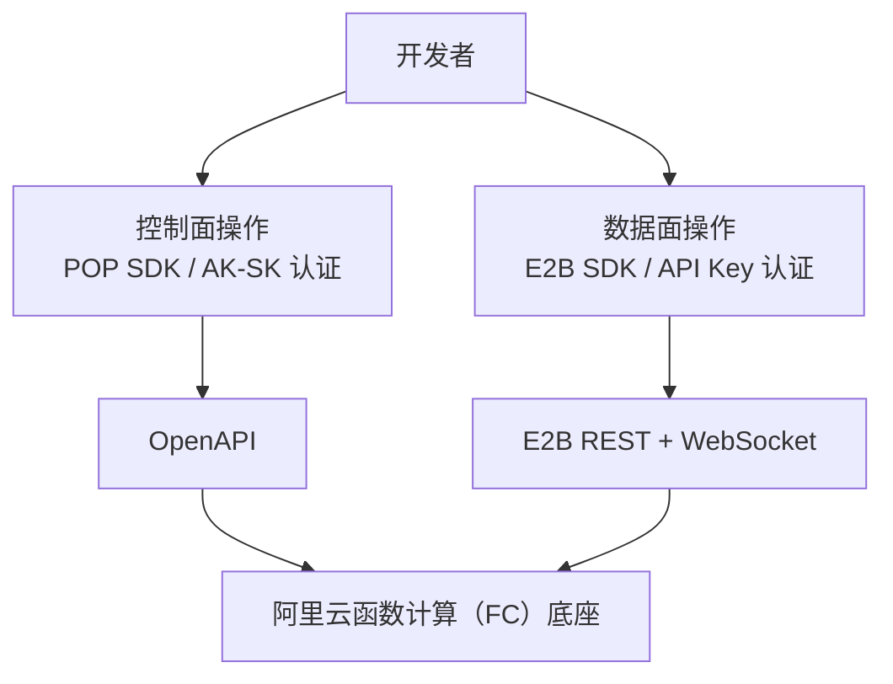

# E2B 云沙箱现状分析与痛点

> 文档版本：v1.0 | 最后更新：2026-09-01

---

## 1. E2B 产品简介

E2B（Environment to Build）是一个面向 AI Agent 的云端代码执行沙箱平台。其核心价值在于为大语言模型（LLM）提供一个安全、隔离的远程执行环境，使 AI Agent 能够在沙箱中运行任意代码而不影响宿主系统。

**核心特性：**

- 基于 Firecracker microVM 的轻量级安全隔离
- 亚秒级冷启动，适合 AI Agent 实时交互场景
- 支持 Python 和 Node.js SDK
- 内置 Code Interpreter，支持 Jupyter 内核
- 提供 REST API + WebSocket 双通道接口

**阿里云云沙箱（FC Agent Sandbox）** 完全兼容 E2B 协议，基于函数计算（FC）底座，在提供 E2B 兼容 API 的同时扩展了阿里云生态能力（VPC、OSS、自定义域名等）。用户可使用标准 E2B SDK 直接连接阿里云沙箱服务，仅需更换 API 端点即可无缝迁移。

---

## 2. E2B 兼容 API 完整清单

### 2.1 Sandbox 生命周期（10 个方法）

| 方法 | 说明 | 兼容状态 |
|------|------|----------|
| `Sandbox.create()` | 创建新沙箱实例 | ✅ 完全兼容 |
| `Sandbox.connect()` | 连接已有沙箱 | ✅ 完全兼容 |
| `Sandbox.list()` | 列出活跃沙箱 | ✅ 完全兼容 |
| `sandbox.getInfo()` | 获取沙箱详情 | ✅ 完全兼容 |
| `sandbox.kill()` | 终止沙箱 | ✅ 完全兼容 |
| `sandbox.setTimeout()` | 设置超时时间 | ✅ 完全兼容 |
| `sandbox.isRunning()` | 检查运行状态 | ✅ 完全兼容 |
| `sandbox.pause()` | 暂停沙箱（快照） | ⚠️ 需白名单 |
| `sandbox.uploadUrl()` / `sandbox.downloadUrl()` | 文件上传/下载 URL | ✅ 完全兼容 |
| `sandbox.getHost()` | 获取沙箱主机地址 | ✅ 完全兼容 |

### 2.2 Commands（5 个方法）

| 方法 | 说明 | 兼容状态 |
|------|------|----------|
| `sandbox.commands.run()` | 执行 Shell 命令 | ✅ 完全兼容 |
| `sandbox.commands.list()` | 列出运行中命令 | ✅ 完全兼容 |
| `sandbox.commands.connect()` | 连接已有命令 | ✅ 完全兼容 |
| `sandbox.commands.sendStdin()` | 发送标准输入 | ✅ 完全兼容 |
| `sandbox.commands.kill()` | 终止命令 | ✅ 完全兼容 |

### 2.3 Filesystem（9 个方法）

| 方法 | 说明 | 兼容状态 |
|------|------|----------|
| `sandbox.files.list()` | 列出目录内容 | ✅ 完全兼容 |
| `sandbox.files.exists()` | 检查路径存在性 | ✅ 完全兼容 |
| `sandbox.files.getInfo()` | 获取文件/目录信息 | ✅ 完全兼容 |
| `sandbox.files.read()` | 读取文件内容 | ✅ 完全兼容 |
| `sandbox.files.write()` | 写入文件内容 | ✅ 完全兼容 |
| `sandbox.files.makeDir()` | 创建目录 | ✅ 完全兼容 |
| `sandbox.files.remove()` | 删除文件/目录 | ✅ 完全兼容 |
| `sandbox.files.rename()` | 重命名/移动 | ✅ 完全兼容 |
| `sandbox.files.watchDir()` | 监听目录变化 | ✅ 完全兼容 |

> ⚠️ 注意：自定义元数据（Custom Metadata）不支持

### 2.4 Code Interpreter（5 个方法）

| 方法 | 说明 | 兼容状态 |
|------|------|----------|
| `sandbox.runCode()` | 执行代码（Jupyter） | ✅ 完全兼容 |
| `sandbox.createCodeContext()` | 创建代码上下文 | ✅ 完全兼容 |
| `sandbox.listCodeContexts()` | 列出代码上下文 | ✅ 完全兼容 |
| `sandbox.restartCodeContext()` | 重启代码上下文 | ✅ 完全兼容 |
| `sandbox.removeCodeContext()` | 移除代码上下文 | ✅ 完全兼容 |

### 2.5 Template

| 操作 | 说明 | 兼容状态 |
|------|------|----------|
| CRUD | 创建/读取/更新/删除模板 | ✅ 完全兼容 |
| Build | 构建自定义模板 | ✅ 完全兼容 |
| Tags | 模板标签管理 | ✅ 完全兼容 |

---

## 3. 认证方式

E2B SDK 通过三个环境变量完成认证与端点配置：

```bash
# API 密钥（必需）
export E2B_API_KEY="e2b_xxxxxxxxxxxxxxxxxxxxx"

# API 控制面端点（阿里云必需，原版 E2B 不需要）
export E2B_API_URL="https://agent-sandbox.{region}.fc.aliyuncs.com"

# 数据面域名后缀（阿里云必需，原版 E2B 不需要）
export E2B_DOMAIN="{region}.e2b.fc.aliyuncs.com"
```

**认证流程：**

1. 用户在阿里云控制台创建 API Key
2. 配置三个环境变量（需手动替换 `{region}` 为具体地域标识）
3. SDK 自动携带 API Key 完成请求认证

---

## 4. 兼容边界

### 4.1 完全兼容

| 模块 | 说明 |
|------|------|
| Sandbox 生命周期 | 全部 10 个方法完全兼容 |
| Commands | 全部 5 个方法完全兼容 |
| Code Interpreter | 全部 5 个方法完全兼容，支持 Python/JS/R/Java 内核 |
| Template | CRUD、构建、标签管理全部兼容 |
| Metrics | CPU/内存监控指标兼容（磁盘为占位值） |

### 4.2 部分兼容

| 模块 | 兼容情况 | 限制说明 |
|------|----------|----------|
| Filesystem | 核心 9 方法兼容 | 不支持自定义元数据（Custom Metadata） |
| CLI | 部分兼容 | `e2b sandbox`/`e2b template` 可用，其他子命令可能不支持 |

### 4.3 不兼容

| 模块 | 说明 |
|------|------|
| Snapshots | 快照 API 不支持（pause/resume 需白名单） |
| Volume API | E2B 原生 Volume 不支持（阿里云提供 AgenticFS 替代） |
| Team 管理 | 团队管理 API 不适用（使用阿里云 RAM 体系） |
| MCP Gateway | E2B 原生 MCP Gateway 不支持 |

### 4.4 受限功能

| 功能 | 表现 |
|------|------|
| 暂停/恢复（Pause/Resume） | 需申请白名单才能使用 |
| Logs API | 调用返回空数组，不报错 |
| Network Config Update | 返回成功（200），但不实际执行网络配置更新 |
| Metrics 磁盘指标 | 返回固定占位值，非真实磁盘用量 |

---

## 5. 十大痛点分析

### 痛点 1：配置繁琐 — 环境变量地域占位符机制

**问题描述：** 使用阿里云沙箱时，用户需手动拼接 `E2B_API_URL` 和 `E2B_DOMAIN` 两个 URL，并将其中的 `{region}` 占位符替换为具体地域标识。目前共有 8 个可用地域（cn-hangzhou, cn-shanghai, cn-beijing, cn-shenzhen, cn-qingdao, ap-southeast-1, us-west-1, eu-central-1），每个地域都需要独立配置。

**影响范围：**
- 新用户首次接入时容易配置出错（忘记替换占位符、拼写错误）
- 多地域部署时需维护多套环境变量
- 没有配置验证机制，错误配置只能在运行时发现

**理想状态：** SDK 应支持 `region` 参数，自动推导出 API_URL 和 DOMAIN，或提供配置文件/profile 机制。

---

### 痛点 2：资源泄漏 — 缺乏强制资源回收机制

**问题描述：** E2B SDK 不强制要求调用 `kill()` 终止沙箱。如果开发者忘记在代码中调用 `sandbox.kill()` 或程序异常退出，沙箱实例会持续运行直到超时，期间持续产生费用。

**影响范围：**
- 开发阶段频繁创建沙箱而忘记销毁，导致意外账单
- 异常退出场景（进程崩溃、网络断开）无法自动清理
- 缺乏上下文管理器（Context Manager）或 RAII 模式支持

**理想状态：** 提供 `with` 语句（Python）/ `using` 语句（JS/TS）的自动生命周期管理，确保沙箱在作用域结束时自动回收。

---

### 痛点 3：生命周期管理复杂 — 无复用与池化机制

**问题描述：** 每次使用沙箱都需要完整执行 `create → use → kill` 三阶段流程。没有内置的沙箱复用机制或连接池，对于高频 Agent 调用场景，每次都需要承受创建开销。

**影响范围：**
- 高频调用场景（如 Chat 对话中每轮执行代码）延迟高
- 无法在多个 Agent 间共享沙箱实例
- 无预热（Warm Pool）机制

**理想状态：** 提供声明式的沙箱获取机制（按需创建或复用已有），支持连接池和预热策略。

---

### 痛点 4：无声明式配置 — 所有配置必须通过代码指定

**问题描述：** E2B 的所有沙箱配置（镜像、超时、环境变量、资源规格等）必须在代码中命令式指定。没有配置文件（如 YAML/TOML）支持，也没有配置 Profile 概念。

**影响范围：**
- 配置散落在代码各处，难以统一管理
- 不同环境（开发/测试/生产）切换需修改代码
- 无法在 CI/CD 流水线中声明式管理沙箱配置

**理想状态：** 支持类似 `sandbox.yaml` 或 `sandbox.toml` 的声明式配置文件，代码中仅需引用配置名。

---

### 痛点 5：FC Extensions 缺失 — 阿里云生态能力无法通过 E2B SDK 使用

**问题描述：** 阿里云云沙箱基于函数计算（FC）底座，拥有丰富的平台能力（VPC 网络打通、OSS 对象存储挂载、自定义域名绑定、监控日志集成）。然而，E2B SDK 协议中没有对应接口，这些能力只能通过阿里云 OpenAPI / POP SDK 独立调用。

**影响范围：**
- 用户需要同时使用两套 SDK（E2B SDK + 阿里云 SDK），认知负担高
- VPC 内网访问配置流程复杂
- OSS 文件挂载需通过控制面单独配置
- 自定义域名绑定、监控告警等运维操作与沙箱代码脱节

**理想状态：** 统一 SDK 同时覆盖 E2B 兼容能力和阿里云扩展能力。

---

### 痛点 6：无 AI Agent 集成 — 缺少 MCP Server 与 Tool Schema

**问题描述：** E2B SDK 没有提供标准化的 AI Agent 集成方式。不支持 MCP（Model Context Protocol）Server，也没有将沙箱能力导出为 OpenAI Function Calling / Anthropic Tool Use 格式的 Tool Schema。

**影响范围：**
- AI Agent 框架（LangChain、CrewAI、AutoGen）集成需手动编写胶水代码
- IDE 插件（Cursor、Windsurf）无法自动发现沙箱能力
- MCP 生态无法直接使用沙箱

**理想状态：** 内置 MCP Server 支持，一键导出 Tool Schema，支持主流 Agent 框架即插即用。

---

### 痛点 7：无 Skills 系统 — 缺乏配置分享与复用机制

**问题描述：** E2B 没有类似 Modal Skills 的系统来封装和分发常见的沙箱配置模式。用户无法将"数据分析沙箱"、"Web 开发沙箱"等最佳实践打包分享。

**影响范围：**
- 每个用户都需要从零配置沙箱，重复劳动
- 社区无法形成共享生态
- 新用户缺乏最佳实践指导

**理想状态：** 提供 Skills 注册/安装/分享机制，内置常见场景预设，支持社区贡献。

---

### 痛点 8：模板能力有限 — 仅支持基础模板，无链式构建

**问题描述：** E2B 模板仅支持基于 Dockerfile 的基础构建，没有 Modal 那样的方法链式构建（`Image.debian_slim().apt_install().pip_install()`），也不支持模板继承和组合。

**影响范围：**
- 复杂环境构建需要编写完整 Dockerfile
- 无法按层缓存，修改一处需完整重建
- 模板复用能力弱

**理想状态：** 支持声明式镜像构建 DSL，支持模板继承、组合和分层缓存。

---

### 痛点 9：错误信息不友好 — 英文错误，无修复建议

**问题描述：** E2B SDK 抛出的错误信息均为英文，且缺乏上下文修复建议。对于阿里云特有的错误场景（如地域不可用、配额不足、VPC 配置错误），缺少针对性的错误码和引导。

**影响范围：**
- 中文开发者理解错误信息有障碍
- 排查问题需翻阅文档，无直接修复建议
- 阿里云特有错误场景缺乏专属错误码

**理想状态：** 提供中英双语错误信息，附带错误码、原因分析和推荐修复步骤。

---

### 痛点 10：无结构化输出 — CLI 不支持 JSON 输出

**问题描述：** E2B CLI 输出为纯文本格式，不支持 `--json` 或 `--output json` 参数。无法在脚本和自动化流水线中方便地解析输出。

**影响范围：**
- CI/CD 集成时需用正则或 awk 解析文本输出
- 自动化脚本脆弱，CLI 输出格式变化即崩溃
- 无法与 jq 等 JSON 工具链集成

**理想状态：** 所有 CLI 命令支持 `--output json` 参数，返回结构化 JSON 输出。

---

## 6. 阿里云差异化能力（FC Extensions）

以下为 E2B 协议无法覆盖的阿里云平台扩展能力，需通过独立 API 或统一 SDK 支持：

| 能力 | 说明 | 接入方式 |
|------|------|----------|
| **VPC 网络** | 沙箱接入用户 VPC，访问内网数据库、Redis 等 | 控制面 OpenAPI 配置 |
| **OSS 挂载** | 将 OSS Bucket 挂载为沙箱本地目录 | 控制面 OpenAPI 配置 |
| **自定义域名** | 为沙箱服务绑定自定义域名和 HTTPS 证书 | 控制面 OpenAPI 配置 |
| **监控日志** | 接入云监控、SLS 日志服务 | 控制面 OpenAPI 配置 |
| **Team 配额** | 基于阿里云 RAM 的团队资源配额管理 | 阿里云控制台 |
| **AgenticFS Volume** | 阿里云原生持久化卷，替代 E2B Volume API | 控制面 OpenAPI 配置 |

---

## 7. 双层 API 架构说明

阿里云云沙箱采用「控制面 + 数据面」双层 API 架构：

### 控制面（Control Plane）

- **协议**：阿里云 OpenAPI（POP SDK）
- **认证**：AK/SK（AccessKey ID + AccessKey Secret）
- **职责**：
  - 沙箱服务开通/配置
  - VPC、OSS 挂载、自定义域名等平台能力配置
  - Team/配额管理
  - API Key 管理
- **SDK**：阿里云 POP SDK（Python/Java/Go/Node.js）

### 数据面（Data Plane）

- **协议**：E2B REST API + WebSocket
- **认证**：API Key（E2B_API_KEY）
- **职责**：
  - 沙箱 CRUD 和生命周期管理
  - 命令执行和文件操作
  - Code Interpreter
  - 模板管理
- **SDK**：E2B SDK（Python/Node.js）

### 架构示意



---

## 8. 关键约束

| 约束项 | 详情 |
|--------|------|
| **可用地域** | 8 个：cn-hangzhou, cn-shanghai, cn-beijing, cn-shenzhen, cn-qingdao, ap-southeast-1, us-west-1, eu-central-1 |
| **Python 版本** | >= 3.10 |
| **Node.js 版本** | >= 20.18.1 |
| **SDK 版本锁定** | Python: `e2b==1.5.0`, `e2b-code-interpreter==1.2.0`；Node.js: `e2b@1.5.0`, `e2b-code-interpreter@1.2.0` |
| **沙箱超时** | 默认 5 分钟，最长 24 小时 |
| **并发限制** | 默认 20 个并发沙箱，可申请提升 |
| **模板构建** | 基于 Dockerfile，构建超时 10 分钟 |
| **文件大小** | 单文件上传/下载限制 100MB |

---

## 附录：参考资料

- [E2B 官方文档](https://e2b.dev/docs)
- [阿里云云沙箱文档](https://help.aliyun.com/zh/functioncompute/agent-sandbox)
- [E2B Python SDK](https://github.com/e2b-dev/e2b)
- [E2B Node.js SDK](https://github.com/e2b-dev/e2b-js)
