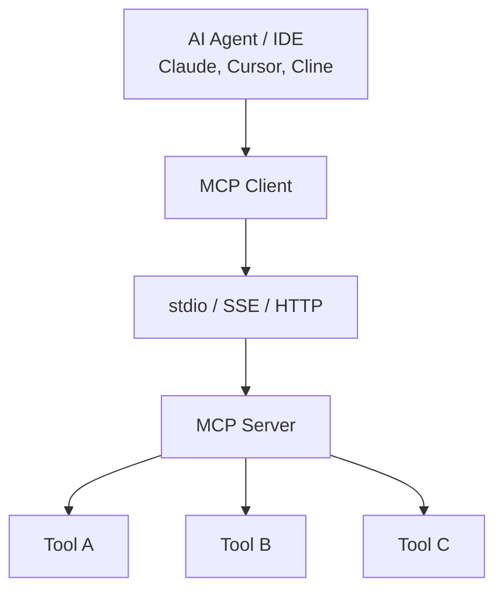
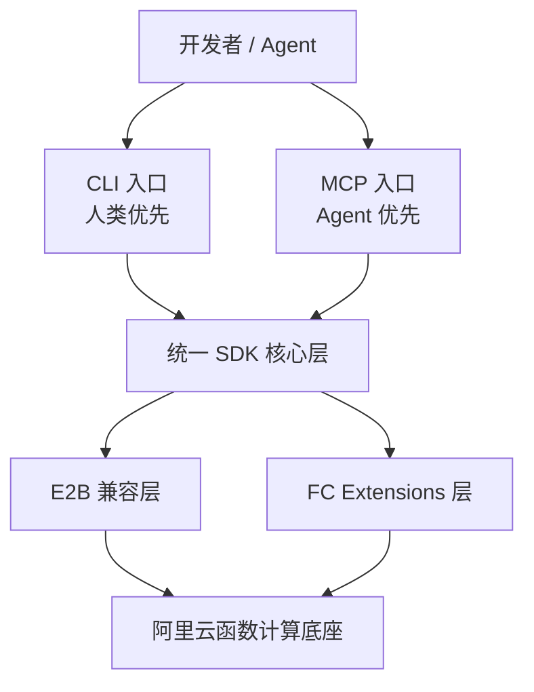
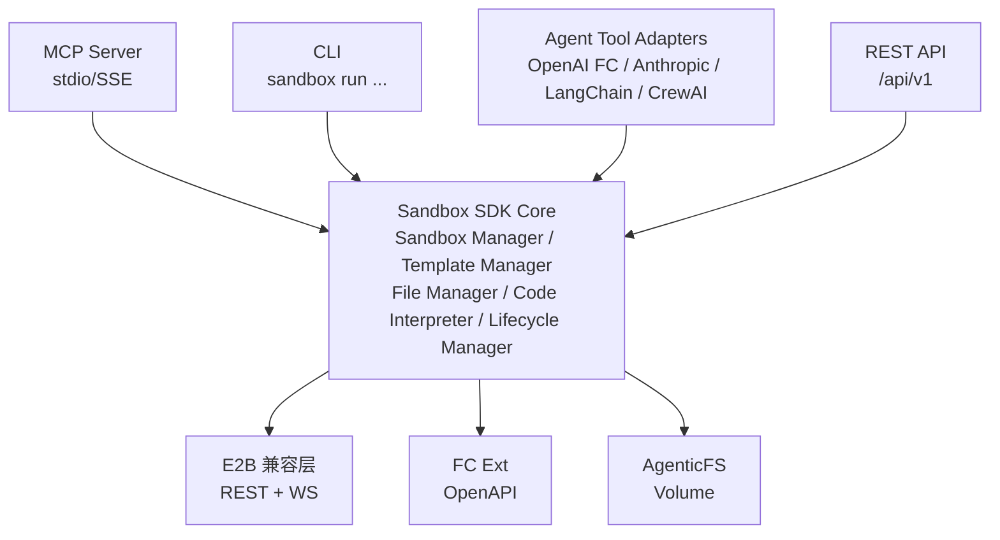

# MCP 与 AI Agent 集成调研

> 文档版本：v1.0 | 最后更新：2026-09-01

---

## 1. MCP 协议概述

### 1.1 什么是 MCP

MCP（Model Context Protocol）是由 Anthropic 主导设计的开放协议，旨在标准化大语言模型（LLM）与外部工具、数据源之间的交互方式。MCP 定义了一套统一的接口规范，使 AI Agent 能够以标准化方式发现、调用和组合各种外部能力。

**核心定位：** AI Agent 的"USB 接口" — 一次实现，处处可用。

### 1.2 核心概念

| 概念 | 说明 |
|------|------|
| **MCP Server** | 能力提供方，封装一个或多个 Tool，通过 MCP 协议暴露给客户端 |
| **MCP Client** | 能力消费方，通常是 AI Agent 或 IDE 插件（如 Claude Desktop、Cursor） |
| **Transport** | 通信传输层，支持 stdio（本地进程）和 SSE/HTTP（远程服务） |
| **Tool** | 最小能力单元，包含名称、描述、输入 Schema（JSON Schema）和执行逻辑 |
| **Resource** | 静态或动态数据源（文件、数据库记录等），供 LLM 读取上下文 |
| **Prompt** | 预定义的提示模板，引导 LLM 使用特定 Tool 组合 |

### 1.3 协议架构



### 1.4 Tool 定义格式

```json
{
  "name": "run_code",
  "description": "在云沙箱中执行代码并返回结果",
  "inputSchema": {
    "type": "object",
    "properties": {
      "code": {
        "type": "string",
        "description": "要执行的代码"
      },
      "language": {
        "type": "string",
        "enum": ["python", "javascript", "typescript"],
        "description": "编程语言"
      }
    },
    "required": ["code"]
  }
}
```

---

## 2. 现有沙箱 MCP Server 实现

### 2.1 E2B MCP（已废弃）

| 项目 | 说明 |
|------|------|
| **仓库** | `e2b-dev/mcp-server`（已归档） |
| **状态** | ⚠️ 已废弃，不再维护 |
| **Tools** | create_sandbox, run_code, install_packages |
| **废弃原因** | 功能过于简单，E2B 团队转向推荐直接使用 SDK |

**启示：** 仅提供基础 Tool 的 MCP Server 价值有限，需要更丰富的能力封装。

### 2.2 sandbox-mcp（社区项目）

| 项目 | 说明 |
|------|------|
| **仓库** | 社区维护 |
| **Tools** | create_sandbox, execute_command, read_file, write_file, upload_file |
| **特点** | 封装了 E2B SDK 的核心操作 |
| **不足** | 无沙箱池化、无模板管理、无错误恢复 |

### 2.3 Code Sandbox MCP

| 项目 | 说明 |
|------|------|
| **定位** | 通用代码沙箱 MCP Server |
| **后端** | 支持 E2B、Docker、本地进程多种后端 |
| **Tools** | run_code, create_file, read_file, install_package, list_files |
| **亮点** | 多后端抽象，可按需切换 |

### 2.4 Modal Sandbox MCP

| 项目 | 说明 |
|------|------|
| **定位** | Modal 官方 Sandbox MCP Server |
| **集成** | 通过 `modal skills install` 安装 |
| **Tools** | create_sandbox, exec_command, read_file, write_file, terminate_sandbox |
| **特点** | 与 Modal Skills 体系深度集成 |

### 2.5 对比总结

| 维度 | E2B MCP | sandbox-mcp | Code Sandbox MCP | Modal Sandbox MCP |
|------|---------|-------------|-------------------|-------------------|
| 维护状态 | ❌ 废弃 | ⚠️ 社区维护 | ✅ 活跃 | ✅ 官方维护 |
| Tool 数量 | 3 | 5 | 5 | 5 |
| 沙箱池化 | ❌ | ❌ | ❌ | ❌ |
| 多语言 | ❌ | ❌ | ✅ | ❌ |
| Skills 集成 | ❌ | ❌ | ❌ | ✅ |
| 错误恢复 | ❌ | ❌ | ⚠️ 基础 | ⚠️ 基础 |

---

## 3. MCP Tool 设计分析

根据云沙箱核心功能和用户场景，将 MCP Tools 按优先级分为三级：

### 3.1 P0 — 核心 Tools（必须实现）

| Tool | 说明 | 输入参数 | 输出 |
|------|------|---------|------|
| `create_sandbox` | 创建沙箱 | template, timeout, env_vars | sandbox_id, host |
| `run_code` | 执行代码 | code, language, sandbox_id? | stdout, stderr, results |
| `execute_command` | 执行 Shell 命令 | command, args, sandbox_id? | stdout, stderr, exit_code |
| `read_file` | 读取文件 | path, sandbox_id | content |
| `write_file` | 写入文件 | path, content, sandbox_id | success |
| `kill_sandbox` | 终止沙箱 | sandbox_id | success |

### 3.2 P1 — 增强 Tools（重要但非必须）

| Tool | 说明 | 输入参数 | 输出 |
|------|------|---------|------|
| `list_files` | 列出目录 | path, sandbox_id | files[] |
| `upload_file` | 上传文件 | path, content(base64), sandbox_id | success |
| `download_file` | 下载文件 | path, sandbox_id | content(base64) |
| `install_packages` | 安装依赖包 | packages[], language, sandbox_id | stdout, success |
| `list_sandboxes` | 列出沙箱 | tags? | sandboxes[] |
| `get_sandbox_info` | 获取沙箱信息 | sandbox_id | info |

### 3.3 P2 — 高级 Tools（差异化能力）

| Tool | 说明 | 输入参数 | 输出 |
|------|------|---------|------|
| `create_preview_url` | 创建预览 URL | port, sandbox_id | url |
| `configure_vpc` | 配置 VPC 网络 | vpc_id, vswitch_id | success |
| `mount_oss` | 挂载 OSS 存储 | bucket, mount_path | success |
| `pause_sandbox` | 暂停沙箱 | sandbox_id | success |
| `resume_sandbox` | 恢复沙箱 | sandbox_id | sandbox_id |
| `get_metrics` | 获取资源指标 | sandbox_id | cpu, memory, disk |

### 3.4 Tool 设计原则

1. **渐进式披露**：P0 Tools 覆盖 80% 场景，P1/P2 按需启用
2. **智能默认值**：sandbox_id 可选，自动创建或复用
3. **丰富描述**：每个 Tool 的 description 需详细说明用途、限制和示例
4. **错误可恢复**：返回结构化错误信息，附带修复建议
5. **幂等性**：重复调用不产生副作用

---

## 4. SDK 作为 Agent Tool 的设计模式

### 4.1 OpenAI Function Calling 格式

```json
{
  "type": "function",
  "function": {
    "name": "run_code_in_sandbox",
    "description": "在阿里云沙箱中执行代码。支持 Python、JavaScript、TypeScript。自动管理沙箱生命周期。",
    "parameters": {
      "type": "object",
      "properties": {
        "code": {
          "type": "string",
          "description": "要执行的代码内容"
        },
        "language": {
          "type": "string",
          "enum": ["python", "javascript", "typescript"],
          "default": "python",
          "description": "编程语言"
        },
        "timeout": {
          "type": "integer",
          "default": 30,
          "description": "执行超时时间（秒）"
        }
      },
      "required": ["code"]
    }
  }
}
```

**集成方式：**

```python
from openai import OpenAI
from aliyun_sandbox import get_openai_tools, handle_tool_call

client = OpenAI()
tools = get_openai_tools()  # 自动导出 Function Calling 格式

response = client.chat.completions.create(
    model="gpt-4",
    messages=[{"role": "user", "content": "帮我分析这组数据..."}],
    tools=tools,
)

# 处理 tool_call
for tool_call in response.choices[0].message.tool_calls:
    result = handle_tool_call(tool_call)
```

### 4.2 Anthropic Tool Use 格式

```json
{
  "name": "run_code_in_sandbox",
  "description": "在阿里云沙箱中执行代码。支持 Python、JavaScript、TypeScript。",
  "input_schema": {
    "type": "object",
    "properties": {
      "code": {
        "type": "string",
        "description": "要执行的代码内容"
      },
      "language": {
        "type": "string",
        "enum": ["python", "javascript", "typescript"]
      }
    },
    "required": ["code"]
  }
}
```

**集成方式：**

```python
import anthropic
from aliyun_sandbox import get_anthropic_tools, handle_tool_use

client = anthropic.Anthropic()
tools = get_anthropic_tools()  # 自动导出 Anthropic Tool Use 格式

response = client.messages.create(
    model="claude-sonnet-4-20250514",
    tools=tools,
    messages=[{"role": "user", "content": "帮我分析这组数据..."}],
)
```

### 4.3 LangChain 集成

```python
from langchain.agents import create_tool_calling_agent
from aliyun_sandbox.integrations.langchain import SandboxToolkit

# 获取 LangChain Tool 集合
toolkit = SandboxToolkit(region="cn-hangzhou")
tools = toolkit.get_tools()

# 创建 Agent
agent = create_tool_calling_agent(llm, tools, prompt)
agent_executor = AgentExecutor(agent=agent, tools=tools)
result = agent_executor.invoke({"input": "帮我分析数据..."})
```

### 4.4 CrewAI 集成

```python
from crewai import Agent, Task, Crew
from aliyun_sandbox.integrations.crewai import SandboxTool

sandbox_tool = SandboxTool(region="cn-hangzhou")

data_analyst = Agent(
    role="数据分析师",
    goal="分析用户提供的数据并生成报告",
    tools=[sandbox_tool],
)

task = Task(
    description="分析 sales.csv 中的销售趋势",
    agent=data_analyst,
)

crew = Crew(agents=[data_analyst], tasks=[task])
result = crew.kickoff()
```

### 4.5 AutoGen 集成

```python
from autogen import AssistantAgent, UserProxyAgent
from aliyun_sandbox.integrations.autogen import register_sandbox_tools

assistant = AssistantAgent("assistant", llm_config=llm_config)
user_proxy = UserProxyAgent("user_proxy", code_execution_config=False)

# 注册沙箱工具
register_sandbox_tools(assistant, user_proxy, region="cn-hangzhou")

user_proxy.initiate_chat(assistant, message="帮我分析数据...")
```

---

## 5. Skills 系统（agentskills.io 标准）

### 5.1 渐进式披露设计

Skills 系统采用三层渐进式披露架构：

| 层级 | 说明 | 示例 |
|------|------|------|
| **Level 0 — 零配置** | 安装即用，默认配置开箱即用 | `sandbox-sdk skills install data-analysis` |
| **Level 1 — 基础定制** | 通过参数调整常用配置 | `sandbox-sdk skills install data-analysis --memory 4G` |
| **Level 2 — 完全控制** | 编辑 SKILL.md 自定义所有细节 | 修改模板、环境变量、依赖等 |

### 5.2 SKILL.md 格式

每个 Skill 由一个 `SKILL.md` 文件定义，包含元数据和使用说明：

```markdown
---
name: data-analysis
version: 1.0.0
description: 数据分析沙箱 — 预装 pandas、matplotlib、seaborn
author: aliyun-sandbox
tags: [data, analysis, visualization]
template: data-analysis-python
timeout: 1800
memory: 4096
---

# 数据分析沙箱

## 概述
提供预配置的数据分析环境，预装常用数据科学库。

## 预装依赖
- pandas >= 2.0
- matplotlib >= 3.7
- seaborn >= 0.12
- plotly >= 5.15
- scikit-learn >= 1.3

## 使用方式

### 基础使用
\```python
from aliyun_sandbox import Sandbox

sb = Sandbox.from_skill("data-analysis")
result = sb.run_code("""
import pandas as pd
df = pd.read_csv('/data/sales.csv')
print(df.describe())
""")
\```

### 高级配置
\```python
sb = Sandbox.from_skill("data-analysis", memory=8192, timeout=3600)
\```

## 注意事项
- 默认超时 30 分钟
- 大数据集建议增加内存到 8G
```

### 5.3 分发机制

| 渠道 | 说明 | 命令 |
|------|------|------|
| **官方仓库** | 阿里云维护的 Skill 仓库 | `sandbox-sdk skills install <name>` |
| **GitHub** | 从 GitHub 仓库安装 | `sandbox-sdk skills install github:user/repo` |
| **本地文件** | 从本地 SKILL.md 安装 | `sandbox-sdk skills install ./my-skill/` |
| **npm/PyPI** | 作为包分发 | `npx @aliyun/sandbox-skills add <name>` |

### 5.4 安装选项

| 选项 | 说明 |
|------|------|
| `--global` | 全局安装，所有项目可用 |
| `--claude` | 安装为 Claude Desktop MCP Skill |
| `--cursor` | 安装为 Cursor IDE Skill |
| `--project` | 安装到当前项目（默认） |

---

## 6. CLI vs MCP 对比

### 6.1 对比矩阵

| 维度 | CLI | MCP Server |
|------|-----|------------|
| **调用方式** | Shell 命令 | JSON-RPC over stdio/HTTP |
| **适用场景** | 开发者手动操作、CI/CD 脚本 | AI Agent 自动调用、IDE 集成 |
| **部署方式** | 安装 CLI 工具 | 启动 MCP Server 进程 / 远程服务 |
| **发现机制** | `--help`、`man` 页面 | `tools/list` 自动发现 |
| **输入格式** | 命令行参数 + 标志 | JSON（结构化） |
| **输出格式** | 文本 / JSON（需 `--json`） | JSON（始终结构化） |
| **错误处理** | 退出码 + stderr | 结构化错误对象 |
| **可组合性** | 管道（pipe）组合 | Tool 链式调用 |
| **状态管理** | 无状态 | 可有状态（会话保持） |
| **认证** | 环境变量 / 配置文件 | 配置文件 / 传输层认证 |
| **交互性** | 支持交互式输入 | 通常非交互式 |
| **调试** | `--verbose`, `--debug` | 日志 + 调试端点 |

### 6.2 使用场景推荐

#### CLI 优先场景

- **开发者日常操作**：创建沙箱、查看状态、管理模板
- **CI/CD 集成**：Shell 脚本中自动化操作
- **调试排查**：交互式连接沙箱、查看日志
- **一次性操作**：批量清理沙箱、更新配置

```bash
# CI/CD 中使用 CLI
sandbox create --template ci-runner --timeout 600 --json | jq '.sandbox_id'
sandbox exec $SANDBOX_ID -- npm test
sandbox kill $SANDBOX_ID
```

#### MCP 优先场景

- **AI Agent 自动调用**：LLM 决策调用沙箱能力
- **IDE 插件集成**：Cursor、Claude Desktop 中使用
- **Agent 框架集成**：LangChain、CrewAI 中作为 Tool
- **多步编排**：Agent 自主决策创建、执行、清理

```json
{
  "method": "tools/call",
  "params": {
    "name": "run_code",
    "arguments": {
      "code": "import pandas as pd; df = pd.read_csv('data.csv'); print(df.head())",
      "language": "python"
    }
  }
}
```

### 6.3 互补关系

CLI 和 MCP 不是替代关系，而是互补关系：



**设计建议：**
- CLI 和 MCP Server 共享同一个 SDK 核心层
- CLI 输出人类可读格式（默认）和 JSON 格式（`--json`）
- MCP Server 始终输出结构化 JSON
- 两者支持相同的功能集，仅交互方式不同

---

## 7. 集成架构建议

### 7.1 统一接入层



### 7.2 Tool Schema 自动导出

SDK 应支持从核心功能自动导出各格式的 Tool Schema：

```python
from aliyun_sandbox import SandboxSDK

sdk = SandboxSDK(region="cn-hangzhou")

# 导出 OpenAI Function Calling 格式
openai_tools = sdk.export_tools(format="openai")

# 导出 Anthropic Tool Use 格式
anthropic_tools = sdk.export_tools(format="anthropic")

# 导出 MCP Tool 格式
mcp_tools = sdk.export_tools(format="mcp")

# 导出 LangChain Tool 格式
langchain_tools = sdk.export_tools(format="langchain")
```

---

## 附录：参考资料

- [MCP 协议规范](https://spec.modelcontextprotocol.io/)
- [MCP TypeScript SDK](https://github.com/modelcontextprotocol/typescript-sdk)
- [MCP Python SDK](https://github.com/modelcontextprotocol/python-sdk)
- [Anthropic MCP 文档](https://docs.anthropic.com/en/docs/agents-and-tools/mcp)
- [OpenAI Function Calling](https://platform.openai.com/docs/guides/function-calling)
- [LangChain Tools](https://python.langchain.com/docs/modules/tools/)
- [agentskills.io](https://agentskills.io/)
