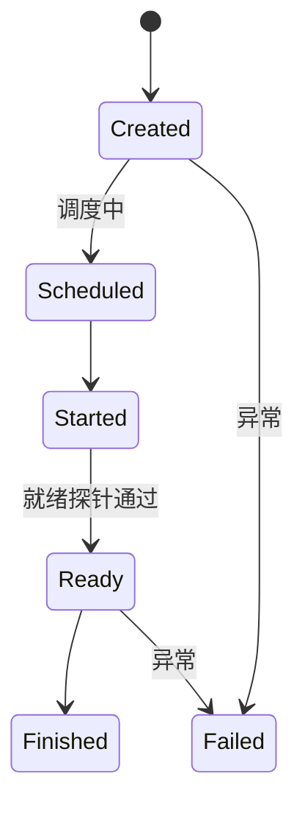

# Modal.com 设计模式深度分析

> 文档版本：v1.0 | 最后更新：2026-09-01

---

## 1. Modal 核心理念

**"Everything is Code, Zero YAML"**

Modal 的设计哲学是将所有基础设施配置内嵌到 Python 代码中，彻底消除 YAML/JSON/TOML 等外部配置文件。开发者通过 Python 装饰器和方法链声明计算资源、镜像依赖、调度策略等，实现"基础设施即代码"（Infrastructure as Code）的极致形态。

**核心原则：**

- **零配置文件**：不需要 Dockerfile、docker-compose.yml、Kubernetes YAML
- **声明式 Python**：通过装饰器参数声明资源需求，运行时自动调度
- **原子部署**：一个 `modal deploy` 命令完成从镜像构建到服务上线的全流程
- **即时反馈**：`modal run` 在云端执行，本地仅做编排，实现秒级迭代

---

## 2. 装饰器 API 体系

### 2.1 `modal.App` — 应用容器

`App` 是 Modal 的顶层组织单元，所有函数、类、资源都挂载在 App 下。每个 App 是一个原子部署单元。

```python
import modal

app = modal.App("my-application")
```

**核心特性：**
- 唯一命名，支持部署和版本管理
- 所有装饰器通过 `app` 实例关联
- 支持 `lookup()` 远程引用已部署应用

### 2.2 `@app.function()` — 核心函数装饰器

这是 Modal 最基础的抽象，将普通 Python 函数变为云函数。

```python
@app.function(
    gpu="A100",                          # GPU 类型
    image=modal.Image.debian_slim(),     # 运行镜像
    secrets=[modal.Secret.from_name("my-secret")],  # 密钥注入
    volumes={"/data": modal.Volume.from_name("my-vol")},  # 卷挂载
    cpu=2.0,                             # CPU 核数
    memory=4096,                         # 内存（MB）
    timeout=3600,                        # 超时（秒）
    schedule=modal.Cron("0 * * * *"),    # 定时调度
    retries=3,                           # 重试次数
    concurrency_limit=10,                # 并发限制
)
def train_model(data_path: str):
    import torch
    # ... 训练逻辑
```

**关键参数：**

| 参数 | 类型 | 说明 |
|------|------|------|
| `gpu` | str/GPU | GPU 规格：`"T4"`, `"A10G"`, `"A100"`, `"H100"`, `modal.gpu.A100(count=4)` |
| `image` | Image | 运行环境镜像 |
| `secrets` | list[Secret] | 环境变量密钥列表 |
| `volumes` | dict | 卷挂载映射 `{路径: Volume}` |
| `cpu` | float | CPU 核数（0.125 ~ 16） |
| `memory` | int | 内存 MB（128 ~ 65536） |
| `timeout` | int | 函数执行超时（秒） |
| `schedule` | Schedule | 定时调度（Cron/Period） |
| `retries` | int | 失败重试次数 |
| `concurrency_limit` | int | 最大并发数 |

### 2.3 `@app.cls()` + `@modal.method()` — 有状态类装饰器

用于需要在多次调用间保持状态的场景（如加载模型后复用）。

```python
@app.cls(gpu="A100", image=inference_image)
class ModelServer:
    @modal.enter()
    def load_model(self):
        """容器启动时执行一次 — 加载模型到 GPU"""
        self.model = load_heavy_model()
        self.tokenizer = load_tokenizer()

    @modal.method()
    def predict(self, text: str) -> str:
        """每次调用执行"""
        tokens = self.tokenizer(text)
        return self.model.generate(tokens)

    @modal.exit()
    def cleanup(self):
        """容器销毁前执行"""
        del self.model
        torch.cuda.empty_cache()
```

**生命周期钩子：**

| 装饰器 | 触发时机 | 用途 |
|--------|---------|------|
| `@modal.enter()` | 容器首次启动 | 模型加载、连接初始化 |
| `@modal.method()` | 每次远程调用 | 业务逻辑执行 |
| `@modal.exit()` | 容器即将销毁 | 资源清理、连接关闭 |

### 2.4 `@app.local_entrypoint()` — 本地入口点

在本地机器上运行，自动解析 CLI 参数，用于编排远程函数调用。

```python
@app.local_entrypoint()
def main(input_path: str, epochs: int = 10):
    # 本地执行，远程调用
    result = train_model.remote(input_path)
    print(f"Training complete: {result}")
```

**特性：**
- 函数参数自动转为 CLI 参数（`--input-path`, `--epochs`）
- 本地执行，可访问本地文件和环境变量
- 通过 `.remote()` 调用分发到云端

### 2.5 Web 装饰器

| 装饰器 | 说明 | 典型场景 |
|--------|------|---------|
| `@modal.fastapi_endpoint()` | 将方法暴露为 FastAPI 端点 | REST API |
| `@modal.asgi_app` | 挂载完整 ASGI 应用 | FastAPI/Starlette 应用 |
| `@modal.wsgi_app` | 挂载完整 WSGI 应用 | Flask/Django 应用 |

```python
@app.cls()
class WebApp:
    @modal.fastapi_endpoint(method="POST")
    def inference(self, request: InferenceRequest):
        return {"result": self.model.predict(request.text)}
```

---

## 3. Image 系统（方法链式构建）

Modal 的 Image 系统是其最精妙的设计之一，通过方法链（Method Chaining）声明镜像构建步骤，替代 Dockerfile。

### 3.1 基础镜像

| 方法 | 说明 |
|------|------|
| `Image.debian_slim()` | 精简 Debian 镜像（默认选择） |
| `Image.from_registry("nvidia/cuda:12.2.0-devel-ubuntu22.04")` | 从 Docker Registry 拉取 |
| `Image.from_name("my-base")` | 引用已保存的 Modal 镜像 |
| `Image.micromamba()` | Conda 兼容镜像（科学计算） |

### 3.2 链式构建方法

```python
image = (
    modal.Image.debian_slim(python_version="3.11")
    .apt_install("git", "ffmpeg", "libsm6")
    .pip_install("torch==2.1.0", "transformers==4.36.0")
    .env({"HF_HOME": "/cache/huggingface"})
    .run_commands("git clone https://github.com/example/repo /app")
    .add_local_dir("./src", remote_path="/app/src")
    .add_local_python_source("my_package")
)
```

**构建方法清单：**

| 方法 | 说明 | 示例 |
|------|------|------|
| `apt_install()` | 安装系统包 | `.apt_install("git", "curl")` |
| `pip_install()` | pip 安装 Python 包 | `.pip_install("numpy", "pandas")` |
| `uv_pip_install()` | 使用 uv（更快）安装 | `.uv_pip_install("torch")` |
| `env()` | 设置环境变量 | `.env({"KEY": "value"})` |
| `run_commands()` | 执行 Shell 命令 | `.run_commands("make build")` |
| `run_function()` | 在构建时执行 Python 函数 | `.run_function(download_model)` |
| `add_local_dir()` | 添加本地目录 | `.add_local_dir("./app")` |
| `add_local_python_source()` | 添加本地 Python 模块 | `.add_local_python_source("pkg")` |

### 3.3 构建特性

- **按层缓存**：每个方法调用对应一个构建层，未变更的层自动缓存
- **GPU 构建支持**：`gpu` 参数允许在构建阶段使用 GPU（如编译 CUDA 扩展）
- **强制重建**：`force_build=True` 跳过缓存强制重建

---

## 4. 资源管理

### 4.1 Volume（持久化卷）

```python
# 创建/引用
vol = modal.Volume.from_name("my-data", create_if_missing=True)

# 挂载到函数
@app.function(volumes={"/data": vol})
def process():
    with open("/data/input.csv") as f:
        # 读写持久化数据
        pass
```

**特性：**
- 跨函数/跨部署持久化
- 支持并发读写
- 自动快照和版本管理

### 4.2 Secret（密钥管理）

**三种创建方式：**

| 方式 | 说明 | 示例 |
|------|------|------|
| Dashboard | Web 控制台创建 | 最常用，支持 UI 编辑 |
| CLI | 命令行创建 | `modal secret create my-secret KEY=value` |
| 编程式 | 代码中创建 | `Secret.from_dict({"KEY": "value"})` |

```python
@app.function(secrets=[modal.Secret.from_name("openai-key")])
def call_api():
    import os
    api_key = os.environ["OPENAI_API_KEY"]
```

---

## 5. Modal Sandbox 功能

Modal Sandbox 是 Modal 提供的交互式沙箱环境，专为 AI Agent 代码执行场景设计。

### 5.1 创建沙箱

```python
sb = modal.Sandbox.create(
    app=app,
    image=modal.Image.debian_slim().pip_install("numpy"),
    volumes={"/data": vol},
    secrets=[secret],
    timeout=3600,           # 最大存活时间（秒）
    idle_timeout=300,       # 空闲超时（秒）
    readiness_probe=modal.Sandbox.TCPProbe(port=8080),  # 就绪探针
    name="my-sandbox",      # 命名（可选）
)
```

### 5.2 执行命令

```python
# 执行命令并获取输出
result = sb.exec("python", "-c", "print('hello')")
print(result.stdout.read())
print(result.stderr.read())
print(result.returncode)
```

### 5.3 生命周期管理

| 方法 | 说明 |
|------|------|
| `wait_until_ready()` | 等待沙箱就绪（结合 readiness_probe） |
| `poll()` | 检查沙箱状态 |
| `terminate()` | 终止沙箱 |
| `detach()` | 分离沙箱（后台运行） |

### 5.4 引用已有沙箱

```python
# 通过 ID 引用
sb = modal.Sandbox.from_id(sandbox_id)

# 通过名称引用
sb = modal.Sandbox.from_name("my-sandbox")
```

### 5.5 标签系统

```python
# 设置标签
sb.set_tags({"env": "prod", "user": "alice"})

# 按标签过滤
sandboxes = modal.Sandbox.list(tags={"env": "prod"})
```

### 5.6 就绪探针

| 探针类型 | 说明 | 配置 |
|---------|------|------|
| TCP Probe | 检测端口是否可达 | `TCPProbe(port=8080)` |
| Exec Probe | 执行命令检测 | `ExecProbe(command=["curl", "localhost:8080/health"])` |

### 5.7 生命周期事件



**状态说明：**

| 状态 | 说明 |
|------|------|
| `Created` | 沙箱对象已创建 |
| `Scheduled` | 等待资源调度 |
| `Started` | 容器启动中 |
| `Ready` | 就绪探针通过，可接受请求 |
| `Finished` | 正常结束 |
| `Failed` | 异常终止 |

---

## 6. CLI 命令结构

Modal CLI 采用 Git 风格的子命令结构：

| 命令 | 说明 |
|------|------|
| `modal run` | 在云端运行脚本 |
| `modal deploy` | 部署应用（持久化） |
| `modal serve` | 本地开发模式（热重载） |
| `modal shell` | 进入云端交互式 Shell |
| `modal curl` | 调用已部署端点 |
| `modal app list` | 列出已部署应用 |
| `modal app stop` | 停止应用 |
| `modal container list` | 列出运行中容器 |
| `modal container exec` | 进入容器 |
| `modal endpoint list` | 列出 Web 端点 |
| `modal volume list/get/put` | 卷管理 |
| `modal secret list/create` | 密钥管理 |
| `modal image list` | 镜像管理 |
| `modal skills install/update/show` | Skills 管理 |

---

## 7. Skills 系统

Modal 的 Skills 系统允许用户安装和使用预打包的沙箱配置模式。

### 7.1 CLI 操作

```bash
# 安装 Skill
modal skills install data-analysis

# 更新 Skill
modal skills update data-analysis

# 查看 Skill 详情
modal skills show data-analysis
```

### 7.2 安装选项

| 选项 | 说明 |
|------|------|
| `--global` | 全局安装（所有项目可用） |
| `--claude` | 安装为 Claude Desktop MCP Skills |
| 默认 | 安装到当前项目 |

### 7.3 外部分发

```bash
# 通过 npx 安装
npx skills add modal/data-analysis
```

### 7.4 Skills 设计原则

- **渐进式披露**：基础用法简单，高级配置按需展开
- **自文档化**：每个 Skill 包含完整使用文档
- **可组合**：多个 Skills 可组合使用
- **版本化**：支持版本管理和更新

---

## 8. 值得借鉴的设计点

### 8.1 装饰器声明式 API

**亮点：** 将基础设施配置内嵌到业务代码中，零认知切换成本。开发者不需要离开 Python 环境就能完成全部配置。

**借鉴方向：** 阿里云 SDK 可提供类似的声明式 API，通过装饰器或配置对象一站式声明沙箱规格。

### 8.2 方法链式 Image 构建

**亮点：** 比 Dockerfile 更直观，按层缓存效率高，支持 Python 原生逻辑（条件构建、循环安装）。

**借鉴方向：** 可设计类似的模板构建 DSL，降低自定义模板门槛。

### 8.3 `@modal.enter()` / `@modal.exit()` 生命周期

**亮点：** 完美解决模型加载等重量级初始化场景，容器复用时只需执行业务方法。

**借鉴方向：** 沙箱初始化脚本（init script）可借鉴此模式。

### 8.4 Skills 生态

**亮点：** 降低入门门槛，社区驱动的最佳实践分发。

**借鉴方向：** 构建阿里云沙箱 Skills 体系，内置常见场景预设。

### 8.5 就绪探针

**亮点：** 确保沙箱在真正就绪后才接受请求，避免服务不可用。

**借鉴方向：** 在沙箱创建流程中支持就绪检测。

---

## 9. 需要调整的设计点

### 9.1 Python-Only 限制

**问题：** Modal 仅支持 Python SDK，无 Node.js/Go/Java 支持。对于非 Python 团队不友好。

**调整方向：** 阿里云 SDK 需同时支持 Python 和 Node.js（至少），考虑未来扩展到 Go/Java。

### 9.2 强绑定云服务

**问题：** Modal 函数只能在 Modal 云上运行，无 BYOC（Bring Your Own Cloud）或本地运行选项。

**调整方向：** 基于 FC 的 Serverless 底座，天然支持多地域部署，未来可探索混合云场景。

### 9.3 学习曲线

**问题：** 装饰器 API 虽然简洁，但对 Python 初学者有一定学习门槛（装饰器、方法链等高级语法）。

**调整方向：** 提供命令式和声明式两种 API 风格，满足不同水平开发者。

### 9.4 调试困难

**问题：** 云端执行时调试困难，print 调试依赖日志回传，断点调试不可用。

**调整方向：** 提供更好的本地模拟和远程调试能力。

### 9.5 无 E2B 兼容性

**问题：** Modal Sandbox API 与 E2B 不兼容，生态孤立。

**调整方向：** 阿里云通过 E2B 兼容保持生态连通性，同时扩展差异化能力。

---

## 附录：参考资料

- [Modal 官方文档](https://modal.com/docs)
- [Modal GitHub](https://github.com/modal-labs/modal-client)
- [Modal Sandbox 文档](https://modal.com/docs/guide/sandbox)
- [Modal Skills 文档](https://modal.com/docs/guide/skills)
