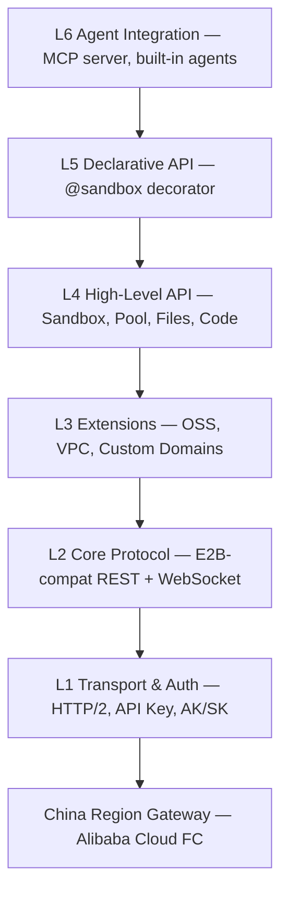

# Easy Sandbox

<!-- badges — these light up once CI is enabled and the package is published to PyPI -->
[](https://github.com/Easy-Sandbox/easy-sandbox/actions/workflows/ci.yml)
[](https://pypi.org/project/easy-sandbox/)
[](https://pypi.org/project/easy-sandbox/)
[](LICENSE)

> Create, manage, and interact with cloud sandboxes for AI agents.

**Easy Sandbox** is a Python SDK and CLI (`ebx`) for the Alibaba Cloud FC Agent Sandbox service.
It is **E2B-protocol compatible** with extensions for the Alibaba Cloud ecosystem (OSS, VPC, custom domains).

---

## Features

- **Async-first SDK** — `Sandbox.create()`, code execution, file I/O, port forwarding, and WebSocket streaming.
- **Declarative decorator** — `@sandbox` turns a plain function into a remote sandbox execution with automatic serialisation.
- **CLI (`ebx`)** — create, inspect, exec, upload/download, and manage sandboxes from the terminal.
- **Template system** — reusable sandbox images (Python, Node, browser automation, AI agents, …).
- **MCP server** — expose sandbox operations as an MCP tool server for LLM agents.
- **Session persistence** — save and restore sandbox state across runs (local or OSS-backed).
- **Framework integrations** — LangChain, CrewAI, AutoGen adapters (_Coming Soon_).
- **E2B compatibility layer** — drop-in replacement for projects already using the E2B SDK.

## Installation

```bash
# Core SDK only
pip install easy-sandbox

# With the CLI
pip install "easy-sandbox[cli]"

# CLI + official template API (build-local / template create)
pip install "easy-sandbox[cli,alicloud]"

# Everything (CLI + MCP + fast JSON + sessions + declarative + alicloud)
pip install "easy-sandbox[all]"

# Development (includes test & lint tooling)
pip install -e ".[dev]"
```

## Quick Start — SDK

```python
from easy_sandbox import Sandbox

async def main():
    async with await Sandbox.create(template="python-base") as sb:
        # Run code
        result = await sb.run_code("print('Hello from sandbox!')")
        print(result.text)  # Hello from sandbox!

        # File operations
        await sb.filesystem.write("/tmp/data.txt", b"hello")
        content = await sb.filesystem.read("/tmp/data.txt")

        # Shell commands
        proc = await sb.commands.run("ls -la /tmp")
        print(proc.stdout)
```

## Quick Start — CLI

```bash
# Configure credentials
ebx config set api_key <YOUR_API_KEY>

# Sandbox lifecycle
ebx create --template python-base       # create a sandbox
ebx list                                 # list running sandboxes
ebx info <sandbox-id>                    # inspect a sandbox
ebx exec <sandbox-id> "echo hello"       # run a command
ebx connect <sandbox-id>                 # interactive shell

# File transfer
ebx upload <sandbox-id> ./local.txt /remote/path.txt
ebx download <sandbox-id> /remote/path.txt ./local.txt

# Install community templates
ebx install owner/repo                   # install from GitHub

# Manage templates
ebx template list
ebx template info python-base

# Create template from existing image (official API, requires AK/SK + alicloud extra)
pip install "easy-sandbox[alicloud]"
ebx template create registry.cn-hangzhou.aliyuncs.com/ns/repo:tag --name my-tpl

# Build locally and register template (default: official API, requires AK/SK + alicloud extra)
pip install "easy-sandbox[alicloud]"   # if not already installed with [cli,alicloud] or [all]
ebx template build-local ./examples/templates/python-hello \
    --acr-namespace my-ns --acr-repo python-hello

# Build locally using legacy v3/v2 API
ebx template build-local ./my-template \
    --acr-namespace my-ns --legacy-api

# MCP server
ebx mcp start                            # start MCP tool server

# Cleanup
ebx kill <sandbox-id>
```

## Templates

Ready-made sandbox templates live in [`examples/templates/`](examples/templates/):

| Template | Description |
|----------|-------------|
| `python-hello` | Minimal Python sandbox |
| `node-web` | Node.js web application |
| `browser-automation` | Headless browser with Playwright |
| `claude-code` | Claude Code agent harness |
| `codex` | OpenAI Codex agent harness |
| `qoder` | Qoder agent harness |
| `qwen-code` | Qwen-Code agent harness _(WIP — template shell only)_ |
| `deepseek-harness` | DeepSeek agent harness |
| `hermes-agent` | Hermes agent harness |
| `openclaw` | OpenClaw agent harness |

See each template directory for its `Dockerfile`, `template.yaml`, and `README.md`.

## Architecture



Lower layers never import upper layers. Full design: [`docs/zh/design/architecture.md`](docs/zh/design/architecture.md) (Chinese).

## Documentation

> Full documentation index: [`docs/README.md`](docs/README.md) (bilingual navigation)
>
> The documentation is currently in Chinese. English translations are in progress.
> Links below point to the Chinese versions.

### Tutorials

| Guide | Description |
|-------|-------------|
| [Getting Started](docs/zh/guide/getting-started.md) | First steps with Easy Sandbox — install, configure, create a sandbox |
| [CLI Tutorial](docs/zh/guide/cli-tutorial.md) | End-to-end walkthrough of the `ebx` command-line tool |
| [SDK Usage](docs/zh/guide/sdk-usage.md) | Using the Python SDK for sandbox operations |

### How-to Guides

| Guide | Description |
|-------|-------------|
| [Authentication](docs/zh/guide/authentication.md) | Configure API Key, AK/SK, and credential priority |
| [Using Templates](docs/zh/guide/using-templates.md) | Discover, install, and launch sandbox templates |
| [Authoring Templates](docs/zh/guide/authoring-templates.md) | Create and publish your own sandbox templates |
| [Deploy & Build](docs/zh/guide/deploy-and-build.md) | Build images and deploy sandboxes to production |
| [Declarative Usage](docs/zh/guide/declarative-usage.md) | Use the `@sandbox` decorator for remote execution |
| [MCP Integration](docs/zh/guide/mcp-integration.md) | Expose sandbox operations as MCP tools for LLM agents |
| [Session Persistence](docs/zh/guide/session-persistence.md) | Save and restore sandbox state across runs |
| [Migrate from E2B](docs/zh/guide/migrate-from-e2b.md) | Drop-in migration guide from the E2B SDK |
| [Troubleshooting](docs/zh/guide/troubleshooting.md) | Common issues, diagnostics, and fixes |

### Reference

| Document | Description |
|----------|-------------|
| [API Reference](docs/zh/reference/api-reference.md) | Complete Python SDK API documentation |
| [CLI Reference](docs/zh/reference/cli-reference.md) | All `ebx` commands, flags, and options |
| [Configuration](docs/zh/reference/configuration.md) | Config files, environment variables, and defaults |
| [Error Codes](docs/zh/reference/error-codes.md) | E1xxx–E7xxx error codes with troubleshooting steps |
| [Template YAML Spec](docs/zh/reference/template-yaml-spec.md) | `template.yaml` schema and field reference |

### Explanation

| Document | Description |
|----------|-------------|
| [Architecture Overview](docs/zh/explanation/architecture-overview.md) | SDK, CLI, and Server layered architecture |
| [E2B Compatibility](docs/zh/explanation/e2b-compatibility.md) | Design decisions behind the E2B compatibility layer |
| [Sandbox Lifecycle](docs/zh/explanation/sandbox-lifecycle.md) | State machine, timeouts, and cleanup semantics |

### Design

| Document | Description |
|----------|-------------|
| [Design Index](docs/zh/DESIGN.md) | Entry point for all design documents |
| [Roadmap](docs/zh/roadmap.md) | Planned features and milestones |
| [Architecture](docs/zh/design/architecture.md) | Detailed architecture design |
| [SDK API Design](docs/zh/design/sdk-api-design.md) | SDK public API specification |
| [CLI Design](docs/zh/design/cli-design.md) | CLI command structure and UX conventions |
| [Server API](docs/zh/design/server-api.md) | In-sandbox server HTTP endpoint design |
| [Template System](docs/zh/design/template-system.md) | Template resolution, caching, and registry |
| [Templates Catalog](docs/zh/design/templates-catalog.md) | Catalog of official and community templates |
| [MCP Server](docs/zh/design/mcp-server.md) | MCP tool server design |
| [Built-in Agents](docs/zh/design/built-in-agents.md) | Built-in AI agent harness design |
| [Skills System](docs/zh/design/skills-system.md) | Pluggable skill system design |
| [Sandbox Types](docs/zh/design/sandbox-types.md) | Sandbox type taxonomy and capabilities |

### Other

| Resource | Description |
|----------|-------------|
| [Changelog](CHANGELOG.md) | Release history and version notes |
| [Contributing Guide](.github/CONTRIBUTING.md) | How to contribute to Easy Sandbox |
| [License](LICENSE) | Apache-2.0 license text |

## Contributing

We welcome contributions! Please read the [Contributing Guide](.github/CONTRIBUTING.md) to get started.

## License

[Apache-2.0](LICENSE) — see [`NOTICE`](NOTICE) for copyright information.
