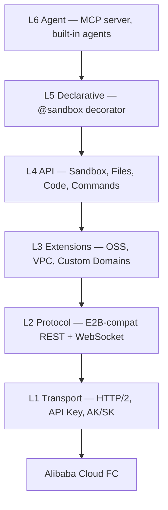

# Easy Sandbox

**English** | [中文](README.zh-CN.md)

<!-- badges -->
[](https://github.com/Easy-Sandbox/easy-sandbox/actions/workflows/ci.yml)
[](https://pypi.org/project/easy-sandbox/)
[](https://pypi.org/project/easy-sandbox/)
[](LICENSE)

> Cloud sandboxes for AI agents — create, execute, and manage isolated environments in seconds.

**Easy Sandbox** is a Python SDK and CLI (`ebx`) for the Alibaba Cloud FC Agent Sandbox service.
It is **E2B-protocol compatible** with extensions for the Alibaba Cloud ecosystem (OSS, VPC, custom domains).

---

## Features

- **Async-first SDK** — `Sandbox.create()`, shell execution, code interpretation, file I/O, port forwarding, and WebSocket streaming.
- **Three execution primitives** — `sandbox.run()` (bare shell), `sandbox.run_code()` (code interpreter), `sandbox.custom()` (named commands with A/B resolution).
- **CLI (`ebx`)** — create, inspect, exec, upload/download, deploy, and manage sandboxes from the terminal.
- **Template system** — reusable sandbox images (Python, Node, browser automation, AI agent harnesses, …).
- **MCP server** — expose sandbox operations as MCP tools for LLM agents.
- **Declarative decorator** — `@sandbox` turns a plain function into a remote sandbox execution with automatic serialisation.
- **Session persistence** — save and restore sandbox state across runs.
- **E2B compatibility layer** — drop-in replacement for projects already using the E2B SDK.

## Installation

```bash
# Core SDK only
pip install easy-sandbox

# With the CLI
pip install "easy-sandbox[cli]"

# CLI + Alibaba Cloud template API (template deploy / template create)
pip install "easy-sandbox[cli,alicloud]"

# Everything (CLI + MCP + fast JSON + sessions + declarative + alicloud)
pip install "easy-sandbox[all]"

# Development (includes test & lint tooling)
pip install -e ".[dev]"
```

## Quick Start

```python
import asyncio
from easy_sandbox import Sandbox

async def main():
    async with await Sandbox.create(template="python-base") as sandbox:

        # 1. Bare shell — sandbox.run(cmd)
        proc = await sandbox.run("echo 'Hello from sandbox!'")
        print(proc.stdout)          # Hello from sandbox!
        print(proc.exit_code)       # 0

        # 2. Code interpreter — sandbox.run_code(code)
        result = await sandbox.run_code("print(2 ** 10)")
        print(result.text)          # 1024

        # 3. Named command — sandbox.custom(name, **kwargs)
        #    Resolves template custom_commands (A) then SandboxServer (B)
        cmd = await sandbox.custom("hello", name="Alice")
        print(cmd.value)            # return value of the command
        print(cmd.source)           # "template" or "server"

        # 4. File operations
        await sandbox.files.write("/tmp/data.txt", "content")
        content = await sandbox.files.read("/tmp/data.txt")

        # 5. Port access
        url = sandbox.network.get_url(3000)

asyncio.run(main())
```

> **E2B compatibility:** `sandbox.commands.run(cmd)` is the low-level entry that `sandbox.run()` delegates to. Existing E2B code calling `sandbox.commands.run()` continues to work.

## Execution API

Easy Sandbox provides three execution methods, each for a distinct use case:

| Method | Purpose | Returns |
|--------|---------|---------|
| `sandbox.run(cmd)` | Execute a bare shell command | `ProcessResult` — `.stdout`, `.stderr`, `.exit_code` |
| `sandbox.run_code(code)` | Execute code via the code interpreter | `CodeResult` — `.text`, `.stdout`, `.stderr` |
| `sandbox.custom(name, **kw)` | Execute a named command (template A / server B) | `CommandResult` — `.value`, `.source`, `.exit_code` |

**`sandbox.custom()` — A/B Resolution:**

1. **Template** (mechanism A): Looks up `custom_commands` in `template.yaml`, fills `{placeholder}` tokens from kwargs (shlex-quoted), and runs as a shell command.
2. **Server** (mechanism B): If not found in the template, sends `POST /commands/{name}` to the in-sandbox SandboxServer.

```python
# Template command (A) — defined in template.yaml
result = await sandbox.custom("greet", name="World")
print(result.value)     # stdout output (stripped)
print(result.source)    # "template"

# Server command (B) — registered on SandboxServer
result = await sandbox.custom("analyze", data="input.csv")
print(result.value)     # Python function return value (JSON)
print(result.source)    # "server"
```

> **Environment variables:** envd uses direct exec — shell features (`$VAR`, pipes, redirects) require `sh -c '...'`. Use `printenv VAR` to read a variable. See the [Environment Variables guide (EN)](docs/en/guide/environment-variables.md) | [环境变量指南 (中文)](docs/zh/guide/environment-variables.md) for details.

## CLI (`ebx`)

```bash
# Configure credentials
ebx config set api_key <YOUR_API_KEY>

# Sandbox lifecycle
ebx create --template python-base       # create a sandbox
ebx list                                 # list running sandboxes
ebx info <sandbox-id>                    # inspect a sandbox
ebx exec <sandbox-id> "echo hello"       # run a shell command
ebx connect <sandbox-id>                 # interactive shell

# File transfer
ebx upload <sandbox-id> ./local.txt /remote/path.txt
ebx download <sandbox-id> /remote/path.txt ./local.txt

# Template management
ebx template list                        # list templates
ebx template info python-base            # template details
ebx install owner/repo                   # install from GitHub

# Template deployment (requires alicloud extra)
ebx template create registry.cn-hangzhou.aliyuncs.com/ns/repo:tag --name my-tpl
ebx template deploy ./examples/templates/python-hello \
    --acr-namespace my-ns --acr-repo python-hello

# One-click project deploy (AI agent builds & starts your project)
ebx deploy ./my-project --description "Start the web server"

# MCP server
ebx mcp start                            # start MCP tool server

# Cleanup
ebx kill <sandbox-id>
```

## Templates

Ready-made sandbox templates in [`examples/templates/`](examples/templates/):

| Template | Description |
|----------|-------------|
| `python-hello` | Minimal Python sandbox |
| `node-web` | Node.js web application |
| `browser-automation` | Headless browser with Playwright |
| `claude-code` | Claude Code agent harness |
| `codex` | OpenAI Codex agent harness |
| `qoder` | Qoder agent harness |
| `qwen-code` | Qwen-Code agent harness |
| `deepseek-harness` | DeepSeek agent harness |
| `hermes-agent` | Hermes agent harness |
| `openclaw` | OpenClaw agent harness |

See each template's `Dockerfile`, `template.yaml`, and `README.md` for details.

## Architecture


```mermaid
graph TB
    L6["L6 Agent — MCP server, built-in agents"]
    L5["L5 Declarative — @sandbox decorator"]
    L4["L4 API — Sandbox, Files, Code, Commands"]
    L3["L3 Extensions — OSS, VPC, Custom Domains"]
    L2["L2 Protocol — E2B-compat REST + WebSocket"]
    L1["L1 Transport — HTTP/2, API Key, AK/SK"]
    GW["Alibaba Cloud FC"]

    L6 --> L5 --> L4 --> L3 --> L2 --> L1 --> GW
```

Lower layers never import upper layers. Full design: [`docs/en/design/architecture.md`](docs/en/design/architecture.md).

## Documentation

> Full documentation index: [`docs/README.md`](docs/README.md) (bilingual navigation)

### Tutorials & Guides

| Guide | EN | 中文 |
|-------|----|------|
| Getting Started | [EN](docs/en/guide/getting-started.md) | [中文](docs/zh/guide/getting-started.md) |
| CLI Tutorial | [EN](docs/en/guide/cli-tutorial.md) | [中文](docs/zh/guide/cli-tutorial.md) |
| SDK Usage | [EN](docs/en/guide/sdk-usage.md) | [中文](docs/zh/guide/sdk-usage.md) |
| Authentication | [EN](docs/en/guide/authentication.md) | [中文](docs/zh/guide/authentication.md) |
| Environment Variables | [EN](docs/en/guide/environment-variables.md) | [中文](docs/zh/guide/environment-variables.md) |
| Using Templates | [EN](docs/en/guide/using-templates.md) | [中文](docs/zh/guide/using-templates.md) |
| Authoring Templates | [EN](docs/en/guide/authoring-templates.md) | [中文](docs/zh/guide/authoring-templates.md) |
| Deploy & Build | [EN](docs/en/guide/deploy-and-build.md) | [中文](docs/zh/guide/deploy-and-build.md) |
| Declarative Usage | [EN](docs/en/guide/declarative-usage.md) | [中文](docs/zh/guide/declarative-usage.md) |
| MCP Integration | [EN](docs/en/guide/mcp-integration.md) | [中文](docs/zh/guide/mcp-integration.md) |
| Session Persistence | [EN](docs/en/guide/session-persistence.md) | [中文](docs/zh/guide/session-persistence.md) |
| Migrate from E2B | [EN](docs/en/guide/migrate-from-e2b.md) | [中文](docs/zh/guide/migrate-from-e2b.md) |
| Troubleshooting | [EN](docs/en/guide/troubleshooting.md) | [中文](docs/zh/guide/troubleshooting.md) |

### Reference

| Document | EN | 中文 |
|----------|----|------|
| API Reference | [EN](docs/en/reference/api-reference.md) | [中文](docs/zh/reference/api-reference.md) |
| CLI Reference | [EN](docs/en/reference/cli-reference.md) | [中文](docs/zh/reference/cli-reference.md) |
| Configuration | [EN](docs/en/reference/configuration.md) | [中文](docs/zh/reference/configuration.md) |
| Error Codes | [EN](docs/en/reference/error-codes.md) | [中文](docs/zh/reference/error-codes.md) |
| Template YAML Spec | [EN](docs/en/reference/template-yaml-spec.md) | [中文](docs/zh/reference/template-yaml-spec.md) |

### Design & Architecture

| Document | EN | 中文 |
|----------|----|------|
| Design Index | [EN](docs/en/DESIGN.md) | [中文](docs/zh/DESIGN.md) |
| Architecture | [EN](docs/en/design/architecture.md) | [中文](docs/zh/design/architecture.md) |
| SDK API Design | [EN](docs/en/design/sdk-api-design.md) | [中文](docs/zh/design/sdk-api-design.md) |
| CLI Design | [EN](docs/en/design/cli-design.md) | [中文](docs/zh/design/cli-design.md) |
| Template System | [EN](docs/en/design/template-system.md) | [中文](docs/zh/design/template-system.md) |

### Other Resources

| Resource | Link |
|----------|------|
| Changelog | [CHANGELOG.md](CHANGELOG.md) |
| Contributing Guide | [CONTRIBUTING.md](.github/CONTRIBUTING.md) |
| License | [Apache-2.0](LICENSE) |
| Examples | [examples/](examples/) |
| Roadmap | [EN](docs/en/roadmap.md) \| [中文](docs/zh/roadmap.md) |

## Contributing

We welcome contributions! Please read the [Contributing Guide](.github/CONTRIBUTING.md) to get started.

## License

[Apache-2.0](LICENSE) — see [`NOTICE`](NOTICE) for copyright information.
