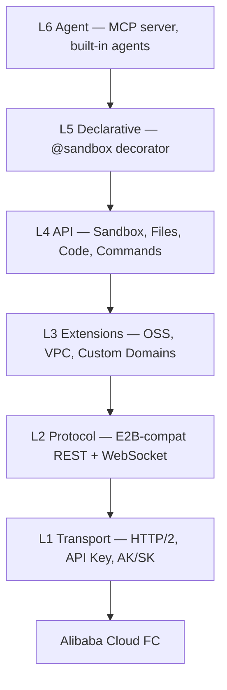

# Easy Sandbox

**English** | [中文](README.zh-CN.md)

<!-- badges -->
[](https://github.com/Easy-Sandbox/easy-sandbox/actions/workflows/ci.yml)
[](https://pypi.org/project/easy-sandbox/)
[](https://pypi.org/project/easy-sandbox/)
[](LICENSE)

> Cloud sandboxes for AI agents — create, execute, and manage isolated environments in seconds.

**Easy Sandbox** is a Python SDK and CLI (`ebx`) for the Alibaba Cloud FC Agent Sandbox service.
It is **E2B-protocol compatible** with extensions for the Alibaba Cloud ecosystem (OSS, VPC, custom domains).

---

## Features

- **Async-first SDK** — `Sandbox.create()`, shell execution, code interpretation, file I/O, port forwarding, and WebSocket streaming.
- **Three execution primitives** — `sandbox.run()` (bare shell), `sandbox.run_code()` (code interpreter), `sandbox.custom()` (named commands with A/B resolution).
- **CLI (`ebx`)** — create, inspect, exec, upload/download, deploy, and manage sandboxes from the terminal.
- **Template system** — reusable sandbox images (Python, Node, browser automation, AI agent harnesses, …).
- **MCP server** — expose sandbox operations as MCP tools for LLM agents.
- **Declarative decorator** — `@sandbox` turns a plain function into a remote sandbox execution with automatic serialisation.
- **Session persistence** — save and restore sandbox state across runs.
- **E2B compatibility layer** — drop-in replacement for projects already using the E2B SDK.

## Installation

```bash
# Core SDK only
pip install easy-sandbox

# With the CLI
pip install "easy-sandbox[cli]"

# CLI + Alibaba Cloud template API (template deploy / template create)
pip install "easy-sandbox[cli,alicloud]"

# Everything (CLI + MCP + fast JSON + sessions + declarative + alicloud)
pip install "easy-sandbox[all]"

# Development (includes test & lint tooling)
pip install -e ".[dev]"
```

### Standalone binary (no Python required)

`ebx` also ships as a **precompiled standalone binary** for macOS (Apple Silicon / Intel),
Linux (x64), and Windows (x64) — no Python installation required. Binaries are
published for every release on
[GitHub Releases](https://github.com/Easy-Sandbox/easy-sandbox/releases).

macOS / Linux (replace `0.2.0` with the release you want; `OS` and `ARCH` are
auto-detected):

```bash
VERSION=0.2.0
OS=$(uname -s | tr '[:upper:]' '[:lower:]')   # darwin or linux
ARCH=$(uname -m); case "$ARCH" in
  x86_64) ARCH=x64 ;;
  arm64|aarch64) ARCH=arm64 ;;
esac

# Needs write access to /usr/local/bin (prefix with sudo if needed)
curl -fsSL -o /usr/local/bin/ebx \
  "https://github.com/Easy-Sandbox/easy-sandbox/releases/download/v${VERSION}/ebx-${VERSION}-${OS}-${ARCH}"
chmod +x /usr/local/bin/ebx
```

Windows (PowerShell):

```powershell
$VERSION = "0.2.0"
$asset = "ebx-$VERSION-windows-x64.exe"

# Download the release asset
Invoke-WebRequest `
  -Uri "https://github.com/Easy-Sandbox/easy-sandbox/releases/download/v$VERSION/$asset" `
  -OutFile $asset

# Move it to a directory on your PATH (create it first if needed)
$installDir = "$env:LOCALAPPDATA\Programs\ebx"
New-Item -ItemType Directory -Force -Path $installDir | Out-Null
Move-Item $asset "$installDir\ebx.exe"
```

Checksums, the full platform matrix, and binary vs. pip trade-offs:
[Binary Installation](docs/en/guide/binary-installation.md) ([中文](docs/zh/guide/binary-installation.md)).

## Using with AI coding tools

The repository ships a static Agent Skills guide ([`SKILL.md`](SKILL.md)) that teaches Qoder, Claude Code, Cursor, Qwen Code, and Codex how to operate Easy Sandbox. Install it **before (or without) the `ebx` CLI**:

```bash
# Fast path (requires Node.js); swap qoder for claude-code / cursor / qwen-code / codex,
# add -g for user-level scope, --list to preview
npx skills add Easy-Sandbox/easy-sandbox --skill easy-sandbox -a qoder -y
```

No Node.js? Copy `SKILL.md` into your tool's skills directory (for example `~/.qoder/skills/easy-sandbox/SKILL.md`). Full tool matrix, version pinning, upgrades, uninstall, and security notes: [Agent Skill Installation & Distribution](docs/en/guide/agent-skill-installation.md) ([中文](docs/zh/guide/agent-skill-installation.md)).

## Quick Start

```python
import asyncio
from easy_sandbox import Sandbox

async def main():
    async with await Sandbox.create(template="python-base") as sandbox:

        # 1. Bare shell — sandbox.run(cmd)
        proc = await sandbox.run("echo 'Hello from sandbox!'")
        print(proc.stdout)          # Hello from sandbox!
        print(proc.exit_code)       # 0

        # 2. Code interpreter — sandbox.run_code(code)
        result = await sandbox.run_code("print(2 ** 10)")
        print(result.text)          # 1024

        # 3. Named command — sandbox.custom(name, **kwargs)
        #    Resolves template custom_commands (A) then SandboxServer (B)
        cmd = await sandbox.custom("hello", name="Alice")
        print(cmd.value)            # return value of the command
        print(cmd.source)           # "template" or "server"

        # 4. File operations
        await sandbox.files.write("/tmp/data.txt", "content")
        content = await sandbox.files.read("/tmp/data.txt")

        # 5. Port access
        url = sandbox.network.get_url(3000)

asyncio.run(main())
```

> **E2B compatibility:** `sandbox.commands.run(cmd)` is the low-level entry that `sandbox.run()` delegates to. Existing E2B code calling `sandbox.commands.run()` continues to work.

## Execution API

Easy Sandbox provides three execution methods, each for a distinct use case:

| Method | Purpose | Returns |
|--------|---------|---------|
| `sandbox.run(cmd)` | Execute a bare shell command | `ProcessResult` — `.stdout`, `.stderr`, `.exit_code` |
| `sandbox.run_code(code)` | Execute code via the code interpreter | `CodeResult` — `.text`, `.stdout`, `.stderr` |
| `sandbox.custom(name, **kw)` | Execute a named command (template A / server B) | `CommandResult` — `.value`, `.source`, `.exit_code` |

**`sandbox.custom()` — A/B Resolution:**

1. **Template** (mechanism A): Looks up `custom_commands` in `template.yaml`, fills `{placeholder}` tokens from kwargs (shlex-quoted), and runs as a shell command.
2. **Server** (mechanism B): If not found in the template, sends `POST /commands/{name}` to the in-sandbox SandboxServer.

```python
# Template command (A) — defined in template.yaml
result = await sandbox.custom("greet", name="World")
print(result.value)     # stdout output (stripped)
print(result.source)    # "template"

# Server command (B) — registered on SandboxServer
result = await sandbox.custom("analyze", data="input.csv")
print(result.value)     # Python function return value (JSON)
print(result.source)    # "server"
```

> **Environment variables:** envd uses direct exec — shell features (`$VAR`, pipes, redirects) require `sh -c '...'`. Use `printenv VAR` to read a variable. See the [Environment Variables guide (EN)](docs/en/guide/environment-variables.md) | [环境变量指南 (中文)](docs/zh/guide/environment-variables.md) for details.

## CLI (`ebx`)

```bash
# Configure credentials
ebx config set sandbox_api_key <YOUR_API_KEY>

# Sandbox lifecycle
ebx create --template python-base       # create a sandbox
ebx list                                 # list running sandboxes
ebx info <sandbox-id>                    # inspect a sandbox
ebx exec <sandbox-id> "echo hello"       # run a shell command
ebx connect <sandbox-id>                 # line-based command REPL

# File transfer
ebx upload <sandbox-id> ./local.txt /remote/path.txt
ebx download <sandbox-id> /remote/path.txt ./local.txt

# Template management
ebx template list                        # list templates
ebx template info python-base            # template details
ebx install owner/repo                   # install from GitHub

# Template deployment (requires alicloud extra)
ebx template create registry.cn-hangzhou.aliyuncs.com/ns/repo:tag --name my-tpl
ebx template deploy ./examples/templates/python-hello \
    --acr-namespace my-ns --acr-repo python-hello

# Template lifecycle: author -> publish -> launch
ebx template init --adopt ./app --hint "port 8080" # 1a. adapt an existing project
ebx template init "a python web server"             # 1b. AI writes ./<name>/ (optional)
ebx deploy ./app --acr-namespace my-ns              # 2. build, push to ACR, register (no LLM)
ebx create --template <TEMPLATE_ID>                 # 3. launch a sandbox

# MCP server
ebx mcp start                            # start MCP tool server

# Cleanup
ebx kill <sandbox-id>
```

## Templates

Official and community templates live in the
[`Easy-Sandbox/awesome-templates`](https://github.com/Easy-Sandbox/awesome-templates)
repository — the single source of truth for template content, the index, and
publishing. Discover and install them through the remote index:

```bash
# Discover templates through the remote index
$ ebx template search web
Name      Description       Tags           Status
node-web  Node.js web app   nodejs, web    official

$ ebx template install node-web                                        # install by index name
$ ebx template install Easy-Sandbox/awesome-templates//node-web@v1.0.0 # or pin a ref
```

[`examples/templates/`](examples/templates/) only keeps a minimal
`python-hello` **fixture** for offline tests — it is not a publishing source.
See [examples/templates/README.md](examples/templates/README.md) for the
fixture contract and index behaviour (caching, offline fallback, pinned refs).

## Architecture


```mermaid
graph TB
    L6["L6 Agent — MCP server, built-in agents"]
    L5["L5 Declarative — @sandbox decorator"]
    L4["L4 API — Sandbox, Files, Code, Commands"]
    L3["L3 Extensions — OSS, VPC, Custom Domains"]
    L2["L2 Protocol — E2B-compat REST + WebSocket"]
    L1["L1 Transport — HTTP/2, API Key, AK/SK"]
    GW["Alibaba Cloud FC"]

    L6 --> L5 --> L4 --> L3 --> L2 --> L1 --> GW
```

Lower layers never import upper layers. Full design: [`docs/en/design/architecture.md`](docs/en/design/architecture.md).

## Documentation

> Full documentation index: [`docs/README.md`](docs/README.md) (bilingual navigation)

### Tutorials & Guides

| Guide | Link |
|-------|------|
| Getting Started | [Getting Started](docs/en/guide/getting-started.md) |
| Binary Installation | [Binary Installation](docs/en/guide/binary-installation.md) |
| CLI Tutorial | [CLI Tutorial](docs/en/guide/cli-tutorial.md) |
| SDK Usage | [SDK Usage](docs/en/guide/sdk-usage.md) |
| Authentication | [Authentication](docs/en/guide/authentication.md) |
| Environment Variables | [Environment Variables](docs/en/guide/environment-variables.md) |
| Using Templates | [Using Templates](docs/en/guide/using-templates.md) |
| Authoring Templates | [Authoring Templates](docs/en/guide/authoring-templates.md) |
| Deploy & Build | [Deploy & Build](docs/en/guide/deploy-and-build.md) |
| Declarative Usage | [Declarative Usage](docs/en/guide/declarative-usage.md) |
| MCP Integration | [MCP Integration](docs/en/guide/mcp-integration.md) |
| Session Persistence | [Session Persistence](docs/en/guide/session-persistence.md) |
| Migrate from E2B | [Migrate from E2B](docs/en/guide/migrate-from-e2b.md) |
| Troubleshooting | [Troubleshooting](docs/en/guide/troubleshooting.md) |

### Reference

| Document | Link |
|----------|------|
| API Reference | [API Reference](docs/en/reference/api-reference.md) |
| CLI Reference | [CLI Reference](docs/en/reference/cli-reference.md) |
| Configuration | [Configuration](docs/en/reference/configuration.md) |
| Error Codes | [Error Codes](docs/en/reference/error-codes.md) |
| Template YAML Spec | [Template YAML Spec](docs/en/reference/template-yaml-spec.md) |

### Design & Architecture

| Document | Link |
|----------|------|
| Design Index | [Design Index](docs/en/DESIGN.md) |
| Architecture | [Architecture](docs/en/design/architecture.md) |
| SDK API Design | [SDK API Design](docs/en/design/sdk-api-design.md) |
| CLI Design | [CLI Design](docs/en/design/cli-design.md) |
| Template System | [Template System](docs/en/design/template-system.md) |

### Other Resources

| Resource | Link |
|----------|------|
| Changelog | [CHANGELOG.md](CHANGELOG.md) |
| Contributing Guide | [CONTRIBUTING.md](.github/CONTRIBUTING.md) |
| License | [Apache-2.0](LICENSE) |
| Examples | [examples/](examples/) |

## Contributing

We welcome contributions! Please read the [Contributing Guide](.github/CONTRIBUTING.md) to get started.

## License

[Apache-2.0](LICENSE) — see [`NOTICE`](NOTICE) for copyright information.
