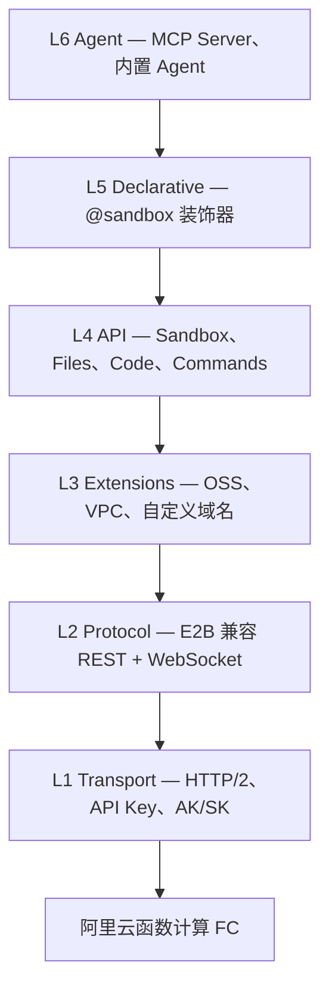

# Easy Sandbox

[English](README.md) | **中文**

<!-- badges -->
[](https://github.com/Easy-Sandbox/easy-sandbox/actions/workflows/ci.yml)
[](https://pypi.org/project/easy-sandbox/)
[](https://pypi.org/project/easy-sandbox/)
[](LICENSE)

> 为 AI Agent 打造的云沙箱 —— 秒级创建、执行、管理隔离环境。

**Easy Sandbox** 是基于阿里云函数计算（FC）Agent Sandbox 服务的 Python SDK 与 CLI 工具（`ebx`）。
兼容 **E2B 协议**，同时扩展了阿里云生态能力（OSS、VPC、自定义域名）。

---

## 特性

- **异步优先 SDK** —— `Sandbox.create()`，Shell 执行、代码解释、文件读写、端口转发、WebSocket 流。
- **三种执行原语** —— `sandbox.run()`（裸 Shell）、`sandbox.run_code()`（代码解释器）、`sandbox.custom()`（命名命令 A/B 解析）。
- **CLI (`ebx`)** —— 创建、查看、执行、上传/下载、部署，从终端管理沙箱。
- **模板系统** —— 可复用的沙箱镜像（Python、Node、浏览器自动化、AI Agent Harness……）。
- **MCP Server** —— 将沙箱操作暴露为 MCP 工具，供 LLM Agent 调用。
- **声明式装饰器** —— `@sandbox` 将普通函数变为远程沙箱执行，自动序列化。
- **会话持久化** —— 跨运行保存和恢复沙箱状态。
- **E2B 兼容层** —— 已使用 E2B SDK 的项目可直接替换。

## 安装

```bash
# 仅核心 SDK
pip install easy-sandbox

# 含 CLI
pip install "easy-sandbox[cli]"

# CLI + 阿里云模板 API（模板部署/创建）
pip install "easy-sandbox[cli,alicloud]"

# 完整安装（CLI + MCP + 快速 JSON + 会话 + 声明式 + alicloud）
pip install "easy-sandbox[all]"

# 开发环境（含测试与 lint 工具）
pip install -e ".[dev]"
```

### 独立二进制（无需 Python）

`ebx` 同时以**预编译独立二进制**形式发布，覆盖 macOS（Apple Silicon / Intel）、
Linux（x64）与 Windows（x64）—— **无需安装 Python 环境**。二进制文件随每个
版本发布在 [GitHub Releases](https://github.com/Easy-Sandbox/easy-sandbox/releases)。

macOS / Linux（把 `0.2.0` 换成目标版本，`OS` 与 `ARCH` 自动检测）：

```bash
VERSION=0.2.0
OS=$(uname -s | tr '[:upper:]' '[:lower:]')   # darwin 或 linux
ARCH=$(uname -m); case "$ARCH" in
  x86_64) ARCH=x64 ;;
  arm64|aarch64) ARCH=arm64 ;;
esac

# 先下载到当前用户可写的目录，再安装到 PATH 上。
curl -fsSL -o "$HOME/ebx" \
  "https://github.com/Easy-Sandbox/easy-sandbox/releases/download/v${VERSION}/ebx-${VERSION}-${OS}-${ARCH}"
chmod +x "$HOME/ebx"
sudo mv "$HOME/ebx" /usr/local/bin/ebx
```

Windows（PowerShell）：

```powershell
$VERSION = "0.2.0"
$asset = "ebx-$VERSION-windows-x64.exe"

# 下载 Release 资产
Invoke-WebRequest `
  -Uri "https://github.com/Easy-Sandbox/easy-sandbox/releases/download/v$VERSION/$asset" `
  -OutFile $asset

# 移动到 PATH 中的目录（不存在则先创建）
$installDir = "$env:LOCALAPPDATA\Programs\ebx"
New-Item -ItemType Directory -Force -Path $installDir | Out-Null
Move-Item $asset "$installDir\ebx.exe"
```

校验和、完整平台矩阵与二进制/pip 对比详见 [二进制安装](docs/zh/guide/binary-installation.md)（[English](docs/en/guide/binary-installation.md)）。

## 配合 AI 编码工具使用

仓库内置静态 Agent Skills 指南（[`SKILL.md`](SKILL.md)），教 Qoder、Claude Code、Cursor、Qwen Code、Codex 等工具如何操作 Easy Sandbox——**可先于（或无需）`ebx` CLI 安装**：

```bash
# 快捷方式（需 Node.js）；把 qoder 换成 claude-code / cursor / qwen-code / codex，
# 加 -g 安装到用户级，加 --list 仅预览
npx skills add Easy-Sandbox/easy-sandbox --skill easy-sandbox -a qoder -y
```

没有 Node.js？把 `SKILL.md` 复制到你的工具技能目录（例如 `~/.qoder/skills/easy-sandbox/SKILL.md`）。完整工具目录矩阵、版本锁定、升级、卸载与安全提示见 [Agent Skill 安装与分发](docs/zh/guide/agent-skill-installation.md)（[English](docs/en/guide/agent-skill-installation.md)）。

## 快速开始

```python
import asyncio
from easy_sandbox import Sandbox

async def main():
    async with await Sandbox.create(template="python-base") as sandbox:

        # 1. 裸 Shell —— sandbox.run(cmd)
        proc = await sandbox.run("echo 'Hello from sandbox!'")
        print(proc.stdout)          # Hello from sandbox!
        print(proc.exit_code)       # 0

        # 2. 代码解释器 —— sandbox.run_code(code)
        result = await sandbox.run_code("print(2 ** 10)")
        print(result.text)          # 1024

        # 3. 命名命令 —— sandbox.custom(name, **kwargs)
        #    先查 template custom_commands (A)，再查 SandboxServer (B)
        cmd = await sandbox.custom("hello", name="Alice")
        print(cmd.value)            # 命令返回值
        print(cmd.source)           # "template" 或 "server"

        # 4. 文件操作
        await sandbox.files.write("/tmp/data.txt", "content")
        content = await sandbox.files.read("/tmp/data.txt")

        # 5. 端口访问
        url = sandbox.network.get_url(3000)

asyncio.run(main())
```

> **E2B 兼容：** `sandbox.commands.run(cmd)` 是 `sandbox.run()` 的底层入口。已有 E2B 代码调用 `sandbox.commands.run()` 可直接使用。

## 执行 API

Easy Sandbox 提供三种执行方法，分别对应不同场景：

| 方法 | 用途 | 返回类型 |
|------|------|----------|
| `sandbox.run(cmd)` | 执行裸 Shell 命令 | `ProcessResult` —— `.stdout`, `.stderr`, `.exit_code` |
| `sandbox.run_code(code)` | 通过代码解释器执行代码 | `CodeResult` —— `.text`, `.stdout`, `.stderr` |
| `sandbox.custom(name, **kw)` | 执行命名命令（模板 A / 服务器 B） | `CommandResult` —— `.value`, `.source`, `.exit_code` |

**`sandbox.custom()` —— A/B 解析：**

1. **模板**（机制 A）：从 `template.yaml` 的 `custom_commands` 中查找，用 kwargs 填充 `{placeholder}` 占位符（shlex 转义），作为 Shell 命令执行。
2. **服务器**（机制 B）：模板未找到时，向沙箱内 SandboxServer 发送 `POST /commands/{name}`。

```python
# 模板命令 (A) —— 在 template.yaml 中定义
result = await sandbox.custom("greet", name="World")
print(result.value)     # stdout 输出（已 strip）
print(result.source)    # "template"

# 服务器命令 (B) —— 在 SandboxServer 上注册
result = await sandbox.custom("analyze", data="input.csv")
print(result.value)     # Python 函数返回值（JSON）
print(result.source)    # "server"
```

> **环境变量：** envd 使用直接执行（direct exec）—— Shell 特性（`$VAR` 展开、管道、重定向）需要 `sh -c '...'`。用 `printenv VAR` 读取变量值。详见[环境变量指南（中文）](docs/zh/guide/environment-variables.md) | [Environment Variables (EN)](docs/en/guide/environment-variables.md)。

## CLI (`ebx`)

```bash
# 配置凭证
ebx config set sandbox_api_key <YOUR_API_KEY>

# 沙箱生命周期
ebx create --template python-base       # 创建沙箱
ebx list                                 # 列出运行中的沙箱
ebx info <sandbox-id>                    # 查看沙箱详情
ebx exec <sandbox-id> "echo hello"       # 执行 Shell 命令
ebx connect <sandbox-id>                 # 交互式 Shell

# 文件传输
ebx upload <sandbox-id> ./local.txt /remote/path.txt
ebx download <sandbox-id> /remote/path.txt ./local.txt

# 模板管理
ebx template list                        # 列出模板
ebx template info python-base            # 模板详情
ebx install owner/repo                   # 从 GitHub 安装

# 模板部署（需要 alicloud extra）
ebx template create registry.cn-hangzhou.aliyuncs.com/ns/repo:tag --name my-tpl
ebx template deploy ./examples/templates/python-hello \
    --acr-namespace my-ns --acr-repo python-hello

# 模板生命周期：编写 -> 发布 -> 启动
ebx template init --adopt ./app --hint "端口 8080"     # 1a. 适配已有项目
ebx template init "一个 Python Web 服务"               # 1b. AI 生成 ./<name>/（可选）
ebx deploy ./app --acr-namespace my-ns                 # 2. 构建、推送 ACR、注册（无需 LLM）
ebx create --template <TEMPLATE_ID>                    # 3. 启动沙箱

# MCP 服务
ebx mcp start                            # 启动 MCP 工具服务

# 清理
ebx kill <sandbox-id>
```

## 模板

官方与社区模板统一维护在
[`Easy-Sandbox/awesome-templates`](https://github.com/Easy-Sandbox/awesome-templates)
仓库——模板内容、索引与发布的唯一真源。通过远程索引发现与安装：

```bash
# 通过远程索引发现模板
$ ebx template search web
Name      Description       Tags           Status
node-web  Node.js web app   nodejs, web    official

$ ebx template install node-web                                        # 按索引名安装
$ ebx template install Easy-Sandbox/awesome-templates//node-web@v1.0.0 # 或锁定版本
```

[`examples/templates/`](examples/templates/) 仅保留一个最小的 `python-hello`
**测试夹具（fixture）**用于离线测试，并非模板发布真源。夹具契约与索引行为
（缓存、离线回退、锁定版本）详见 [examples/templates/README.md](examples/templates/README.md)。

## 架构



低层不引用高层。完整设计文档：[`docs/zh/design/architecture.md`](docs/zh/design/architecture.md)。

## 文档

> 完整文档索引：[`docs/README.md`](docs/README.md)（双语导航）

### 教程与指南

| 指南 | 链接 |
|------|------|
| 快速入门 | [快速入门](docs/zh/guide/getting-started.md) |
| 二进制安装 | [二进制安装](docs/zh/guide/binary-installation.md) |
| CLI 教程 | [CLI 教程](docs/zh/guide/cli-tutorial.md) |
| SDK 使用 | [SDK 使用](docs/zh/guide/sdk-usage.md) |
| 认证配置 | [认证配置](docs/zh/guide/authentication.md) |
| 环境变量 | [环境变量](docs/zh/guide/environment-variables.md) |
| 使用模板 | [使用模板](docs/zh/guide/using-templates.md) |
| 编写模板 | [编写模板](docs/zh/guide/authoring-templates.md) |
| 部署与构建 | [部署与构建](docs/zh/guide/deploy-and-build.md) |
| 声明式用法 | [声明式用法](docs/zh/guide/declarative-usage.md) |
| MCP 集成 | [MCP 集成](docs/zh/guide/mcp-integration.md) |
| 会话持久化 | [会话持久化](docs/zh/guide/session-persistence.md) |
| 从 E2B 迁移 | [从 E2B 迁移](docs/zh/guide/migrate-from-e2b.md) |
| 故障排查 | [故障排查](docs/zh/guide/troubleshooting.md) |

### 参考手册

| 文档 | 链接 |
|------|------|
| API 参考 | [API 参考](docs/zh/reference/api-reference.md) |
| CLI 参考 | [CLI 参考](docs/zh/reference/cli-reference.md) |
| 配置说明 | [配置说明](docs/zh/reference/configuration.md) |
| 错误码 | [错误码](docs/zh/reference/error-codes.md) |
| Template YAML 规范 | [Template YAML 规范](docs/zh/reference/template-yaml-spec.md) |

### 设计与架构

| 文档 | 链接 |
|------|------|
| 设计索引 | [设计索引](docs/zh/DESIGN.md) |
| 架构设计 | [架构设计](docs/zh/design/architecture.md) |
| SDK API 设计 | [SDK API 设计](docs/zh/design/sdk-api-design.md) |
| CLI 设计 | [CLI 设计](docs/zh/design/cli-design.md) |
| 模板系统 | [模板系统](docs/zh/design/template-system.md) |

### 其他资源

| 资源 | 链接 |
|------|------|
| 更新日志 | [CHANGELOG.md](CHANGELOG.md) |
| 贡献指南 | [CONTRIBUTING.md](.github/CONTRIBUTING.md) |
| 许可证 | [Apache-2.0](LICENSE) |
| 示例代码 | [examples/](examples/) |

## 贡献

欢迎贡献！请阅读 [贡献指南](.github/CONTRIBUTING.md) 了解详情。

## 许可证

[Apache-2.0](LICENSE) —— 版权信息见 [`NOTICE`](NOTICE)。
