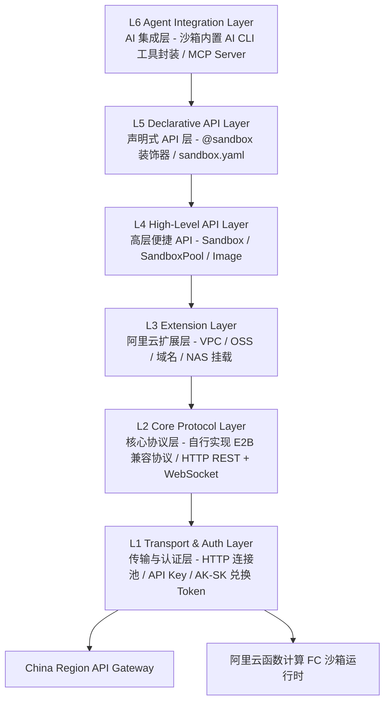
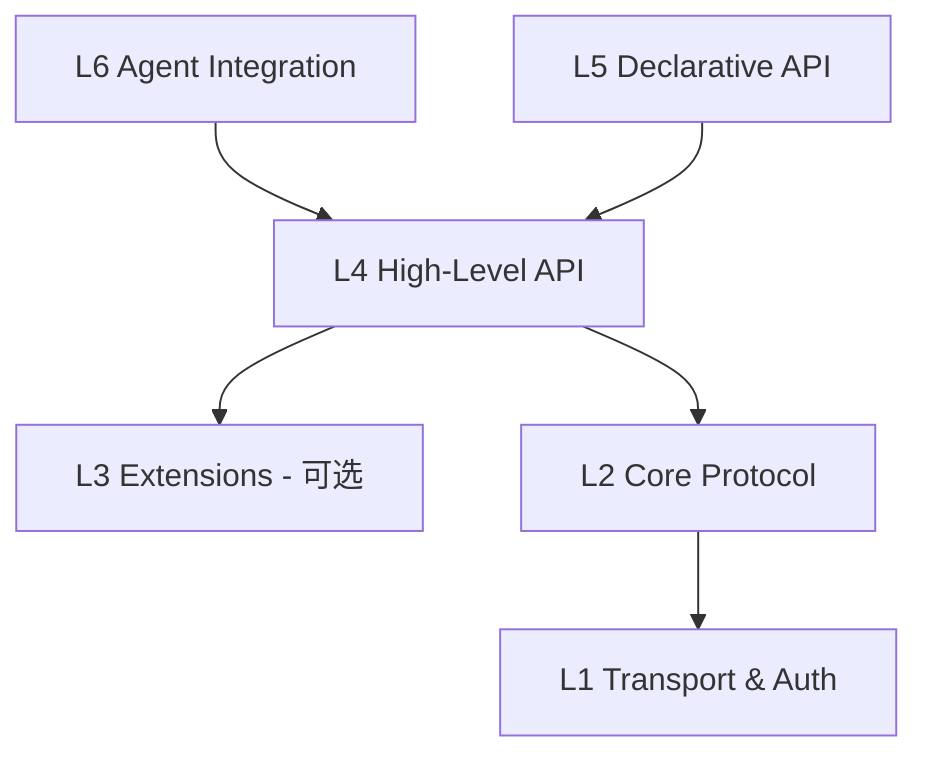

# 系统架构设计 — 六层分层架构

> Serverless Sandbox SDK 采用六层分层架构，从底层传输到上层 AI 集成逐层抽象，每层职责单一、边界清晰，用户可在任意层级接入使用。SDK 零 LLM 依赖，不依赖 E2B SDK，自行实现 E2B 兼容协议。

---

## 1. 架构总览图



---

## 2. 各层职责详述

### L1 — Transport & Auth Layer（传输与认证层）

| 模块 | 职责 |
|------|------|
| `transport.http` | 基于 httpx 封装 HTTPS 请求，连接池管理，超时/重试策略 |
| `transport.ws` | 基于 websockets 的长连接，心跳保活，自动重连 |
| `auth.api_key` | **API Key 认证（主路径）**：通过 `X-API-KEY` 请求头传递，环境变量 `SANDBOX_API_KEY` |
| `auth.ak_sk` | **AK/SK 认证（扩展）**：通过阿里云 AK/SK 兑换临时 API Key，或用于控制面 OpenAPI 调用 |
| `auth.config` | 多环境配置加载（代码参数 → 环境变量 → .env → config.toml → 默认值） |

**双认证模式**：

| 认证方式 | 场景 | 传递方式 | 环境变量 |
|----------|------|----------|----------|
| **API Key（主路径）** | 云沙箱数据面操作 | `X-API-KEY` 请求头 | `SANDBOX_API_KEY` |
| **AK/SK（扩展）** | 兑换临时 API Key、控制面 OpenAPI | 阿里云 V4 签名 | `ALICLOUD_ACCESS_KEY_ID` / `ALICLOUD_ACCESS_KEY_SECRET` |

**面向用户**：基础设施开发者、需要自定义认证逻辑的高级用户。

### L2 — Core Protocol Layer（核心协议层）

**自行实现 E2B 兼容协议**，不依赖 E2B SDK，直接基于 httpx + websockets 实现。区分两类 API：

- **Platform API（REST）**：沙箱生命周期管理（创建、列表、销毁），通过 HTTP REST API 与阿里云平台交互
- **Sandbox envd API（Connect 协议）**：沙箱内部操作（进程、文件、终端），通过 HTTP + WebSocket 与沙箱 envd 通信

| 模块 | 职责 |
|------|------|
| `protocol.sandbox` | 沙箱生命周期管理（HTTP REST API） |
| `protocol.process` | 远程进程管理（启动、流式输出、信号、退出码），HTTP + WebSocket 流式 |
| `protocol.filesystem` | 远程文件系统操作（读、写、列目录、监听变更），HTTP REST |
| `protocol.terminal` | 虚拟终端（PTY）复用，WebSocket 双向通信 |
| `protocol.port` | 端口转发与映射管理（HTTP REST） |

**面向用户**：协议层开发者、需要细粒度控制的用户。

### L3 — Extension Layer（阿里云扩展层）

| 模块 | 职责 |
|------|------|
| `extensions.vpc` | VPC 网络配置，安全组规则，ENI 绑定 |
| `extensions.oss` | OSS 挂载，文件同步，大文件传输加速 |
| `extensions.domain` | 自定义域名绑定与 TLS 证书管理 |
| `extensions.nas` | NAS 文件系统挂载（共享存储） | _TODO — 计划中_ |
| `extensions.log` | SLS 日志集成，结构化日志采集 | _TODO — 计划中_ |

**面向用户**：企业用户、需要深度集成阿里云服务的开发者。

### L4 — High-Level API Layer（高层便捷 API）

| 模块 | 职责 |
|------|------|
| `api.sandbox` | Sandbox 类 — 创建、管理、执行、销毁的统一入口 |
| `api.pool` | SandboxPool — 连接池/预热池，并发管理 | _TODO — 计划中_ |
| `api.image` | Image 构建器 — 链式 API 构建自定义镜像 |
| `api.files` | 高层文件操作 — 上传/下载/监听 |
| `api.code` | 代码执行引擎 — 多语言支持，Rich Output |

**面向用户**：绝大多数开发者，E2B 兼容模式的核心层。

### L5 — Declarative API Layer（声明式 API 层）

| 模块 | 职责 |
|------|------|
| `declarative.decorator` | `@sandbox` 装饰器 — Modal 风格远程执行 |
| `declarative.config` | `sandbox.yaml` 解析与验证 |
| `declarative.serializer` | 参数/返回值序列化（pickle / cloudpickle / JSON） |
| `declarative.scheduler` | 声明式任务调度与编排 | _TODO — 计划中_ |

**面向用户**：追求极简体验的 Python 开发者、ML 工程师。

### L6 — Agent Integration Layer（AI CLI 封装层）

| 模块 | 职责 |
|------|------|
| `agent.builtin` | 内置 Agent 封装 — 沙箱模板内预装 AI CLI 工具（Codex / Qwen CLI），SDK 提供语法糖 |
| `agent.tools` | Agent 工具集 — 沙箱操作封装为 OpenAI function calling 格式 |
| `agent.mcp` | MCP Server 实现 — 暴露沙箱能力为 MCP Tools |

**面向用户**：AI 应用开发者、Agent 框架集成者。

> **注意**：SDK 零 LLM 依赖，不内置 LLM Provider 适配层。Agent 能力来自沙箱模板内预装的 AI CLI 工具。Agent API（`sb.agent.code()`）是 `commands.run()` 的语法糖封装。

### Server 模块（容器内运行时服务）

| 模块 | 职责 |
|------|------|
| `server.app` | `SandboxServer` 主类 — stdlib-only HTTP server，零第三方依赖，容器内常驻运行 |
| `server.router` | `RouteTable` + `CapabilityGroup` — 声明式路由注册与能力组开关 |
| `server.registry` | `CommandRegistry` — 用户自定义命令注册与发现 |
| `server.routes` | 核心内置路由：health、commands、upload、download、shell |
| `server.routes_files` | 文件操作端点：list/stat/mkdir/delete/move/search/archive（9 端点） |
| `server.routes_process` | 进程管理端点：start/list/detail/signal + SSE 流式 shell（5 端点，按文件统计） |
| `server.routes_system` | 系统信息端点：info/env/ports/packages/metrics + capabilities（7 端点，按文件统计；注：server-api.md 按能力组统计口径不同） |
| `server.routes_pty` | PTY WebSocket 终端：会话创建/列表/删除 + WebSocket 交互式终端 |
| `server.routes_browser` | 浏览器自动化端点：navigate/screenshot/content/click/type/evaluate/pdf/console（8 端点） |
| `server.routes_devtools` | 开发工具端点：code/run、git/status、git/diff（3 端点） |
| `server.types` | 请求/响应数据模型：`ServerRequest`、`ServerResponse`、`SSEResponse` |

Server 模块运行在沙箱容器内部，与 SDK 主体分层不同，它是用户 opt-in 的容器内常驻 HTTP 服务。完全基于 Python stdlib，零第三方依赖（PTY 终端使用 SDK 已有的 `websockets` 核心依赖）。提供 42 个端点，按 8 个 CapabilityGroup 分组管理：

| 能力组 | 说明 | 默认状态 |
|--------|------|----------|
| `CORE` | health、capabilities | 始终启用，不可禁用 |
| `COMMANDS` | 用户自定义命令注册与发现 | 启用 |
| `FILE_OPS` | 文件系统 CRUD + 归档 | 启用 |
| `PROCESS` | 进程管理 + SSE 流式 shell | 启用 |
| `SYSTEM` | 系统信息、环境变量、端口、包管理、指标 | 启用 |
| `TERMINAL` | PTY WebSocket 交互式终端 | 启用 |
| `DEV_TOOLS` | Code Interpreter + Git 操作 | 禁用（需显式启用） |
| `BROWSER` | Playwright 浏览器自动化 | 禁用（需显式启用） |

**面向用户**：沙箱模板开发者、需要在容器内注册自定义命令的高级用户。

---

## 3. 层间依赖关系



**依赖规则**：

1. **严格向下依赖**：每层只能依赖其下方的层，禁止反向依赖或跨层依赖
2. **L3 为可选层**：L4 可直接依赖 L2，L3 Extensions 作为增强模块按需引入
3. **L5 依赖 L4**：声明式 API 通过 L4 高层 API 实现，不直接依赖 L2
4. **L6 依赖 L4**：Agent 集成通过 L4 高层 API 实现
5. **L1 为基础层**：所有上层最终依赖 L1 完成网络通信和认证

---

## 4. 项目目录结构

```
src/serverless_sandbox/
├── __init__.py                    # 顶层导出：Sandbox, Image, Agent, sandbox
├── _version.py                    # 版本号
│
├── transport/                     # L1 — 传输与认证层
│   ├── __init__.py
│   ├── http.py                    #   httpx HTTPS 客户端，连接池
│   ├── ws.py                      #   websockets 长连接，心跳保活
│   ├── auth.py                    #   API Key 认证 + AK/SK 兑换
│   └── config.py                  #   配置加载（代码参数→环境变量→.env→config.toml→默认值）
│
├── protocol/                      # L2 — 核心协议层（自行实现 E2B 兼容）
│   ├── __init__.py
│   ├── sandbox.py                 #   沙箱生命周期 API（HTTP REST）
│   ├── process.py                 #   远程进程管理（HTTP + WebSocket 流式）
│   ├── filesystem.py              #   远程文件系统操作（HTTP REST）
│   ├── terminal.py                #   PTY 终端复用（WebSocket）
│   └── port.py                    #   端口转发管理（HTTP REST）
│
├── extensions/                    # L3 — 阿里云扩展层
│   ├── __init__.py
│   ├── vpc.py                     #   VPC 网络配置
│   ├── oss.py                     #   OSS 挂载与文件同步
│   ├── domain.py                  #   自定义域名绑定
│   ├── nas.py                     #   NAS 文件系统挂载（TODO — 计划中）
│   └── log.py                     #   SLS 日志集成（TODO — 计划中）
│
├── api/                           # L4 — 高层便捷 API
│   ├── __init__.py
│   ├── sandbox.py                 #   Sandbox 核心类
│   ├── pool.py                    #   SandboxPool 沙箱池（TODO — 计划中）
│   ├── image.py                   #   Image 链式构建器
│   ├── files.py                   #   高层文件操作
│   └── code.py                    #   代码执行引擎
│
├── declarative/                   # L5 — 声明式 API 层
│   ├── __init__.py
│   ├── decorator.py               #   @sandbox 装饰器
│   ├── config.py                  #   sandbox.yaml 解析
│   ├── serializer.py              #   参数序列化
│   └── scheduler.py               #   任务调度（TODO — 计划中）
│
├── agent/                         # L6 — AI 集成层（轻量封装）
│   ├── __init__.py
│   ├── builtin.py                 #   AgentModule — commands.run() 语法糖
│   ├── tools.py                   #   Agent 工具集（OpenAI function calling 格式）
│   ├── infer.py                   #   自然语言推断（外部调用 Server/Qwen CLI/规则匹配）
│   └── mcp.py                     #   MCP Server 实现
│
├── server/                        # 容器内运行时 HTTP Server（opt-in，stdlib-only）
│   ├── __init__.py                #   模块导出：SandboxServer, start, CapabilityGroup, RouteTable
│   ├── app.py                     #   SandboxServer 主类，HTTP 请求分发
│   ├── router.py                  #   RouteTable 声明式路由 + CapabilityGroup 能力组枚举
│   ├── registry.py                #   CommandRegistry 用户自定义命令注册
│   ├── routes.py                  #   核心内置路由（health/commands/upload/download/shell）
│   ├── routes_files.py            #   FILE_OPS 能力组（9 端点）
│   ├── routes_process.py          #   PROCESS 能力组（5 端点）
│   ├── routes_system.py           #   SYSTEM 能力组 + CORE/capabilities（7 端点）
│   ├── routes_pty.py              #   TERMINAL 能力组（REST + WebSocket PTY）
│   ├── routes_browser.py          #   BROWSER 能力组（8 端点，Playwright）
│   ├── routes_devtools.py         #   DEV_TOOLS 能力组（Code Interpreter + Git）
│   ├── _compat.py                 #   向后兼容层（enable_builtin/disable_builtin）
│   └── types.py                   #   ServerRequest/ServerResponse/SSEResponse
│
├── cli/                           # CLI 命令行工具
│   ├── __init__.py
│   ├── main.py                    #   CLI 入口
│   ├── commands/                  #   子命令实现
│   │   ├── sandbox.py             #     sbox create/list/kill/...
│   │   ├── sandbox_files.py       #     sbox sandbox files (list/stat/mkdir/rm/mv/search)
│   │   ├── sandbox_process.py     #     sbox sandbox process (list/start/info/signal)
│   │   ├── sandbox_system.py      #     sbox sandbox system (info/env/ports/packages/metrics)
│   │   ├── template.py            #     template build/push/list/...
│   │   ├── skill.py               #     skill search/install/...
│   │   └── mcp.py                 #     mcp install/start/...
│   ├── formatters.py              #   输出格式化（table/json/quiet）
│   └── output.py                  #   OutputManager 统一输出管理器
│
├── models/                        # 数据模型
│   ├── __init__.py
│   ├── sandbox.py                 #   SandboxInfo, SandboxConfig
│   ├── process.py                 #   ProcessResult, ProcessConfig
│   ├── filesystem.py              #   FileInfo, WatchEvent
│   └── errors.py                  #   异常类层次
│
└── utils/                         # 工具函数
    ├── __init__.py
    ├── retry.py                   #   重试策略
    ├── logging.py                 #   日志工具
    └── async_bridge.py            #   同步/异步桥接工具
```

---

## 5. 技术选型

| 领域 | 选型 | 理由 |
|------|------|------|
| HTTP 客户端 | `httpx` | 原生 async 支持，HTTP/2，E2B 兼容协议实现的核心 |
| WebSocket | `websockets` | 成熟稳定，async 原生，用于 PTY/流式场景 |
| CLI 框架 | `click` + `rich` | 丰富的 UI 组件，表格/进度条 |
| 序列化 | `cloudpickle` + `msgpack` | Python 对象序列化 + 高性能二进制 |
| 配置管理 | `pydantic` | 类型安全的配置验证 |
| 测试 | `pytest` + `pytest-asyncio` | 异步测试标准方案 |
| 包管理 | `hatch` / `pdm` | 现代 Python 项目管理 |

---

## 6. 设计原则

1. **E2B 协议兼容**：L4 层 API 兼容 E2B 数据面协议，提供兼容层方便迁移用户；L2 层自行实现协议，不依赖 E2B SDK
2. **渐进式复杂度**：用户从 L4 开始，按需向下探索或向上使用高级功能
3. **零配置默认**：开箱即用的默认值，`SANDBOX_API_KEY` 环境变量即可启动
4. **阿里云原生**：深度集成阿里云服务（FC、VPC、OSS），发挥平台优势
5. **AI First**：沙箱内置 AI CLI 工具、MCP Server 是一等公民，SDK 零 LLM 依赖
6. **类型安全**：全面使用 Python Type Hints + Pydantic 验证
