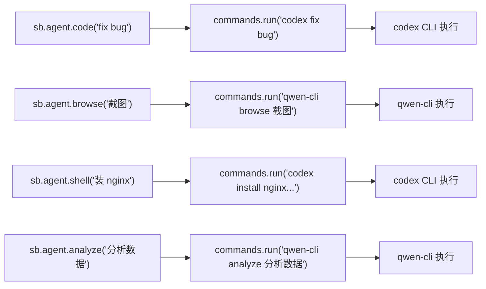
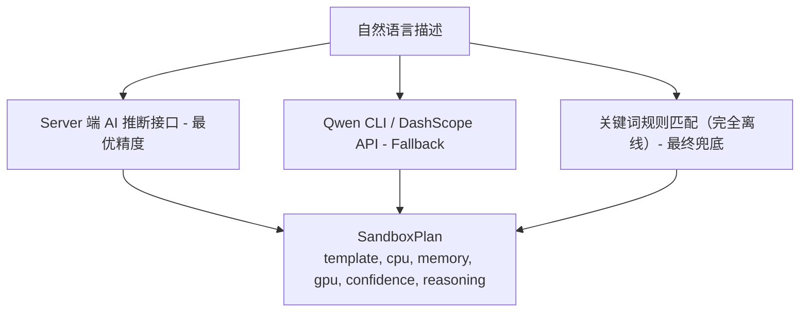

# 内置 Agent 高级 API 设计

> Easy Sandbox 内置 Agent 采用极简架构：沙箱模板内预装 AI CLI 工具（Codex、Qwen CLI 等），SDK Agent API 只是 `commands.run()` 的语法糖封装。SDK 零 LLM 依赖，保持轻量。

---

## 目录

1. [设计理念](#1-设计理念)
2. [架构概览](#2-架构概览)
3. [Agent 类型与实现映射](#3-agent-类型与实现映射)
4. [Agent 模板体系](#4-agent-模板体系)
5. [AgentModule SDK API](#5-agentmodule-sdk-api)
6. [使用示例](#6-使用示例)
7. [自然语言推断（简化实现）](#7-自然语言推断简化实现)
8. [Agent 框架集成](#8-agent-框架集成)
9. [版本管理与热更新](#9-版本管理与热更新)

---

## 1. 设计理念

### 为什么需要内置 Agent？

传统 Sandbox SDK 定位为「基础设施工具」— 提供沙箱创建、文件操作、命令执行等底层能力。用户需要自己编写复杂的编排逻辑。

Easy Sandbox 的定位是**「AI 能力平台」**— 底层能力 + 预装 AI CLI 工具的沙箱模板，让用户一行代码完成复杂任务：

```
传统 SDK:                          Easy Sandbox:
                                   
创建沙箱                            sb = await Sandbox.create(template="codex")
安装工具                            result = await sb.agent.code("fix bug in main.py")
编写 AI 调用逻辑                    print(result.output)
处理 LLM 认证                      # → 一行代码搞定！
解析返回结果
管理 LLM 依赖
销毁沙箱
```

### 核心原则

1. **SDK 零 LLM 依赖**：SDK 不引入任何 LLM 客户端库（不依赖 openai / anthropic / dashscope），保持轻量
2. **Agent API = 语法糖**：`sb.agent.code("task")` 本质上是 `sb.commands.run(f"codex {shlex.quote(task)}")` 的封装
3. **AI 能力在模板内**：AI CLI 工具（Codex、Qwen CLI）预装在沙箱模板中，认证信息通过沙箱环境变量注入
4. **用户可选择模板**：Codex 模板 / Qwen 模板 / 自定义模板，灵活切换不同 AI 后端
5. **可热更新**：升级模板内的 AI CLI 版本即可获得新能力，无需升级 SDK

---

## 2. 架构概览

### 核心架构：AI CLI 封装



### 为什么这样设计？

| 设计决策 | 理由 |
|----------|------|
| SDK 不内置 LLM Provider | 避免 SDK 体积膨胀，避免 LLM 库版本冲突 |
| AI 能力放在模板内 | AI CLI 工具的认证、模型选择、版本管理全在模板内完成 |
| 用户无需额外 API Key | AI 工具的认证在沙箱模板内预配置（通过环境变量注入） |
| Agent API 是语法糖 | 降低 SDK 复杂度，所有 Agent 行为最终都是 `commands.run()` |

### 与旧设计的对比

```
旧设计（已否决）:                    新设计（当前）:
                                   
SDK 内置 LLM Provider 适配          SDK 零 LLM 依赖
  - openai / anthropic / qwen        
5 种独立 Agent 实现                 Agent API = commands.run() 语法糖
  - BrowseAgent / CodeAgent /...     
AgentChain / FanOut / DAG 编排      不内置编排（用户用标准 Python 编排）
自定义 Agent 框架                   用户通过自定义模板扩展
  - 注册 system_prompt + tools
```

---

## 3. Agent 类型与实现映射

### 映射关系

| Agent 方法 | 实质执行 | 使用模板 |
|-----------|---------|---------|
| `sb.agent.code("fix bug")` | `sb.commands.run("codex 'fix bug'")` | `codex` |
| `sb.agent.browse("打开百度")` | `sb.commands.run("qwen-cli browse '打开百度'")` | `qwen-browser` |
| `sb.agent.shell("安装 nginx")` | `sb.commands.run("codex 'install nginx and configure'")` | `codex` |
| `sb.agent.analyze("分析数据")` | `sb.commands.run("qwen-cli analyze '分析数据'")` | `qwen-code` |

### 模板与 Agent 能力的对应

| 模板名 | 支持的 Agent 方法 | 预装工具 | 典型场景 |
|--------|------------------|---------|----------|
| `codex` | `code()`, `shell()` | OpenAI Codex CLI | 代码生成/修复、Shell 自动化 |
| `qwen-browser` | `browse()` | Qwen CLI + Playwright | 浏览器自动化、网页截图 |
| `qwen-code` | `code()`, `analyze()`, `shell()` | Qwen CLI + 多语言运行时 | 代码分析、数据分析 |

---

## 4. Agent 模板体系

### 官方 Agent 模板

| 模板名 | 描述 | 预装工具 | 资源默认值 |
|--------|------|---------|-----------|
| `codex` | Codex CLI 代码 Agent | OpenAI Codex CLI | 2C/4G/20G |
| `qwen-browser` | Qwen 浏览器 Agent | Qwen CLI + Playwright | 2C/4G/15G |
| `qwen-code` | Qwen 代码 Agent | Qwen CLI + 多语言运行时 | 2C/4G/20G |

> **说明**：Agent 模板内的 AI CLI 工具认证已预配置（通过沙箱环境变量注入），用户无需额外配置 API Key。

### 模板内部结构

Agent 模板本质上是在基础模板之上预装了 AI CLI 工具：

```
codex 模板:
  base: code-interpreter
  预装: OpenAI Codex CLI
  环境变量: OPENAI_API_KEY（平台注入）

qwen-browser 模板:
  base: browser-automation
  预装: Qwen CLI + Playwright + Chromium
  环境变量: DASHSCOPE_API_KEY（平台注入）

qwen-code 模板:
  base: code-interpreter
  预装: Qwen CLI + 多语言运行时
  环境变量: DASHSCOPE_API_KEY（平台注入）
```

### 自定义 Agent 模板

用户可以通过自定义模板扩展 Agent 能力：

```yaml
# template.yaml — 自定义 Agent 模板
version: "1"

metadata:
  name: my-agent-template
  description: "自定义 AI Agent 模板"

base:
  from: "codex"                    # 继承官方 codex 模板

build:
  pip_install: [flask, sqlalchemy] # 额外安装业务依赖
  env:
    MY_CUSTOM_CONFIG: "value"

agent:
  description: "适用于 Flask 项目的代码审查场景"
  triggers: ["flask", "代码审查", "安全扫描"]
```

```python
# 使用自定义模板
sb = await Sandbox.create(template="my-agent-template")
result = await sb.agent.code("审查这个 Flask 项目的安全性")
```

---

## 5. AgentModule SDK API

### 核心实现

```python
import shlex

class AgentModule:
    """Agent 语法糖 — 底层调用 commands.run()"""

    def __init__(self, sandbox: "Sandbox"):
        self._sandbox = sandbox

    async def code(self, task: str, *, context: dict | None = None, timeout: int = 120) -> AgentResult:
        """代码分析/生成/修复"""
        cmd = self._build_command("code", task, context)
        return await self._execute(cmd, timeout)

    async def browse(self, task: str, *, timeout: int = 120) -> AgentResult:
        """浏览器自动化"""
        cmd = self._build_command("browse", task)
        return await self._execute(cmd, timeout)

    async def shell(self, task: str, *, timeout: int = 120) -> AgentResult:
        """Shell 自动化"""
        cmd = self._build_command("shell", task)
        return await self._execute(cmd, timeout)

    async def analyze(self, task: str, *, timeout: int = 120) -> AgentResult:
        """数据分析"""
        cmd = self._build_command("analyze", task)
        return await self._execute(cmd, timeout)

    def _build_command(self, action: str, task: str, context: dict | None = None) -> str:
        """根据模板类型构建 CLI 命令

        映射逻辑：
          codex 模板      → codex '{task}'
          qwen-* 模板     → qwen-cli {action} '{task}'
          自定义模板       → 读取模板 agent 配置
        """
        template = self._sandbox._template_name
        safe_task = shlex.quote(task)

        if template.startswith("codex"):
            return f"codex {safe_task}"
        elif template.startswith("qwen-"):
            return f"qwen-cli {action} {safe_task}"
        else:
            # 自定义模板：尝试读取模板配置中的命令模式
            return self._build_custom_command(action, safe_task)

    async def _execute(self, cmd: str, timeout: int) -> AgentResult:
        """执行命令并解析结果"""
        result = await self._sandbox.commands.run(cmd, timeout=timeout)
        return AgentResult(output=result.stdout, exit_code=result.exit_code)
```

### AgentResult 数据模型

```python
@dataclass
class AgentResult:
    """Agent 执行结果"""
    output: str                # CLI 标准输出
    exit_code: int             # 退出码（0 = 成功）

    @property
    def success(self) -> bool:
        return self.exit_code == 0

    @property
    def text(self) -> str:
        """output 的别名，方便使用"""
        return self.output
```

---

## 6. 使用示例

### 代码 Agent

```python
from easy_sandbox import Sandbox

# 使用 Codex 模板
sb = await Sandbox.create(template="codex")
result = await sb.agent.code("分析 /app/main.py 的复杂度并给出优化建议")
print(result.output)

# 等价于直接调用：
result = await sb.commands.run("codex '分析 /app/main.py 的复杂度并给出优化建议'")
print(result.stdout)
```

### 浏览器 Agent

```python
sb = await Sandbox.create(template="qwen-browser")
result = await sb.agent.browse("访问 https://example.com 并截图首页")
print(result.output)

# 等价于：
result = await sb.commands.run("qwen-cli browse '访问 https://example.com 并截图首页'")
```

### Shell 自动化

```python
sb = await Sandbox.create(template="codex")
result = await sb.agent.shell("安装 nginx 并配置反向代理到 8080 端口")
print(result.output)
```

### 数据分析

```python
sb = await Sandbox.create(template="qwen-code")
await sb.files.write("/app/data.csv", csv_content)
result = await sb.agent.analyze("对这个 CSV 做趋势分析并生成图表")
print(result.output)
```

### Context Manager 自动清理

```python
async with await Sandbox.create(template="codex") as sb:
    result = await sb.agent.code("fix bug in main.py")
    print(result.output)
    # 退出时自动销毁沙箱
```

### 用户编排（替代旧 AgentChain）

不再内置 AgentChain / AgentFanOut / AgentDAG 编排，用户使用标准 Python 即可实现：

```python
import asyncio
from easy_sandbox import Sandbox

# === 串行编排 ===
async def serial_pipeline():
    sb = await Sandbox.create(template="codex")
    # 步骤 1：分析
    r1 = await sb.agent.code("分析 /app/main.py 的代码质量")
    # 步骤 2：根据分析结果修复
    r2 = await sb.agent.code(f"根据以下分析修复代码：{r1.output}")
    # 步骤 3：验证
    r3 = await sb.agent.shell("运行测试 pytest tests/ -v")
    await sb.kill()

# === 并行编排 ===
async def parallel_review():
    async def check(template, task):
        async with await Sandbox.create(template=template) as sb:
            return await sb.agent.code(task)

    results = await asyncio.gather(
        check("codex", "检查代码风格"),
        check("codex", "检查安全漏洞"),
        check("qwen-code", "检查性能问题"),
    )
    # 三个 Agent 并行执行，各自使用独立沙箱
```

---

## 7. 自然语言推断（简化实现）

自然语言创建沙箱的推断逻辑不再由 SDK 内部的 InferAgent 实现，而是通过外部调用：



### 规则匹配示例（离线兜底）

| 关键词 | 推断模板 | 推断资源 |
|--------|---------|---------|
| python, pandas, 数据分析, CSV | python-data-science | 2C/4G |
| node, web, 前端, react, vue | node-web | 1C/2G |
| playwright, 浏览器, 爬虫, 截图 | browser-automation | 2C/4G |
| GPU, CUDA, tensorflow, pytorch | ml-gpu | 4C/16G+GPU |
| codex, 代码生成, fix bug | codex | 2C/4G |

### SDK API

```python
from easy_sandbox import Sandbox

# 自然语言创建
sb = await Sandbox.create("运行 python 数据分析环境，需要 GPU")
# → 推断：template=python-data-science, gpu=auto, memory=8192

# 查看推断结果（不实际创建）
plan = await Sandbox.plan("需要一个能跑 TensorFlow 的环境")
print(plan)
# SandboxPlan(template='ml-gpu', cpu=4, memory=16384, gpu='A10', confidence=0.92, ...)

# 覆盖推断结果
sb = await Sandbox.create(plan, memory=32768)
```

---

## 8. Agent 框架集成

### Tool Schema 导出

沙箱操作工具遵循 OpenAI function calling 格式，可直接导出为 LangChain / CrewAI / AutoGen 等框架的 Tool Schema：

```python
from easy_sandbox.agent import get_tool_schema

# 导出为 OpenAI 格式
tools = get_tool_schema(format="openai")

# 导出为 LangChain 格式
tools = get_tool_schema(format="langchain")
```

### LangChain 适配器

```python
from easy_sandbox.integrations import LangChainToolkit

toolkit = LangChainToolkit(sandbox_config={"template": "code-interpreter"})
tools = toolkit.get_tools()

# 在 LangChain Agent 中使用
from langchain.agents import AgentExecutor
agent = AgentExecutor(tools=tools, llm=llm)
```

### CrewAI 适配器

```python
from easy_sandbox.integrations import CrewAIToolkit

toolkit = CrewAIToolkit()
tools = toolkit.get_tools()
```

> **说明**：框架集成层仅导出 Tool Schema 和提供适配器，不包含 LLM Provider 适配。LLM 的选择和配置由用户在各自的 Agent 框架中完成。SDK 本身不依赖任何 LLM 库。

---

## 9. 版本管理与热更新

### AI CLI 工具的版本管理

AI CLI 工具的版本由模板管理，与 SDK 版本解耦：

```
SDK 版本   →  控制 Agent API 接口（AgentModule 的方法签名）
模板版本   →  控制 AI CLI 工具版本（Codex CLI / Qwen CLI 的具体版本）
```

### 热更新机制

```
模板更新流程：
  1. 官方更新 codex 模板 → 内含新版 Codex CLI
  2. 用户下次 Sandbox.create(template="codex") → 自动拉取最新模板
  3. 新模板内的 Codex CLI 版本更高 → 获得新能力
  4. SDK 代码无需任何修改
```

### 模板版本锁定

```python
# 锁定特定版本
sb = await Sandbox.create(template="codex@1.2.0")

# 使用最新版本（默认行为）
sb = await Sandbox.create(template="codex")
```

```bash
# CLI 查看模板版本
ebx template info codex
# 模板: codex
# 版本: 1.3.0
# Codex CLI: v0.1.2
# 基础: code-interpreter
# 资源: 2C/4G/20G
```
