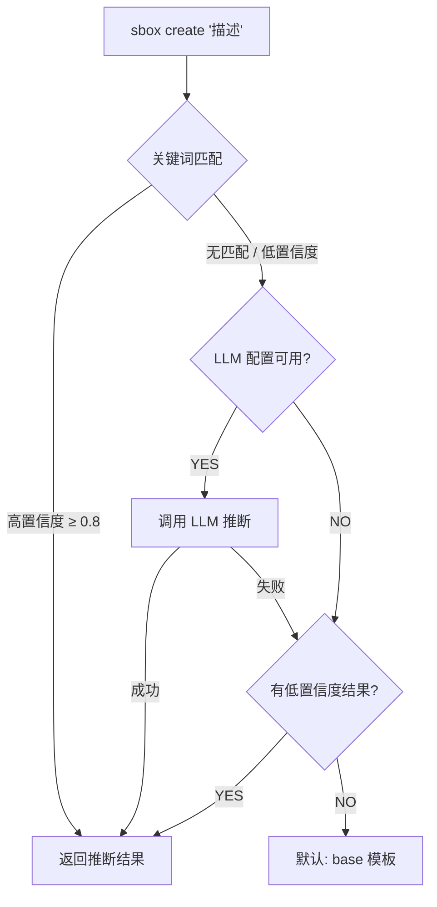

# CLI 命令体系设计

> `sbox` CLI 是 Serverless Sandbox 的命令行入口，兼顾人类开发者和 AI Agent 两种使用场景。CLI 的终极目标：**用户不需要知道模板、资源规格、配置参数，只需要描述想做什么，sandbox 自动搞定一切。**

***

## 目录

1. [命令树](#1-命令树)
2. [全局选项](#2-全局选项)
3. [自然语言创建](#3-自然语言创建)
4. [核心命令详述](#4-核心命令详述)
5. [配置管理](#5-配置管理)
6. [核心工作流](#6-核心工作流)
7. [AI Friendly 设计原则](#7-ai-friendly-设计原则)
8. [未来计划](#8-未来计划)

***

## 1. 命令树

```
sbox
├── create [description]              # 创建沙箱（支持自然语言推断）
├── list                              # 列出所有沙箱
├── info <sandbox-id>                 # 查看沙箱详情
├── kill <sandbox-id>                 # 销毁沙箱
├── kill --all                        # 销毁全部沙箱
├── exec <sandbox-id> <command>       # 在沙箱中执行裸 shell 命令
├── run <sandbox-id> <command-name> [--arg k=v ...]  # 调度模板声明的命名命令
├── connect <sandbox-id>              # 交互式连接（REPL）
├── upload <sandbox-id> <local> <remote>    # 上传文件/目录
├── download <sandbox-id> <remote> <local>  # 下载文件
├── install <template-ref>            # 安装社区模板（快捷方式）
│
├── template
│   ├── list                          # 列出可用模板
│   ├── info <template-id>            # 模板详情
│   ├── build -f <Dockerfile>         # 从 Dockerfile 构建模板
│   ├── delete <template-id>          # 删除模板
│   ├── install <template-ref>        # 从 Registry 安装模板
│   └── cache [--clear]               # 管理本地模板缓存
│
├── mcp
│   ├── install --target <ide>        # 安装 MCP Server 到 IDE
│   ├── start                         # 启动 MCP Server（STDIO 模式）
│   └── status                        # MCP Server 状态
│
└── config
    ├── get <key>                     # 获取配置值
    ├── set <key> <value>             # 设置配置值
    ├── list                          # 列出所有配置
    └── reset                         # 重置为默认配置
```

***

## 2. 全局选项

| 选项           | 缩写   | 说明                   | 默认值         |
| -------------- | ------ | ---------------------- | -------------- |
| `--json`       | `-j`   | 输出 JSON 格式（AI 友好） | `false`        |
| `--quiet`      | `-q`   | 静默模式，仅输出关键结果   | `false`        |
| `--verbose`    | `-v`   | 详细输出，含调试信息       | `false`        |
| `--no-color`   |        | 禁用颜色输出              | `false`        |
| `--timeout`    | `-t`   | 默认超时时间（秒）         | `300`          |
| `--region`     | `-r`   | 指定区域                  | `cn-hangzhou`  |
| `--profile`    | `-p`   | [预留] 配置档案           | `None`         |
| `--version`    |        | 显示版本号                |                |

```bash
# 示例：JSON 输出 + 静默
sbox list --json --quiet

# 指定区域
sbox create "python 环境" --region cn-shanghai
```

***

## 3. 自然语言创建

> 这是 CLI 最具革命性的特性 — **用自然语言描述你需要什么，sandbox 自动推断模板和配置。**

### 基本语法

```bash
sbox create "<自然语言描述>"
```

### 三级 Fallback 推断机制

CLI 使用三级 fallback 策略推断最佳模板：



**Level 1 — 关键词匹配**（离线，快速）：
基于模板关键词与用户描述的重叠度打分，支持中英文关键词。高置信度结果直接返回。

**Level 2 — LLM 推断**（需配置 `llm_api_key`）：
调用 OpenAI 兼容的 LLM API，由大模型选择最合适的模板。需要预先通过 `sbox config set llm_api_key <key>` 配置。

**Level 3 — 默认回退**：
当以上两级都无法确定时，使用 `base` 模板。

### 示例

```bash
# 自然语言描述 → 自动推断模板和配置
sbox create "运行 python，运行 codex"
# ✓ 推断结果：
#     模板: code-interpreter
#     CPU: 2 核  |  内存: 4096 MB
#     置信度: 0.95
# → 创建中...

sbox create "启动一个 Node.js Web 服务"
# ✓ 推断结果：
#     模板: node-web
#     CPU: 1 核  |  内存: 2048 MB
#     置信度: 0.85

sbox create "用 playwright 爬取网页并截图"
# ✓ 推断结果：
#     模板: browser-automation
#     CPU: 2 核  |  内存: 4096 MB
#     置信度: 0.90

# 带文件上传
sbox create "分析这个 CSV 文件" --upload data.csv
```

### 传统模板模式

```bash
# 直接指定模板 — 跳过推断
sbox create --template code-interpreter
sbox create -T python-data-science
```

### 可用模板列表

| 模板名                | 说明                              | CPU | 内存   |
| --------------------- | --------------------------------- | --- | ------ |
| `code-interpreter`    | Python 代码执行和数据分析环境      | 2   | 4096MB |
| `python-data-science` | 数据科学/ML，预装 pandas/numpy 等  | 2   | 4096MB |
| `node-web`            | Node.js Web 服务开发环境           | 1   | 2048MB |
| `browser-automation`  | 浏览器自动化，预装 Chromium        | 2   | 4096MB |
| `codex`               | OpenAI Codex CLI Agent 运行环境    | 2   | 4096MB |
| `full-stack`          | 全栈开发环境（Node.js + Python）   | 2   | 4096MB |
| `base`                | 基础 Ubuntu 环境                   | 1   | 1024MB |

***

## 4. 核心命令详述

### sbox create

```bash
sbox create [DESCRIPTION] [选项]

参数：
  DESCRIPTION               自然语言描述（可选，用于自动推断模板）

选项：
  --template, -T <name>     指定模板名（跳过推断）
  --upload, -u <path>       创建后上传本地文件/目录
  --timeout, -t <seconds>   沙箱超时时间
  --env, -e <KEY=VALUE>     环境变量（可多次使用）
  --metadata, -m <KEY=VALUE> 元数据键值对（可多次使用）

示例：
  sbox create "python 数据分析"
  sbox create --template code-interpreter
  sbox create "Node.js API" -e PORT=3000
  sbox create "分析数据" --upload ./data.csv
  sbox create -T base -e DB_HOST=localhost -m project=demo
```

### sbox list

```bash
sbox list [选项]

选项：
  --status, -s <status>     按状态过滤 (running/stopped/creating/paused/error)
  --limit, -l <n>           限制数量 (默认: 20)

示例：
  sbox list
  sbox list --status running --json
  sbox list -l 50
```

**输出格式**：

```
$ sbox list
  ID            Template             Status    Region
  sb-a1b2c3d4   code-interpreter     running   cn-hangzhou
  sb-e5f6g7h8   python-data-science  running   cn-hangzhou
  sb-i9j0k1l2   base                 stopped   cn-shanghai
```

### sbox info

```bash
sbox info <sandbox-id>

示例：
  sbox info sb-a1b2c3d4
  sbox info sb-a1b2c3d4 --json
```

**输出格式**：

```
$ sbox info sb-a1b2c3d4
  ID:           sb-a1b2c3d4
  Template:     code-interpreter
  Status:       running
  Region:       cn-hangzhou
  Timeout:      300s
  URL:          https://sb-a1b2c3d4.envd.example.com
  Started:      2026-09-01 14:00:00
```

### sbox kill

```bash
sbox kill <sandbox-id> [选项]
sbox kill --all [选项]

选项：
  --all                     销毁所有运行中的沙箱
  --yes, -y                 跳过确认提示

示例：
  sbox kill sb-abc123
  sbox kill sb-abc123 --yes
  sbox kill --all --yes
```

### sbox exec

```bash
sbox exec <sandbox-id> <command> [选项]

选项：
  --timeout, -t <seconds>   命令超时 (默认: 60)
  --cwd <path>              工作目录 (默认: /app)

示例：
  sbox exec sb-abc123 "python train.py"
  sbox exec sb-abc123 "npm start" --timeout 120
  sbox exec sb-abc123 "ls -la" --json
```

**输出格式**：

```
$ sbox exec sb-abc123 "python -c 'print(1+1)'"
2

$ sbox exec sb-abc123 "python -c 'print(1+1)'" --json
{
  "stdout": "2\n",
  "stderr": "",
  "exit_code": 0,
  "execution_time": 0.12
}
```

`exec` 命令会将沙箱中命令的退出码作为自身的退出码传播。

### sbox run

```bash
sbox run <sandbox-id> <command-name> [选项]

参数：
  command-name              模板 `custom_commands` 中声明的命名命令

选项：
  --arg, -a <KEY=VALUE>     命名命令参数（可多次使用）
  --timeout, -t <seconds>   覆盖命令声明的超时

示例：
  sbox run sb-abc123 serve --arg port=9000
  sbox run sb-abc123 migrate --arg target=head --json
```

`run` 是**模板感知**的命名命令分发：根据沙箱模板的 `custom_commands` 声明解析 `command-name`，将 `--arg` 传入的参数按 `args` schema 校验并经 `shlex.quote()` 转义后填充命令模板，再在沙箱内执行。

**`run` 与 `exec` 的语义分工**：

- `sbox exec` = 裸 shell 命令（任意字符串，需 `shell` 能力）。
- `sbox run` = 模板声明的命名命令（结构化参数 + 防注入）。

错误处理：

- `command-name` 未声明 → 报错并列出可用命令。
- 缺少 `required` 参数 → 执行前报错。
- 沙箱缺少命令所需能力 → 抛出 `CapabilityNotSupportedError`（E3xxx），含修复建议。

详见 ADR `2026-09-03-cli-run-vs-exec.md`。

### sbox connect

```bash
sbox connect <sandbox-id>

示例：
  sbox connect sb-abc123
```

连接到沙箱的交互式 REPL。每条命令在独立进程中执行，输入 `exit`、`quit` 或 `Ctrl+D` 断开连接。

**交互示例**：

```
$ sbox connect sb-abc123
✓ Connected to sandbox sb-abc123
Type 'exit' or Ctrl+D to disconnect
Note: each command runs in an independent process

sbox:sb-abc1> ls /app
main.py  data/  requirements.txt

sbox:sb-abc1> python -c "print('hello')"
hello

sbox:sb-abc1> exit
Disconnected.
```

### sbox upload

```bash
sbox upload <sandbox-id> <local-path> <remote-path>

示例：
  sbox upload sb-abc123 ./script.py /app/script.py
  sbox upload sb-abc123 ./data/ /app/data/
```

支持上传单个文件或整个目录。上传目录时会递归上传所有文件。

### sbox download

```bash
sbox download <sandbox-id> <remote-path> <local-path>

示例：
  sbox download sb-abc123 /app/result.csv ./result.csv
  sbox download sb-abc123 /app/output.log .
```

下载沙箱中的文件到本地。`local-path` 如果是目录，文件名取自远程路径。

### sbox install

```bash
sbox install <template-ref> [选项]

选项：
  --registry-url <url>      Registry URL（默认 GitHub）
  --registry-type <type>    Registry 类型 (github/local)，自动检测
  --token <token>           访问令牌（私有仓库需要）
  --alias, -a <name>        模板别名

示例：
  sbox install owner/repo
  sbox install owner/repo//subdir@v1.0
  sbox install ./my-template --registry-type local
```

这是 `sbox template install` 的顶层快捷方式。

### sbox template

#### template list

```bash
sbox template list
```

列出所有自定义模板（通过 Platform API 查询）。

#### template info

```bash
sbox template info <template-id>
```

查看模板详细信息。

#### template build

```bash
sbox template build -f <Dockerfile> [--alias <name>]
```

从 Dockerfile 构建自定义模板，提交到平台构建。

#### template install

```bash
sbox template install <template-ref> [选项]

选项：
  --registry-url <url>      Registry URL（默认 GitHub）
  --registry-type <type>    Registry 类型 (github/local)
  --token <token>           访问令牌（私有仓库需要）
  --alias, -a <name>        模板别名

示例：
  sbox template install owner/repo              # 整个仓库
  sbox template install owner/repo//subdir      # 指定子目录
  sbox template install owner/repo@v1.0         # 指定版本
  sbox template install owner/repo --token xxx  # 私有仓库
  sbox template install ./my-template           # 本地目录
```

从 GitHub 或本地目录安装模板。模板目录须包含 `template.yaml` 文件。

#### template delete

```bash
sbox template delete <template-id>
```

删除自定义模板（需确认）。

#### template cache

```bash
sbox template cache [--clear]
```

管理本地模板缓存。`--clear` 清除所有缓存。

### sbox mcp

#### mcp install

```bash
sbox mcp install --target <cursor|claude|vscode>
```

安装 MCP Server 配置到指定 IDE。支持 Cursor、Claude Desktop 和 VS Code。安装后会列出注册的工具列表：

- `create_sandbox` — 创建云端沙箱
- `run_code` — 执行代码
- `run_command` — 执行命令
- `read_file` — 读取文件
- `write_file` — 写入文件
- `list_files` — 列出文件
- `kill_sandbox` — 销毁沙箱

#### mcp start

```bash
sbox mcp start [选项]

选项：
  --template <name>         默认沙箱模板 (默认: code-interpreter-v1)
  --api-key <key>           API Key 覆盖 (环境变量: E2B_API_KEY)
  --api-url <url>           API URL 覆盖 (环境变量: E2B_API_URL)
  --domain <domain>         Domain 覆盖 (环境变量: E2B_DOMAIN)
```

以 STDIO 模式启动 MCP Server。通常由 IDE 自动调用，不需要手动执行。

#### mcp status

```bash
sbox mcp status
```

显示 MCP Server 状态：传输模式、工具数量、认证配置、各 IDE 安装状态。

***

## 5. 配置管理

配置文件位于 `~/.sbox/config.toml`，API Key 单独存放于 `~/.sbox/.env`。

### 可配置项

| 配置键          | 说明                                  | 默认值                    |
| --------------- | ------------------------------------- | ------------------------- |
| `api_key`       | E2B API Key                           | (未设置)                  |
| `api_url`       | Platform API URL                      | (自动)                    |
| `region`        | 默认区域                               | `cn-hangzhou`             |
| `http_timeout`  | HTTP 请求超时（秒）                    | (自动)                    |
| `max_retries`   | 最大重试次数                           | (自动)                    |
| `domain`        | Envd Domain                           | (自动)                    |
| `llm_api_key`   | LLM API Key（用于自然语言推断）         | (未设置)                  |
| `llm_model`     | LLM 模型名称                          | `qwen-plus`              |
| `llm_base_url`  | LLM API Base URL（OpenAI 兼容）       | DashScope 兼容端点        |

敏感配置项（`api_key`、`llm_api_key`）在 `config list` 输出中自动脱敏显示。

### 命令示例

```bash
# 设置 API Key
sbox config set api_key e2b_xxx

# 配置 LLM（启用自然语言推断的 Level 2）
sbox config set llm_api_key sk-xxx
sbox config set llm_model qwen-plus
sbox config set llm_base_url https://dashscope.aliyuncs.com/compatible-mode/v1

# 查看配置
sbox config list
sbox config get region

# 重置所有配置
sbox config reset --yes
```

LLM 配置也支持环境变量覆盖：`SBOX_LLM_API_KEY`、`SBOX_LLM_MODEL`、`SBOX_LLM_BASE_URL`。

***

## 6. 核心工作流

### 工作流 1：快速实验

```bash
# 一行命令，从描述到可用环境
sbox create "python 数据分析，需要 pandas 和 matplotlib"
# → sb-abc123

sbox exec sb-abc123 "python -c 'import pandas; print(pandas.__version__)'"
# 2.1.0

sbox kill sb-abc123
```

### 工作流 2：文件交互开发

```bash
# 创建沙箱并上传项目
sbox create -T code-interpreter --upload ./project

# 查看沙箱内容
sbox exec sb-abc123 "ls /home/user/"

# 执行代码
sbox exec sb-abc123 "python /home/user/main.py"

# 下载结果
sbox download sb-abc123 /app/result.csv ./result.csv

# 完成后销毁
sbox kill sb-abc123 --yes
```

### 工作流 3：交互式调试

```bash
# 创建并连接到沙箱
sbox create -T code-interpreter
sbox connect sb-abc123

# 在交互式 REPL 中操作
sbox:sb-abc1> pip install requests
sbox:sb-abc1> python my_script.py
sbox:sb-abc1> cat /app/output.log
sbox:sb-abc1> exit
```

### 工作流 4：AI Agent 集成

```bash
# 安装 MCP Server 到 Cursor
sbox mcp install --target cursor

# 检查状态
sbox mcp status

# AI Agent 通过 MCP 自动使用沙箱
# （在 Cursor/Claude 中自然语言操作）
```

### 工作流 5：自定义模板

```bash
# 从 GitHub 安装社区模板
sbox install owner/my-template

# 或从 Dockerfile 构建
sbox template build -f ./Dockerfile --alias my-ml-env

# 查看模板状态
sbox template list

# 使用自定义模板
sbox create --template my-ml-env
```

***

## 7. AI Friendly 设计原则

CLI 同时为人类和 AI 设计，以下原则确保 AI Agent 能高效使用 CLI：

### 原则 1：结构化输出

```bash
# 所有命令支持 --json，输出结构化 JSON
sbox list --json
sbox info sb-abc123 --json
sbox exec sb-abc123 "echo hello" --json
```

### 原则 2：确定性退出码

| 退出码 | 含义     |
| ------ | -------- |
| `0`    | 成功     |
| `1`    | 一般错误 |
| `2`    | 参数错误 |
| `3`    | 认证失败 |
| `4`    | 资源不存在 |
| `5`    | 超时     |
| `6`    | 配额超限 |

### 原则 3：无交互模式

```bash
# --yes 跳过确认（kill、reset 等命令支持）
sbox kill --all --yes
sbox config reset --yes

# --quiet 最小化输出
sbox create "python 环境" --quiet
```

### 原则 4：可组合管道

```bash
# 创建后直接获取 ID
ID=$(sbox create "python 环境" --quiet)

# 管道组合
sbox list --json | jq '.[].sandbox_id'

# 批量销毁
sbox list --json | jq -r '.[].sandbox_id' | xargs -I{} sbox kill {} --yes
```

### 原则 5：自描述帮助

```bash
# 每个命令的 --help 包含完整说明
sbox create --help
sbox template install --help

# 错误信息包含修复建议
$ sbox config set unknown_key value
Error: Unknown config key: 'unknown_key'
Available keys: api_key, api_url, domain, ...
```

### 原则 6：懒加载高性能

CLI 使用 `LazyGroup` 实现懒加载，`sbox --help` 响应时间 < 200ms。只有实际执行命令时才加载对应模块和依赖。

***

## 8. 未来计划

以下功能尚未实现，计划在后续版本中加入：

- **`sbox deploy [path]`**：一行命令部署项目到沙箱，自动检测项目类型、安装依赖、启动服务
- **`sbox build [path]`**：从项目目录自动检测并构建沙箱镜像
- **`sbox logs <sandbox-id>`**：查看沙箱实时日志
- **`sbox hibernate / wake`**：沙箱休眠与唤醒
- **`sbox snapshot`**：创建沙箱快照
- **Sandbox Pool**：预热沙箱池，支持批量任务场景
- **热重载模式**：`--watch` 标志，本地文件变更自动同步到沙箱
