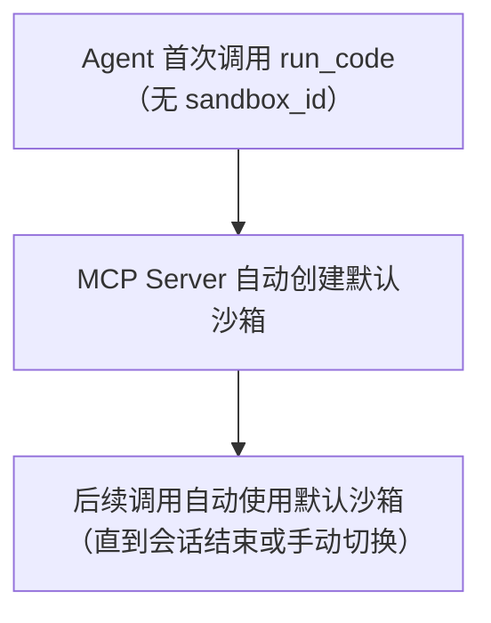
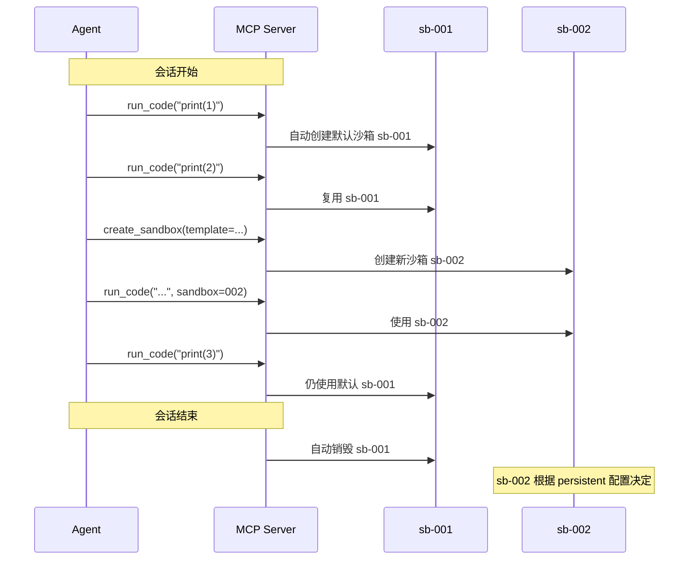
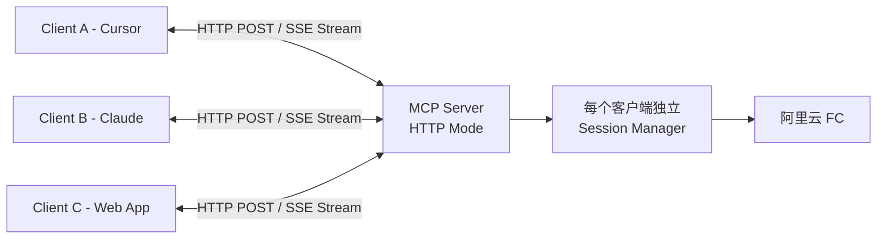
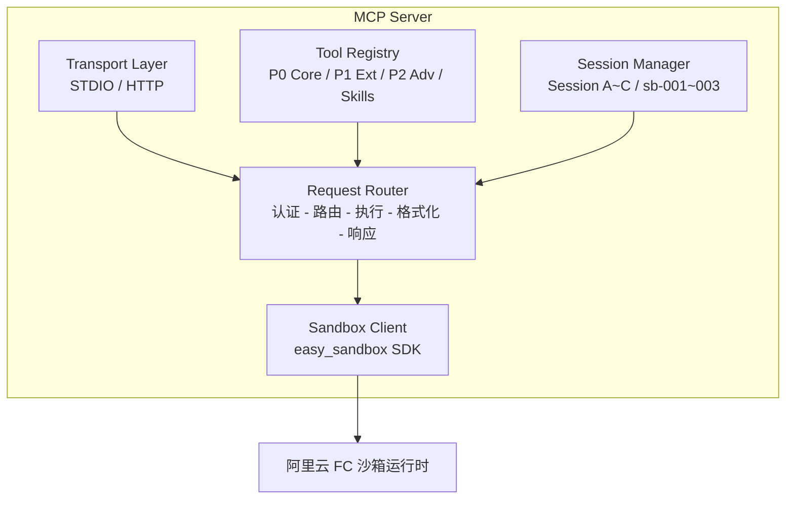

# MCP Server 设计

> Easy Sandbox MCP Server 将沙箱能力暴露为 MCP (Model Context Protocol) Tools，让 AI Agent（Cursor、Claude Desktop、VS Code 等）可以直接操作云端沙箱。

---

## 1. Tools 定义

### P0 — 核心工具（7 个）

#### create_sandbox

```json
{
  "name": "create_sandbox",
  "description": "创建一个云端沙箱环境。支持自然语言描述自动推断配置。",
  "inputSchema": {
    "type": "object",
    "properties": {
      "description": {
        "type": "string",
        "description": "自然语言描述需要什么环境（如 '运行 Python 数据分析'），或模板名（如 'code-interpreter'）"
      },
      "template": {
        "type": "string",
        "description": "沙箱模板名称。如果提供了 description 且为自然语言，此参数可省略"
      },
      "timeout": {
        "type": "integer",
        "description": "沙箱超时时间（秒），默认 300",
        "default": 300
      },
      "persistent": {
        "type": "boolean",
        "description": "🔮 远期规划 — 是否创建持久沙箱（待底层能力支持）",
        "default": false
      }
    }
  },
  "returns": {
    "sandbox_id": "string — 沙箱 ID",
    "url": "string — 沙箱访问 URL",
    "status": "string — 沙箱状态"
  }
}
```

#### run_code

```json
{
  "name": "run_code",
  "description": "在沙箱中执行代码。支持 Python、JavaScript、Shell 等语言。",
  "inputSchema": {
    "type": "object",
    "properties": {
      "code": {
        "type": "string",
        "description": "要执行的代码"
      },
      "language": {
        "type": "string",
        "description": "编程语言",
        "enum": ["python", "javascript", "shell", "typescript", "r"],
        "default": "python"
      },
      "sandbox_id": {
        "type": "string",
        "description": "沙箱 ID。省略时使用默认沙箱"
      },
      "timeout": {
        "type": "integer",
        "description": "执行超时（秒）",
        "default": 30
      }
    },
    "required": ["code"]
  },
  "returns": {
    "stdout": "string",
    "stderr": "string",
    "exit_code": "integer",
    "output_files": "array — 生成的文件列表"
  }
}
```

#### run_command

```json
{
  "name": "run_command",
  "description": "在沙箱中执行 Shell 命令。",
  "inputSchema": {
    "type": "object",
    "properties": {
      "command": { "type": "string", "description": "Shell 命令" },
      "sandbox_id": { "type": "string", "description": "沙箱 ID" },
      "cwd": { "type": "string", "description": "工作目录", "default": "/app" },
      "timeout": { "type": "integer", "default": 60 }
    },
    "required": ["command"]
  },
  "returns": {
    "stdout": "string",
    "stderr": "string",
    "exit_code": "integer"
  }
}
```

#### read_file

```json
{
  "name": "read_file",
  "description": "读取沙箱中的文件内容。",
  "inputSchema": {
    "type": "object",
    "properties": {
      "path": { "type": "string", "description": "文件路径" },
      "sandbox_id": { "type": "string" },
      "encoding": { "type": "string", "default": "utf-8" }
    },
    "required": ["path"]
  },
  "returns": { "content": "string" }
}
```

#### write_file

```json
{
  "name": "write_file",
  "description": "在沙箱中创建或覆写文件。",
  "inputSchema": {
    "type": "object",
    "properties": {
      "path": { "type": "string", "description": "文件路径" },
      "content": { "type": "string", "description": "文件内容" },
      "sandbox_id": { "type": "string" }
    },
    "required": ["path", "content"]
  },
  "returns": { "success": "boolean", "size": "integer" }
}
```

#### list_files

```json
{
  "name": "list_files",
  "description": "列出沙箱中指定目录的文件和子目录。",
  "inputSchema": {
    "type": "object",
    "properties": {
      "path": { "type": "string", "default": "/app" },
      "sandbox_id": { "type": "string" }
    }
  },
  "returns": {
    "files": "array — [{name, path, type, size, modified}]"
  }
}
```

#### kill_sandbox

```json
{
  "name": "kill_sandbox",
  "description": "销毁指定沙箱或默认沙箱。",
  "inputSchema": {
    "type": "object",
    "properties": {
      "sandbox_id": { "type": "string", "description": "省略时销毁默认沙箱" }
    }
  },
  "returns": { "success": "boolean" }
}
```

### P1 — 扩展工具（6 个）

| 工具名 | 描述 | 关键参数 |
|--------|------|----------|
| `upload_file` | 上传本地文件到沙箱 | `local_path`, `remote_path` |
| `download_file` | 从沙箱下载文件 | `remote_path`, `local_path` |
| `list_sandboxes` | 列出所有活跃沙箱 | `status` (running) |
| `sandbox_info` | 获取沙箱详细信息 | `sandbox_id` |
| `get_url` | 获取沙箱端口的公网 URL | `port`, `sandbox_id` |
| `install_packages` | 在沙箱中安装包 | `packages[]`, `manager` (pip/npm/apt) |

### P2 — 高级工具（3 个）

| 工具名 | 描述 | 关键参数 |
|--------|------|----------|
| `agent_code` | 调用沙箱内 AI CLI 执行代码任务 | `task`, `sandbox_id` |
| `agent_browse` | 调用沙箱内 AI CLI 执行浏览器任务 | `task`, `sandbox_id` |
| `deploy_project` | 部署项目到沙箱 | `project_dir`, `name` |

### 🔮 远期规划工具

| 工具名 | 描述 | 说明 |
|--------|------|------|
| `snapshot_sandbox` | 创建沙箱快照 | 待底层 Snapshot 能力支持 |
| `hibernate_sandbox` | 休眠沙箱 | 待底层休眠能力支持 |
| `wake_sandbox` | 唤醒休眠沙箱 | 待底层休眠能力支持 |

---

## 2. 会话绑定设计

### 默认沙箱概念

MCP Server 引入「默认沙箱」概念，简化 Agent 操作：



**行为规则**：

1. 首次调用任何需要沙箱的工具时，如未指定 `sandbox_id`，自动创建默认沙箱
2. 默认沙箱使用 `code-interpreter` 模板
3. 默认沙箱在会话结束时自动销毁（STDIO 模式）或超时销毁（HTTP 模式）
4. Agent 可通过 `create_sandbox` 显式创建新沙箱，并通过 `sandbox_id` 切换



---

## 3. 传输方式

### STDIO — 本地 IDE 集成


**适用场景**：本地开发，单用户，IDE 直接启动。

**启动方式**：IDE 配置中指定命令，IDE 自动启动进程。

### HTTP + SSE — 远程多客户端



**适用场景**：远程服务、团队共享、多客户端同时使用。

**启动方式**：`ebx mcp start --transport http --port 8765`

---

## 4. Server 架构图



---

## 5. 安装方式

### 一键安装

```bash
# 安装到 Cursor
ebx mcp install --target cursor

# 安装到 Claude Desktop
ebx mcp install --target claude

# 安装到 VS Code (Copilot)
ebx mcp install --target vscode

# 安装到 Qoder
ebx mcp install --target qoder

# 安装并指定 Skills
ebx mcp install --target cursor --skills data-analysis,playwright

# 安装 HTTP 模式（远程服务器）
ebx mcp install --transport http --port 8765
```

### 安装过程

```bash
$ ebx mcp install --target cursor

✓ 检测 Cursor 配置目录: ~/.cursor/
✓ 写入 MCP 配置: ~/.cursor/mcp.json
✓ 验证认证信息: API Key 已配置
✓ 安装完成！

请重启 Cursor 以生效。MCP Server 将在 Cursor 启动时自动运行。

已注册工具:
  • create_sandbox  — 创建云端沙箱
  • run_code        — 执行代码
  • run_command     — 执行命令
  • read_file       — 读取文件
  • write_file      — 写入文件
  • list_files      — 列出文件
  • kill_sandbox    — 销毁沙箱
```

---

## 6. 配置示例

### Claude Desktop 配置

```json
// ~/Library/Application Support/Claude/claude_desktop_config.json
{
  "mcpServers": {
    "easy-sandbox": {
      "command": "ebx",
      "args": ["mcp", "start", "--transport", "stdio"],
      "env": {
        "SANDBOX_API_KEY": "your-api-key",
        "SANDBOX_REGION": "cn-hangzhou"
      }
    }
  }
}
```

### Cursor 配置

```json
// ~/.cursor/mcp.json
{
  "mcpServers": {
    "easy-sandbox": {
      "command": "ebx",
      "args": ["mcp", "start"],
      "env": {
        "SANDBOX_API_KEY": "your-api-key"
      }
    }
  }
}
```

### VS Code 配置

```json
// .vscode/settings.json
{
  "mcp.servers": {
    "easy-sandbox": {
      "command": "ebx",
      "args": ["mcp", "start"],
      "env": {
        "SANDBOX_API_KEY": "your-api-key"
      }
    }
  }
}
```

### HTTP 模式配置（远程服务）

```bash
# 启动 HTTP MCP Server
ebx mcp start --transport http --port 8765 --host 0.0.0.0

# 客户端连接
# SSE endpoint: http://server:8765/sse
# POST endpoint: http://server:8765/messages
```

```json
// 远程 MCP 配置
{
  "mcpServers": {
    "easy-sandbox-remote": {
      "url": "http://your-server:8765/sse",
      "transport": "sse"
    }
  }
}
```
