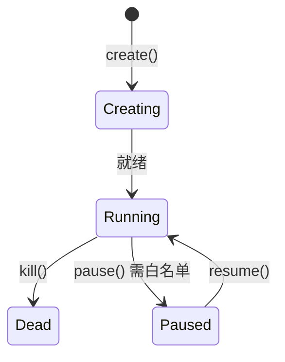

# 沙箱类型体系设计

> Easy Sandbox 提供三种沙箱模式，覆盖从一次性脚本到长期运行服务的全部场景。当前**仅临时沙箱（Ephemeral）完整支持**，持久沙箱和休眠沙箱为远期规划。

---

## 1. 三种沙箱模式

### 临时沙箱（Ephemeral）

**定位**：用完即弃的一次性执行环境，最常用的模式。**当前唯一完整支持的沙箱类型。**

```python
# 默认就是临时沙箱
sb = await Sandbox.create(template="code-interpreter")
result = await sb.run_code("print('hello')")
await sb.kill()  # 销毁后数据全部丢失

# Context Manager 自动销毁
async with await Sandbox.create(template="code-interpreter") as sb:
    result = await sb.run_code("print('hello')")
    # 退出即销毁
```

### 持久沙箱（Persistent）— 🔮 远期规划

> **⚠️ 需底层能力支持，当前为远期规划。** 持久沙箱依赖底层平台的持久化存储能力，需等待阿里云 FC 支持后实现。

**定位**：长期运行的开发/服务环境，状态跨会话保留。

```python
# Future API — 待底层支持
from easy_sandbox import Sandbox

sb = await Sandbox.create(
    template="python-base",
    persistent=True,
    name="my-dev-env",
)

# 安装依赖（状态会保留）
await sb.commands.run("pip install flask sqlalchemy")

# 稍后重新连接
sb = await Sandbox.connect("my-dev-env")
result = await sb.commands.run("pip list")  # flask, sqlalchemy 仍在
```

### 休眠沙箱（Hibernated）— 🔮 远期规划

> **⚠️ 需底层能力支持，当前为远期规划。** 休眠沙箱依赖底层平台的 Snapshot / CRIU 等能力，需等待底层支持后实现。

**定位**：状态冻结后挂起，唤醒时恢复到冻结时刻，节省计费。

```python
# Future API — 待底层支持
from easy_sandbox import Sandbox

sb = await Sandbox.create(
    template="python-data-science",
    hibernate_after=300,
    on_exit="hibernate",
)

# 使用沙箱...
await sb.run_code("import pandas as pd; df = pd.read_csv('data.csv')")

await sb.hibernate()       # 停止计费
sb = await Sandbox.connect("sb-xxx")
await sb.wake_up()         # 恢复到休眠时状态
```

---

## 2. 对比矩阵

| 特性 | 临时（Ephemeral） | 持久（Persistent）🔮 | 休眠（Hibernated）🔮 |
|------|-------------------|--------------------|--------------------|
| **实现状态** | **当前可用** | 远期规划 | 远期规划 |
| **生命周期** | 任务结束即销毁 | 持续运行直到手动销毁 | 冻结后可随时唤醒 |
| **状态持久** | 无 | 全量持久化 | 快照式冻结 |
| **文件系统** | tmpfs（内存盘） | 持久化存储 | 冻结时快照 |
| **进程** | 任务完成即停止 | 后台持续运行 | 冻结/恢复 |
| **网络** | 临时端口映射 | 固定域名/端口 | 唤醒后恢复 |
| **启动时间** | 冷启动 ~2s | 已在运行 ~0s | 唤醒 ~3-5s |
| **计费** | 按使用时长 | 持续计费 | 休眠期间低费/免费 |
| **最大时长** | 默认 5 分钟 | 无限制 | 休眠可保持 30 天 |
| **典型场景** | 代码执行、数据分析 | 开发环境、Web 服务 | 间歇性使用的项目 |
| **自动清理** | 超时自动销毁 | 手动管理 | 超过保留期自动清理 |

---

## 3. 生命周期状态机



> **说明**：`pause()` / `resume()` 状态转换需白名单权限，当前为受限功能。Snapshot 相关状态转换为远期规划，不在当前状态机中体现。

状态转换规则：

| 转换 | 条件 | 状态 |
|------|------|------|
| Creating → Running | 正常启动 | 当前支持 |
| Creating → Dead | 创建失败 | 当前支持 |
| Running → Dead | `kill()` 或超时 | 当前支持 |
| Running → Paused | `pause()`，需白名单 | 受限功能 |
| Paused → Running | `resume()` | 受限功能 |
| Paused → Dead | `kill()` | 受限功能 |

---

## 4. 各模式 API 示例

### 临时沙箱 — 典型工作流

```python
from easy_sandbox import Sandbox

# 场景：AI Agent 执行一次性代码
async def execute_code(code: str) -> str:
    async with await Sandbox.create(template="code-interpreter") as sb:
        result = await sb.run_code(code)
        return result.text

# 场景：批量数据处理
async def process_batch(items: list[str]) -> list[str]:
    results = []
    async with await Sandbox.create(template="python-data-science") as sb:
        for item in items:
            result = await sb.run_code(f"process('{item}')")
            results.append(result.text)
    return results
```

### 持久沙箱 — 开发环境（🔮 远期规划）

> **以下 API 待底层能力支持后实现。**

```python
from easy_sandbox import Sandbox

# 创建或连接持久开发环境
try:
    sb = await Sandbox.connect("my-dev-env")
except SandboxNotFoundError:
    sb = await Sandbox.create(
        template="full-stack",
        persistent=True,
        name="my-dev-env",
        cpu=4,
        memory=8192,
        env={"NODE_ENV": "development"},
    )

# 启动开发服务器（后台运行）
process = await sb.commands.start("npm run dev")

# 获取访问地址
url = await sb.network.get_url(3000)
print(f"开发服务器: {url}")

# 文件监听
async for event in sb.files.watch("/app/src"):
    print(f"文件变更: {event.path} ({event.type})")
```

### 休眠沙箱 — 间歇性项目（🔮 远期规划）

> **以下 API 待底层能力支持后实现。**

```python
from easy_sandbox import Sandbox

# 创建支持休眠的沙箱
sb = await Sandbox.create(
    template="python-data-science",
    name="ml-project",
    hibernate_after=600,    # 10 分钟无操作自动休眠
    on_exit="hibernate",
)

# 训练模型（耗时操作）
await sb.run_code("""
import joblib
from sklearn.ensemble import RandomForestClassifier
model = RandomForestClassifier(n_estimators=1000)
model.fit(X_train, y_train)
joblib.dump(model, '/app/model.pkl')
""")

# 离开，沙箱自动休眠（停止计费）
# ... 几天后 ...

# 唤醒，继续工作
sb = await Sandbox.connect("ml-project")
await sb.wake_up()

# 模型文件和环境都还在
result = await sb.run_code("""
import joblib
model = joblib.load('/app/model.pkl')
print(f"模型已加载，特征数: {model.n_features_in_}")
""")
```

### 快照 — 环境复制（🔮 远期规划）

> **以下 API 待底层 Snapshot 能力支持后实现。**

```python
# 在训练好的环境上创建快照
snapshot_id = await sb.snapshot("trained-model-v1")

# 从快照创建多个新沙箱（用于并行推理）
workers = []
for i in range(5):
    w = await Sandbox.create(
        from_snapshot=snapshot_id,
        name=f"inference-worker-{i}",
    )
    workers.append(w)

# 每个 worker 都有完整的模型环境
```

---

## 5. 自动清理策略

### 临时沙箱

| 触发条件 | 动作 | 默认值 |
|----------|------|--------|
| 达到 `timeout` 时间 | 强制销毁 | 300s |
| Context Manager 退出 | 优雅销毁 | — |
| 客户端断开连接 | 等待 → 销毁 | 等待 30s |
| 进程全部退出 | 销毁 | — |

### 持久沙箱（🔮 远期规划）

| 触发条件 | 动作 | 默认值 |
|----------|------|--------|
| 手动 `kill()` | 销毁 | — |
| CLI `ebx kill` | 销毁 | — |
| 账户欠费 | 冻结 → 7 天后销毁 | — |

### 全局清理策略

```python
from easy_sandbox import Config

# 全局配置自动清理
Config.set(
    auto_cleanup=True,
    ephemeral_timeout=300,       # 临时沙箱最大存活时间
    hibernate_idle=600,          # 休眠前空闲等待时间
    hibernate_retention=2592000, # 休眠保留期（30天）
    orphan_cleanup=True,         # 清理无主沙箱
    orphan_grace_period=3600,    # 无主沙箱宽限期（1小时）
)
```

---

## 6. 计费模型

### 计费维度

```
总费用 = 计算费用 + 存储费用 + 网络费用

计算费用 = CPU 单价 × CPU 核数 × 运行时长
         + 内存单价 × 内存大小 × 运行时长
         + GPU 单价 × GPU 数量 × 运行时长

存储费用 = 持久存储单价 × 存储大小 × 保留时长（🔮远期）

网络费用 = 公网出流量 × 流量单价
```

### 各模式计费特点

| 模式 | 计算费用 | 存储费用 | 说明 |
|------|----------|----------|------|
| 临时 | 运行时长 × 资源 | 无 | 最经济，按需付费 |
| 持久 | 持续计费 | 持续计费 | 适合长期开发（🔮 远期规划） |
| 休眠 | 仅运行时计费 | 快照存储费 | 运行时正常费率，休眠期仅收存储费（🔮 远期规划） |

### 费用估算示例

```
临时沙箱（1C/2G，运行 5 分钟）：
  CPU:  ¥0.00015/核/秒 × 1 × 300 = ¥0.045
  内存: ¥0.00003/GB/秒 × 2 × 300 = ¥0.018
  总计: ¥0.063

持久沙箱（2C/4G，运行 24 小时）🔮：
  CPU:  ¥0.00015 × 2 × 86400 = ¥25.92
  内存: ¥0.00003 × 4 × 86400 = ¥10.37
  存储: ¥0.0003/GB/小时 × 10 × 24 = ¥0.072
  总计: ¥36.36

休眠沙箱（2C/4G，运行 2 小时 + 休眠 22 小时）🔮：
  运行: (¥0.00015 × 2 + ¥0.00003 × 4) × 7200 = ¥3.02
  休眠: ¥0.0003 × 10 × 22 = ¥0.066
  总计: ¥3.09（比持久模式节省 91%）
```

### 费用优化建议

1. **一次性任务**：使用临时沙箱，设置合理 timeout
2. **间歇性开发**：使用休眠沙箱，设置 `hibernate_after=300`（🔮 远期规划）
3. **批量处理**：使用 SandboxPool 共享预热沙箱
4. **长期服务**：使用持久沙箱 + 自动扩缩容（🔮 远期规划）
