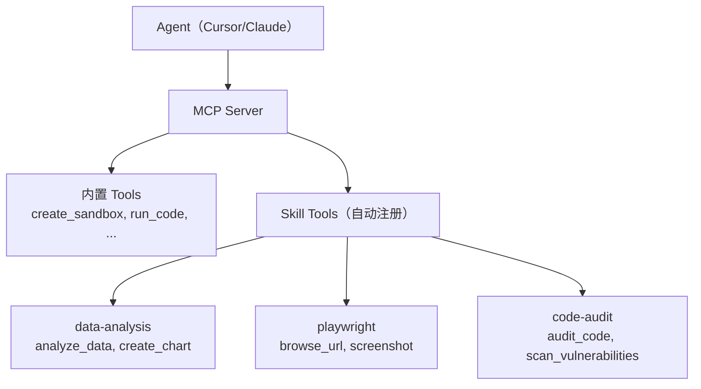

# Skills 系统设计

> Skills 是 Serverless Sandbox 的可复用能力包，将「沙箱环境配置 + Agent 使用说明 + MCP Tools 扩展」封装为一个可分发的单元。开发者可以像安装 npm 包一样安装 Skill，AI Agent 可以自动发现并使用 Skill 提供的能力。

---

## 1. Skill 定义

一个 Skill 包含三个维度的能力：

```
Skill = 沙箱环境配置 + Agent 使用说明 + MCP Tools 扩展
        ─────────────   ─────────────   ───────────────
        sandbox.yaml     SKILL.md        mcp-tools.json
        Dockerfile       (结构化文档)     (工具定义)
        scripts/
```

| 维度 | 作用 | 文件 |
|------|------|------|
| **沙箱环境** | 定义运行环境、依赖、资源需求 | `sandbox.yaml`, `Dockerfile` |
| **Agent 说明** | 告诉 AI 如何使用此 Skill | `SKILL.md` |
| **MCP Tools** | 扩展 MCP Server 的工具集 | `mcp-tools.json`, `scripts/` |

---

## 2. Skill 目录结构

```
my-skill/
├── SKILL.md              # Skill 说明文档（AI 可读）
├── sandbox.yaml          # 沙箱环境配置
├── Dockerfile            # 可选：自定义镜像
├── scripts/              # 可选：工具脚本
│   ├── setup.sh          #   环境初始化
│   ├── run.py            #   主执行脚本
│   └── tools/            #   MCP 工具实现
│       ├── analyze.py
│       └── visualize.py
├── mcp-tools.json        # 可选：MCP 工具定义
├── examples/             # 使用示例
│   ├── basic.py
│   └── advanced.py
├── tests/                # 测试
│   └── test_skill.py
└── skill.lock            # 依赖锁定（自动生成）
```

---

## 3. SKILL.md 格式规范

SKILL.md 是 Skill 的核心文档，既是人类可读的说明，也是 AI Agent 的操作手册。

### 完整示例：data-science Skill

```markdown
# Data Science Skill

## 概述
提供完整的 Python 数据科学环境，预装 pandas、numpy、matplotlib、scikit-learn 等工具包。支持 CSV/Excel/JSON 数据分析，自动生成可视化图表和分析报告。

## 能力
- 数据加载与清洗（CSV, Excel, JSON, Parquet）
- 统计分析（描述性统计、相关性分析、假设检验）
- 可视化（折线图、柱状图、散点图、热力图、箱线图）
- 机器学习（分类、回归、聚类）
- 报告生成（Markdown 格式分析报告）

## 环境
- Python 3.11
- 预装包：pandas, numpy, matplotlib, seaborn, scikit-learn, openpyxl
- 工作目录：/app
- 数据目录：/app/data

## 使用方法

### 分析 CSV 数据
\```python
# 将数据文件上传到 /app/data/
# 执行分析脚本
import pandas as pd
df = pd.read_csv('/app/data/input.csv')
print(df.describe())
\```

### 生成可视化
\```python
import matplotlib.pyplot as plt
df.plot(kind='bar', x='category', y='value')
plt.savefig('/app/output/chart.png')
\```

## MCP Tools
- `analyze_data(file_path, analysis_type)` — 自动分析数据
- `create_chart(data, chart_type, title)` — 生成图表
- `generate_report(file_path)` — 生成分析报告

## 注意事项
- 大文件（>1GB）建议使用 OSS 挂载
- GPU 加速需要指定 gpu=True
- 输出文件保存在 /app/output/
```

---

## 4. Skills 分类体系

### 语言运行时

| Skill | 说明 | 模板 |
|-------|------|------|
| `python-base` | Python 3.11 基础环境 | python-base |
| `python-data-science` | 数据科学全套工具 | python-data-science |
| `node-base` | Node.js 20 LTS 环境 | node-web |
| `go-base` | Go 1.22 开发环境 | go-dev |
| `java-base` | JDK 21 + Maven/Gradle | java-dev |
| `rust-base` | Rust stable + cargo | base |
| `cpp-base` | GCC/Clang + CMake | base |

### 数据科学

| Skill | 说明 |
|-------|------|
| `data-analysis` | pandas + matplotlib + seaborn |
| `ml-sklearn` | scikit-learn 机器学习 |
| `ml-pytorch` | PyTorch 深度学习 |
| `ml-tensorflow` | TensorFlow 深度学习 |
| `data-visualization` | Plotly + Bokeh 交互式图表 |
| `jupyter` | Jupyter Notebook 环境 |

### Web 开发

| Skill | 说明 |
|-------|------|
| `nextjs` | Next.js 全栈开发 |
| `vue` | Vue 3 + Vite |
| `flask-api` | Flask REST API |
| `fastapi` | FastAPI 高性能 API |
| `express` | Express.js 后端 |

### 浏览器自动化

| Skill | 说明 |
|-------|------|
| `playwright` | Playwright 浏览器自动化 |
| `puppeteer` | Puppeteer 爬虫 |
| `web-scraper` | 通用网页爬取 |
| `screenshot` | 网页截图服务 |
| `pdf-generator` | HTML → PDF 转换 |

### AI/ML

| Skill | 说明 |
|-------|------|
| `llm-inference` | LLM 本地推理（vLLM） |
| `embedding` | 文本向量化 |
| `image-gen` | 图像生成（Stable Diffusion） |
| `speech` | 语音识别/合成 |
| `ocr` | 文字识别 |

### 数据库

| Skill | 说明 |
|-------|------|
| `postgres` | PostgreSQL 数据库 |
| `mysql` | MySQL 数据库 |
| `redis` | Redis 缓存 |
| `sqlite` | SQLite 轻量数据库 |
| `mongodb` | MongoDB 文档数据库 |

### DevOps

| Skill | 说明 |
|-------|------|
| `docker-in-sandbox` | 沙箱内 Docker |
| `k8s-tools` | Kubernetes 管理工具 |
| `terraform` | 基础设施即代码 |
| `ansible` | 自动化运维 |

### 安全

| Skill | 说明 |
|-------|------|
| `code-audit` | 代码安全审计 |
| `pentest` | 渗透测试工具集 |
| `vulnerability-scan` | 漏洞扫描 |

---

## 5. CLI 命令

### sbox skill search

```bash
# 搜索 Skill
sbox skill search "data science"
sbox skill search python --category ai-ml
sbox skill search "browser automation" --sort popularity

# 输出：
#   NAME                  CATEGORY     STARS  DESCRIPTION
#   data-analysis         data-sci     ⭐ 2.1k  pandas + matplotlib 数据分析
#   ml-pytorch            ai-ml        ⭐ 1.8k  PyTorch 深度学习环境
#   playwright            browser      ⭐ 1.5k  浏览器自动化
```

### sbox skill install

```bash
# 安装到当前项目
sbox skill install data-analysis

# 安装到全局
sbox skill install data-analysis --global

# 安装到特定 IDE
sbox skill install data-analysis --target cursor
sbox skill install data-analysis --target claude
sbox skill install data-analysis --target vscode
sbox skill install data-analysis --target qoder

# 安装指定版本
sbox skill install data-analysis@1.2.0

# 从 Git 安装
sbox skill install https://github.com/user/my-skill.git

# 从本地安装
sbox skill install ./my-local-skill
```

### sbox skill list

```bash
sbox skill list
sbox skill list --global
sbox skill list --target cursor

# 输出：
#   NAME              VERSION  SCOPE    INSTALLED
#   data-analysis     1.2.0    project  2024-01-15
#   playwright        2.0.1    global   2024-01-10
#   python-base       1.0.0    cursor   2024-01-08
```

### sbox skill create

```bash
# 创建 Skill 脚手架
sbox skill create my-awesome-skill

# 输出：
# ✓ 创建目录: my-awesome-skill/
# ✓ 生成文件: SKILL.md, sandbox.yaml, scripts/, examples/
# ✓ 初始化完成！
#
# 下一步：
#   cd my-awesome-skill
#   编辑 SKILL.md 和 sandbox.yaml
#   sbox skill publish
```

### sbox skill publish

```bash
# 发布到官方 Registry
sbox skill publish ./my-skill

# 发布到私有 Registry
sbox skill publish ./my-skill --registry https://registry.mycompany.com

# 发布前验证
sbox skill publish ./my-skill --dry-run
```

---

## 6. 安装目标

Skills 可以安装到不同的目标环境：

| 目标 | 命令 | 效果 |
|------|------|------|
| 项目 | `--scope project` | 写入 `sandbox.yaml`，项目级生效 |
| 全局 | `--global` | 写入 `~/.sbox/skills/`，全局生效 |
| Cursor | `--target cursor` | 写入 Cursor MCP 配置 |
| Claude Desktop | `--target claude` | 写入 Claude Desktop 配置 |
| VS Code | `--target vscode` | 写入 VS Code settings |
| Qoder | `--target qoder` | 写入 Qoder 配置 |

### 安装到 Cursor 的效果

```bash
sbox skill install data-analysis --target cursor

# 自动写入 ~/.cursor/mcp.json:
# {
#   "mcpServers": {
#     "serverless-sandbox": {
#       "command": "sbox",
#       "args": ["mcp", "start"],
#       "skills": ["data-analysis"]
#     }
#   }
# }
```

---

## 7. 分发机制

### 官方 Registry

```
registry.sandbox.alicloud.com
├── 官方维护 Skill（alicloud/ 命名空间）
├── 社区贡献 Skill（community/ 命名空间）
├── 版本管理（语义版本号）
├── 安全审核（自动 + 人工）
└── 使用统计和排行榜
```

### Git 仓库

```bash
# 从 GitHub 安装
sbox skill install github:user/repo
sbox skill install https://github.com/user/skill-repo.git

# 从 GitLab 安装
sbox skill install gitlab:user/repo
```

### 本地文件夹

```bash
# 开发模式：直接使用本地 Skill
sbox skill install ./my-local-skill --link

# link 模式：不复制文件，创建软链接，便于开发调试
```

### 私有 Registry

```bash
# 配置私有 Registry
sbox config set registry.private https://registry.mycompany.com

# 从私有 Registry 安装
sbox skill install my-company-skill --registry private
```

---

## 8. 与 MCP/Agent 联动

### Skill 自动发现

当 AI Agent 通过 MCP 连接到 Serverless Sandbox 时，已安装的 Skills 会自动注册为 MCP Tools：



### Skill 在 Agent 中的使用

Skill 为沙箱提供预配置的环境和工具。内置 Agent 已简化为 AI CLI 封装，Skill 与 Agent 的联动主要体现在：

1. **Skill 提供沙箱环境**：Skill 的 `sandbox.yaml` 定义了运行环境，Agent 模板基于这些环境工作
2. **Skill 提供 MCP 工具**：Skill 的 `mcp-tools.json` 扩展了 MCP Server 的工具集
3. **Agent 通过 CLI 执行**：Agent API（`sb.agent.code()` 等）是 `commands.run()` 的语法糖，在 Skill 配置的环境中执行 AI CLI 工具

```python
from serverless_sandbox import Sandbox

# Skill 提供环境，Agent 模板提供 AI 能力
asb = await Sandbox.create(template="codex")  # codex 模板预装 Codex CLI

# 如果安装了 data-analysis Skill，沙箱内将预装数据分析工具
# Agent 通过 CLI 命令调用这些能力
result = await sb.agent.code("分析 /app/data.csv 并生成可视化报告")
print(result.output)

# 等价于：
result = await sb.commands.run("codex '分析 /app/data.csv 并生成可视化报告'")
```

> **说明**：内置 Agent 已简化为 AI CLI 封装架构（SDK 零 LLM 依赖）。Agent API 是 `commands.run()` 的语法糖，实际执行沙箱模板内预装的 AI CLI 工具（Codex / Qwen CLI）。Skill 的主要作用是为沙箱提供预配置的环境和扩展 MCP 工具，而不是管理 LLM Provider 或 Agent 编排。

### Skill 组合

```python
# 多个 Skill 可组合使用，它们共同定义沙箱环境
from serverless_sandbox import Sandbox

# 使用组合了多个 Skill 的模板
sb = await Sandbox.create(
    template="full-stack",
    # 沙箱内将包含 python-base, postgres, fastapi, playwright 等 Skill 定义的环境
)

# 通过 Agent 或直接命令使用这些环境
result = await sb.commands.run("python -c 'import flask; print(flask.__version__)'")
```
