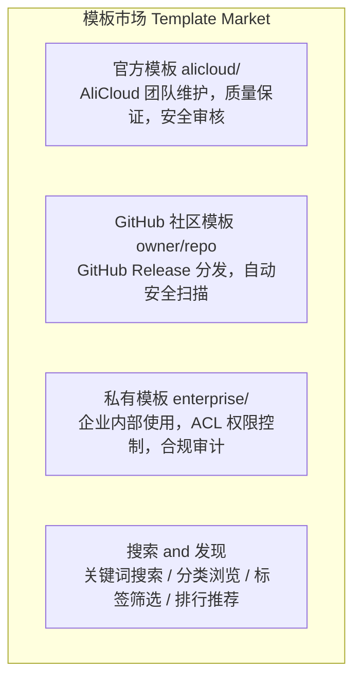

# 模板体系设计

> 模板（Template）是 Serverless Sandbox 的运行环境蓝图，定义了沙箱的基础镜像、预装软件、默认配置和启动行为。模板体系分为官方核心模板、社区模板和自定义模板三个层次。模板的核心分发机制基于 **GitHub Release**，采用类似 Go modules / GitHub Actions 的引用方式。

---

## 1. 官方核心模板

### Tier 1 — 首发模板（5 个）

发布即可用，覆盖最高频场景。

#### base

```yaml
名称:     base
描述:     最小化 Linux 环境，适合通用任务
基础镜像:  debian:bookworm-slim
预装软件:  bash, curl, wget, git, vim, jq, unzip
Python:   3.11（系统级）
资源默认:  1 CPU / 2048 MB 内存 / 10 GB 磁盘
工作目录:  /app
用户:     user (uid=1000)
```

#### python-base

```yaml
名称:     python-base
描述:     Python 开发环境，含 pip 和常用工具
基础镜像:  base + Python 生态
预装软件:  python3.11, pip, venv, poetry, ipython
预装包:   requests, httpx, pydantic, rich
资源默认:  1 CPU / 2048 MB 内存 / 10 GB 磁盘
```

#### python-data-science

```yaml
名称:     python-data-science
描述:     数据科学全套环境
基础镜像:  python-base + 科学计算
预装包:   pandas, numpy, scipy, matplotlib, seaborn,
          scikit-learn, statsmodels, openpyxl, xlrd,
          plotly, bokeh, jupyter
资源默认:  2 CPU / 4096 MB 内存 / 20 GB 磁盘
```

#### node-web

```yaml
名称:     node-web
描述:     Node.js Web 开发环境
基础镜像:  base + Node.js 生态
预装软件:  node 20 LTS, npm, yarn, pnpm
预装包:   typescript, ts-node, nodemon
暴露端口:  3000, 8080
资源默认:  1 CPU / 2048 MB 内存 / 10 GB 磁盘
```

#### code-interpreter

```yaml
名称:     code-interpreter
描述:     代码解释器环境，支持多语言执行
基础镜像:  python-data-science + 多语言
预装软件:  python3.11, node20, go1.22, rustc
特性:     Rich Output（图片、HTML、LaTeX）
          自动安装缺失的 pip 包
          代码沙箱隔离执行
资源默认:  2 CPU / 4096 MB 内存 / 20 GB 磁盘
```

### Tier 2 — 扩展模板（5 个）

Phase 2 发布，覆盖专业场景。

#### browser-automation

```yaml
名称:     browser-automation
描述:     浏览器自动化环境（Playwright + Chromium）
基础镜像:  base + 浏览器环境
预装软件:  chromium, playwright, puppeteer
特性:     Headless 浏览器预启动
          截图/PDF 生成
          网络请求拦截
资源默认:  2 CPU / 4096 MB 内存 / 15 GB 磁盘
```

#### full-stack

```yaml
名称:     full-stack
描述:     全栈开发环境（前后端 + 数据库）
基础镜像:  node-web + python-base
预装软件:  node20, python3.11, postgresql, redis, nginx
特性:     前后端同时运行
          内置数据库
          反向代理配置
暴露端口:  3000, 5000, 5432, 6379
资源默认:  4 CPU / 8192 MB 内存 / 30 GB 磁盘
```

#### go-dev

```yaml
名称:     go-dev
描述:     Go 开发环境
基础镜像:  base + Go 生态
预装软件:  go 1.22, golangci-lint, dlv (debugger)
          air (热重载), mockgen
资源默认:  2 CPU / 4096 MB 内存 / 15 GB 磁盘
```

#### java-dev

```yaml
名称:     java-dev
描述:     Java 开发环境
基础镜像:  base + JDK 生态
预装软件:  JDK 21, Maven 3.9, Gradle 8.x
          Spring Boot CLI
资源默认:  2 CPU / 4096 MB 内存 / 20 GB 磁盘
```

#### ml-gpu

```yaml
名称:     ml-gpu
描述:     GPU 加速机器学习环境
基础镜像:  nvidia/cuda:12.1 + python-data-science
预装软件:  CUDA 12.1, cuDNN 8.9
预装包:   torch, tensorflow, transformers,
          accelerate, bitsandbytes
GPU:      默认 A10（可配置 V100/A100）
资源默认:  4 CPU / 16384 MB 内存 / 50 GB 磁盘
```

---

## 2. 模板来源与分发机制

模板的核心分发机制基于 **GitHub Release**，类似 Go modules / GitHub Actions 的引用方式。SDK 按优先级依次解析模板来源：

```
模板来源优先级：
1. 内置模板（SDK 自带的 5 个 Tier 1 模板）
2. GitHub Release 模板（owner/repo 格式）
3. 本地模板（文件路径）
4. 阿里云 ACR 镜像（registry URL）
```

### 2.1 模板名解析规则

```python
# 内置模板（不含 /）
"python"               → 内置 python 模板
"code-interpreter"     → 内置 code-interpreter 模板

# GitHub 模板（含 /）
"hello/world"          → github.com/hello/world latest release
"hello/world@v1.0"     → github.com/hello/world tag v1.0
"myorg/templates/node"  → github.com/myorg/templates 仓库下 node 子目录（monorepo）

# 本地路径
"./my-template"        → 当前目录下的 my-template
"/abs/path/template"   → 绝对路径

# ACR 镜像
"acr://registry.cn-hangzhou.aliyuncs.com/ns/image:tag" → 阿里云容器镜像
```

### 2.2 各入口使用方式

```bash
# CLI 使用
sbox create hello/world                    # → github.com/hello/world 最新 release
sbox create hello/world --tag v1.2.0       # → 指定 tag
sbox create myorg/python-ml --tag latest   # → 显式指定 latest
```

```python
# SDK 使用
sb = await Sandbox.create(template="hello/world")
sb = await Sandbox.create(template="hello/world@v1.2.0")

# 装饰器使用
@sandbox(template="hello/world@v1.2.0")
def my_func(): ...
```

### 2.3 GitHub Release 解析流程

```
1. 解析模板名 "hello/world[@tag]"
2. 检查本地缓存 ~/.sandbox/templates/hello/world/v1.2.0/
3. 缓存未命中 → 调用 GitHub API:
   - 无 tag: GET https://api.github.com/repos/hello/world/releases/latest
   - 有 tag: GET https://api.github.com/repos/hello/world/releases/tags/v1.2.0
4. 从 release assets 下载模板包（tar.gz/zip）
5. 解压到本地缓存
6. 验证模板结构（必须包含 template.yaml 或 Dockerfile）
7. 构建/使用模板
```

如果 release 没有打包好的 asset，SDK 会 fallback 到直接 clone 仓库的指定 tag。

### 2.4 模板包结构（GitHub Release Asset）

模板仓库的 release 中需要包含一个模板包，结构如下：

```
my-template/
├── template.yaml     # 模板规范配置（必须，详见第 4 章）
├── Dockerfile            # 镜像定义（可选，template.yaml 中可指定 base）
├── SKILL.md              # Agent 使用说明（可选）
├── scripts/
│   ├── setup.sh          # 初始化脚本（可选）
│   └── healthcheck.sh    # 健康检查（可选）
├── files/                # 需要复制到沙箱的文件（可选）
└── examples/             # 使用示例（可选）
```

### 2.5 官方模板仓库

官方维护一个 `alicloud/sandbox-templates` 仓库（monorepo），包含所有 Tier 1 和 Tier 2 模板：

```bash
# 官方模板可以用简写
sbox create python-data-science     # 内置 Tier 1
sbox create alicloud/sandbox-templates/browser-automation  # 官方 Tier 2

# 或者直接用简写别名
sbox create browser-automation      # 自动解析为官方模板
```

### 2.6 GitHub Token 配置（私有仓库）

```bash
# 配置 GitHub Token 以访问私有模板仓库
sbox config set github_token ghp_xxxxxxxxxxxx

# 或通过环境变量
export SANDBOX_GITHUB_TOKEN=ghp_xxxxxxxxxxxx
```

### 2.7 本地缓存管理

从 GitHub Release 下载的模板会缓存到本地，避免重复下载。

缓存目录结构：

```
~/.sandbox/templates/
├── hello/
│   └── world/
│       ├── v1.0.0/
│       │   ├── template.yaml
│       │   └── Dockerfile
│       └── v1.2.0/
│           ├── template.yaml
│           └── Dockerfile
└── myorg/
    └── python-ml/
        └── latest/
            └── ...
```

CLI 缓存管理命令：

```bash
# 查看缓存的模板
sbox template cache list

# 清理所有缓存
sbox template cache clean

# 清理指定模板的缓存
sbox template cache clean hello/world

# 强制重新下载（创建时跳过缓存）
sbox create hello/world --no-cache
```

---

## 3. 自定义模板方式

### 方式一：SDK 编程式

```python
from serverless_sandbox import Image

# 链式构建
image = (
    Image.from_template("python-base")
    .pip_install("flask", "sqlalchemy", "celery")
    .apt_install("postgresql-client", "redis-tools")
    .copy_local("./config/", "/app/config/")
    .env(
        FLASK_ENV="production",
        DATABASE_URL="postgresql://localhost/mydb",
    )
    .expose(5000, 6379)
    .entrypoint("python /app/main.py")
)

# 构建并推送为模板
template_id = await image.build_and_push(
    name="my-flask-app",
    tag="v1.0",
    description="Flask + PostgreSQL + Celery 应用模板",
)
```

### 方式二：CLI + Dockerfile

```dockerfile
# Dockerfile
FROM registry.sandbox.alicloud.com/templates/python-base:latest

RUN pip install flask sqlalchemy celery
RUN apt-get update && apt-get install -y postgresql-client redis-tools

COPY ./config/ /app/config/

ENV FLASK_ENV=production
ENV DATABASE_URL=postgresql://localhost/mydb

EXPOSE 5000 6379

WORKDIR /app
CMD ["python", "main.py"]
```

```bash
# 构建
sbox template build . --name my-flask-app --tag v1.0

# 推送
sbox template push my-flask-app:v1.0
```

### 方式三：sandbox.yaml 声明式

```yaml
# sandbox.yaml
name: my-flask-app
version: "1.0"
description: "Flask + PostgreSQL + Celery 应用模板"

base: python-base

packages:
  pip:
    - flask==3.0
    - sqlalchemy==2.0
    - celery==5.3
  apt:
    - postgresql-client
    - redis-tools

files:
  - source: ./config/
    target: /app/config/

env:
  FLASK_ENV: production
  DATABASE_URL: postgresql://localhost/mydb

ports:
  - 5000
  - 6379

resources:
  cpu: 2
  memory: 4096
  disk: 20480

entrypoint: python /app/main.py
workdir: /app
```

### 方式四：发布到 GitHub Release

将模板发布为 GitHub Release，供其他用户通过 `owner/repo` 格式引用：

```bash
# 1. 初始化模板项目（生成 template.yaml, Dockerfile, SKILL.md 等脚手架）
sbox template init my-template

# 2. 本地开发和测试
sbox create ./my-template

# 3. 发布到 GitHub
cd my-template
git init && git add . && git commit -m "init"
git tag v1.0.0
gh release create v1.0.0 --generate-notes

# 4. 其他人即可使用
sbox create yourname/my-template
```

---

## 4. 模板规范（template.yaml）

`template.yaml` 是模板的标准化声明文件，定义了模板的元信息、基础环境、构建步骤、资源默认值、沙箱行为和 Agent 集成等完整规范。每个模板仓库的根目录都应包含此文件。

> **命名约定**：规范文件名为 `template.yaml`。为向后兼容，也接受 `sandbox.yaml` 作为简写别名。

### 完整字段定义

```yaml
# template.yaml — 模板规范 v1
version: "1"                          # 规范版本（必须）

# === 元信息 ===
metadata:
  name: python-data-science           # 模板名称（必须）
  display_name: "Python 数据科学"      # 展示名称
  description: "预装 pandas/numpy/matplotlib 的数据分析环境"
  version: "1.2.0"                    # 模板版本（SemVer）
  author: "alicloud"                  # 作者
  license: "MIT"
  homepage: "https://github.com/alicloud/sandbox-templates"
  tags: ["python", "data-science", "jupyter"]
  category: "data-science"            # 分类：language / data-science / web / browser / ai-ml / devops / database / security

# === 基础环境 ===
base:
  image: "ubuntu:22.04"               # 基础镜像（与 from 二选一）
  from: "alicloud/sandbox-templates/python@v1.0"  # 继承另一个模板（与 image 二选一）

# === 构建步骤 ===
build:
  apt_install:                        # 系统包
    - build-essential
    - libpq-dev
  pip_install:                        # Python 包
    - "pandas>=2.0"
    - numpy
    - matplotlib
  npm_install:                        # Node.js 包（可选）
    - typescript
  env:                                # 环境变量
    PYTHONUNBUFFERED: "1"
    MPLBACKEND: "Agg"
  run:                                # 自定义构建命令
    - "jupyter notebook --generate-config"
  copy:                               # 复制文件到沙箱
    - src: "./config/"
      dest: "/app/config/"
    - src: "./scripts/setup.sh"
      dest: "/usr/local/bin/setup.sh"

# === 资源默认值 ===
resources:
  cpu: 2                              # 默认 vCPU
  memory: 4096                        # 默认内存 (MB)
  disk: 15360                         # 默认磁盘 (MB)
  gpu: null                           # 默认 GPU（null 表示不需要）
  timeout: 600                        # 默认超时 (秒)
  idle_timeout: 300                   # 默认空闲超时 (秒)

# === 网络 ===
network:
  ports: [8888]                       # 默认暴露端口
  public: false                       # 是否默认公开

# === 沙箱行为 ===
sandbox:
  mode: "ephemeral"                   # 默认模式：ephemeral | persistent
  workdir: "/app"               # 默认工作目录
  user: "user"                     # 默认用户
  shell: "/bin/bash"                  # 默认 shell
  startup_command: null               # 启动时自动执行的命令
  readiness_probe:                    # 就绪探针（可选）
    type: "tcp"                       # tcp | exec
    port: 8888                        # tcp 类型时的端口
    timeout: 30                       # 探测超时

# === 命令能力（capabilities）===
# 声明本模板支持的标准能力集。标准能力词汇表：shell / files / code / terminal / ports（可扩展）。
# 省略 capabilities 时继承系统默认基线 DEFAULT_CAPABILITIES = {shell, files, code}。
# terminal、ports 不在默认基线中，需在此显式声明。
capabilities:
  - shell
  - files
  - code
  - ports                             # 显式加入默认基线之外的能力

# === 自定义命令（custom_commands）===
# 模板可声明命名命令，供 `sbox run <id> <name> --arg k=v` 与 SDK `sandbox.run("name", **args)` 调用。
# 用户传入的参数经 shlex.quote() 转义后填充 {占位符}，防注入。
custom_commands:
  serve:
    cmd: "python -m http.server {port}"  # 命令模板，{占位符} 来自 args[].name
    description: "启动静态文件服务"        # 命令说明（面向用户/Agent）
    cwd: "/app"                          # 工作目录（默认 /app）
    env: {}                              # 附加环境变量（默认空）
    timeout: 60                          # 超时秒数（默认 60）
    args:
      - name: port
        default: "8000"                  # 默认值
        required: false                  # 是否必填（缺省 false）
        description: "监听端口"

# === Skills 绑定 ===
skills:
  bundled: ["jupyter", "pandas-stack"] # 内置绑定的 Skills
  recommended: ["matplotlib-extra"]    # 推荐的可选 Skills

# === Agent 提示 ===
agent:
  description: "适用于数据分析、CSV 处理、统计计算、图表生成场景"
  triggers:                           # 触发关键词（用于自然语言匹配）
    - "数据分析"
    - "pandas"
    - "CSV"
    - "图表"
  instructions: |                     # Agent 使用指南
    在此沙箱中执行数据分析任务时：
    1. 数据文件放在 /app/data/
    2. 输出文件放在 /app/output/
    3. 使用 matplotlib 生成图表时，保存为 PNG

# === 健康检查 ===
healthcheck:
  command: "python3 -c 'import pandas'"
  interval: 30
  timeout: 5
  retries: 3
```

### 字段分类说明

| 分区 | 字段 | 必须 | 说明 |
|------|------|:----:|------|
| 顶层 | `version` | ✅ | 规范版本号，当前固定为 `"1"` |
| **metadata** | `name` | ✅ | 模板唯一标识名 |
| | `display_name` | | 面向用户的展示名称 |
| | `description` | | 模板描述 |
| | `version` | | SemVer 版本号，默认跟随 Git tag |
| | `author` | | 作者 |
| | `license` | | 许可证 |
| | `homepage` | | 项目主页 URL |
| | `tags` | | 标签列表，用于搜索和筛选 |
| | `category` | | 分类，可选值：`language` / `data-science` / `web` / `browser` / `ai-ml` / `devops` / `database` / `security` |
| **base** | `image` | ⚠️ | 基础 Docker 镜像（与 `from` 二选一） |
| | `from` | ⚠️ | 继承的模板引用，支持 `owner/repo@tag` 格式（与 `image` 二选一） |
| **build** | `apt_install` | | 系统级 apt 包列表 |
| | `pip_install` | | Python pip 包列表，支持版本约束 |
| | `npm_install` | | Node.js 全局包列表 |
| | `env` | | 构建时注入的环境变量 |
| | `run` | | 自定义 shell 命令列表，按顺序执行 |
| | `copy` | | 文件复制映射（`src` → `dest`） |
| **resources** | `cpu` | | 默认 vCPU 数（默认 1） |
| | `memory` | | 默认内存 MB（默认 2048） |
| | `disk` | | 默认磁盘 MB（默认 10240） |
| | `gpu` | | GPU 类型，null 表示不需要 |
| | `timeout` | | 沙箱超时秒数（默认 300） |
| | `idle_timeout` | | 空闲超时秒数（默认 120） |
| **network** | `ports` | | 暴露端口列表 |
| | `public` | | 是否默认启用公网（默认 false） |
| **sandbox** | `mode` | | 运行模式：`ephemeral` / `persistent`（默认 ephemeral） |
| | `workdir` | | 工作目录（默认 /app） |
| | `user` | | 运行用户（默认 user） |
| | `shell` | | 默认 shell（默认 /bin/bash） |
| | `startup_command` | | 启动时自动执行的命令 |
| | `readiness_probe` | | 就绪探针配置（`type` + `port`/`command` + `timeout`） |
| **capabilities** | （列表） | | 模板支持的标准能力集，词汇表：`shell` / `files` / `code` / `terminal` / `ports`（可扩展）。省略时继承默认基线 `{shell, files, code}`；`terminal`/`ports` 需显式声明 |
| **custom_commands** | `<name>.cmd` | | 命令模板字符串，支持 `{占位符}`（必须） |
| | `<name>.description` | | 命令说明 |
| | `<name>.cwd` | | 工作目录（默认 `/app`） |
| | `<name>.env` | | 附加环境变量（默认空） |
| | `<name>.timeout` | | 超时秒数（默认 60） |
| | `<name>.args` | | 参数列表，每项 `{name, default, required, description}` |
| **skills** | `bundled` | | 内置绑定的 Skills 列表，随模板自动加载 |
| | `recommended` | | 推荐的可选 Skills 列表 |
| **agent** | `description` | | 面向 AI Agent 的场景描述 |
| | `triggers` | | 触发关键词列表，用于自然语言模板匹配 |
| | `instructions` | | Agent 使用指南，描述如何在此沙箱中工作 |
| **healthcheck** | `command` | | 健康检查命令 |
| | `interval` | | 检查间隔秒数（默认 30） |
| | `timeout` | | 超时秒数（默认 10） |
| | `retries` | | 重试次数（默认 3） |

> **⚠️ 标记说明**：`base.image` 和 `base.from` 必须二选一，不能同时指定。

### 关键设计要点

1. **`base` 双模式**：`image` 直接指定 Docker 镜像，`from` 继承另一个模板（支持 GitHub Release 引用），形成模板继承链
2. **`agent` 字段是 AI-Friendly 的关键**：让 AI Agent 通过 `triggers` 和 `description` 理解模板适用场景，通过 `instructions` 获取使用指南
3. **`resources` 默认值语义**：模板声明的是推荐默认值，用户创建沙箱时可通过 SDK 参数或 CLI 选项覆盖
4. **`skills.bundled` + `skills.recommended`**：让模板和 Skills 系统联动 — `bundled` 随模板自动加载，`recommended` 仅作推荐提示
5. **`readiness_probe`**：支持 `tcp`（端口探测）和 `exec`（命令执行）两种就绪检测方式，确保沙箱真正可用后才返回
6. **`capabilities` 能力模型**：命令能力由模板声明，不再假设所有沙箱都具备 shell/upload/download。标准能力词汇表为 `shell` / `files` / `code` / `terminal` / `ports`（可扩展）。系统默认基线为单一常量 `DEFAULT_CAPABILITIES = {shell, files, code}`；模板可显式声明子集或加入 `terminal`/`ports`，省略 `capabilities` 时继承默认基线。调用不在有效能力集内的标准能力会抛出 `CapabilityNotSupportedError`（E3xxx），明确报错、不静默降级，错误信息含 `suggestion`。详见 ADR `2026-09-03-capability-model.md`
7. **`custom_commands` 自定义命令**：模板可声明命名命令，用户参数经 `shlex.quote()` 转义后填充 `{占位符}` 防注入；通过 CLI `sbox run` 与 SDK `sandbox.run("name", **args)` 分发。详见 ADR `2026-09-03-custom-commands-schema.md`

### 示例：基于 GitHub 模板的扩展

```yaml
# template.yaml
version: "1"

metadata:
  name: my-ml-template
  display_name: "自定义 ML 环境"
  description: "基于官方数据科学模板扩展的机器学习开发环境"
  version: "1.0.0"
  author: "yourname"
  tags: ["ml", "pytorch", "transformers"]
  category: "ai-ml"

base:
  from: alicloud/sandbox-templates/python-data-science@v2.0

build:
  apt_install:
    - libgl1-mesa-glew
  pip_install:
    - torch>=2.0
    - transformers
    - accelerate
  run:
    - python -c "import torch; print(torch.__version__)"

resources:
  cpu: 4
  memory: 8192
  gpu: A10

skills:
  bundled: ["pytorch", "transformers"]
  recommended: ["huggingface-hub"]

agent:
  description: "适用于 PyTorch 模型训练、Transformers 微调、ML 实验"
  triggers: ["训练模型", "微调", "PyTorch", "transformers"]
  instructions: |
    1. 模型文件放在 /app/models/
    2. 数据集放在 /app/data/
    3. GPU 已预配置，直接使用 torch.cuda 即可
```

---

## 5. 模板版本管理

### 语义版本号

```
模板版本遵循 SemVer 规范：
  MAJOR.MINOR.PATCH

示例：
  python-data-science:1.0.0     初始版本
  python-data-science:1.1.0     添加新包
  python-data-science:1.1.1     修复 bug
  python-data-science:2.0.0     升级 Python 到 3.12（破坏性变更）
```

### 版本选择

```python
# 精确版本
sb = await Sandbox.create(template="python-data-science:1.2.3")

# 次版本范围（~=）
sb = await Sandbox.create(template="python-data-science:~1.2")  # >=1.2.0, <1.3.0

# 主版本范围（^）
sb = await Sandbox.create(template="python-data-science:^1")    # >=1.0.0, <2.0.0

# 最新版（默认）
sb = await Sandbox.create(template="python-data-science")       # latest

# GitHub 模板指定版本
sb = await Sandbox.create(template="hello/world@v1.2.0")        # GitHub Release tag
```

### 版本列表

```bash
$ sbox template info python-data-science

Template: python-data-science
Description: 数据科学全套环境

Versions:
  TAG       DATE          SIZE     PYTHON  PANDAS
  2.0.0     2026-08-01    2.1 GB   3.12    2.2.0    latest
  1.3.1     2026-07-15    1.9 GB   3.11    2.1.4
  1.3.0     2026-07-01    1.9 GB   3.11    2.1.0
  1.2.0     2026-06-01    1.8 GB   3.11    2.0.3
  1.0.0     2026-04-01    1.7 GB   3.11    2.0.0
```

---

## 6. 模板市场架构



### CLI 命令总览

```bash
# ── 创建沙箱 ─────────────────────────────
sbox create python-base                       # 内置模板
sbox create hello/world                       # GitHub Release 最新版
sbox create hello/world --tag v1.2.0          # GitHub Release 指定版本
sbox create ./my-template                     # 本地模板
sbox create hello/world --no-cache            # 跳过缓存，强制重新下载

# ── 模板构建与推送 ────────────────────────
sbox template build . --name my-app --tag v1.0
sbox template push my-app:v1.0
sbox template init my-template                # 初始化模板脚手架

# ── 模板信息与搜索 ────────────────────────
sbox template info python-data-science
sbox template list --market
sbox template list --market --category data-science --sort stars
sbox template search "machine learning gpu"

# ── 模板拉取 ──────────────────────────────
sbox template pull community/awesome-ml-env:latest
sbox template pull hello/world@v1.0.0

# ── 模板发布 ──────────────────────────────
sbox template push my-template --publish --category web-development

# ── 本地缓存管理 ──────────────────────────
sbox template cache list                      # 查看缓存的 GitHub Release 模板
sbox template cache clean                     # 清理所有缓存
sbox template cache clean hello/world         # 清理指定模板缓存

# ── 配置管理 ──────────────────────────────
sbox config set github_token ghp_xxxxxxxxxxxx # 配置 GitHub Token（私有仓库）
```

### 模板安全

每个模板在发布前经过：

1. **自动安全扫描**：CVE 漏洞检测、恶意代码扫描
2. **依赖审计**：检查所有依赖包的安全性
3. **资源限制验证**：确保模板不超出合理资源范围
4. **签名验证**：官方模板带数字签名，防止篡改

---

## 7. 备注：Session 管理与模板的关系

模板定义了沙箱的 **静态环境蓝图**，而 Session 管理负责沙箱的 **运行时生命周期**（创建、连接、休眠、恢复、销毁）。模板中的 `sandbox.mode`、`resources.timeout`、`resources.idle_timeout` 等字段为 Session 管理提供默认参数，但最终行为由 Session 管理模块控制。

Session 管理的完整设计（包括会话保持、状态恢复、多连接共享等）请参阅总体架构设计文档。
