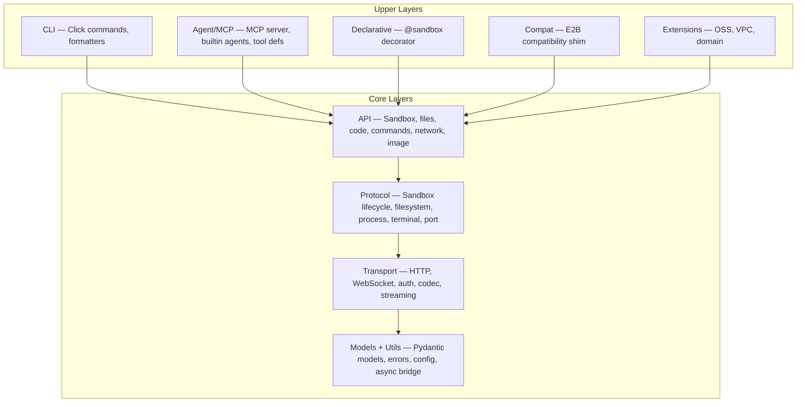

# Easy Sandbox — Design Document Index

> **Version**: v2.0 | **Last Updated**: 2026-09-24
>
> This document serves as the entry point and index for all Easy Sandbox design documentation. Detailed designs live in the specialized topic documents under [`design/`](design/).

---

## Project Overview

**Easy Sandbox** (`easy-sandbox` on PyPI, CLI command `ebx`) is a Python SDK + CLI for the Alibaba Cloud FC Agent Sandbox service. It is **E2B-protocol compatible** with extensions for the Alibaba Cloud ecosystem (OSS, VPC, custom domains).

### Core Principles

1. **E2B Protocol Compatibility** — L2 protocol layer is compatible with the E2B data plane protocol; a migration helper layer (`from easy_sandbox.compat import Sandbox`) eases migration for existing E2B users
2. **AI-First** — Natural language sandbox creation, MCP Server as a first-class citizen, built-in Agent tooling
3. **Zero Configuration Defaults** — Works out of the box; from install to first sandbox in ≤ 3 lines of code

### Quick Start

```bash
pip install easy-sandbox
export SANDBOX_API_KEY=your-api-key
```

```python
from easy_sandbox import Sandbox

async with await Sandbox.create(template="base") as sb:
    result = await sb.run_code("print('Hello, Easy Sandbox!')")
    print(result.text)
```

---

## Architecture Overview

The SDK follows a strict layered architecture — lower layers never import upper layers:


```mermaid
graph TB
    subgraph Upper["Upper Layers"]
        CLI["CLI — Click commands, formatters"]
        Agent["Agent/MCP — MCP server, builtin agents, tool defs"]
        Decl["Declarative — @sandbox decorator"]
        Compat["Compat — E2B compatibility shim"]
        Ext["Extensions — OSS, VPC, domain"]
    end
    subgraph Core["Core Layers"]
        L3["API — Sandbox, files, code, commands, network, image"]
        L2["Protocol — Sandbox lifecycle, filesystem, process, terminal, port"]
        L1["Transport — HTTP, WebSocket, auth, codec, streaming"]
        L0["Models + Utils — Pydantic models, errors, config, async bridge"]
    end

    CLI --> L3
    Agent --> L3
    Decl --> L3
    Compat --> L3
    Ext --> L3
    L3 --> L2 --> L1 --> L0
```

For the full architecture breakdown, see [Architecture Design](design/architecture.md).

---

## Design Topic Index

Each topic below has its own dedicated design document with complete specifications.

### Core Design

| Topic | Document | Summary |
|-------|----------|---------|
| **System Architecture** | [architecture.md](design/architecture.md) | Six-layer architecture, inter-layer dependencies, dual API layers (Platform API vs Sandbox envd API) |
| **SDK API Design** | [sdk-api-design.md](design/sdk-api-design.md) | Sandbox class, file operations, code execution, commands, network, image builder, session management |
| **Sandbox Type System** | [sandbox-types.md](design/sandbox-types.md) | Ephemeral sandboxes (implemented), persistent sandboxes (future), sandbox lifecycle |

### CLI & User Interface

| Topic | Document | Summary |
|-------|----------|---------|
| **CLI Command System** | [cli-design.md](design/cli-design.md) | Command tree (45 commands), global options, natural language creation, OutputManager, AI-friendly design |
| **Template System** | [template-system.md](design/template-system.md) | Template tiers, GitHub tarball distribution, `template.yaml` specification, custom commands, CLI template subcommands |
| **Templates Catalog** | [templates-catalog.md](design/templates-catalog.md) | Single source of truth (SSOT): the awesome-templates catalog repo, the remote index client, caching/degradation behaviour, and the main-repo fixture boundary |

### AI & Agent Integration

| Topic | Document | Summary |
|-------|----------|---------|
| **MCP Server** | [mcp-server.md](design/mcp-server.md) | 7 P0 MCP tools, STDIO + Streamable HTTP transports, FC deployment artifact, session binding |
| **Built-in Agents** | [built-in-agents.md](design/built-in-agents.md) | Sandbox-side `AgentModule` sugar over `commands.run()`; agents ship in dedicated templates — the base image preinstalls no agent CLI (see [BYO Agent Integration](guide/byo-agent-integration.md)) |

### Server & Infrastructure

| Topic | Document | Summary |
|-------|----------|---------|
| **Server API** | [server-api.md](design/server-api.md) | Sandbox Server SDK routes, capability groups, browser instance architecture |

---

## Implementation Status

| Feature | Status | Notes |
|---------|--------|-------|
| SDK core (Sandbox, files, commands, code) | **Implemented** | |
| CLI (45 commands) | **Implemented** | See [cli-design.md](design/cli-design.md) |
| MCP Server (STDIO) | **Implemented** | 7 P0 tools |
| MCP Server (Streamable HTTP) | **Implemented** | `mcp_http.py` |
| `ebx mcp deploy` (FC artifact generation) | **Implemented** | Generates deploy artifact; manual FC deployment steps printed. See [mcp-server.md](design/mcp-server.md#7-fc-deployment) |
| Template build/push/create pipeline | **Implemented** | Via official CreateTemplate API |
| E2B compatibility layer | **Implemented** | `easy_sandbox.compat` |
| Persistent sandbox | **Future** | Requires underlying platform support |
| SandboxPool (warm pool) | **Future** | Requires underlying platform support |
| NAS mount / SLS log integration | **Future** | Planned extension modules |

---

## Related Resources

| Resource | Location |
|----------|----------|
| Architecture Decision Records (ADR) | [`.agents/notes/`](../../.agents/notes/README.md) |
| CLI golden-file evidence | [`.agents/evidence/`](../../.agents/evidence/) |
| BYO agent integration guide | [`docs/en/guide/byo-agent-integration.md`](guide/byo-agent-integration.md) |
| User guides | [`docs/en/guide/`](guide/) |
| API/CLI reference | [`docs/en/reference/`](reference/) |
| Chinese (中文) design index | [`docs/zh/DESIGN.md`](../zh/DESIGN.md) |
