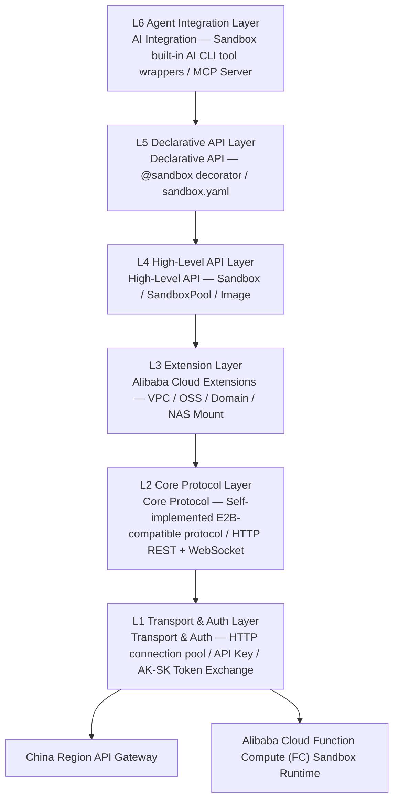
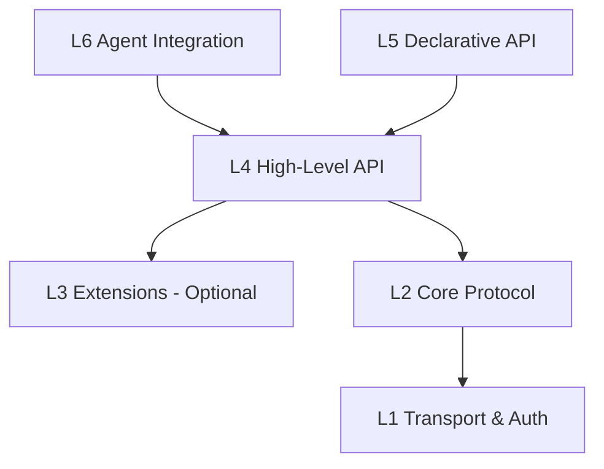

# System Architecture Design — Six-Layer Architecture

> Easy Sandbox SDK adopts a six-layer architecture, abstracting from low-level transport to high-level AI integration layer by layer. Each layer has a single responsibility with clear boundaries, and users can plug in at any layer. The SDK has zero LLM dependencies and does not depend on the E2B SDK — it implements the E2B-compatible protocol independently.

---

## 1. Architecture Overview



---

## 2. Layer Responsibilities

### L1 — Transport & Auth Layer

| Module | Responsibility |
|--------|----------------|
| `transport.http` | HTTPS client based on httpx, connection pool management, timeout/retry policies |
| `transport.ws` | Long-lived connections based on websockets, heartbeat keep-alive, auto-reconnect |
| `auth.api_key` | **API Key authentication (primary path)**: passed via `X-API-KEY` header, environment variable `E2B_API_KEY` (preferred) or `SANDBOX_API_KEY` |
| `auth.ak_sk` | **AK/SK authentication (extension)**: exchanges Alibaba Cloud AK/SK for temporary API Key, or for control plane OpenAPI calls |
| `auth.config` | Multi-environment config loading (code params → env vars → .env → config.toml → defaults) |

**Dual Authentication Modes**:

| Auth Method | Scenario | Transport | Environment Variables |
|-------------|----------|-----------|----------------------|
| **API Key (primary)** | Cloud sandbox data plane operations | `X-API-KEY` header | `E2B_API_KEY` (preferred) / `SANDBOX_API_KEY` |
| **AK/SK (extension)** | Exchange temporary API Key, control plane OpenAPI | Alibaba Cloud V4 Signature | `ALICLOUD_ACCESS_KEY_ID` / `ALICLOUD_ACCESS_KEY_SECRET` |

> **Note**: When both `E2B_API_KEY` and `SANDBOX_API_KEY` are present, `E2B_API_KEY` takes precedence. This is consistent with the priority rules in [authentication.md](../guide/authentication.md) and [configuration.md](../reference/configuration.md).

**Target Users**: Infrastructure developers, advanced users who need custom authentication logic.

### L2 — Core Protocol Layer

**Self-implemented E2B-compatible protocol** — does not depend on the E2B SDK, implemented directly with httpx + websockets. Two categories of APIs:

- **Platform API (REST)**: Sandbox lifecycle management (create, list, destroy), interacts with Alibaba Cloud platform via HTTP REST API
- **Sandbox envd API (Connect Protocol)**: In-sandbox operations (processes, files, terminals), communicates with sandbox envd via HTTP + WebSocket

| Module | Responsibility |
|--------|----------------|
| `protocol.sandbox` | Sandbox lifecycle management (HTTP REST API) |
| `protocol.process` | Remote process management (start, streaming output, signals, exit codes), HTTP + WebSocket streaming |
| `protocol.filesystem` | Remote filesystem operations (read, write, list directories, watch changes), HTTP REST |
| `protocol.terminal` | Virtual terminal (PTY) multiplexing, WebSocket bidirectional communication |
| `protocol.port` | Port forwarding and mapping management (HTTP REST) |

**Target Users**: Protocol-level developers, users who need fine-grained control.

### L3 — Extension Layer (Alibaba Cloud Extensions)

| Module | Responsibility |
|--------|----------------|
| `extensions.vpc` | VPC network configuration, security group rules, ENI binding |
| `extensions.oss` | OSS mounting, file synchronization, large file transfer acceleration |
| `extensions.domain` | Custom domain binding and TLS certificate management |
| `extensions.nas` | NAS filesystem mounting (shared storage) | _TODO — planned_ |
| `extensions.log` | SLS log integration, structured log collection | _TODO — planned_ |

**Target Users**: Enterprise users, developers who need deep Alibaba Cloud service integration.

### L4 — High-Level API Layer

| Module | Responsibility |
|--------|----------------|
| `api.sandbox` | Sandbox class — unified entry point for create, manage, execute, destroy |
| `api.pool` | SandboxPool — connection pool / warm pool, concurrency management | _TODO — planned_ |
| `api.image` | Image builder — chainable API for building custom images |
| `api.files` | High-level file operations — upload/download/watch |
| `api.code` | Code execution engine — multi-language support, Rich Output |

**Target Users**: Most developers, the core layer for E2B-compatible mode.

### L5 — Declarative API Layer

| Module | Responsibility |
|--------|----------------|
| `declarative.decorator` | `@sandbox` decorator — Modal-style remote execution |
| `declarative.config` | `sandbox.yaml` parsing and validation |
| `declarative.serializer` | Parameter/return value serialization (pickle / cloudpickle / JSON) |
| `declarative.scheduler` | Declarative task scheduling and orchestration | _TODO — planned_ |

**Target Users**: Python developers and ML engineers seeking a minimalist experience.

### L6 — Agent Integration Layer (AI CLI Wrapper Layer)

| Module | Responsibility |
|--------|----------------|
| `agent.builtin` | Built-in Agent wrapper — pre-installed AI CLI tools (Codex / Qwen CLI) in sandbox templates, SDK provides syntactic sugar |
| `agent.tools` | Agent tool set — sandbox operations wrapped as OpenAI function calling format |
| `agent.mcp` | MCP Server implementation — exposes sandbox capabilities as MCP Tools |

**Target Users**: AI application developers, Agent framework integrators.

> **Note**: The SDK has zero LLM dependencies and does not include a built-in LLM Provider adapter layer. Agent capabilities come from AI CLI tools pre-installed in sandbox templates. The Agent API (`sb.agent.code()`) is syntactic sugar wrapping `commands.run()`.

### Server Module (In-Container Runtime Service)

| Module | Responsibility |
|--------|----------------|
| `server.app` | `SandboxServer` main class — stdlib-only HTTP server, zero third-party dependencies, runs persistently inside containers |
| `server.router` | `RouteTable` + `CapabilityGroup` — declarative route registration and capability group switches |
| `server.registry` | `CommandRegistry` — user-defined command registration and discovery |
| `server.routes` | Core built-in routes: health, commands, upload, download, shell |
| `server.routes_files` | File operation endpoints: list/stat/mkdir/delete/move/search/archive (9 endpoints) |
| `server.routes_process` | Process management endpoints: start/list/detail/signal + SSE streaming shell (5 endpoints, counted by file) |
| `server.routes_system` | System info endpoints: info/env/ports/packages/metrics + capabilities (7 endpoints, counted by file; note: server-api.md uses a different counting method by capability group) |
| `server.routes_pty` | PTY WebSocket terminal: session create/list/delete + WebSocket interactive terminal |
| `server.routes_browser` | Browser automation endpoints: navigate/screenshot/content/click/type/evaluate/pdf/console (8 endpoints) |
| `server.routes_devtools` | Dev tools endpoints: code/run, git/status, git/diff (3 endpoints) |
| `server.types` | Request/response data models: `ServerRequest`, `ServerResponse`, `SSEResponse` |

The Server module runs inside the sandbox container and has a different layering from the main SDK — it is an opt-in persistent HTTP service running inside containers. Built entirely on Python stdlib with zero third-party dependencies (the PTY terminal uses the SDK's existing `websockets` core dependency). It provides 42 endpoints managed across 8 CapabilityGroups:

| Capability Group | Description | Default State |
|------------------|-------------|---------------|
| `CORE` | health, capabilities | Always enabled, cannot be disabled |
| `COMMANDS` | User-defined command registration and discovery | Enabled |
| `FILE_OPS` | Filesystem CRUD + archiving | Enabled |
| `PROCESS` | Process management + SSE streaming shell | Enabled |
| `SYSTEM` | System info, env vars, ports, package management, metrics | Enabled |
| `TERMINAL` | PTY WebSocket interactive terminal | Enabled |
| `DEV_TOOLS` | Code Interpreter + Git operations | Disabled (must be explicitly enabled) |
| `BROWSER` | Playwright browser automation | Disabled (must be explicitly enabled) |

**Target Users**: Sandbox template developers, advanced users who need to register custom commands inside containers.

---

## 3. Inter-Layer Dependencies



**Dependency Rules**:

1. **Strict downward dependencies**: Each layer can only depend on layers below it; reverse or cross-layer dependencies are prohibited
2. **L3 is optional**: L4 can depend directly on L2; L3 Extensions are enhancement modules included on demand
3. **L5 depends on L4**: Declarative API is implemented through L4 High-Level API, does not depend directly on L2
4. **L6 depends on L4**: Agent integration is implemented through L4 High-Level API
5. **L1 is the foundation**: All upper layers ultimately depend on L1 for network communication and authentication

---

## 4. Project Directory Structure

```
src/easy_sandbox/
├── __init__.py                    # Top-level exports: Sandbox, Image, Agent, sandbox
├── _version.py                    # Version number
│
├── transport/                     # L1 — Transport & Auth Layer
│   ├── __init__.py
│   ├── http.py                    #   httpx HTTPS client, connection pool
│   ├── ws.py                      #   websockets long-lived connection, heartbeat keep-alive
│   ├── auth.py                    #   API Key auth + AK/SK exchange
│   └── config.py                  #   Config loading (code params → env vars → .env → config.toml → defaults)
│
├── protocol/                      # L2 — Core Protocol Layer (self-implemented E2B-compatible)
│   ├── __init__.py
│   ├── sandbox.py                 #   Sandbox lifecycle API (HTTP REST)
│   ├── process.py                 #   Remote process management (HTTP + WebSocket streaming)
│   ├── filesystem.py              #   Remote filesystem operations (HTTP REST)
│   ├── terminal.py                #   PTY terminal multiplexing (WebSocket)
│   └── port.py                    #   Port forwarding management (HTTP REST)
│
├── extensions/                    # L3 — Alibaba Cloud Extension Layer
│   ├── __init__.py
│   ├── vpc.py                     #   VPC network configuration
│   ├── oss.py                     #   OSS mounting and file sync
│   ├── domain.py                  #   Custom domain binding
│   ├── nas.py                     #   NAS filesystem mounting (TODO — planned)
│   └── log.py                     #   SLS log integration (TODO — planned)
│
├── api/                           # L4 — High-Level API
│   ├── __init__.py
│   ├── sandbox.py                 #   Sandbox core class
│   ├── pool.py                    #   SandboxPool sandbox pool (TODO — planned)
│   ├── image.py                   #   Image chainable builder
│   ├── files.py                   #   High-level file operations
│   └── code.py                    #   Code execution engine
│
├── declarative/                   # L5 — Declarative API Layer
│   ├── __init__.py
│   ├── decorator.py               #   @sandbox decorator
│   ├── config.py                  #   sandbox.yaml parsing
│   ├── serializer.py              #   Parameter serialization
│   └── scheduler.py               #   Task scheduling (TODO — planned)
│
├── agent/                         # L6 — AI Integration Layer (lightweight wrapper)
│   ├── __init__.py
│   ├── builtin.py                 #   AgentModule — commands.run() syntactic sugar
│   ├── tools.py                   #   Agent tool set (OpenAI function calling format)
│   ├── infer.py                   #   Natural language inference (external Server/Qwen CLI/rule matching)
│   └── mcp.py                     #   MCP Server implementation
│
├── server/                        # In-container runtime HTTP Server (opt-in, stdlib-only)
│   ├── __init__.py                #   Module exports: SandboxServer, start, CapabilityGroup, RouteTable
│   ├── app.py                     #   SandboxServer main class, HTTP request dispatch
│   ├── router.py                  #   RouteTable declarative routing + CapabilityGroup enum
│   ├── registry.py                #   CommandRegistry user-defined command registration
│   ├── routes.py                  #   Core built-in routes (health/commands/upload/download/shell)
│   ├── routes_files.py            #   FILE_OPS capability group (9 endpoints)
│   ├── routes_process.py          #   PROCESS capability group (5 endpoints)
│   ├── routes_system.py           #   SYSTEM capability group + CORE/capabilities (7 endpoints)
│   ├── routes_pty.py              #   TERMINAL capability group (REST + WebSocket PTY)
│   ├── routes_browser.py          #   BROWSER capability group (8 endpoints, Playwright)
│   ├── routes_devtools.py         #   DEV_TOOLS capability group (Code Interpreter + Git)
│   ├── _compat.py                 #   Backward compatibility layer (enable_builtin/disable_builtin)
│   └── types.py                   #   ServerRequest/ServerResponse/SSEResponse
│
├── cli/                           # CLI command-line tool
│   ├── __init__.py
│   ├── main.py                    #   CLI entry point
│   ├── commands/                  #   Subcommand implementations
│   │   ├── sandbox.py             #     ebx create/list/kill/...
│   │   ├── sandbox_files.py       #     ebx sandbox files (list/stat/mkdir/rm/mv/search)
│   │   ├── sandbox_process.py     #     ebx sandbox process (list/start/info/signal)
│   │   ├── sandbox_system.py      #     ebx sandbox system (info/env/ports/packages/metrics)
│   │   ├── template.py            #     template build/push/list/...
│   │   ├── skill.py               #     skill search/install/...
│   │   └── mcp.py                 #     mcp install/start/...
│   ├── formatters.py              #   Output formatting (table/json/quiet)
│   └── output.py                  #   OutputManager unified output manager
│
├── models/                        # Data models
│   ├── __init__.py
│   ├── sandbox.py                 #   SandboxInfo, SandboxConfig
│   ├── process.py                 #   ProcessResult, ProcessConfig
│   ├── filesystem.py              #   FileInfo, WatchEvent
│   └── errors.py                  #   Exception class hierarchy
│
└── utils/                         # Utility functions
    ├── __init__.py
    ├── retry.py                   #   Retry policies
    ├── logging.py                 #   Logging utilities
    └── async_bridge.py            #   Sync/async bridge utilities
```

---

## 5. Technology Choices

| Area | Choice | Rationale |
|------|--------|-----------|
| HTTP Client | `httpx` | Native async support, HTTP/2, core for E2B-compatible protocol implementation |
| WebSocket | `websockets` | Mature and stable, async-native, used for PTY/streaming scenarios |
| CLI Framework | `click` + `rich` | Rich UI components, tables/progress bars |
| Serialization | `cloudpickle` + `msgpack` | Python object serialization + high-performance binary |
| Configuration | `pydantic` | Type-safe configuration validation |
| Testing | `pytest` + `pytest-asyncio` | Standard async testing solution |
| Package Management | `hatch` / `pdm` | Modern Python project management |

---

## 6. Design Principles

1. **E2B Protocol Compatibility**: L4 API is compatible with the E2B data plane protocol, with a compatibility layer to facilitate migration; L2 implements the protocol independently without depending on the E2B SDK
2. **Progressive Complexity**: Users start at L4 and explore downward or use advanced features upward as needed
3. **Zero-Config Defaults**: Works out of the box with sensible defaults; just set the `E2B_API_KEY` (or `SANDBOX_API_KEY`) environment variable to get started
4. **Alibaba Cloud Native**: Deep integration with Alibaba Cloud services (FC, VPC, OSS) to leverage platform strengths
5. **AI First**: Built-in AI CLI tools in sandboxes and MCP Server are first-class citizens; SDK has zero LLM dependencies
6. **Type Safety**: Comprehensive use of Python Type Hints + Pydantic validation
