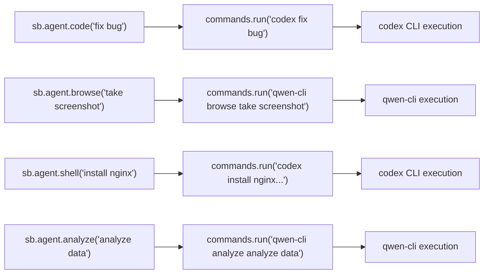
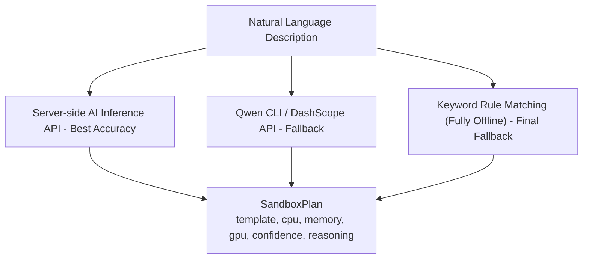

# Built-in Agent High-Level API Design

> Easy Sandbox built-in agents adopt a minimalist architecture: AI CLI tools (Codex, Qwen CLI, etc.) are pre-installed in sandbox templates, and the SDK Agent API is simply syntactic sugar wrapping `commands.run()`. The SDK has zero LLM dependencies, keeping it lightweight.

---

## Table of Contents

1. [Design Philosophy](#1-design-philosophy)
2. [Architecture Overview](#2-architecture-overview)
3. [Agent Types and Implementation Mapping](#3-agent-types-and-implementation-mapping)
4. [Agent Template System](#4-agent-template-system)
5. [AgentModule SDK API](#5-agentmodule-sdk-api)
6. [Usage Examples](#6-usage-examples)
7. [Natural Language Inference (Simplified Implementation)](#7-natural-language-inference-simplified-implementation)
8. [Agent Framework Integration](#8-agent-framework-integration)
9. [Version Management and Hot Updates](#9-version-management-and-hot-updates)

---

## 1. Design Philosophy

### Why Built-in Agents?

Traditional Sandbox SDKs position themselves as "infrastructure tools" — providing low-level capabilities like sandbox creation, file operations, and command execution. Users must write complex orchestration logic themselves.

Easy Sandbox positions itself as an **"AI Capability Platform"** — low-level capabilities + sandbox templates with pre-installed AI CLI tools, letting users accomplish complex tasks in a single line of code:

```
Traditional SDK:                    Easy Sandbox:
                                   
Create sandbox                      sb = await Sandbox.create(template="codex")
Install tools                       result = await sb.agent.code("fix bug in main.py")
Write AI call logic                 print(result.output)
Handle LLM authentication           # → Done in one line!
Parse return results
Manage LLM dependencies
Destroy sandbox
```

### Core Principles

1. **SDK Zero LLM Dependencies**: The SDK does not introduce any LLM client libraries (no dependency on openai / anthropic / dashscope), keeping it lightweight
2. **Agent API = Syntactic Sugar**: `sb.agent.code("task")` is essentially a wrapper around `sb.commands.run(f"codex {shlex.quote(task)}")`
3. **AI Capabilities Live in Templates**: AI CLI tools (Codex, Qwen CLI) are pre-installed in sandbox templates; authentication info is injected via sandbox environment variables
4. **Users Choose Templates**: Codex template / Qwen template / custom templates — flexibly switch between different AI backends
5. **Hot-Updatable**: Upgrading the AI CLI version in the template gives you new capabilities without upgrading the SDK

---

## 2. Architecture Overview

### Core Architecture: AI CLI Wrapper



### Why This Design?

| Design Decision | Rationale |
|-----------------|-----------|
| SDK does not embed LLM Provider | Avoids SDK bloat, avoids LLM library version conflicts |
| AI capabilities live in templates | AI CLI tool authentication, model selection, and version management are all handled within the template |
| Users don't need extra API Keys | AI tool authentication is pre-configured in sandbox templates (injected via environment variables) |
| Agent API is syntactic sugar | Reduces SDK complexity; all Agent behaviors ultimately go through `commands.run()` |

### Comparison with the Old Design

```
Old Design (rejected):               Current Design:
                                   
SDK built-in LLM Provider adapters   SDK zero LLM dependencies
  - openai / anthropic / qwen        
5 separate Agent implementations     Agent API = commands.run() syntactic sugar
  - BrowseAgent / CodeAgent /...     
AgentChain / FanOut / DAG orchestration  No built-in orchestration (users use standard Python)
Custom Agent framework               Users extend via custom templates
  - register system_prompt + tools
```

---

## 3. Agent Types and Implementation Mapping

### Mapping

| Agent Method | Actual Execution | Template Used |
|-------------|-----------------|---------------|
| `sb.agent.code("fix bug")` | `sb.commands.run("codex 'fix bug'")` | `codex` |
| `sb.agent.browse("open Baidu")` | `sb.commands.run("qwen-cli browse 'open Baidu'")` | `qwen-browser` |
| `sb.agent.shell("install nginx")` | `sb.commands.run("codex 'install nginx and configure'")` | `codex` |
| `sb.agent.analyze("analyze data")` | `sb.commands.run("qwen-cli analyze 'analyze data'")` | `qwen-code` |

### Template and Agent Capability Mapping

| Template | Supported Agent Methods | Pre-installed Tools | Typical Scenarios |
|----------|------------------------|--------------------|--------------------|
| `codex` | `code()`, `shell()` | OpenAI Codex CLI | Code generation/fixing, Shell automation |
| `qwen-browser` | `browse()` | Qwen CLI + Playwright | Browser automation, web screenshots |
| `qwen-code` | `code()`, `analyze()`, `shell()` | Qwen CLI + multi-language runtimes | Code analysis, data analysis |

---

## 4. Agent Template System

### Official Agent Templates

| Template | Description | Pre-installed Tools | Default Resources |
|----------|-------------|--------------------|--------------------|
| `codex` | Codex CLI Code Agent | OpenAI Codex CLI | 2C/4G/20G |
| `qwen-browser` | Qwen Browser Agent | Qwen CLI + Playwright | 2C/4G/15G |
| `qwen-code` | Qwen Code Agent | Qwen CLI + multi-language runtimes | 2C/4G/20G |

> **Note**: AI CLI tool authentication in Agent templates is pre-configured (injected via sandbox environment variables); users do not need to configure API Keys separately.

### Template Internal Structure

Agent templates essentially pre-install AI CLI tools on top of base templates:

```
codex template:
  base: code-interpreter
  pre-installed: OpenAI Codex CLI
  env vars: OPENAI_API_KEY (platform-injected)

qwen-browser template:
  base: browser-automation
  pre-installed: Qwen CLI + Playwright + Chromium
  env vars: DASHSCOPE_API_KEY (platform-injected)

qwen-code template:
  base: code-interpreter
  pre-installed: Qwen CLI + multi-language runtimes
  env vars: DASHSCOPE_API_KEY (platform-injected)
```

### Custom Agent Templates

Users can extend Agent capabilities through custom templates:

```yaml
# template.yaml — Custom Agent template
version: "1"

metadata:
  name: my-agent-template
  description: "Custom AI Agent template"

base:
  from: "codex"                    # Inherit from official codex template

build:
  pip_install: [flask, sqlalchemy] # Install additional business dependencies
  env:
    MY_CUSTOM_CONFIG: "value"

agent:
  description: "Suitable for Flask project code review scenarios"
  triggers: ["flask", "code review", "security scan"]
```

```python
# Using a custom template
sb = await Sandbox.create(template="my-agent-template")
result = await sb.agent.code("Review the security of this Flask project")
```

---

## 5. AgentModule SDK API

### Core Implementation

```python
import shlex

class AgentModule:
    """Agent syntactic sugar — underlying calls go through commands.run()"""

    def __init__(self, sandbox: "Sandbox"):
        self._sandbox = sandbox

    async def code(self, task: str, *, context: dict | None = None, timeout: int = 120) -> AgentResult:
        """Code analysis/generation/fixing"""
        cmd = self._build_command("code", task, context)
        return await self._execute(cmd, timeout)

    async def browse(self, task: str, *, timeout: int = 120) -> AgentResult:
        """Browser automation"""
        cmd = self._build_command("browse", task)
        return await self._execute(cmd, timeout)

    async def shell(self, task: str, *, timeout: int = 120) -> AgentResult:
        """Shell automation"""
        cmd = self._build_command("shell", task)
        return await self._execute(cmd, timeout)

    async def analyze(self, task: str, *, timeout: int = 120) -> AgentResult:
        """Data analysis"""
        cmd = self._build_command("analyze", task)
        return await self._execute(cmd, timeout)

    def _build_command(self, action: str, task: str, context: dict | None = None) -> str:
        """Build CLI command based on template type

        Mapping logic:
          codex template      → codex '{task}'
          qwen-* template     → qwen-cli {action} '{task}'
          custom template     → read template agent config
        """
        template = self._sandbox._template_name
        safe_task = shlex.quote(task)

        if template.startswith("codex"):
            return f"codex {safe_task}"
        elif template.startswith("qwen-"):
            return f"qwen-cli {action} {safe_task}"
        else:
            # Custom template: try to read command pattern from template config
            return self._build_custom_command(action, safe_task)

    async def _execute(self, cmd: str, timeout: int) -> AgentResult:
        """Execute command and parse results"""
        result = await self._sandbox.commands.run(cmd, timeout=timeout)
        return AgentResult(output=result.stdout, exit_code=result.exit_code)
```

### AgentResult Data Model

```python
@dataclass
class AgentResult:
    """Agent execution result"""
    output: str                # CLI standard output
    exit_code: int             # Exit code (0 = success)

    @property
    def success(self) -> bool:
        return self.exit_code == 0

    @property
    def text(self) -> str:
        """Alias for output, for convenience"""
        return self.output
```

---

## 6. Usage Examples

### Code Agent

```python
from easy_sandbox import Sandbox

# Using the Codex template
sb = await Sandbox.create(template="codex")
result = await sb.agent.code("Analyze the complexity of /app/main.py and suggest optimizations")
print(result.output)

# Equivalent to calling directly:
result = await sb.commands.run("codex 'Analyze the complexity of /app/main.py and suggest optimizations'")
print(result.stdout)
```

### Browser Agent

```python
sb = await Sandbox.create(template="qwen-browser")
result = await sb.agent.browse("Visit https://example.com and take a screenshot of the homepage")
print(result.output)

# Equivalent to:
result = await sb.commands.run("qwen-cli browse 'Visit https://example.com and take a screenshot of the homepage'")
```

### Shell Automation

```python
sb = await Sandbox.create(template="codex")
result = await sb.agent.shell("Install nginx and configure reverse proxy to port 8080")
print(result.output)
```

### Data Analysis

```python
sb = await Sandbox.create(template="qwen-code")
await sb.files.write("/app/data.csv", csv_content)
result = await sb.agent.analyze("Perform trend analysis on this CSV and generate charts")
print(result.output)
```

### Context Manager Auto-Cleanup

```python
async with await Sandbox.create(template="codex") as sb:
    result = await sb.agent.code("fix bug in main.py")
    print(result.output)
    # Sandbox is automatically destroyed on exit
```

### User Orchestration (Replacing the Old AgentChain)

No more built-in AgentChain / AgentFanOut / AgentDAG orchestration — users can implement this using standard Python:

```python
import asyncio
from easy_sandbox import Sandbox

# === Serial Orchestration ===
async def serial_pipeline():
    sb = await Sandbox.create(template="codex")
    # Step 1: Analyze
    r1 = await sb.agent.code("Analyze the code quality of /app/main.py")
    # Step 2: Fix based on analysis results
    r2 = await sb.agent.code(f"Fix the code based on this analysis: {r1.output}")
    # Step 3: Verify
    r3 = await sb.agent.shell("Run tests pytest tests/ -v")
    await sb.kill()

# === Parallel Orchestration ===
async def parallel_review():
    async def check(template, task):
        async with await Sandbox.create(template=template) as sb:
            return await sb.agent.code(task)

    results = await asyncio.gather(
        check("codex", "Check code style"),
        check("codex", "Check security vulnerabilities"),
        check("qwen-code", "Check performance issues"),
    )
    # Three Agents run in parallel, each using an independent sandbox
```

---

## 7. Natural Language Inference (Simplified Implementation)

Natural language sandbox creation inference logic is no longer implemented by an InferAgent inside the SDK, but through external calls:



### Rule Matching Examples (Offline Fallback)

| Keywords | Inferred Template | Inferred Resources |
|----------|------------------|--------------------|
| python, pandas, data analysis, CSV | python-data-science | 2C/4G |
| node, web, frontend, react, vue | node-web | 1C/2G |
| playwright, browser, crawler, screenshot | browser-automation | 2C/4G |
| GPU, CUDA, tensorflow, pytorch | ml-gpu | 4C/16G+GPU |
| codex, code generation, fix bug | codex | 2C/4G |

### SDK API

```python
from easy_sandbox import Sandbox

# Natural language creation
sb = await Sandbox.create("Run a python data analysis environment, need GPU")
# → Inferred: template=python-data-science, gpu=auto, memory=8192

# Preview inference result (without actually creating)
plan = await Sandbox.plan("Need an environment that can run TensorFlow")
print(plan)
# SandboxPlan(template='ml-gpu', cpu=4, memory=16384, gpu='A10', confidence=0.92, ...)

# Override inference results
sb = await Sandbox.create(plan, memory=32768)
```

---

## 8. Agent Framework Integration

### Tool Schema Export

Sandbox operation tools follow the OpenAI function calling format and can be directly exported as Tool Schemas for frameworks like LangChain / CrewAI / AutoGen:

```python
from easy_sandbox.agent import get_tool_schema

# Export as OpenAI format
tools = get_tool_schema(format="openai")

# Export as LangChain format
tools = get_tool_schema(format="langchain")
```

### LangChain Adapter

```python
from easy_sandbox.integrations import LangChainToolkit

toolkit = LangChainToolkit(sandbox_config={"template": "code-interpreter"})
tools = toolkit.get_tools()

# Use in a LangChain Agent
from langchain.agents import AgentExecutor
agent = AgentExecutor(tools=tools, llm=llm)
```

### CrewAI Adapter

```python
from easy_sandbox.integrations import CrewAIToolkit

toolkit = CrewAIToolkit()
tools = toolkit.get_tools()
```

> **Note**: The framework integration layer only exports Tool Schemas and provides adapters; it does not include LLM Provider adaptation. LLM selection and configuration are handled by users within their respective Agent frameworks. The SDK itself does not depend on any LLM library.

---

## 9. Version Management and Hot Updates

### AI CLI Tool Version Management

AI CLI tool versions are managed by templates, decoupled from the SDK version:

```
SDK version    →  Controls the Agent API interface (AgentModule method signatures)
Template version →  Controls the AI CLI tool version (specific Codex CLI / Qwen CLI versions)
```

### Hot Update Mechanism

```
Template update flow:
  1. Official team updates codex template → contains new version of Codex CLI
  2. User's next Sandbox.create(template="codex") → automatically pulls the latest template
  3. New template contains a higher Codex CLI version → gains new capabilities
  4. No SDK code changes needed
```

### Template Version Pinning

```python
# Pin to a specific version
sb = await Sandbox.create(template="codex@1.2.0")

# Use the latest version (default behavior)
sb = await Sandbox.create(template="codex")
```

```bash
# CLI to view template version
ebx template info codex
# Template: codex
# Version: 1.3.0
# Codex CLI: v0.1.2
# Base: code-interpreter
# Resources: 2C/4G/20G
```
