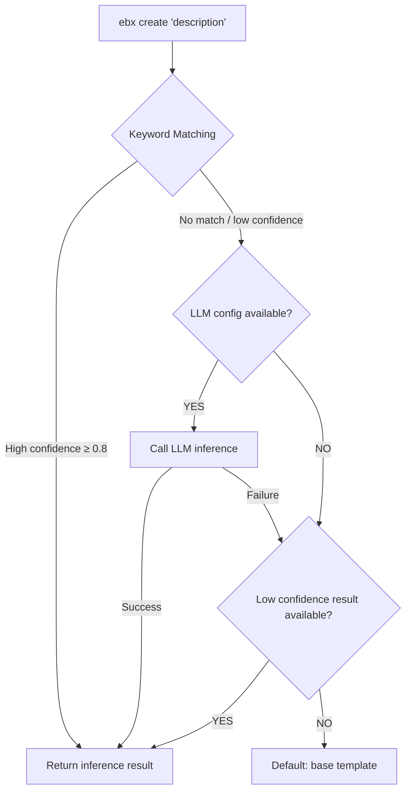

# CLI Command System Design

> `ebx` CLI is the command-line entry point for Easy Sandbox, designed for both human developers and AI Agents. The CLI's ultimate goal: **Users don't need to know about templates, resource specs, or configuration parameters — just describe what you want to do, and the sandbox handles everything automatically.**

***

## Table of Contents

1. [Command Tree](#1-command-tree)
2. [Global Options](#2-global-options)
3. [Natural Language Creation](#3-natural-language-creation)
4. [Core Command Details](#4-core-command-details)
5. [Configuration Management](#5-configuration-management)
6. [Core Workflows](#6-core-workflows)
7. [OutputManager Unified Output Management](#7-outputmanager-unified-output-management)
8. [AI Friendly Design Principles](#8-ai-friendly-design-principles)
9. [Future Plans](#9-future-plans)

***

## 1. Command Tree

```mermaid
graph TB
    ebx["ebx"]

    ebx --- create["create - Create sandbox (supports natural language inference)"]
    ebx --- list["list - List all sandboxes"]
    ebx --- info["info - View sandbox details"]
    ebx --- kill["kill - Destroy sandbox / --all"]
    ebx --- execCmd["exec - Execute raw shell command"]
    ebx --- run["run - Dispatch named command"]
    ebx --- connect["connect - Interactive connection"]
    ebx --- upload["upload - Upload file/directory"]
    ebx --- download["download - Download file"]
    ebx --- deploy["deploy - Deploy project"]
    ebx --- install["install - Install community template"]
    ebx --- sandbox["sandbox"]
    ebx --- template["template"]
    ebx --- mcp["mcp"]
    ebx --- config["config"]

    sandbox --- sb_crud["create / list / info / kill / exec / connect / upload / download / run"]
    sandbox --- sb_files["files"]
    sandbox --- sb_process["process"]
    sandbox --- sb_system["system"]
    sandbox --- sb_cap["capabilities"]
    sandbox --- sb_shell["shell-stream"]

    sb_files --- f_list["list"]
    sb_files --- f_stat["stat"]
    sb_files --- f_mkdir["mkdir"]
    sb_files --- f_rm["rm"]
    sb_files --- f_mv["mv"]
    sb_files --- f_search["search"]

    sb_process --- p_list["list"]
    sb_process --- p_start["start"]
    sb_process --- p_info["info"]
    sb_process --- p_signal["signal"]

    sb_system --- sys_info["info"]
    sb_system --- sys_env["env"]
    sb_system --- sys_ports["ports"]
    sb_system --- sys_packages["packages"]
    sb_system --- sys_metrics["metrics"]

    template --- tpl_list["list"]
    template --- tpl_info["info"]
    template --- tpl_build["build"]
    template --- tpl_delete["delete"]
    template --- tpl_install["install"]
    template --- tpl_cache["cache"]

    mcp --- mcp_install["install"]
    mcp --- mcp_start["start"]
    mcp --- mcp_status["status"]

    config --- cfg_get["get"]
    config --- cfg_set["set"]
    config --- cfg_list["list"]
    config --- cfg_reset["reset"]
```



***

## 2. Global Options

| Option         | Short  | Description                | Default        |
| -------------- | ------ | -------------------------- | -------------- |
| `--json`       | `-j`   | Output in JSON format (AI-friendly) | `false`        |
| `--quiet`      | `-q`   | Quiet mode, only output key results | `false`        |
| `--verbose`    | `-v`   | Verbose output (DEBUG level logs)   | `false`        |
| `--no-color`   |        | Disable colored output             | `false`        |
| `--log-level`  |        | Explicitly set log level (DEBUG/INFO/WARNING/ERROR) | `None` |
| `--ci`         |        | CI/CD mode (equivalent to quiet + no-color + json) | `false` |
| `--timeout`    | `-t`   | Default timeout in seconds         | `300`          |
| `--region`     | `-r`   | Specify region                     | `cn-hangzhou`  |
| `--profile`    | `-p`   | [Reserved] Configuration profile   | `None`         |
| `--version`    |        | Show version number                |                |

```bash
# Example: JSON output + quiet
ebx list --json --quiet

# CI/CD mode (auto quiet + no-color + json)
ebx list --ci

# Specify log level
ebx create "python environment" --log-level DEBUG

# Specify region
ebx create "python environment" --region cn-shanghai
```

The CLI automatically detects CI environments (`CI`, `GITHUB_ACTIONS`, `GITLAB_CI`, `JENKINS_URL`, etc.) and enables CI mode automatically. Color output is automatically disabled in non-TTY environments.

***

## 3. Natural Language Creation

> This is the CLI's most revolutionary feature — **describe what you need in natural language, and the sandbox automatically infers the template and configuration.**

### Basic Syntax

```bash
ebx create "<natural language description>"
```

### Three-Level Fallback Inference Mechanism

The CLI uses a three-level fallback strategy to infer the best template:



**Level 1 — Keyword Matching** (offline, fast):
Scores based on overlap between template keywords and user description, supporting both Chinese and English keywords. High confidence results are returned directly.

**Level 2 — LLM Inference** (requires configured `llm_api_key`):
Calls an OpenAI-compatible LLM API to have the large model select the most suitable template. Requires prior configuration via `ebx config set llm_api_key <key>`.

**Level 3 — Default Fallback**:
When neither of the above levels can determine a result, uses the `base` template.

### Examples

```bash
# Natural language description → auto-infer template and configuration
ebx create "run python, run codex"
# ✓ Inference result:
#     Template: code-interpreter
#     CPU: 2 cores  |  Memory: 4096 MB
#     Confidence: 0.95
# → Creating...

ebx create "Start a Node.js Web service"
# ✓ Inference result:
#     Template: node-web
#     CPU: 1 core  |  Memory: 2048 MB
#     Confidence: 0.85

ebx create "Use playwright to scrape web pages and take screenshots"
# ✓ Inference result:
#     Template: browser-automation
#     CPU: 2 cores  |  Memory: 4096 MB
#     Confidence: 0.90

# With file upload
ebx create "Analyze this CSV file" --upload data.csv
```

### Traditional Template Mode

```bash
# Specify template directly — skip inference
ebx create --template codex
ebx create -T browser-automation
```

### Available Templates

| Template              | Description                              | Status |
| --------------------- | ---------------------------------------- | ------ |
| `python-hello`        | Minimal Python hello world test environment | Official |
| `node-web`            | Node.js Web service development environment | Official |
| `browser-automation`  | Browser automation with pre-installed Chromium + Playwright | Official |
| `codex`               | OpenAI Codex CLI Agent runtime environment | Official |
| `claude-code`         | Claude Code Agent runtime environment    | Official |
| `qoder`               | Qoder AI coding assistant runtime environment | Official |
| `qwen-code`           | Qwen Code Agent runtime environment      | Official |
| `deepseek-harness`    | DeepSeek Agent runtime environment       | Official |
| `hermes-agent`        | Hermes Agent runtime environment         | Official |
| `openclaw`            | OpenClaw AI Agent runtime environment    | Official |

> For the complete community template index, see [`awesome-templates.yaml`](../../../awesome-templates.yaml) in the repository root.

***

## 4. Core Command Details

### ebx create

```bash
ebx create [DESCRIPTION] [options]

Arguments:
  DESCRIPTION               Natural language description (optional, for auto template inference)

Options:
  --template, -T <name>     Specify template name (skip inference)
  --upload, -u <path>       Upload local file/directory after creation
  --timeout, -t <seconds>   Sandbox timeout
  --env, -e <KEY=VALUE>     Environment variable (can be used multiple times)
  --metadata, -m <KEY=VALUE> Metadata key-value pair (can be used multiple times)

Examples:
  ebx create "python data analysis"
  ebx create --template code-interpreter
  ebx create "Node.js API" -e PORT=3000
  ebx create "Analyze data" --upload ./data.csv
  ebx create -T base -e DB_HOST=localhost -m project=demo
```

### ebx list

```bash
ebx list [options]

Options:
  --status, -s <status>     Filter by status (running/stopped/creating/paused/error)
  --limit, -l <n>           Limit count (default: 20)

Examples:
  ebx list
  ebx list --status running --json
  ebx list -l 50
```

**Output Format**:

```
$ ebx list
  ID            Template             Status    Region
  sb-a1b2c3d4   code-interpreter     running   cn-hangzhou
  sb-e5f6g7h8   python-data-science  running   cn-hangzhou
  sb-i9j0k1l2   base                 stopped   cn-shanghai
```

### ebx info

```bash
ebx info <sandbox-id>

Examples:
  ebx info sb-a1b2c3d4
  ebx info sb-a1b2c3d4 --json
```

**Output Format**:

```
$ ebx info sb-a1b2c3d4
  ID:           sb-a1b2c3d4
  Template:     code-interpreter
  Status:       running
  Region:       cn-hangzhou
  Timeout:      300s
  URL:          https://sb-a1b2c3d4.envd.example.com
  Started:      2026-09-01 14:00:00
```

### ebx kill

```bash
ebx kill <sandbox-id> [options]
ebx kill --all [options]

Options:
  --all                     Destroy all running sandboxes
  --yes, -y                 Skip confirmation prompt

Examples:
  ebx kill sb-abc123
  ebx kill sb-abc123 --yes
  ebx kill --all --yes
```

### ebx exec

```bash
ebx exec <sandbox-id> <command> [options]

Options:
  --timeout, -t <seconds>   Command timeout (default: 60)
  --cwd <path>              Working directory (default: /app)

Examples:
  ebx exec sb-abc123 "python train.py"
  ebx exec sb-abc123 "npm start" --timeout 120
  ebx exec sb-abc123 "ls -la" --json
```

**Output Format**:

```
$ ebx exec sb-abc123 "python -c 'print(1+1)'"
2

$ ebx exec sb-abc123 "python -c 'print(1+1)'" --json
{
  "stdout": "2\n",
  "stderr": "",
  "exit_code": 0,
  "execution_time": 0.12
}
```

The `exec` command propagates the exit code from the sandbox command as its own exit code.

### ebx run

```bash
ebx run <sandbox-id> <command-name> [options]

Arguments:
  command-name              Named command declared in the template's `custom_commands`

Options:
  --arg, -a <KEY=VALUE>     Named command arguments (can be used multiple times)
  --timeout, -t <seconds>   Override command-declared timeout

Examples:
  ebx run sb-abc123 serve --arg port=9000
  ebx run sb-abc123 migrate --arg target=head --json
```

`run` is a **template-aware** named command dispatcher: it resolves `command-name` against the sandbox template's `custom_commands` declaration, validates `--arg` parameters against the `args` schema, escapes them with `shlex.quote()`, fills in the command template, and executes in the sandbox.

**Semantic distinction between `run` and `exec`**:

- `ebx exec` = raw shell command (arbitrary string, requires `shell` capability).
- `ebx run` = template-declared named command (structured parameters + injection prevention).

Error handling:

- `command-name` not declared → error with list of available commands.
- Missing `required` parameters → error before execution.
- Sandbox lacks required capability → throws `CapabilityNotSupportedError` (E3xxx) with fix suggestions.

See ADR `2026-09-03-cli-run-vs-exec.md` for details.

### ebx deploy

`ebx deploy` supports two modes: **NL mode** (default, uses qwen-code agent to automatically analyze, install dependencies, build, and start the service) and **traditional mode** (manual build + run).

```bash
ebx deploy [PATH] [INSTRUCTION] [options]

Arguments:
  PATH                            Project directory (default: .)
  INSTRUCTION                     Natural language deployment instruction (optional)

Options:
  --instruction, -i <text>        NL deployment instruction (alternative to positional arg)
  --max-wall-time <duration>      qwen-code max execution time (e.g., '10m', '600s')
  --max-tool-calls <n>            qwen-code max tool calls (default: 100)
  --alias, -a <name>              Template alias (traditional mode)
  --watch                         Watch file changes for auto-redeploy (traditional mode)
  --traditional                   Use traditional build+run mode instead of AI deployment

Examples:
  # NL mode (default)
  ebx deploy ./my-project "This is a FastAPI project that needs Redis"
  ebx deploy ./my-project -i "Deploy to port 8080"

  # Traditional mode
  ebx deploy ./my-project --traditional
```

NL mode workflow:
1. Create a `qwen-code` template sandbox
2. Upload project files to `/workspace`
3. qwen-code agent automatically analyzes project type, installs dependencies, builds, and starts the service
4. Parse deployment results (status, URL, ports, logs)

Traditional mode supports automatic project type detection (Python / Node.js / Go / Java / Docker) and provides `ebx deploy build` and `ebx deploy run` subcommands for fine-grained control.

### ebx connect

```bash
ebx connect <sandbox-id>

Examples:
  ebx connect sb-abc123
```

Connect to the sandbox's interactive REPL. Each command runs in an independent process. Type `exit`, `quit`, or `Ctrl+D` to disconnect.

**Interactive Example**:

```
$ ebx connect sb-abc123
✓ Connected to sandbox sb-abc123
Type 'exit' or Ctrl+D to disconnect
Note: each command runs in an independent process

sbox:sb-abc1> ls /app
main.py  data/  requirements.txt

sbox:sb-abc1> python -c "print('hello')"
hello

sbox:sb-abc1> exit
Disconnected.
```

### ebx upload

```bash
ebx upload <sandbox-id> <local-path> <remote-path>

Examples:
  ebx upload sb-abc123 ./script.py /app/script.py
  ebx upload sb-abc123 ./data/ /app/data/
```

Supports uploading single files or entire directories. Directory uploads recursively upload all files.

### ebx download

```bash
ebx download <sandbox-id> <remote-path> <local-path>

Examples:
  ebx download sb-abc123 /app/result.csv ./result.csv
  ebx download sb-abc123 /app/output.log .
```

Download files from the sandbox to local. If `local-path` is a directory, the filename is taken from the remote path.

### ebx sandbox files

Sandbox file operation subcommand group with 6 commands.

#### files list

```bash
ebx sandbox files list <sandbox-id> [options]

Options:
  --path, -p <path>       Directory path (default: /home/user)
  --recursive, -r         List recursively (max depth 5)

Examples:
  ebx sandbox files list abc123
  ebx sandbox files list abc123 --path /app --recursive
```

#### files stat

```bash
ebx sandbox files stat <sandbox-id> [options]

Options:
  --path, -p <path>       File or directory path (required)

Examples:
  ebx sandbox files stat abc123 --path /home/user/app.py
```

#### files mkdir

```bash
ebx sandbox files mkdir <sandbox-id> [options]

Options:
  --path, -p <path>       Directory path to create (required)

Examples:
  ebx sandbox files mkdir abc123 --path /home/user/myproject/src
```

Automatically creates parent directories.

#### files rm

```bash
ebx sandbox files rm <sandbox-id> [options]

Options:
  --path, -p <path>       File or directory path to delete (required)
  --yes, -y               Skip confirmation

Examples:
  ebx sandbox files rm abc123 --path /home/user/temp.txt
  ebx sandbox files rm abc123 --path /home/user/old_dir -y
```

#### files mv

```bash
ebx sandbox files mv <sandbox-id> [options]

Options:
  --source, -s <path>     Source path (required)
  --dest, -d <path>       Destination path (required)

Examples:
  ebx sandbox files mv abc123 --source /home/user/old.py --dest /home/user/new.py
```

#### files search

```bash
ebx sandbox files search <sandbox-id> [options]

Options:
  --path, -p <path>       Search directory (required)
  --pattern <glob>        Glob pattern, e.g., '*.py' (required)
  --max-depth <n>         Max search depth (default: 5)

Examples:
  ebx sandbox files search abc123 --path /home/user --pattern "*.py"
  ebx sandbox files search abc123 --path /app --pattern "*.log" --max-depth 3
```

### ebx sandbox process

Sandbox process management subcommand group with 4 commands.

#### process list

```bash
ebx sandbox process list <sandbox-id>

Examples:
  ebx sandbox process list abc123
```

Lists processes running in the sandbox, including PID, command, and status.

#### process start

```bash
ebx sandbox process start <sandbox-id> [options]

Options:
  --command, -c <cmd>     Command to run (required)
  --timeout, -t <seconds> Timeout in seconds (default: 300)
  --cwd <path>            Working directory

Examples:
  ebx sandbox process start abc123 --command "python app.py"
  ebx sandbox process start abc123 -c "node server.js" --cwd /app
```

Outputs stdout/stderr after process completion; exit code propagates as CLI exit code.

#### process info

```bash
ebx sandbox process info <sandbox-id> <pid>

Examples:
  ebx sandbox process info abc123 1234
```

Queries process information using `ps`, outputting PPID, User, State, RSS, Elapsed, etc.

#### process signal

```bash
ebx sandbox process signal <sandbox-id> <pid> [options]

Options:
  --signal, -s <number>   Signal number (default: 15/SIGTERM)

Examples:
  ebx sandbox process signal abc123 1234
  ebx sandbox process signal abc123 1234 --signal 9
```

Common signals: 15 (SIGTERM), 9 (SIGKILL), 2 (SIGINT).

### ebx sandbox system

Sandbox system information subcommand group with 5 commands.

#### system info

```bash
ebx sandbox system info <sandbox-id>

Examples:
  ebx sandbox system info abc123
```

Displays OS, architecture, CPU count, Python version, disk space, etc.

#### system env

```bash
ebx sandbox system env <sandbox-id> [options]

Options:
  --filter, -f <names>    Comma-separated variable name allowlist

Examples:
  ebx sandbox system env abc123
  ebx sandbox system env abc123 --filter PATH,HOME,LANG
```

Sensitive variables containing TOKEN, SECRET, KEY, PASSWORD are automatically excluded.

#### system ports

```bash
ebx sandbox system ports <sandbox-id>

Examples:
  ebx sandbox system ports abc123
```

Queries listening TCP ports using `ss -tlnp` or `netstat -tlnp`.

#### system packages

```bash
ebx sandbox system packages <sandbox-id> [options]

Options:
  --manager, -m <pip|npm> Package manager (default: pip)

Examples:
  ebx sandbox system packages abc123
  ebx sandbox system packages abc123 --manager npm
```

#### system metrics

```bash
ebx sandbox system metrics <sandbox-id>

Examples:
  ebx sandbox system metrics abc123
```

Displays CPU load (1/5/15 min), disk usage, and other real-time metrics.

### ebx sandbox capabilities

```bash
ebx sandbox capabilities <sandbox-id>

Examples:
  ebx sandbox capabilities abc123
```

Lists capability groups supported by the sandbox (e.g., shell, files, code, terminal, ports, etc.).

### ebx sandbox shell-stream

```bash
ebx sandbox shell-stream <sandbox-id> [options]

Options:
  --command, -c <cmd>     Command to execute (required)
  --timeout, -t <seconds> Timeout in seconds (default: 300)
  --cwd <path>            Working directory

Examples:
  ebx sandbox shell-stream abc123 --command "pip install numpy"
  ebx sandbox shell-stream abc123 -c "make build" --cwd /app
```

Unlike `exec`, `shell-stream` prints output line by line in real time (using SSE streaming), suitable for long-running commands. Exit code propagates as CLI exit code.

### ebx install

```bash
ebx install <template-ref> [options]

Options:
  --registry-url <url>      Registry URL (default: GitHub)
  --registry-type <type>    Registry type (github/local), auto-detected
  --token <token>           Access token (required for private repos)
  --alias, -a <name>        Template alias

Examples:
  ebx install owner/repo
  ebx install owner/repo//subdir@v1.0
  ebx install ./my-template --registry-type local
```

This is a top-level shortcut for `ebx template install`.

### ebx template

#### template list

```bash
ebx template list
```

Lists all custom templates (queried via Platform API).

#### template info

```bash
ebx template info <template-id>
```

View template details.

#### template build

```bash
ebx template build -f <Dockerfile> [--alias <name>]
```

Build a custom template from a Dockerfile, submitted to the platform for building.

#### template install

```bash
ebx template install <template-ref> [options]

Options:
  --registry-url <url>      Registry URL (default: GitHub)
  --registry-type <type>    Registry type (github/local)
  --token <token>           Access token (required for private repos)
  --alias, -a <name>        Template alias

Examples:
  ebx template install owner/repo              # Entire repo
  ebx template install owner/repo//subdir      # Specific subdirectory
  ebx template install owner/repo@v1.0         # Specific version
  ebx template install owner/repo --token xxx  # Private repo
  ebx template install ./my-template           # Local directory
```

Install templates from GitHub or local directories. The template directory must contain a `template.yaml` file.

#### template delete

```bash
ebx template delete <template-id>
```

Delete a custom template (requires confirmation).

#### template cache

```bash
ebx template cache [--clear]
```

Manage local template cache. `--clear` clears all cached items.

### ebx mcp

#### mcp install

```bash
ebx mcp install --target <cursor|claude|vscode>
```

Install MCP Server configuration to a specified IDE. Supports Cursor, Claude Desktop, and VS Code. After installation, lists registered tools:

- `create_sandbox` — Create a cloud sandbox
- `run_code` — Execute code
- `run_command` — Execute commands
- `read_file` — Read files
- `write_file` — Write files
- `list_files` — List files
- `kill_sandbox` — Destroy sandbox

#### mcp start

```bash
ebx mcp start [options]

Options:
  --template <name>         Default sandbox template (default: code-interpreter-v1)
  --api-key <key>           API Key override (env: E2B_API_KEY)
  --api-url <url>           API URL override (env: E2B_API_URL)
  --domain <domain>         Domain override (env: E2B_DOMAIN)
```

Start MCP Server in STDIO mode. Usually called automatically by the IDE; manual execution is not typically needed.

#### mcp status

```bash
ebx mcp status
```

Display MCP Server status: transport mode, tool count, auth config, installation status for each IDE.

***

## 5. Configuration Management

The configuration file is located at `~/.ebx/config.toml`, with API Keys stored separately in `~/.ebx/.env`.

### Configurable Items

| Config Key      | Description                           | Default                   |
| --------------- | ------------------------------------- | ------------------------- |
| `api_key`       | E2B API Key                           | (not set)                 |
| `api_url`       | Platform API URL                      | (auto)                    |
| `region`        | Default region                        | `cn-hangzhou`             |
| `http_timeout`  | HTTP request timeout (seconds)        | (auto)                    |
| `max_retries`   | Max retry count                       | (auto)                    |
| `domain`        | Envd Domain                           | (auto)                    |
| `llm_api_key`   | LLM API Key (for natural language inference) | (not set)          |
| `llm_model`     | LLM model name                        | `qwen-plus`              |
| `llm_base_url`  | LLM API Base URL (OpenAI compatible)  | DashScope compatible endpoint |

Sensitive config items (`api_key`, `llm_api_key`) are automatically masked in `config list` output.

### Command Examples

```bash
# Set API Key
ebx config set api_key e2b_xxx

# Configure LLM (enables Level 2 natural language inference)
ebx config set llm_api_key sk-xxx
ebx config set llm_model qwen-plus
ebx config set llm_base_url https://dashscope.aliyuncs.com/compatible-mode/v1

# View configuration
ebx config list
ebx config get region

# Reset all configuration
ebx config reset --yes
```

LLM configuration also supports environment variable overrides: `EBX_LLM_API_KEY`, `EBX_LLM_MODEL`, `EBX_LLM_BASE_URL`.

***

## 6. Core Workflows

### Workflow 1: Quick Experimentation

```bash
# One command, from description to usable environment
ebx create "python data analysis with pandas and matplotlib"
# → sb-abc123

ebx exec sb-abc123 "python -c 'import pandas; print(pandas.__version__)'"
# 2.1.0

ebx kill sb-abc123
```

### Workflow 2: File-Based Interactive Development

```bash
# Create sandbox and upload project
ebx create -T code-interpreter --upload ./project

# View sandbox contents
ebx exec sb-abc123 "ls /home/user/"

# Execute code
ebx exec sb-abc123 "python /home/user/main.py"

# Download results
ebx download sb-abc123 /app/result.csv ./result.csv

# Destroy when done
ebx kill sb-abc123 --yes
```

### Workflow 3: Interactive Debugging

```bash
# Create and connect to sandbox
ebx create -T code-interpreter
ebx connect sb-abc123

# Work in interactive REPL
sbox:sb-abc1> pip install requests
sbox:sb-abc1> python my_script.py
sbox:sb-abc1> cat /app/output.log
sbox:sb-abc1> exit
```

### Workflow 4: AI Agent Integration

```bash
# Install MCP Server to Cursor
ebx mcp install --target cursor

# Check status
ebx mcp status

# AI Agent automatically uses sandboxes via MCP
# (Natural language operations in Cursor/Claude)
```

### Workflow 5: Custom Templates

```bash
# Install community template from GitHub
ebx install owner/my-template

# Or build from Dockerfile
ebx template build -f ./Dockerfile --alias my-ml-env

# Check template status
ebx template list

# Use custom template
ebx create --template my-ml-env
```

***

## 7. OutputManager Unified Output Management

> All CLI commands uniformly use `OutputManager` (`cli/output.py`) instead of bare `click.echo` calls, ensuring consistent output behavior across different modes.

### Output Methods

| Method | Description | Quiet Mode | JSON Mode |
|--------|-------------|------------|----------|
| `info(message)` | Informational message | Suppressed | `{"level": "info", "message": ...}` |
| `success(message)` | Success message (green) | Suppressed | `{"status": "success", "message": ...}` |
| `warning(message)` | Warning message (yellow, to stderr) | Suppressed | `{"level": "warning", ...}` |
| `error(message)` | Error message (red, **always shown**) | Shown | `{"status": "error", ...}` |
| `debug(message)` | Debug message (verbose mode only) | Suppressed | `{"level": "debug", ...}` |
| `data(data)` | Structured data (dict/list) | Output as-is | JSON object |
| `table(headers, rows)` | Table data (Rich table + plain text fallback) | Tab-separated | `[{...}, ...]` |
| `progress(message)` | Progress/status message | Suppressed | `{"level": "progress", ...}` |

### Environment Auto-Detection

- **TTY Detection**: Automatically detects whether stdout is connected to a terminal; color output is automatically disabled in non-TTY environments.
- **CI Environment Detection**: Detects `CI`, `GITHUB_ACTIONS`, `GITLAB_CI`, `JENKINS_URL`, `TRAVIS`, `CIRCLECI`, `BITBUCKET_PIPELINES`, `TF_BUILD`, `CODEBUILD_BUILD_ID` and other environment variables, automatically enabling CI mode (quiet + no-color + json).

### Usage

```python
from easy_sandbox.cli.output import get_output

# Get OutputManager in any Click command
out = get_output(ctx)
out.info("Creating sandbox...")
out.success("Sandbox created successfully")
out.data({"sandbox_id": "sb-abc123", "status": "running"})
```

`get_output(ctx)` retrieves the `OutputManager` instance from Click context's `ctx.meta["sbox.output"]`, falling back to a default instance when no context is available.

***

## 8. AI Friendly Design Principles

The CLI is designed for both humans and AI; the following principles ensure AI Agents can efficiently use the CLI:

### Principle 1: Structured Output

```bash
# All commands support --json for structured JSON output
ebx list --json
ebx info sb-abc123 --json
ebx exec sb-abc123 "echo hello" --json
```

### Principle 2: Deterministic Exit Codes

| Exit Code | Meaning     |
| --------- | ----------- |
| `0`       | Success     |
| `1`       | General error |
| `2`       | Argument error |
| `3`       | Auth failure |
| `4`       | Resource not found |
| `5`       | Timeout     |
| `6`       | Quota exceeded |

### Principle 3: Non-Interactive Mode

```bash
# --yes skips confirmation (supported by kill, reset, etc.)
ebx kill --all --yes
ebx config reset --yes

# --quiet minimizes output
ebx create "python environment" --quiet
```

### Principle 4: Composable Pipelines

```bash
# Get ID directly after creation
ID=$(ebx create "python environment" --quiet)

# Pipeline composition
ebx list --json | jq '.[].sandbox_id'

# Batch destroy
ebx list --json | jq -r '.[].sandbox_id' | xargs -I{} ebx kill {} --yes
```

### Principle 5: Self-Describing Help

```bash
# Every command's --help includes complete documentation
ebx create --help
ebx template install --help

# Error messages include fix suggestions
$ ebx config set unknown_key value
Error: Unknown config key: 'unknown_key'
Available keys: api_key, api_url, domain, ...
```

### Principle 6: Lazy Loading for High Performance

The CLI uses `LazyGroup` for lazy loading, achieving `ebx --help` response time < 200ms. Modules and dependencies are only loaded when a command is actually executed.

***

## 9. Future Plans

The following features are not yet implemented and are planned for future versions:

- **`ebx build [path]`**: Automatically detect and build sandbox images from project directories
- **`ebx logs <sandbox-id>`**: View sandbox real-time logs
- **`ebx hibernate / wake`**: Sandbox hibernation and wake
- **`ebx snapshot`**: Create sandbox snapshots
- **Sandbox Pool**: Warm sandbox pool for batch task scenarios
- **Hot Reload Mode**: `--watch` flag for automatic sync of local file changes to sandbox
