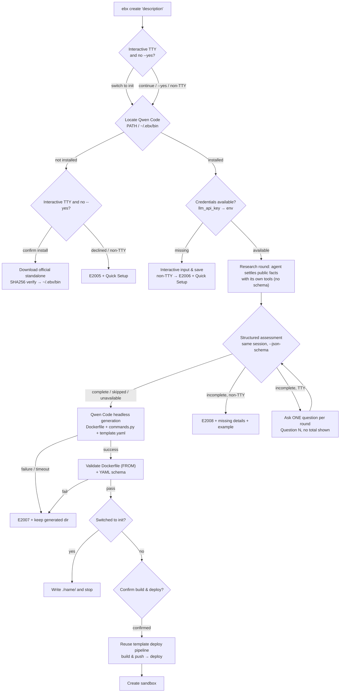

# CLI Command System Design

> `ebx` CLI is the command-line entry point for Easy Sandbox, designed for both human developers and AI Agents. The CLI's ultimate goal: **Users don't need to know about templates, resource specs, or configuration parameters — just describe what you want to do, and the sandbox handles everything automatically.**

***

## Table of Contents

1. [Command Tree](#1-command-tree)
2. [Global Options](#2-global-options)
3. [Natural Language Creation](#3-natural-language-creation)
4. [Core Command Details](#4-core-command-details)
5. [Configuration Management](#5-configuration-management)
6. [Core Workflows](#6-core-workflows)
7. [OutputManager Unified Output Management](#7-outputmanager-unified-output-management)
8. [AI Friendly Design Principles](#8-ai-friendly-design-principles)
9. [Future Plans](#9-future-plans)

***

## 1. Command Tree


```mermaid
graph TB
    ebx["ebx"]

    ebx --- create["create - Create sandbox (NL → Qwen Code template generation)"]
    ebx --- list["list - List all sandboxes"]
    ebx --- info["info - View sandbox details"]
    ebx --- kill["kill - Destroy sandbox / --all"]
    ebx --- execCmd["exec - Execute raw shell command"]
    ebx --- run["run - Dispatch named command"]
    ebx --- connect["connect - Interactive connection"]
    ebx --- upload["upload - Upload file/directory"]
    ebx --- download["download - Download file"]
    ebx --- deploy["deploy - Deploy project"]
    ebx --- install["install - Install community template"]
    ebx --- sandbox["sandbox"]
    ebx --- template["template"]
    ebx --- mcp["mcp"]
    ebx --- config["config"]

    sandbox --- sb_crud["create / list / info / kill / exec / connect / upload / download / run"]
    sandbox --- sb_files["files"]
    sandbox --- sb_process["process"]
    sandbox --- sb_system["system"]
    sandbox --- sb_cap["capabilities"]
    sandbox --- sb_shell["shell-stream"]

    sb_files --- f_list["list"]
    sb_files --- f_stat["stat"]
    sb_files --- f_mkdir["mkdir"]
    sb_files --- f_rm["rm"]
    sb_files --- f_mv["mv"]
    sb_files --- f_search["search"]

    sb_process --- p_list["list"]
    sb_process --- p_start["start"]
    sb_process --- p_info["info"]
    sb_process --- p_signal["signal"]

    sb_system --- sys_info["info"]
    sb_system --- sys_env["env"]
    sb_system --- sys_ports["ports"]
    sb_system --- sys_packages["packages"]
    sb_system --- sys_metrics["metrics"]

    template --- tpl_init["init"]
    template --- tpl_deploy["deploy"]
    template --- tpl_build["build"]
    template --- tpl_push["push"]
    template --- tpl_create["create"]
    template --- tpl_install["install"]
    template --- tpl_list["list"]
    template --- tpl_info["info"]
    template --- tpl_delete["delete"]
    template --- tpl_search["search"]

    mcp --- mcp_install["install"]
    mcp --- mcp_start["start"]
    mcp --- mcp_status["status"]
    mcp --- mcp_deploy["deploy"]

    config --- cfg_init["init"]
    config --- cfg_get["get"]
    config --- cfg_set["set"]
    config --- cfg_list["list"]
```

> `config reset` was removed before the first stable release — remove one stored value with `ebx config delete KEY` (or `ebx config set KEY ""`). The key falls back to its default or to not set. There is no command that wipes `~/.ebx`.

***

## 2. Global Options

| Option         | Short  | Description                | Default        |
| -------------- | ------ | -------------------------- | -------------- |
| `--json`       | `-j`   | Output in JSON format (AI-friendly) | `false`        |
| `--quiet`      | `-q`   | Quiet mode, only output key results | `false`        |
| `--verbose`    | `-v`   | Verbose output (DEBUG level logs)   | `false`        |
| `--no-color`   |        | Disable colored output             | `false`        |
| `--log-level`  |        | Explicitly set log level (DEBUG/INFO/WARNING/ERROR) | `None` |
| `--ci`         |        | CI/CD mode (equivalent to quiet + no-color + json) | `false` |
| `--timeout`    | `-t`   | Default timeout in seconds         | `300`          |
| `--profile`    | `-p`   | [Reserved] Configuration profile   | `None`         |
| `--version`    |        | Show version number                |                |
| `--help`       | `-h`   | Show help and exit (every command level) |           |

Every command accepts both `-h` and `--help`: the alias is configured once on the root group (`context_settings={'help_option_names': ['-h', '--help']}`) and inherited by the whole command tree through Click's Context mechanism — lazily loaded groups and nested sub-groups included.

```bash
# Example: JSON output + quiet
ebx list --json --quiet

# CI/CD mode (auto quiet + no-color + json)
ebx list --ci

# Specify log level
ebx create "python environment" --log-level DEBUG
```

`--region`/`-r` is a **command-level option**, not a global one. Only commands that talk to a regional control plane accept it:

```bash
# Region override for a single invocation
ebx list --region cn-shanghai
ebx sandbox list --region cn-shanghai
ebx template build ./my-template --acr-namespace ns --region cn-shanghai
ebx mcp deploy --region cn-shanghai

# Persistent region default
ebx config set region cn-shanghai
```

Resolution priority: command `--region` > `SANDBOX_REGION` > `ebx config set region` > `cn-hangzhou`.

The CLI automatically detects CI environments (`CI`, `GITHUB_ACTIONS`, `GITLAB_CI`, `JENKINS_URL`, etc.) and enables CI mode automatically. Color output is automatically disabled in non-TTY environments.

***

## 3. Natural Language Creation (AI Template Generation)

> **Describe what you need in natural language, and the CLI calls Qwen Code to generate a Dockerfile, a commands.py HTTP server entry point, and template.yaml, then builds, deploys, and creates the sandbox.**

`ebx create` has three routes, decided by the invocation:

| Invocation | Path |
|-----------|------|
| `ebx create` (no arguments) | **Rejected** — explicit usage error (exit code 2) listing the three valid routes; bare create never defaults to `base` silently |
| `ebx create --template <name>` | Direct template path (no AI generation) |
| `ebx create "natural language description"` | AI path (the focus of this section) |
| `ebx create "description" --template <name>` | Rejected — `DESCRIPTION` and `--template` are mutually exclusive (usage error, exit code 1) |

Neither input is ever silently dropped: when both are given the command refuses to run.

### AI Path Flow


```mermaid
graph TD
    Input["ebx create 'description'"] --> Scope{"Interactive TTY<br/>and no --yes?"}
    Scope -- "switch to init" --> Find
    Scope -- "continue / --yes / non-TTY" --> Find{"Locate Qwen Code<br/>PATH / ~/.ebx/bin"}
    Find -- not installed --> Install{"Interactive TTY and no --yes?"}
    Install -- confirm install --> Download["Download official standalone<br/>SHA256 verify → ~/.ebx/bin"]
    Install -- declined / non-TTY --> E2005["E2005 + Quick Setup"]
    Find -- installed --> Creds{"Credentials available?<br/>llm_api_key → env"}
    Creds -- missing --> Prompt["Interactive input & save<br/>non-TTY → E2006 + Quick Setup"]
    Creds -- available --> Research["Research round: agent settles public facts<br/>with its own tools (no schema)"]
    Research --> Assess{"Structured assessment<br/>same session, --json-schema"}
    Assess -- "complete / skipped / unavailable" --> Generate["Qwen Code headless generation<br/>Dockerfile + commands.py + template.yaml"]
    Assess -- "incomplete, non-TTY" --> E2008["E2008 + missing details + example"]
    Assess -- "incomplete, TTY" --> Ask["Ask ONE question per round<br/>Question N, no total shown"]
    Ask --> Assess
    Generate -- success --> Verify["Validate Dockerfile (FROM)<br/>+ YAML schema"]
    Generate -- failure / timeout --> E2007["E2007 + keep generated dir"]
    Verify -- pass --> Gate{"Switched to init?"}
    Gate -- yes --> Local["Write ./name/ and stop"]
    Gate -- no --> Confirm{"Confirm build & deploy?"}
    Confirm -- confirmed --> Deploy["Reuse template deploy pipeline<br/>build & push → deploy"]
    Deploy --> Create["Create sandbox"]
    Verify -- fail --> E2007
```

**Scope check.** Before any install or generation, an interactive terminal is shown that natural-language create will generate a template, build and push the image, deploy it, and create a sandbox, and is asked whether to switch to template init. Answering yes runs the same local-only generation as `ebx template init "DESCRIPTION"` (`Dockerfile`, `commands.py`, `template.yaml`, and `README.md` under `./<name>/`) and stops — no build, push, deploy, or sandbox. The default is to continue the full create. `--yes` and `--json` skip the question and keep the full pipeline. A non-interactive shell prints the same reminder and continues; the build confirmation below still applies.

1. **Executable discovery**: checks `PATH` first, then `~/.ebx/bin` (recognizing `.cmd`/`.exe` suffixes on Windows).
2. **Install guidance**: when missing, interactive terminals are asked whether to install the official standalone build (SHA256-verified, atomically installed into `~/.ebx/bin`, executable bit set on Unix); non-TTY or a declined prompt raises `E2005` with the Quick Setup — no hang, no silent fallback.
3. **Credential resolution**: a process environment variable wins over `./.env`, which wins over `~/.ebx` for a key it sets. API key order is `EBX_LLM_API_KEY`, then `BAILIAN_CODING_PLAN_API_KEY`, `DASHSCOPE_API_KEY`, `OPENAI_API_KEY`, then a legacy `EBX_QWEN_CODE_API_KEY`, then the same names in `./.env`, then the value stored by `ebx config set llm_api_key`. `llm_base_url` uses `EBX_LLM_BASE_URL` then `OPENAI_BASE_URL` then the stored value (a legacy `qwen_code_base_url` only when `llm_base_url` is unset) then the DashScope default. `llm_model` uses `EBX_LLM_MODEL` then `OPENAI_MODEL` then the stored value then `qwen3-coder-plus`. `~/.qwen/settings.json` is used only when none of those keys exist. Interactive terminals may prompt for and securely store a key; non-TTY raises `E2006`.
4. **Pre-generation clarification (research-first, two phases on one native session)**: before generating, the coding agent first runs a plain research round (`--session-id`, **no** `--json-schema`) in which it settles every publicly verifiable fact with its own tools (web fetch / shell) — tool stack, official install method, common runtimes and dependencies — recording safe defaults for anything unreachable. The same session then continues (`--resume`) with one structured `--json-schema` assessment round; verified against qwen-code 0.15.11, `--json-schema` ends the session on the first valid `structured_output` call, so the schema is deliberately absent from the research round to keep the tool loop free. Only user preferences, private constraints, and business decisions the agent cannot infer may count as missing. Below the 80% threshold, interactive terminals are asked exactly ONE question per round, numbered `Question 1`, `Question 2`, … with **no total shown** (the internal 5-round cap is mentioned only when reached); each answer resumes the same native session and triggers a fresh assessment against the full description + Q/A history, already-asked topics are embedded in every follow-up prompt (an exactly-repeated question breaks the loop defensively), and delegation answers ("you decide" / "use the default") instruct the agent to settle the choice itself with safe defaults. Non-TTY / CI sessions without `--yes` fail fast with `E2008`, listing the missing template facets and a ready-to-use example description. `--yes` skips research and assessment entirely; a failed research round only warns with a reason-specific hint (never a gate; the research is bounded to 20 turns / 240 s, `EBX_QWEN_RESEARCH_TIMEOUT` overrides, and its prompt caps slow web fetches at three) and the assessment then starts a **fresh** session — qwen rejects re-pinning a `--session-id` the failed round may already have created, which used to surface as a bogus “assessment unavailable”; an unavailable assessment degrades to direct generation with a warning. Phase status (researching / assessing / re-assessing / generating) renders on **stderr** as a spinner (TTY) or one machine-readable progress line (non-TTY), and — while the agent works — a header `Assessing description... 12s` with the last four activity lines in grey underneath (a Rich status normally, a self-erasing `\r` line under `--verbose` / `--no-color`, absent for `--json` / `--quiet` / CI / `TERM=dumb`). The headless run streams `--output-format stream-json --include-partial-messages` to feed that line, but shows only the assistant's text tail and tool *names*, never tool input or thinking; the whole agent process tree is killed on timeout or Ctrl-C. stdout stays clean and the model's research output is never echoed. Generation then resumes the clarification session, so the model keeps the description, the research summary, and every Q/A pair in its own memory.
5. **Generation & validation**: runs Qwen Code in headless mode inside a fresh `<slug>-<timestamp>-<token>/` workspace under `--dir` (default `~/.ebx/generated/`; an interactive terminal is asked where to save it, Enter accepts the default; template name `ebx-nl-<slug>-<token>`) via `qwen "<prompt>" --output-format json --yolo` (the prompt is positional — the legacy `-p` flag is deprecated per the 0.15.11 `--help`; list-form arguments, bounded cwd and timeout — 600s by default, overridable with `EBX_QWEN_CODEGEN_TIMEOUT`), expecting a *usable* template — a Dockerfile, a `commands.py` that starts the container-side `easy_sandbox.server` `SandboxServer` on port 9000 (a deployed sandbox is reached over HTTP(S), so a Dockerfile alone cannot be used), a template.yaml, and a README. The prompt carries the server SDK reference (`agent/template_guide.py`: Dockerfile rules, `CapabilityGroup`, `CommandRegistry`, `RouteTable.route`, `template.yaml` fields). The output is then validated — the Dockerfile must contain `FROM` and reference `commands.py`, `commands.py` must be valid Python that imports `easy_sandbox.server` and calls `serve()`/`start()`, and template.yaml must pass the `parse_template_data` YAML schema check. Failure or timeout raises `E2007` and keeps the generated directory for inspection.
6. **Build & create**: after confirmation, reuses the `ebx template deploy` build/deploy pipeline (`--acr-namespace` selects the push namespace) and then calls the existing `Sandbox.create`. No step ever silently falls back to `base`; failures report the error code, the Quick Setup, and next-step commands.

### Examples

```bash
# Interactive: AI-generated template → build & deploy → create
# ebx create "run python data analysis with pandas and jupyter"

# Non-interactive (CI): -y is required, otherwise install/credentials/confirm steps fail fast
# ebx create -y "a node.js api server"

# Explicit template bypasses AI generation
# ebx create --template codex
# ebx create -T browser-automation

# Non-interactive with an incomplete description → E2008 (missing details + example)
# ebx create "run python"

# Rejected: DESCRIPTION and --template are mutually exclusive (exit code 1)
# ebx create "a node.js api" --template base

# With file upload
# ebx create "analyze this CSV file" --upload data.csv
```

### Install & Credential Guidance

- **Automatic install**: official standalone assets are downloaded into `~/.ebx/bin`; download sources are verified — the Aliyun mirror is preferred with the GitHub release asset as fallback, and `SHA256SUMS` must validate (a mismatch fails immediately, no fallback).
- **Manual install**: the Quick Setup and `ebx create --help` print the official installer commands (`install-qwen-standalone.sh` / `.ps1`).
- **Credential storage**: `ebx config set llm_api_key <KEY>` writes to `~/.ebx/.env`; alternatively `ebx config init` configures the sandbox API key, region, and LLM API key in one guided pass (printing equivalent non-interactive commands on non-TTY).

### Available Templates

The single source of truth for template content and the index is the
[`Easy-Sandbox/awesome-templates`](https://github.com/Easy-Sandbox/awesome-templates)
repository (`awesome-templates.yaml` at its root). The CLI no longer ships a
fixed template list — it discovers templates from the remote index:

```bash
ebx template search web             # search the remote index by name/tag/description
ebx template install node-web      # install by index name (resolved to owner/repo//subdir@ref)
```

- The index is cached under `~/.ebx/index/` with a 1-hour TTL; a fresh cache is served without touching the network.
- On network failures / rate limits (403/429/5xx) the client falls back to the stale cache with a warning; without a cache it fails loudly with remediation (`ebx config set github_token` / `GITHUB_TOKEN`, `--index-url`, `--refresh`). An anonymous rate limit (E5000) additionally shows the officially documented fine-grained PAT prefill URL, and in an interactive terminal offers a masked one-shot `github_token` setup followed by exactly one automatic retry.
- Entries may pin a remote revision via the `ref` field; bare names that resolve to builtin templates (`base`, `code-interpreter-v1`) never hit the network.
- The index schema carries a `schema_version`; a version newer than the client supports fails explicitly with an upgrade hint.

> This repository's `examples/templates/` keeps only the minimal `python-hello`
offline **fixture** — it is not a publishing source.

***

## 4. Core Command Details

### ebx create

```bash
ebx create [DESCRIPTION] [options]

Arguments:
  DESCRIPTION               Natural language description (optional; the basis for AI generation)

Options:
  --template, -T <name>     Specify template name (skips AI generation; mutually exclusive with DESCRIPTION)
  --upload, -u <path>       Upload local file/directory after creation
  --timeout, -t <seconds>   Sandbox timeout
  --env, -e <KEY=VALUE>     Environment variable (can be used multiple times)
  --metadata, -m <KEY=VALUE> Metadata key-value pair (can be used multiple times)
  --yes, -y                 Skip interactive confirmations and the research-first clarification flow (install/credentials/description research & assessment/build & deploy); required in non-interactive environments
  --acr-namespace <ns>      ACR namespace for building and pushing AI-generated templates

Examples:
  ebx create "python data analysis"       # AI-generated template → build & deploy → create
  ebx create -y "node.js api server"     # Non-interactive AI path
  ebx create --template code-interpreter # Direct template path
  ebx create "Node.js API" -e PORT=3000
  ebx create "Analyze data" --upload ./data.csv
```

### ebx list

```bash
ebx list [options]

Options:
  --status, -s <status>     Filter by status (running/stopped/creating/paused/error)
  --limit, -l <n>           Limit count (default: 20)

Examples:
  ebx list
  ebx list --status running --json
  ebx list -l 50
```

**Output Format**:

```
$ ebx list
  ID            Template             Status    Region
  sb-a1b2c3d4   code-interpreter     running   cn-hangzhou
  sb-e5f6g7h8   python-data-science  running   cn-hangzhou
  sb-i9j0k1l2   base                 stopped   cn-shanghai
```

### ebx info

```bash
ebx info <sandbox-id>

Examples:
  ebx info sb-a1b2c3d4
  ebx info sb-a1b2c3d4 --json
```

**Output Format**:

```
$ ebx info sb-a1b2c3d4
  ID:           sb-a1b2c3d4
  Template:     code-interpreter
  Status:       running
  Region:       cn-hangzhou
  Timeout:      300s
  URL:          https://sb-a1b2c3d4.envd.example.com
  Started:      2026-09-01 14:00:00
```

### ebx kill

```bash
ebx kill <sandbox-id> [options]
ebx kill --all [options]

Options:
  --all                     Destroy all running sandboxes
  --yes, -y                 Skip confirmation prompt

Examples:
  ebx kill sb-abc123
  ebx kill sb-abc123 --yes
  ebx kill --all --yes
```

### ebx exec

```bash
ebx exec <sandbox-id> <command> [options]

Options:
  --timeout, -t <seconds>   Command timeout (default: 60)
  --cwd <path>              Working directory (default: /app)

Examples:
  ebx exec sb-abc123 "python train.py"
  ebx exec sb-abc123 "npm start" --timeout 120
  ebx exec sb-abc123 "ls -la" --json
```

**Output Format**:

```
$ ebx exec sb-abc123 "python -c 'print(1+1)'"
2

$ ebx exec sb-abc123 "python -c 'print(1+1)'" --json
{
  "stdout": "2\n",
  "stderr": "",
  "exit_code": 0,
  "execution_time": 0.12
}
```

The `exec` command propagates the exit code from the sandbox command as its own exit code.

### ebx run

```bash
ebx run <sandbox-id> <command-name> [options]

Arguments:
  command-name              Named command declared in the template's `custom_commands`

Options:
  --arg, -a <KEY=VALUE>     Named command arguments (can be used multiple times)
  --timeout, -t <seconds>   Override command-declared timeout

Examples:
  ebx run sb-abc123 serve --arg port=9000
  ebx run sb-abc123 migrate --arg target=head --json
```

`run` is a **template-aware** named command dispatcher: it resolves `command-name` against the sandbox template's `custom_commands` declaration, validates `--arg` parameters against the `args` schema, escapes them with `shlex.quote()`, fills in the command template, and executes in the sandbox.

**Semantic distinction between `run` and `exec`**:

- `ebx exec` = raw shell command (arbitrary string, requires `shell` capability).
- `ebx run` = template-declared named command (structured parameters + injection prevention).

Error handling:

- `command-name` not declared → error with list of available commands.
- Missing `required` parameters → error before execution.
- Sandbox lacks required capability → throws `CapabilityNotSupportedError` (E3xxx) with fix suggestions.

See ADR `2026-09-03-cli-run-vs-exec.md` for details.

### ebx deploy

`ebx deploy` is the **publish step** of the template lifecycle and a fixed pipeline: `docker build` → push to ACR → `CreateTemplate` → poll until ready. It is exactly `ebx template deploy` with `PATH` defaulting to `.`, reuses that command's option set verbatim (so the two cannot drift and `-v/--verbose` works), and needs no LLM. On an interactive terminal each long step is a `message... 12s` header with the latest four lines of docker or poll output in grey underneath (the same block as template generation; `EBX_ACTIVITY_LINES` changes the count). The header keeps moving once a second while the tool is silent. `--verbose` prints the full log instead. `--json`, `--quiet`, CI, and non-TTY stay one progress line.

The same header is the progress display for every other step that can sit still: creating a sandbox, uploading or downloading files, fetching a template or the template index, registering a template from an image, installing the coding-agent CLI, and `ebx kill --all`. Where a step has a safe log — relative paths, install milestones (mirror, checksum, extract), docker lines, or a poll status — the last four lines sit under the header (`EBX_ACTIVITY_LINES`). File bytes, tool input, ACR tokens, and `--build-arg` values are never part of that log; the info line that records the docker command redacts build-arg values. `--verbose` still prints the full deploy log and does not draw the deploy block. Other commands keep the moving header on a terminal, including under `--verbose` and `--no-color`. `--json`, `--quiet`, CI, `TERM=dumb`, and a non-TTY stay silent for these headers.

```text
ebx template init ["DESCRIPTION" | --adopt DIR]  →  ebx deploy [PATH]  →  ebx create --template ID
  author (scaffold, a sentence, or an existing project)   publish (fixed)        launch
ebx create "DESCRIPTION"  =  all three, with a confirmation before anything is pushed
```

```bash
ebx deploy [PATH] [options]

Arguments:
  PATH                            Template directory (default: .)

Options:
  (all options of `ebx template deploy`, e.g. --acr-namespace, --alias, --yes, -v)
```

Design notes:

- **The description belongs to authoring, not publishing.** What a template *is* — name, description, ports, capabilities, resources, env, custom commands, and the `commands.py` server that makes a deployed sandbox usable — is written into `template.yaml` / `Dockerfile` / `commands.py` by `ebx template init` (a scaffold, a description, or `--adopt` on an existing project), where it can be reviewed and versioned. `ebx deploy` only *reads* `template.yaml` (`name`, `resources.cpu`, `resources.memory`, `generation`). A second place to describe the project at deploy time would be a second source of truth that never lands in `template.yaml`. `--adopt` is specified in ADR `2026-09-30-template-init-adopt-existing-project.md`.
- Consequently `deploy` has **no INSTRUCTION argument and no AI flag** (an earlier `--agent` design was dropped for exactly this reason; see ADR `2026-09-30-deploy-fixed-pipeline-agent-flag.md`).
- The in-sandbox agent deployment (`Sandbox.deploy`, which needs an LLM key and starts a `qwen-code` cloud sandbox) is kept as an SDK API only.

### ebx connect

```bash
ebx connect <sandbox-id>

Examples:
  ebx connect sbx-abc123
```

Connect to the sandbox's interactive, line-based REPL - not a PTY or an SSH session. Every entered line runs in a new process (30-second timeout) and no shell state survives between lines: `cd`, environment variables and aliases are gone after each command (use `cd /path && <cmd>` on one line, or `ebx exec --cwd`). Interactive terminals get basic line editing and history (Up/Down, Ctrl+R, Ctrl+A/E). Type `exit`, `quit`, or `Ctrl+D` to disconnect; `Ctrl+C` also disconnects. Failed commands produce one friendly message - never a raw HTTP error, sandbox URL or MDN link.

**Interactive Example**:

```
$ ebx connect sbx-abc123
✓ Connected to sandbox sbx-abc123
Type 'exit' or Ctrl+D to disconnect
Note: each line runs in an independent process - cd, environment variables and shell state do not persist

ebx:sbx-abc1> ls /app
main.py  data/  requirements.txt

ebx:sbx-abc1> sl /app
[E3006] Command not found: sl
  Suggestion: Did you mean 'ls'? It ran earlier in this session.

ebx:sbx-abc1> python -c "print('hello')"
hello

ebx:sbx-abc1> exit
Disconnected.
```

### ebx upload

```bash
ebx upload <sandbox-id> <local-path> <remote-path>

Examples:
  ebx upload sb-abc123 ./script.py /app/script.py
  ebx upload sb-abc123 ./data/ /app/data/
```

Supports uploading single files or entire directories. Directory uploads recursively upload all files.

### ebx download

```bash
ebx download <sandbox-id> <remote-path> <local-path>

Examples:
  ebx download sb-abc123 /app/result.csv ./result.csv
  ebx download sb-abc123 /app/output.log .
```

Download files from the sandbox to local. If `local-path` is a directory, the filename is taken from the remote path.

### ebx sandbox files

Sandbox file operation subcommand group with 6 commands.

#### files list

```bash
ebx sandbox files list <sandbox-id> [options]

Options:
  --path, -p <path>       Directory path (default: /home/user)
  --recursive, -r         List recursively (max depth 5)

Examples:
  ebx sandbox files list abc123
  ebx sandbox files list abc123 --path /app --recursive
```

#### files stat

```bash
ebx sandbox files stat <sandbox-id> [options]

Options:
  --path, -p <path>       File or directory path (required)

Examples:
  ebx sandbox files stat abc123 --path /home/user/app.py
```

#### files mkdir

```bash
ebx sandbox files mkdir <sandbox-id> [options]

Options:
  --path, -p <path>       Directory path to create (required)

Examples:
  ebx sandbox files mkdir abc123 --path /home/user/myproject/src
```

Automatically creates parent directories.

#### files rm

```bash
ebx sandbox files rm <sandbox-id> [options]

Options:
  --path, -p <path>       File or directory path to delete (required)
  --yes, -y               Skip confirmation

Examples:
  ebx sandbox files rm abc123 --path /home/user/temp.txt
  ebx sandbox files rm abc123 --path /home/user/old_dir -y
```

#### files mv

```bash
ebx sandbox files mv <sandbox-id> [options]

Options:
  --source, -s <path>     Source path (required)
  --dest, -d <path>       Destination path (required)

Examples:
  ebx sandbox files mv abc123 --source /home/user/old.py --dest /home/user/new.py
```

#### files search

```bash
ebx sandbox files search <sandbox-id> [options]

Options:
  --path, -p <path>       Search directory (required)
  --pattern <glob>        Glob pattern, e.g., '*.py' (required)
  --max-depth <n>         Max search depth (default: 5)

Examples:
  ebx sandbox files search abc123 --path /home/user --pattern "*.py"
  ebx sandbox files search abc123 --path /app --pattern "*.log" --max-depth 3
```

### ebx sandbox process

Sandbox process management subcommand group with 4 commands.

#### process list

```bash
ebx sandbox process list <sandbox-id>

Examples:
  ebx sandbox process list abc123
```

Lists processes running in the sandbox, including PID, command, and status.

#### process start

```bash
ebx sandbox process start <sandbox-id> [options]

Options:
  --command, -c <cmd>     Command to run (required)
  --timeout, -t <seconds> Timeout in seconds (default: 300)
  --cwd <path>            Working directory

Examples:
  ebx sandbox process start abc123 --command "python app.py"
  ebx sandbox process start abc123 -c "node server.js" --cwd /app
```

Outputs stdout/stderr after process completion; exit code propagates as CLI exit code.

#### process info

```bash
ebx sandbox process info <sandbox-id> <pid>

Examples:
  ebx sandbox process info abc123 1234
```

Queries process information using `ps`, outputting PPID, User, State, RSS, Elapsed, etc.

#### process signal

```bash
ebx sandbox process signal <sandbox-id> <pid> [options]

Options:
  --signal, -s <number>   Signal number (default: 15/SIGTERM)

Examples:
  ebx sandbox process signal abc123 1234
  ebx sandbox process signal abc123 1234 --signal 9
```

Common signals: 15 (SIGTERM), 9 (SIGKILL), 2 (SIGINT).

### ebx sandbox system

Sandbox system information subcommand group with 5 commands.

#### system info

```bash
ebx sandbox system info <sandbox-id>

Examples:
  ebx sandbox system info abc123
```

Displays OS, architecture, CPU count, Python version, disk space, etc.

#### system env

```bash
ebx sandbox system env <sandbox-id> [options]

Options:
  --filter, -f <names>    Comma-separated variable name allowlist

Examples:
  ebx sandbox system env abc123
  ebx sandbox system env abc123 --filter PATH,HOME,LANG
```

Sensitive variables containing TOKEN, SECRET, KEY, PASSWORD are automatically excluded.

#### system ports

```bash
ebx sandbox system ports <sandbox-id>

Examples:
  ebx sandbox system ports abc123
```

Queries listening TCP ports using `ss -tlnp` or `netstat -tlnp`.

#### system packages

```bash
ebx sandbox system packages <sandbox-id> [options]

Options:
  --manager, -m <pip|npm> Package manager (default: pip)

Examples:
  ebx sandbox system packages abc123
  ebx sandbox system packages abc123 --manager npm
```

#### system metrics

```bash
ebx sandbox system metrics <sandbox-id>

Examples:
  ebx sandbox system metrics abc123
```

Displays CPU load (1/5/15 min), disk usage, and other real-time metrics.

### ebx sandbox capabilities

```bash
ebx sandbox capabilities <sandbox-id>

Examples:
  ebx sandbox capabilities abc123
```

Lists capability groups supported by the sandbox (e.g., shell, files, code, terminal, ports, etc.).

### ebx sandbox shell-stream

```bash
ebx sandbox shell-stream <sandbox-id> [options]

Options:
  --command, -c <cmd>     Command to execute (required)
  --timeout, -t <seconds> Timeout in seconds (default: 300)
  --cwd <path>            Working directory

Examples:
  ebx sandbox shell-stream abc123 --command "pip install numpy"
  ebx sandbox shell-stream abc123 -c "make build" --cwd /app
```

Unlike `exec`, `shell-stream` prints output line by line in real time (using SSE streaming), suitable for long-running commands. Exit code propagates as CLI exit code.

### ebx install

```bash
ebx install <template-ref> [options]

Options:
  --registry-url <url>      Registry URL (default: GitHub)
  --registry-type <type>    Registry type (github/local), auto-detected
  --token <token>           Access token (private repos / higher rate limits); temporary override only — prefer 'ebx config set github_token' (--token may leak into shell history and process listings)
  --alias, -a <name>        Template alias

Examples:
  ebx install node-web                    # bare name → remote index → owner/repo//subdir[@ref]
  ebx install owner/repo
  ebx install owner/repo//subdir@v1.0
  ebx install ./my-template --registry-type local
```

This is a top-level shortcut for `ebx template install`.  Bare-name resolution and
degraded behaviour: see [§3 Available Templates](#available-templates).

### ebx template

#### template init

```bash
ebx template init [DIRECTORY] [options]

Options:
  -t, --template <case>     Built-in scaffold case (python, node, minimal)
  --from <ref>              Fetch template source from a registry ref (owner/repo or local path)
  --name <name>             Template name (default: case name, fetched name, or generated name)
  --list                    List available scaffold cases
  --force                   Overwrite existing files
  --adopt                   Adapt an existing project in DIRECTORY (default .)
  --hint <text>             With --adopt: ports, services, anything the code does not say
  --dry-run                 With --adopt: list what would be sent; send and write nothing
  -y, --yes                 Skip confirmation (clarification, and both --adopt prompts)

Examples:
  ebx template init --list
  ebx template init -t python            # Creates ./python/
  ebx template init -t python ./my-app   # Explicit directory
  ebx template init --from owner/repo
  ebx template init "a python data science env"   # AI files only, no build
  ebx template init -y "a node.js api server"     # non-interactive AI files
  ebx template init --adopt ./app --hint "listens on 8080"
  ebx template init --adopt ./app --dry-run
```

Generates an editable local template project without building, pushing, deploying, or creating a sandbox — continue with `ebx template deploy <dir>` when ready. A path token (`my-app`, `./my app`) selects the directory. Whitespace or CJK text is a natural-language description: Qwen Code writes `Dockerfile`, `commands.py` (the SandboxServer entry point), `template.yaml` and `README.md` into `./<name>/` and stops. An interactive terminal is asked for that directory first (`Directory for the template project`); Enter keeps `./<name>/` (or `./<--name>/`), and any other answer is the project directory itself. `--yes`, `--json`, and a non-interactive shell skip the question. A file path, or a directory that already contains template files, is rejected before generation (`--force` overwrites). That is the same stop-line offered by the interactive switch on `ebx create "DESCRIPTION"`. `--adopt` is the third authoring path: DIRECTORY is an existing project, the agent runs in a temp copy (secrets excluded), and only `Dockerfile`, `commands.py`, `template.yaml` and a generated `.dockerignore` are written back. `--adopt` is mutually exclusive with `-t`, `--from` and `--list`. A local `--from` directory with no `template.yaml` is rejected and the message points at `--adopt`. `ebx init` is a top-level shortcut delegating to the exact same command object; guided credentials setup is `ebx config init`.

##### Top-level shortcuts vs user custom commands

- **Built-in top-level shortcuts** (`create`, `list`, `init`, `install`, `deploy`, `run`, …) are registered in the `LazyGroup(lazy_subcommands=...)` map in `src/easy_sandbox/cli/main.py`. This map is the **project-maintainer registration point** for the built-in top-level entry points; these shortcuts ship as the **system defaults** of the user-configurable `[shortcuts]` section (see below) — they are not hard-coded beyond reach: users can freely modify, remove, or extend them without touching the source.
- **CLI aliases** (the `[shortcuts]` config layer) route a local `ebx <alias> [args…]` invocation to an existing command path — no sandbox, no credentials, no template involved.
- **User-defined commands** are declared in the template's `template.yaml` (`custom_commands`) or registered on a SandboxServer (`@registry.command`), and invoked through `ebx run COMMAND` / `Sandbox.custom(name)` — these execute **inside a sandbox** and are a different layer from CLI aliases.
- The `config.toml [shortcuts]` section sketched in the original CLI design draft (`2026-09-23-cli-final-design.md` §2.2) **is implemented** (ADR `2026-09-30-configurable-cli-shortcuts.md`, which supersedes the earlier rejection in `2026-09-29-init-restore-and-create-explicit-error.md`): aliases are a pure CLI-routing concern and do not compete with in-sandbox named commands.
- Unknown top-level commands get a targeted hint: a close spelling match (difflib, cutoff 0.6) yields `Did you mean '…'?`; with no plausible candidate the error shows `ebx config set shortcuts.NAME "template init"` (the target has no `ebx` prefix) and points to `custom_commands` + `ebx run`. Exit code 2 and stderr-only output are preserved; only the root group is affected.

##### Configurable shortcuts (`[shortcuts]`)

Top-level shortcuts are **user-configurable**, not fixed. The `~/.ebx/config.toml` `[shortcuts]` section maps an alias name to a target command path; every listed default shortcut (create, list, info, …) is a factory preset you can change, remove, or extend.

Configuration format (aliases resolve to one existing command path — space-separated subcommand path):

```toml
# ~/.ebx/config.toml

[shortcuts]
# Factory defaults — every built-in top-level shortcut (enabled by default)
create   = "sandbox create"
list     = "sandbox list"
info     = "sandbox info"
kill     = "sandbox kill"
exec     = "sandbox exec"
connect  = "sandbox connect"
run      = "sandbox run"
upload   = "sandbox upload"
download = "sandbox download"
deploy   = "deploy"
install  = "template install"
init     = "template init"

# User-defined aliases — any existing command path works
ps      = "sandbox process list"
sysinfo = "sandbox system info"
files   = "sandbox files list"
```

Default alias list (enabled out of the box — no config file required):

| Default alias | Target |
|---------------|--------|
| `create` | `sandbox create` |
| `list` | `sandbox list` |
| `info` | `sandbox info` |
| `kill` | `sandbox kill` |
| `exec` | `sandbox exec` |
| `connect` | `sandbox connect` |
| `run` | `sandbox run` |
| `upload` | `sandbox upload` |
| `download` | `sandbox download` |
| `deploy` | `deploy` |
| `install` | `template install` |
| `init` | `template init` |

Managing aliases — or edit the `[shortcuts]` section of `~/.ebx/config.toml` directly:

```bash
# Add / modify an alias (command path, no "ebx" prefix)
ebx config set shortcuts.ps "sandbox process list"
# Rejected, nothing saved: ebx config set shortcuts.init2 "ebx template init"
ebx config set shortcuts.init2 "template init"

# Delete an alias (empty value removes it)
ebx config set shortcuts.ps ""

# View all aliases
ebx config get shortcuts

# Reset shortcuts to the factory defaults / generate a complete template
ebx config init --reset-shortcuts
ebx config init                 # writes a full [shortcuts] template, ready to edit
```

Design constraints:

- **Single-layer resolution** — an alias resolves to exactly one existing command path; aliases never chain to other aliases, and everything after the alias name is passed through unchanged (no argument rewriting or injection).
- **No `ebx` prefix** — the stored value is the command path (`"template init"`), not the invocation (`"ebx template init"`). `config set` rejects the prefix (exit 2, nothing saved) and prints the command to retry. A bad value already in the file is ignored at startup with the same explanation; the other aliases keep working. See ADR `2026-09-30-shortcut-target-hint.md`.
- **Reserved commands cannot be overridden** — the command group names (`sandbox`, `template`, `config`, `mcp`) and other reserved top-level names cannot be shadowed, redirected, or deleted by a `[shortcuts]` entry; a conflicting entry is reported and ignored.
- **Corrupt-config fallback** — if `~/.ebx/config.toml` cannot be parsed (TOML syntax error, wrong value types), the CLI warns on stderr and disables all shortcuts for that session; the built-in command groups (`sandbox` / `config` / `mcp` / `template`) keep working, so a broken shortcuts config never bricks the CLI.

See ADR `2026-09-30-configurable-cli-shortcuts.md` for the full decision record.

#### template deploy

```bash
ebx template deploy <template-dir> [options]

Options:
  (same as template build — performs build → push → create in one step)

Examples:
  ebx template deploy ./my-template
  ebx template deploy ./my-template --alias my-env
```

End-to-end pipeline: build Docker image locally, push to ACR, and call CreateTemplate API. This is the recommended one-command workflow for publishing templates.

#### template build

```bash
ebx template build <template-dir> [options]

Options:
  --acr-registry <url>      ACR registry URL
  --acr-namespace <ns>      ACR namespace (required)
  --alias, -a <name>        Template alias
  --tag, -t <tag>           Image tag
  --platform <platform>     Target platform
  --cpu <n>                 CPU cores
  --memory <mb>             Memory in MB
  --dockerfile, -f <path>   Custom Dockerfile path
  --official-api/--legacy-api   Use official CreateTemplate API
  ... (see --help for full options)

Examples:
  ebx template build ./my-template --acr-namespace my-ns
```

Build a Docker image from a template directory, push to ACR, and register via CreateTemplate API.

#### template push

```bash
ebx template push <image> [options]

Options:
  --acr-registry <url>      ACR registry URL
  --acr-namespace <ns>      ACR namespace (required)
  --acr-username <user>     ACR username
  --acr-password <pass>     ACR password

Examples:
  ebx template push my-image:v1 --acr-namespace my-ns
```

Push an existing local Docker image to ACR without building or registering a template.

#### template create

```bash
ebx template create <image> [options]

Options:
  --name, -n <name>         Template name (required)
  --team-id <id>            Team ID
  --cpu <n>                 CPU cores
  --memory <mb>             Memory in MB
  --disk-size <mb>          Disk size in MB
  --start-cmd <cmd>         Start command
  --ready-cmd <cmd>         Readiness probe command
  ... (see --help for full options)

Examples:
  ebx template create registry.cn-hangzhou.aliyuncs.com/ns/img:v1 -n my-template
```

Register a template from an image already in ACR by calling the CreateTemplate API. Use this when the image is already pushed.

#### template install

```bash
ebx template install <template-ref> [options]

Options:
  --registry-url <url>      Registry URL (default: GitHub)
  --registry-type <type>    Registry type (github/local)
  --token <token>           Access token (required for private repos); temporary override only — prefer 'ebx config set github_token' (--token may leak into shell history and process listings)
  --alias, -a <name>        Template alias

Examples:
  ebx template install owner/repo              # Entire repo
  ebx template install owner/repo//subdir      # Specific subdirectory
  ebx template install owner/repo@v1.0         # Specific version
  ebx template install owner/repo --token xxx  # Private repo (one-off; prefer 'ebx config set github_token')
  ebx template install ./my-template           # Local directory
```

Token resolution order: `--token` > process `GITHUB_TOKEN` > `./.env` > stored `github_token` (`ebx config set github_token`, masked input, stored in `~/.ebx/.env`) > no token. On an anonymous rate limit the full `owner/repo//subdir@ref` reference is preserved in the error, and an interactive terminal is offered the masked token setup with one automatic retry.

Install templates from GitHub or local directories. The template directory must contain a `template.yaml` file.

#### template list

```bash
ebx template list [options]

Options:
  --official-api/--no-official-api   Use official API
```

Lists all templates (queried via Platform API).

#### template info

```bash
ebx template info <template-id> [options]

Options:
  --official-api/--no-official-api   Use official API
```

View template details.

#### template delete

```bash
ebx template delete <template-id>
```

Delete a template (requires confirmation).

#### template search

```bash
ebx template search <query> [options]

Options:
  --tag, -t <tag>           Filter by tag
  --status, -s <status>     Filter by status

Examples:
  ebx template search python
  ebx template search "data science" --tag ml
```

Search templates by name, description, or tags.

### ebx mcp

#### mcp install

```bash
ebx mcp install --target <cursor|claude|vscode>
```

Install MCP Server configuration to a specified IDE. Supports Cursor, Claude Desktop, and VS Code. After installation, lists registered tools:

- `create_sandbox` — Create a cloud sandbox
- `run_code` — Execute code
- `run_command` — Execute commands
- `read_file` — Read files
- `write_file` — Write files
- `list_files` — List files
- `kill_sandbox` — Destroy sandbox

#### mcp start

```bash
ebx mcp start [options]

Options:
  --template <name>         Default sandbox template (default: code-interpreter-v1)
  --api-key <key>           API Key override (env: E2B_API_KEY)
  --api-url <url>           API URL override (env: E2B_API_URL)
  --domain <domain>         Domain override (env: E2B_DOMAIN)
```

Start MCP Server in STDIO mode. Usually called automatically by the IDE; manual execution is not typically needed.

#### mcp status

```bash
ebx mcp status
```

Display MCP Server status: transport mode, tool count, auth config, installation status for each IDE.

#### mcp deploy

```bash
ebx mcp deploy [options]

Options:
  --name <name>             FC function name (default: easy-sandbox-mcp)
  --region <region>         FC region; command --region > SANDBOX_REGION >
                            ebx config set region > cn-hangzhou
  --template <name>         Default sandbox template (default: base)
  --memory <mb>             FC function memory (default: 512)
  --timeout <seconds>       FC function timeout (default: 600)
  --auth-token-file <path>  Bearer token file (or --generate-token)
  --generate-token          Auto-generate a random Bearer token
  --enable-session-affinity / --no-session-affinity
                            Mcp-Session-Id affinity (default: enabled)
  --api-key <key>           Inject API key into FC env
  --custom-domain <domain>  Custom domain for the MCP endpoint
  --output-dir <path>       Write the artifact to this directory

Examples:
  ebx mcp deploy --generate-token --api-key $E2B_API_KEY --output-dir ./artifact
  ebx mcp deploy --auth-token-file ./token.txt --region cn-shanghai
```

Generate an Alibaba Cloud FC deployment artifact (requirements.txt, app.py ASGI entry point, and a YAML config.yaml manifest) and print manual FC deployment steps. Automatic FC API deployment is not implemented. See [MCP Server Design — FC Deployment](mcp-server.md#7-fc-deployment) for architecture details.

***

## 5. Configuration Management

The configuration file is located at `~/.ebx/config.toml`, with API Keys stored separately in `~/.ebx/.env`.

### Configurable Items

| Config Key      | Description                           | Default                   |
| --------------- | ------------------------------------- | ------------------------- |
| `sandbox_api_key` | Sandbox service API key (stored as `E2B_API_KEY`) | (not set)          |
| `api_url`       | Platform API URL                      | (auto)                    |
| `region`        | Default region                        | `cn-hangzhou`             |
| `http_timeout`  | HTTP request timeout (seconds)        | (auto)                    |
| `max_retries`   | Max retry count                       | (auto)                    |
| `domain`        | Envd Domain                           | (auto)                    |
| `llm_api_key`   | LLM API key for NL inference and the coding agent | (not set) |
| `llm_model`     | LLM model name                        | `qwen3-coder-plus`       |
| `llm_base_url`  | LLM API base URL (OpenAI compatible)  | DashScope compatible endpoint |

Sensitive config items (`sandbox_api_key`, `llm_api_key`) are automatically masked in `config list` output.

The `[shortcuts]` section in the same file configures top-level command aliases (see [§4 Configurable shortcuts](#configurable-shortcuts-shortcuts)); it is managed with `ebx config set shortcuts.<name> "<target>"` / `ebx config get shortcuts` / `ebx config init --reset-shortcuts`.

### Command Examples

```bash
# Set the sandbox API key
ebx config set sandbox_api_key e2b_xxx

# LLM API key for NL inference and the coding agent
ebx config set llm_api_key sk-xxx

# Or run the guided wizard (sandbox API key, region, LLM API key)
ebx config init

# View configuration
ebx config list
ebx config get region

# Clear one stored value (falls back to default / not set)
ebx config set region ""
```

A process environment variable overrides `./.env`, which overrides the stored LLM settings: `EBX_LLM_API_KEY` (then `BAILIAN_CODING_PLAN_API_KEY`, `DASHSCOPE_API_KEY`, `OPENAI_API_KEY`), `EBX_LLM_BASE_URL` / `OPENAI_BASE_URL`, and `EBX_LLM_MODEL` / `OPENAI_MODEL`. A blank value does not count. When those are unset, the value in `~/.ebx` is used.

***

## 6. Core Workflows

### Workflow 1: Quick Experimentation

```bash
# One command, from description to usable environment
ebx create "python data analysis with pandas and matplotlib"
# → sb-abc123

ebx exec sb-abc123 "python -c 'import pandas; print(pandas.__version__)'"
# 2.1.0

ebx kill sb-abc123
```

### Workflow 2: File-Based Interactive Development

```bash
# Create sandbox and upload project
ebx create -T code-interpreter --upload ./project

# View sandbox contents
ebx exec sb-abc123 "ls /home/user/"

# Execute code
ebx exec sb-abc123 "python /home/user/main.py"

# Download results
ebx download sb-abc123 /app/result.csv ./result.csv

# Destroy when done
ebx kill sb-abc123 --yes
```

### Workflow 3: Interactive Debugging

```bash
# Create and connect to sandbox
ebx create -T code-interpreter
ebx connect sbx-abc123

# Work in the line-based REPL (each line is a fresh process)
ebx:sbx-abc1> pip install requests && python my_script.py
ebx:sbx-abc1> cat /app/output.log
ebx:sbx-abc1> exit
```

### Workflow 4: AI Agent Integration

```bash
# Install MCP Server to Cursor
ebx mcp install --target cursor

# Check status
ebx mcp status

# AI Agent automatically uses sandboxes via MCP
# (Natural language operations in Cursor/Claude)
```

### Workflow 5: Custom Templates

```bash
# Install community template from GitHub
ebx install owner/my-template

# Or build from Dockerfile
ebx template build -f ./Dockerfile --alias my-ml-env

# Check template status
ebx template list

# Use custom template
ebx create --template my-ml-env
```

***

## 7. OutputManager Unified Output Management

> All CLI commands uniformly use `OutputManager` (`cli/output.py`) instead of bare `click.echo` calls, ensuring consistent output behavior across different modes.

### Channel Policy: Results vs. Diagnostics

The manager owns two channels and never mixes them, so machine-readable output stays pipeable:

| Channel | Content | Consumers |
|---------|---------|-----------|
| **stdout** | Final results: `data`, `table`, `success` | humans and scripts (`ebx ... --json \| jq`) |
| **stderr** | Progress state and diagnostics: `info`, `progress`, `warning`, `error`, `debug`, plus **every stdlib `logging` record** | humans following a long-running command |

Consequences:

- In `--json` mode stdout stays a **single JSON document**; the JSON forms of `info` / `warning` / `progress` / `debug` / `error` are written to stderr instead.
- Library warnings and DEBUG diagnostics are bridged through one handler on the root logger, so a warning is rendered exactly once (no duplicate `WARNING:` line next to the SDK's timestamped line).
- Progress spinners render on stderr; every write pauses the live spinner and resumes it afterwards, so status text and results never interleave.
- `--quiet`, `--json` and `--ci` therefore keep stdout free of status text and log records.

### Output Methods

| Method | Description | Channel | Quiet Mode | JSON Mode |
|--------|-------------|---------|------------|-----------|
| `info(message)` | Informational message | stderr | Suppressed | `{"level": "info", ...}` → stderr |
| `success(message)` | Success message (green) | stdout | Suppressed | `{"status": "success", ...}` → stdout |
| `warning(message)` | Warning message (yellow) | stderr | Suppressed | `{"level": "warning", ...}` → stderr |
| `error(message)` | Error message (red, **always shown**) | stderr | Shown | `{"status": "error", ...}` → stderr |
| `debug(message)` | Debug message (verbose mode only) | stderr | Suppressed | `{"level": "debug", ...}` → stderr |
| `data(data)` | Structured data (dict/list) | stdout | Values only | JSON object |
| `table(headers, rows)` | Table data (Rich table + plain text fallback) | stdout | Tab-separated | `[{...}, ...]` |
| `progress(message)` | Progress/status message | stderr | Suppressed | `{"level": "progress", ...}` → stderr |

### Environment Auto-Detection

- **TTY Detection**: Automatically detects whether stdout is connected to a terminal; color output is automatically disabled in non-TTY environments.
- **CI Environment Detection**: Detects `CI`, `GITHUB_ACTIONS`, `GITLAB_CI`, `JENKINS_URL`, `TRAVIS`, `CIRCLECI`, `BITBUCKET_PIPELINES`, `TF_BUILD`, `CODEBUILD_BUILD_ID` and other environment variables, automatically enabling CI mode (quiet + no-color + json).

### Logging Bridge

`OutputManager` installs one `_LogBridgeHandler` on the **root** logger (format `LEVELNAME: message`, level = the CLI log level) and drops the SDK's standalone handler installed by `easy_sandbox.utils.logging`. That is what keeps a library warning such as the capability-resolver fallback from being printed twice:

```
WARNING: Could not resolve capabilities for template 'base'; falling back to DEFAULT_CAPABILITIES
```

Log propagation stays enabled, so test log capture (`caplog`) and embedding applications keep seeing records. During a CLI run the verbosity flags (`--verbose` / `--quiet` / `--log-level`, plus CI auto-detection) are the single source of truth for the log level; `SANDBOX_LOG_LEVEL` applies to standalone SDK use, where the SDK owns logging.

### Spinner Pause / Resume

Interactive spinners are Rich `Status` objects rendered on stderr. The manager keeps the live statuses on a stack and pauses all of them before writing anything, resuming afterwards (`_spinner_guard`). This replaces the old behaviour where a raw logging handler wrote straight past the live display and produced garbled text such as `⠋ Waiting...DEBUG: https://...`.

### Usage

```python
from easy_sandbox.cli.output import get_output

# Get OutputManager in any Click command
out = get_output(ctx)
out.info("Creating sandbox...")
out.success("Sandbox created successfully")
out.data({"sandbox_id": "sb-abc123", "status": "running"})
```

`get_output(ctx)` retrieves the `OutputManager` instance from Click context's `ctx.meta["sbox.output"]`, falling back to a default instance when no context is available.

***

## 8. AI Friendly Design Principles

The CLI is designed for both humans and AI; the following principles ensure AI Agents can efficiently use the CLI:

### Principle 1: Structured Output

```bash
# All commands support --json for structured JSON output
ebx list --json
ebx info sb-abc123 --json
ebx exec sb-abc123 "echo hello" --json
```

### Principle 2: Deterministic Exit Codes

| Exit Code | Meaning     |
| --------- | ----------- |
| `0`       | Success     |
| `1`       | General error |
| `2`       | Argument error |
| `3`       | Auth failure |
| `4`       | Resource not found |
| `5`       | Timeout     |
| `6`       | Quota exceeded |

### Principle 3: Non-Interactive Mode

```bash
# --yes skips confirmation (supported by kill, etc.)
ebx kill --all --yes

# --quiet minimizes output
ebx create "python environment" --quiet
```

### Principle 4: Composable Pipelines

```bash
# Get ID directly after creation
ID=$(ebx create "python environment" --quiet)

# Pipeline composition
ebx list --json | jq '.[].sandbox_id'

# Batch destroy
ebx list --json | jq -r '.[].sandbox_id' | xargs -I{} ebx kill {} --yes
```

### Principle 5: Self-Describing Help

Every command accepts both `-h` and `--help` — the alias is configured once at the root group and inherited by the whole command tree.

```bash
# Every command's --help / -h includes complete documentation
ebx create --help
ebx create -h
ebx template install --help

# Error messages include fix suggestions
$ ebx config set unknown_key value
Error: Unknown config key: 'unknown_key'
Available keys: api_key, api_url, domain, ...
```

### Principle 6: Lazy Loading for High Performance

The CLI uses `LazyGroup` for lazy loading, achieving `ebx --help` response time < 200ms. Modules and dependencies are only loaded when a command is actually executed.

***

## 9. Future Plans

The following features are not yet implemented and are planned for future versions:

- **`ebx build [path]`**: Automatically detect and build sandbox images from project directories
- **`ebx logs <sandbox-id>`**: View sandbox real-time logs
- **`ebx hibernate / wake`**: Sandbox hibernation and wake (requires underlying platform support)
- **`ebx snapshot`**: Create sandbox snapshots (requires underlying platform support)
- **Hot Reload Mode**: `--watch` flag for automatic sync of local file changes to sandbox
