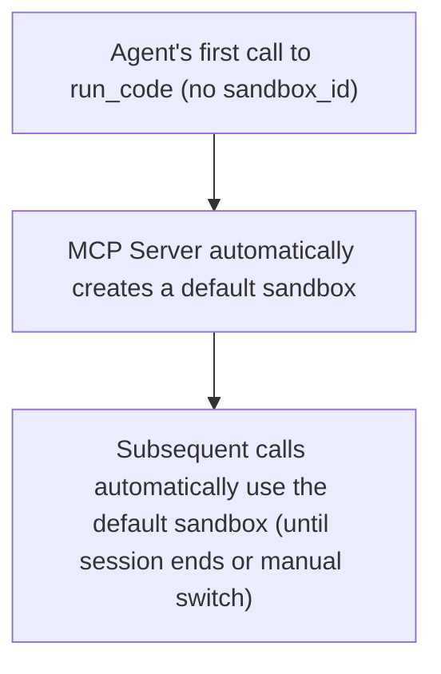
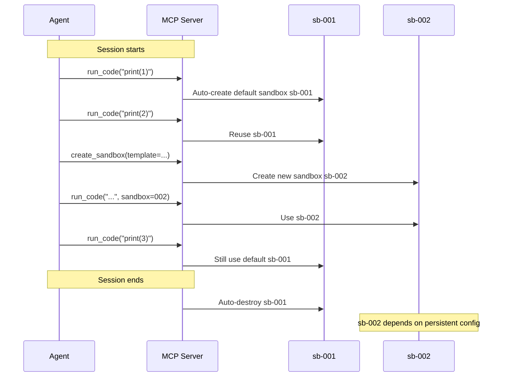
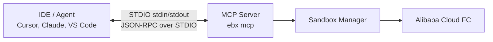
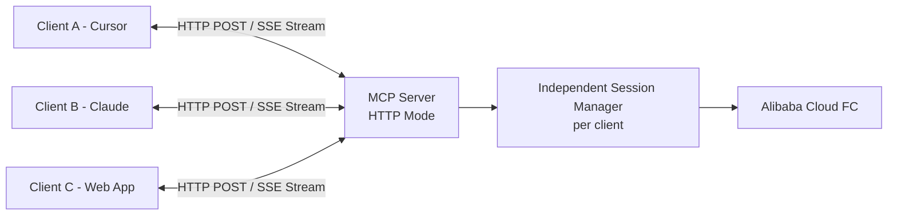
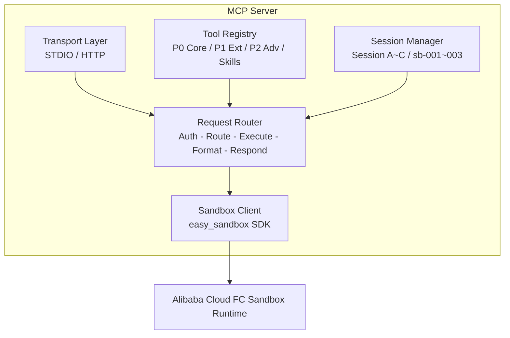

# MCP Server Design

> Easy Sandbox MCP Server exposes sandbox capabilities as MCP (Model Context Protocol) Tools, allowing AI Agents (Cursor, Claude Desktop, VS Code, etc.) to directly operate cloud sandboxes.

---

## 1. Tools Definition

### P0 — Core Tools (7)

#### create_sandbox

```json
{
  "name": "create_sandbox",
  "description": "Create a cloud sandbox environment. Supports natural language description for automatic configuration inference.",
  "inputSchema": {
    "type": "object",
    "properties": {
      "description": {
        "type": "string",
        "description": "Natural language description of the required environment (e.g., 'Run Python data analysis'), or a template name (e.g., 'code-interpreter')"
      },
      "template": {
        "type": "string",
        "description": "Sandbox template name. Can be omitted if description is provided as natural language"
      },
      "timeout": {
        "type": "integer",
        "description": "Sandbox timeout in seconds, default 300",
        "default": 300
      },
      "persistent": {
        "type": "boolean",
        "description": "🔮 Future plan — whether to create a persistent sandbox (pending underlying capability support)",
        "default": false
      }
    }
  },
  "returns": {
    "sandbox_id": "string — Sandbox ID",
    "url": "string — Sandbox access URL",
    "status": "string — Sandbox status"
  }
}
```

#### run_code

```json
{
  "name": "run_code",
  "description": "Execute code in the sandbox. Supports Python, JavaScript, Shell, and other languages.",
  "inputSchema": {
    "type": "object",
    "properties": {
      "code": {
        "type": "string",
        "description": "Code to execute"
      },
      "language": {
        "type": "string",
        "description": "Programming language",
        "enum": ["python", "javascript", "shell", "typescript", "r"],
        "default": "python"
      },
      "sandbox_id": {
        "type": "string",
        "description": "Sandbox ID. Uses the default sandbox if omitted"
      },
      "timeout": {
        "type": "integer",
        "description": "Execution timeout in seconds",
        "default": 30
      }
    },
    "required": ["code"]
  },
  "returns": {
    "stdout": "string",
    "stderr": "string",
    "exit_code": "integer",
    "output_files": "array — List of generated files"
  }
}
```

#### run_command

```json
{
  "name": "run_command",
  "description": "Execute a Shell command in the sandbox.",
  "inputSchema": {
    "type": "object",
    "properties": {
      "command": { "type": "string", "description": "Shell command" },
      "sandbox_id": { "type": "string", "description": "Sandbox ID" },
      "cwd": { "type": "string", "description": "Working directory", "default": "/app" },
      "timeout": { "type": "integer", "default": 60 }
    },
    "required": ["command"]
  },
  "returns": {
    "stdout": "string",
    "stderr": "string",
    "exit_code": "integer"
  }
}
```

#### read_file

```json
{
  "name": "read_file",
  "description": "Read file content from the sandbox.",
  "inputSchema": {
    "type": "object",
    "properties": {
      "path": { "type": "string", "description": "File path" },
      "sandbox_id": { "type": "string" },
      "encoding": { "type": "string", "default": "utf-8" }
    },
    "required": ["path"]
  },
  "returns": { "content": "string" }
}
```

#### write_file

```json
{
  "name": "write_file",
  "description": "Create or overwrite a file in the sandbox.",
  "inputSchema": {
    "type": "object",
    "properties": {
      "path": { "type": "string", "description": "File path" },
      "content": { "type": "string", "description": "File content" },
      "sandbox_id": { "type": "string" }
    },
    "required": ["path", "content"]
  },
  "returns": { "success": "boolean", "size": "integer" }
}
```

#### list_files

```json
{
  "name": "list_files",
  "description": "List files and subdirectories in a specified directory of the sandbox.",
  "inputSchema": {
    "type": "object",
    "properties": {
      "path": { "type": "string", "default": "/app" },
      "sandbox_id": { "type": "string" }
    }
  },
  "returns": {
    "files": "array — [{name, path, type, size, modified}]"
  }
}
```

#### kill_sandbox

```json
{
  "name": "kill_sandbox",
  "description": "Destroy the specified sandbox or the default sandbox.",
  "inputSchema": {
    "type": "object",
    "properties": {
      "sandbox_id": { "type": "string", "description": "Destroys the default sandbox if omitted" }
    }
  },
  "returns": { "success": "boolean" }
}
```

### P1 — Extension Tools (6)

| Tool Name | Description | Key Parameters |
|-----------|-------------|----------------|
| `upload_file` | Upload a local file to the sandbox | `local_path`, `remote_path` |
| `download_file` | Download a file from the sandbox | `remote_path`, `local_path` |
| `list_sandboxes` | List all active sandboxes | `status` (running) |
| `sandbox_info` | Get detailed sandbox information | `sandbox_id` |
| `get_url` | Get the public URL for a sandbox port | `port`, `sandbox_id` |
| `install_packages` | Install packages in the sandbox | `packages[]`, `manager` (pip/npm/apt) |

### P2 — Advanced Tools (3)

| Tool Name | Description | Key Parameters |
|-----------|-------------|----------------|
| `agent_code` | Invoke in-sandbox AI CLI for code tasks | `task`, `sandbox_id` |
| `agent_browse` | Invoke in-sandbox AI CLI for browser tasks | `task`, `sandbox_id` |
| `deploy_project` | Deploy a project to the sandbox | `project_dir`, `name` |

### 🔮 Future Planned Tools

| Tool Name | Description | Notes |
|-----------|-------------|-------|
| `snapshot_sandbox` | Create a sandbox snapshot | Pending underlying Snapshot capability support |
| `hibernate_sandbox` | Hibernate a sandbox | Pending underlying hibernation capability support |
| `wake_sandbox` | Wake a hibernated sandbox | Pending underlying hibernation capability support |

---

## 2. Session Binding Design

### Default Sandbox Concept

The MCP Server introduces a "default sandbox" concept to simplify Agent operations:



**Behavior Rules**:

1. When any tool requiring a sandbox is called for the first time without specifying `sandbox_id`, a default sandbox is automatically created
2. The default sandbox uses the `code-interpreter` template
3. The default sandbox is automatically destroyed at session end (STDIO mode) or on timeout (HTTP mode)
4. Agents can explicitly create new sandboxes via `create_sandbox` and switch using `sandbox_id`



---

## 3. Transport Methods

### STDIO — Local IDE Integration



**Use Case**: Local development, single user, IDE directly starts the process.

**Startup Method**: Specify the command in IDE configuration; the IDE automatically starts the process.

### HTTP + SSE — Remote Multi-Client



**Use Case**: Remote services, team sharing, multiple clients simultaneously.

**Startup Method**: `ebx mcp start --transport http --port 8765`

---

## 4. Server Architecture Diagram



---

## 5. Installation Methods

### One-Click Installation

```bash
# Install to Cursor
ebx mcp install --target cursor

# Install to Claude Desktop
ebx mcp install --target claude

# Install to VS Code (Copilot)
ebx mcp install --target vscode

# Install to Qoder
ebx mcp install --target qoder

# Install with specific Skills
ebx mcp install --target cursor --skills data-analysis,playwright

# Install in HTTP mode (remote server)
ebx mcp install --transport http --port 8765
```

### Installation Process

```bash
$ ebx mcp install --target cursor

✓ Detected Cursor config directory: ~/.cursor/
✓ Wrote MCP config: ~/.cursor/mcp.json
✓ Verified authentication: API Key configured
✓ Installation complete!

Please restart Cursor to apply. MCP Server will run automatically when Cursor starts.

Registered tools:
  • create_sandbox  — Create a cloud sandbox
  • run_code        — Execute code
  • run_command     — Execute commands
  • read_file       — Read files
  • write_file      — Write files
  • list_files      — List files
  • kill_sandbox    — Destroy sandbox
```

---

## 6. Configuration Examples

### Claude Desktop Configuration

```json
// ~/Library/Application Support/Claude/claude_desktop_config.json
{
  "mcpServers": {
    "easy-sandbox": {
      "command": "ebx",
      "args": ["mcp", "start", "--transport", "stdio"],
      "env": {
        "SANDBOX_API_KEY": "your-api-key",
        "SANDBOX_REGION": "cn-hangzhou"
      }
    }
  }
}
```

### Cursor Configuration

```json
// ~/.cursor/mcp.json
{
  "mcpServers": {
    "easy-sandbox": {
      "command": "ebx",
      "args": ["mcp", "start"],
      "env": {
        "SANDBOX_API_KEY": "your-api-key"
      }
    }
  }
}
```

### VS Code Configuration

```json
// .vscode/settings.json
{
  "mcp.servers": {
    "easy-sandbox": {
      "command": "ebx",
      "args": ["mcp", "start"],
      "env": {
        "SANDBOX_API_KEY": "your-api-key"
      }
    }
  }
}
```

### HTTP Mode Configuration (Remote Service)

```bash
# Start HTTP MCP Server
ebx mcp start --transport http --port 8765 --host 0.0.0.0

# Client connection
# SSE endpoint: http://server:8765/sse
# POST endpoint: http://server:8765/messages
```

```json
// Remote MCP configuration
{
  "mcpServers": {
    "easy-sandbox-remote": {
      "url": "http://your-server:8765/sse",
      "transport": "sse"
    }
  }
}
```
