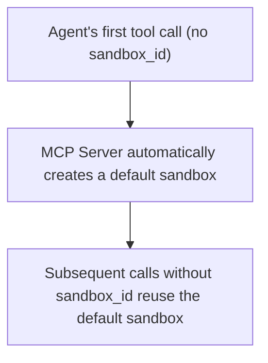
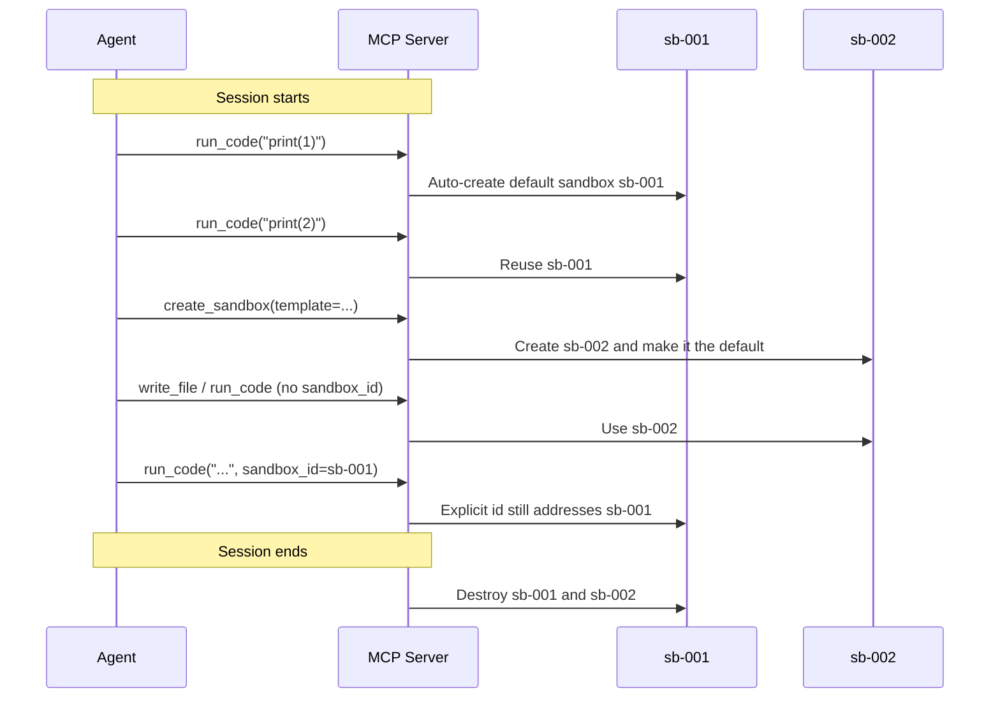
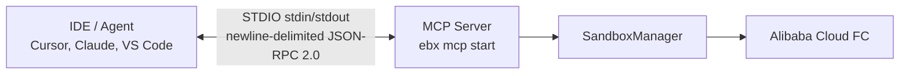
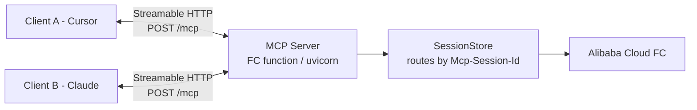
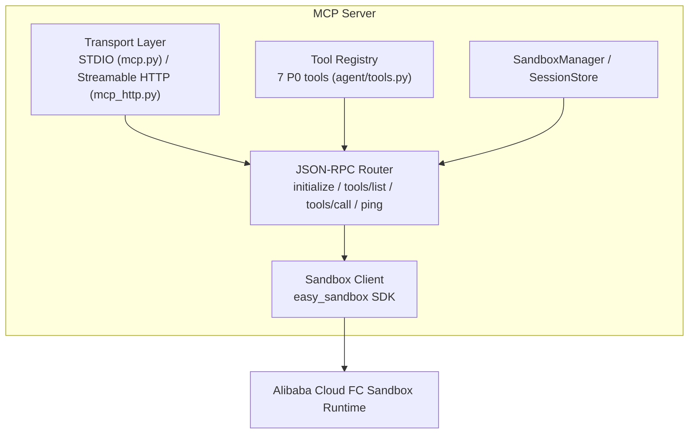
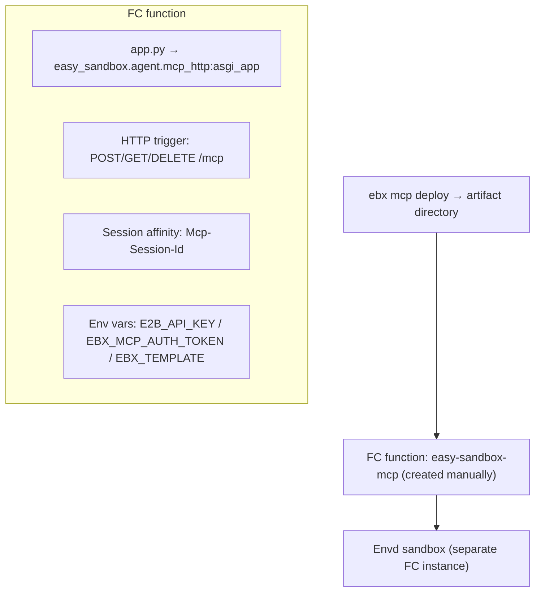

# MCP Server Design

> Easy Sandbox MCP Server exposes sandbox capabilities as MCP (Model Context Protocol) Tools, allowing AI Agents (Cursor, Claude Desktop, VS Code, etc.) to directly operate cloud sandboxes.

**Implemented surface** (kept in sync with `src/easy_sandbox/agent/`):

- 7 P0 tools (`agent/tools.py`)
- STDIO transport (`agent/mcp.py`) — `ebx mcp start`
- Streamable HTTP transport (`agent/mcp_http.py`) — Starlette ASGI app
- CLI: `ebx mcp install / start / status / deploy`

---

## 1. Tools Definition

All 7 tools are defined in `TOOL_SCHEMAS` (`agent/tools.py`). Omitting `sandbox_id` targets the default sandbox (see Section 2).

### create_sandbox

```json
{
  "name": "create_sandbox",
  "description": "Create a cloud sandbox and make it the session default. When template is omitted, use the MCP server's configured template (code-interpreter-v1 for ebx mcp start).",
  "inputSchema": {
    "type": "object",
    "properties": {
      "template": {
        "type": "string",
        "description": "Sandbox template name; omitted means the server template"
      },
      "timeout": {
        "type": "integer",
        "description": "Sandbox timeout in seconds, default 300",
        "default": 300
      },
      "envs": {
        "type": "object",
        "description": "Environment variable key-value pairs",
        "additionalProperties": { "type": "string" }
      }
    }
  },
  "returns": {
    "sandbox_id": "string — Sandbox ID",
    "status": "string — Sandbox status",
    "url": "string — Sandbox access URL"
  }
}
```

### run_code

```json
{
  "name": "run_code",
  "description": "Execute code in the sandbox (via the code interpreter). Supports Python, JavaScript, and more. Uses the default sandbox when sandbox_id is omitted.",
  "inputSchema": {
    "type": "object",
    "properties": {
      "code": { "type": "string", "description": "Code to execute" },
      "language": {
        "type": "string",
        "description": "Programming language, default python",
        "enum": ["python", "javascript", "shell", "typescript", "r"],
        "default": "python"
      },
      "sandbox_id": {
        "type": "string",
        "description": "Sandbox ID; uses the default sandbox when omitted"
      },
      "timeout": {
        "type": "integer",
        "description": "Execution timeout in seconds, default 30",
        "default": 30
      }
    },
    "required": ["code"]
  },
  "returns": {
    "stdout": "string",
    "stderr": "string",
    "exit_code": "integer",
    "output_files": "array — [{name, path, size}] generated files"
  }
}
```

### run_command

```json
{
  "name": "run_command",
  "description": "Execute a shell command in the sandbox. Uses the default sandbox when sandbox_id is omitted.",
  "inputSchema": {
    "type": "object",
    "properties": {
      "command": { "type": "string", "description": "Shell command" },
      "sandbox_id": { "type": "string", "description": "Sandbox ID" },
      "cwd": {
        "type": "string",
        "description": "Working directory; omitted uses the image workdir",
        "default": "/app"
      },
      "timeout": {
        "type": "integer",
        "description": "Execution timeout in seconds, default 60",
        "default": 60
      }
    },
    "required": ["command"]
  },
  "returns": {
    "stdout": "string",
    "stderr": "string",
    "exit_code": "integer"
  }
}
```

### read_file

```json
{
  "name": "read_file",
  "description": "Read file content from the sandbox. Uses the default sandbox when sandbox_id is omitted.",
  "inputSchema": {
    "type": "object",
    "properties": {
      "path": { "type": "string", "description": "Absolute file path" },
      "sandbox_id": { "type": "string", "description": "Sandbox ID" },
      "encoding": {
        "type": "string",
        "description": "File encoding, default utf-8",
        "default": "utf-8"
      }
    },
    "required": ["path"]
  },
  "returns": { "content": "string" }
}
```

### write_file

```json
{
  "name": "write_file",
  "description": "Create or overwrite a file in the sandbox. Uses the default sandbox when sandbox_id is omitted.",
  "inputSchema": {
    "type": "object",
    "properties": {
      "path": { "type": "string", "description": "Absolute file path" },
      "content": { "type": "string", "description": "File content" },
      "sandbox_id": { "type": "string", "description": "Sandbox ID" }
    },
    "required": ["path", "content"]
  },
  "returns": { "success": "boolean", "bytes_written": "integer" }
}
```

### list_files

```json
{
  "name": "list_files",
  "description": "List files and subdirectories in a sandbox directory. Uses the default sandbox when sandbox_id is omitted.",
  "inputSchema": {
    "type": "object",
    "properties": {
      "path": {
        "type": "string",
        "description": "Directory path, default /",
        "default": "/app"
      },
      "sandbox_id": { "type": "string", "description": "Sandbox ID" }
    }
  },
  "returns": {
    "files": "array — [{name, path, type, size}]"
  }
}
```

### kill_sandbox

```json
{
  "name": "kill_sandbox",
  "description": "Destroy the specified sandbox, or the default sandbox when sandbox_id is omitted.",
  "inputSchema": {
    "type": "object",
    "properties": {
      "sandbox_id": {
        "type": "string",
        "description": "Sandbox ID to destroy; destroys the default sandbox when omitted"
      }
    }
  },
  "returns": { "success": "boolean" }
}
```

---

## 2. Session Binding Design

### Default Sandbox Concept

The MCP Server introduces a "default sandbox" concept to simplify Agent operations:


```mermaid
graph TD
    A["Agent's first tool call (no sandbox_id)"] --> B[MCP Server automatically creates a default sandbox]
    B --> C["Subsequent calls without sandbox_id reuse the default sandbox"]
```

**Behavior rules** (implemented by `SandboxManager` in `agent/mcp.py`):

1. `create_sandbox` creates a sandbox and makes it the default. Later calls that omit `sandbox_id` use that sandbox. Earlier sandboxes stay alive until `kill_sandbox` or the session ends
2. When there is no default yet, the first tool call that omits `sandbox_id` lazily creates one. Concurrent lazy creates share a single sandbox
3. Default template: `code-interpreter-v1` when started via `ebx mcp start` (the CLI default); `base` when constructing `SandboxMCPServer` / the HTTP `SessionStore` programmatically without an explicit template. `create_sandbox` uses that server template when `template` is omitted
4. `kill_sandbox` without `sandbox_id` destroys the default sandbox, and returns an error when there is no default. Session end destroys every sandbox in the session — STDIO EOF / server shutdown, or HTTP `DELETE /mcp` / idle session TTL expiry
5. An explicit `sandbox_id` addresses that sandbox and does not change the default. Each use calls `Sandbox.set_timeout` with the timeout from create, extending the lifetime


```mermaid
sequenceDiagram
    participant Agent
    participant MCP as MCP Server
    participant SB1 as sb-001
    participant SB2 as sb-002

    Note over Agent,MCP: Session starts
    Agent->>MCP: run_code("print(1)")
    MCP->>SB1: Auto-create default sandbox sb-001
    Agent->>MCP: run_code("print(2)")
    MCP->>SB1: Reuse sb-001
    Agent->>MCP: create_sandbox(template=...)
    MCP->>SB2: Create sb-002 and make it the default
    Agent->>MCP: write_file / run_code (no sandbox_id)
    MCP->>SB2: Use sb-002
    Agent->>MCP: run_code("...", sandbox_id=sb-001)
    MCP->>SB1: Explicit id still addresses sb-001
    Note over Agent,MCP: Session ends
    MCP->>SB1: Destroy sb-001 and sb-002
```

---

## 3. Transport Methods

### STDIO — Local IDE Integration


```mermaid
graph LR
    IDE["IDE / Agent<br/>Cursor, Claude, VS Code"] <-->|"STDIO stdin/stdout<br/>newline-delimited JSON-RPC 2.0"| MCP["MCP Server<br/>ebx mcp start"]
    MCP --> SM[SandboxManager]
    SM --> FC[Alibaba Cloud FC]
```

- **Implementation**: `agent/mcp.py` — a self-contained minimal JSON-RPC 2.0 handler over newline-delimited STDIO; no external `mcp` SDK dependency required
- **Protocol version**: `2024-11-05` — the only version the STDIO server supports. `initialize` echoes it when requested and falls back to it for missing/unsupported requests, preserving the original behavior
- **Supported methods**: `initialize`, `notifications/initialized`, `tools/list`, `tools/call`, `ping`
- **Use case**: local development, single user; the IDE spawns the process
- **Startup**: `ebx mcp start [--template NAME] [--api-key KEY] [--api-url URL] [--domain DOMAIN]` (typically launched by the IDE). A manual run prints configuration on stderr and keeps stdout as JSON-RPC; `ebx mcp stop` ends the recorded pid. `--http --background` detaches Streamable HTTP

### Streamable HTTP — Remote Deployment


```mermaid
graph LR
    A["Client A - Cursor"] <-->|"Streamable HTTP<br/>POST /mcp"| MCP["MCP Server<br/>FC function / uvicorn"]
    B["Client B - Claude"] <-->|"Streamable HTTP<br/>POST /mcp"| MCP
    MCP --> SM["SessionStore<br/>routes by Mcp-Session-Id"]
    SM --> FC[Alibaba Cloud FC]
```

- **Implementation**: `agent/mcp_http.py` — Starlette ASGI application returned by `create_mcp_app()`; also exposed as the module-level `asgi_app` entry point
- **Protocol**: MCP Streamable HTTP (spec 2025-06-18)
- **Endpoints**:
  - `POST /mcp` — JSON-RPC requests; `initialize` creates a session and returns `Mcp-Session-Id`; subsequent requests must carry the header
  - `DELETE /mcp` — session termination and sandbox cleanup (requires `Mcp-Session-Id`)
  - `GET /mcp` — returns 405; SSE server-initiated notifications are not implemented
  - `GET /health` — health probe returning `{"status": "ok", "protocol": "2025-06-18"}`
- **Sessions**: in-process `SessionStore`; idle TTL 3600 s (default), max 100 concurrent sessions (default); capacity exhaustion returns 503 with JSON-RPC error `-32000`
- **Version negotiation**: `initialize` echoes the client-requested `protocolVersion` when supported; this transport supports `2025-06-18` only, matching `GET /health`. Missing or unsupported requested versions negotiate to `2025-06-18` — per the MCP spec the server responds with a version it supports, and clients that cannot accept it may disconnect. The STDIO transport independently keeps `2024-11-05`
- **Use case**: remote service, team sharing, multiple clients; deploy to Alibaba Cloud FC via the artifact from `ebx mcp deploy`, or run locally with uvicorn
- **Optional dependency**: Starlette + uvicorn (`pip install 'easy-sandbox[mcp]'`)

### Authentication

- **Client → MCP**: `Authorization: Bearer <token>`, validated with constant-time comparison; configured via `EBX_MCP_AUTH_TOKEN`. On loopback, leaving it unset disables authentication; a configured-but-empty token fails closed (every request gets 401). The FC artifact calls `require_auth_token` and refuses to start when the token is empty
- **MCP → Sandbox**: `E2B_API_KEY` (or `SANDBOX_API_KEY`) environment variable

### Environment Variables

| Variable | Purpose |
|----------|---------|
| `E2B_API_KEY` / `SANDBOX_API_KEY` | Sandbox backend API key |
| `E2B_API_URL` / `SANDBOX_API_BASE_URL` | Platform API URL override |
| `E2B_DOMAIN` | Sandbox domain override |
| `SANDBOX_TEMPLATE` / `EBX_TEMPLATE` | Default sandbox template |
| `EBX_MCP_AUTH_TOKEN` | Bearer token for client authentication (HTTP transport) |

---

## 4. Server Architecture


```mermaid
graph TD
    subgraph MCP["MCP Server"]
        TL["Transport Layer\nSTDIO (mcp.py) / Streamable HTTP (mcp_http.py)"]
        TR["Tool Registry\n7 P0 tools (agent/tools.py)"]
        SM["SandboxManager / SessionStore"]
        RR["JSON-RPC Router\ninitialize / tools/list / tools/call / ping"]
        SC["Sandbox Client\neasy_sandbox SDK"]
    end
    TL --> RR
    TR --> RR
    SM --> RR
    RR --> SC
    SC --> FC["Alibaba Cloud FC Sandbox Runtime"]
```

---

## 5. Installation and CLI

### One-Click Installation

```bash
# Install to Cursor
ebx mcp install --target cursor

# Install to Claude Desktop
ebx mcp install --target claude

# Install to VS Code (Copilot)
ebx mcp install --target vscode
```

`install` merges an `easy-sandbox` entry into the target IDE config: Cursor `~/.cursor/mcp.json`, Claude Desktop `claude_desktop_config.json` (`mcpServers`), and the VS Code workspace `.vscode/mcp.json` (`servers`, `type: stdio`). The command is the absolute `ebx` next to the current interpreter, or `python -m easy_sandbox.cli.main` when `ebx` cannot be found. Cursor and Claude receive `E2B_API_KEY` in `env` when a key is available. The VS Code workspace file does not. A config that is not strict JSON is left untouched.

### Installation Output

```bash
$ ebx mcp install --target cursor

MCP Server config written to /Users/you/.cursor/mcp.json

Registered tools:
  • create_sandbox     — Create a cloud sandbox
  • run_code           — Execute code
  • run_command        — Execute a command
  • read_file          — Read a file
  • write_file         — Write a file
  • list_files         — List files
  • kill_sandbox       — Destroy a sandbox

Please restart Cursor to apply changes.
```

### status

```bash
ebx mcp status            # table output
ebx --json mcp status     # JSON output
```

Reports the server name, transport (stdio), tool count and names, whether an API key is configured, and whether `easy-sandbox` is installed in each supported IDE.

---

## 6. Configuration Examples

### Claude Desktop

```json
// ~/Library/Application Support/Claude/claude_desktop_config.json
{
  "mcpServers": {
    "easy-sandbox": {
      "command": "ebx",
      "args": ["mcp", "start"],
      "env": {
        "E2B_API_KEY": "your-api-key"
      }
    }
  }
}
```

### Cursor

```json
// ~/.cursor/mcp.json
{
  "mcpServers": {
    "easy-sandbox": {
      "command": "ebx",
      "args": ["mcp", "start"],
      "env": {
        "E2B_API_KEY": "your-api-key"
      }
    }
  }
}
```

### VS Code

```json
// .vscode/mcp.json
{
  "servers": {
    "easy-sandbox": {
      "type": "stdio",
      "command": "/path/to/ebx",
      "args": ["mcp", "start"]
    }
  }
}
```

### Remote (Streamable HTTP)

After deploying the HTTP app (Section 7), point clients at the endpoint; add a Bearer header when a token is configured:

```json
{
  "mcpServers": {
    "easy-sandbox-remote": {
      "url": "https://<FC_HTTP_TRIGGER_URL>/mcp",
      "headers": {
        "Authorization": "Bearer <BEARER_TOKEN>"
      }
    }
  }
}
```

---

## 7. FC Deployment

> **Status:** `ebx mcp deploy` generates a deployment artifact; automatic FC API deployment is **not** implemented. Manual deployment steps are printed after generation.

### Architecture

The MCP Server can be deployed to Alibaba Cloud Function Compute (FC) as a Streamable HTTP endpoint, leveraging FC's MCP session affinity routing.


```mermaid
graph TB
    CLI["ebx mcp deploy → artifact directory"]
    FC["FC function: easy-sandbox-mcp (created manually)"]
    Sandbox["Envd sandbox (separate FC instance)"]

    CLI --> FC
    FC --> Sandbox

    subgraph FC_Function ["FC function"]
        ASGI["app.py → easy_sandbox.agent.mcp_http:asgi_app"]
        Trigger["HTTP trigger: POST/GET/DELETE /mcp"]
        Session["Session affinity: Mcp-Session-Id"]
        Env["Env vars: E2B_API_KEY / EBX_MCP_AUTH_TOKEN / EBX_TEMPLATE"]
    end
```

### CLI Command

```bash
ebx mcp deploy \
  --name easy-sandbox-mcp \
  --region cn-hangzhou \
  --template base \
  --memory 512 --timeout 600 \
  --generate-token \
  --api-key $E2B_API_KEY \
  --output-dir ./mcp-artifact
```

Options: `--name` (default `easy-sandbox-mcp`), `--region` (command `--region` > `SANDBOX_REGION` > `ebx config set region` > `cn-hangzhou`), `--template` (default `base`), `--memory` (default 512), `--timeout` (default 600), `--auth-token-file` / `--generate-token` / `EBX_MCP_AUTH_TOKEN` env for the Bearer token, `--enable-session-affinity/--no-session-affinity` (default enabled), `--api-key`, `--custom-domain`, `--output-dir`.

### Artifact Contents

| File | Content |
|------|---------|
| `requirements.txt` | `easy-sandbox[mcp]`, `uvicorn>=0.29` |
| `app.py` | ASGI entry point reading `EBX_MCP_AUTH_TOKEN`, `E2B_API_KEY`/`SANDBOX_API_KEY`, `E2B_API_URL`/`SANDBOX_API_BASE_URL`, `E2B_DOMAIN`, `SANDBOX_TEMPLATE`/`EBX_TEMPLATE` from the FC function environment |
| `config.yaml` | YAML deployment manifest (not an FC API payload): `function_name`, `region`, `runtime` (`python3.10`), `handler` (`app.app`), `memory`, `timeout`, `environment_variables`, `http_trigger` (methods POST/GET/DELETE + `enable_session_affinity`), optional `custom_domain` |

`ebx mcp deploy` also prints manual deployment steps (package the artifact, create the function via the FC console or SDK, create an HTTP trigger, enable `Mcp-Session-Id` affinity if supported) and an IDE config template with the Bearer token masked.

### Key Design Points

- **Protocol**: Streamable HTTP (MCP spec 2025-06-18); `initialize` negotiates `2025-06-18` consistently with `GET /health` (STDIO keeps `2024-11-05`)
- **Session affinity**: delegated to the FC platform layer via the `Mcp-Session-Id` header — no application-level sticky routing needed
- **Authentication**: dual-layer — client→MCP uses `Authorization: Bearer <token>`; MCP→sandbox uses `E2B_API_KEY` from the FC env
- **Lifecycle**: sandboxes are lazily created per MCP session; `DELETE /mcp` triggers cleanup; the idle-session TTL is the safety net
- **Cold start**: FC cold start (~1–3 s) may conflict with MCP initialize timeouts; provisioned instances are recommended for production
- **Secrets**: `config.yaml` contains the API key and Bearer token — never commit it to version control

See [CLI Design — mcp deploy](cli-design.md#mcp-deploy) for the full parameter reference and the [MCP Integration guide](../guide/mcp-integration.md) for end-to-end usage.
