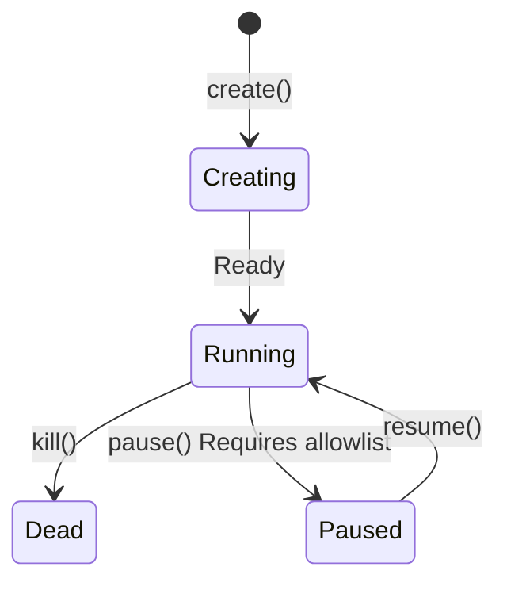

# Sandbox Type System Design

> Easy Sandbox provides three sandbox modes, covering all scenarios from one-off scripts to long-running services. Currently, **only the Ephemeral sandbox is fully supported**; Persistent and Hibernated sandboxes are future plans.

---

## 1. Three Sandbox Modes

### Ephemeral Sandbox

**Positioning**: Disposable, one-time execution environments — the most commonly used mode. **Currently the only fully supported sandbox type.**

```python
# Default is ephemeral sandbox
sb = await Sandbox.create(template="code-interpreter")
result = await sb.run_code("print('hello')")
await sb.kill()  # All data is lost after destruction

# Context Manager for automatic destruction
async with await Sandbox.create(template="code-interpreter") as sb:
    result = await sb.run_code("print('hello')")
    # Destroyed on exit
```

### Persistent Sandbox — 🔮 Future Plan

> **⚠️ Requires underlying capability support; currently a future plan.** Persistent sandboxes depend on the underlying platform's persistent storage capabilities and will be implemented once Alibaba Cloud FC supports them.

**Positioning**: Long-running development/service environments with state preserved across sessions.

```python
# Future API — pending underlying support
from easy_sandbox import Sandbox

sb = await Sandbox.create(
    template="python-base",
    persistent=True,
    name="my-dev-env",
)

# Install dependencies (state will be preserved)
await sb.commands.run("pip install flask sqlalchemy")

# Reconnect later
sb = await Sandbox.connect("my-dev-env")
result = await sb.commands.run("pip list")  # flask, sqlalchemy still present
```

### Hibernated Sandbox — 🔮 Future Plan

> **⚠️ Requires underlying capability support; currently a future plan.** Hibernated sandboxes depend on the underlying platform's Snapshot / CRIU capabilities and will be implemented once support is available.

**Positioning**: State is frozen and suspended; wakes up restored to the frozen moment, saving billing costs.

```python
# Future API — pending underlying support
from easy_sandbox import Sandbox

sb = await Sandbox.create(
    template="python-data-science",
    hibernate_after=300,
    on_exit="hibernate",
)

# Use the sandbox...
await sb.run_code("import pandas as pd; df = pd.read_csv('data.csv')")

await sb.hibernate()       # Stop billing
sb = await Sandbox.connect("sb-xxx")
await sb.wake_up()         # Restore to state at hibernation
```

---

## 2. Comparison Matrix

| Feature | Ephemeral | Persistent 🔮 | Hibernated 🔮 |
|---------|-----------|---------------|---------------|
| **Implementation Status** | **Currently Available** | Future Plan | Future Plan |
| **Lifecycle** | Destroyed when task ends | Runs continuously until manually destroyed | Can be woken at any time after freezing |
| **State Persistence** | None | Full persistence | Snapshot-based freezing |
| **Filesystem** | tmpfs (RAM disk) | Persistent storage | Snapshot on freeze |
| **Processes** | Stop when task completes | Run in background continuously | Freeze/restore |
| **Network** | Temporary port mapping | Fixed domain/ports | Restored on wake |
| **Startup Time** | Cold start ~2s | Already running ~0s | Wake ~3-5s |
| **Billing** | Pay per usage duration | Continuous billing | Low/free during hibernation |
| **Max Duration** | Default 5 minutes | Unlimited | Hibernation can last 30 days |
| **Typical Scenarios** | Code execution, data analysis | Dev environments, web services | Intermittently used projects |
| **Auto Cleanup** | Auto-destroyed on timeout | Manual management | Auto-cleaned after retention period |

---

## 3. Lifecycle State Machine



> **Note**: The `pause()` / `resume()` state transitions require allowlist permissions and are currently restricted features. Snapshot-related state transitions are future plans and are not reflected in the current state machine.

State transition rules:

| Transition | Condition | Status |
|-----------|-----------|--------|
| Creating → Running | Normal startup | Currently supported |
| Creating → Dead | Creation failed | Currently supported |
| Running → Dead | `kill()` or timeout | Currently supported |
| Running → Paused | `pause()`, requires allowlist | Restricted feature |
| Paused → Running | `resume()` | Restricted feature |
| Paused → Dead | `kill()` | Restricted feature |

---

## 4. API Examples by Mode

### Ephemeral Sandbox — Typical Workflow

```python
from easy_sandbox import Sandbox

# Scenario: AI Agent executes one-off code
async def execute_code(code: str) -> str:
    async with await Sandbox.create(template="code-interpreter") as sb:
        result = await sb.run_code(code)
        return result.text

# Scenario: Batch data processing
async def process_batch(items: list[str]) -> list[str]:
    results = []
    async with await Sandbox.create(template="python-data-science") as sb:
        for item in items:
            result = await sb.run_code(f"process('{item}')")
            results.append(result.text)
    return results
```

### Persistent Sandbox — Development Environment (🔮 Future Plan)

> **The following APIs will be implemented once underlying capabilities are available.**

```python
from easy_sandbox import Sandbox

# Create or connect to a persistent development environment
try:
    sb = await Sandbox.connect("my-dev-env")
except SandboxNotFoundError:
    sb = await Sandbox.create(
        template="full-stack",
        persistent=True,
        name="my-dev-env",
        cpu=4,
        memory=8192,
        env={"NODE_ENV": "development"},
    )

# Start a development server (background)
process = await sb.commands.start("npm run dev")

# Get access URL
url = await sb.network.get_url(3000)
print(f"Dev server: {url}")

# File watching
async for event in sb.files.watch("/app/src"):
    print(f"File changed: {event.path} ({event.type})")
```

### Hibernated Sandbox — Intermittent Projects (🔮 Future Plan)

> **The following APIs will be implemented once underlying capabilities are available.**

```python
from easy_sandbox import Sandbox

# Create a sandbox that supports hibernation
sb = await Sandbox.create(
    template="python-data-science",
    name="ml-project",
    hibernate_after=600,    # Auto-hibernate after 10 minutes of inactivity
    on_exit="hibernate",
)

# Train a model (time-consuming operation)
await sb.run_code("""
import joblib
from sklearn.ensemble import RandomForestClassifier
model = RandomForestClassifier(n_estimators=1000)
model.fit(X_train, y_train)
joblib.dump(model, '/app/model.pkl')
""")

# Leave, sandbox auto-hibernates (billing stops)
# ... days later ...

# Wake up, continue working
sb = await Sandbox.connect("ml-project")
await sb.wake_up()

# Model files and environment are still there
result = await sb.run_code("""
import joblib
model = joblib.load('/app/model.pkl')
print(f"Model loaded, features: {model.n_features_in_}")
""")
```

### Snapshot — Environment Cloning (🔮 Future Plan)

> **The following APIs will be implemented once underlying Snapshot capabilities are available.**

```python
# Create a snapshot on a trained environment
snapshot_id = await sb.snapshot("trained-model-v1")

# Create multiple new sandboxes from the snapshot (for parallel inference)
workers = []
for i in range(5):
    w = await Sandbox.create(
        from_snapshot=snapshot_id,
        name=f"inference-worker-{i}",
    )
    workers.append(w)

# Each worker has the complete model environment
```

---

## 5. Auto-Cleanup Policies

### Ephemeral Sandbox

| Trigger | Action | Default |
|---------|--------|---------|
| Reached `timeout` | Force destroy | 300s |
| Context Manager exit | Graceful destroy | — |
| Client disconnected | Wait → destroy | Wait 30s |
| All processes exited | Destroy | — |

### Persistent Sandbox (🔮 Future Plan)

| Trigger | Action | Default |
|---------|--------|---------|
| Manual `kill()` | Destroy | — |
| CLI `ebx kill` | Destroy | — |
| Account overdue | Freeze → destroy after 7 days | — |

### Global Cleanup Policy

```python
from easy_sandbox import Config

# Global auto-cleanup configuration
Config.set(
    auto_cleanup=True,
    ephemeral_timeout=300,       # Max ephemeral sandbox lifetime
    hibernate_idle=600,          # Idle wait time before hibernation
    hibernate_retention=2592000, # Hibernation retention period (30 days)
    orphan_cleanup=True,         # Clean up orphaned sandboxes
    orphan_grace_period=3600,    # Orphan sandbox grace period (1 hour)
)
```

---

## 6. Billing Model

### Billing Dimensions

```
Total Cost = Compute Cost + Storage Cost + Network Cost

Compute Cost = CPU unit price × CPU cores × runtime duration
             + Memory unit price × memory size × runtime duration
             + GPU unit price × GPU count × runtime duration

Storage Cost = Persistent storage unit price × storage size × retention duration (🔮 Future)

Network Cost = Public outbound traffic × traffic unit price
```

### Billing Characteristics by Mode

| Mode | Compute Cost | Storage Cost | Notes |
|------|-------------|--------------|-------|
| Ephemeral | Runtime duration × resources | None | Most economical, pay-as-you-go |
| Persistent | Continuous billing | Continuous billing | Suitable for long-term development (🔮 Future Plan) |
| Hibernated | Billed only during runtime | Snapshot storage fee | Normal rate during runtime, storage fee only during hibernation (🔮 Future Plan) |

### Cost Estimation Examples

```
Ephemeral sandbox (1C/2G, running 5 minutes):
  CPU:  ¥0.00015/core/sec × 1 × 300 = ¥0.045
  Memory: ¥0.00003/GB/sec × 2 × 300 = ¥0.018
  Total: ¥0.063

Persistent sandbox (2C/4G, running 24 hours) 🔮:
  CPU:  ¥0.00015 × 2 × 86400 = ¥25.92
  Memory: ¥0.00003 × 4 × 86400 = ¥10.37
  Storage: ¥0.0003/GB/hour × 10 × 24 = ¥0.072
  Total: ¥36.36

Hibernated sandbox (2C/4G, running 2 hours + hibernated 22 hours) 🔮:
  Running: (¥0.00015 × 2 + ¥0.00003 × 4) × 7200 = ¥3.02
  Hibernated: ¥0.0003 × 10 × 22 = ¥0.066
  Total: ¥3.09 (91% savings compared to persistent mode)
```

### Cost Optimization Tips

1. **One-off tasks**: Use ephemeral sandboxes with a reasonable timeout
2. **Intermittent development**: Use hibernated sandboxes with `hibernate_after=300` (🔮 Future Plan)
3. **Batch processing**: Use SandboxPool with shared warm sandboxes
4. **Long-running services**: Use persistent sandboxes + auto-scaling (🔮 Future Plan)
