# SDK API Design — Three Usage Paradigms

> Easy Sandbox SDK provides three usage paradigms, covering all scenarios from simple scripts to complex AI applications. Users can choose the most suitable paradigm based on their needs, and the three paradigms can be mixed.

---

## Table of Contents

0. [Core Design Philosophy: Natural Language First](#core-design-philosophy-natural-language-first)
1. [Paradigm 1: E2B-Compatible Mode](#paradigm-1-e2b-compatible-mode)
2. [Paradigm 2: Decorator Mode](#paradigm-2-decorator-mode-modal-style)
3. [Paradigm 3: Built-in Agent Mode](#paradigm-3-built-in-agent-mode)
4. [Configuration System](#configuration-system)
5. [Sandbox Core API](#sandbox-core-api)
6. [Image Chainable Builder](#image-chainable-builder)
7. [SandboxPool](#sandboxpool)
8. [FC Extensions](#fc-extensions)
9. [Error Handling System](#error-handling-system)

---

## Core Design Philosophy: Natural Language First

> **Users don't need to know template names, resource specs, or configuration parameters — just describe what you want to do, and the SDK handles everything automatically.** This is true AI-First.

The first parameter of `Sandbox.create()` can be either a traditional `template` keyword argument or a **natural language description**. The SDK internally uses a "configuration inference Agent" to automatically parse intent and select the optimal template and resource configuration.

### Natural Language Sandbox Creation

```python
from easy_sandbox import Sandbox

# Natural language description → SDK auto-infers template + resource config
sb = await Sandbox.create("Run a python data analysis environment, need GPU")
# Inferred: template=python-data-science, gpu=auto, memory=8192

sb = await Sandbox.create("Start a Node.js Web service, expose port 3000")
# Inferred: template=node-web, expose=[3000]

sb = await Sandbox.create("Use playwright to scrape web pages and take screenshots")
# Inferred: template=browser-automation, memory=4096

sb = await Sandbox.create("Run python, run codex")
# Inferred: template=code-interpreter, cpu=2
```

### Inference Transparency

```python
# Preview inference result (without actually creating)
plan = await Sandbox.plan("Need an environment that can run TensorFlow, 50GB dataset")
print(plan)
# SandboxPlan(
#   template='ml-gpu',
#   cpu=4, memory=16384, disk=65536,
#   gpu='A10',
#   mounts=[NASMount(size='100G')],
#   confidence=0.92,
#   reasoning='Detected TensorFlow + large dataset needs, selected GPU template with expanded disk'
# )

# User can accept or override
sb = await Sandbox.create(plan)                     # Use inference result directly
sb = await Sandbox.create(plan, memory=32768)        # Override some parameters
```

### Natural Language + File Context

```python
# Include local files, SDK auto-infers environment requirements
sb = await Sandbox.create(
    "Analyze this CSV file and generate visualization charts",
    upload=["./data.csv"],                           # Auto-upload to sandbox
)
result = await sb.agent.analyze("Do trend analysis", data="/app/data.csv")

# Infer from project directory
sb = await Sandbox.create(
    "Deploy and run this project",
    project_dir="./my-flask-app",                    # Auto-detect requirements.txt → python
)
```

### Backward Compatibility

Natural language creation is **fully compatible** with the traditional template parameter. `create()` intelligently determines the first argument:
- If it matches a known template name (e.g., `"base"`, `"code-interpreter"`) → create by template
- If it's a natural language description → invoke the configuration inference Agent

```python
# Traditional mode — 100% E2B compatible
sb = await Sandbox.create(template="code-interpreter")

# Natural language mode — new capability
sb = await Sandbox.create("Run Python data analysis")

# Both can be mixed
sb = await Sandbox.create("Need GPU environment", template="ml-gpu", memory=32768)
```

---

## Paradigm 1: E2B-Compatible Mode

Fully compatible with E2B SDK API signatures — existing E2B users can migrate with **zero modifications**.

### Basic Usage

```python
from easy_sandbox import Sandbox

# Create sandbox (async mode)
sb = await Sandbox.create(template="code-interpreter")

# Execute code
result = await sb.run_code("print('Hello, AliCloud!')")
print(result.text)  # Hello, AliCloud!

# Execute command
result = await sb.commands.run("ls -la /app")
print(result.stdout)

# File operations
await sb.files.write("/app/data.csv", "name,age\nAlice,30\nBob,25")
content = await sb.files.read("/app/data.csv")
files = await sb.files.list("/app")

# Destroy sandbox
await sb.kill()
```

### Synchronous Mode

```python
from easy_sandbox import Sandbox

# Synchronous API (internally manages event loop automatically)
sb = Sandbox.create_sync(template="code-interpreter")
result = sb.run_code_sync("print(1+1)")
sb.kill_sync()
```

### Context Manager

```python
from easy_sandbox import Sandbox

async with await Sandbox.create(template="code-interpreter") as sb:
    result = await sb.run_code("import sys; print(sys.version)")
    # Sandbox is automatically destroyed on exit
```

### Streaming Output

```python
sb = await Sandbox.create(template="code-interpreter")

# Stream command output
async for chunk in sb.commands.stream("pip install pandas && python train.py"):
    if chunk.type == "stdout":
        print(chunk.data, end="")
    elif chunk.type == "stderr":
        print(f"[ERR] {chunk.data}", end="")
    elif chunk.type == "exit":
        print(f"\nExit code: {chunk.exit_code}")
```

---

## Paradigm 2: Decorator Mode (Modal Style)

Inspired by Modal's declarative experience, using decorators to transparently execute local functions in remote sandboxes.

### Basic Usage

```python
from easy_sandbox import sandbox, Image

@sandbox(template="python-data-science", cpu=2, memory=4096)
def analyze(data: str) -> str:
    import pandas as pd
    import io
    
    df = pd.read_csv(io.StringIO(data))
    summary = df.describe().to_string()
    return f"Data analysis results:\n{summary}"

# On invocation: create sandbox → serialize params → remote execute → return result → destroy
result = analyze("name,score\nAlice,95\nBob,87\nCarol,92")
print(result)
```

### Custom Image

```python
from easy_sandbox import sandbox, Image

custom_image = (
    Image.from_template("python-data-science")
    .pip_install("scikit-learn", "xgboost", "lightgbm")
    .apt_install("libgomp1")
    .copy_local("./models/", "/app/models/")
    .env(MODEL_PATH="/app/models/latest.pkl")
)

@sandbox(image=custom_image, cpu=4, memory=8192, timeout=300)
def train_model(dataset_path: str) -> dict:
    import joblib
    from sklearn.ensemble import RandomForestClassifier
    
    model = RandomForestClassifier(n_estimators=100)
    # ... training logic
    return {"accuracy": 0.95, "model_path": "/app/output/model.pkl"}
```

### Async Decorator

```python
from easy_sandbox import sandbox

@sandbox(template="node-web", async_mode=True)
async def run_lighthouse(url: str) -> dict:
    import subprocess, json
    result = subprocess.run(
        ["npx", "lighthouse", url, "--output=json", "--quiet"],
        capture_output=True, text=True
    )
    return json.loads(result.stdout)

# Execute multiple tasks concurrently
import asyncio
results = await asyncio.gather(
    run_lighthouse("https://example.com"),
    run_lighthouse("https://test.com"),
)
```

### Stateful Decorator (Persistent Sandbox)

```python
from easy_sandbox import sandbox

@sandbox(template="python-base", persistent=True, sandbox_id="my-dev-env")
def install_deps():
    import subprocess
    subprocess.run(["pip", "install", "flask", "sqlalchemy"], check=True)
    return "Dependencies installed"

@sandbox(template="python-base", persistent=True, sandbox_id="my-dev-env")
def run_app():
    # Reuses the sandbox above; installed dependencies are still present
    from flask import Flask
    app = Flask(__name__)
    return "App started"
```

---

## Paradigm 3: Built-in Agent Mode

A brand-new design — the SDK includes pre-configured AI Agents for completing complex tasks in a single line of code.

### Browser Agent

```python
from easy_sandbox import Sandbox

sb = await Sandbox.create(template="browser-automation")

# Automate web page operations
result = await sb.agent.browse("Visit https://example.com and take a screenshot of the homepage")
print(result.screenshot)  # base64 screenshot
print(result.summary)     # Page summary

# Complex interaction
result = await sb.agent.browse(
    "Log into GitHub, search for 'easy-sandbox', get the star count of the first repo"
)
print(result.data)  # {"repo": "...", "stars": 1234}
```

### Code Analysis Agent

```python
sb = await Sandbox.create(template="code-interpreter")

source_code = open("my_app.py").read()
result = await sb.agent.code("Analyze the complexity of this code and suggest optimizations", code=source_code)
print(result.analysis)
print(result.suggestions)
```

### Data Analysis Agent

```python
sb = await Sandbox.create(template="python-data-science")

csv_content = open("sales_data.csv").read()
result = await sb.agent.analyze("Do trend analysis on this CSV and generate visualization charts", data=csv_content)
print(result.report)       # Markdown format analysis report
print(result.charts)       # Generated chart list (base64)
print(result.insights)     # Key insights
```

### Shell Automation Agent

```python
sb = await Sandbox.create(template="base")

result = await sb.agent.shell("Install nginx and configure reverse proxy to port 8080")
print(result.commands)     # List of executed commands
print(result.status)       # Final status
```

### Debug Agent

```python
sb = await Sandbox.create(template="code-interpreter")

error_info = """
Traceback (most recent call last):
  File "app.py", line 42, in process
    result = data['key'] / total
ZeroDivisionError: division by zero
"""
result = await sb.agent.debug("Diagnose this error and provide a fix", error=error_info)
print(result.diagnosis)    # Error diagnosis
print(result.fix)          # Fix code
print(result.explanation)  # Explanation
```

### Custom Agent

```python
from easy_sandbox import Agent, Sandbox

# Create a custom Agent
my_agent = Agent(
    name="code-reviewer",
    model="qwen-max",                    # Supports openai / anthropic / qwen
    system_prompt="You are a strict code review expert, focusing on security, performance, and maintainability.",
    tools=["run_code", "read_file", "write_file", "run_command"],
    sandbox=Sandbox.Config(
        template="python-base",
        cpu=2,
        memory=4096,
    ),
)

# Execute task
result = await my_agent.run("Review the code quality of this PR", context={
    "files": ["src/auth.py", "src/api.py"],
    "diff": git_diff_content,
})
print(result.review)       # Review report
print(result.score)        # Quality score
print(result.issues)       # List of issues found
```

---

## Configuration System

### Zero Config Design

The SDK adopts a zero-config philosophy, loading configuration by priority:

```
Code parameters > Environment variables > .env file > ~/.ebx/config.toml > Defaults
```

### Environment Variables

```bash
# Primary authentication (required)
export E2B_API_KEY=your-api-key

# Extended authentication (optional)
export ALICLOUD_ACCESS_KEY_ID=your-ak
export ALICLOUD_ACCESS_KEY_SECRET=your-sk

# Optional configuration
export SANDBOX_REGION=cn-hangzhou                # Default region
export SANDBOX_TIMEOUT=300                       # Default timeout (seconds)
export SANDBOX_LOG_LEVEL=INFO                    # Log level
```

### Configuration File

```toml
# ~/.ebx/config.toml

[default]
region = "cn-hangzhou"
timeout = 300

[default.auth]
access_key_id = "your-ak"
access_key_secret = "your-sk"

[profiles.production]
region = "cn-shanghai"
timeout = 600

[profiles.production.auth]
access_key_id = "prod-ak"
access_key_secret = "prod-sk"
```

### Code Configuration

```python
from easy_sandbox import Sandbox, Config

# Global configuration
Config.set(
    region="cn-hangzhou",
    timeout=300,
    log_level="DEBUG",
)

# Instance-level configuration (overrides global)
sb = await Sandbox.create(
    template="code-interpreter",
    region="cn-shanghai",
    timeout=600,
)
```

---

## Sandbox Core API

### Sandbox Class Complete Interface

```python
class Sandbox:
    """Sandbox core class — unified entry point for all operations"""

    # ── Lifecycle ──────────────────────────────────────
    
    @classmethod
    async def create(
        cls,
        description: str | None = None,      # Natural language description (AI-First)
        *,
        template: str = "base",
        timeout: int = 300,
        metadata: dict | None = None,
        env: dict[str, str] | None = None,
        cpu: int | None = None,
        memory: int | None = None,            # MB, None lets the inference Agent decide
        disk: int | None = None,              # MB
        gpu: str | None = None,               # GPU model or "auto"
        persistent: bool = False,
        hibernate_after: int | None = None,   # seconds
        region: str | None = None,
        vpc: VPCConfig | None = None,
        on_exit: Literal["destroy", "hibernate", "keep"] = "destroy",
        upload: list[str] | None = None,      # Auto-upload local files
        project_dir: str | None = None,       # Auto-deploy project directory
    ) -> "Sandbox":
        """
        Create a sandbox.

        The first parameter description supports two modes:
        - Pass a known template name (e.g., 'code-interpreter') → create by template
        - Pass a natural language description → invoke the configuration inference Agent

        When description is natural language, explicitly passed template/cpu/memory
        parameters will override inference results (user intent takes priority).
        """
        ...

    @classmethod
    async def plan(
        cls,
        description: str,
        **kwargs,
    ) -> "SandboxPlan":
        """Preview natural language inference results without actually creating a sandbox."""
        ...

    @classmethod
    async def connect(cls, sandbox_id: str) -> "Sandbox": ...

    async def kill(self) -> None: ...
    async def hibernate(self) -> None: ...
    async def wake_up(self) -> "Sandbox": ...
    async def snapshot(self, name: str) -> str: ...
    async def keep_alive(self, duration: int) -> None: ...

    # ── Properties ──────────────────────────────────────────
    
    @property
    def id(self) -> str: ...
    @property
    def status(self) -> SandboxStatus: ...
    @property
    def url(self) -> str: ...
    @property
    def metadata(self) -> dict: ...

    # ── Code Execution ──────────────────────────────────────
    
    async def run_code(
        self,
        code: str,
        *,
        language: str = "python",
        timeout: int = 30,
        env: dict[str, str] | None = None,
    ) -> CodeResult: ...

    # ── Command Capabilities and Named Commands ────────────────────

    @property
    def capabilities(self) -> frozenset[str]:
        """Effective standard capability set of this sandbox (frozenset[str]). Standard capability vocabulary:
        shell / files / code / terminal / ports (extensible).
        Determined by the template's `capabilities` declaration; inherits
        DEFAULT_CAPABILITIES = {shell, files, code} when omitted.
        """
        ...

    def list_commands(self) -> list[dict[str, Any]]:
        """Template-declared custom commands, returns a list of dicts (not objects).
        Each dict is shaped like:
            {"name": str,
             "description": str,
             "args": [{"name": str, "required": bool,
                       "default": str | None, "description": str}]}
        """
        ...

    async def run(self, name: str, **args: str) -> ProcessResult:
        """Explicit dynamic dispatch of template-declared named commands (no __getattr__ magic).
        Argument values are escaped with shlex.quote() before filling {placeholders};
        raises error if name is undeclared or required parameters are missing.
        """
        ...

    # ── Submodules ────────────────────────────────────────
    
    @property
    def commands(self) -> CommandsModule: ...
    @property
    def files(self) -> FilesModule: ...
    @property
    def agent(self) -> AgentModule: ...
    @property
    def network(self) -> NetworkModule: ...
```

### CommandsModule

```python
class CommandsModule:
    """Command execution module"""

    async def run(
        self,
        cmd: str,
        *,
        timeout: int = 60,
        env: dict[str, str] | None = None,
        cwd: str = "/app",
        user: str = "user",
    ) -> ProcessResult: ...

    async def stream(
        self,
        cmd: str,
        **kwargs,
    ) -> AsyncIterator[ProcessChunk]: ...

    async def start(
        self,
        cmd: str,
        **kwargs,
    ) -> Process: ...
```

### FilesModule

```python
class FilesModule:
    """File operations module"""

    async def read(self, path: str, *, encoding: str = "utf-8") -> str: ...
    async def read_bytes(self, path: str) -> bytes: ...
    async def write(self, path: str, content: str | bytes, **kwargs) -> None: ...
    async def list(self, path: str = "/") -> list[FileInfo]: ...
    async def remove(self, path: str) -> None: ...
    async def exists(self, path: str) -> bool: ...
    async def upload(self, local_path: str, remote_path: str) -> None: ...
    async def download(self, remote_path: str, local_path: str) -> None: ...
    async def watch(self, path: str) -> AsyncIterator[WatchEvent]: ...
```

### NetworkModule

```python
class NetworkModule:
    """Network management module"""

    async def get_url(self, port: int) -> str: ...
    async def expose(self, port: int, *, public: bool = False) -> str: ...
    async def forward(self, remote_port: int, local_port: int) -> None: ...
    async def list_ports(self) -> list[PortInfo]: ...
```

### Command Capability Model and Named Commands

The SDK adopts a **capability-driven + type-safe dynamic** command surface:

- **Standard capabilities retain typed methods** (`sandbox.commands.run` / `sandbox.files.upload`, etc.), gated by capabilities; calling a standard capability not in the effective capability set throws `CapabilityNotSupportedError` (E3004).
- **Custom commands use explicit dynamic dispatch** `sandbox.run("name", **args)` — no `__getattr__` magic attributes, maintaining mypy + `py.typed` type safety.
- **Discovery API**: `sandbox.capabilities` to view the effective capability set, `sandbox.list_commands()` to list template-declared custom commands.

```python
sb = await Sandbox.create(template="python-base")

# Discovery: effective capability set and available named commands
print(sb.capabilities)          # frozenset({'shell', 'files', 'code'})
for c in sb.list_commands():          # c is a dict, not an object
    print(c["name"], c["description"], c["args"])
    # c["args"] is a list of {name, required, default, description} dicts

# Standard capabilities: typed, gated
result = await sb.commands.run("ls -la /app")   # Requires 'shell' capability
await sb.files.upload("./data.csv", "/app/data.csv")  # Requires 'files' capability

# Custom commands: explicit dynamic dispatch (args escaped with shlex.quote())
result = await sb.run("serve", port="9000")

# Calling a capability the sandbox doesn't have → explicit error, no silent degradation
from easy_sandbox.errors import CapabilityNotSupportedError
try:
    await sb.commands.run("tmux new-session")   # Requires 'terminal', not declared
except CapabilityNotSupportedError as e:
    print(f"[{e.code}] {e.message}")
    print(f"Fix suggestion: {e.suggestion}")   # Suggests declaring the capability in template.yaml
```

> For the capability vocabulary, default baseline `DEFAULT_CAPABILITIES = {shell, files, code}`, and gating semantics, see ADR
> `2026-09-03-capability-model.md`, `2026-09-03-sdk-capability-surface.md`, and `2026-09-03-custom-commands-schema.md`.

---

## Image Chainable Builder

```python
from easy_sandbox import Image

# Chainable custom image building
image = (
    Image.from_template("python-base")                  # Based on official template
    .python_version("3.11")                             # Python version
    .pip_install("pandas", "numpy", "matplotlib")       # pip dependencies
    .pip_install_from_requirements("./requirements.txt") # Install from file
    .apt_install("ffmpeg", "libsm6")                    # System packages
    .copy_local("./src/", "/app/src/")                  # Copy local files
    .copy_local("./models/", "/app/models/")
    .run_command("chmod +x /app/src/entrypoint.sh")     # Execute command
    .env(
        MODEL_PATH="/app/models/latest.pkl",
        DATA_DIR="/app/data",
    )                                                    # Environment variables
    .workdir("/app")                                     # Working directory
    .expose(8080)                                        # Expose port
    .entrypoint("python /app/src/main.py")              # Entry command
)

# Create sandbox with the image
sb = await Sandbox.create(image=image)

# Build and push as template
template_id = await image.build_and_push(name="my-ml-env", tag="v1.0")
```

### Image from Dockerfile

```python
image = Image.from_dockerfile("./Dockerfile")
image = Image.from_dockerfile_string("""
FROM python:3.11-slim
RUN pip install flask
COPY . /app
WORKDIR /app
CMD ["python", "app.py"]
""")
```

---

## SandboxPool

```python
from easy_sandbox import SandboxPool

# Create sandbox pool
pool = SandboxPool(
    template="code-interpreter",
    min_ready=3,           # Minimum warm count
    max_size=20,           # Maximum sandbox count
    idle_timeout=300,      # Idle timeout (seconds)
    scale_policy="auto",   # Auto-scaling
)

await pool.start()

# Acquire sandbox from pool (millisecond-level)
async with pool.acquire() as sb:
    result = await sb.run_code("print('instant!')")
    # After return, sandbox is reset and returned to pool

# Batch execution
tasks = ["print(i)" for i in range(100)]
results = await pool.map(lambda sb, code: sb.run_code(code), tasks)

# Pool status
status = pool.status()
print(f"Ready: {status.ready}, In use: {status.in_use}, Total: {status.total}")

await pool.shutdown()
```

---

## FC Extensions

### VPC Network Configuration

```python
from easy_sandbox import Sandbox
from easy_sandbox.extensions import VPCConfig

sb = await Sandbox.create(
    template="base",
    vpc=VPCConfig(
        vpc_id="vpc-xxx",
        vswitch_ids=["vsw-xxx"],
        security_group_id="sg-xxx",
    ),
)

# Sandbox can directly access VPC internal resources
result = await sb.commands.run("curl http://10.0.1.100:3306")
```

### OSS Mounting

```python
from easy_sandbox.extensions import OSSMount

sb = await Sandbox.create(
    template="python-data-science",
    mounts=[
        OSSMount(
            bucket="my-data-bucket",
            remote_path="datasets/",
            mount_point="/data",
            read_only=True,
        ),
        OSSMount(
            bucket="my-output-bucket",
            remote_path="results/",
            mount_point="/output",
            read_only=False,
        ),
    ],
)

# Read/write OSS directly from sandbox
result = await sb.run_code("""
import pandas as pd
df = pd.read_csv('/data/train.csv')   # Read from OSS
df.to_csv('/output/result.csv')        # Write to OSS
""")
```

### Custom Domain

```python
from easy_sandbox.extensions import DomainConfig

sb = await Sandbox.create(
    template="node-web",
    domain=DomainConfig(
        domain="sandbox.example.com",
        port=3000,
        tls=True,                        # Auto TLS certificate
        cors=["https://myapp.com"],
    ),
)
print(sb.network.public_url)  # https://sandbox.example.com
```

---

## Error Handling System

### Exception Class Hierarchy

```mermaid
classDiagram
    class SandboxError {
        <<base class>>
    }
    class AuthenticationError {
        Authentication failed
    }
    class InvalidCredentialsError {
        E1003 AK/SK invalid
    }
    class TokenExpiredError {
        E1002 Token expired
    }
    class SandboxCreationError {
        Creation failed
    }
    class TemplateNotFoundError {
        E2001 Template not found
    }
    class QuotaExceededError {
        E2002 Quota exceeded
    }
    class RegionUnavailableError {
        E2003 Region unavailable
    }
    class ExecutionError {
        Execution failed
    }
    class TimeoutError {
        E3001 Execution timeout
    }
    class ProcessError {
        E3002 Process abnormal exit
    }
    class CodeExecutionError {
        E3003 Code execution error
    }
    class CapabilityNotSupportedError {
        E3004 Capability not supported
    }
    class FileOperationError {
        File operation failed
    }
    class FileNotFoundError {
        E4001 File not found
    }
    class PermissionDeniedError {
        Permission denied
    }
    class NetworkError {
        Network error
    }
    class ConnectionError {
        E5001 Connection failed
    }
    class PortConflictError {
        Port conflict
    }
    class AgentError {
        Agent error
    }
    class LLMProviderError {
        LLM call failed
    }
    class ToolExecutionError {
        Tool execution failed
    }

    SandboxError <|-- AuthenticationError
    SandboxError <|-- SandboxCreationError
    SandboxError <|-- ExecutionError
    SandboxError <|-- FileOperationError
    SandboxError <|-- NetworkError
    SandboxError <|-- AgentError
    AuthenticationError <|-- InvalidCredentialsError
    AuthenticationError <|-- TokenExpiredError
    SandboxCreationError <|-- TemplateNotFoundError
    SandboxCreationError <|-- QuotaExceededError
    SandboxCreationError <|-- RegionUnavailableError
    ExecutionError <|-- TimeoutError
    ExecutionError <|-- ProcessError
    ExecutionError <|-- CodeExecutionError
    ExecutionError <|-- CapabilityNotSupportedError
    FileOperationError <|-- FileNotFoundError
    FileOperationError <|-- PermissionDeniedError
    NetworkError <|-- ConnectionError
    NetworkError <|-- PortConflictError
    AgentError <|-- LLMProviderError
    AgentError <|-- ToolExecutionError
```



### Error Code System

| Error Code | Category | Meaning | Fix Suggestion |
|-----------|----------|---------|----------------|
| `E1001` | Auth | API Key invalid | Check the E2B_API_KEY environment variable |
| `E1002` | Auth | Token expired | SDK will auto-refresh; if persistent, check clock sync |
| `E1003` | Auth | AK/SK invalid | Check the ALICLOUD_ACCESS_KEY_ID environment variable |
| `E2001` | Creation | Template not found | Run `ebx template list` to see available templates |
| `E2002` | Creation | Quota exceeded | Contact admin to increase quota or destroy idle sandboxes |
| `E2003` | Creation | Region unavailable | Switch to an available region: cn-hangzhou, cn-shanghai |
| `E3001` | Execution | Command timeout | Increase timeout parameter or optimize command |
| `E3002` | Execution | Process abnormal exit | Check stderr output for detailed error info |
| `E3003` | Execution | Code execution failed (CodeExecutionError) | Check code syntax and runtime dependencies in sandbox template |
| `E3004` | Execution | Capability not supported (CapabilityNotSupportedError) | Sandbox does not declare this standard capability; declare it in template.yaml's `capabilities` |
| `E4001` | File | File not found | Verify the path is correct, use `files.list()` to check |
| `E5001` | Network | Connection failed | Check network connectivity and firewall rules |
| `E6001` | Session | Session not found | Run `ebx session list` to see available sessions |

### Error Handling Example

```python
from easy_sandbox import Sandbox
from easy_sandbox.errors import (
    SandboxError,
    QuotaExceededError,
    TimeoutError,
    TemplateNotFoundError,
)

try:
    sb = await Sandbox.create(template="code-interpreter")
    result = await sb.run_code("import time; time.sleep(100)", timeout=5)
except TemplateNotFoundError as e:
    print(f"Template not found: {e.template}")
    print(f"Available templates: {e.available_templates}")
except QuotaExceededError as e:
    print(f"Quota exceeded: {e.current}/{e.limit}")
    print(f"Fix suggestion: {e.suggestion}")
except TimeoutError as e:
    print(f"Execution timeout: {e.timeout}s")
    print(f"Partial output: {e.partial_output}")
except SandboxError as e:
    print(f"[{e.code}] {e.message}")
    print(f"Fix suggestion: {e.suggestion}")
    print(f"Documentation: {e.docs_url}")
```

---

## Data Models

### Return Value Types

```python
from dataclasses import dataclass
from typing import Literal

@dataclass
class CodeResult:
    """Code execution result"""
    text: str                          # Text output
    stdout: str                        # Standard output
    stderr: str                        # Standard error
    exit_code: int                     # Exit code
    output_files: list[OutputFile]     # Generated files (images, etc.)
    execution_time: float              # Execution time (seconds)

@dataclass
class ProcessResult:
    """Command execution result"""
    stdout: str
    stderr: str
    exit_code: int
    execution_time: float

@dataclass
class FileInfo:
    """File information"""
    name: str
    path: str
    type: Literal["file", "directory"]
    size: int                          # Bytes
    modified: datetime

@dataclass
class AgentResult:
    """Agent execution result"""
    success: bool
    summary: str                       # Execution summary
    data: dict                         # Structured data
    steps: list[AgentStep]             # Execution step records
    cost: AgentCost                    # Token consumption
```

---

## Complete Example: Three Paradigms Compared

### Task: Perform statistical analysis on CSV data

**Paradigm 1: E2B-Compatible**

```python
from easy_sandbox import Sandbox

async def analyze_csv_e2b(csv_path: str):
    sb = await Sandbox.create(template="python-data-science")
    
    # Upload file
    with open(csv_path) as f:
        await sb.files.write("/app/data.csv", f.read())
    
    # Execute analysis
    result = await sb.run_code("""
import pandas as pd
df = pd.read_csv('/app/data.csv')
print(df.describe().to_string())
    """)
    
    await sb.kill()
    return result.text
```

**Paradigm 2: Decorator**

```python
from easy_sandbox import sandbox

@sandbox(template="python-data-science")
def analyze_csv_decorator(csv_content: str) -> str:
    import pandas as pd, io
    df = pd.read_csv(io.StringIO(csv_content))
    return df.describe().to_string()

result = analyze_csv_decorator(open("data.csv").read())
```

**Paradigm 3: Agent**

```python
from easy_sandbox import Sandbox

async def analyze_csv_agent(csv_path: str):
    sb = await Sandbox.create(template="python-data-science")
    csv_content = open(csv_path).read()
    result = await sb.agent.analyze(
        "Perform a complete statistical analysis on this data and generate visualization charts",
        data=csv_content,
    )
    return result.report  # Complete analysis report in Markdown format
```
