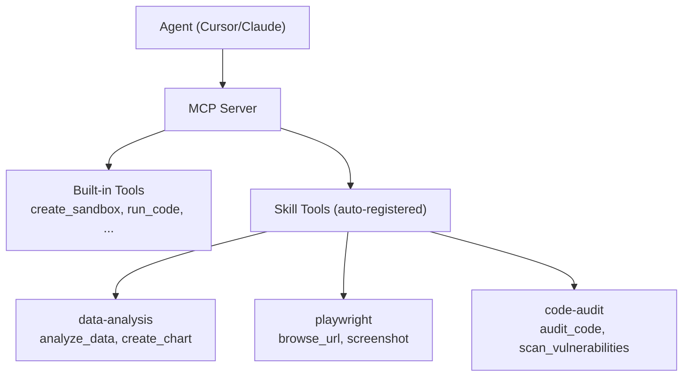

# Skills System Design

> Skills are reusable capability packages for Easy Sandbox that bundle "sandbox environment configuration + Agent usage instructions + MCP Tools extensions" into a distributable unit. Developers can install Skills like npm packages, and AI Agents can automatically discover and use capabilities provided by Skills.

---

## 1. Skill Definition

A Skill encompasses three dimensions of capabilities:

```
Skill = Sandbox Environment Config + Agent Instructions + MCP Tools Extensions
        ─────────────────────────   ─────────────────   ───────────────────
        sandbox.yaml                 SKILL.md            mcp-tools.json
        Dockerfile                   (structured doc)    (tool definitions)
        scripts/
```

| Dimension | Purpose | Files |
|-----------|---------|-------|
| **Sandbox Environment** | Define runtime environment, dependencies, resource requirements | `sandbox.yaml`, `Dockerfile` |
| **Agent Instructions** | Tell AI how to use this Skill | `SKILL.md` |
| **MCP Tools** | Extend the MCP Server's tool set | `mcp-tools.json`, `scripts/` |

---

## 2. Skill Directory Structure

```
my-skill/
├── SKILL.md              # Skill documentation (AI-readable)
├── sandbox.yaml          # Sandbox environment configuration
├── Dockerfile            # Optional: custom image
├── scripts/              # Optional: tool scripts
│   ├── setup.sh          #   Environment initialization
│   ├── run.py            #   Main execution script
│   └── tools/            #   MCP tool implementations
│       ├── analyze.py
│       └── visualize.py
├── mcp-tools.json        # Optional: MCP tool definitions
├── examples/             # Usage examples
│   ├── basic.py
│   └── advanced.py
├── tests/                # Tests
│   └── test_skill.py
└── skill.lock            # Dependency lock (auto-generated)
```

---

## 3. SKILL.md Format Specification

SKILL.md is the core document of a Skill — both a human-readable description and an operational manual for AI Agents.

### Complete Example: data-science Skill

```markdown
# Data Science Skill

## Overview
Provides a complete Python data science environment with pre-installed pandas, numpy, matplotlib, scikit-learn, and other tool packages. Supports CSV/Excel/JSON data analysis, automatic visualization chart generation, and analysis reports.

## Capabilities
- Data loading and cleaning (CSV, Excel, JSON, Parquet)
- Statistical analysis (descriptive statistics, correlation analysis, hypothesis testing)
- Visualization (line charts, bar charts, scatter plots, heatmaps, box plots)
- Machine learning (classification, regression, clustering)
- Report generation (Markdown format analysis reports)

## Environment
- Python 3.11
- Pre-installed packages: pandas, numpy, matplotlib, seaborn, scikit-learn, openpyxl
- Working directory: /app
- Data directory: /app/data

## Usage

### Analyze CSV Data
\```python
# Upload data files to /app/data/
# Execute analysis script
import pandas as pd
df = pd.read_csv('/app/data/input.csv')
print(df.describe())
\```

### Generate Visualizations
\```python
import matplotlib.pyplot as plt
df.plot(kind='bar', x='category', y='value')
plt.savefig('/app/output/chart.png')
\```

## MCP Tools
- `analyze_data(file_path, analysis_type)` — Automatically analyze data
- `create_chart(data, chart_type, title)` — Generate charts
- `generate_report(file_path)` — Generate analysis reports

## Notes
- For large files (>1GB), OSS mounting is recommended
- GPU acceleration requires specifying gpu=True
- Output files are saved in /app/output/
```

---

## 4. Skills Classification System

### Language Runtimes

| Skill | Description | Template |
|-------|-------------|----------|
| `python-base` | Python 3.11 base environment | python-base |
| `python-data-science` | Full data science toolkit | python-data-science |
| `node-base` | Node.js 20 LTS environment | node-web |
| `go-base` | Go 1.22 development environment | go-dev |
| `java-base` | JDK 21 + Maven/Gradle | java-dev |
| `rust-base` | Rust stable + cargo | base |
| `cpp-base` | GCC/Clang + CMake | base |

### Data Science

| Skill | Description |
|-------|-------------|
| `data-analysis` | pandas + matplotlib + seaborn |
| `ml-sklearn` | scikit-learn machine learning |
| `ml-pytorch` | PyTorch deep learning |
| `ml-tensorflow` | TensorFlow deep learning |
| `data-visualization` | Plotly + Bokeh interactive charts |
| `jupyter` | Jupyter Notebook environment |

### Web Development

| Skill | Description |
|-------|-------------|
| `nextjs` | Next.js full-stack development |
| `vue` | Vue 3 + Vite |
| `flask-api` | Flask REST API |
| `fastapi` | FastAPI high-performance API |
| `express` | Express.js backend |

### Browser Automation

| Skill | Description |
|-------|-------------|
| `playwright` | Playwright browser automation |
| `puppeteer` | Puppeteer scraping |
| `web-scraper` | General web scraping |
| `screenshot` | Web page screenshot service |
| `pdf-generator` | HTML → PDF conversion |

### AI/ML

| Skill | Description |
|-------|-------------|
| `llm-inference` | LLM local inference (vLLM) |
| `embedding` | Text vectorization |
| `image-gen` | Image generation (Stable Diffusion) |
| `speech` | Speech recognition/synthesis |
| `ocr` | Optical character recognition |

### Databases

| Skill | Description |
|-------|-------------|
| `postgres` | PostgreSQL database |
| `mysql` | MySQL database |
| `redis` | Redis cache |
| `sqlite` | SQLite lightweight database |
| `mongodb` | MongoDB document database |

### DevOps

| Skill | Description |
|-------|-------------|
| `docker-in-sandbox` | Docker inside sandbox |
| `k8s-tools` | Kubernetes management tools |
| `terraform` | Infrastructure as Code |
| `ansible` | Automation operations |

### Security

| Skill | Description |
|-------|-------------|
| `code-audit` | Code security audit |
| `pentest` | Penetration testing toolkit |
| `vulnerability-scan` | Vulnerability scanning |

---

## 5. CLI Commands

### ebx skill search

```bash
# Search Skills
ebx skill search "data science"
ebx skill search python --category ai-ml
ebx skill search "browser automation" --sort popularity

# Output:
#   NAME                  CATEGORY     STARS  DESCRIPTION
#   data-analysis         data-sci     ⭐ 2.1k  pandas + matplotlib data analysis
#   ml-pytorch            ai-ml        ⭐ 1.8k  PyTorch deep learning environment
#   playwright            browser      ⭐ 1.5k  Browser automation
```

### ebx skill install

```bash
# Install to current project
ebx skill install data-analysis

# Install globally
ebx skill install data-analysis --global

# Install to a specific IDE
ebx skill install data-analysis --target cursor
ebx skill install data-analysis --target claude
ebx skill install data-analysis --target vscode
ebx skill install data-analysis --target qoder

# Install a specific version
ebx skill install data-analysis@1.2.0

# Install from Git
ebx skill install https://github.com/user/my-skill.git

# Install from local
ebx skill install ./my-local-skill
```

### ebx skill list

```bash
ebx skill list
ebx skill list --global
ebx skill list --target cursor

# Output:
#   NAME              VERSION  SCOPE    INSTALLED
#   data-analysis     1.2.0    project  2024-01-15
#   playwright        2.0.1    global   2024-01-10
#   python-base       1.0.0    cursor   2024-01-08
```

### ebx skill create

```bash
# Create Skill scaffold
ebx skill create my-awesome-skill

# Output:
# ✓ Created directory: my-awesome-skill/
# ✓ Generated files: SKILL.md, sandbox.yaml, scripts/, examples/
# ✓ Initialization complete!
#
# Next steps:
#   cd my-awesome-skill
#   Edit SKILL.md and sandbox.yaml
#   ebx skill publish
```

### ebx skill publish

```bash
# Publish to official Registry
ebx skill publish ./my-skill

# Publish to private Registry
ebx skill publish ./my-skill --registry https://registry.mycompany.com

# Validate before publishing
ebx skill publish ./my-skill --dry-run
```

---

## 6. Installation Targets

Skills can be installed to different target environments:

| Target | Command | Effect |
|--------|---------|--------|
| Project | `--scope project` | Writes to `sandbox.yaml`, project-level |
| Global | `--global` | Writes to `~/.ebx/skills/`, global |
| Cursor | `--target cursor` | Writes to Cursor MCP config |
| Claude Desktop | `--target claude` | Writes to Claude Desktop config |
| VS Code | `--target vscode` | Writes to VS Code settings |
| Qoder | `--target qoder` | Writes to Qoder config |

### Effect of Installing to Cursor

```bash
ebx skill install data-analysis --target cursor

# Automatically writes to ~/.cursor/mcp.json:
# {
#   "mcpServers": {
#     "easy-sandbox": {
#       "command": "ebx",
#       "args": ["mcp", "start"],
#       "skills": ["data-analysis"]
#     }
#   }
# }
```

---

## 7. Distribution Mechanism

### Official Registry

```
registry.sandbox.alicloud.com
├── Official Skills (alicloud/ namespace)
├── Community-contributed Skills (community/ namespace)
├── Version management (semantic versioning)
├── Security review (automated + manual)
└── Usage statistics and leaderboards
```

### Git Repository

```bash
# Install from GitHub
ebx skill install github:user/repo
ebx skill install https://github.com/user/skill-repo.git

# Install from GitLab
ebx skill install gitlab:user/repo
```

### Local Directory

```bash
# Development mode: use local Skill directly
ebx skill install ./my-local-skill --link

# Link mode: no file copying, creates symlink for easy development/debugging
```

### Private Registry

```bash
# Configure private Registry
ebx config set registry.private https://registry.mycompany.com

# Install from private Registry
ebx skill install my-company-skill --registry private
```

---

## 8. MCP/Agent Integration

### Skill Auto-Discovery

When an AI Agent connects to Easy Sandbox via MCP, installed Skills are automatically registered as MCP Tools:



### Skill Usage in Agents

Skills provide pre-configured environments and tools for sandboxes. Built-in Agents have been simplified to AI CLI wrappers, and the Skill-Agent integration is primarily reflected in:

1. **Skills provide sandbox environments**: The Skill's `sandbox.yaml` defines the runtime environment, and Agent templates work on top of these environments
2. **Skills provide MCP tools**: The Skill's `mcp-tools.json` extends the MCP Server's tool set
3. **Agents execute via CLI**: The Agent API (`sb.agent.code()`, etc.) is syntactic sugar for `commands.run()`, executing AI CLI tools within the Skill-configured environment

```python
from easy_sandbox import Sandbox

# Skills provide the environment, Agent templates provide AI capabilities
asb = await Sandbox.create(template="codex")  # codex template has Codex CLI pre-installed

# If the data-analysis Skill is installed, data analysis tools will be pre-installed in the sandbox
# Agent invokes these capabilities via CLI commands
result = await sb.agent.code("Analyze /app/data.csv and generate a visualization report")
print(result.output)

# Equivalent to:
result = await sb.commands.run("codex 'Analyze /app/data.csv and generate a visualization report'")
```

> **Note**: Built-in Agents have been simplified to the AI CLI wrapper architecture (SDK zero LLM dependencies). The Agent API is syntactic sugar for `commands.run()`, actually executing AI CLI tools (Codex / Qwen CLI) pre-installed in sandbox templates. Skills primarily provide pre-configured environments for sandboxes and extend MCP tools, rather than managing LLM Providers or Agent orchestration.

### Skill Composition

```python
# Multiple Skills can be composed; together they define the sandbox environment
from easy_sandbox import Sandbox

# Using a template that combines multiple Skills
sb = await Sandbox.create(
    template="full-stack",
    # The sandbox will include environments defined by python-base, postgres, fastapi, playwright, etc.
)

# Use these environments via Agent or direct commands
result = await sb.commands.run("python -c 'import flask; print(flask.__version__)'")
```
