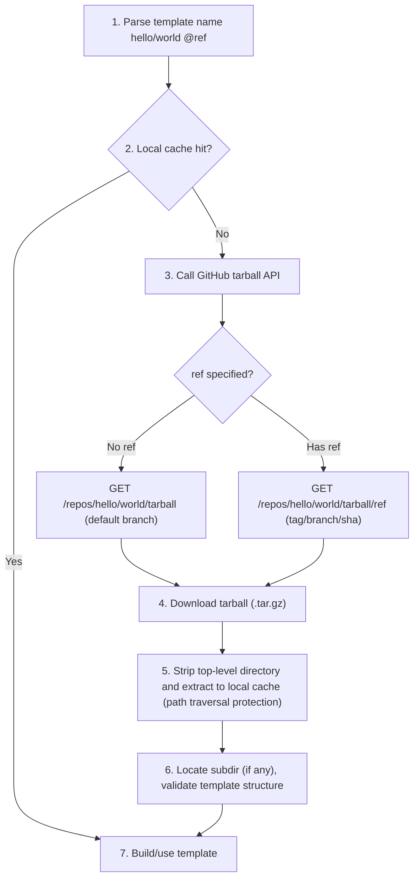
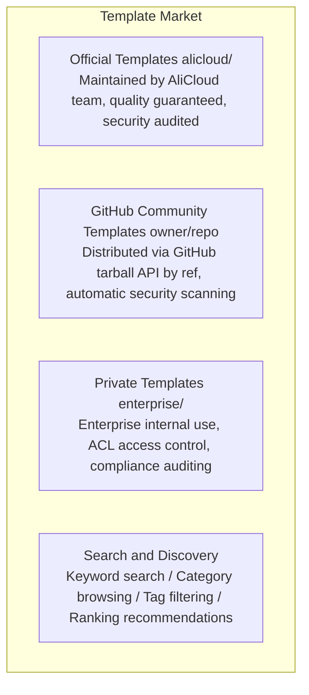

# Template System Design

> A Template is the runtime environment blueprint for Easy Sandbox, defining the sandbox's base image, pre-installed software, default configuration, and startup behavior. The template system is organized into three tiers: official core templates, community templates, and custom templates. The core distribution mechanism is based on the **GitHub tarball API (fetched by tag/branch/sha, no Release required)**, using a reference style similar to Go modules / GitHub Actions.

---

## 1. Official Core Templates

### Tier 1 — Launch Templates (5)

Available at launch, covering the most common scenarios.

#### base

```yaml
Name:         base
Description:  Minimal Linux environment for general-purpose tasks
Base Image:   debian:bookworm-slim
Pre-installed: bash, curl, wget, git, vim, jq, unzip
Python:       3.11 (system-level)
Resources:    1 CPU / 2048 MB memory / 10 GB disk
Workdir:      /app
User:         user (uid=1000)
```

#### python-base

```yaml
Name:         python-base
Description:  Python development environment with pip and common tools
Base Image:   base + Python ecosystem
Pre-installed: python3.11, pip, venv, poetry, ipython
Pre-installed Packages: requests, httpx, pydantic, rich
Resources:    1 CPU / 2048 MB memory / 10 GB disk
```

#### python-data-science

```yaml
Name:         python-data-science
Description:  Full data science environment
Base Image:   python-base + scientific computing
Pre-installed Packages: pandas, numpy, scipy, matplotlib, seaborn,
              scikit-learn, statsmodels, openpyxl, xlrd,
              plotly, bokeh, jupyter
Resources:    2 CPU / 4096 MB memory / 20 GB disk
```

#### node-web

```yaml
Name:         node-web
Description:  Node.js web development environment
Base Image:   base + Node.js ecosystem
Pre-installed: node 20 LTS, npm, yarn, pnpm
Pre-installed Packages: typescript, ts-node, nodemon
Exposed Ports: 3000, 8080
Resources:    1 CPU / 2048 MB memory / 10 GB disk
```

#### code-interpreter

```yaml
Name:         code-interpreter
Description:  Code interpreter environment with multi-language support
Base Image:   python-data-science + multi-language
Pre-installed: python3.11, node20, go1.22, rustc
Features:     Rich Output (images, HTML, LaTeX)
              Auto-install missing pip packages
              Sandboxed code execution
Resources:    2 CPU / 4096 MB memory / 20 GB disk
```

### Tier 2 — Extension Templates (5)

Released in Phase 2, covering specialized scenarios.

#### browser-automation

```yaml
Name:         browser-automation
Description:  Browser automation environment (Playwright + Chromium)
Base Image:   base + browser environment
Pre-installed: chromium, playwright, puppeteer
Features:     Headless browser pre-launched
              Screenshot/PDF generation
              Network request interception
Resources:    2 CPU / 4096 MB memory / 15 GB disk
```

#### full-stack

```yaml
Name:         full-stack
Description:  Full-stack development environment (frontend + backend + database)
Base Image:   node-web + python-base
Pre-installed: node20, python3.11, postgresql, redis, nginx
Features:     Simultaneous frontend and backend
              Built-in database
              Reverse proxy configuration
Exposed Ports: 3000, 5000, 5432, 6379
Resources:    4 CPU / 8192 MB memory / 30 GB disk
```

#### go-dev

```yaml
Name:         go-dev
Description:  Go development environment
Base Image:   base + Go ecosystem
Pre-installed: go 1.22, golangci-lint, dlv (debugger)
              air (hot reload), mockgen
Resources:    2 CPU / 4096 MB memory / 15 GB disk
```

#### java-dev

```yaml
Name:         java-dev
Description:  Java development environment
Base Image:   base + JDK ecosystem
Pre-installed: JDK 21, Maven 3.9, Gradle 8.x
              Spring Boot CLI
Resources:    2 CPU / 4096 MB memory / 20 GB disk
```

#### ml-gpu

```yaml
Name:         ml-gpu
Description:  GPU-accelerated machine learning environment
Base Image:   nvidia/cuda:12.1 + python-data-science
Pre-installed: CUDA 12.1, cuDNN 8.9
Pre-installed Packages: torch, tensorflow, transformers,
              accelerate, bitsandbytes
GPU:          Default A10 (configurable V100/A100)
Resources:    4 CPU / 16384 MB memory / 50 GB disk
```

---

## 2. Template Sources and Distribution Mechanism

The core distribution mechanism is based on the **GitHub tarball API (fetched by tag/branch/sha, no Release required)**, similar to Go modules / GitHub Actions reference style. The SDK resolves template sources in priority order:

```
Template source priority:
1. Built-in templates (5 Tier 1 templates bundled with the SDK)
2. GitHub templates (owner/repo format, fetched by tag/branch/sha)
3. Local templates (file paths)
4. Alibaba Cloud ACR images (registry URLs)
```

### 2.1 Template Name Resolution Rules

```python
# Built-in templates (no /)
"python"               → Built-in python template
"code-interpreter"     → Built-in code-interpreter template

# GitHub templates (contains /)
"hello/world"          → github.com/hello/world default branch
"hello/world@v1.0"     → github.com/hello/world ref v1.0 (tag/branch/sha)
"myorg/templates/node"  → github.com/myorg/templates repo, node subdirectory (monorepo)

# Local paths
"./my-template"        → my-template in current directory
"/abs/path/template"   → Absolute path

# ACR images
"acr://registry.cn-hangzhou.aliyuncs.com/ns/image:tag" → Alibaba Cloud Container Registry
```

### 2.2 Usage from Different Entry Points

```bash
# CLI usage
ebx create hello/world                    # → github.com/hello/world default branch
# ebx create hello/world --tag v1.2.0       # → specific ref (tag/branch/sha)
ebx create myorg/python-ml --tag latest   # → explicitly specify latest
```

```python
# SDK usage
sb = await Sandbox.create(template="hello/world")
sb = await Sandbox.create(template="hello/world@v1.2.0")

# Decorator usage
@sandbox(template="hello/world@v1.2.0")
def my_func(): ...
```

### 2.3 GitHub Tarball Resolution Flow



GitHub automatically resolves `ref` to tag/branch/sha, no distinction needed. Public repositories work anonymously; private repositories require `Authorization: Bearer <token>`.

### 2.4 Template Package Structure (Repository/Subdir Contents)

The tarball (fetched by ref) from a template repository must contain a template package with the following structure:

```
my-template/
├── template.yaml     # Template specification config (required, see Chapter 4)
├── Dockerfile            # Image definition (optional, base can be specified in template.yaml)
├── SKILL.md              # Agent usage instructions (optional)
├── scripts/
│   ├── setup.sh          # Initialization script (optional)
│   └── healthcheck.sh    # Health check (optional)
├── files/                # Files to copy into the sandbox (optional)
└── examples/             # Usage examples (optional)
```

### 2.5 Official Template Repository

An official `alicloud/sandbox-templates` repository (monorepo) is maintained, containing all Tier 1 and Tier 2 templates:

```bash
# Official templates can use shorthand
ebx create python-data-science     # Built-in Tier 1
ebx create alicloud/sandbox-templates/browser-automation  # Official Tier 2

# Or use shorthand aliases directly
ebx create browser-automation      # Auto-resolves to official template
```

### 2.6 GitHub Token Configuration (Private Repositories)

```bash
# Configure GitHub Token for accessing private template repositories
ebx config set github_token ghp_xxxxxxxxxxxx

# Or via environment variable
export SANDBOX_GITHUB_TOKEN=ghp_xxxxxxxxxxxx
```

### 2.7 Local Cache Management

Templates downloaded from the GitHub tarball API are cached locally to avoid repeated downloads.

Cache directory structure:

```
~/.sandbox/templates/
├── hello/
│   └── world/
│       ├── v1.0.0/
│       │   ├── template.yaml
│       │   └── Dockerfile
│       └── v1.2.0/
│           ├── template.yaml
│           └── Dockerfile
└── myorg/
    └── python-ml/
        └── latest/
            └── ...
```

CLI cache management commands:

```bash
# View cached templates
ebx template cache list

# Clean all caches
ebx template cache clean

# Clean a specific template's cache
ebx template cache clean hello/world

# Force re-download (skip cache when creating)
ebx create hello/world --no-cache
```

---

## 3. Custom Template Methods

### Method 1: SDK Programmatic

```python
from easy_sandbox import Image

# Chained build
image = (
    Image.from_template("python-base")
    .pip_install("flask", "sqlalchemy", "celery")
    .apt_install("postgresql-client", "redis-tools")
    .copy_local("./config/", "/app/config/")
    .env(
        FLASK_ENV="production",
        DATABASE_URL="postgresql://localhost/mydb",
    )
    .expose(5000, 6379)
    .entrypoint("python /app/main.py")
)

# Build and push as template
template_id = await image.build_and_push(
    name="my-flask-app",
    tag="v1.0",
    description="Flask + PostgreSQL + Celery application template",
)
```

### Method 2: CLI + Dockerfile

```dockerfile
# Dockerfile
FROM registry.sandbox.alicloud.com/templates/python-base:latest

RUN pip install flask sqlalchemy celery
RUN apt-get update && apt-get install -y postgresql-client redis-tools

COPY ./config/ /app/config/

ENV FLASK_ENV=production
ENV DATABASE_URL=postgresql://localhost/mydb

EXPOSE 5000 6379

WORKDIR /app
CMD ["python", "main.py"]
```

```bash
# Build
ebx template build . --name my-flask-app --tag v1.0

# Push
ebx template push my-flask-app:v1.0
```

### Method 3: sandbox.yaml Declarative

```yaml
# sandbox.yaml
name: my-flask-app
version: "1.0"
description: "Flask + PostgreSQL + Celery application template"

base: python-base

packages:
  pip:
    - flask==3.0
    - sqlalchemy==2.0
    - celery==5.3
  apt:
    - postgresql-client
    - redis-tools

files:
  - source: ./config/
    target: /app/config/

env:
  FLASK_ENV: production
  DATABASE_URL: postgresql://localhost/mydb

ports:
  - 5000
  - 6379

resources:
  cpu: 2
  memory: 4096
  disk: 20480

entrypoint: python /app/main.py
workdir: /app
```

### Method 4: Publish to GitHub (Fetch by tag/branch/sha)

Push the template to GitHub for others to reference via `owner/repo[//subdir][@ref]` format (no Release required):

```bash
# 1. Initialize template project (generates template.yaml, Dockerfile, SKILL.md scaffolding)
ebx template init my-template

# 2. Local development and testing
ebx create ./my-template

# 3. Publish to GitHub (push git tag / branch, no Release needed)
cd my-template
git init && git add . && git commit -m "init"
git tag v1.0.0 && git push origin v1.0.0

# 4. Others can now use it (default branch or specified ref)
ebx create yourname/my-template
ebx create yourname/my-template@v1.0.0
```

---

## 4. Template Specification (template.yaml)

`template.yaml` is the standardized declaration file for templates, defining the template's metadata, base environment, build steps, resource defaults, sandbox behavior, and Agent integration — the complete specification. Every template repository root should include this file.

> **Naming convention**: The canonical file name is `template.yaml`. For backward compatibility, `sandbox.yaml` is also accepted as a shorthand alias.

### Complete Field Definitions

```yaml
# template.yaml — Template Specification v1
version: "1"                          # Specification version (required)

# === Metadata ===
metadata:
  name: python-data-science           # Template name (required)
  display_name: "Python Data Science"  # Display name
  description: "Data analysis environment pre-installed with pandas/numpy/matplotlib"
  version: "1.2.0"                    # Template version (SemVer)
  author: "alicloud"                  # Author
  license: "MIT"
  homepage: "https://github.com/alicloud/sandbox-templates"
  tags: ["python", "data-science", "jupyter"]
  category: "data-science"            # Category: language / data-science / web / browser / ai-ml / devops / database / security

# === Base Environment ===
base:
  image: "ubuntu:22.04"               # Base image (mutually exclusive with from)
  from: "alicloud/sandbox-templates/python@v1.0"  # Inherit from another template (mutually exclusive with image)

# === Build Steps ===
build:
  apt_install:                        # System packages
    - build-essential
    - libpq-dev
  pip_install:                        # Python packages
    - "pandas>=2.0"
    - numpy
    - matplotlib
  npm_install:                        # Node.js packages (optional)
    - typescript
  env:                                # Environment variables
    PYTHONUNBUFFERED: "1"
    MPLBACKEND: "Agg"
  run:                                # Custom build commands
    - "jupyter notebook --generate-config"
  copy:                               # Copy files into sandbox
    - src: "./config/"
      dest: "/app/config/"
    - src: "./scripts/setup.sh"
      dest: "/usr/local/bin/setup.sh"

# === Resource Defaults ===
resources:
  cpu: 2                              # Default vCPU
  memory: 4096                        # Default memory (MB)
  disk: 15360                         # Default disk (MB)
  gpu: null                           # Default GPU (null means not needed)
  timeout: 600                        # Default timeout (seconds)
  idle_timeout: 300                   # Default idle timeout (seconds)

# === Network ===
network:
  ports: [8888]                       # Default exposed ports
  public: false                       # Whether public by default

# === Sandbox Behavior ===
sandbox:
  mode: "ephemeral"                   # Default mode: ephemeral | persistent
  workdir: "/app"               # Default working directory
  user: "user"                     # Default user
  shell: "/bin/bash"                  # Default shell
  startup_command: null               # Command to auto-execute on startup
  readiness_probe:                    # Readiness probe (optional)
    type: "tcp"                       # tcp | exec
    port: 8888                        # Port for tcp type
    timeout: 30                       # Probe timeout

# === Capabilities ===
# Declares the standard capability set supported by this template. Standard capability vocabulary: shell / files / code / terminal / ports (extensible).
# When capabilities is omitted, the system default baseline DEFAULT_CAPABILITIES = {shell, files, code} is inherited.
# terminal and ports are not in the default baseline and must be explicitly declared here.
capabilities:
  - shell
  - files
  - code
  - ports                             # Explicitly add capabilities beyond the default baseline

# === Custom Commands ===
# Templates can declare named commands, invokable via `ebx run <id> <name> --arg k=v` and SDK `sandbox.run("name", **args)`.
# User-supplied arguments are escaped via shlex.quote() before filling {placeholders}, preventing injection.
custom_commands:
  serve:
    cmd: "python -m http.server {port}"  # Command template, {placeholders} come from args[].name
    description: "Start a static file server"  # Command description (for users/Agents)
    cwd: "/app"                          # Working directory (default /app)
    env: {}                              # Additional environment variables (default empty)
    timeout: 60                          # Timeout in seconds (default 60)
    args:
      - name: port
        default: "8000"                  # Default value
        required: false                  # Whether required (default false)
        description: "Listening port"

# === Skills Binding ===
skills:
  bundled: ["jupyter", "pandas-stack"] # Built-in bound Skills
  recommended: ["matplotlib-extra"]    # Recommended optional Skills

# === Agent Prompts ===
agent:
  description: "Suitable for data analysis, CSV processing, statistical computation, and chart generation"
  triggers:                           # Trigger keywords (for natural language matching)
    - "data analysis"
    - "pandas"
    - "CSV"
    - "charts"
  instructions: |                     # Agent usage guide
    When performing data analysis tasks in this sandbox:
    1. Place data files in /app/data/
    2. Place output files in /app/output/
    3. When generating charts with matplotlib, save as PNG

# === Health Check ===
healthcheck:
  command: "python3 -c 'import pandas'"
  interval: 30
  timeout: 5
  retries: 3
```

### Field Classification

| Section | Field | Required | Description |
|---------|-------|:--------:|-------------|
| Top-level | `version` | ✅ | Specification version number, currently fixed at `"1"` |
| **metadata** | `name` | ✅ | Template unique identifier |
| | `display_name` | | User-facing display name |
| | `description` | | Template description |
| | `version` | | SemVer version, defaults to Git tag |
| | `author` | | Author |
| | `license` | | License |
| | `homepage` | | Project homepage URL |
| | `tags` | | Tag list for search and filtering |
| | `category` | | Category, options: `language` / `data-science` / `web` / `browser` / `ai-ml` / `devops` / `database` / `security` |
| **base** | `image` | ⚠️ | Base Docker image (mutually exclusive with `from`) |
| | `from` | ⚠️ | Inherited template reference, supports `owner/repo@tag` format (mutually exclusive with `image`) |
| **build** | `apt_install` | | System-level apt package list |
| | `pip_install` | | Python pip package list, supports version constraints |
| | `npm_install` | | Node.js global package list |
| | `env` | | Environment variables injected during build |
| | `run` | | Custom shell command list, executed in order |
| | `copy` | | File copy mappings (`src` → `dest`) |
| **resources** | `cpu` | | Default vCPU count (default 1) |
| | `memory` | | Default memory in MB (default 2048) |
| | `disk` | | Default disk in MB (default 10240) |
| | `gpu` | | GPU type, null means not needed |
| | `timeout` | | Sandbox timeout in seconds (default 300) |
| | `idle_timeout` | | Idle timeout in seconds (default 120) |
| **network** | `ports` | | Exposed port list |
| | `public` | | Whether public network is enabled by default (default false) |
| **sandbox** | `mode` | | Run mode: `ephemeral` / `persistent` (default ephemeral) |
| | `workdir` | | Working directory (default /app) |
| | `user` | | Run user (default user) |
| | `shell` | | Default shell (default /bin/bash) |
| | `startup_command` | | Command to auto-execute on startup |
| | `readiness_probe` | | Readiness probe config (`type` + `port`/`command` + `timeout`) |
| **capabilities** | (list) | | Standard capability set supported by the template. Vocabulary: `shell` / `files` / `code` / `terminal` / `ports` (extensible). When omitted, inherits default baseline `{shell, files, code}`; `terminal`/`ports` must be explicitly declared |
| **custom_commands** | `<name>.cmd` | | Command template string with `{placeholder}` support (required) |
| | `<name>.description` | | Command description |
| | `<name>.cwd` | | Working directory (default `/app`) |
| | `<name>.env` | | Additional environment variables (default empty) |
| | `<name>.timeout` | | Timeout in seconds (default 60) |
| | `<name>.args` | | Parameter list, each item `{name, default, required, description}` |
| **skills** | `bundled` | | Built-in bound Skills list, auto-loaded with the template |
| | `recommended` | | Recommended optional Skills list |
| **agent** | `description` | | Scenario description for AI Agents |
| | `triggers` | | Trigger keyword list for natural language template matching |
| | `instructions` | | Agent usage guide describing how to work in this sandbox |
| **healthcheck** | `command` | | Health check command |
| | `interval` | | Check interval in seconds (default 30) |
| | `timeout` | | Timeout in seconds (default 10) |
| | `retries` | | Retry count (default 3) |

> **⚠️ Note**: `base.image` and `base.from` are mutually exclusive and cannot both be specified.

### Key Design Points

1. **`base` dual mode**: `image` directly specifies a Docker image, `from` inherits another template (supports GitHub owner/repo references), forming a template inheritance chain
2. **`agent` field is key to AI-Friendliness**: Lets AI Agents understand template applicability through `triggers` and `description`, and obtain usage guides through `instructions`
3. **`resources` default value semantics**: Templates declare recommended defaults; users can override them via SDK parameters or CLI options when creating sandboxes
4. **`skills.bundled` + `skills.recommended`**: Links templates with the Skills system — `bundled` auto-loads with the template, `recommended` serves as suggestions only
5. **`readiness_probe`**: Supports both `tcp` (port probing) and `exec` (command execution) readiness detection methods, ensuring the sandbox is truly available before returning
6. **`capabilities` capability model**: Command capabilities are declared by templates, no longer assuming all sandboxes have shell/upload/download. The standard capability vocabulary is `shell` / `files` / `code` / `terminal` / `ports` (extensible). The system default baseline is a single constant `DEFAULT_CAPABILITIES = {shell, files, code}`; templates can explicitly declare subsets or add `terminal`/`ports`, omitting `capabilities` inherits the default baseline. Invoking a standard capability not in the effective set throws `CapabilityNotSupportedError` (E3xxx), providing explicit errors without silent degradation, with `suggestion` in the error message. See ADR `2026-09-03-capability-model.md`
7. **`custom_commands`**: Templates can declare named commands; user arguments are escaped via `shlex.quote()` before filling `{placeholders}` to prevent injection; dispatched via CLI `ebx run` and SDK `sandbox.run("name", **args)`. See ADR `2026-09-03-custom-commands-schema.md`

### Example: Extension Based on a GitHub Template

```yaml
# template.yaml
version: "1"

metadata:
  name: my-ml-template
  display_name: "Custom ML Environment"
  description: "Machine learning development environment extended from the official data science template"
  version: "1.0.0"
  author: "yourname"
  tags: ["ml", "pytorch", "transformers"]
  category: "ai-ml"

base:
  from: alicloud/sandbox-templates/python-data-science@v2.0

build:
  apt_install:
    - libgl1-mesa-glew
  pip_install:
    - torch>=2.0
    - transformers
    - accelerate
  run:
    - python -c "import torch; print(torch.__version__)"

resources:
  cpu: 4
  memory: 8192
  gpu: A10

skills:
  bundled: ["pytorch", "transformers"]
  recommended: ["huggingface-hub"]

agent:
  description: "Suitable for PyTorch model training, Transformers fine-tuning, ML experiments"
  triggers: ["train model", "fine-tune", "PyTorch", "transformers"]
  instructions: |
    1. Place model files in /app/models/
    2. Place datasets in /app/data/
    3. GPU is pre-configured, use torch.cuda directly
```

---

## 5. Template Version Management

### Semantic Versioning

```
Template versions follow the SemVer specification:
  MAJOR.MINOR.PATCH

Examples:
  python-data-science:1.0.0     Initial version
  python-data-science:1.1.0     Add new packages
  python-data-science:1.1.1     Bug fix
  python-data-science:2.0.0     Upgrade Python to 3.12 (breaking change)
```

### Version Selection

```python
# Exact version
sb = await Sandbox.create(template="python-data-science:1.2.3")

# Minor version range (~=)
sb = await Sandbox.create(template="python-data-science:~1.2")  # >=1.2.0, <1.3.0

# Major version range (^)
sb = await Sandbox.create(template="python-data-science:^1")    # >=1.0.0, <2.0.0

# Latest version (default)
sb = await Sandbox.create(template="python-data-science")       # latest

# GitHub template with specific version
sb = await Sandbox.create(template="hello/world@v1.2.0")        # GitHub ref (tag/branch/sha)
```

### Version Listing

```bash
$ ebx template info python-data-science

Template: python-data-science
Description: Full data science environment

Versions:
  TAG       DATE          SIZE     PYTHON  PANDAS
  2.0.0     2026-08-01    2.1 GB   3.12    2.2.0    latest
  1.3.1     2026-07-15    1.9 GB   3.11    2.1.4
  1.3.0     2026-07-01    1.9 GB   3.11    2.1.0
  1.2.0     2026-06-01    1.8 GB   3.11    2.0.3
  1.0.0     2026-04-01    1.7 GB   3.11    2.0.0
```

---

## 6. Template Marketplace Architecture



### CLI Command Overview

```bash
# ── Create Sandbox ─────────────────────────────
ebx create python-base                       # Built-in template
ebx create hello/world                       # GitHub default branch
ebx create hello/world --tag v1.2.0          # GitHub specific ref (tag/branch/sha)
ebx create ./my-template                     # Local template
ebx create hello/world --no-cache            # Skip cache, force re-download

# ── Template Build and Push ────────────────────────
ebx template build . --name my-app --tag v1.0
ebx template push my-app:v1.0
ebx template init my-template                # Initialize template scaffolding

# ── Template Info and Search ────────────────────────
ebx template info python-data-science
ebx template list --market
ebx template list --market --category data-science --sort stars
ebx template search "machine learning gpu"

# ── Template Pull ──────────────────────────────
ebx template pull community/awesome-ml-env:latest
ebx template pull hello/world@v1.0.0

# ── Template Publish ──────────────────────────────
ebx template push my-template --publish --category web-development

# ── Local Cache Management ──────────────────────────
ebx template cache list                      # View cached GitHub tarball templates (fetched by tag/branch/sha, no Release needed)
ebx template cache clean                     # Clean all caches
ebx template cache clean hello/world         # Clean specific template cache

# ── Configuration ──────────────────────────────
ebx config set github_token ghp_xxxxxxxxxxxx # Configure GitHub Token (private repositories)
```

### Template Security

Every template undergoes the following before publication:

1. **Automatic security scanning**: CVE vulnerability detection, malicious code scanning
2. **Dependency audit**: Check security of all dependency packages
3. **Resource limit validation**: Ensure templates do not exceed reasonable resource bounds
4. **Signature verification**: Official templates carry digital signatures to prevent tampering

---

## 7. Note: Session Management and Templates

Templates define the **static environment blueprint** for sandboxes, while Session management handles the **runtime lifecycle** (creation, connection, hibernation, recovery, destruction). Fields such as `sandbox.mode`, `resources.timeout`, and `resources.idle_timeout` in templates provide default parameters for Session management, but the final behavior is controlled by the Session management module.

For the complete Session management design (including session persistence, state recovery, multi-connection sharing, etc.), refer to the overall architecture design document.
