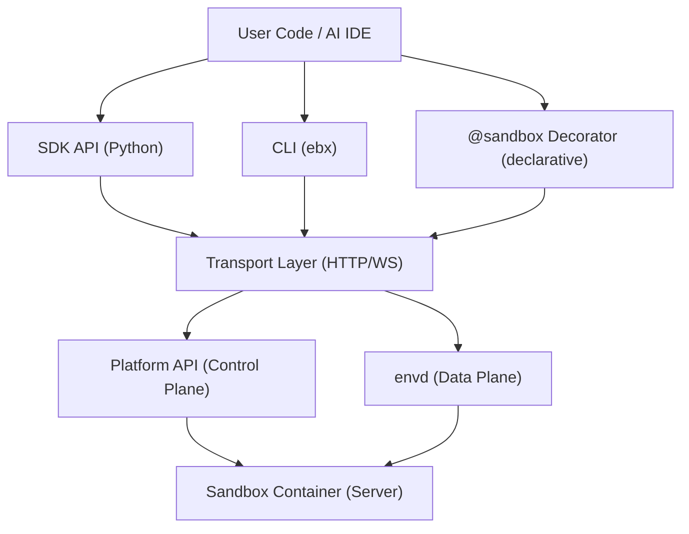
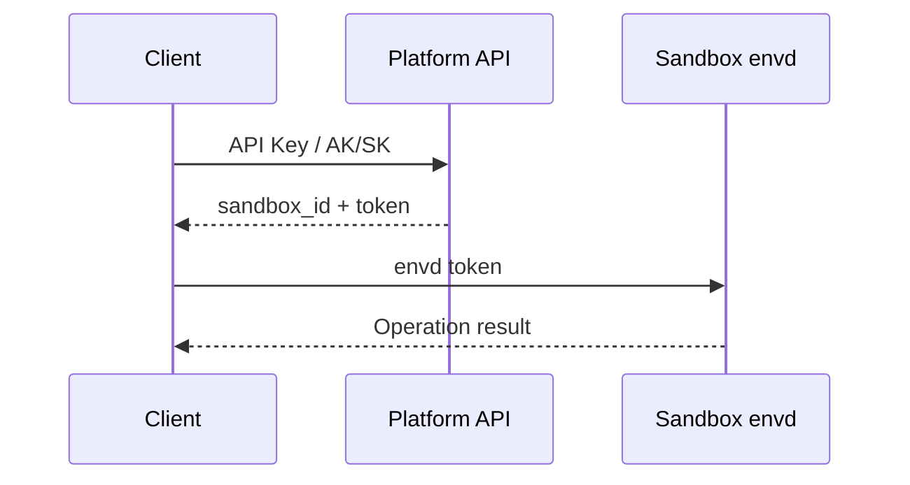
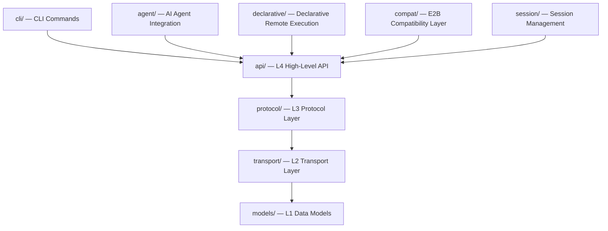

# Architecture Overview

> **Renaming Notice**: This project has been renamed from Serverless Sandbox to **Easy Sandbox**. PyPI package: `easy-sandbox` (`pip install easy-sandbox`), CLI command: `ebx`, Python import: `easy_sandbox`.

This document provides a brief overview of the Easy Sandbox architecture to help you understand the relationships between the SDK, CLI, and Server.

---

## Three-Layer Architecture

Easy Sandbox consists of three core layers:

### SDK Layer (Client)

- **Sandbox class**: Core entry point for managing sandbox lifecycle
- **Submodules**: `commands` (shell commands), `files` (filesystem), `network` (networking), `code` (code interpreter)
- **Image builder**: Chaining API for building Docker images
- **Declarative decorator**: `@sandbox` for remote function execution

### CLI Layer

- **ebx command**: Click-based CLI tool
- **LazyGroup**: Lazy-loaded subcommands for faster `--help` response
- **Command groups**: auth, config, session, secret, template, mcp, deploy, skill, sandbox

### Server Layer (Inside Sandbox)

- **HTTP Server**: Runs inside the sandbox on port 9000
- **Capability groups**: 8 capability groups controlling endpoint access
- **Custom commands**: Registered via `@sandbox.register` and exposed through HTTP routes

---

## Communication Architecture

### Control Plane (Platform API)

The client communicates with the Platform API over HTTPS for:
- Creating/listing/destroying sandboxes
- Template management (build/query)
- Authentication (API Key / AK/SK token exchange)

URL format: `https://api.{region}.e2b.fc.aliyuncs.com`

### Data Plane (envd)

After sandbox creation, the SDK communicates directly with the envd service inside the sandbox over HTTPS/WSS:
- Command execution (HTTP POST)
- File operations (HTTP)
- Code execution (RPC over HTTP)
- Terminal sessions (WebSocket)

URL format: `https://49983-{sandbox_id}.{domain}`

Where `49983` is the fixed envd port.

### Authentication Flow

---

## Server-Side Capability Groups

The 42 endpoints in the sandbox Server are divided into 8 capability groups:

| Capability Group | Default State | Description |
|------------------|---------------|-------------|
| CORE | Always enabled | Basic endpoints (health check, etc.) |
| COMMANDS | Enabled | Custom command routing |
| FILE_OPS | Enabled | File CRUD operations |
| PROCESS | Enabled | Process management |
| TERMINAL | **Enabled** | PTY terminal |
| SYSTEM | Enabled | System information queries |
| DEV_TOOLS | **Disabled** | Developer tools |
| BROWSER | **Disabled** | Browser automation |

Disabled groups are controlled via the `EBX_SERVER_DISABLED_GROUPS` environment variable, which defaults to `DEV_TOOLS,BROWSER`.

---

## SDK Internal Layering

Files contained in each module:

- **api/**: sandbox.py, files.py, commands.py, network.py, code.py, image.py
- **protocol/**: sandbox.py, process.py, filesystem.py, code_interpreter.py, terminal.py
- **transport/**: http.py, auth.py, config.py, streaming.py
- **models/**: sandbox.py, process.py, errors.py, template.py, session.py, filesystem.py
- **declarative/**: decorator.py, serializer.py, config.py
- **agent/**: mcp.py, tools.py, infer.py
- **session/**: local.py, base.py
- **compat/**: sandbox.py
- **cli/**: main.py, commands/

---

## Next Steps

- [Sandbox Lifecycle](sandbox-lifecycle.md) — State transitions and timeout mechanisms
- [E2B Compatibility](e2b-compatibility.md) — Design decisions
- [API Reference](../reference/api-reference.md) — Complete API documentation
