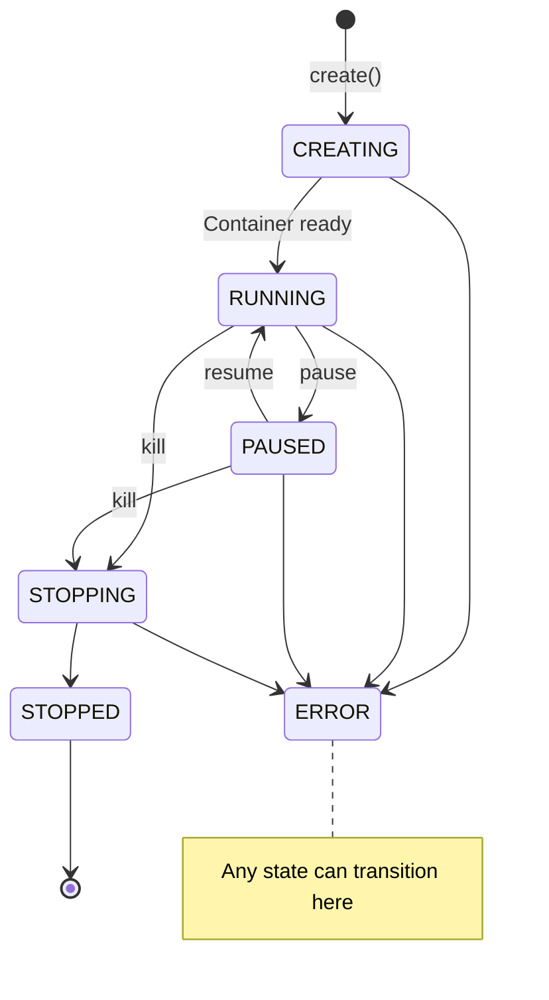

# Sandbox Lifecycle

> **Renaming Notice**: This project has been renamed from Serverless Sandbox to **Easy Sandbox**. PyPI package: `easy-sandbox` (`pip install easy-sandbox`), CLI command: `ebx`, Python import: `easy_sandbox`.

This document explains the complete sandbox lifecycle, state transitions, and timeout mechanisms.

---

## State Model

The sandbox lifecycle is represented by the `SandboxStatus` enum:

```python
class SandboxStatus(str, Enum):
    CREATING = "creating"   # Being created
    RUNNING  = "running"    # Running
    PAUSED   = "paused"     # Paused
    STOPPING = "stopping"   # Shutting down
    STOPPED  = "stopped"    # Stopped
    ERROR    = "error"      # Error
```

---

## State Transitions



### Normal Flow

1. **CREATING → RUNNING**: `Sandbox.create()` calls the Platform API to create a container; status becomes RUNNING once the container is ready
2. **RUNNING → PAUSED**: `sandbox.pause()` pauses the sandbox
3. **PAUSED → RUNNING**: `sandbox.resume()` resumes execution
4. **RUNNING → STOPPING → STOPPED**: `sandbox.kill()` destroys the sandbox
5. **Any state → ERROR**: An unrecoverable error occurs

### Abnormal Flow

- Creation timeout: CREATING → ERROR
- Container crash: RUNNING → ERROR
- Platform failure: Any state → ERROR

---

## Timeout Mechanisms

### Sandbox Timeout

Each sandbox has a `timeout` value (in seconds); the sandbox is automatically destroyed when it expires.

```python
# Set at creation time
sandbox = await Sandbox.create(timeout=600)  # 10 minutes

# Update at runtime
await sandbox.set_timeout(1200)  # Extend to 20 minutes
```

| Parameter | Range | Default |
|-----------|-------|---------|
| `timeout` | 1 – 86400 (1 second – 24 hours) | 300 (5 minutes) |

### Command Timeout

```python
# commands.run() defaults to 60 seconds
result = await sandbox.commands.run("command", timeout=120)

# run_code() defaults to 30 seconds
result = await sandbox.run_code("code", timeout=60)
```

### CLI Timeout

```bash
# Global default timeout
ebx --timeout 600 create

# Command-level timeout
ebx exec sbx-xxxx "command" --timeout 120
```

---

## Context Manager Lifecycle

When using `async with`, `kill()` is automatically called on exit:

```python
async with await Sandbox.create() as sandbox:
    # sandbox status: RUNNING
    result = await sandbox.run_code("print(1)")
# Exiting the with block → automatic kill()
# sandbox status: STOPPED
```

Cleanup occurs even if an exception is raised:

```python
try:
    async with await Sandbox.create() as sandbox:
        raise ValueError("error")
except ValueError:
    pass
# sandbox has been automatically destroyed
```

---

## Checking Status

```python
# Get cached status (no network request)
status = sandbox.status

# Make an API call to check actual status
is_running = await sandbox.is_running()

# Refresh full info
info = await sandbox.refresh_info()
print(f"Status: {info.status.value}")
```

---

## SDK Property Freshness

| Property | Freshness | How to Refresh |
|----------|-----------|----------------|
| `sandbox.id` | Immutable | — |
| `sandbox.status` | Snapshot at creation | `refresh_info()` |
| `sandbox.url` | Snapshot at creation | `refresh_info()` |
| `sandbox.info` | Snapshot at creation | `refresh_info()` |
| `sandbox.capabilities` | Resolved at creation | Immutable |

---

## Next Steps

- [Architecture Overview](architecture-overview.md) — SDK/CLI/Server relationships
- [SDK Usage Guide](../guide/sdk-usage.md) — Sandbox operation methods
- [Error Codes Reference](../reference/error-codes.md) — Error codes for status anomalies
