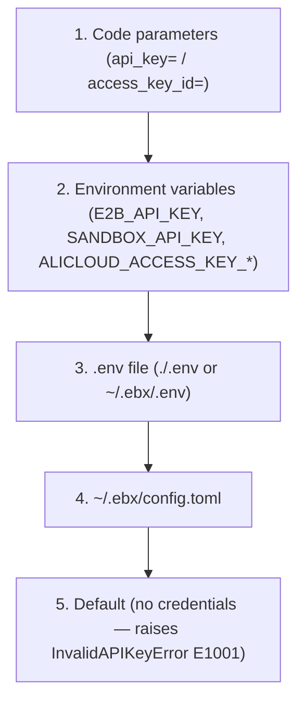

# Authentication

> **Rename notice**: This project has been renamed from Serverless Sandbox to **Easy Sandbox**. PyPI package: `easy-sandbox` (`pip install easy-sandbox`), CLI command: `ebx`, Python import: `easy_sandbox`.

Easy Sandbox supports two authentication modes: **API Key** and **AK/SK (Alibaba Cloud AccessKey)**.

---

## Authentication Overview

Easy Sandbox provides three authentication paths for different scenarios:

- **API Key mode**: The most common approach. Accesses the platform API via the `Authorization: Bearer {api_key}` header. Suitable for personal development, CI/CD, SDK calls, and most other scenarios.
- **AK/SK mode (Alibaba Cloud AccessKey)**: Uses an Alibaba Cloud AccessKey pair to obtain a temporary API Key via token exchange. Suitable for Alibaba Cloud ecosystem integration and enterprise environments using RAM role authorization.
- **envd internal authentication**: After sandbox creation, the SDK communicates with the in-sandbox envd service using `envdAccessToken` (obtained from the creation response). This is an internal mechanism managed automatically by the SDK — no manual handling required.

---

## API Key Authentication

API Key is the most common authentication method, sent to the platform API via the `Authorization: Bearer {api_key}` header.

### Configuration Methods

#### 1. Environment variable (highest priority)

```bash
# Recommended variable name (E2B compatible)
export E2B_API_KEY="your-api-key"

# Or use an alternative variable name
export SANDBOX_API_KEY="your-api-key"
```

When both `E2B_API_KEY` and `SANDBOX_API_KEY` are present, `E2B_API_KEY` takes precedence.

#### 2. ebx auth login (persisted to local file)

```bash
ebx auth login
# Interactively enter your API Key
# Saved to: ~/.ebx/.env
# File permissions: 600 (owner read/write only)
```

Stored as `E2B_API_KEY=your-key` in `~/.ebx/.env`.

#### 3. ebx config set

```bash
ebx config set api_key your-api-key
```

This command also writes to `~/.ebx/.env`.

#### 4. .env file

Create a `.env` file in the project root directory:

```dotenv
E2B_API_KEY=your-api-key
```

The SDK searches for `.env` files in the following order:
1. `.env` in the current directory
2. `~/.ebx/.env`

#### 5. config.toml file

Set in `~/.ebx/config.toml`:

```toml
[transport]
api_key = "your-api-key"
```

#### 6. Code parameter (highest priority override)

```python
from easy_sandbox.api.sandbox import Sandbox

# Pass directly when creating
sandbox = await Sandbox.create(api_key="your-api-key")

# Pass directly when connecting
sandbox = await Sandbox.connect("sbx-xxxx", api_key="your-api-key")
```

---

## AK/SK Alibaba Cloud Extended Authentication

AK/SK mode uses an Alibaba Cloud AccessKey pair to obtain a temporary API Key via token exchange (TTL 3600 seconds, auto-refreshed 300 seconds before expiry).

### Configuration Methods

#### Environment Variables

```bash
export ALICLOUD_ACCESS_KEY_ID="your-access-key-id"
export ALICLOUD_ACCESS_KEY_SECRET="your-access-key-secret"
```

#### Code Parameters

```python
sandbox = await Sandbox.create(
    access_key_id="your-ak-id",
    access_key_secret="your-ak-secret",
)
```

### How AK/SK Works

1. The SDK uses the AK/SK to call the token exchange endpoint to obtain a temporary API Key
2. The temporary key is cached in memory (not persisted to disk)
3. Valid for 3600 seconds; the SDK auto-refreshes 300 seconds before expiry
4. Subsequent requests use the temporary key as a Bearer Token

---

## Configuration Priority Chain

Credentials are resolved in the following priority order (highest to lowest):



Within the same level, API Key takes precedence over AK/SK:
- If both `api_key` and `access_key_id` are provided, API Key is used
- If both `E2B_API_KEY` and `ALICLOUD_ACCESS_KEY_ID` are set, E2B_API_KEY is used

---

## CLI Authentication Management

```bash
# Login (save API Key)
ebx auth login

# View authentication status
ebx auth status
# Example output:
#   API Key: abcd****efgh
#   Source: /Users/you/.ebx/.env
#   Auth Mode: api_key

# Logout (delete saved credentials)
ebx auth logout
```

---

## Keychain Storage (Secret Management)

Easy Sandbox provides the `ebx secret` command group for securely managing sensitive information:

```bash
# Create a secret (interactive secure input)
ebx secret create MY_TOKEN

# List all secret names (values not displayed)
ebx secret list

# Inject secrets into a running sandbox
ebx secret inject <sandbox-id> -s MY_TOKEN -s ANOTHER_SECRET

# Delete a secret
ebx secret delete MY_TOKEN
```

The secret storage strategy varies by platform (implementation in `src/easy_sandbox/utils/keychain.py`):

- **macOS**: Uses the system Keychain via the `security` CLI tool (`security add-generic-password` / `find-generic-password` / `delete-generic-password`).
- **Linux / other platforms**: System Keychain unavailable; falls back to the local file `~/.ebx/secrets.json` (plain JSON format), protected by `chmod 600` file permissions.

> **Note**: The current implementation does not use the `keyring` Python library, nor does it apply application-level encryption to the local file. On Linux, secrets are protected only by filesystem permissions — ensure the `~/.ebx/` directory is not readable by other users.

---

## envd Authentication (In-Sandbox Communication)

After sandbox creation, communication with the in-sandbox envd service uses `envdAccessToken` (obtained from the creation response). This is an internal mechanism managed automatically by the SDK — no manual handling required.

envd authentication requires the following HTTP headers (set automatically by the SDK):

| Header | Value |
|--------|-------|
| `X-Access-Token` | envdAccessToken |
| `E2b-Sandbox-Id` | Sandbox ID |
| `E2b-Sandbox-Port` | `49983` |
| `Authorization` | `Basic dXNlcjo=` (base64 of "user:") |

---

## Common Issues

### InvalidAPIKeyError (E1001)

```text
[E1001] API key cannot be empty
  Suggestion: Check your E2B_API_KEY environment variable or pass api_key parameter.
```

**Solution**: Ensure a valid API Key is configured via any of the methods above.

### InvalidCredentialsError (E1003)

```text
[E1003] AccessKey ID and Secret cannot be empty
  Suggestion: Check ALICLOUD_ACCESS_KEY_ID and ALICLOUD_ACCESS_KEY_SECRET environment variables.
```

**Solution**: Ensure both AK ID and AK Secret are set.

### TokenExpiredError (E1002)

```text
[E1002] The SDK should auto-refresh tokens. If this persists, check system clock synchronization.
```

**Solution**: Check that the system clock is accurate. The SDK auto-refreshes tokens; if this error persists, the clock skew may be too large.
