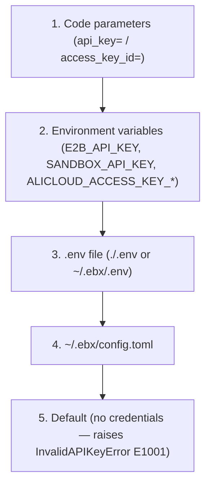

# Authentication

Easy Sandbox supports two authentication modes: **API Key** and **AK/SK (Alibaba Cloud AccessKey)**.

> **Historical note**: the `ebx auth` CLI command group (`login`/`logout`/`status`/`switch`) was removed before the first stable release (`0.1.0`). Credentials are configured with the environment variables and `ebx config set api_key` shown below; check the effective state with `ebx config list`.

---

## Authentication Overview

Easy Sandbox provides three authentication paths for different scenarios:

- **API Key mode**: The most common approach. Accesses the platform API via the `Authorization: Bearer {api_key}` header. Suitable for personal development, CI/CD, SDK calls, and most other scenarios.
- **AK/SK mode (Alibaba Cloud AccessKey) 🧪 Experimental**: Uses an Alibaba Cloud AccessKey pair to obtain a temporary API Key via token exchange. The framework is implemented but the token exchange endpoint is pending FC platform confirmation; the recommended approach is still API Key mode. Suitable for Alibaba Cloud ecosystem integration and enterprise environments using RAM role authorization.
- **envd internal authentication**: After sandbox creation, the SDK communicates with the in-sandbox envd service using `envdAccessToken` (obtained from the creation response). This is an internal mechanism managed automatically by the SDK — no manual handling required.

---

## API Key Authentication

API Key is the most common authentication method, sent to the platform API via the `Authorization: Bearer {api_key}` header.

### Configuration Methods

#### 1. Environment variable (highest priority)

```bash
# Recommended variable name (E2B compatible)
export E2B_API_KEY="your-api-key"

# Or use an alternative variable name
export SANDBOX_API_KEY="your-api-key"
```

When both `E2B_API_KEY` and `SANDBOX_API_KEY` are present, `E2B_API_KEY` takes precedence.

#### 2. ebx config set (persisted to local file)

```bash
ebx config set api_key your-api-key
# Writes to ~/.ebx/.env
# File permissions: 600 (owner read/write only)
```

Stored as `E2B_API_KEY=your-key` in `~/.ebx/.env`.

#### 3. ebx config set

```bash
ebx config set api_key your-api-key
```

This command also writes to `~/.ebx/.env`.

#### 4. .env file

Create a `.env` file in the project root directory:

```dotenv
E2B_API_KEY=your-api-key
```

The SDK searches for `.env` files in the following order:
1. `.env` in the current directory
2. `~/.ebx/.env`

#### 5. config.toml file

Set in `~/.ebx/config.toml`:

```toml
[transport]
api_key = "your-api-key"
```

#### 6. Code parameter (highest priority override)

```python
from easy_sandbox.api.sandbox import Sandbox

# Pass directly when creating
sandbox = await Sandbox.create(api_key="your-api-key")

# Pass directly when connecting
sandbox = await Sandbox.connect("sbx-xxxx", api_key="your-api-key")
```

---

## AK/SK Alibaba Cloud Extended Authentication 🧪

> **⚠️ Experimental Feature**: The AK/SK → API Key token exchange framework is implemented in the SDK (`transport/auth.py`), but the token exchange endpoint’s action name (`CreateApiKey`) and response field parsing **are still pending FC platform team confirmation**. TTL (3600s) and early refresh time (300s) are assumed values, not validated against a real endpoint. This feature can be used for local debugging; **API Key authentication is still recommended for production environments**.

AK/SK mode uses an Alibaba Cloud AccessKey pair to obtain a temporary API Key via token exchange (designed TTL 3600 seconds, auto-refreshed 300 seconds before expiry).

### Configuration Methods

#### 1. Environment Variables

```bash
export ALICLOUD_ACCESS_KEY_ID="your-access-key-id"
export ALICLOUD_ACCESS_KEY_SECRET="your-access-key-secret"
```

#### 2. ebx config set (persisted to local file)

```bash
ebx config set access_key_id your-access-key-id
ebx config set access_key_secret your-access-key-secret
# Writes to ~/.ebx/.env
# File permissions: 600 (owner read/write only)
```

Stored as `ALICLOUD_ACCESS_KEY_ID=...` / `ALICLOUD_ACCESS_KEY_SECRET=...` in `~/.ebx/.env`.

#### 3. Code Parameters

```python
sandbox = await Sandbox.create(
    access_key_id="your-ak-id",
    access_key_secret="your-ak-secret",
)
```

### How AK/SK Works

1. The SDK uses the AK/SK to call the token exchange endpoint at `https://fcsandbox.{region}.aliyuncs.com` via Alibaba Cloud RPC (POP) V1 HMAC-SHA1 signing to obtain a temporary API Key
2. The temporary key is cached in memory (not persisted to disk)
3. Designed validity of 3600 seconds; the SDK auto-refreshes 300 seconds before expiry (actual parameters subject to FC platform final confirmation)
4. Subsequent requests use the temporary key as a Bearer Token

> **Note**: The above parameters (TTL, endpoint action name, etc.) are based on the ACR token exchange pattern and may be adjusted before production release.

---

## Configuration Priority Chain

Credentials are resolved in the following priority order (highest to lowest):


```mermaid
flowchart TD
    A["1. Code parameters (api_key= / access_key_id=)"] --> B["2. Environment variables (E2B_API_KEY, SANDBOX_API_KEY, ALICLOUD_ACCESS_KEY_*)"]
    B --> C["3. .env file (./.env or ~/.ebx/.env)"]
    C --> D["4. ~/.ebx/config.toml"]
    D --> E["5. Default (no credentials — raises InvalidAPIKeyError E1001)"]
```

Within the same level, API Key takes precedence over AK/SK:
- If both `api_key` and `access_key_id` are provided, API Key is used
- If both `E2B_API_KEY` and `ALICLOUD_ACCESS_KEY_ID` are set, E2B_API_KEY is used

---

## CLI Authentication Management

```bash
# Set API Key
ebx config set api_key your-api-key

# Set AK/SK (experimental)
ebx config set access_key_id your-access-key-id
ebx config set access_key_secret your-access-key-secret

# View current configuration
ebx config list
# Output includes the source of api_key / access_key_id etc. (user/default)

# Or view api_key directly
ebx config get api_key
ebx config get access_key_id
```

---

## Secret Storage (File-Based)

Secrets are stored in `~/.ebx/secrets.json`, a plaintext JSON file protected by `chmod 600` file permissions. This is suitable for local development only.

> **⚠️ Warning**: `secrets.json` stores secrets in **plaintext**. It relies solely on POSIX file permissions (`chmod 600`) for access control. For production environments, use a dedicated secrets management service.

Manage secrets via environment variables or configuration:

```bash
# Set API Key via environment variable (recommended)
export E2B_API_KEY="your-api-key"

# Or persist via ebx config
ebx config set api_key your-api-key
```

Inject secrets when creating a sandbox via `--env` parameters:

```bash
ebx create --template base --env MY_TOKEN=your-secret-value --env ANOTHER_SECRET=another-value
```

> **Historical note**: macOS Keychain integration was removed in the overdesign cleanup (ADR 2026-09-23). The `ebx secret` CLI command group has also been removed. All secret management is now done through environment variables, `.env` files, or `ebx config set`.

---

## envd Authentication (In-Sandbox Communication)

After sandbox creation, communication with the in-sandbox envd service uses `envdAccessToken` (obtained from the creation response). This is an internal mechanism managed automatically by the SDK — no manual handling required.

envd authentication requires the following HTTP headers (set automatically by the SDK):

| Header | Value |
|--------|-------|
| `X-Access-Token` | envdAccessToken |
| `E2b-Sandbox-Id` | Sandbox ID |
| `E2b-Sandbox-Port` | `49983` |
| `Authorization` | `Basic dXNlcjo=` (base64 of "user:") |

---

## Common Issues

### InvalidAPIKeyError (E1001)

```text
[E1001] API key cannot be empty
  Suggestion: Check your E2B_API_KEY environment variable or pass api_key parameter.
```

**Solution**: Ensure a valid API Key is configured via any of the methods above.

### InvalidCredentialsError (E1003)

```text
[E1003] AccessKey ID and Secret cannot be empty
  Suggestion: Check ALICLOUD_ACCESS_KEY_ID and ALICLOUD_ACCESS_KEY_SECRET environment variables.
```

**Solution**: Ensure both AK ID and AK Secret are set.

### TokenExpiredError (E1002)

```text
[E1002] The SDK should auto-refresh tokens. If this persists, check system clock synchronization.
```

**Solution**: Check that the system clock is accurate. The SDK auto-refreshes tokens; if this error persists, the clock skew may be too large.
