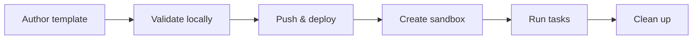

# From Template to Production Sandbox: End-to-End Guide

This guide walks you through the complete workflow of a custom sandbox template, from authoring to production use.



---

## Prerequisites

- Docker Desktop running (for local image builds)
- Python 3.10+
- Install the SDK **with the `[cli]` extra**:

```bash
pip install "easy-sandbox[cli,alicloud]"
```

> **Why the `[cli]` extra matters**: the CLI features used throughout this guide — reading defaults from `template.yaml` (YAML parsing), parsing `.env` files, and installing templates from a registry — depend on the `[cli]` extra, which pulls in **PyYAML** and **python-dotenv**. A bare `pip install easy-sandbox` does **not** include these, so those features will be unavailable.

- Alibaba Cloud AK/SK credentials configured in a `.env` file:

```env
ALICLOUD_ACCESS_KEY_ID=your-access-key-id
ALICLOUD_ACCESS_KEY_SECRET=your-access-key-secret
ACR_NAMESPACE=your-acr-namespace
```

- An ACR namespace created in the Alibaba Cloud ACR console (one-time setup). In the console, open **Container Registry (ACR) → Namespaces → Create Namespace**, then use that namespace name as `ACR_NAMESPACE` (or the `--acr-namespace` flag).

> For authentication details, see [Authentication](authentication.md).

---

## Alternative Starting Point: Install a Template from a Registry

If you'd rather not author a template from scratch, use `ebx install` (alias of `ebx template install`) to fetch a ready-made template from a GitHub repo. The source of truth for official & community templates is [awesome-templates](https://github.com/Easy-Sandbox/awesome-templates) — discover templates with `ebx template search <query>` against the remote index, then install by name with `ebx template install <name>` (full `owner/repo[//subdir][@ref]` references also work).

> **`install` now runs the full pipeline by default.** `ebx install <ref> --acr-namespace <ns>` **downloads → builds the image → pushes to ACR → deploys** the template via the official CreateTemplate API in a single command. To only fetch the sources into the local cache (`~/.ebx/templates/`) without building or deploying, add `--download-only`, then run `ebx template build` / `ebx template deploy` later.

> ⚠️ **Cost & safety**: the default `install` (and `ebx template deploy`) push images to your ACR registry and call the official `CreateTemplate` API on your Alibaba Cloud account — these operations may incur charges. Use `--download-only` when you only want to inspect the sources.

### Install options

| Option | Description |
|--------|-------------|
| `--acr-namespace` | ACR namespace for the build + deploy step (env `ACR_NAMESPACE`, or set in `.env`) |
| `--cpu` | CPU cores (default: from `template.yaml` or 2) |
| `--memory` | Memory in MB (default: from `template.yaml` or 2048) |
| `-y`, `--yes` | Skip the confirmation prompt |
| `--download-only` | Only download to the local cache (skip build and deploy) |
| `--dir PATH` | Download template source to a custom directory instead of `~/.ebx/templates` |

### Reference syntax

```text
owner/repo                # Whole repository (default branch)
owner/repo//subdir        # Subdirectory of a repository
owner/repo@main           # Specific branch
owner/repo//subdir@v1.0   # Subdirectory + specific tag/branch/commit sha
./my-template             # Local directory
```

Subdirectories are separated by a double slash `//`, and the version reference is an `@` suffix (tag, branch, or commit sha — fetched via the GitHub tarball API, no Release required). Private repositories and higher rate limits: prefer `ebx config set github_token` (masked input, stored once in `~/.ebx/.env`) over the one-off `--token <github-token>` override, which may leak into shell history or the process list.

### Download only: inspect the sources first

With `--download-only`, `install` just fetches the template into the local cache — it never builds or deploys:

```bash
$ ebx template install Easy-Sandbox/awesome-templates//python-hello --download-only
Fetching template from Easy-Sandbox/awesome-templates...
Alias   python-hello
Source  /Users/anycodes/.ebx/templates/Easy-Sandbox/awesome-templates/default/python-hello
Cached  /Users/anycodes/.ebx/templates/Easy-Sandbox/awesome-templates/default/python-hello
Status  installed-locally
Template 'python-hello' installed to the local cache. Build and push the image with 'ebx template build'.
```

The template sources are cached at `~/.ebx/templates/{owner}/{repo}/{ref}/{name}/` (`ref` is `default` when not specified) and can be inspected directly:

```bash
$ ls ~/.ebx/templates/Easy-Sandbox/awesome-templates/default/python-hello/
Dockerfile      README.md       commands.py     template.yaml

$ cat ~/.ebx/templates/Easy-Sandbox/awesome-templates/default/python-hello/template.yaml
name: python-hello
version: "1.0.0"
description: "A minimal Python hello world template for testing"
author: "Easy-Sandbox"
tags:
  - python
  - hello-world
  - example

base: ubuntu:22.04

system_packages:
  - python3
  - python3-pip

capabilities:
  - shell
  - files
  - code
  - ports

ports:
  - 9000

custom_commands:
  run:
    cmd: "python3 {file}"
    description: "Run a Python script"
    cwd: "/app"
    timeout: 60
    args:
      - name: file
        default: "main.py"
        description: "Python file to execute"
  test:
    cmd: "python3 -m pytest {path}"
    description: "Run tests with pytest"
    cwd: "/app"
    timeout: 120
    args:
      - name: path
        default: "."
        description: "Test path or file"

env:
  LANG: C.UTF-8
```

Install another template, node-web:

```bash
$ ebx template install Easy-Sandbox/awesome-templates//node-web --download-only
Fetching template from Easy-Sandbox/awesome-templates...
Alias   node-web
Source  /Users/anycodes/.ebx/templates/Easy-Sandbox/awesome-templates/default/node-web
Cached  /Users/anycodes/.ebx/templates/Easy-Sandbox/awesome-templates/default/node-web
Status  installed-locally
Template 'node-web' installed to the local cache. Build and push the image with 'ebx template build'.
```

A local directory works the same way:

```bash
$ ebx install ./my-template --download-only
Using local template from ./my-template...
Alias   my-template
Source  ./my-template
Cached  ~/.ebx/templates/my-template
Status  installed-locally
Template 'my-template' installed to the local cache. Build and push the image with 'ebx template build'.
```

### Default: download, build, and deploy in one shot

Without `--download-only`, `install` runs the whole pipeline. It needs an ACR namespace for the build + deploy step; if none is provided (via `--acr-namespace`, `ACR_NAMESPACE`, or `.env`), it stops before building and tells you exactly how to fix it:

```bash
$ ebx install ./my-template -y
Using local template from ./my-template...
Cannot build + deploy. Missing prerequisites:
  • Missing ACR namespace. Provide via:
  1. ebx config set acr_namespace <ns>   (or re-run 'ebx config init')
  2. --acr-namespace flag
  3. export ACR_NAMESPACE=<ns>
  4. ACR_NAMESPACE=<ns> in .env (CWD or ~/.ebx/.env)

Run with --download-only to just download the template.
```

Provide the namespace to run the full flow (equivalent to `ebx template deploy`):

```bash
ebx install Easy-Sandbox/awesome-templates//python-hello --acr-namespace my-ns
```

### What to do after `--download-only`

- **Deploy it to your own platform account**: run `ebx template deploy <cache-path>` on the cached directory (or `ebx template build` for a step-by-step build & push) — the workflow is identical to Step 3 below.
- **The template is already deployed on the platform**: skip install entirely and create a sandbox by template name (`ebx create --template python-hello`).
- **Iterate locally**: the cache directory is plain template source — copy it out, modify it, and follow the full workflow in this guide.

---

## Step 1: Author the Template

### Scaffold a new template (recommended)

The fastest way to start is the built-in scaffold. `ebx template init` generates a ready-to-edit template directory, so you no longer have to hand-write `template.yaml` / `Dockerfile` / `commands.py` from memory.

When the `DIRECTORY` argument is omitted, the scaffold creates a new subdirectory `./<name>` in the current working directory. The `<name>` is resolved by priority: `--name` > scaffold case name (the `-t` value) > template name from `--from`.

List the available scaffold cases:

```bash
$ ebx template init --list
  python       Python 3.11 sandbox with shell, files, and code capabilities
  node         Node.js 20 sandbox with shell, files, and code capabilities
  minimal      Bare-minimum template with only template.yaml + Dockerfile
```

Scaffold a Python template into `./my-template`:

```bash
$ ebx template init -t python ./my-template
✅ Template 'my-template' created in ./my-template
Created files:
  Dockerfile
  README.md
  commands.py
  template.yaml

Next steps:
  ebx template deploy ./my-template --acr-namespace <ns>
  ebx install ./my-template --acr-namespace <ns>
```

> Scaffolding and credentials setup are separate commands: `ebx template init` (this section) writes local files only, while `ebx config init` stores credentials and `ebx create` launches a cloud sandbox. `ebx init` is a top-level shortcut delegating to the exact same command as `ebx template init`.

### Adapt a project that already has source code

When the directory is an application (Flask, Express, a script) and has no `Dockerfile` / `template.yaml`, use `--adopt`. Qwen Code sees a copy; ebx writes `Dockerfile`, `commands.py`, `template.yaml`, and a `.dockerignore` when you don't already have one, into that same directory.

```bash
$ ebx template init --adopt ./my-app --hint "listens on 8080"
# review the preview, then:
$ ebx deploy ./my-app --acr-namespace my-ns
```

`--dry-run` lists every file that would be sent and contacts no model. `-y` is required outside an interactive terminal. Secrets (`.env`, keys, secret-looking files) stay out of the copy, and the agent process does not inherit cloud credentials. The full rules — backups, `--force`, and what is rejected before a write — are in [Authoring Templates — Adapt an existing project](authoring-templates.md#adapt-an-existing-project).

`ebx template init "DESCRIPTION"` is the other AI path: it creates a **new** directory from a sentence. `--adopt` fills in the project you already have.

### Understand the generated files

The scaffold produces the same file layout you would otherwise write by hand:

```text
my-template/
├── template.yaml    # Template definition (name, capabilities, resources)
├── Dockerfile       # Container build file
├── commands.py      # Server-side command registration (optional)
└── README.md        # Documentation
```

#### template.yaml

The generated `template.yaml` (python case):

```yaml
name: my-template
version: "1.0.0"
description: "Python sandbox template"

base: python:3.11-slim

capabilities:
  - shell
  - files
  - code

resources:
  cpu: 2
  memory: 2048
```

**Key fields:**

| Field | Description |
|-------|-------------|
| `name` | Unique template identifier, used with the `--template` flag |
| `base` | Base Docker image (informational when a Dockerfile is present) |
| `capabilities` | Runtime capability declarations: `shell`, `files`, `code`, `terminal`, `ports` |
| `resources.cpu` | CPU cores (can be overridden via CLI flags at deploy time) |
| `resources.memory` | Memory in MB (can be overridden via CLI flags at deploy time) |

For the full field specification, see [template.yaml Spec](../reference/template-yaml-spec.md).

#### Dockerfile

The generated `Dockerfile` (python case):

```dockerfile
FROM python:3.11-slim

ENV DEBIAN_FRONTEND=noninteractive

# Install easy-sandbox SDK.
# When building locally via `ebx template deploy`, the SDK wheel
# is automatically injected into the build context as .whl file.
COPY *.whl /tmp/
RUN if ls /tmp/*.whl 1>/dev/null 2>&1; then \
        pip install --no-cache-dir /tmp/*.whl && rm -f /tmp/*.whl; \
    else \
        pip install --no-cache-dir easy-sandbox; \
    fi

WORKDIR /app
COPY commands.py .

EXPOSE 9000
CMD ["python3", "commands.py"]
```

> **The `.whl` injection pattern**: When you run `ebx template deploy`, the SDK automatically injects the current version's wheel file into the Docker build context, ensuring the container runs the same SDK version as the host. From a source checkout the wheel is built from the working tree; when `ebx` was installed from PyPI (or is the standalone binary) the released wheel of the same version is downloaded from PyPI and its SHA-256 verified. If neither is possible (an unreleased build, or PyPI is unreachable), nothing is injected and the fallback `pip install easy-sandbox` runs inside the image. The `COPY *.whl` + fallback pattern above is the recommended way to consume it.

### Custom commands (optional)

Declare named commands in the generated `template.yaml` to invoke them directly via `ebx run <sandbox-id> <command>`:

```yaml
custom_commands:
  dev:
    cmd: "python -m http.server {port}"
    description: "Start the dev server"
    cwd: "/app"
    timeout: 0
    args:
      - name: port
        default: "8080"
        description: "Listening port"

  test:
    cmd: "python -m pytest {path} -v"
    description: "Run tests"
    cwd: "/app"
    timeout: 120
    args:
      - name: path
        default: "."
        description: "Test path"
```

For more advanced templates (with a `commands.py` server-side command registration), see the [node-web example](https://github.com/Easy-Sandbox/awesome-templates/tree/main/node-web) in the template source-of-truth repository.

---

## Step 2: Validate Locally

Before deploying, verify the Dockerfile builds correctly on your machine:

```bash
# Build the image (must target linux/amd64 — the FC runtime is x86_64)
docker build --platform linux/amd64 --provenance=false -t my-app:test ./my-template

# Quick smoke test
docker run --rm my-app:test python3 -c "print('OK')"
```

> **About `--provenance=false`**: Docker Buildx adds an attestation manifest by default, which makes Alibaba Cloud FC image optimization fail (the template gets stuck in the `error` state). It appears in the manual `docker build` above only because that command bypasses the SDK. When you deploy via `ebx template deploy`, **the SDK auto-injects `--provenance=false` for you whenever BuildKit is enabled**, so you normally do **not** need to add it yourself. Set `DOCKER_BUILDKIT=0` to skip the auto-injection.

---

## Step 3: Deploy the Template

### One-command deploy (recommended)

```bash
# Make sure ACR_NAMESPACE is set in .env
ebx template deploy ./my-template
```

The `deploy` command performs 5 steps internally:

1. **Docker build** — build the image locally (platform `linux/amd64`, `provenance=false`)
2. **ACR login** — automatically exchange AK/SK for a temporary token and log in to ACR
3. **Docker push** — push the image to your ACR repository
4. **CreateTemplate API** — call the official Alibaba Cloud FCSandbox API to create the template
5. **Poll until READY** — poll the template status until the build completes

> ⚠️ **Cost & safety**: `ebx template deploy` (and the default `ebx install`) push images to your ACR registry and call the official `CreateTemplate` API on your Alibaba Cloud account — these operations may incur charges. Only deploy templates you intend to run.

During the build step, when BuildKit is enabled the SDK auto-injects `--provenance=false` and prints a notice — you don't need to add the flag yourself (set `DOCKER_BUILDKIT=0` to skip):

```
ℹ 已自动添加 --provenance=false（避免 FC 镜像优化失败；设置 DOCKER_BUILDKIT=0 可跳过）
```

### Custom parameters

```bash
ebx template deploy ./my-template \
  --acr-namespace my-ns \
  --tag v1.0 \
  --cpu 4 \
  --memory 4096
```

Common options:

| Option | Description | Default |
|--------|-------------|---------|
| `--acr-namespace` | ACR namespace | Read from env or `.env` |
| `--tag` | Image tag | `latest` |
| `--cpu` | CPU cores | From `template.yaml`, fallback 2 |
| `--memory` | Memory in MB | From `template.yaml`, fallback 2048 |
| `--disk-size` | Disk size in MB | Platform default |
| `--timeout` | Build timeout in seconds | 600 |
| `-v, --verbose` | Stream full Docker build logs | Off |

### Verify the deployment

After deploying, list templates with `--official-api` to see the **real names and statuses** (`ready` / `building` / `error`). Below is real run output (2026-09-28, cn-hangzhou, truncated for brevity):

```bash
$ ebx template list --official-api
┏━━━━━━━━━━━━━━━━━━━━━━┳━━━━━━━━━━━━━━━━━━━━━━━━━━━━━┳━━━━━━━┳━━━━━━━━┓
┃ TemplateID           ┃ Name                        ┃ Alias ┃ Status ┃
┡━━━━━━━━━━━━━━━━━━━━━━╇━━━━━━━━━━━━━━━━━━━━━━━━━━━━━╇━━━━━━━╇━━━━━━━━┩
│ 3tz9v7mdijd9fvkthpq0 │ hermes-agent                │       │ ready  │
│ mia0t3obep8encseaib4 │ codex-agent                 │       │ ready  │
│ dc19rvfbyawxnq64o6ic │ python-hello-prov           │       │ ready  │
│ jc5x7mzsyshg32a15oq5 │ python-hello-v2             │       │ error  │
│ hbsmn7ha04wf9b5klgju │ e2e-python-hello            │       │ error  │
│ 9k0lq3mhdamdm7hy3cgb │ python-hello                │       │ ready  │
│ ogkhjuge1bz34knk5u1v │ node-web                    │       │ ready  │
│ 216g37mamkdfhzrauvxk │ base                        │       │ ready  │
│ … (36 templates in this account, truncated here)
└──────────────────────┴─────────────────────────────┴───────┴────────┘
```

> **Status meaning**: only `ready` templates can successfully create sandboxes. Templates in the `error` state above (e.g. `python-hello-v2`, `e2e-python-hello` — usually caused by a failed image build/optimization, see [Troubleshooting](#troubleshooting)) cannot be used with `ebx create`.

Without `--official-api`, the E2B-compatible endpoint is used and only template IDs are returned (no name/status):

```bash
$ ebx template list
┏━━━━━━━━━━━━━━━━━━━━━━┳━━━━━━━┳━━━━━━━━┓
┃ TemplateID           ┃ Alias ┃ Status ┃
┡━━━━━━━━━━━━━━━━━━━━━━╇━━━━━━━╇━━━━━━━━┩
│ 3tz9v7mdijd9fvkthpq0 │ N/A   │ N/A    │
│ lusxjk8livn9cxs5yl0d │ N/A   │ N/A    │
│ … (36 total, truncated here)
└──────────────────────┴───────┴────────┘
```

Inspect a single template:

```bash
$ ebx template info <template-id> --official-api
```

### Parameter defaults priority

CLI flags > declarations in `template.yaml` > hardcoded defaults. See the [CLI Reference](../reference/cli-reference.md) for the full priority chain.

---

## Step 4: Use the Sandbox

### CLI workflow (real run transcript)

> **About the output below**: all of it was captured from **real `ebx` commands executed on 2026-09-28 in the cn-hangzhou region** — nothing is fabricated. To keep the key results focused, the capability-fallback warning that each command prints **once** on stderr (expected when `base` has no locally cached `template.yaml`) is omitted. Since task 167 that warning is a single `WARNING:` line on the diagnostic channel — results stay on stdout and never mix with it — so the formerly duplicated timestamped log line is gone. The sandbox ID `sbx-93276a52-1559-466a-8de9-19d5af644283` was really generated by this run and has the format `sbx-<UUID>`; replace `<SANDBOX_ID>` in the commands below with your own ID.

**① Create a sandbox**

```bash
$ ebx create --template base
ID           sbx-93276a52-1559-466a-8de9-19d5af644283
Status       running
Template     base
URL          https://49983-sbx-93276a52-1559-466a-8de9-19d5af644283.cn-hangzhou.e2b.fc.aliyuncs.com
EnvdVersion  0.5.2
Sandbox sbx-93276a52-1559-466a-8de9-19d5af644283 created successfully.
```

**② Inspect the sandbox**

```bash
$ ebx info <SANDBOX_ID>
ID           sbx-93276a52-1559-466a-8de9-19d5af644283
Template     base
Status       running
Region       cn-hangzhou
Timeout      300s
URL          https://49983-sbx-93276a52-1559-466a-8de9-19d5af644283.cn-hangzhou.e2b.fc.aliyuncs.com
EnvdVersion  0.5.2
Started      2026-09-28 04:03:13.302944+00:00
Metadata     {'fcSessionDetails': '{"containerId":"c-6ab9e700-…","sessionIdleTimeoutInSeconds":300,"sessionStatus":"Active"}', 'fcSessionID': 'd60cf963-…', …}   # truncated
```

**③ Execute shell commands**

```bash
$ ebx exec <SANDBOX_ID> 'echo "Hello from sandbox"'
Hello from sandbox

$ ebx exec <SANDBOX_ID> 'node --version'
v20.20.2

$ ebx exec <SANDBOX_ID> 'python3 -c "print(2+2)"'
4
```

**④ List a directory**

```bash
$ ebx exec <SANDBOX_ID> 'ls -la /home/user'
total 40
drwxr-xr-x 1 user user 4096 Jul 19 08:08 .
drwxr-xr-x 1 root root 4096 Jul  9 07:32 ..
-rw-r--r-- 1 user user  220 Mar  8  2026 .bash_logout
-rw-r--r-- 1 user user 3526 Mar  8  2026 .bashrc
drwxr-xr-x 3 user user 4096 Jul 19 08:08 .config
-rw-r--r-- 1 user user   40 Jul 19 08:08 .npmrc
-rw-r--r-- 1 user user  807 Mar  8  2026 .profile
drwxr-xr-x 2 user user 4096 Jul 16 13:58 log
drwxr-xr-x 2 user user 4096 Jul 16 13:58 workspace
```

**⑤ Write and read a file**

```bash
$ ebx exec <SANDBOX_ID> 'sh -c "echo hello > /home/user/test.txt"'
# (no stdout, exit code 0)

$ ebx exec <SANDBOX_ID> 'cat /home/user/test.txt'
hello
```

**⑥ Upload / download files**

```bash
$ echo "uploaded from local" > /tmp/ebx_e2e_test.txt

$ ebx upload <SANDBOX_ID> /tmp/ebx_e2e_test.txt /home/user/uploaded.txt
Uploaded /tmp/ebx_e2e_test.txt -> /home/user/uploaded.txt

$ ebx download <SANDBOX_ID> /home/user/uploaded.txt /tmp/ebx_e2e_download.txt
Downloaded /home/user/uploaded.txt -> /tmp/ebx_e2e_download.txt

$ cat /tmp/ebx_e2e_download.txt
uploaded from local
```

**⑦ Show sandbox system info**

```bash
$ ebx sandbox system info <SANDBOX_ID>
OS             Linux
Arch           x86_64
Hostname       c-6ab9e700-1550f19f-ec5ff9d3d0af
CPU_Count      2
Python         3.13.13
Disk_Total_GB  9.81
Disk_Free_GB   9.29
```

**⑧ List running sandboxes**

```bash
$ ebx list
┏━━━━━━━━━━━━━━━━━━━━━━━━━━━━━━━━━━━━━━━━━━┳━━━━━━━━━━┳━━━━━━━━━┳━━━━━━━━━━━━━┓
┃ ID                                       ┃ Template ┃ Status  ┃ Region      ┃
┡━━━━━━━━━━━━━━━━━━━━━━━━━━━━━━━━━━━━━━━━━━╇━━━━━━━━━━╇━━━━━━━━━╇━━━━━━━━━━━━━┩
│ sbx-93276a52-1559-466a-8de9-19d5af644283 │ base     │ running │ cn-hangzhou │
└──────────────────────────────────────────┴──────────┴─────────┴─────────────┘
```

> **Tip**: right after a sandbox is created, the server-side list may lag briefly (eventual consistency). If `ebx list` is momentarily empty, wait a few seconds and retry.

**⑨ Kill the sandbox and verify**

```bash
$ ebx kill <SANDBOX_ID> -y
Sandbox sbx-93276a52-1559-466a-8de9-19d5af644283 killed.

$ ebx info <SANDBOX_ID>          # verify: destroyed, returns 404
[E5000] Resource not found (HTTP 404).
  Suggestion: Verify the sandbox ID, template ID, or endpoint URL.

$ ebx list
No sandboxes found.
```

### Template name resolution (real failure case)

`--template` accepts either a template **name** or an **ID**, but only a template that is `ready` and whose image starts successfully can be created. Below is the real output when creating `python-hello` — even though `ebx template list --official-api` shows a `ready` `python-hello`, this create attempt had its connection reset by the platform during cold start:

```bash
$ ebx create --template python-hello
[E5003] Connection reset by remote: <StreamReset stream_id:1, error_code:2, remote_reset:True>
  Suggestion: The platform closed the connection before responding. This usually means the operation took too long (e.g., sandbox cold start). Try:
  1. Increase HTTP timeout: ebx config set http_timeout 120
  2. Retry the command
  3. Disable HTTP/2: ebx config set http2 false
```

Retrying multiple times under `http_timeout=120` and `http2=false` still failed, eventually reporting a request timeout:

```bash
$ ebx create --template python-hello
[E3001] Request timed out: 
  Suggestion: The HTTP request timed out. Try:
  1. Increase HTTP timeout: ebx config set http_timeout 120
  2. Or set env: export SANDBOX_HTTP_TIMEOUT=120
  3. Check network connectivity
```

> **Takeaway**: before creating, confirm the target template is `ready` via `ebx template list --official-api`; when several same-prefix names exist (e.g. `python-hello` / `python-hello-v2` / `python-hello-prov`), prefer the **template ID** to avoid ambiguity. If a `ready` template still times out, it is usually a slow image cold start — increase `http_timeout` or retry (see [Troubleshooting](#troubleshooting)).

### SDK workflow (Python)

```python
import asyncio
from easy_sandbox.api.sandbox import Sandbox

async def main():
    # Create a sandbox
    sandbox = await Sandbox.create(template="my-app")
    print(f"Sandbox ID: {sandbox.id}")

    # Execute shell commands
    result = await sandbox.commands.run("python3 -c 'print(42)'")
    print(result.stdout)  # "42\n"

    # File operations
    await sandbox.files.write("/app/data.json", '{"key": "value"}')
    content = await sandbox.files.read("/app/data.json")
    print(content)

    # Run code (Code Interpreter)
    result = await sandbox.run_code("print('hello from sandbox')")
    print(result.text)

    # Cleanup
    await sandbox.kill()

asyncio.run(main())
```

**Sync variant** (handy for scripts):

```python
from easy_sandbox.api.sandbox import Sandbox

sandbox = Sandbox.create_sync(template="my-app")
result = sandbox.commands.run_sync("echo hello")
print(result.stdout)
sandbox.kill_sync()
```

**Context manager pattern** (recommended — automatic cleanup):

```python
import asyncio
from easy_sandbox.api.sandbox import Sandbox

async def main():
    async with await Sandbox.create(template="my-app") as sandbox:
        result = await sandbox.commands.run("echo hello")
        print(result.stdout)
    # The sandbox is automatically killed after exiting the with block

asyncio.run(main())
```

### Agent workflow pattern

This is the canonical pattern for AI Agent scenarios — create a sandbox, run task code, collect the result, then destroy it:

```python
import asyncio
from easy_sandbox.api.sandbox import Sandbox

async def agent_workflow(task_code: str) -> str:
    """Agent → create sandbox → exec code → read result → kill sandbox"""
    async with await Sandbox.create(template="my-app") as sandbox:
        # Write the task code
        await sandbox.files.write("/app/task.py", task_code)

        # Execute
        result = await sandbox.commands.run("python3 /app/task.py")

        # Read the output
        if result.exit_code == 0:
            try:
                output = await sandbox.files.read("/app/output.txt")
                return output
            except Exception:
                return result.stdout
        else:
            return f"Error (exit {result.exit_code}): {result.stderr}"

# Usage
result = asyncio.run(agent_workflow("""
import json
data = {"status": "done", "items": [1, 2, 3]}
with open("/app/output.txt", "w") as f:
    json.dump(data, f)
print("Task completed")
"""))
print(result)
```

---

## Step 5: Clean Up & Iterate

### Kill sandboxes

```bash
# Kill a specific sandbox
ebx kill <sandbox-id>

# Kill all running sandboxes
ebx kill --all --yes
```

> ⚠️ **Data loss warning**: `ebx kill --all` destroys **every** running sandbox in your account, and their in-memory/ephemeral data is lost permanently. Without `--yes` the CLI asks for confirmation first — only add `-y/--yes` in automation where you're certain no sandbox needs to survive.

### Update the template

Edit the template files and re-deploy (use a new tag to avoid caching):

```bash
# Edit the template
vim ./my-template/Dockerfile

# Re-deploy with a new version tag
ebx template deploy ./my-template --tag v1.1
```

### Delete the template

```bash
ebx template delete <template-id>
```

---

## Troubleshooting

| Symptom | Possible cause | Solution |
|---------|---------------|----------|
| No Dockerfile | The directory is application source, not a template yet | `ebx template init --adopt .`, then `ebx deploy` |
| Confirmation required before project files are sent | Non-interactive `--adopt` without `-y` | Pass `-y`, or `--dry-run` to list the files without sending them |
| Docker build failed | Dockerfile syntax / network issue | Add `-v` to see detailed logs |
| ACR login failed | AK/SK expired or insufficient permissions | Verify credentials in `.env` |
| Template stuck in "building" | Platform-side image optimization in progress | Wait, or check with `ebx template info <id> --official-api` |
| Template in error state | Docker attestation not disabled | Ensure the build uses `--provenance=false` (handled by the SDK by default) |
| `E3001` Request timed out | HTTP timeout too short | `ebx config set http_timeout 120` |
| StreamReset / `E5003` | Slow platform cold start | Retry, or disable HTTP/2: `ebx config set http2 false` |
| Sandbox creation fails | Template image pull error | Check ACR image accessibility and permissions |
| Command returns 500 | Shell operators not wrapped | The SDK auto-wraps with `sh -c`; check the envd version |

For more, see [Troubleshooting](troubleshooting.md) and the [Error Codes Reference](../reference/error-codes.md).

---

## Further Reading

- [Authoring Templates](authoring-templates.md) — Full template development tutorial
- [template.yaml Spec](../reference/template-yaml-spec.md) — Complete field definitions
- [CLI Reference](../reference/cli-reference.md) — Full command cheat sheet
- [Authentication](authentication.md) — API Key / AK-SK dual authentication modes
- [Environment Variables](environment-variables.md) — Sandbox env var injection and scoping
- [SDK Usage Guide](sdk-usage.md) — Complete Python SDK usage
- [awesome-templates source of truth](https://github.com/Easy-Sandbox/awesome-templates) — the single source of truth for official & community template content, the index, and publishing (`ebx template search` / `ebx template install`)
