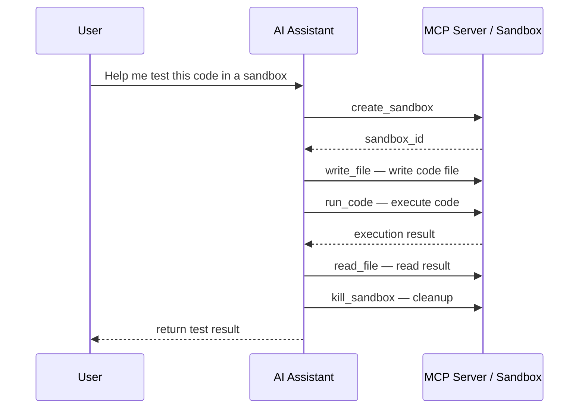

# MCP Integration

> **Rename notice**: This project has been renamed from Serverless Sandbox to **Easy Sandbox**. PyPI package: `easy-sandbox` (`pip install easy-sandbox`), CLI command: `ebx`, Python import: `easy_sandbox`.

Easy Sandbox provides an MCP (Model Context Protocol) Server, enabling AI IDEs and tools to operate sandboxes directly.

---

## What Is MCP

MCP (Model Context Protocol) is an open protocol that allows AI models to interact with external tools and services. The Easy Sandbox MCP Server runs over STDIO transport with JSON-RPC 2.0 protocol, providing sandbox operation capabilities to AI assistants.

---

## Install to IDE

### Cursor

```bash
ebx mcp install --target cursor
```

This command writes the Easy Sandbox Server configuration to Cursor's MCP config file.

### Claude Desktop

```bash
ebx mcp install --target claude
```

### VS Code

```bash
ebx mcp install --target vscode
```

### Check Installation Status

```bash
ebx mcp status
# Shows: MCP Server status, number of available tools, IDE installation status
```

---

## Available Tools

The MCP Server provides 7 tools:

| Tool | Description | Parameters |
|------|-------------|------------|
| `create_sandbox` | Create a new sandbox | `template` (optional, default code-interpreter-v1), `timeout` (optional) |
| `run_code` | Execute code in the sandbox | `sandbox_id`, `code`, `language` (optional, default python) |
| `run_command` | Execute a shell command in the sandbox | `sandbox_id`, `command`, `timeout` (optional) |
| `read_file` | Read a file from the sandbox | `sandbox_id`, `path` |
| `write_file` | Write a file to the sandbox | `sandbox_id`, `path`, `content` |
| `list_files` | List directory contents in the sandbox | `sandbox_id`, `path` (optional, default /app) |
| `kill_sandbox` | Destroy a sandbox | `sandbox_id` |

> **Note**: When `path` is omitted in `list_files`, it defaults to listing the `/app` directory. To view the root directory, explicitly pass `path="/"`.

---

## Usage Examples

### Using in Cursor

After installing MCP, the model can automatically invoke Easy Sandbox tools in Cursor's AI chat:

1. **Code execution**: "Run this Python code in a sandbox and show me the output"
2. **Environment setup**: "Create a sandbox, install flask and sqlalchemy, then run my project"
3. **File operations**: "Write this file to the /app directory in the sandbox"
4. **Debug assistance**: "Run pip list in the sandbox to see what packages are installed"

### Typical Workflow



---

## Manually Start the MCP Server

The MCP Server is usually started automatically by the IDE. To run it manually:

```bash
ebx mcp start [options]
```

| Option | Description |
|--------|-------------|
| `--template` | Default template (default code-interpreter-v1) |
| `--api-key` | API Key override |
| `--api-url` | API URL override |
| `--domain` | Domain override |

The server runs in STDIO mode, communicating with the caller via stdin/stdout.

---

## Technical Details

- **Transport protocol**: STDIO (standard input/output)
- **Message format**: JSON-RPC 2.0
- **Sandbox management**: The MCP Server internally maintains a `SandboxManager` that manages the lifecycle of multiple sandbox instances
- **Default template**: `code-interpreter-v1`

---

## Next Steps

- [CLI Tutorial](cli-tutorial.md) — Complete CLI tutorial
- [SDK Usage Guide](sdk-usage.md) — Use the SDK directly
- [CLI Reference](../reference/cli-reference.md) — Detailed MCP command reference
