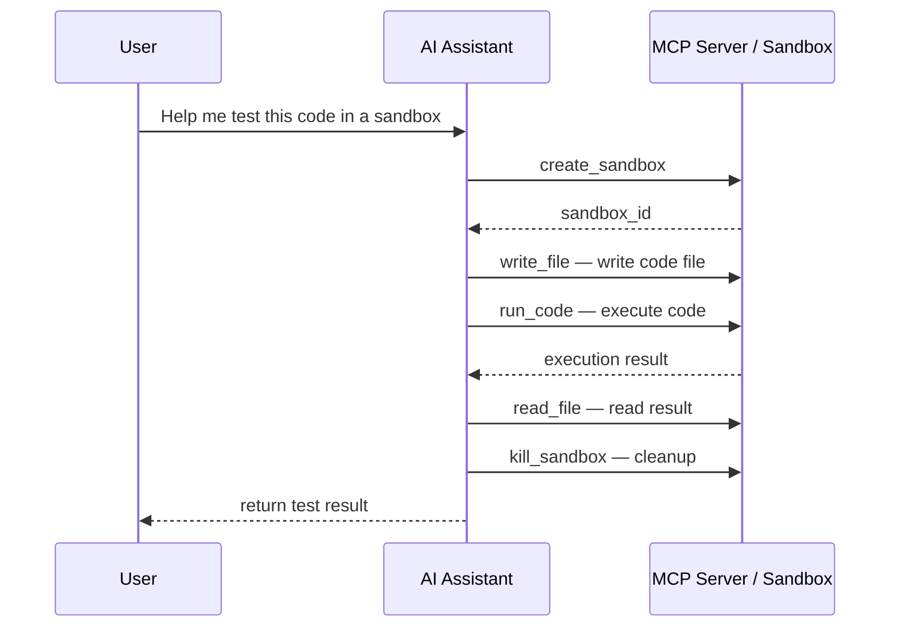

# MCP Integration

Easy Sandbox provides an MCP (Model Context Protocol) Server, enabling AI IDEs and tools to operate sandboxes directly.

---

## What Is MCP

MCP (Model Context Protocol) is an open protocol that allows AI models to interact with external tools and services. The Easy Sandbox MCP Server runs over STDIO transport with JSON-RPC 2.0 protocol, providing sandbox operation capabilities to AI assistants. A Streamable HTTP transport is also available for remote deployments (see below).

### Requirements

```bash
pip install "easy-sandbox[cli]"     # ebx CLI + MCP STDIO server
export E2B_API_KEY=your-api-key     # or: ebx config set api_key your-api-key
```

---

## Install to IDE

### Cursor

```bash
ebx mcp install --target cursor
```

Writes an `easy-sandbox` entry into `~/.cursor/mcp.json`, then restart Cursor.

### Claude Desktop

```bash
ebx mcp install --target claude
```

Writes into `claude_desktop_config.json` (location depends on OS), then restart Claude Desktop.

### VS Code

```bash
ebx mcp install --target vscode
```

Writes into the workspace `.vscode/settings.json` under the `mcp.servers` key, then reload the VS Code window.

All targets register the same STDIO command: `ebx mcp start`. The installer merges into existing config files — other MCP servers you have configured are preserved. When an API key is available (environment or `~/.ebx/.env`), it is embedded in the server's `env` block.

### Check Installation Status

```bash
ebx mcp status
# server, transport, tool list, auth_configured, installed_<ide> flags

ebx --json mcp status
```

---

## Available Tools

The MCP Server provides 7 tools:

| Tool | Description | Parameters |
|------|-------------|------------|
| `create_sandbox` | Create a new sandbox | `template` (optional, default code-interpreter-v1), `timeout` (optional, default 300), `envs` (optional) |
| `run_code` | Execute code in the sandbox | `code` (required), `sandbox_id` (optional), `language` (optional, default python), `timeout` (optional, default 30) |
| `run_command` | Execute a **bare shell** command in the sandbox | `command` (required), `sandbox_id` (optional), `cwd` (optional, default /app), `timeout` (optional, default 60) |
| `read_file` | Read a file from the sandbox | `path` (required), `sandbox_id` (optional), `encoding` (optional, default utf-8) |
| `write_file` | Write a file to the sandbox | `path`, `content` (required), `sandbox_id` (optional) |
| `list_files` | List directory contents in the sandbox | `path` (optional, default /app), `sandbox_id` (optional) |
| `kill_sandbox` | Destroy a sandbox | `sandbox_id` (optional; destroys the default sandbox when omitted) |

> **Note**: When `path` is omitted in `list_files`, it defaults to listing the `/app` directory. To view the root directory, explicitly pass `path="/"`.
>
> **Naming clarification**: The MCP tool `run_command` executes a **raw shell command** (equivalent to `sandbox.commands.run()` in the SDK). It is **not** related to the deprecated SDK method `Sandbox.run_command()`, which dispatches named custom commands — use `Sandbox.custom()` for that purpose.
>
> **Default sandbox**: The first tool call without `sandbox_id` automatically creates a default sandbox; subsequent calls without `sandbox_id` reuse it. The session's sandboxes are destroyed when the IDE closes the server (STDIO) or on `DELETE /mcp` / idle timeout (HTTP).

---

## Manually Start the MCP Server (STDIO)

The MCP Server is usually started automatically by the IDE. To run it manually (advanced):

```bash
ebx mcp start [options]
```

| Option | Description |
|--------|-------------|
| `--template` | Default template (default code-interpreter-v1) |
| `--api-key` | API Key override (env: `E2B_API_KEY`) |
| `--api-url` | API URL override (env: `E2B_API_URL`) |
| `--domain` | Domain override (env: `E2B_DOMAIN`) |

The server runs in STDIO mode, communicating with the caller via newline-delimited JSON-RPC 2.0 on stdin/stdout. You can smoke-test it without an IDE:

```bash
# initialize + tools/list over a pipe; the server replies on stdout
printf '%s\n' \
  '{"jsonrpc":"2.0","id":1,"method":"initialize","params":{}}' \
  '{"jsonrpc":"2.0","id":2,"method":"tools/list","params":{}}' \
  | ebx mcp start | head -n 2
```

---

## Remote Server (Streamable HTTP)

For team sharing or remote access, run the MCP Server as a Streamable HTTP service instead of STDIO.

### Run Locally with uvicorn

```bash
pip install "easy-sandbox[mcp]"

export EBX_MCP_AUTH_TOKEN=replace_me   # Bearer token (omit to disable auth)
export E2B_API_KEY=your-api-key

uvicorn easy_sandbox.agent.mcp_http:asgi_app --host 0.0.0.0 --port 9000
```

Endpoints: `POST /mcp` (JSON-RPC), `DELETE /mcp` (session termination), `GET /health` (health check). `GET /mcp` currently returns 501 (SSE notifications are not implemented).

You can also build the app programmatically:

```python
from easy_sandbox.agent.mcp_http import create_mcp_app

app = create_mcp_app(
    auth_token="replace_me",   # None disables client auth
    api_key="your-api-key",
    template="base",
)
```

### Bearer Token Authentication

When `EBX_MCP_AUTH_TOKEN` (or `auth_token`) is set, every request must carry:

```
Authorization: Bearer <token>
```

- Token unset → authentication disabled (fine for localhost testing, unsafe for remote)
- Token set but empty → **fails closed**: every request is rejected with 401

Tokens are compared with constant-time comparison. Generate one with `openssl rand -base64 32` or let `ebx mcp deploy --generate-token` create one.

### Client Configuration (Remote)

```json
{
  "mcpServers": {
    "easy-sandbox-remote": {
      "url": "http://your-server:9000/mcp",
      "headers": {
        "Authorization": "Bearer replace_me"
      }
    }
  }
}
```

---

## Generate an FC Deployment Artifact

`ebx mcp deploy` produces a ready-to-package artifact for Alibaba Cloud Function Compute. It does **not** call the FC API — you create the function manually via the console or SDK.

```bash
ebx mcp deploy \
  --generate-token \
  --api-key $E2B_API_KEY \
  --output-dir ./mcp-artifact
```

The artifact directory contains:

| File | Content |
|------|---------|
| `requirements.txt` | `easy-sandbox[mcp]`, `uvicorn>=0.29` |
| `app.py` | ASGI entry point reading FC env vars (`EBX_MCP_AUTH_TOKEN`, `E2B_API_KEY`, `E2B_API_URL`, `E2B_DOMAIN`, `EBX_TEMPLATE`) |
| `config.yaml` | YAML manifest with function name, region, runtime `python3.10`, handler `app.app`, memory/timeout, env vars, HTTP trigger (POST/GET/DELETE), session affinity |

The command prints: manual FC deployment steps (package → create function → create HTTP trigger → enable `Mcp-Session-Id` affinity if supported) and an IDE config template pointing at `<FC_HTTP_TRIGGER_URL>/mcp` with a masked Bearer token.

> **Security**: `config.yaml` contains your API key and Bearer token. Do not commit it to version control.

After deployment, configure clients with the trigger URL:

```json
{
  "mcpServers": {
    "easy-sandbox-remote": {
      "url": "https://<FC_HTTP_TRIGGER_URL>/mcp",
      "headers": { "Authorization": "Bearer <BEARER_TOKEN>" }
    }
  }
}
```

---

## Usage Examples

### Using in Cursor

After installing MCP, the model can automatically invoke Easy Sandbox tools in Cursor's AI chat:

1. **Code execution**: "Run this Python code in a sandbox and show me the output"
2. **Environment setup**: "Create a sandbox, install flask and sqlalchemy, then run my project"
3. **File operations**: "Write this file to the /app directory in the sandbox"
4. **Debug assistance**: "Run pip list in the sandbox to see what packages are installed"

### Typical Workflow


```mermaid
sequenceDiagram
    participant User as User
    participant AI as AI Assistant
    participant MCP as MCP Server / Sandbox

    User->>AI: Help me test this code in a sandbox
    AI->>MCP: create_sandbox
    MCP-->>AI: sandbox_id
    AI->>MCP: write_file — write code file
    AI->>MCP: run_code — execute code
    MCP-->>AI: execution result
    AI->>MCP: read_file — read result
    AI->>MCP: kill_sandbox — cleanup
    AI-->>User: return test result
```

### Run a Quick Code Snippet (HTTP, curl)

```bash
# 1. initialize (creates a session; capture Mcp-Session-Id)
curl -s http://localhost:9000/mcp \
  -H "Content-Type: application/json" \
  -H "Authorization: Bearer replace_me" \
  -d '{"jsonrpc":"2.0","id":1,"method":"initialize","params":{}}'

# 2. call a tool with the session header
curl -s http://localhost:9000/mcp \
  -H "Content-Type: application/json" \
  -H "Authorization: Bearer replace_me" \
  -H "Mcp-Session-Id: <SESSION_ID_FROM_STEP_1>" \
  -d '{"jsonrpc":"2.0","id":2,"method":"tools/call",
       "params":{"name":"run_code","arguments":{"code":"print(1+1)"}}}'

# 3. terminate the session (destroys its sandboxes)
curl -s -X DELETE http://localhost:9000/mcp \
  -H "Authorization: Bearer replace_me" \
  -H "Mcp-Session-Id: <SESSION_ID_FROM_STEP_1>"
```

---

## Troubleshooting

| Symptom | Likely cause | Fix |
|---------|--------------|-----|
| IDE shows the server as failed / no tools | `ebx` not on the IDE's `PATH` | Use an absolute command path in the IDE config, e.g. `/Users/you/.venv/bin/ebx` |
| Tools list works but every call errors | API key missing or invalid | `ebx mcp status` → `auth_configured`; set `E2B_API_KEY` or `ebx config set api_key` |
| `create_sandbox` fails after IDE restart | Backend API URL/region mismatch | Pass `--api-url` (or set `E2B_API_URL`) in the server args/env block |
| HTTP 401 on every request | Empty `EBX_MCP_AUTH_TOKEN` (fails closed) | Set a non-empty token or remove the variable to disable auth |
| HTTP 404 Unknown session | `Mcp-Session-Id` expired (idle TTL 3600 s) or instance restarted | Re-send `initialize` to create a new session |
| HTTP 503 session limit | More than 100 concurrent sessions in the process | Close idle sessions (`DELETE /mcp`) or raise `max_sessions` via `create_mcp_app()` |
| HTTP 501 on `GET /mcp` | SSE notifications not implemented | Expected — use `POST /mcp` only |

More general issues: see the [Troubleshooting guide](troubleshooting.md) and [error codes](../reference/error-codes.md).

---

## Technical Details

- **Transport protocols**: STDIO (newline-delimited JSON-RPC 2.0, protocol version 2024-11-05) and Streamable HTTP (spec 2025-06-18). `initialize` negotiates each transport's supported version — a supported requested `protocolVersion` is echoed back; missing or unsupported requests fall back to the transport's own version (so HTTP health and initialize both report 2025-06-18)
- **Sandbox management**: the server internally maintains a `SandboxManager` per session that manages the lifecycle of multiple sandbox instances
- **Default template**: `code-interpreter-v1` via `ebx mcp start`; `base` for the HTTP app and `ebx mcp deploy` artifacts
- **HTTP sessions**: idle TTL 3600 s, max 100 concurrent sessions per process, capacity exhaustion returns 503

---

## Next Steps

- [CLI Tutorial](cli-tutorial.md) — Complete CLI tutorial
- [SDK Usage Guide](sdk-usage.md) — Use the SDK directly
- [CLI Reference](../reference/cli-reference.md) — Detailed MCP command reference
- [MCP Server Design](../design/mcp-server.md) — Tools, transports, and FC deployment architecture
