# Error Codes Reference

> **Renaming Notice**: This project has been renamed from Serverless Sandbox to **Easy Sandbox**. PyPI package: `easy-sandbox` (`pip install easy-sandbox`), CLI command: `ebx`, Python import: `easy_sandbox`.

All SDK errors inherit from `SandboxError` and carry `code` (error code), `message`, `suggestion`, and `docs_url` attributes.

```python
from easy_sandbox.models.errors import SandboxError

try:
    sandbox = await Sandbox.create(template="nonexistent")
except SandboxError as e:
    print(f"[{e.code}] {e.message}")
    print(f"Suggestion: {e.suggestion}")
```

---

## E1xxx — Authentication Errors (AuthenticationError)

| Error Code | Exception Class | Meaning | Suggestion | Trigger Scenario |
|------------|----------------|---------|------------|------------------|
| E1000 | `AuthenticationError` | Authentication failed (base class) | — | General authentication errors |
| E1001 | `InvalidAPIKeyError` | Invalid or missing API Key | Check the `E2B_API_KEY` environment variable or pass the `api_key` parameter | Called an authenticated API without configuring any API Key |
| E1002 | `TokenExpiredError` | Authentication token expired | SDK should auto-refresh tokens; if persistent, check system clock synchronization | AK/SK temporary token expired and auto-refresh failed |
| E1003 | `InvalidCredentialsError` | Invalid AK/SK credentials | Check `ALICLOUD_ACCESS_KEY_ID` and `ALICLOUD_ACCESS_KEY_SECRET` environment variables | AK/SK is empty or malformed |

### Troubleshooting Steps

1. Run `ebx auth status` to confirm authentication status
2. Verify environment variables are correctly set
3. Confirm the API Key has not expired or been revoked
4. For E1002, check if the system clock is accurate (`date` command)

---

## E2xxx — Creation Errors (SandboxCreationError)

| Error Code | Exception Class | Meaning | Suggestion | Trigger Scenario |
|------------|----------------|---------|------------|------------------|
| E2000 | `SandboxCreationError` | Creation failed (base class) | — | General sandbox creation errors |
| E2001 | `TemplateNotFoundError` | Template does not exist | Run `ebx template list` to view available templates | Specified a non-existent template name |
| E2002 | `QuotaExceededError` | Quota exceeded | Destroy idle sandboxes or request a quota increase | Number of running sandboxes exceeds account quota |
| E2003 | `RegionUnavailableError` | Region unavailable | Try another region or check service availability | Requested region is temporarily unavailable or does not exist |
| E2004 | `TemplateParseError` | Template parse failure | Fix template.yaml (see validation errors); capabilities will not be granted until the template parses successfully | template.yaml has format errors or invalid fields |

### Troubleshooting Steps

1. Verify the template name is correct (`ebx template list`)
2. For E2002, check `ebx list` for idle sandboxes
3. For E2004, check template.yaml YAML syntax and field values

---

## E3xxx — Execution Errors (ExecutionError)

| Error Code | Exception Class | Meaning | Suggestion | Trigger Scenario |
|------------|----------------|---------|------------|------------------|
| E3000 | `ExecutionError` | Execution failed (base class) | — | General command/code execution errors |
| E3001 | `CommandTimeoutError` | Command execution timeout | Increase the `timeout` parameter or check if the command is hanging | `commands.run()` or `run_code()` exceeded timeout |
| E3002 | `ProcessError` | Non-zero exit code | — | Command returned a non-zero exit code (carries `exit_code`, `stdout`, `stderr` attributes) |
| E3003 | `CodeExecutionError` | Code execution failed | Check code syntax and runtime dependencies | Code Interpreter failed to execute code |
| E3004 | `CapabilityNotSupportedError` | Capability not enabled | Declare the required capability in the template's `capabilities` list, or use a template that supports it | Called a capability not declared by the template (e.g., calling `network.get_url()` on a template without `ports` capability) |

### E3004 Details

`CapabilityNotSupportedError` carries a `capability` attribute indicating the missing capability name.

```python
try:
    url = sandbox.network.get_url(8080)
except CapabilityNotSupportedError as e:
    print(f"Missing capability: {e.capability}")  # "ports"
```

**Standard capabilities**: `shell`, `files`, `code`, `terminal`, `ports`

**Default capability set**: `{shell, files, code}` (automatically granted when `capabilities` is not declared)

---

## E4xxx — Filesystem Errors (FileOperationError)

| Error Code | Exception Class | Meaning | Suggestion | Trigger Scenario |
|------------|----------------|---------|------------|------------------|
| E4000 | `FileOperationError` | File operation failed (base class) | — | General filesystem errors |
| E4001 | `FileNotFoundError_` | File or directory not found | Use `files.list()` to check available files, or `files.exists()` to verify the path | Reading/deleting a non-existent path |
| E4002 | `PermissionDeniedError` | Permission denied | Check file permissions in the sandbox | Operating on a file without permission |

> **Note**: The `FileNotFoundError_` class name has a trailing underscore to avoid shadowing Python's built-in `FileNotFoundError`.

---

## E5xxx — Network Errors (NetworkError)

| Error Code | Exception Class | Meaning | Suggestion | Trigger Scenario |
|------------|----------------|---------|------------|------------------|
| E5000 | `NetworkError` | Network error (base class) | — | General network connection errors |
| E5001 | `ConnectionError_` | Connection failed | Check network connectivity and firewall rules | Unable to connect to the sandbox service |

> **Note**: The `ConnectionError_` class name has a trailing underscore to avoid shadowing Python's built-in `ConnectionError`.

---

## E6xxx — Session Errors (SessionError)

| Error Code | Exception Class | Meaning | Suggestion | Trigger Scenario |
|------------|----------------|---------|------------|------------------|
| E6000 | `SessionError` | Session error (base class) | — | General session management errors |
| E6001 | `SessionNotFoundError` | Session not found | Run `ebx session list` to view available sessions | Connecting/stopping a non-existent session |
| E6002 | `SessionAlreadyExistsError` | Session name already exists | Use a different name, or stop the existing session first | Creating a session with a duplicate name |

---

## E7xxx — Deployment & Build Errors

### Deployment Errors (DeployError)

| Error Code | Exception Class | Meaning | Suggestion | Trigger Scenario |
|------------|----------------|---------|------------|------------------|
| E7000 | `DeployError` | Deployment failed (base class) | — | General NL-driven deployment errors |
| E7001 | `DeployLLMKeyMissingError` | LLM API Key not found | Set `BAILIAN_CODING_PLAN_API_KEY`, `DASHSCOPE_API_KEY`, or `OPENAI_API_KEY` environment variable | Missing the LLM Key required by qwen-code agent during deployment |
| E7002 | `DeployAgentError` | Agent returned an error | Check `DeployResult`'s `raw_output` for details | qwen-code agent encountered an error |
| E7003 | `DeployTimeoutError` | Deployment timeout | Increase `max_wall_time` or simplify the deployment task | Deployment exceeded the maximum time limit |

### Template Build Errors

| Error Code | Exception Class | Meaning | Suggestion | Trigger Scenario |
|------------|----------------|---------|------------|------------------|
| E7010 | `TemplateBuildError` | Template build failed | Check the Dockerfile and build logs | Template image build error |
| E7011 | `TemplateBuildTimeoutError` | Template build timeout | Increase the build timeout or simplify the Dockerfile | Image build took too long |

### Docker/ACR Errors

| Error Code | Exception Class | Meaning | Suggestion | Trigger Scenario |
|------------|----------------|---------|------------|------------------|
| E7020 | `DockerBuildError` | Docker build failed | Check Dockerfile syntax and ensure Docker daemon is running | Local Docker build failed |
| E7021 | `ACRPushError` | Push to ACR failed | Verify ACR credentials and registry URL; ensure namespace and repository exist | Image push to Alibaba Cloud ACR failed |
| E7022 | `ACRLoginError` | ACR login failed | Check AccessKey/AccessSecret credentials and registry URL | Alibaba Cloud ACR authentication failed |

---

## Exception Hierarchy

```mermaid
classDiagram
    SandboxError <|-- AuthenticationError
    SandboxError <|-- SandboxCreationError
    SandboxError <|-- ExecutionError
    SandboxError <|-- FileOperationError
    SandboxError <|-- NetworkError
    SandboxError <|-- SessionError
    SandboxError <|-- DeployError
    SandboxError <|-- TemplateBuildError
    SandboxError <|-- TemplateBuildTimeoutError
    SandboxError <|-- DockerBuildError
    SandboxError <|-- ACRPushError
    SandboxError <|-- ACRLoginError

    AuthenticationError <|-- InvalidAPIKeyError
    AuthenticationError <|-- TokenExpiredError
    AuthenticationError <|-- InvalidCredentialsError

    SandboxCreationError <|-- TemplateNotFoundError
    SandboxCreationError <|-- QuotaExceededError
    SandboxCreationError <|-- RegionUnavailableError
    SandboxCreationError <|-- TemplateParseError

    ExecutionError <|-- CommandTimeoutError
    ExecutionError <|-- ProcessError
    ExecutionError <|-- CodeExecutionError
    ExecutionError <|-- CapabilityNotSupportedError

    FileOperationError <|-- FileNotFoundError_
    FileOperationError <|-- PermissionDeniedError

    NetworkError <|-- ConnectionError_

    SessionError <|-- SessionNotFoundError
    SessionError <|-- SessionAlreadyExistsError

    DeployError <|-- DeployLLMKeyMissingError
    DeployError <|-- DeployAgentError
    DeployError <|-- DeployTimeoutError

    class SandboxError { E0000 }
    class AuthenticationError { E1000 }
    class InvalidAPIKeyError { E1001 }
    class TokenExpiredError { E1002 }
    class InvalidCredentialsError { E1003 }
    class SandboxCreationError { E2000 }
    class TemplateNotFoundError { E2001 }
    class QuotaExceededError { E2002 }
    class RegionUnavailableError { E2003 }
    class TemplateParseError { E2004 }
    class ExecutionError { E3000 }
    class CommandTimeoutError { E3001 }
    class ProcessError { E3002 }
    class CodeExecutionError { E3003 }
    class CapabilityNotSupportedError { E3004 }
    class FileOperationError { E4000 }
    class FileNotFoundError_ { E4001 }
    class PermissionDeniedError { E4002 }
    class NetworkError { E5000 }
    class ConnectionError_ { E5001 }
    class SessionError { E6000 }
    class SessionNotFoundError { E6001 }
    class SessionAlreadyExistsError { E6002 }
    class DeployError { E7000 }
    class DeployLLMKeyMissingError { E7001 }
    class DeployAgentError { E7002 }
    class DeployTimeoutError { E7003 }
    class TemplateBuildError { E7010 }
    class TemplateBuildTimeoutError { E7011 }
    class DockerBuildError { E7020 }
    class ACRPushError { E7021 }
    class ACRLoginError { E7022 }
```



---

## Imports

```python
from easy_sandbox.models.errors import (
    SandboxError,
    AuthenticationError,
    InvalidAPIKeyError,
    TokenExpiredError,
    InvalidCredentialsError,
    SandboxCreationError,
    TemplateNotFoundError,
    QuotaExceededError,
    RegionUnavailableError,
    TemplateParseError,
    ExecutionError,
    CommandTimeoutError,
    ProcessError,
    CodeExecutionError,
    CapabilityNotSupportedError,
    FileOperationError,
    FileNotFoundError_,
    PermissionDeniedError,
    NetworkError,
    ConnectionError_,
    SessionError,
    SessionNotFoundError,
    SessionAlreadyExistsError,
    DeployError,
    DeployLLMKeyMissingError,
    DeployAgentError,
    DeployTimeoutError,
    TemplateBuildError,
    TemplateBuildTimeoutError,
    DockerBuildError,
    ACRPushError,
    ACRLoginError,
)
```
