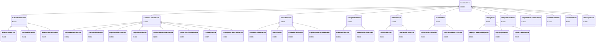

# Error Codes Reference

All SDK errors inherit from `SandboxError` and carry `code` (error code), `message`, `suggestion`, and `docs_url` attributes.

```python
from easy_sandbox.models.errors import SandboxError

try:
    sandbox = await Sandbox.create(template="nonexistent")
except SandboxError as e:
    print(f"[{e.code}] {e.message}")
    print(f"Suggestion: {e.suggestion}")
```

---

## E1xxx — Authentication Errors (AuthenticationError)

| Error Code | Exception Class | Meaning | Suggestion | Trigger Scenario |
|------------|----------------|---------|------------|------------------|
| E1000 | `AuthenticationError` | Authentication failed (base class) | — | General authentication errors |
| E1001 | `InvalidAPIKeyError` | Invalid or missing API Key | Check the `E2B_API_KEY` environment variable or pass the `api_key` parameter | Called an authenticated API without configuring any API Key |
| E1002 | `TokenExpiredError` | Authentication token expired | SDK should auto-refresh tokens; if persistent, check system clock synchronization | AK/SK temporary token expired and auto-refresh failed |
| E1003 | `InvalidCredentialsError` | Invalid AK/SK credentials | Check `ALICLOUD_ACCESS_KEY_ID` and `ALICLOUD_ACCESS_KEY_SECRET` environment variables | AK/SK is empty or malformed |

### Troubleshooting Steps

1. Run `ebx config get api_key` to confirm authentication status
2. Verify environment variables are correctly set
3. Confirm the API Key has not expired or been revoked
4. For E1002, check if the system clock is accurate (`date` command)

---

## E2xxx — Creation Errors (SandboxCreationError)

| Error Code | Exception Class | Meaning | Suggestion | Trigger Scenario |
|------------|----------------|---------|------------|------------------|
| E2000 | `SandboxCreationError` | Creation failed (base class) | — | General sandbox creation errors |
| E2001 | `TemplateNotFoundError` | Template does not exist | Run `ebx template list` to view available templates | Specified a non-existent template name |
| E2002 | `QuotaExceededError` | Quota exceeded | Destroy idle sandboxes or request a quota increase | Number of running sandboxes exceeds account quota |
| E2003 | `RegionUnavailableError` | Region unavailable | Try another region or check service availability | Requested region is temporarily unavailable or does not exist |
| E2004 | `TemplateParseError` | Template parse failure | Fix template.yaml (see validation errors); capabilities will not be granted until the template parses successfully | template.yaml has format errors or invalid fields |
| E2005 | `QwenCodeNotInstalledError` | Qwen Code is not installed | Install the official standalone build per the Quick Setup (or run `ebx config init`), or skip AI generation with `ebx create --template <name>` | `ebx create "description"` while Qwen Code is absent from PATH and `~/.ebx/bin`, and the user declines install or a non-TTY shell omits `-y` |
| E2006 | `QwenCodeCredentialError` | Qwen Code credentials missing | `ebx config set qwen_code_api_key <KEY>` or `ebx config init`; exported `DASHSCOPE_API_KEY`/`OPENAI_API_KEY` also work | No usable credential in `qwen_code_api_key`, `llm_api_key`, environment variables, or `~/.qwen/settings.json` on the AI path |
| E2007 | `AICodegenError` | AI generation failed | Inspect the retained workspace (`~/.ebx/generated/<name>`) and retry, or use `ebx create --template <name>` | Qwen Code generation failed/timed out, or the produced Dockerfile/template.yaml is missing or fails validation |
| E2008 | `DescriptionClarificationError` | Description too incomplete for AI generation | Add the missing details listed in the suggestion (or a similar example description) to `DESCRIPTION`, pass `--yes`/`-y` to generate from the current description anyway, or use `ebx create --template <name>` | After the agent researched the publicly verifiable facts itself, the description still scores below the 80% completeness threshold (missing user preferences / private constraints / business decisions) and the session cannot ask clarifying questions (non-TTY / CI without `-y`), or the interactive clarification was cancelled / interrupted (EOF) |

### Troubleshooting Steps

1. Verify the template name is correct (`ebx template list`)
2. For E2002, check `ebx list` for idle sandboxes
3. For E2004, check template.yaml YAML syntax and field values
4. For E2005–E2008 (AI path), follow the Quick Setup printed in the output; pass `ebx create --template <name>` explicitly to skip AI generation. For E2008 specifically, add the missing details (or the example description) to the argument, or pass `-y` to generate from the current description without clarification

---

## E3xxx — Execution Errors (ExecutionError)

| Error Code | Exception Class | Meaning | Suggestion | Trigger Scenario |
|------------|----------------|---------|------------|------------------|
| E3000 | `ExecutionError` | Execution failed (base class) | — | General command/code execution errors |
| E3001 | `CommandTimeoutError` | Command execution timeout | Increase the `timeout` parameter or check if the command is hanging | `commands.run()` or `run_code()` exceeded timeout |
| E3002 | `ProcessError` | Non-zero exit code | — | Command returned a non-zero exit code (carries `exit_code`, `stdout`, `stderr` attributes) |
| E3003 | `CodeExecutionError` | Code execution failed | Check code syntax and runtime dependencies | Code Interpreter failed to execute code |
| E3004 | `CapabilityNotSupportedError` | Capability not enabled | Declare the required capability in the template's `capabilities` list, or use a template that supports it | Called a capability that is runtime-gated without it being declared (e.g., calling `run_code()` on a template without the `code` capability). Also raised during `resolve_capabilities()` at template parse time |
| E3005 | `CommandNotFoundError` | Named custom command not found | Check the command name, the template's `custom_commands`, and whether the SandboxServer is running (`sandbox.server.start()`) | `Sandbox.custom(name)` / `ebx run <name>` cannot resolve the command from the template's `custom_commands` (mechanism A) or the SandboxServer registry (mechanism B) — server reachable but HTTP 404, or SandboxServer unreachable (connection failure / invalid response). Carries `command_name` and `checked_sources` attributes |
| E3006 | `EnvdRpcError` | envd rejected an RPC call (HTTP >= 400) | Check the command and arguments, or run with `ebx -v` for the raw error response | Sandbox envd returned HTTP >= 400 (e.g., a `process.Process/Start` 500 for an unknown executable). Carries `status_code`, `rpc_path`, `envd_error` (parsed JSON body) and `body_text`; the message never includes the full sandbox URL. `ebx connect` maps it to a single friendly notice (e.g., `Command not found: <cmd>`) |

### E3004 Details

> **Note (ADR 2026-09-23)**: The runtime `check_capability()` gate has been removed from most modules. `CommandsModule`, `FilesModule`, and `NetworkModule` no longer raise E3004 at call time. **Exception:** `CodeContextModule` retains the `code` capability gate — all its methods (`run`, `create_context`, `list_contexts`, `restart_context`, `remove_context`) still raise `CapabilityNotSupportedError` (E3004) when the `code` capability is missing (fail-closed). E3004 is also still raised during template resolution / model validation (e.g., `resolve_capabilities()`).

`CapabilityNotSupportedError` carries a `capability` attribute indicating the missing capability name.

```python
try:
    result = await sandbox.run_code("print(1)")
except CapabilityNotSupportedError as e:
    print(f"Missing capability: {e.capability}")  # "code"
```

**Standard capabilities**: `shell`, `files`, `code`, `terminal`, `ports`

**Default capability set**: `{shell, files, code}` (automatically granted when `capabilities` is not declared)

---

## E4xxx — Filesystem Errors (FileOperationError)

| Error Code | Exception Class | Meaning | Suggestion | Trigger Scenario |
|------------|----------------|---------|------------|------------------|
| E4000 | `FileOperationError` | File operation failed (base class) | — | General filesystem errors |
| E4001 | `FileNotFoundError_` | File or directory not found | Use `files.list()` to check available files, or `files.exists()` to verify the path | Reading/deleting a non-existent path |
| E4002 | `PermissionDeniedError` | Permission denied | Check file permissions in the sandbox | Operating on a file without permission |

> **Note**: The `FileNotFoundError_` class name has a trailing underscore to avoid shadowing Python's built-in `FileNotFoundError`.

---

## E5xxx — Network Errors (NetworkError)

| Error Code | Exception Class | Meaning | Suggestion | Trigger Scenario |
|------------|----------------|---------|------------|------------------|
| E5000 | `NetworkError` | Network error (base class) | — | General network connection errors |
| E5000 | `GitHubRateLimitError` | GitHub anonymous API rate limit hit while fetching templates | Run `ebx config set github_token` (masked input; the CLI offers this interactively and retries once), or inject `GITHUB_TOKEN` in CI | `ebx template install` / `ebx install` / `ebx template search` without a token configured |
| E5001 | `ConnectionError_` | Connection failed | Check network connectivity and firewall rules | Unable to connect to the sandbox service |

> **Note**: The `ConnectionError_` class name has a trailing underscore to avoid shadowing Python's built-in `ConnectionError`.

> **Note**: `GitHubRateLimitError` deliberately shares the E5000 code with `NetworkError` — it stays a plain network error to callers, while the CLI detects the subtype to offer one-shot interactive `github_token` onboarding.

---

## E6xxx — Session Errors (SessionError)

| Error Code | Exception Class | Meaning | Suggestion | Trigger Scenario |
|------------|----------------|---------|------------|------------------|
| E6000 | `SessionError` | Session error (base class) | — | General session management errors |
| E6001 | `SessionNotFoundError` | Session not found | Verify the session name is correct | Connecting/stopping a non-existent session |
| E6002 | `SessionAlreadyExistsError` | Session name already exists | Use a different name, or stop the existing session first | Creating a session with a duplicate name |

---

## E7xxx — Deployment & Build Errors

### Deployment Errors (DeployError)

| Error Code | Exception Class | Meaning | Suggestion | Trigger Scenario |
|------------|----------------|---------|------------|------------------|
| E7000 | `DeployError` | Deployment failed (base class) | — | General NL-driven deployment errors |
| E7001 | `DeployLLMKeyMissingError` | LLM API Key not found | Set `BAILIAN_CODING_PLAN_API_KEY`, `DASHSCOPE_API_KEY`, or `OPENAI_API_KEY` environment variable | Missing the LLM Key required by qwen-code agent during deployment |
| E7002 | `DeployAgentError` | Agent returned an error | Check `DeployResult`'s `raw_output` for details | qwen-code agent encountered an error |
| E7003 | `DeployTimeoutError` | Deployment timeout | Increase `max_wall_time` or simplify the deployment task | Deployment exceeded the maximum time limit |

### Template Build Errors

| Error Code | Exception Class | Meaning | Suggestion | Trigger Scenario |
|------------|----------------|---------|------------|------------------|
| E7010 | `TemplateBuildError` | Template build failed | Check the Dockerfile and build logs | Template image build error |
| E7011 | `TemplateBuildTimeoutError` | Template build timeout | Increase the build timeout or simplify the Dockerfile | Image build took too long |

### Docker/ACR Errors

| Error Code | Exception Class | Meaning | Suggestion | Trigger Scenario |
|------------|----------------|---------|------------|------------------|
| E7020 | `DockerBuildError` | Docker build failed | Check Dockerfile syntax and ensure Docker daemon is running | Local Docker build failed |
| E7021 | `ACRPushError` | Push to ACR failed | Verify ACR credentials and registry URL; ensure namespace and repository exist | Image push to Alibaba Cloud ACR failed |
| E7022 | `ACRLoginError` | ACR login failed | Check AccessKey/AccessSecret credentials and registry URL | Alibaba Cloud ACR authentication failed |

---

## Exception Hierarchy


```mermaid
classDiagram
    SandboxError <|-- AuthenticationError
    SandboxError <|-- SandboxCreationError
    SandboxError <|-- ExecutionError
    SandboxError <|-- FileOperationError
    SandboxError <|-- NetworkError
    SandboxError <|-- SessionError
    SandboxError <|-- DeployError
    SandboxError <|-- TemplateBuildError
    SandboxError <|-- TemplateBuildTimeoutError
    SandboxError <|-- DockerBuildError
    SandboxError <|-- ACRPushError
    SandboxError <|-- ACRLoginError

    AuthenticationError <|-- InvalidAPIKeyError
    AuthenticationError <|-- TokenExpiredError
    AuthenticationError <|-- InvalidCredentialsError

    SandboxCreationError <|-- TemplateNotFoundError
    SandboxCreationError <|-- QuotaExceededError
    SandboxCreationError <|-- RegionUnavailableError
    SandboxCreationError <|-- TemplateParseError
    SandboxCreationError <|-- QwenCodeNotInstalledError
    SandboxCreationError <|-- QwenCodeCredentialError
    SandboxCreationError <|-- AICodegenError
    SandboxCreationError <|-- DescriptionClarificationError

    ExecutionError <|-- CommandTimeoutError
    ExecutionError <|-- ProcessError
    ExecutionError <|-- CodeExecutionError
    ExecutionError <|-- CapabilityNotSupportedError

    FileOperationError <|-- FileNotFoundError_
    FileOperationError <|-- PermissionDeniedError

    NetworkError <|-- ConnectionError_
    NetworkError <|-- GitHubRateLimitError

    SessionError <|-- SessionNotFoundError
    SessionError <|-- SessionAlreadyExistsError

    DeployError <|-- DeployLLMKeyMissingError
    DeployError <|-- DeployAgentError
    DeployError <|-- DeployTimeoutError

    class SandboxError { E0000 }
    class AuthenticationError { E1000 }
    class InvalidAPIKeyError { E1001 }
    class TokenExpiredError { E1002 }
    class InvalidCredentialsError { E1003 }
    class SandboxCreationError { E2000 }
    class TemplateNotFoundError { E2001 }
    class QuotaExceededError { E2002 }
    class RegionUnavailableError { E2003 }
    class TemplateParseError { E2004 }
    class QwenCodeNotInstalledError { E2005 }
    class QwenCodeCredentialError { E2006 }
    class AICodegenError { E2007 }
    class DescriptionClarificationError { E2008 }
    class ExecutionError { E3000 }
    class CommandTimeoutError { E3001 }
    class ProcessError { E3002 }
    class CodeExecutionError { E3003 }
    class CapabilityNotSupportedError { E3004 }
    class FileOperationError { E4000 }
    class FileNotFoundError_ { E4001 }
    class PermissionDeniedError { E4002 }
    class NetworkError { E5000 }
    class ConnectionError_ { E5001 }
    class GitHubRateLimitError { E5000 }
    class SessionError { E6000 }
    class SessionNotFoundError { E6001 }
    class SessionAlreadyExistsError { E6002 }
    class DeployError { E7000 }
    class DeployLLMKeyMissingError { E7001 }
    class DeployAgentError { E7002 }
    class DeployTimeoutError { E7003 }
    class TemplateBuildError { E7010 }
    class TemplateBuildTimeoutError { E7011 }
    class DockerBuildError { E7020 }
    class ACRPushError { E7021 }
    class ACRLoginError { E7022 }
```

---

## Imports

```python
from easy_sandbox.models.errors import (
    SandboxError,
    AuthenticationError,
    InvalidAPIKeyError,
    TokenExpiredError,
    InvalidCredentialsError,
    SandboxCreationError,
    TemplateNotFoundError,
    QuotaExceededError,
    RegionUnavailableError,
    TemplateParseError,
    QwenCodeNotInstalledError,
    QwenCodeCredentialError,
    AICodegenError,
    DescriptionClarificationError,
    ExecutionError,
    CommandTimeoutError,
    ProcessError,
    CodeExecutionError,
    CapabilityNotSupportedError,
    FileOperationError,
    FileNotFoundError_,
    PermissionDeniedError,
    NetworkError,
    ConnectionError_,
    GitHubRateLimitError,
    SessionError,
    SessionNotFoundError,
    SessionAlreadyExistsError,
    DeployError,
    DeployLLMKeyMissingError,
    DeployAgentError,
    DeployTimeoutError,
    TemplateBuildError,
    TemplateBuildTimeoutError,
    DockerBuildError,
    ACRPushError,
    ACRLoginError,
)
```
