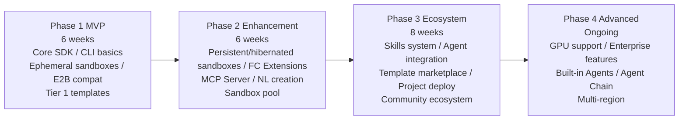

# Project Roadmap

> Easy Sandbox SDK is delivered in four phases, from MVP to a full ecosystem. Each phase can be independently released and used.

---

## Overview



---

## Phase 1 — MVP (6 weeks)

**Goal**: A usable core SDK + CLI supporting ephemeral sandboxes with E2B compatibility.

### Weeks 1–2: Infrastructure

| Deliverable | Description |
|-------------|-------------|
| L1 Transport & Auth | HTTPS client, AK/SK signing, configuration loading |
| L2 Core Protocol | WebSocket RPC, process management, filesystem |
| Project scaffolding | pyproject.toml, CI/CD, test framework |
| Development environment | Local mock server for development and testing |

### Weeks 3–4: Core API

| Deliverable | Description |
|-------------|-------------|
| `Sandbox.create()` | Create ephemeral sandbox (template parameter) |
| `Sandbox.kill()` | Destroy sandbox |
| `sb.run_code()` | Code execution (Python first) |
| `sb.commands.run()` | Command execution |
| `sb.files.*` | File read/write, directory listing, upload/download |
| Context Manager | `async with` automatic lifecycle management |
| Sync API | `create_sync()`, `run_code_sync()` |

### Weeks 5–6: CLI + Templates + Release

| Deliverable | Description |
|-------------|-------------|
| CLI `ebx create` | Create sandbox (template mode) |
| CLI `ebx exec/list/kill` | Basic commands |
| CLI `ebx shell` | Interactive shell |
| Tier 1 templates × 5 | base, python-base, python-data-science, node-web, code-interpreter |
| PyPI release | `pip install easy-sandbox` |
| Documentation site | Quick start + API reference |

### Phase 1 Milestone

```python
# Users can:
from easy_sandbox import Sandbox

async with await Sandbox.create(template="code-interpreter") as sb:
    result = await sb.run_code("import pandas as pd; print(pd.__version__)")
    print(result.text)

    await sb.files.write("/app/data.txt", "hello world")
    content = await sb.files.read("/app/data.txt")
```

---

## Phase 2 — Enhancement (6 weeks)

**Goal**: Persistent/hibernated sandboxes, deep Alibaba Cloud integration, MCP Server, natural language creation.

### Weeks 7–8: Sandbox Mode Enhancement

| Deliverable | Description |
|-------------|-------------|
| Persistent sandbox | `persistent=True`, persists across sessions |
| Hibernated sandbox | `hibernate()` / `wake_up()`, snapshot restoration |
| Sandbox snapshot | `snapshot()`, create new sandbox from snapshot |
| `Sandbox.connect()` | Connect to an existing sandbox |
| Auto cleanup | Timeout destruction, idle hibernation |

### Weeks 9–10: Extensions + Sandbox Pool

| Deliverable | Description |
|-------------|-------------|
| VPC networking | VPC/security group/ENI configuration |
| OSS mounting | Filesystem mounting, large file transfer |
| Custom domains | Domain binding + TLS certificates |
| SandboxPool | Connection pooling, pre-warming, auto-scaling |
| Image builder | Chaining API for building custom images |

### Weeks 11–12: MCP Server + Natural Language

| Deliverable | Description |
|-------------|-------------|
| MCP Server (P0 Tools) | 7 core tools |
| STDIO transport | Cursor/Claude Desktop integration |
| `ebx mcp install` | One-click IDE installation |
| Natural language creation | `Sandbox.create("description")` + CLI `ebx create "description"` |
| Config inference Agent | InferAgent implementation |
| Tier 2 templates × 3 | browser-automation, full-stack, go-dev |

### Phase 2 Milestone

```bash
# Users can:
ebx create "Run Python data analysis with pandas"
ebx mcp install --target cursor

# SDK:
sb = await Sandbox.create("Python data analysis environment")
pool = SandboxPool(template="code-interpreter", min_ready=3)
```

---

## Phase 3 — Ecosystem (8 weeks)

**Goal**: Skills system, Agent integration, template marketplace, direct project deployment.

### Weeks 13–15: Skills System

| Deliverable | Description |
|-------------|-------------|
| Skill specification | SKILL.md + sandbox.yaml + mcp-tools.json |
| `ebx skill` CLI | search, install, list, create, publish |
| Official Skills × 10 | Language runtimes, data science, browser automation |
| Install targets | project, global, cursor, claude, vscode |
| Skill Registry | Official + community + private |

### Weeks 16–17: Agent Integration + Decorators

| Deliverable | Description |
|-------------|-------------|
| `@sandbox` decorator | Modal-style remote execution |
| `sb.agent.code()` | Code analysis Agent |
| `sb.agent.shell()` | Shell automation Agent |
| Custom Agent | `Agent()` class |
| LLM Provider | OpenAI / Anthropic / Qwen adapters |

### Weeks 18–20: Template Marketplace + Project Deployment

| Deliverable | Description |
|-------------|-------------|
| Template marketplace | Web UI + API |
| Community contribution flow | Submit → Review → Publish |
| `ebx build .` | Build image from project directory |
| `ebx deploy .` | Deploy project directly to sandbox |
| Hot reload | `ebx deploy . --watch` |
| Project type detection | package.json / requirements.txt / go.mod, etc. |
| MCP P1 Tools | 8 extended tools |
| HTTP+SSE transport | Remote multi-client support |
| Tier 2 template completion | java-dev, ml-gpu |

### Phase 3 Milestone

```bash
# Users can:
ebx skill install data-analysis --target cursor
ebx deploy ./my-project --watch
ebx create "Deploy this Flask project" --upload .

# SDK:
@sandbox(template="python-data-science")
def analyze(data): ...

result = await sb.agent.code("Analyze code complexity", code=src)
```

---

## Phase 4 — Advanced (Ongoing)

**Goal**: GPU support, enterprise features, full built-in Agent suite, Agent Chain.

### Continuous Delivery

| Deliverable | Description | Expected Timeline |
|-------------|-------------|-------------------|
| GPU templates | A10/V100/A100 support | Weeks 21–22 |
| `sb.agent.browse()` | Browser Agent | Weeks 23–24 |
| `sb.agent.analyze()` | Data analysis Agent | Weeks 23–24 |
| `sb.agent.debug()` | Debug Agent | Weeks 25–26 |
| Agent Chain | Serial/parallel/DAG orchestration | Weeks 27–28 |
| Enterprise SSO | SAML/OIDC authentication | Weeks 29–30 |
| Multi-region | cn-shanghai, cn-shenzhen | Weeks 29–30 |
| Audit logs | Operation auditing + compliance | Weeks 31–32 |
| Team management | Organization/project/permissions | Weeks 31–32 |
| MCP P2 Tools | 4 advanced tools | Weeks 33–34 |
| NAS mounting | Shared filesystem | Weeks 33–34 |
| Web Console | Sandbox management Web UI | Weeks 35–38 |
| Terraform Provider | IaC support | Weeks 39–40 |

### Phase 4 Milestone

```python
# Users can:
result = await sb.agent.browse("Screenshot example.com homepage")
result = await sb.agent.analyze("Trend analysis", data=csv)

chain = AgentChain([
    ("analyze", {"task": "Analyze data"}),
    ("code", {"task": "Generate report"}),
])
results = await chain.run(data=content)
```

---

## Key Metrics

| Metric | Phase 1 Target | Phase 2 Target | Phase 3 Target |
|--------|---------------|---------------|---------------|
| SDK downloads | 1,000/month | 5,000/month | 20,000/month |
| MCP installations | — | 500 | 3,000 |
| Skills count | — | — | 30+ |
| Community templates | — | — | 20+ |
| Sandbox creations | 10,000/month | 50,000/month | 200,000/month |
| P95 cold start | < 3s | < 2s | < 1.5s |
| API availability | 99.5% | 99.9% | 99.95% |
