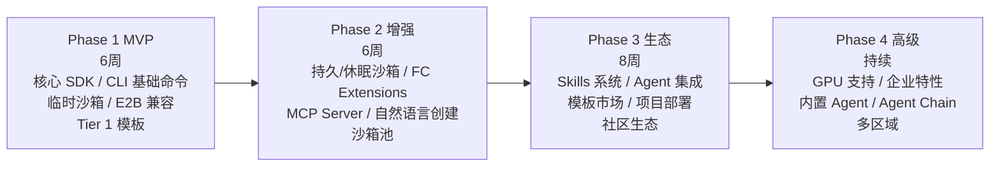

# 项目路线图

> Serverless Sandbox SDK 分四个阶段交付，从 MVP 到完整生态，每阶段可独立发布、独立使用。

---

## 总览



---

## Phase 1 — MVP（6 周）

**目标**：可用的核心 SDK + CLI，支持临时沙箱，E2B 兼容。

### 第 1-2 周：基础设施

| 交付物 | 说明 |
|--------|------|
| L1 Transport & Auth | HTTPS 客户端、AK/SK 签名、配置加载 |
| L2 Core Protocol | WebSocket RPC、进程管理、文件系统 |
| 项目脚手架 | pyproject.toml、CI/CD、测试框架 |
| 开发环境 | 本地 mock server 用于开发测试 |

### 第 3-4 周：核心 API

| 交付物 | 说明 |
|--------|------|
| `Sandbox.create()` | 创建临时沙箱（template 参数） |
| `Sandbox.kill()` | 销毁沙箱 |
| `sb.run_code()` | 代码执行（Python 优先） |
| `sb.commands.run()` | 命令执行 |
| `sb.files.*` | 文件读写、列目录、上传下载 |
| Context Manager | `async with` 自动生命周期管理 |
| 同步 API | `create_sync()`, `run_code_sync()` |

### 第 5-6 周：CLI + 模板 + 发布

| 交付物 | 说明 |
|--------|------|
| CLI `sbox create` | 创建沙箱（template 模式） |
| CLI `sbox exec/list/kill` | 基础命令 |
| CLI `sbox shell` | 交互式 Shell |
| Tier 1 模板 × 5 | base, python-base, python-data-science, node-web, code-interpreter |
| PyPI 发布 | `pip install serverless-sandbox` |
| 文档站点 | 快速开始 + API 参考 |

### Phase 1 里程碑

```python
# 用户可以做到：
from serverless_sandbox import Sandbox

async with await Sandbox.create(template="code-interpreter") as sb:
    result = await sb.run_code("import pandas as pd; print(pd.__version__)")
    print(result.text)

    await sb.files.write("/app/data.txt", "hello world")
    content = await sb.files.read("/app/data.txt")
```

---

## Phase 2 — 增强（6 周）

**目标**：持久/休眠沙箱、阿里云深度集成、MCP Server、自然语言创建。

### 第 7-8 周：沙箱模式增强

| 交付物 | 说明 |
|--------|------|
| 持久沙箱 | `persistent=True`，跨会话保留 |
| 休眠沙箱 | `hibernate()` / `wake_up()`，快照恢复 |
| 沙箱快照 | `snapshot()`，从快照创建新沙箱 |
| `Sandbox.connect()` | 连接已有沙箱 |
| 自动清理 | 超时销毁、空闲休眠 |

### 第 9-10 周：Extensions + 沙箱池

| 交付物 | 说明 |
|--------|------|
| VPC 网络 | VPC/安全组/ENI 配置 |
| OSS 挂载 | 文件系统挂载、大文件传输 |
| 自定义域名 | 域名绑定 + TLS 证书 |
| SandboxPool | 连接池、预热、自动扩缩容 |
| Image 构建器 | 链式 API 构建自定义镜像 |

### 第 11-12 周：MCP Server + 自然语言

| 交付物 | 说明 |
|--------|------|
| MCP Server（P0 Tools） | 7 个核心工具 |
| STDIO 传输 | Cursor/Claude Desktop 集成 |
| `sbox mcp install` | 一键安装到 IDE |
| 自然语言创建 | `Sandbox.create("描述")` + CLI `sbox create "描述"` |
| 配置推断 Agent | InferAgent 实现 |
| Tier 2 模板 × 3 | browser-automation, full-stack, go-dev |

### Phase 2 里程碑

```bash
# 用户可以做到：
sbox create "运行 Python 数据分析，需要 pandas"
sbox mcp install --target cursor

# SDK:
sb = await Sandbox.create("Python 数据分析环境")
pool = SandboxPool(template="code-interpreter", min_ready=3)
```

---

## Phase 3 — 生态（8 周）

**目标**：Skills 系统、Agent 集成、模板市场、项目直接部署。

### 第 13-15 周：Skills 系统

| 交付物 | 说明 |
|--------|------|
| Skill 规范 | SKILL.md + sandbox.yaml + mcp-tools.json |
| `sbox skill` CLI | search, install, list, create, publish |
| 官方 Skills × 10 | 语言运行时、数据科学、浏览器自动化 |
| 安装目标 | project, global, cursor, claude, vscode |
| Skill Registry | 官方 + 社区 + 私有 |

### 第 16-17 周：Agent 集成 + 装饰器

| 交付物 | 说明 |
|--------|------|
| `@sandbox` 装饰器 | Modal 风格远程执行 |
| `sb.agent.code()` | 代码分析 Agent |
| `sb.agent.shell()` | Shell 自动化 Agent |
| 自定义 Agent | `Agent()` 类 |
| LLM Provider | OpenAI / Anthropic / Qwen 适配 |

### 第 18-20 周：模板市场 + 项目部署

| 交付物 | 说明 |
|--------|------|
| 模板市场 | Web UI + API |
| 社区贡献流程 | 提交 → 审核 → 发布 |
| `sbox build .` | 从项目目录构建镜像 |
| `sbox deploy .` | 项目直接部署到沙箱 |
| 热重载 | `sbox deploy . --watch` |
| 项目类型检测 | package.json / requirements.txt / go.mod 等 |
| MCP P1 Tools | 8 个扩展工具 |
| HTTP+SSE 传输 | 远程多客户端支持 |
| Tier 2 模板补全 | java-dev, ml-gpu |

### Phase 3 里程碑

```bash
# 用户可以做到：
sbox skill install data-analysis --target cursor
sbox deploy ./my-project --watch
sbox create "部署这个 Flask 项目" --upload .

# SDK:
@sandbox(template="python-data-science")
def analyze(data): ...

result = await sb.agent.code("分析代码复杂度", code=src)
```

---

## Phase 4 — 高级（持续）

**目标**：GPU 支持、企业特性、内置 Agent 全套、Agent Chain。

### 持续交付

| 交付物 | 说明 | 预期时间 |
|--------|------|----------|
| GPU 模板 | A10/V100/A100 支持 | 第 21-22 周 |
| `sb.agent.browse()` | 浏览器 Agent | 第 23-24 周 |
| `sb.agent.analyze()` | 数据分析 Agent | 第 23-24 周 |
| `sb.agent.debug()` | 调试 Agent | 第 25-26 周 |
| Agent Chain | 串行/并行/DAG 编排 | 第 27-28 周 |
| 企业 SSO | SAML/OIDC 认证 | 第 29-30 周 |
| 多区域 | cn-shanghai, cn-shenzhen | 第 29-30 周 |
| 审计日志 | 操作审计 + 合规 | 第 31-32 周 |
| 团队管理 | 组织/项目/权限 | 第 31-32 周 |
| MCP P2 Tools | 4 个高级工具 | 第 33-34 周 |
| NAS 挂载 | 共享文件系统 | 第 33-34 周 |
| Web Console | 沙箱管理 Web UI | 第 35-38 周 |
| Terraform Provider | IaC 支持 | 第 39-40 周 |

### Phase 4 里程碑

```python
# 用户可以做到：
result = await sb.agent.browse("截图 example.com 首页")
result = await sb.agent.analyze("趋势分析", data=csv)

chain = AgentChain([
    ("analyze", {"task": "分析数据"}),
    ("code", {"task": "生成报告"}),
])
results = await chain.run(data=content)
```

---

## 关键度量

| 指标 | Phase 1 目标 | Phase 2 目标 | Phase 3 目标 |
|------|-------------|-------------|-------------|
| SDK 下载量 | 1,000/月 | 5,000/月 | 20,000/月 |
| MCP 安装数 | — | 500 | 3,000 |
| Skills 数量 | — | — | 30+ |
| 社区模板 | — | — | 20+ |
| 沙箱创建量 | 10,000/月 | 50,000/月 | 200,000/月 |
| P95 冷启动 | < 3s | < 2s | < 1.5s |
| API 可用性 | 99.5% | 99.9% | 99.95% |
