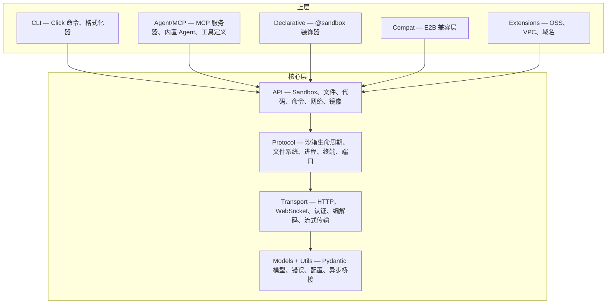

# Easy Sandbox — 设计文档索引

> **版本**：v2.0 | **最后更新**：2026-09-24
>
> 本文档是 Easy Sandbox 所有设计文档的入口和索引。详细设计位于 [`design/`](design/) 目录下的各专题文档中。

---

## 项目概述

**Easy Sandbox**（PyPI 包名 `easy-sandbox`，CLI 命令 `ebx`）是面向阿里云 FC Agent 沙箱服务的 Python SDK + CLI。**兼容 E2B 协议**，并扩展了阿里云生态能力（OSS、VPC、自定义域名）。

### 核心设计原则

1. **E2B 协议兼容** — L2 协议层兼容 E2B 数据面协议；提供迁移辅助层 (`from easy_sandbox.compat import Sandbox`) 方便现有 E2B 用户迁移
2. **AI-First** — 自然语言创建沙箱、MCP Server 是一等公民、内置 Agent 工具
3. **零配置默认** — 开箱即用；从安装到第一个沙箱运行不超过 3 行代码

### 快速上手

```bash
pip install easy-sandbox
export SANDBOX_API_KEY=your-api-key
```

```python
from easy_sandbox import Sandbox

async with await Sandbox.create(template="base") as sb:
    result = await sb.run_code("print('Hello, Easy Sandbox!')")
    print(result.text)
```

---

## 架构概览

SDK 采用严格分层架构 — 低层绝不导入高层：


```mermaid
graph TB
    subgraph Upper["上层"]
        CLI["CLI — Click 命令、格式化器"]
        Agent["Agent/MCP — MCP 服务器、内置 Agent、工具定义"]
        Decl["Declarative — @sandbox 装饰器"]
        Compat["Compat — E2B 兼容层"]
        Ext["Extensions — OSS、VPC、域名"]
    end
    subgraph Core["核心层"]
        L3["API — Sandbox、文件、代码、命令、网络、镜像"]
        L2["Protocol — 沙箱生命周期、文件系统、进程、终端、端口"]
        L1["Transport — HTTP、WebSocket、认证、编解码、流式传输"]
        L0["Models + Utils — Pydantic 模型、错误、配置、异步桥接"]
    end

    CLI --> L3
    Agent --> L3
    Decl --> L3
    Compat --> L3
    Ext --> L3
    L3 --> L2 --> L1 --> L0
```

完整架构分解详见[架构设计](design/architecture.md)。

---

## 设计专题索引

每个专题都有独立的设计文档，包含完整规范。

### 核心设计

| 专题 | 文档 | 摘要 |
|------|------|------|
| **系统架构** | [architecture.md](design/architecture.md) | 六层架构、层间依赖、双 API 层（Platform API vs Sandbox envd API） |
| **SDK API 设计** | [sdk-api-design.md](design/sdk-api-design.md) | Sandbox 类、文件操作、代码执行、命令、网络、镜像构建器、会话管理 |
| **沙箱类型体系** | [sandbox-types.md](design/sandbox-types.md) | 临时沙箱（已实现）、持久沙箱（远期）、沙箱生命周期 |

### CLI 与用户界面

| 专题 | 文档 | 摘要 |
|------|------|------|
| **CLI 命令体系** | [cli-design.md](design/cli-design.md) | 命令树（45 个命令）、全局选项、自然语言创建、OutputManager、AI 友好设计 |
| **模板体系** | [template-system.md](design/template-system.md) | 模板分层、GitHub tarball 分发、`template.yaml` 规范、自定义命令、CLI 模板子命令 |
| **模板目录** | [templates-catalog.md](design/templates-catalog.md) | 单一事实来源（SSOT）架构：模板真源仓库 awesome-templates、远程索引客户端、缓存/降级行为、主仓库 fixture 边界 |

### AI 与 Agent 集成

| 专题 | 文档 | 摘要 |
|------|------|------|
| **MCP Server** | [mcp-server.md](design/mcp-server.md) | 7 个 P0 工具、STDIO 与 Streamable HTTP 传输、FC 部署产物、会话绑定 |
| **内置 Agent** | [built-in-agents.md](design/built-in-agents.md) | 沙箱侧 `AgentModule`（`commands.run()` 语法糖）；Agent 随专用模板分发——默认基础镜像不预装任何 Agent CLI（见[自带 Agent（BYO）集成](guide/byo-agent-integration.md)） |

### 服务器与基础设施

| 专题 | 文档 | 摘要 |
|------|------|------|
| **Server API** | [server-api.md](design/server-api.md) | Sandbox Server SDK 路由、能力组、Browser 实例架构 |

---

## 实现状态

| 功能 | 状态 | 备注 |
|------|------|------|
| SDK 核心（Sandbox、文件、命令、代码） | **已实现** | |
| CLI（45 个命令） | **已实现** | 详见 [cli-design.md](design/cli-design.md) |
| MCP Server（STDIO） | **已实现** | 7 个 P0 工具 |
| MCP Server（Streamable HTTP） | **已实现** | `mcp_http.py` |
| `ebx mcp deploy`（FC 产物生成） | **已实现** | 生成部署产物并打印手动 FC 部署步骤。详见 [mcp-server.md](design/mcp-server.md#7-fc-部署) |
| 模板 build/push/create 流水线 | **已实现** | 通过官方 CreateTemplate API |
| E2B 兼容层 | **已实现** | `easy_sandbox.compat` |
| 持久沙箱 | **远期** | 需底层平台支持 |
| SandboxPool（预热池） | **远期** | 需底层平台支持 |
| NAS 挂载 / SLS 日志集成 | **远期** | 规划中的扩展模块 |

---

## 相关资源

| 资源 | 位置 |
|------|------|
| 架构决策记录 (ADR) | [`.agents/notes/`](../../.agents/notes/README.md) |
| CLI 黄金文件证据 | [`.agents/evidence/`](../../.agents/evidence/) |
| BYO Agent 集成指南 | [`docs/zh/guide/byo-agent-integration.md`](guide/byo-agent-integration.md) |
| 用户指南 | [`docs/zh/guide/`](guide/) |
| API/CLI 参考 | [`docs/zh/reference/`](reference/) |
| English design index | [`docs/en/DESIGN.md`](../en/DESIGN.md) |
