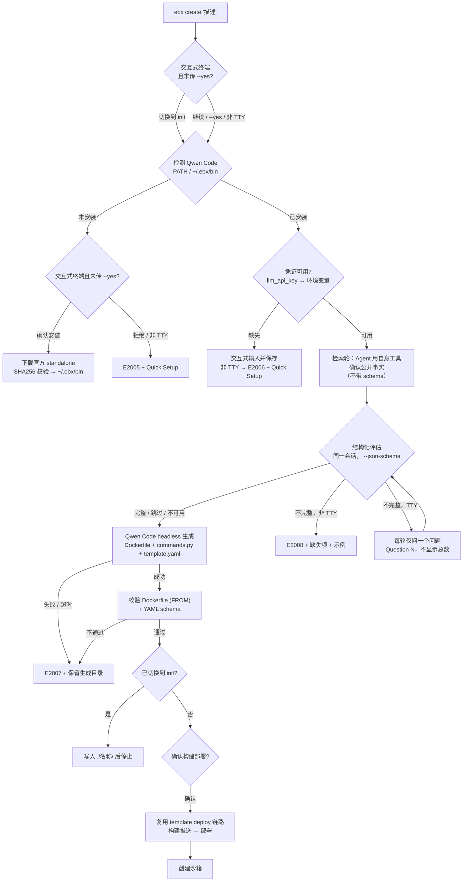

# CLI 命令体系设计

> `ebx` CLI 是 Easy Sandbox 的命令行入口，兼顾人类开发者和 AI Agent 两种使用场景。CLI 的终极目标：**用户不需要知道模板、资源规格、配置参数，只需要描述想做什么，sandbox 自动搞定一切。**

***

## 目录

1. [命令树](#1-命令树)
2. [全局选项](#2-全局选项)
3. [自然语言创建](#3-自然语言创建)
4. [核心命令详述](#4-核心命令详述)
5. [配置管理](#5-配置管理)
6. [核心工作流](#6-核心工作流)
7. [OutputManager 统一输出管理](#7-outputmanager-统一输出管理)
8. [AI Friendly 设计原则](#8-ai-friendly-设计原则)
9. [未来计划](#9-未来计划)

***

## 1. 命令树

```mermaid
graph TB
    ebx["ebx"]

    ebx --- create["create - 创建沙箱（自然语言 → Qwen Code 生成模板）"]
    ebx --- list["list - 列出所有沙箱"]
    ebx --- info["info - 查看沙箱详情"]
    ebx --- kill["kill - 销毁沙箱 / --all"]
    ebx --- execCmd["exec - 执行裸 shell 命令"]
    ebx --- run["run - 调度命名命令"]
    ebx --- connect["connect - 交互式连接"]
    ebx --- upload["upload - 上传文件/目录"]
    ebx --- download["download - 下载文件"]
    ebx --- deploy["deploy - 部署项目"]
    ebx --- install["install - 安装社区模板"]
    ebx --- sandbox["sandbox"]
    ebx --- template["template"]
    ebx --- mcp["mcp"]
    ebx --- config["config"]

    sandbox --- sb_crud["create / list / info / kill / exec / connect / upload / download / run"]
    sandbox --- sb_files["files"]
    sandbox --- sb_process["process"]
    sandbox --- sb_system["system"]
    sandbox --- sb_cap["capabilities"]
    sandbox --- sb_shell["shell-stream"]

    sb_files --- f_list["list"]
    sb_files --- f_stat["stat"]
    sb_files --- f_mkdir["mkdir"]
    sb_files --- f_rm["rm"]
    sb_files --- f_mv["mv"]
    sb_files --- f_search["search"]

    sb_process --- p_list["list"]
    sb_process --- p_start["start"]
    sb_process --- p_info["info"]
    sb_process --- p_signal["signal"]

    sb_system --- sys_info["info"]
    sb_system --- sys_env["env"]
    sb_system --- sys_ports["ports"]
    sb_system --- sys_packages["packages"]
    sb_system --- sys_metrics["metrics"]

    template --- tpl_init["init"]
    template --- tpl_deploy["deploy"]
    template --- tpl_build["build"]
    template --- tpl_push["push"]
    template --- tpl_create["create"]
    template --- tpl_install["install"]
    template --- tpl_list["list"]
    template --- tpl_info["info"]
    template --- tpl_delete["delete"]
    template --- tpl_search["search"]

    mcp --- mcp_install["install"]
    mcp --- mcp_start["start"]
    mcp --- mcp_status["status"]
    mcp --- mcp_deploy["deploy"]

    config --- cfg_init["init"]
    config --- cfg_get["get"]
    config --- cfg_set["set"]
    config --- cfg_list["list"]
```



> `config reset` 已在首个正式版之前移除——删除一项已保存的值请使用 `ebx config delete KEY`（或 `ebx config set KEY ""`）。该键回落到默认值或未设置。没有一次清空 `~/.ebx` 的命令。

***

## 2. 全局选项

| 选项           | 缩写   | 说明                   | 默认值         |
| -------------- | ------ | ---------------------- | -------------- |
| `--json`       | `-j`   | 输出 JSON 格式（AI 友好） | `false`        |
| `--quiet`      | `-q`   | 静默模式，仅输出关键结果   | `false`        |
| `--verbose`    | `-v`   | 详细输出（DEBUG 级别日志） | `false`        |
| `--no-color`   |        | 禁用颜色输出              | `false`        |
| `--log-level`  |        | 显式设置日志级别（DEBUG/INFO/WARNING/ERROR） | `None` |
| `--ci`         |        | CI/CD 模式（等同 quiet + no-color + json） | `false` |
| `--timeout`    | `-t`   | 默认超时时间（秒）         | `300`          |
| `--profile`    | `-p`   | [预留] 配置档案           | `None`         |
| `--version`    |        | 显示版本号                |                |
| `--help`       | `-h`   | 显示帮助并退出（所有命令层级均可用） |          |

每个命令同时接受 `-h` 与 `--help`：别名在根命令处集中配置一次（`context_settings={'help_option_names': ['-h', '--help']}`），并通过 Click 的 Context 机制由整棵命令树继承——懒加载命令组与嵌套子组一并生效。

```bash
# 示例：JSON 输出 + 静默
ebx list --json --quiet

# CI/CD 模式（自动 quiet + no-color + json）
ebx list --ci

# 指定日志级别
ebx create "python 环境" --log-level DEBUG
```

`--region`/`-r` 是**命令级选项**，而非全局选项。只有访问区域控制面的命令才接受它：

```bash
# 单次调用的区域覆盖
ebx list --region cn-shanghai
ebx sandbox list --region cn-shanghai
ebx template build ./my-template --acr-namespace ns --region cn-shanghai
ebx mcp deploy --region cn-shanghai

# 持久默认区域
ebx config set region cn-shanghai
```

解析优先级：命令 `--region` > `SANDBOX_REGION` > `ebx config set region` > `cn-hangzhou`。

CLI 会自动检测 CI 环境（`CI`、`GITHUB_ACTIONS`、`GITLAB_CI`、`JENKINS_URL` 等环境变量），自动启用 CI 模式。非 TTY 环境下颜色输出自动禁用。

***

## 3. 自然语言创建（AI 模板生成）

> **用自然语言描述你需要什么，CLI 调用 Qwen Code 生成 Dockerfile、commands.py（HTTP 服务入口）与 template.yaml，构建部署后创建 sandbox。**

`ebx create` 有三条路由，由调用方式决定：

| 调用方式 | 路径 |
|---------|------|
| `ebx create`（无参数） | **拒绝执行** —— 显式用法错误（退出码 2），列出三条合法路由；裸 create 不会静默默认 `base` |
| `ebx create --template <名称>` | 直接模板路径（不经过 AI 生成） |
| `ebx create "自然语言描述"` | AI 路径（本节重点） |
| `ebx create "描述" --template <名称>` | 拒绝执行 —— `DESCRIPTION` 与 `--template` 互斥（用法错误，退出码 1） |

任一输入都不会被静默丢弃：两者同时提供时命令直接拒绝执行。

### AI 路径流程



**范围确认。** 在安装或生成之前，交互式终端会先说明自然语言 create 会生成模板、构建并推送镜像、部署模板、再创建沙箱，并询问是否改走 template init。回答「是」时，与 `ebx template init "描述"` 相同：只在 `./<名称>/` 写下 `Dockerfile`、`commands.py`、`template.yaml` 与 `README.md`，然后停止——不构建、不推送、不部署、不创建沙箱。默认是继续完整的 create。`--yes` 与 `--json` 跳过这个问题并走完整流程。非交互终端只打印同一句提醒然后继续；后面的构建确认仍然生效。

1. **可执行文件检测**：先查 `PATH`，再查 `~/.ebx/bin`（Windows 识别 `.cmd`/`.exe` 后缀）。
2. **安装引导**：未安装时，交互式终端询问是否安装官方 standalone 版本（经 SHA256 校验后原子安装到 `~/.ebx/bin`，Unix 设置执行权限）；非 TTY 或用户拒绝时抛出 `E2005` 并打印 Quick Setup，不阻塞、不降级。
3. **凭证解析**：进程环境变量优先于 `./.env`，`./.env` 写了的键优先于 `~/.ebx`。API Key 顺序是 `EBX_LLM_API_KEY`，然后 `BAILIAN_CODING_PLAN_API_KEY`、`DASHSCOPE_API_KEY`、`OPENAI_API_KEY`，然后旧的 `EBX_QWEN_CODE_API_KEY`，然后 `./.env` 里的同名变量，然后 `ebx config set llm_api_key` 保存的值。`llm_base_url` 使用 `EBX_LLM_BASE_URL`、然后 `OPENAI_BASE_URL`、然后已保存的值（仅当 `llm_base_url` 未设置时才读旧的 `qwen_code_base_url`），最后是 DashScope 默认地址。`llm_model` 使用 `EBX_LLM_MODEL`、然后 `OPENAI_MODEL`、然后已保存的值，最后是 `qwen3-coder-plus`。以上都没有时才用 `~/.qwen/settings.json`。交互式终端可提示输入并安全保存；非 TTY 抛 `E2006`。
4. **生成前澄清（research-first，同一原生会话上的两阶段）**：生成之前，coding agent 先跑一轮普通检索轮（`--session-id`，**不带** `--json-schema`），用它自己的工具（web fetch / shell）确认全部可公开查证的事实——工具技术栈、官方安装方式、常见运行时与依赖——检索不到的逐条记录安全合理默认值；随后同一会话继续（`--resume`）跑一次带 `--json-schema` 的结构化评估轮。已对 qwen-code 0.15.11 核验：`--json-schema` 会在首次有效 `structured_output` 调用时结束会话，因此检索轮刻意不带 schema，以保工具循环不被过早切断。只有用户偏好、私有约束和无法推断的业务决策才可能计为缺失。低于 80% 阈值时，交互式终端每轮只问 **一个问题**，以 `Question 1`、`Question 2` 逐次编号且**不显示总数**（内部 5 轮上限仅在触达时提示）；每次回答都恢复同一原生会话并基于完整描述 + 全部问答历史重新评估，已问过主题嵌入每个后续 prompt（完全重复的问题会防御性地中断循环），回答“你自己决定”“采用默认”等授权语义则指示 Agent 自行采用安全合理默认值。非 TTY / CI 未传 `--yes` 时快速失败并抛 `E2008`，列出缺失的模板要素与可直接套用的示例描述。`--yes` 完全跳过检索与评估；检索轮失败仅带原因提示告警（绝不作为门槛；检索限定 20 轮 / 240 秒，可用 `EBX_QWEN_RESEARCH_TIMEOUT` 覆盖，且提示词把耗时的 web fetch 限制在 3 次以内），随后评估会新开一个**全新**会话——qwen 会拒绝重复指定失败检索轮可能已创建的 `--session-id`，这曾表现为莫名的“评估不可用”；评估不可用时降级为直接生成并打印 warning。阶段状态（检索 / 评估 / 重新评估 / 生成）在 **stderr** 上渲染（TTY 为 spinner，非 TTY 为单行机器可读 progress 行），Agent 工作期间还会在标题 `Assessing description... 12s` 下方以灰色显示最近四行动态（常规为 Rich status，`--verbose` / `--no-color` 下为可自擦除的 `\r` 行，`--json` / `--quiet` / CI / `TERM=dumb` 下不显示）。为驱动该行，headless 运行采用 `--output-format stream-json --include-partial-messages`，但只展示助手文本尾部与工具*名称*，绝不展示工具入参或思考内容；超时或 Ctrl-C 时会终止整个 agent 进程树。stdout 保持干净，且绝不回显模型的研究输出。生成阶段会续接澄清会话，模型在自身记忆中保有描述、研究结论与全部问答。
5. **生成与校验**：在 `--dir` 下全新的 `<slug>-<时间戳>-<随机后缀>/` 工作目录（默认 `~/.ebx/generated/`；交互式终端会询问保存位置，回车即用默认值；模板名 `ebx-nl-<slug>-<随机后缀>`）以 headless 模式调用 Qwen Code（`qwen "<prompt>" --output-format json --yolo`，prompt 为位置参数——0.15.11 `--help` 已将旧 `-p` 标记为弃用；列表参数、限定 cwd 与超时，默认 600s 可用 `EBX_QWEN_CODEGEN_TIMEOUT` 覆盖），要求产出**可直接使用**的模板——Dockerfile、在 9000 端口启动容器内 `easy_sandbox.server` `SandboxServer` 的 `commands.py`（沙箱部署后通过 HTTP(S) 访问，只有 Dockerfile 无法使用）、template.yaml 与 README；提示词内嵌服务端 SDK 参考（`agent/template_guide.py`：Dockerfile 规则、`CapabilityGroup`、`CommandRegistry`、`RouteTable.route`、`template.yaml` 字段）。随后校验：Dockerfile 含 `FROM` 且引用 `commands.py`，`commands.py` 是合法 Python、导入 `easy_sandbox.server` 并调用 `serve()`/`start()`，template.yaml 通过 `parse_template_data` 的 YAML schema 校验。失败或超时抛 `E2007` 并保留生成目录供检查。
6. **构建与创建**：确认后复用 `ebx template deploy` 的构建/部署链路（`--acr-namespace` 可指定推送命名空间），成功后调用现有 `Sandbox.create`。任何一步失败都不会静默回退到 `base`，而是给出错误码、Quick Setup 与下一步命令。

### 示例

```bash
# 交互式：AI 生成模板 → 构建部署 → 创建
# ebx create "运行 python 数据分析，预装 pandas 和 jupyter"

# 非交互（CI）：必须显式 -y，否则安装/凭证/确认环节直接报错
# ebx create -y "a node.js api server"

# 显式模板绕过 AI 生成
# ebx create --template codex
# ebx create -T browser-automation

# 非交互下描述不完整 → E2008（缺失项 + 示例）
# ebx create "run python"

# 拒绝：DESCRIPTION 与 --template 互斥（退出码 1）
# ebx create "a node.js api" --template base

# 带文件上传
# ebx create "分析这个 CSV 文件" --upload data.csv
```

### 安装与凭证引导

- **自动安装**：官方 standalone 资产下载到 `~/.ebx/bin`；下载源经核实——优先阿里云镜像、失败回退 GitHub release 资产，`SHA256SUMS` 必须校验，不匹配立即失败（不回退）。
- **手动安装**：Quick Setup 与 `ebx create --help` 给出官方安装脚本命令（`install-qwen-standalone.sh` / `.ps1`）。
- **凭证存储**：`ebx config set llm_api_key <KEY>` 存入 `~/.ebx/.env`；或 `ebx config init` 向导一次性完成沙箱 API Key、region 与 LLM API Key 配置（非 TTY 时打印等效非交互命令）。

### 可用模板列表

模板内容与索引的唯一真源是 [`Easy-Sandbox/awesome-templates`](https://github.com/Easy-Sandbox/awesome-templates)
仓库（根目录 `awesome-templates.yaml`）。CLI 不再内置固定模板清单，而是从远程索引发现模板：

```bash
ebx template search web             # 按名称/标签/描述搜索远程索引
ebx template install node-web      # 按索引名安装（自动解析为 owner/repo//subdir@ref）
```

- 索引缓存于 `~/.ebx/index/`，TTL 1 小时；新鲜缓存直接命中，不发起网络请求。
- 网络失败/限流（403/429/5xx）时回退到过期缓存 并打印 warning；无缓存则报错并给出修复建议（`ebx config set github_token` / `GITHUB_TOKEN`、`--index-url`、`--refresh`）。匿名限流（E5000）还会展示经官方核验的 fine-grained PAT 预填 URL，并在交互终端下引导一次星号（脱敏）配置，随后只自动重试一次。
- 条目可通过 `ref` 字段锁定远端版本；裸名解析命中内置模板（`base`、`code-interpreter-v1`）时不触网。
- 索引 schema 带 `schema_version`；比客户端支持版本更新时明确报错并提示升级。

> 本仓库 `examples/templates/` 仅保留最小 `python-hello` 离线测试夹具（fixture），不是发布真源。

***

## 4. 核心命令详述

### ebx create

```bash
ebx create [DESCRIPTION] [选项]

参数：
  DESCRIPTION               自然语言描述（可选；AI 路径的生成依据）

选项：
  --template, -T <name>     指定模板名（跳过 AI 生成；与 DESCRIPTION 互斥）
  --upload, -u <path>       创建后上传本地文件/目录
  --timeout, -t <seconds>   沙箱超时时间
  --env, -e <KEY=VALUE>     环境变量（可多次使用）
  --metadata, -m <KEY=VALUE> 元数据键值对（可多次使用）
  --yes, -y                 跳过交互确认与 research-first 澄清流程（安装/凭证/描述检索与评估/构建部署）；非交互环境必填
  --acr-namespace <ns>      AI 生成模板构建推送的 ACR 命名空间

示例：
  ebx create "python 数据分析"            # AI 生成模板 → 构建部署 → 创建
  ebx create -y "node.js api server"    # 非交互 AI 路径
  ebx create --template code-interpreter # 直接模板路径
  ebx create "Node.js API" -e PORT=3000
  ebx create "分析数据" --upload ./data.csv
```

### ebx list

```bash
ebx list [选项]

选项：
  --status, -s <status>     按状态过滤 (running/stopped/creating/paused/error)
  --limit, -l <n>           限制数量 (默认: 20)

示例：
  ebx list
  ebx list --status running --json
  ebx list -l 50
```

**输出格式**：

```
$ ebx list
  ID            Template             Status    Region
  sb-a1b2c3d4   code-interpreter     running   cn-hangzhou
  sb-e5f6g7h8   python-data-science  running   cn-hangzhou
  sb-i9j0k1l2   base                 stopped   cn-shanghai
```

### ebx info

```bash
ebx info <sandbox-id>

示例：
  ebx info sb-a1b2c3d4
  ebx info sb-a1b2c3d4 --json
```

**输出格式**：

```
$ ebx info sb-a1b2c3d4
  ID:           sb-a1b2c3d4
  Template:     code-interpreter
  Status:       running
  Region:       cn-hangzhou
  Timeout:      300s
  URL:          https://sb-a1b2c3d4.envd.example.com
  Started:      2026-09-01 14:00:00
```

### ebx kill

```bash
ebx kill <sandbox-id> [选项]
ebx kill --all [选项]

选项：
  --all                     销毁所有运行中的沙箱
  --yes, -y                 跳过确认提示

示例：
  ebx kill sb-abc123
  ebx kill sb-abc123 --yes
  ebx kill --all --yes
```

### ebx exec

```bash
ebx exec <sandbox-id> <command> [选项]

选项：
  --timeout, -t <seconds>   命令超时 (默认: 60)
  --cwd <path>              工作目录 (默认: /app)

示例：
  ebx exec sb-abc123 "python train.py"
  ebx exec sb-abc123 "npm start" --timeout 120
  ebx exec sb-abc123 "ls -la" --json
```

**输出格式**：

```
$ ebx exec sb-abc123 "python -c 'print(1+1)'"
2

$ ebx exec sb-abc123 "python -c 'print(1+1)'" --json
{
  "stdout": "2\n",
  "stderr": "",
  "exit_code": 0,
  "execution_time": 0.12
}
```

`exec` 命令会将沙箱中命令的退出码作为自身的退出码传播。

### ebx run

```bash
ebx run <sandbox-id> <command-name> [选项]

参数：
  command-name              模板 `custom_commands` 中声明的命名命令

选项：
  --arg, -a <KEY=VALUE>     命名命令参数（可多次使用）
  --timeout, -t <seconds>   覆盖命令声明的超时

示例：
  ebx run sb-abc123 serve --arg port=9000
  ebx run sb-abc123 migrate --arg target=head --json
```

`run` 是**模板感知**的命名命令分发：根据沙箱模板的 `custom_commands` 声明解析 `command-name`，将 `--arg` 传入的参数按 `args` schema 校验并经 `shlex.quote()` 转义后填充命令模板，再在沙箱内执行。

**`run` 与 `exec` 的语义分工**：

- `ebx exec` = 裸 shell 命令（任意字符串，需 `shell` 能力）。
- `ebx run` = 模板声明的命名命令（结构化参数 + 防注入）。

错误处理：

- `command-name` 未声明 → 报错并列出可用命令。
- 缺少 `required` 参数 → 执行前报错。
- 沙箱缺少命令所需能力 → 抛出 `CapabilityNotSupportedError`（E3xxx），含修复建议。

详见 ADR `2026-09-03-cli-run-vs-exec.md`。

### ebx deploy

`ebx deploy` 是模板生命周期中的**发布步骤**，是一条固定流水线：`docker build` → 推送 ACR → `CreateTemplate` → 轮询直到就绪。它就是 `PATH` 默认为 `.` 的 `ebx template deploy`，逐项复用后者的选项集合（两者不会漂移，`-v/--verbose` 也可用），不需要 LLM。交互式终端上，每个耗时步骤都是 `message... 12s` 标题，标题下方以灰色显示最近四行 docker 或轮询输出（与生成模板时的区块相同；`EBX_ACTIVITY_LINES` 可改行数）。工具暂时没有输出时，标题上的耗时仍每秒刷新。`--verbose` 改为打印完整日志。`--json`、`--quiet`、CI 和非 TTY 仍只留一行 progress。

创建沙箱、上传或下载文件、拉取模板或模板索引、用镜像注册模板、安装 coding-agent CLI，以及 `ebx kill --all`，这些可能停住的步骤使用同一套标题。某一步若有安全的日志——相对路径、安装阶段（镜像源、校验和、解压）、docker 输出或轮询状态——最近四行显示在标题下方（`EBX_ACTIVITY_LINES`）。文件内容、工具入参、ACR token 和 `--build-arg` 的值不会进入这几行；记录 docker 命令的 info 日志会把 build-arg 的值写成 `***`。`--verbose` 仍会打印完整的部署日志，并且不画部署区块。其余命令在终端上保留会走动的标题，包括 `--verbose` 和 `--no-color`。`--json`、`--quiet`、CI、`TERM=dumb` 和非 TTY 对这些标题保持沉默。

```text
ebx template init ["描述" | --adopt 目录]  →  ebx deploy [PATH]  →  ebx create --template ID
  编写（脚手架、一句话，或已有项目）            发布（固定流程）        启动
ebx create "描述"  =  以上三步合一，推送任何东西之前先确认
```

```bash
ebx deploy [PATH] [选项]

参数：
  PATH                            模板目录（默认: .）

选项：
  （`ebx template deploy` 的全部选项，如 --acr-namespace、--alias、--yes、-v）
```

设计说明：

- **描述属于编写阶段，而不是发布阶段。** 模板*是什么*——名称、描述、端口、能力、资源、环境变量、自定义命令，以及让部署后的沙箱可用的 `commands.py` 服务——都由 `ebx template init` 写进 `template.yaml` / `Dockerfile` / `commands.py`（脚手架、一句描述，或对已有项目使用 `--adopt`），可以审阅、可以纳入版本管理。`ebx deploy` 只*读取* `template.yaml`（`name`、`resources.cpu`、`resources.memory`、`generation`）。在部署时再提供一处项目描述，就是再多一个永远不会落进 `template.yaml` 的“真相来源”。`--adopt` 的规格见 ADR `2026-09-30-template-init-adopt-existing-project.md`。
- 因此 `deploy` **没有 INSTRUCTION 参数，也没有 AI 开关**（之前的 `--agent` 设计正是因此被撤销，见 ADR `2026-09-30-deploy-fixed-pipeline-agent-flag.md`）。
- 沙箱内 Agent 部署（`Sandbox.deploy`，需要 LLM Key 并启动 `qwen-code` 云端沙箱）仅保留为 SDK 接口。

### ebx connect

```bash
ebx connect <sandbox-id>

示例：
  ebx connect sbx-abc123
```

连接到沙箱的交互式逐行 REPL，不是 PTY 也不是 SSH 会话。每行命令在独立进程中执行（30 秒超时），`cd`、环境变量和别名等 shell 状态不会跨命令保持（请使用 `cd /path && <cmd>` 单行写法，或 `ebx exec --cwd`）。交互式终端支持基础行编辑与历史快捷键（Up/Down、Ctrl+R、Ctrl+A/E）。输入 `exit`、`quit` 或按 `Ctrl+D` 断开连接；`Ctrl+C` 也会断开。命令失败时只给出一条友好提示，不会显示原始 HTTP 错误、完整沙箱 URL 或 MDN 链接。

**交互示例**：

```
$ ebx connect sbx-abc123
✓ Connected to sandbox sbx-abc123
Type 'exit' or Ctrl+D to disconnect
Note: each line runs in an independent process - cd, environment variables and shell state do not persist

ebx:sbx-abc1> ls /app
main.py  data/  requirements.txt

ebx:sbx-abc1> sl /app
[E3006] Command not found: sl
  Suggestion: Did you mean 'ls'? It ran earlier in this session.

ebx:sbx-abc1> python -c "print('hello')"
hello

ebx:sbx-abc1> exit
Disconnected.
```

### ebx upload

```bash
ebx upload <sandbox-id> <local-path> <remote-path>

示例：
  ebx upload sb-abc123 ./script.py /app/script.py
  ebx upload sb-abc123 ./data/ /app/data/
```

支持上传单个文件或整个目录。上传目录时会递归上传所有文件。

### ebx download

```bash
ebx download <sandbox-id> <remote-path> <local-path>

示例：
  ebx download sb-abc123 /app/result.csv ./result.csv
  ebx download sb-abc123 /app/output.log .
```

下载沙箱中的文件到本地。`local-path` 如果是目录，文件名取自远程路径。

### ebx sandbox files

沙箱文件操作子命令组，提供 6 个命令。

#### files list

```bash
ebx sandbox files list <sandbox-id> [选项]

选项：
  --path, -p <path>       目录路径 (默认: /home/user)
  --recursive, -r         递归列出 (最大深度 5)

示例：
  ebx sandbox files list abc123
  ebx sandbox files list abc123 --path /app --recursive
```

#### files stat

```bash
ebx sandbox files stat <sandbox-id> [选项]

选项：
  --path, -p <path>       文件或目录路径 (必填)

示例：
  ebx sandbox files stat abc123 --path /home/user/app.py
```

#### files mkdir

```bash
ebx sandbox files mkdir <sandbox-id> [选项]

选项：
  --path, -p <path>       要创建的目录路径 (必填)

示例：
  ebx sandbox files mkdir abc123 --path /home/user/myproject/src
```

自动创建父目录。

#### files rm

```bash
ebx sandbox files rm <sandbox-id> [选项]

选项：
  --path, -p <path>       要删除的文件或目录路径 (必填)
  --yes, -y               跳过确认

示例：
  ebx sandbox files rm abc123 --path /home/user/temp.txt
  ebx sandbox files rm abc123 --path /home/user/old_dir -y
```

#### files mv

```bash
ebx sandbox files mv <sandbox-id> [选项]

选项：
  --source, -s <path>     源路径 (必填)
  --dest, -d <path>       目标路径 (必填)

示例：
  ebx sandbox files mv abc123 --source /home/user/old.py --dest /home/user/new.py
```

#### files search

```bash
ebx sandbox files search <sandbox-id> [选项]

选项：
  --path, -p <path>       搜索目录 (必填)
  --pattern <glob>        Glob 模式, 如 '*.py' (必填)
  --max-depth <n>         最大搜索深度 (默认: 5)

示例：
  ebx sandbox files search abc123 --path /home/user --pattern "*.py"
  ebx sandbox files search abc123 --path /app --pattern "*.log" --max-depth 3
```

### ebx sandbox process

沙箱进程管理子命令组，提供 4 个命令。

#### process list

```bash
ebx sandbox process list <sandbox-id>

示例：
  ebx sandbox process list abc123
```

列出沙箱中运行的进程，输出包含 PID、命令和状态。

#### process start

```bash
ebx sandbox process start <sandbox-id> [选项]

选项：
  --command, -c <cmd>     要运行的命令 (必填)
  --timeout, -t <seconds> 超时秒数 (默认: 300)
  --cwd <path>            工作目录

示例：
  ebx sandbox process start abc123 --command "python app.py"
  ebx sandbox process start abc123 -c "node server.js" --cwd /app
```

进程完成后输出 stdout/stderr，退出码传播为 CLI 退出码。

#### process info

```bash
ebx sandbox process info <sandbox-id> <pid>

示例：
  ebx sandbox process info abc123 1234
```

使用 `ps` 查询进程信息，输出 PPID、User、State、RSS、Elapsed 等。

#### process signal

```bash
ebx sandbox process signal <sandbox-id> <pid> [选项]

选项：
  --signal, -s <number>   信号编号 (默认: 15/SIGTERM)

示例：
  ebx sandbox process signal abc123 1234
  ebx sandbox process signal abc123 1234 --signal 9
```

常用信号：15 (SIGTERM)、9 (SIGKILL)、2 (SIGINT)。

### ebx sandbox system

沙箱系统信息子命令组，提供 5 个命令。

#### system info

```bash
ebx sandbox system info <sandbox-id>

示例：
  ebx sandbox system info abc123
```

显示操作系统、架构、CPU 数、Python 版本、磁盘空间等。

#### system env

```bash
ebx sandbox system env <sandbox-id> [选项]

选项：
  --filter, -f <names>    逗号分隔的变量名白名单

示例：
  ebx sandbox system env abc123
  ebx sandbox system env abc123 --filter PATH,HOME,LANG
```

包含 TOKEN、SECRET、KEY、PASSWORD 的敏感变量自动排除。

#### system ports

```bash
ebx sandbox system ports <sandbox-id>

示例：
  ebx sandbox system ports abc123
```

使用 `ss -tlnp` 或 `netstat -tlnp` 查询监听中的 TCP 端口。

#### system packages

```bash
ebx sandbox system packages <sandbox-id> [选项]

选项：
  --manager, -m <pip|npm> 包管理器 (默认: pip)

示例：
  ebx sandbox system packages abc123
  ebx sandbox system packages abc123 --manager npm
```

#### system metrics

```bash
ebx sandbox system metrics <sandbox-id>

示例：
  ebx sandbox system metrics abc123
```

显示 CPU 负载（1/5/15 分钟）、磁盘使用率等实时指标。

### ebx sandbox capabilities

```bash
ebx sandbox capabilities <sandbox-id>

示例：
  ebx sandbox capabilities abc123
```

列出沙箱支持的能力组（如 shell、files、code、terminal、ports 等）。

### ebx sandbox shell-stream

```bash
ebx sandbox shell-stream <sandbox-id> [选项]

选项：
  --command, -c <cmd>     要执行的命令 (必填)
  --timeout, -t <seconds> 超时秒数 (默认: 300)
  --cwd <path>            工作目录

示例：
  ebx sandbox shell-stream abc123 --command "pip install numpy"
  ebx sandbox shell-stream abc123 -c "make build" --cwd /app
```

与 `exec` 不同，`shell-stream` 逐行实时打印输出（使用 SSE 流式传输），适合长时间运行的命令。退出码传播为 CLI 退出码。

### ebx install

```bash
ebx install <template-ref> [选项]

选项：
  --registry-url <url>      Registry URL（默认 GitHub）
  --registry-type <type>    Registry 类型 (github/local)，自动检测
  --token <token>           访问令牌（私有仓库 / 提升限流额度）；仅作临时覆盖 —— 推荐 'ebx config set github_token'（--token 可能泄漏到 shell history 或进程列表）
  --alias, -a <name>        模板别名

示例：
  ebx install node-web                    # 裸名 → 远程索引解析 → owner/repo//subdir[@ref]
  ebx install owner/repo
  ebx install owner/repo//subdir@v1.0
  ebx install ./my-template --registry-type local
```

这是 `ebx template install` 的顶层快捷方式。裸名解析与降级行为见 [§3 可用模板列表](#可用模板列表)。

### ebx template

#### template init

```bash
ebx template init [DIRECTORY] [选项]

选项：
  -t, --template <案例>      内置脚手架案例（python、node、minimal）
  --from <引用>              从注册表引用拉取模板源码（owner/repo 或本地路径）
  --name <名称>              模板名称（默认：案例名、拉取到的名称或生成名）
  --list                     列出可用的脚手架案例
  --force                    覆盖已存在的文件
  --adopt                    适配 DIRECTORY 里的已有项目（默认 .）
  --hint <文本>              配合 --adopt：端口、服务等代码里看不出来的信息
  --dry-run                  配合 --adopt：列出将要发送的文件；不发送、不写入
  -y, --yes                  跳过确认（描述澄清，以及 --adopt 的两次确认）

示例：
  ebx template init --list
  ebx template init -t python            # 创建 ./python/
  ebx template init -t python ./my-app   # 指定目录
  ebx template init --from owner/repo
  ebx template init "一个 Python 数据分析环境"   # 只生成文件，不构建
  ebx template init -y "a node.js api server"     # 非交互，只生成文件
  ebx template init --adopt ./app --hint "监听 8080"
  ebx template init --adopt ./app --dry-run
```

在本地生成可编辑的模板工程，不构建、不推送、不部署、也不创建沙箱——准备好后执行 `ebx template deploy <目录>`。路径记号（`my-app`、`./my app`）仍表示目录。含空白或中文的文本是自然语言描述：Qwen Code 把 `Dockerfile`、`commands.py`（SandboxServer 入口）、`template.yaml` 与 `README.md` 写到 `./<名称>/` 后停止。交互式终端会先询问目录（`Directory for the template project`）：直接回车保持 `./<名称>/`（或 `./<--name>/`），其他输入就是项目目录本身。`--yes`、`--json` 和非交互终端跳过这个问题。路径是文件，或目录里已经有模板文件时，会在生成之前拒绝（`--force` 才覆盖）。这与 `ebx create "描述"` 在交互下询问是否切换到 init 时的停止线相同。`--adopt` 是第三条编写路径：DIRECTORY 是已有项目，Agent 在临时副本里运行（密钥被排除），写回的只有 `Dockerfile`、`commands.py`、`template.yaml` 和自动生成的 `.dockerignore`。`--adopt` 与 `-t`、`--from`、`--list` 互斥。本地 `--from` 目录如果没有 `template.yaml` 会被拒绝，错误信息指向 `--adopt`。顶层 `ebx init` 快捷方式与它是同一个命令对象；引导式凭证配置是 `ebx config init`。

##### 顶层快捷方式与用户自定义命令的边界

- **内置顶层快捷方式**（`create`、`list`、`init`、`install`、`deploy`、`run` 等）统一注册在 `src/easy_sandbox/cli/main.py` 的 `LazyGroup(lazy_subcommands=...)` 映射中。该映射是**项目维护者的内置顶层入口注册点**；这些快捷方式作为用户可配置的 `[shortcuts]` 段的**系统默认配置**发布（见下文）——并非硬编码不可更改：用户无需改动源码即可自由修改、删除或扩展它们。
- **CLI 别名**（`[shortcuts]` 配置层）将本地的 `ebx <别名> [参数…]` 路由到一条已有命令路径——不涉及沙箱、凭证或模板。
- **用户自定义命令**通过模板的 `template.yaml`（`custom_commands`）或 SandboxServer 的 `@registry.command` 注册，并通过 `ebx run COMMAND` / `Sandbox.custom(name)` 调用——它们在**沙箱内**执行，与 CLI 别名是不同的层。
- 原始 CLI 设计草案（`2026-09-23-cli-final-design.md` §2.2）中的 `config.toml [shortcuts]` 段**已经实现**（ADR `2026-09-30-configurable-cli-shortcuts.md`，取代了 `2026-09-29-init-restore-and-create-explicit-error.md` 中的早期否决）：别名是纯 CLI 路由层关注点，与沙箱内命名命令不构成竞争。
- 未知顶层命令会得到针对性提示：拼写相近（difflib，cutoff 0.6）时给出 `Did you mean '…'?`；无合理候选时，错误信息给出 `ebx config set shortcuts.NAME "template init"`（目标不含 `ebx` 前缀），并指向 `custom_commands` + `ebx run`。退出码 2、仅输出到 stderr 的约束保持不变；只有根命令组受影响。

##### 可配置快捷方式（`[shortcuts]`）

顶层快捷方式是**用户可配置的**，不是固定的。`~/.ebx/config.toml` 的 `[shortcuts]` 段将别名映射到目标命令路径；列出的每个默认快捷方式（create、list、info 等）都是出厂预置，你可以修改、删除或扩展。

配置格式（别名解析到一条已有命令路径——空格分隔的子命令路径）：

```toml
# ~/.ebx/config.toml

[shortcuts]
# 出厂默认 —— 所有内置顶层快捷方式（默认启用）
create   = "sandbox create"
list     = "sandbox list"
info     = "sandbox info"
kill     = "sandbox kill"
exec     = "sandbox exec"
connect  = "sandbox connect"
run      = "sandbox run"
upload   = "sandbox upload"
download = "sandbox download"
deploy   = "deploy"
install  = "template install"
init     = "template init"

# 用户自定义别名 —— 任意已有命令路径均可
ps      = "sandbox process list"
sysinfo = "sandbox system info"
files   = "sandbox files list"
```

默认别名列表（开箱即用——无需任何配置文件）：

| 默认别名 | 目标 |
|---------|------|
| `create` | `sandbox create` |
| `list` | `sandbox list` |
| `info` | `sandbox info` |
| `kill` | `sandbox kill` |
| `exec` | `sandbox exec` |
| `connect` | `sandbox connect` |
| `run` | `sandbox run` |
| `upload` | `sandbox upload` |
| `download` | `sandbox download` |
| `deploy` | `deploy` |
| `install` | `template install` |
| `init` | `template init` |

别名管理——也可直接编辑 `~/.ebx/config.toml` 的 `[shortcuts]` 段：

```bash
# 添加 / 修改别名（命令路径，不要带 "ebx" 前缀）
ebx config set shortcuts.ps "sandbox process list"
# 会被拒绝且不会保存：ebx config set shortcuts.init2 "ebx template init"
ebx config set shortcuts.init2 "template init"

# 删除别名（空值即删除）
ebx config set shortcuts.ps ""

# 查看所有别名
ebx config get shortcuts

# 重置为出厂默认 / 生成完整模板
ebx config init --reset-shortcuts
ebx config init                 # 写入完整的 [shortcuts] 模板，可直接编辑
```

设计约束：

- **单层解析** —— 别名解析到恰好一条已有命令路径；别名绝不链式指向其他别名，别名之后的全部参数原样透传（不做参数改写或注入）。
- **不要带 `ebx` 前缀** —— 存下来的是命令路径（`"template init"`），不是完整调用（`"ebx template init"`）。`config set` 会拒绝带前缀的值（退出码 2，不保存）并打印可重试的命令。文件里已经写错的值会在启动时被忽略，并给出同样的说明；其他别名仍然有效。见 ADR `2026-09-30-shortcut-target-hint.md`。
- **保留命令不可覆盖** —— 命令组名（`sandbox`、`template`、`config`、`mcp`）及其他保留顶层名称不能被 `[shortcuts]` 条目遮蔽、重定向或删除；冲突条目会被报告并忽略。
- **配置损坏回退** —— 若 `~/.ebx/config.toml` 无法解析（TOML 语法错误、类型错误），CLI 会在 stderr 输出警告并禁用该会话中的所有 shortcuts；内置命令组（`sandbox`、`config`、`mcp`、`template`）不受影响，损坏的 shortcuts 配置绝不会让 CLI 无法启动。

完整决策记录见 ADR `2026-09-30-configurable-cli-shortcuts.md`。

#### template deploy

```bash
ebx template deploy <template-dir> [选项]

选项：
  （与 template build 相同 — 一键执行 build → push → create）

示例：
  ebx template deploy ./my-template
  ebx template deploy ./my-template --alias my-env
```

端到端流水线：本地构建 Docker 镜像、推送到 ACR、调用 CreateTemplate API。这是发布模板的推荐单命令工作流。

#### template build

```bash
ebx template build <template-dir> [选项]

选项：
  --acr-registry <url>      ACR 注册表 URL
  --acr-namespace <ns>      ACR 命名空间（必填）
  --alias, -a <name>        模板别名
  --tag, -t <tag>           镜像标签
  --platform <platform>     目标平台
  --cpu <n>                 CPU 核数
  --memory <mb>             内存 (MB)
  --dockerfile, -f <path>   自定义 Dockerfile 路径
  --official-api/--legacy-api   使用官方 CreateTemplate API
  ... (完整选项见 --help)

示例：
  ebx template build ./my-template --acr-namespace my-ns
```

从模板目录构建 Docker 镜像，推送到 ACR，并通过 CreateTemplate API 注册。

#### template push

```bash
ebx template push <image> [选项]

选项：
  --acr-registry <url>      ACR 注册表 URL
  --acr-namespace <ns>      ACR 命名空间（必填）
  --acr-username <user>     ACR 用户名
  --acr-password <pass>     ACR 密码

示例：
  ebx template push my-image:v1 --acr-namespace my-ns
```

将已有本地 Docker 镜像推送到 ACR，不执行构建或模板注册。

#### template create

```bash
ebx template create <image> [选项]

选项：
  --name, -n <name>         模板名称（必填）
  --team-id <id>            团队 ID
  --cpu <n>                 CPU 核数
  --memory <mb>             内存 (MB)
  --disk-size <mb>          磁盘大小 (MB)
  --start-cmd <cmd>         启动命令
  --ready-cmd <cmd>         就绪探测命令
  ... (完整选项见 --help)

示例：
  ebx template create registry.cn-hangzhou.aliyuncs.com/ns/img:v1 -n my-template
```

对已在 ACR 中的镜像调用 CreateTemplate API 注册模板。适用于镜像已推送的场景。

#### template install

```bash
ebx template install <template-ref> [选项]

选项：
  --registry-url <url>      Registry URL（默认 GitHub）
  --registry-type <type>    Registry 类型 (github/local)
  --token <token>           访问令牌（私有仓库需要）；仅作临时覆盖 —— 推荐 'ebx config set github_token'（--token 可能泄漏到 shell history 或进程列表）
  --alias, -a <name>        模板别名

示例：
  ebx template install owner/repo              # 整个仓库
  ebx template install owner/repo//subdir      # 指定子目录
  ebx template install owner/repo@v1.0         # 指定版本
  ebx template install owner/repo --token xxx  # 私有仓库（一次性；推荐改用 'ebx config set github_token'）
  ebx template install ./my-template           # 本地目录
```

token 优先级：`--token` > 进程环境变量 `GITHUB_TOKEN` > `./.env` > 持久化的 `github_token`（`ebx config set github_token`，星号脱敏输入，保存在 `~/.ebx/.env`）> 无 token。匿名限流时错误信息中完整保留 `owner/repo//subdir@ref`，并在交互终端下引导脱敏配置 token 且只自动重试一次。

从 GitHub 或本地目录安装模板。模板目录须包含 `template.yaml` 文件。

#### template list

```bash
ebx template list [选项]

选项：
  --official-api/--no-official-api   使用官方 API
```

列出所有模板（通过 Platform API 查询）。

#### template info

```bash
ebx template info <template-id> [选项]

选项：
  --official-api/--no-official-api   使用官方 API
```

查看模板详细信息。

#### template delete

```bash
ebx template delete <template-id>
```

删除模板（需确认）。

#### template search

```bash
ebx template search <query> [选项]

选项：
  --tag, -t <tag>           按标签过滤
  --status, -s <status>     按状态过滤

示例：
  ebx template search python
  ebx template search "数据科学" --tag ml
```

按名称、描述或标签搜索模板。

### ebx mcp

#### mcp install

```bash
ebx mcp install --target <cursor|claude|vscode>
```

安装 MCP Server 配置到指定 IDE。支持 Cursor、Claude Desktop 和 VS Code。安装后会列出注册的工具列表：

- `create_sandbox` — 创建云端沙箱
- `run_code` — 执行代码
- `run_command` — 执行命令
- `read_file` — 读取文件
- `write_file` — 写入文件
- `list_files` — 列出文件
- `kill_sandbox` — 销毁沙箱

#### mcp start

```bash
ebx mcp start [选项]

选项：
  --template <name>         默认沙箱模板 (默认: code-interpreter-v1)
  --api-key <key>           API Key 覆盖 (环境变量: E2B_API_KEY)
  --api-url <url>           API URL 覆盖 (环境变量: E2B_API_URL)
  --domain <domain>         Domain 覆盖 (环境变量: E2B_DOMAIN)
```

以 STDIO 模式启动 MCP Server。通常由 IDE 自动调用，不需要手动执行。

#### mcp status

```bash
ebx mcp status
```

显示 MCP Server 状态：传输模式、工具数量、认证配置、各 IDE 安装状态。

#### mcp deploy

```bash
ebx mcp deploy [选项]

选项：
  --name <name>             FC 函数名称（默认: easy-sandbox-mcp）
  --region <region>         FC 地域；命令 --region > SANDBOX_REGION >
                            ebx config set region > cn-hangzhou
  --template <name>         默认沙箱模板（默认: base）
  --memory <mb>             FC 函数内存（默认: 512）
  --timeout <seconds>       FC 函数超时（默认: 600）
  --auth-token-file <path>  Bearer token 文件（或 --generate-token）
  --generate-token          自动生成随机 Bearer token
  --enable-session-affinity / --no-session-affinity
                            Mcp-Session-Id 会话亲和（默认: 启用）
  --api-key <key>           注入 API key 到 FC 环境变量
  --custom-domain <domain>  MCP 端点自定义域名
  --output-dir <path>       产物输出目录

示例：
  ebx mcp deploy --generate-token --api-key $E2B_API_KEY --output-dir ./artifact
  ebx mcp deploy --auth-token-file ./token.txt --region cn-shanghai
```

生成阿里云 FC 部署产物（requirements.txt、app.py ASGI 入口、YAML 格式的 config.yaml 清单）并打印手动 FC 部署步骤。自动调用 FC 部署 API 尚未实现。详见 [MCP Server 设计 — FC 部署](mcp-server.md#7-fc-部署)。

***

## 5. 配置管理

配置文件位于 `~/.ebx/config.toml`，API Key 单独存放于 `~/.ebx/.env`。

### 可配置项

| 配置键          | 说明                                  | 默认值                    |
| --------------- | ------------------------------------- | ------------------------- |
| `sandbox_api_key` | 沙箱服务 API Key（存为 `E2B_API_KEY`） | (未设置)                  |
| `api_url`       | Platform API URL                      | (自动)                    |
| `region`        | 默认区域                               | `cn-hangzhou`             |
| `http_timeout`  | HTTP 请求超时（秒）                    | (自动)                    |
| `max_retries`   | 最大重试次数                           | (自动)                    |
| `domain`        | Envd Domain                           | (自动)                    |
| `llm_api_key`   | LLM API Key，供自然语言推理和编码代理使用 | (未设置) |
| `llm_model`     | LLM 模型名称                          | `qwen3-coder-plus`       |
| `llm_base_url`  | LLM API Base URL（OpenAI 兼容）       | DashScope 兼容端点        |

敏感配置项（`sandbox_api_key`、`llm_api_key`）在 `config list` 输出中自动脱敏显示。

同一文件中的 `[shortcuts]` 段用于配置顶层命令别名（见 [§4 可配置快捷方式](#可配置快捷方式shortcuts)）；通过 `ebx config set shortcuts.<名称> "<目标>"` / `ebx config get shortcuts` / `ebx config init --reset-shortcuts` 管理。

### 命令示例

```bash
# 设置沙箱 API Key
ebx config set sandbox_api_key e2b_xxx

# LLM API Key，供自然语言推理和编码代理使用
ebx config set llm_api_key sk-xxx

# 或使用引导向导（沙箱 API Key、region、LLM API Key）
ebx config init

# 查看配置
ebx config list
ebx config get region

# 清除单个已存储的值（回落默认值 / not set）
ebx config set region ""
```

进程环境变量优先于 `./.env`，`./.env` 优先于已保存的 LLM 配置：`EBX_LLM_API_KEY`（然后是 `BAILIAN_CODING_PLAN_API_KEY`、`DASHSCOPE_API_KEY`、`OPENAI_API_KEY`）、`EBX_LLM_BASE_URL` / `OPENAI_BASE_URL`，以及 `EBX_LLM_MODEL` / `OPENAI_MODEL`。空白值不算已配置。这些都没设置时，才用 `~/.ebx` 里的值。

***

## 6. 核心工作流

### 工作流 1：快速实验

```bash
# 一行命令，从描述到可用环境
ebx create "python 数据分析，需要 pandas 和 matplotlib"
# → sb-abc123

ebx exec sb-abc123 "python -c 'import pandas; print(pandas.__version__)'"
# 2.1.0

ebx kill sb-abc123
```

### 工作流 2：文件交互开发

```bash
# 创建沙箱并上传项目
ebx create -T code-interpreter --upload ./project

# 查看沙箱内容
ebx exec sb-abc123 "ls /home/user/"

# 执行代码
ebx exec sb-abc123 "python /home/user/main.py"

# 下载结果
ebx download sb-abc123 /app/result.csv ./result.csv

# 完成后销毁
ebx kill sb-abc123 --yes
```

### 工作流 3：交互式调试

```bash
# 创建并连接到沙箱
ebx create -T code-interpreter
ebx connect sbx-abc123

# 在逐行 REPL 中操作（每行都是全新进程）
ebx:sbx-abc1> pip install requests && python my_script.py
ebx:sbx-abc1> cat /app/output.log
ebx:sbx-abc1> exit
```

### 工作流 4：AI Agent 集成

```bash
# 安装 MCP Server 到 Cursor
ebx mcp install --target cursor

# 检查状态
ebx mcp status

# AI Agent 通过 MCP 自动使用沙箱
# （在 Cursor/Claude 中自然语言操作）
```

### 工作流 5：自定义模板

```bash
# 从 GitHub 安装社区模板
ebx install owner/my-template

# 或从 Dockerfile 构建
ebx template build -f ./Dockerfile --alias my-ml-env

# 查看模板状态
ebx template list

# 使用自定义模板
ebx create --template my-ml-env
```

***

## 7. OutputManager 统一输出管理

> CLI 所有命令统一使用 `OutputManager`（`cli/output.py`）代替裸 `click.echo` 调用，确保输出行为在不同模式下保持一致。

### 通道策略：结果与诊断分离

管理器拥有两个通道且从不混用，机器可读输出因此始终可管道化：

| 通道 | 内容 | 消费方 |
|------|------|--------|
| **stdout** | 最终结果：`data`、`table`、`success` | 人类与脚本（`ebx ... --json \| jq`） |
| **stderr** | 进度状态与诊断：`info`、`progress`、`warning`、`error`、`debug`，以及**所有 stdlib `logging` 记录** | 跟随长命令执行的人 |

由此得到的保证：

- `--json` 模式下 stdout 始终是**单个 JSON 文档**；`info` / `warning` / `progress` / `debug` / `error` 的 JSON 形态改为写入 stderr。
- 库侧 warning 与 DEBUG 诊断统一经 root logger 上的单一 handler 桥接，因此同一条告警只渲染一次（不再出现 SDK 带时间戳行与宿主 `WARNING:` 行各一遍）。
- 进度 spinner 渲染在 stderr；每次写输出前先暂停活动 spinner、写完再恢复，状态与结果不会交错。
- `--quiet`、`--json`、`--ci` 因此不会把状态文案或日志记录泄到 stdout。

### 输出方法

| 方法 | 说明 | 通道 | quiet 模式 | JSON 模式 |
|------|------|------|------------|----------|
| `info(message)` | 信息性消息 | stderr | 抑制 | `{"level": "info", ...}` → stderr |
| `success(message)` | 成功消息（绿色） | stdout | 抑制 | `{"status": "success", ...}` → stdout |
| `warning(message)` | 警告消息（黄色） | stderr | 抑制 | `{"level": "warning", ...}` → stderr |
| `error(message)` | 错误消息（红色，**始终显示**） | stderr | 显示 | `{"status": "error", ...}` → stderr |
| `debug(message)` | 调试消息（仅 verbose 模式） | stderr | 抑制 | `{"level": "debug", ...}` → stderr |
| `data(data)` | 结构化数据（dict/list） | stdout | 仅输出值 | JSON 对象 |
| `table(headers, rows)` | 表格数据（Rich 表格 + 纯文本回退） | stdout | Tab 分隔 | `[{...}, ...]` |
| `progress(message)` | 进度/状态消息 | stderr | 抑制 | `{"level": "progress", ...}` → stderr |

### 环境自动检测

- **TTY 检测**：自动检测 stdout 是否连接终端，非 TTY 环境自动禁用颜色输出。
- **CI 环境检测**：检测 `CI`、`GITHUB_ACTIONS`、`GITLAB_CI`、`JENKINS_URL`、`TRAVIS`、`CIRCLECI`、`BITBUCKET_PIPELINES`、`TF_BUILD`、`CODEBUILD_BUILD_ID` 等环境变量，自动启用 CI 模式（quiet + no-color + json）。

### 日志桥接

`OutputManager` 在 **root** logger 上安装唯一的 `_LogBridgeHandler`（格式 `LEVELNAME: message`，级别跟随 CLI 日志级别），并移除 `easy_sandbox.utils.logging` 为独立 SDK 安装的 handler。这正是同一条库告警不会被打印两次的原因：

```
WARNING: Could not resolve capabilities for template 'base'; falling back to DEFAULT_CAPABILITIES
```

日志传播（propagate）保持开启，因此测试的 `caplog` 捕获与嵌入式宿主仍然能看到记录。CLI 运行期间，日志级别以 `--verbose` / `--quiet` / `--log-level`（含 CI 自动检测）为唯一依据；`SANDBOX_LOG_LEVEL` 适用于由 SDK 自己掌控日志的独立使用场景。

### Spinner 暂停/恢复

交互式 spinner 是渲染在 stderr 上的 Rich `Status` 对象。管理器把活动状态放入栈中，在写任何输出前先全部暂停，写完后恢复（`_spinner_guard`）。这取代了旧行为——裸 logging handler 绕过实时显示直接写入，产生 `⠋ Waiting...DEBUG: https://...` 这类错乱文本。

### 使用方式

```python
from easy_sandbox.cli.output import get_output

# 在任意 Click 命令中获取 OutputManager
out = get_output(ctx)
out.info("正在创建沙箱...")
out.success("沙箱创建成功")
out.data({"sandbox_id": "sb-abc123", "status": "running"})
```

`get_output(ctx)` 从 Click 上下文的 `ctx.meta["sbox.output"]` 中获取 `OutputManager` 实例，无上下文时自动回退到默认实例。

***

## 8. AI Friendly 设计原则

CLI 同时为人类和 AI 设计，以下原则确保 AI Agent 能高效使用 CLI：

### 原则 1：结构化输出

```bash
# 所有命令支持 --json，输出结构化 JSON
ebx list --json
ebx info sb-abc123 --json
ebx exec sb-abc123 "echo hello" --json
```

### 原则 2：确定性退出码

| 退出码 | 含义     |
| ------ | -------- |
| `0`    | 成功     |
| `1`    | 一般错误 |
| `2`    | 参数错误 |
| `3`    | 认证失败 |
| `4`    | 资源不存在 |
| `5`    | 超时     |
| `6`    | 配额超限 |

### 原则 3：无交互模式

```bash
# --yes 跳过确认（kill 等命令支持）
ebx kill --all --yes

# --quiet 最小化输出
ebx create "python 环境" --quiet
```

### 原则 4：可组合管道

```bash
# 创建后直接获取 ID
ID=$(ebx create "python 环境" --quiet)

# 管道组合
ebx list --json | jq '.[].sandbox_id'

# 批量销毁
ebx list --json | jq -r '.[].sandbox_id' | xargs -I{} ebx kill {} --yes
```

### 原则 5：自描述帮助

每个命令同时接受 `-h` 与 `--help` —— 别名在根命令处集中配置，并由整棵命令树继承。

```bash
# 每个命令的 --help / -h 包含完整说明
ebx create --help
ebx create -h
ebx template install --help

# 错误信息包含修复建议
$ ebx config set unknown_key value
Error: Unknown config key: 'unknown_key'
Available keys: api_key, api_url, domain, ...
```

### 原则 6：懒加载高性能

CLI 使用 `LazyGroup` 实现懒加载，`ebx --help` 响应时间 < 200ms。只有实际执行命令时才加载对应模块和依赖。

***

## 9. 未来计划

以下功能尚未实现，计划在后续版本中加入：

- **`ebx build [path]`**：从项目目录自动检测并构建沙箱镜像
- **`ebx logs <sandbox-id>`**：查看沙箱实时日志
- **`ebx hibernate / wake`**：沙箱休眠与唤醒（需底层平台支持）
- **`ebx snapshot`**：创建沙箱快照（需底层平台支持）
- **热重载模式**：`--watch` 标志，本地文件变更自动同步到沙箱
