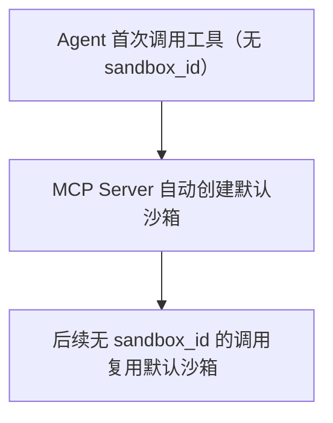
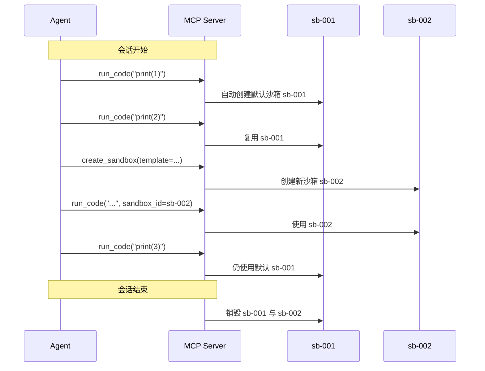
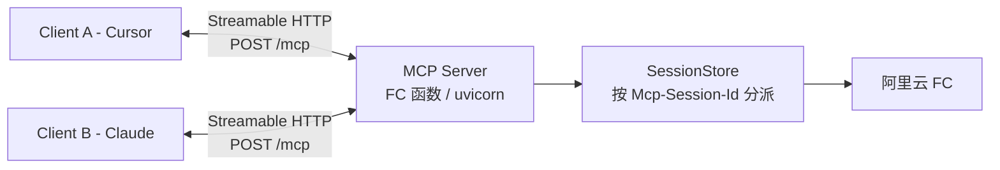
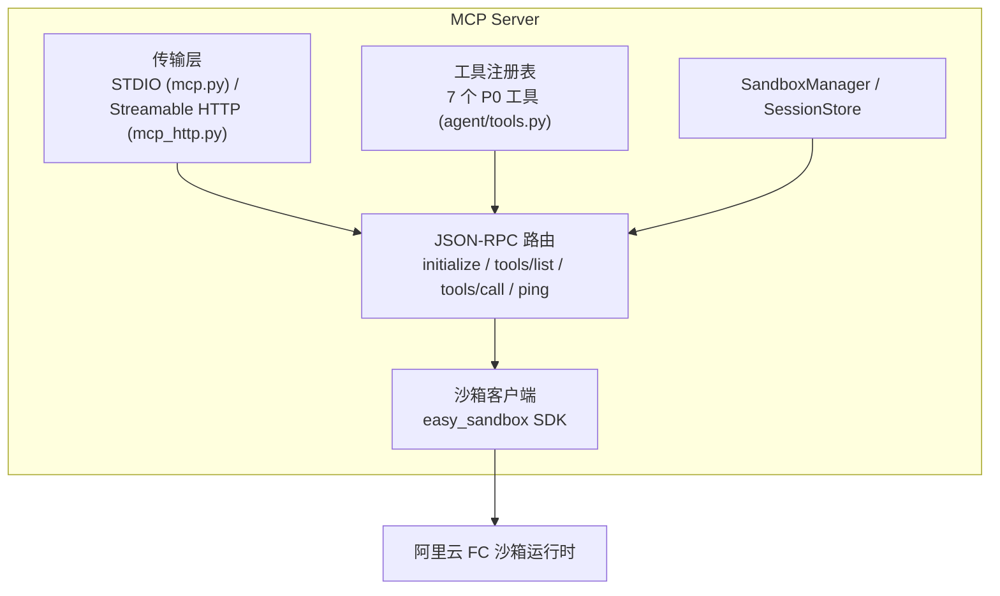
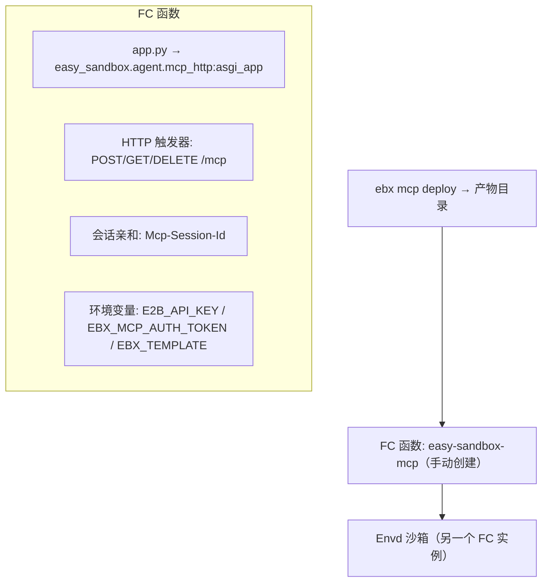

# MCP Server 设计

> Easy Sandbox MCP Server 将沙箱能力暴露为 MCP (Model Context Protocol) Tools，让 AI Agent（Cursor、Claude Desktop、VS Code 等）可以直接操作云端沙箱。

**已实现面**（与 `src/easy_sandbox/agent/` 保持同步）：

- 7 个 P0 工具（`agent/tools.py`）
- STDIO 传输（`agent/mcp.py`）— `ebx mcp start`
- Streamable HTTP 传输（`agent/mcp_http.py`）— Starlette ASGI 应用
- CLI：`ebx mcp install / start / status / deploy`

---

## 1. Tools 定义

全部 7 个工具定义于 `TOOL_SCHEMAS`（`agent/tools.py`）。省略 `sandbox_id` 时作用于默认沙箱（见第 2 章）。

### create_sandbox

```json
{
  "name": "create_sandbox",
  "description": "创建一个云端沙箱环境。返回 sandbox_id 用于后续操作。如果不指定 template，默认使用 code-interpreter-v1。",
  "inputSchema": {
    "type": "object",
    "properties": {
      "template": {
        "type": "string",
        "description": "沙箱模板名称，默认 code-interpreter-v1"
      },
      "timeout": {
        "type": "integer",
        "description": "沙箱超时时间（秒），默认 300",
        "default": 300
      },
      "envs": {
        "type": "object",
        "description": "环境变量键值对",
        "additionalProperties": { "type": "string" }
      }
    }
  },
  "returns": {
    "sandbox_id": "string — 沙箱 ID",
    "status": "string — 沙箱状态",
    "url": "string — 沙箱访问 URL"
  }
}
```

### run_code

```json
{
  "name": "run_code",
  "description": "在沙箱中执行代码（通过 Code Interpreter）。支持 Python、JavaScript 等语言。省略 sandbox_id 时使用默认沙箱。",
  "inputSchema": {
    "type": "object",
    "properties": {
      "code": { "type": "string", "description": "要执行的代码" },
      "language": {
        "type": "string",
        "description": "编程语言，默认 python",
        "enum": ["python", "javascript", "shell", "typescript", "r"],
        "default": "python"
      },
      "sandbox_id": {
        "type": "string",
        "description": "沙箱 ID，省略时使用默认沙箱"
      },
      "timeout": {
        "type": "integer",
        "description": "执行超时（秒），默认 30",
        "default": 30
      }
    },
    "required": ["code"]
  },
  "returns": {
    "stdout": "string",
    "stderr": "string",
    "exit_code": "integer",
    "output_files": "array — [{name, path, size}] 生成的文件列表"
  }
}
```

### run_command

```json
{
  "name": "run_command",
  "description": "在沙箱中执行 Shell 命令。省略 sandbox_id 时使用默认沙箱。",
  "inputSchema": {
    "type": "object",
    "properties": {
      "command": { "type": "string", "description": "Shell 命令" },
      "sandbox_id": { "type": "string", "description": "沙箱 ID" },
      "cwd": {
        "type": "string",
        "description": "工作目录，默认 /app",
        "default": "/app"
      },
      "timeout": {
        "type": "integer",
        "description": "执行超时（秒），默认 60",
        "default": 60
      }
    },
    "required": ["command"]
  },
  "returns": {
    "stdout": "string",
    "stderr": "string",
    "exit_code": "integer"
  }
}
```

### read_file

```json
{
  "name": "read_file",
  "description": "读取沙箱中的文件内容。省略 sandbox_id 时使用默认沙箱。",
  "inputSchema": {
    "type": "object",
    "properties": {
      "path": { "type": "string", "description": "文件绝对路径" },
      "sandbox_id": { "type": "string", "description": "沙箱 ID" },
      "encoding": {
        "type": "string",
        "description": "文件编码，默认 utf-8",
        "default": "utf-8"
      }
    },
    "required": ["path"]
  },
  "returns": { "content": "string" }
}
```

### write_file

```json
{
  "name": "write_file",
  "description": "在沙箱中创建或覆写文件。省略 sandbox_id 时使用默认沙箱。",
  "inputSchema": {
    "type": "object",
    "properties": {
      "path": { "type": "string", "description": "文件绝对路径" },
      "content": { "type": "string", "description": "文件内容" },
      "sandbox_id": { "type": "string", "description": "沙箱 ID" }
    },
    "required": ["path", "content"]
  },
  "returns": { "success": "boolean", "bytes_written": "integer" }
}
```

### list_files

```json
{
  "name": "list_files",
  "description": "列出沙箱中指定目录的文件和子目录。省略 sandbox_id 时使用默认沙箱。",
  "inputSchema": {
    "type": "object",
    "properties": {
      "path": {
        "type": "string",
        "description": "目录路径，默认 /app",
        "default": "/app"
      },
      "sandbox_id": { "type": "string", "description": "沙箱 ID" }
    }
  },
  "returns": {
    "files": "array — [{name, path, type, size}]"
  }
}
```

### kill_sandbox

```json
{
  "name": "kill_sandbox",
  "description": "销毁指定沙箱。省略 sandbox_id 时销毁默认沙箱。",
  "inputSchema": {
    "type": "object",
    "properties": {
      "sandbox_id": {
        "type": "string",
        "description": "要销毁的沙箱 ID，省略时销毁默认沙箱"
      }
    }
  },
  "returns": { "success": "boolean" }
}
```

---

## 2. 会话绑定设计

### 默认沙箱概念

MCP Server 引入「默认沙箱」概念，简化 Agent 操作：



**行为规则**（由 `agent/mcp.py` 中的 `SandboxManager` 实现）：

1. 首次调用任何需要沙箱的工具且未指定 `sandbox_id` 时，懒创建默认沙箱
2. 默认模板：经 `ebx mcp start` 启动时为 `code-interpreter-v1`（CLI 默认值）；编程式构造 `SandboxMCPServer` / HTTP `SessionStore` 且未显式指定模板时为 `base`
3. 会话结束时销毁默认沙箱 — STDIO EOF / server 关闭，或 HTTP `DELETE /mcp` / 空闲会话 TTL 到期
4. Agent 可通过 `create_sandbox` 显式创建新沙箱并用 `sandbox_id` 寻址；无 `sandbox_id` 的调用始终使用默认沙箱



---

## 3. 传输方式

### STDIO — 本地 IDE 集成


- **实现**：`agent/mcp.py` — 自包含的最小 JSON-RPC 2.0 换行分隔 STDIO 处理器，无需外部 `mcp` SDK 依赖
- **协议版本**：`2024-11-05` —— STDIO server 唯一支持的版本。`initialize` 在请求该版本时回显，请求缺失或不支持时也回退到该版本，保持原有行为不变
- **支持方法**：`initialize`、`notifications/initialized`、`tools/list`、`tools/call`、`ping`
- **适用场景**：本地开发、单用户，IDE 直接拉起进程
- **启动方式**：`ebx mcp start [--template 名称] [--api-key KEY] [--api-url URL] [--domain DOMAIN]`（通常由 IDE 调用，无需手动执行）

### Streamable HTTP — 远程部署



- **实现**：`agent/mcp_http.py` — `create_mcp_app()` 返回的 Starlette ASGI 应用；同时提供模块级 `asgi_app` 入口
- **协议**：MCP Streamable HTTP（规范 2025-06-18）
- **端点**：
  - `POST /mcp` — JSON-RPC 请求；`initialize` 创建会话并返回 `Mcp-Session-Id`，后续请求必须携带该头
  - `DELETE /mcp` — 会话终止并清理沙箱（需要 `Mcp-Session-Id`）
  - `GET /mcp` — 当前返回 501；SSE 服务端通知尚未实现
  - `GET /health` — 健康检查，返回 `{"status": "ok", "protocol": "2025-06-18"}`
- **会话**：进程内 `SessionStore`；空闲 TTL 默认 3600 秒、并发会话上限默认 100；容量满时返回 503 与 JSON-RPC 错误 `-32000`
- **版本协商**：`initialize` 在请求版本受支持时原样回显；本传输仅支持 `2025-06-18`，与 `GET /health` 一致。请求缺失或不支持的版本时协商到 `2025-06-18` —— 按 MCP 规范，服务器回复自己支持的版本，无法接受的客户端可自行断开。STDIO 传输独立保持 `2024-11-05`
- **适用场景**：远程服务、团队共享、多客户端；用 `ebx mcp deploy` 产物部署到阿里云 FC，或本地以 uvicorn 运行
- **可选依赖**：Starlette + uvicorn（`pip install 'easy-sandbox[mcp]'`）

### 认证

- **客户端 → MCP**：`Authorization: Bearer <token>`，常量时间比较校验；经 `EBX_MCP_AUTH_TOKEN` 配置。未配置时认证关闭；配置为空时 fail-closed（所有请求返回 401）
- **MCP → 沙箱**：`E2B_API_KEY`（或 `SANDBOX_API_KEY`）环境变量

### 环境变量

| 变量 | 用途 |
|------|------|
| `E2B_API_KEY` / `SANDBOX_API_KEY` | 沙箱后端 API Key |
| `E2B_API_URL` / `SANDBOX_API_BASE_URL` | Platform API URL 覆盖 |
| `E2B_DOMAIN` | 沙箱 Domain 覆盖 |
| `SANDBOX_TEMPLATE` / `EBX_TEMPLATE` | 默认沙箱模板 |
| `EBX_MCP_AUTH_TOKEN` | 客户端认证 Bearer token（HTTP 传输） |

---

## 4. Server 架构图



---

## 5. 安装方式与 CLI

### 一键安装

```bash
# 安装到 Cursor
ebx mcp install --target cursor

# 安装到 Claude Desktop
ebx mcp install --target claude

# 安装到 VS Code (Copilot)
ebx mcp install --target vscode
```

`install` 将 `easy-sandbox` 条目（`command: ebx`、`args: ["mcp", "start"]`，以及可用时含 `E2B_API_KEY` 的 env 块）合并进目标 IDE 的配置文件：Cursor `~/.cursor/mcp.json`、Claude Desktop `claude_desktop_config.json`、VS Code 工作区 `.vscode/settings.json`（`mcp.servers` 键）。

### 安装过程

```bash
$ ebx mcp install --target cursor

MCP Server config written to /Users/you/.cursor/mcp.json

Registered tools:
  • create_sandbox     — Create a cloud sandbox
  • run_code           — Execute code
  • run_command        — Execute a command
  • read_file          — Read a file
  • write_file         — Write a file
  • list_files         — List files
  • kill_sandbox       — Destroy a sandbox

Please restart Cursor to apply changes.
```

### status

```bash
ebx mcp status            # 表格输出
ebx --json mcp status     # JSON 输出
```

报告 server 名称、传输方式（stdio）、工具数量与名称、API key 是否已配置、以及各支持 IDE 中的安装状态。

---

## 6. 配置示例

### Claude Desktop

```json
// ~/Library/Application Support/Claude/claude_desktop_config.json
{
  "mcpServers": {
    "easy-sandbox": {
      "command": "ebx",
      "args": ["mcp", "start"],
      "env": {
        "E2B_API_KEY": "your-api-key"
      }
    }
  }
}
```

### Cursor

```json
// ~/.cursor/mcp.json
{
  "mcpServers": {
    "easy-sandbox": {
      "command": "ebx",
      "args": ["mcp", "start"],
      "env": {
        "E2B_API_KEY": "your-api-key"
      }
    }
  }
}
```

### VS Code

```json
// .vscode/settings.json
{
  "mcp.servers": {
    "easy-sandbox": {
      "command": "ebx",
      "args": ["mcp", "start"],
      "env": {
        "E2B_API_KEY": "your-api-key"
      }
    }
  }
}
```

### 远程（Streamable HTTP）

部署 HTTP 应用（第 7 章）后，客户端指向该端点；配置了 token 时附加 Bearer 头：

```json
{
  "mcpServers": {
    "easy-sandbox-remote": {
      "url": "https://<FC_HTTP_TRIGGER_URL>/mcp",
      "headers": {
        "Authorization": "Bearer <BEARER_TOKEN>"
      }
    }
  }
}
```

---

## 7. FC 部署

> **状态：** `ebx mcp deploy` 生成部署产物；自动调用 FC 部署 API **尚未实现**。生成后会打印手动部署步骤。

### 架构

MCP Server 可部署到阿里云函数计算 (FC) 作为 Streamable HTTP 端点，利用 FC 原生的 MCP 会话亲和路由。



### CLI 命令

```bash
ebx mcp deploy \
  --name easy-sandbox-mcp \
  --region cn-hangzhou \
  --template base \
  --memory 512 --timeout 600 \
  --generate-token \
  --api-key $E2B_API_KEY \
  --output-dir ./mcp-artifact
```

选项：`--name`（默认 `easy-sandbox-mcp`）、`--region`（命令级覆盖；回退到 `ebx config set region` / `SANDBOX_REGION` 环境变量，否则 `cn-hangzhou`）、`--template`（默认 `base`）、`--memory`（默认 512）、`--timeout`（默认 600）、Bearer token 来源 `--auth-token-file` / `--generate-token` / 环境变量 `EBX_MCP_AUTH_TOKEN`、`--enable-session-affinity/--no-session-affinity`（默认启用）、`--api-key`、`--custom-domain`、`--output-dir`。

### 产物内容

| 文件 | 内容 |
|------|------|
| `requirements.txt` | `easy-sandbox[mcp]`、`uvicorn>=0.29` |
| `app.py` | ASGI 入口，从 FC 函数环境变量读取 `EBX_MCP_AUTH_TOKEN`、`E2B_API_KEY`/`SANDBOX_API_KEY`、`E2B_API_URL`/`SANDBOX_API_BASE_URL`、`E2B_DOMAIN`、`SANDBOX_TEMPLATE`/`EBX_TEMPLATE` |
| `config.yaml` | YAML 部署清单（非 FC API 载荷）：`function_name`、`region`、`runtime`（`python3.10`）、`handler`（`app.app`）、`memory`、`timeout`、`environment_variables`、`http_trigger`（POST/GET/DELETE 方法 + `enable_session_affinity`）、可选 `custom_domain` |

`ebx mcp deploy` 还会打印手动部署步骤（打包产物、经 FC 控制台或 SDK 创建函数、创建 HTTP 触发器、如支持则启用 `Mcp-Session-Id` 亲和）以及 Bearer token 打码的 IDE 配置模板。

### 关键设计要点

- **协议**：Streamable HTTP（MCP 规范 2025-06-18）；`initialize` 协商 `2025-06-18`，与 `GET /health` 一致（STDIO 独立保持 `2024-11-05`）
- **会话亲和**：委托 FC 平台层通过 `Mcp-Session-Id` 头实现 — 无需应用层粘性路由
- **认证**：双层 — 客户端→MCP 使用 `Authorization: Bearer <token>`；MCP→沙箱使用 FC 环境变量中的 `E2B_API_KEY`
- **生命周期**：沙箱按 MCP 会话懒创建；`DELETE /mcp` 触发清理；空闲会话 TTL 作为安全网
- **冷启动**：FC 冷启动 (~1–3s) 可能与 MCP initialize 超时冲突；生产环境建议使用预留实例
- **密钥**：`config.yaml` 含 API key 与 Bearer token — 切勿提交到版本控制

详见 [CLI 设计 — mcp deploy](cli-design.md#mcp-deploy) 获取完整参数参考，[MCP 集成指南](../guide/mcp-integration.md) 获取端到端用法。
