# SDK API 设计 — 三种使用范式

> Easy Sandbox SDK 提供三种使用范式，覆盖从简单脚本到复杂 AI 应用的全部场景。用户可根据需求选择最适合的范式，三种范式可混合使用。

---

## 目录

0. [核心设计理念：自然语言优先](#核心设计理念自然语言优先)
1. [范式一：E2B 兼容模式](#范式一e2b-兼容模式)
2. [范式二：装饰器模式](#范式二装饰器模式modal-风格)
3. [范式三：内置 Agent 模式](#范式三内置-agent-模式)
4. [配置系统](#配置系统)
5. [Sandbox 核心 API](#sandbox-核心-api)
6. [Image 链式构建](#image-链式构建)
7. [SandboxPool 沙箱池](#sandboxpool-沙箱池)
8. [FC Extensions](#fc-extensions)
9. [错误处理体系](#错误处理体系)

---

## 核心设计理念：自然语言优先

> **用户不需要知道模板名、资源规格、配置参数，只需要描述想做什么，SDK 自动搞定一切。** 这是真正的 AI-First。

`Sandbox.create()` 的第一个参数既可以是传统的 `template` 关键字参数，也可以直接传入一段**自然语言描述**。SDK 内部通过「配置推断 Agent」自动解析意图，选择最优模板和资源配置。

### 自然语言创建沙箱

```python
from easy_sandbox import Sandbox

# 自然语言描述 → SDK 自动推断模板 + 资源配置
sb = await Sandbox.create("运行 python 数据分析环境，需要 GPU")
# 推断结果：template=python-data-science, gpu=auto, memory=8192

sb = await Sandbox.create("启动一个 Node.js Web 服务，开放 3000 端口")
# 推断结果：template=node-web, expose=[3000]

sb = await Sandbox.create("用 playwright 爬取网页并截图")
# 推断结果：template=browser-automation, memory=4096

sb = await Sandbox.create("运行 python，运行 codex")
# 推断结果：template=code-interpreter, cpu=2
```

### 推断透明化

```python
# 查看推断结果（不实际创建）
plan = await Sandbox.plan("需要一个能跑 TensorFlow 的环境，数据集 50GB")
print(plan)
# SandboxPlan(
#   template='ml-gpu',
#   cpu=4, memory=16384, disk=65536,
#   gpu='A10',
#   mounts=[NASMount(size='100G')],
#   confidence=0.92,
#   reasoning='检测到 TensorFlow + 大数据集需求，选择 GPU 模板并扩容磁盘'
# )

# 用户可选择接受或覆盖
sb = await Sandbox.create(plan)                     # 直接使用推断结果
sb = await Sandbox.create(plan, memory=32768)        # 覆盖部分参数
```

### 自然语言 + 文件上下文

```python
# 携带本地文件，SDK 自动推断环境需求
sb = await Sandbox.create(
    "分析这个 CSV 文件并生成可视化图表",
    upload=["./data.csv"],                           # 自动上传到沙箱
)
result = await sb.agent.analyze("做趋势分析", data="/app/data.csv")

# 从项目目录推断
sb = await Sandbox.create(
    "部署并运行这个项目",
    project_dir="./my-flask-app",                    # 自动检测 requirements.txt → python
)
```

### 向后兼容

自然语言创建与传统 template 参数**完全兼容**，`create()` 智能判断第一个参数：
- 如果匹配已知模板名（如 `"base"`, `"code-interpreter"`）→ 按模板创建
- 如果是自然语言描述 → 调用配置推断 Agent

```python
# 传统模式 — 100% 兼容 E2B
sb = await Sandbox.create(template="code-interpreter")

# 自然语言模式 — 新能力
sb = await Sandbox.create("运行 Python 数据分析")

# 两者可以混合
sb = await Sandbox.create("需要 GPU 环境", template="ml-gpu", memory=32768)
```

---

## 范式一：E2B 兼容模式

完全兼容 E2B SDK 的 API 签名，现有 E2B 用户可**零修改**迁移。

### 基础用法

```python
from easy_sandbox import Sandbox

# 创建沙箱（async 模式）
sb = await Sandbox.create(template="code-interpreter")

# 执行代码
result = await sb.run_code("print('Hello, AliCloud!')")
print(result.text)  # Hello, AliCloud!

# 执行命令
result = await sb.commands.run("ls -la /app")
print(result.stdout)

# 文件操作
await sb.files.write("/app/data.csv", "name,age\nAlice,30\nBob,25")
content = await sb.files.read("/app/data.csv")
files = await sb.files.list("/app")

# 销毁沙箱
await sb.kill()
```

### 同步模式

```python
from easy_sandbox import Sandbox

# 同步 API（内部自动管理事件循环）
sb = Sandbox.create_sync(template="code-interpreter")
result = sb.run_code_sync("print(1+1)")
sb.kill_sync()
```

### Context Manager

```python
from easy_sandbox import Sandbox

async with await Sandbox.create(template="code-interpreter") as sb:
    result = await sb.run_code("import sys; print(sys.version)")
    # 退出时自动销毁沙箱
```

### 流式输出

```python
sb = await Sandbox.create(template="code-interpreter")

# 流式获取命令输出
async for chunk in sb.commands.stream("pip install pandas && python train.py"):
    if chunk.type == "stdout":
        print(chunk.data, end="")
    elif chunk.type == "stderr":
        print(f"[ERR] {chunk.data}", end="")
    elif chunk.type == "exit":
        print(f"\n退出码: {chunk.exit_code}")
```

---

## 范式二：装饰器模式（Modal 风格）

借鉴 Modal 的声明式体验，用装饰器将本地函数透明地在远程沙箱中执行。

### 基础用法

```python
from easy_sandbox import sandbox, Image

@sandbox(template="python-data-science", cpu=2, memory=4096)
def analyze(data: str) -> str:
    import pandas as pd
    import io
    
    df = pd.read_csv(io.StringIO(data))
    summary = df.describe().to_string()
    return f"数据分析结果:\n{summary}"

# 调用时自动：创建沙箱 → 序列化参数 → 远程执行 → 返回结果 → 销毁
result = analyze("name,score\nAlice,95\nBob,87\nCarol,92")
print(result)
```

### 自定义镜像

```python
from easy_sandbox import sandbox, Image

custom_image = (
    Image.from_template("python-data-science")
    .pip_install("scikit-learn", "xgboost", "lightgbm")
    .apt_install("libgomp1")
    .copy_local("./models/", "/app/models/")
    .env(MODEL_PATH="/app/models/latest.pkl")
)

@sandbox(image=custom_image, cpu=4, memory=8192, timeout=300)
def train_model(dataset_path: str) -> dict:
    import joblib
    from sklearn.ensemble import RandomForestClassifier
    
    model = RandomForestClassifier(n_estimators=100)
    # ... 训练逻辑
    return {"accuracy": 0.95, "model_path": "/app/output/model.pkl"}
```

### Async 装饰器

```python
from easy_sandbox import sandbox

@sandbox(template="node-web", async_mode=True)
async def run_lighthouse(url: str) -> dict:
    import subprocess, json
    result = subprocess.run(
        ["npx", "lighthouse", url, "--output=json", "--quiet"],
        capture_output=True, text=True
    )
    return json.loads(result.stdout)

# 并发执行多个任务
import asyncio
results = await asyncio.gather(
    run_lighthouse("https://example.com"),
    run_lighthouse("https://test.com"),
)
```

### 带状态的装饰器（持久沙箱）

```python
from easy_sandbox import sandbox

@sandbox(template="python-base", persistent=True, sandbox_id="my-dev-env")
def install_deps():
    import subprocess
    subprocess.run(["pip", "install", "flask", "sqlalchemy"], check=True)
    return "依赖安装完成"

@sandbox(template="python-base", persistent=True, sandbox_id="my-dev-env")
def run_app():
    # 复用上面的沙箱，已安装的依赖仍然存在
    from flask import Flask
    app = Flask(__name__)
    return "App started"
```

---

## 范式三：内置 Agent 模式

全新设计 — SDK 内置预配置的 AI Agent，一行代码完成复杂任务。

### 浏览器 Agent

```python
from easy_sandbox import Sandbox

sb = await Sandbox.create(template="browser-automation")

# 自动化网页操作
result = await sb.agent.browse("访问 https://example.com 并截图首页")
print(result.screenshot)  # base64 截图
print(result.summary)     # 页面摘要

# 复杂交互
result = await sb.agent.browse(
    "登录 GitHub，搜索 'easy-sandbox'，获取第一个仓库的 star 数"
)
print(result.data)  # {"repo": "...", "stars": 1234}
```

### 代码分析 Agent

```python
sb = await Sandbox.create(template="code-interpreter")

source_code = open("my_app.py").read()
result = await sb.agent.code("分析这段代码的复杂度并给出优化建议", code=source_code)
print(result.analysis)
print(result.suggestions)
```

### 数据分析 Agent

```python
sb = await Sandbox.create(template="python-data-science")

csv_content = open("sales_data.csv").read()
result = await sb.agent.analyze("对这个 CSV 做趋势分析并生成可视化图表", data=csv_content)
print(result.report)       # Markdown 格式的分析报告
print(result.charts)       # 生成的图表列表（base64）
print(result.insights)     # 关键洞察
```

### Shell 自动化 Agent

```python
sb = await Sandbox.create(template="base")

result = await sb.agent.shell("安装 nginx 并配置反向代理到 8080 端口")
print(result.commands)     # 执行的命令列表
print(result.status)       # 最终状态
```

### 调试 Agent

```python
sb = await Sandbox.create(template="code-interpreter")

error_info = """
Traceback (most recent call last):
  File "app.py", line 42, in process
    result = data['key'] / total
ZeroDivisionError: division by zero
"""
result = await sb.agent.debug("诊断这个错误并提供修复方案", error=error_info)
print(result.diagnosis)    # 错误诊断
print(result.fix)          # 修复代码
print(result.explanation)  # 解释
```

### 自定义 Agent

```python
from easy_sandbox import Agent, Sandbox

# 创建自定义 Agent
my_agent = Agent(
    name="code-reviewer",
    model="qwen-max",                    # 支持 openai / anthropic / qwen
    system_prompt="你是一个严格的代码审查专家，关注安全性、性能和可维护性。",
    tools=["run_code", "read_file", "write_file", "run_command"],
    sandbox=Sandbox.Config(
        template="python-base",
        cpu=2,
        memory=4096,
    ),
)

# 执行任务
result = await my_agent.run("审查这个 PR 的代码质量", context={
    "files": ["src/auth.py", "src/api.py"],
    "diff": git_diff_content,
})
print(result.review)       # 审查报告
print(result.score)        # 质量评分
print(result.issues)       # 发现的问题列表
```

---

## 配置系统

### Zero Config 设计

SDK 采用零配置理念，按优先级加载配置：

```
代码参数 > 环境变量 > .env 文件 > ~/.ebx/config.toml > 默认值
```

### 环境变量

```bash
# 主认证（必须）
export E2B_API_KEY=your-api-key

# 扩展认证（可选）
export ALICLOUD_ACCESS_KEY_ID=your-ak
export ALICLOUD_ACCESS_KEY_SECRET=your-sk

# 可选配置
export SANDBOX_REGION=cn-hangzhou                # 默认区域
export SANDBOX_TIMEOUT=300                       # 默认超时（秒）
export SANDBOX_LOG_LEVEL=INFO                    # 日志级别
```

### 配置文件

```toml
# ~/.ebx/config.toml

[default]
region = "cn-hangzhou"
timeout = 300

[default.auth]
access_key_id = "your-ak"
access_key_secret = "your-sk"

[profiles.production]
region = "cn-shanghai"
timeout = 600

[profiles.production.auth]
access_key_id = "prod-ak"
access_key_secret = "prod-sk"
```

### 代码配置

```python
from easy_sandbox import Sandbox, Config

# 全局配置
Config.set(
    region="cn-hangzhou",
    timeout=300,
    log_level="DEBUG",
)

# 实例级配置（覆盖全局）
sb = await Sandbox.create(
    template="code-interpreter",
    region="cn-shanghai",
    timeout=600,
)
```

---

## Sandbox 核心 API

### Sandbox 类完整接口

```python
class Sandbox:
    """沙箱核心类 — 所有操作的统一入口"""

    # ── 生命周期 ──────────────────────────────────────
    
    @classmethod
    async def create(
        cls,
        description: str | None = None,      # 自然语言描述（AI-First）
        *,
        template: str = "base",
        timeout: int = 300,
        metadata: dict | None = None,
        env: dict[str, str] | None = None,
        cpu: int | None = None,
        memory: int | None = None,            # MB，None 时由推断 Agent 决定
        disk: int | None = None,              # MB
        gpu: str | None = None,               # GPU 型号或 "auto"
        persistent: bool = False,
        hibernate_after: int | None = None,   # 秒
        region: str | None = None,
        vpc: VPCConfig | None = None,
        on_exit: Literal["destroy", "hibernate", "keep"] = "destroy",
        upload: list[str] | None = None,      # 本地文件自动上传
        project_dir: str | None = None,       # 项目目录自动部署
    ) -> "Sandbox":
        """
        创建沙箱。

        第一个参数 description 支持两种模式：
        - 传入已知模板名（如 'code-interpreter'）→ 直接按模板创建
        - 传入自然语言描述 → 调用配置推断 Agent 自动选择模板和资源

        当 description 为自然语言时，显式传入的 template/cpu/memory 等参数
        将覆盖推断结果（用户意图优先）。
        """
        ...

    @classmethod
    async def plan(
        cls,
        description: str,
        **kwargs,
    ) -> "SandboxPlan":
        """预览自然语言推断结果，不实际创建沙箱。"""
        ...

    @classmethod
    async def connect(cls, sandbox_id: str) -> "Sandbox": ...

    async def kill(self) -> None: ...
    async def hibernate(self) -> None: ...
    async def wake_up(self) -> "Sandbox": ...
    async def snapshot(self, name: str) -> str: ...
    async def keep_alive(self, duration: int) -> None: ...

    # ── 属性 ──────────────────────────────────────────
    
    @property
    def id(self) -> str: ...
    @property
    def status(self) -> SandboxStatus: ...
    @property
    def url(self) -> str: ...
    @property
    def metadata(self) -> dict: ...

    # ── 代码执行 ──────────────────────────────────────
    
    async def run_code(
        self,
        code: str,
        *,
        language: str = "python",
        timeout: int = 30,
        env: dict[str, str] | None = None,
    ) -> CodeResult: ...

    # ── 命令能力与命名命令 ────────────────────

    @property
    def capabilities(self) -> frozenset[str]:
        """本沙箱的有效标准能力集（frozenset[str]）。标准能力词汇表：
        shell / files / code / terminal / ports（可扩展）。
        由模板 `capabilities` 声明决定；省略时继承默认基线
        DEFAULT_CAPABILITIES = {shell, files, code}。
        """
        ...

    def list_commands(self) -> list[dict[str, Any]]:
        """模板声明的自定义命令，返回 dict 列表（非对象）。
        每个 dict 形如：
            {"name": str,
             "description": str,
             "args": [{"name": str, "required": bool,
                       "default": str | None, "description": str}]}
        """
        ...

    async def run(self, name: str, **args: str) -> ProcessResult:
        """显式动态派发模板声明的命名命令（非 __getattr__ 魔法）。
        参数值经 shlex.quote() 转义后填充 {占位符}；
        name 未声明或缺少 required 参数时报错。
        """
        ...

    # ── 子模块 ────────────────────────────────────────
    
    @property
    def commands(self) -> CommandsModule: ...
    @property
    def files(self) -> FilesModule: ...
    @property
    def agent(self) -> AgentModule: ...
    @property
    def network(self) -> NetworkModule: ...
```

### CommandsModule

```python
class CommandsModule:
    """命令执行模块"""

    async def run(
        self,
        cmd: str,
        *,
        timeout: int = 60,
        env: dict[str, str] | None = None,
        cwd: str = "/app",
        user: str = "user",
    ) -> ProcessResult: ...

    async def stream(
        self,
        cmd: str,
        **kwargs,
    ) -> AsyncIterator[ProcessChunk]: ...

    async def start(
        self,
        cmd: str,
        **kwargs,
    ) -> Process: ...
```

### FilesModule

```python
class FilesModule:
    """文件操作模块"""

    async def read(self, path: str, *, encoding: str = "utf-8") -> str: ...
    async def read_bytes(self, path: str) -> bytes: ...
    async def write(self, path: str, content: str | bytes, **kwargs) -> None: ...
    async def list(self, path: str = "/") -> list[FileInfo]: ...
    async def remove(self, path: str) -> None: ...
    async def exists(self, path: str) -> bool: ...
    async def upload(self, local_path: str, remote_path: str) -> None: ...
    async def download(self, remote_path: str, local_path: str) -> None: ...
    async def watch(self, path: str) -> AsyncIterator[WatchEvent]: ...
```

### NetworkModule

```python
class NetworkModule:
    """网络管理模块"""

    async def get_url(self, port: int) -> str: ...
    async def expose(self, port: int, *, public: bool = False) -> str: ...
    async def forward(self, remote_port: int, local_port: int) -> None: ...
    async def list_ports(self) -> list[PortInfo]: ...
```

### 命令能力模型与命名命令

SDK 采用**能力驱动 + 类型安全动态**的命令表面：

- **标准能力保留带类型方法**（`sandbox.commands.run` / `sandbox.files.upload` 等），受能力门控；调用不在有效能力集内的标准能力会抛出 `CapabilityNotSupportedError`（E3004）。
- **自定义命令走显式动态派发** `sandbox.run("name", **args)`——不用 `__getattr__` 魔法属性，以保 mypy + `py.typed` 类型安全。
- **发现 API**：`sandbox.capabilities` 查看有效能力集，`sandbox.list_commands()` 列出模板声明的自定义命令。

```python
sb = await Sandbox.create(template="python-base")

# 发现：有效能力集与可用命名命令
print(sb.capabilities)          # frozenset({'shell', 'files', 'code'})
for c in sb.list_commands():          # c 是 dict，不是对象
    print(c["name"], c["description"], c["args"])
    # c["args"] 为 {name, required, default, description} 字典列表

# 标准能力：带类型、受门控
result = await sb.commands.run("ls -la /app")   # 需 'shell' 能力
await sb.files.upload("./data.csv", "/app/data.csv")  # 需 'files' 能力

# 自定义命令：显式动态派发（参数经 shlex.quote() 转义）
result = await sb.run("serve", port="9000")

# 调用沙箱不具备的能力 → 明确报错，不静默降级
from easy_sandbox.errors import CapabilityNotSupportedError
try:
    await sb.commands.run("tmux new-session")   # 需 'terminal'，未声明
except CapabilityNotSupportedError as e:
    print(f"[{e.code}] {e.message}")
    print(f"修复建议: {e.suggestion}")   # 提示在 template.yaml 声明该能力
```

> 能力词汇表、默认基线 `DEFAULT_CAPABILITIES = {shell, files, code}` 与门控语义详见 ADR
> `2026-09-03-capability-model.md`、`2026-09-03-sdk-capability-surface.md` 与 `2026-09-03-custom-commands-schema.md`。

---

## Image 链式构建

```python
from easy_sandbox import Image

# 链式构建自定义镜像
image = (
    Image.from_template("python-base")                  # 基于官方模板
    .python_version("3.11")                             # Python 版本
    .pip_install("pandas", "numpy", "matplotlib")       # pip 依赖
    .pip_install_from_requirements("./requirements.txt") # 从文件安装
    .apt_install("ffmpeg", "libsm6")                    # 系统包
    .copy_local("./src/", "/app/src/")                  # 复制本地文件
    .copy_local("./models/", "/app/models/")
    .run_command("chmod +x /app/src/entrypoint.sh")     # 执行命令
    .env(
        MODEL_PATH="/app/models/latest.pkl",
        DATA_DIR="/app/data",
    )                                                    # 环境变量
    .workdir("/app")                                     # 工作目录
    .expose(8080)                                        # 暴露端口
    .entrypoint("python /app/src/main.py")              # 入口命令
)

# 使用镜像创建沙箱
sb = await Sandbox.create(image=image)

# 构建并推送为模板
template_id = await image.build_and_push(name="my-ml-env", tag="v1.0")
```

### Image 从 Dockerfile 构建

```python
image = Image.from_dockerfile("./Dockerfile")
image = Image.from_dockerfile_string("""
FROM python:3.11-slim
RUN pip install flask
COPY . /app
WORKDIR /app
CMD ["python", "app.py"]
""")
```

---

## SandboxPool 沙箱池

```python
from easy_sandbox import SandboxPool

# 创建沙箱池
pool = SandboxPool(
    template="code-interpreter",
    min_ready=3,           # 最小预热数量
    max_size=20,           # 最大沙箱数量
    idle_timeout=300,      # 空闲超时（秒）
    scale_policy="auto",   # 自动扩缩容
)

await pool.start()

# 从池中获取沙箱（毫秒级）
async with pool.acquire() as sb:
    result = await sb.run_code("print('instant!')")
    # 归还后沙箱被重置并放回池中

# 批量执行
tasks = ["print(i)" for i in range(100)]
results = await pool.map(lambda sb, code: sb.run_code(code), tasks)

# 池状态
status = pool.status()
print(f"就绪: {status.ready}, 使用中: {status.in_use}, 总计: {status.total}")

await pool.shutdown()
```

---

## FC Extensions

### VPC 网络配置

```python
from easy_sandbox import Sandbox
from easy_sandbox.extensions import VPCConfig

sb = await Sandbox.create(
    template="base",
    vpc=VPCConfig(
        vpc_id="vpc-xxx",
        vswitch_ids=["vsw-xxx"],
        security_group_id="sg-xxx",
    ),
)

# 沙箱内可直接访问 VPC 内网资源
result = await sb.commands.run("curl http://10.0.1.100:3306")
```

### OSS 挂载

```python
from easy_sandbox.extensions import OSSMount

sb = await Sandbox.create(
    template="python-data-science",
    mounts=[
        OSSMount(
            bucket="my-data-bucket",
            remote_path="datasets/",
            mount_point="/data",
            read_only=True,
        ),
        OSSMount(
            bucket="my-output-bucket",
            remote_path="results/",
            mount_point="/output",
            read_only=False,
        ),
    ],
)

# 沙箱内直接读写 OSS
result = await sb.run_code("""
import pandas as pd
df = pd.read_csv('/data/train.csv')   # 读取 OSS
df.to_csv('/output/result.csv')        # 写入 OSS
""")
```

### 自定义域名

```python
from easy_sandbox.extensions import DomainConfig

sb = await Sandbox.create(
    template="node-web",
    domain=DomainConfig(
        domain="sandbox.example.com",
        port=3000,
        tls=True,                        # 自动 TLS 证书
        cors=["https://myapp.com"],
    ),
)
print(sb.network.public_url)  # https://sandbox.example.com
```

---

## 错误处理体系

### 异常类层次

```mermaid
classDiagram
    class SandboxError {
        <<基类>>
    }
    class AuthenticationError {
        认证失败
    }
    class InvalidCredentialsError {
        E1003 AK/SK 无效
    }
    class TokenExpiredError {
        E1002 Token 过期
    }
    class SandboxCreationError {
        创建失败
    }
    class TemplateNotFoundError {
        E2001 模板不存在
    }
    class QuotaExceededError {
        E2002 配额超限
    }
    class RegionUnavailableError {
        E2003 区域不可用
    }
    class ExecutionError {
        执行失败
    }
    class TimeoutError {
        E3001 执行超时
    }
    class ProcessError {
        E3002 进程异常退出
    }
    class CodeExecutionError {
        E3003 代码执行错误
    }
    class CapabilityNotSupportedError {
        E3004 能力不支持
    }
    class FileOperationError {
        文件操作失败
    }
    class FileNotFoundError {
        E4001 文件不存在
    }
    class PermissionDeniedError {
        权限不足
    }
    class NetworkError {
        网络错误
    }
    class ConnectionError {
        E5001 连接失败
    }
    class PortConflictError {
        端口冲突
    }
    class AgentError {
        Agent 错误
    }
    class LLMProviderError {
        LLM 调用失败
    }
    class ToolExecutionError {
        工具执行失败
    }

    SandboxError <|-- AuthenticationError
    SandboxError <|-- SandboxCreationError
    SandboxError <|-- ExecutionError
    SandboxError <|-- FileOperationError
    SandboxError <|-- NetworkError
    SandboxError <|-- AgentError
    AuthenticationError <|-- InvalidCredentialsError
    AuthenticationError <|-- TokenExpiredError
    SandboxCreationError <|-- TemplateNotFoundError
    SandboxCreationError <|-- QuotaExceededError
    SandboxCreationError <|-- RegionUnavailableError
    ExecutionError <|-- TimeoutError
    ExecutionError <|-- ProcessError
    ExecutionError <|-- CodeExecutionError
    ExecutionError <|-- CapabilityNotSupportedError
    FileOperationError <|-- FileNotFoundError
    FileOperationError <|-- PermissionDeniedError
    NetworkError <|-- ConnectionError
    NetworkError <|-- PortConflictError
    AgentError <|-- LLMProviderError
    AgentError <|-- ToolExecutionError
```



### 错误码体系

| 错误码 | 类别 | 含义 | 修复建议 |
|--------|------|------|----------|
| `E1001` | 认证 | API Key 无效 | 检查 E2B_API_KEY 环境变量 |
| `E1002` | 认证 | Token 过期 | SDK 将自动刷新，若持续出现请检查时钟同步 |
| `E1003` | 认证 | AK/SK 无效 | 检查 ALICLOUD_ACCESS_KEY_ID 环境变量 |
| `E2001` | 创建 | 模板不存在 | 运行 `ebx template list` 查看可用模板 |
| `E2002` | 创建 | 配额超限 | 联系管理员提升配额或销毁闲置沙箱 |
| `E2003` | 创建 | 区域不可用 | 切换到可用区域：cn-hangzhou, cn-shanghai |
| `E3001` | 执行 | 命令超时 | 增大 timeout 参数或优化命令 |
| `E3002` | 执行 | 进程异常退出 | 检查 stderr 输出获取详细错误信息 |
| `E3003` | 执行 | 代码执行失败（CodeExecutionError） | 检查代码语法与沙箱模板中的运行时依赖 |
| `E3004` | 执行 | 能力不支持（CapabilityNotSupportedError） | 沙箱未声明该标准能力，在 template.yaml 的 `capabilities` 中声明 |
| `E4001` | 文件 | 文件不存在 | 确认路径正确，使用 `files.list()` 检查 |
| `E5001` | 网络 | 连接失败 | 检查网络连通性和防火墙规则 |
| `E6001` | Session | Session 未找到 | 运行 `ebx session list` 查看可用 Session |

### 错误处理示例

```python
from easy_sandbox import Sandbox
from easy_sandbox.errors import (
    SandboxError,
    QuotaExceededError,
    TimeoutError,
    TemplateNotFoundError,
)

try:
    sb = await Sandbox.create(template="code-interpreter")
    result = await sb.run_code("import time; time.sleep(100)", timeout=5)
except TemplateNotFoundError as e:
    print(f"模板不存在: {e.template}")
    print(f"可用模板: {e.available_templates}")
except QuotaExceededError as e:
    print(f"配额超限: {e.current}/{e.limit}")
    print(f"修复建议: {e.suggestion}")
except TimeoutError as e:
    print(f"执行超时: {e.timeout}s")
    print(f"已执行输出: {e.partial_output}")
except SandboxError as e:
    print(f"[{e.code}] {e.message}")
    print(f"修复建议: {e.suggestion}")
    print(f"文档链接: {e.docs_url}")
```

---

## 数据模型

### 返回值类型

```python
from dataclasses import dataclass
from typing import Literal

@dataclass
class CodeResult:
    """代码执行结果"""
    text: str                          # 文本输出
    stdout: str                        # 标准输出
    stderr: str                        # 标准错误
    exit_code: int                     # 退出码
    output_files: list[OutputFile]     # 生成的文件（图片等）
    execution_time: float              # 执行耗时（秒）

@dataclass
class ProcessResult:
    """命令执行结果"""
    stdout: str
    stderr: str
    exit_code: int
    execution_time: float

@dataclass
class FileInfo:
    """文件信息"""
    name: str
    path: str
    type: Literal["file", "directory"]
    size: int                          # 字节
    modified: datetime

@dataclass
class AgentResult:
    """Agent 执行结果"""
    success: bool
    summary: str                       # 执行摘要
    data: dict                         # 结构化数据
    steps: list[AgentStep]             # 执行步骤记录
    cost: AgentCost                    # Token 消耗
```

---

## 完整示例：三种范式对比

### 任务：对 CSV 数据做统计分析

**范式一：E2B 兼容**

```python
from easy_sandbox import Sandbox

async def analyze_csv_e2b(csv_path: str):
    sb = await Sandbox.create(template="python-data-science")
    
    # 上传文件
    with open(csv_path) as f:
        await sb.files.write("/app/data.csv", f.read())
    
    # 执行分析
    result = await sb.run_code("""
import pandas as pd
df = pd.read_csv('/app/data.csv')
print(df.describe().to_string())
    """)
    
    await sb.kill()
    return result.text
```

**范式二：装饰器**

```python
from easy_sandbox import sandbox

@sandbox(template="python-data-science")
def analyze_csv_decorator(csv_content: str) -> str:
    import pandas as pd, io
    df = pd.read_csv(io.StringIO(csv_content))
    return df.describe().to_string()

result = analyze_csv_decorator(open("data.csv").read())
```

**范式三：Agent**

```python
from easy_sandbox import Sandbox

async def analyze_csv_agent(csv_path: str):
    sb = await Sandbox.create(template="python-data-science")
    csv_content = open(csv_path).read()
    result = await sb.agent.analyze(
        "对这个数据做完整的统计分析，生成可视化图表",
        data=csv_content,
    )
    return result.report  # Markdown 格式的完整分析报告
```
