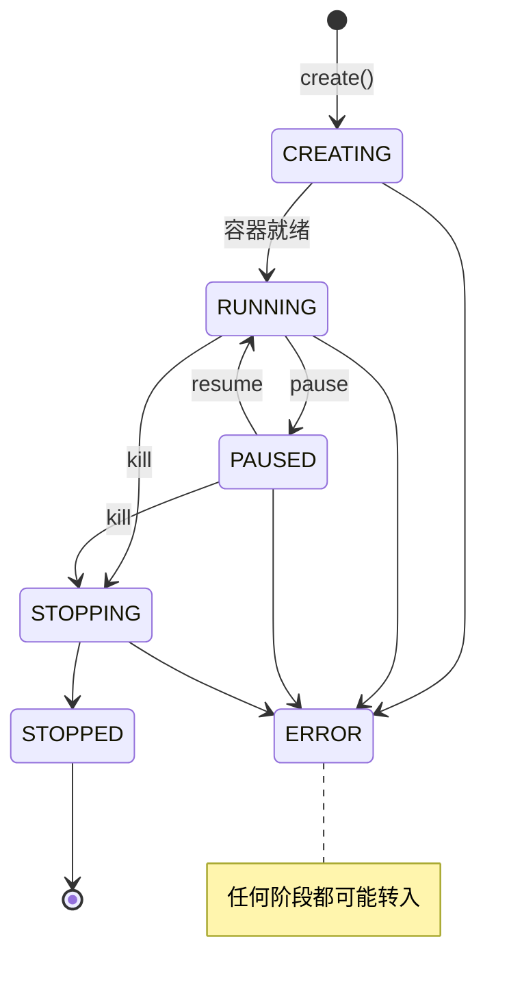

# 沙箱生命周期

> **项目更名说明**：本项目已从 Serverless Sandbox 更名为 **Easy Sandbox**。PyPI 包名: `easy-sandbox`（`pip install easy-sandbox`），CLI 命令: `ebx`，Python 导入: `easy_sandbox`。

本文档解释沙箱的完整生命周期、状态转换和超时机制。

---

## 状态模型

沙箱的生命周期由 `SandboxStatus` 枚举表示：

```python
class SandboxStatus(str, Enum):
    CREATING = "creating"   # 正在创建
    RUNNING  = "running"    # 运行中
    PAUSED   = "paused"     # 已暂停
    STOPPING = "stopping"   # 正在停止
    STOPPED  = "stopped"    # 已停止
    ERROR    = "error"      # 错误
```

---

## 状态转换



### 正常流程

1. **CREATING → RUNNING**：`Sandbox.create()` 调用平台 API 创建容器，容器就绪后状态变为 RUNNING
2. **RUNNING → PAUSED**：`sandbox.pause()` 暂停沙箱
3. **PAUSED → RUNNING**：`sandbox.resume()` 恢复运行
4. **RUNNING → STOPPING → STOPPED**：`sandbox.kill()` 销毁沙箱
5. **任何状态 → ERROR**：出现不可恢复的错误

### 异常流程

- 创建超时：CREATING → ERROR
- 容器崩溃：RUNNING → ERROR
- 平台故障：任何状态 → ERROR

---

## 超时机制

### 沙箱超时

每个沙箱都有一个 `timeout` 值（秒），到期后沙箱自动销毁。

```python
# 创建时设置
sandbox = await Sandbox.create(timeout=600)  # 10 分钟

# 运行时更新
await sandbox.set_timeout(1200)  # 延长到 20 分钟
```

| 参数 | 范围 | 默认值 |
|------|------|--------|
| `timeout` | 1 ~ 86400（1 秒 ~ 24 小时） | 300（5 分钟） |

### 命令超时

```python
# commands.run() 默认 60 秒
result = await sandbox.commands.run("command", timeout=120)

# run_code() 默认 30 秒
result = await sandbox.run_code("code", timeout=60)
```

### CLI 超时

```bash
# 全局默认超时
ebx --timeout 600 create

# 命令级超时
ebx exec sbx-xxxx "command" --timeout 120
```

---

## Context Manager 生命周期

使用 `async with` 时，退出时自动调用 `kill()`：

```python
async with await Sandbox.create() as sandbox:
    # sandbox 状态: RUNNING
    result = await sandbox.run_code("print(1)")
# 退出 with 块 → 自动 kill()
# sandbox 状态: STOPPED
```

即使发生异常也会清理：

```python
try:
    async with await Sandbox.create() as sandbox:
        raise ValueError("error")
except ValueError:
    pass
# sandbox 已被自动销毁
```

---

## 检查状态

```python
# 获取缓存的状态（不发起网络请求）
status = sandbox.status

# 发起 API 调用检查实际状态
is_running = await sandbox.is_running()

# 刷新完整信息
info = await sandbox.refresh_info()
print(f"Status: {info.status.value}")
```

---

## SDK 属性时效性

| 属性 | 时效性 | 刷新方式 |
|------|--------|----------|
| `sandbox.id` | 不变 | — |
| `sandbox.status` | 创建时的快照 | `refresh_info()` |
| `sandbox.url` | 创建时的快照 | `refresh_info()` |
| `sandbox.info` | 创建时的快照 | `refresh_info()` |
| `sandbox.capabilities` | 创建时解析 | 不可变 |

---

## 下一步

- [架构概览](architecture-overview.md) — SDK/CLI/Server 关系
- [SDK 使用指南](../guide/sdk-usage.md) — 沙箱操作方法
- [错误码参考](../reference/error-codes.md) — 状态异常对应的错误码
