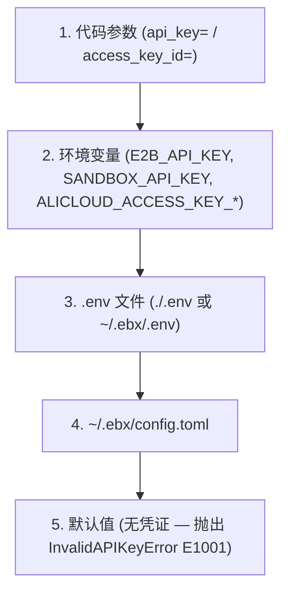

# 认证详解

> **项目更名说明**：本项目已从 Serverless Sandbox 更名为 **Easy Sandbox**。PyPI 包名: `easy-sandbox`（`pip install easy-sandbox`），CLI 命令: `ebx`，Python 导入: `easy_sandbox`。

Easy Sandbox 支持两种认证模式：**API Key** 和 **AK/SK（阿里云 AccessKey）**。

---

## 认证方式总览

Easy Sandbox 存在三条认证路径，适用于不同场景：

- **API Key 模式**：最常用。通过 `Authorization: Bearer {api_key}` 请求头访问平台 API。适用于个人开发、CI/CD、SDK 调用等绝大多数场景。
- **AK/SK 模式（阿里云 AccessKey）**：使用阿里云 AccessKey 对，通过 token 交换获取临时 API Key。适用于阿里云生态集成、企业内部使用 RAM 角色授权的场景。
- **envd 内部认证**：沙箱创建后，SDK 与沙箱内部 envd 服务之间的通信认证。使用 `envdAccessToken`（从创建响应中获取），由 SDK 自动管理，用户无需手动处理。

---

## API Key 认证

API Key 是最常用的认证方式，通过 `Authorization: Bearer {api_key}` 请求头发送到平台 API。

### 配置方式

#### 1. 环境变量（最高优先级）

```bash
# 推荐变量名（E2B 兼容）
export E2B_API_KEY="your-api-key"

# 或使用备选变量名
export SANDBOX_API_KEY="your-api-key"
```

当 `E2B_API_KEY` 和 `SANDBOX_API_KEY` 同时存在时，`E2B_API_KEY` 优先。

#### 2. ebx auth login（持久化到本地文件）

```bash
ebx auth login
# 交互式输入 API Key
# 保存位置: ~/.ebx/.env
# 文件权限: 600（仅所有者可读写）
```

存储格式为 `E2B_API_KEY=your-key`，位于 `~/.ebx/.env`。

#### 3. ebx config set

```bash
ebx config set api_key your-api-key
```

此命令同样写入 `~/.ebx/.env`。

#### 4. .env 文件

在项目根目录创建 `.env` 文件：

```dotenv
E2B_API_KEY=your-api-key
```

SDK 会按以下顺序搜索 `.env` 文件：
1. 当前目录下的 `.env`
2. `~/.ebx/.env`

#### 5. config.toml 文件

在 `~/.ebx/config.toml` 中设置：

```toml
[transport]
api_key = "your-api-key"
```

#### 6. 代码参数（最高优先级覆盖）

```python
from easy_sandbox.api.sandbox import Sandbox

# 创建时直接传入
sandbox = await Sandbox.create(api_key="your-api-key")

# 连接时直接传入
sandbox = await Sandbox.connect("sbx-xxxx", api_key="your-api-key")
```

---

## AK/SK 阿里云扩展认证

AK/SK 模式使用阿里云 AccessKey 对，通过 token 交换获取临时 API Key（TTL 3600 秒，到期前 300 秒自动刷新）。

### 配置方式

#### 环境变量

```bash
export ALICLOUD_ACCESS_KEY_ID="your-access-key-id"
export ALICLOUD_ACCESS_KEY_SECRET="your-access-key-secret"
```

#### 代码参数

```python
sandbox = await Sandbox.create(
    access_key_id="your-ak-id",
    access_key_secret="your-ak-secret",
)
```

### AK/SK 工作原理

1. SDK 使用 AK/SK 调用 token 交换端点获取临时 API Key
2. 临时 Key 缓存在内存中（不持久化到磁盘）
3. 有效期 3600 秒，SDK 在到期前 300 秒自动刷新
4. 后续请求使用临时 Key 作为 Bearer Token

---

## 配置优先级链

认证凭证按以下优先级解析（从高到低）：



在同一层级内，API Key 优先于 AK/SK：
- 若同时提供了 `api_key` 和 `access_key_id`，使用 API Key
- 若同时设置了 `E2B_API_KEY` 和 `ALICLOUD_ACCESS_KEY_ID`，使用 E2B_API_KEY

---

## CLI 认证管理

```bash
# 登录（保存 API Key）
ebx auth login

# 查看认证状态
ebx auth status
# 输出示例：
#   API Key: abcd****efgh
#   Source: /Users/you/.ebx/.env
#   Auth Mode: api_key

# 登出（删除已保存的凭证）
ebx auth logout
```

---

## Keychain 存储（密钥管理）

Easy Sandbox 提供 `ebx secret` 命令组用于安全地管理敏感信息：

```bash
# 创建密钥（交互式安全输入）
ebx secret create MY_TOKEN

# 列出所有密钥名称（不显示值）
ebx secret list

# 将密钥注入到运行中的沙箱
ebx secret inject <sandbox-id> -s MY_TOKEN -s ANOTHER_SECRET

# 删除密钥
ebx secret delete MY_TOKEN
```

密钥存储策略因平台而异（源码实现见 `src/easy_sandbox/utils/keychain.py`）：

- **macOS**：使用系统 Keychain，通过 `security` 命令行工具（`security add-generic-password` / `find-generic-password` / `delete-generic-password`）存取密钥。
- **Linux / 其它平台**：系统 Keychain 不可用，回退到本地文件 `~/.ebx/secrets.json`（纯 JSON 格式），通过 `chmod 600` 文件权限保护。

> **注意**：当前实现未使用 `keyring` Python 库，也未对本地文件做应用层加密。Linux 平台的密钥仅靠文件系统权限保护，请确保 `~/.ebx/` 目录不被其他用户读取。

---

## envd 认证（沙箱内部通信）

沙箱创建后，与沙箱内部 envd 服务的通信使用 `envdAccessToken`（从创建响应中获取）。这是由 SDK 自动管理的内部机制，用户无需手动处理。

envd 认证需要以下 HTTP 头（已由 SDK 自动设置）：

| Header | 值 |
|--------|-----|
| `X-Access-Token` | envdAccessToken |
| `E2b-Sandbox-Id` | 沙箱 ID |
| `E2b-Sandbox-Port` | `49983` |
| `Authorization` | `Basic dXNlcjo=` (base64 of "user:") |

---

## 常见问题

### InvalidAPIKeyError (E1001)

```text
[E1001] API key cannot be empty
  Suggestion: Check your E2B_API_KEY environment variable or pass api_key parameter.
```

**解决**：确保通过上述任一方式配置了有效的 API Key。

### InvalidCredentialsError (E1003)

```text
[E1003] AccessKey ID and Secret cannot be empty
  Suggestion: Check ALICLOUD_ACCESS_KEY_ID and ALICLOUD_ACCESS_KEY_SECRET environment variables.
```

**解决**：确保同时设置了 AK ID 和 AK Secret。

### TokenExpiredError (E1002)

```text
[E1002] The SDK should auto-refresh tokens. If this persists, check system clock synchronization.
```

**解决**：检查系统时钟是否准确。SDK 会自动刷新 token，如果持续出现此错误，可能是时钟偏差过大。
