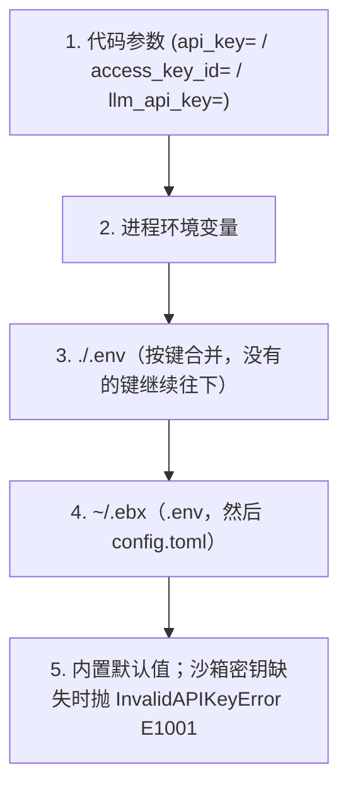

# 认证详解

Easy Sandbox 支持两种认证模式：**API Key** 和 **AK/SK（阿里云 AccessKey）**。

> **历史说明**：`ebx auth` CLI 命令组（`login`/`logout`/`status`/`switch`）已在首个正式版 `0.1.0` 之前移除。凭证通过下方介绍的环境变量与 `ebx config set sandbox_api_key` 配置；用 `ebx config list` 查看生效状态。

---

## 认证方式总览

Easy Sandbox 存在三条认证路径，适用于不同场景：

- **API Key 模式**：最常用。通过 `Authorization: Bearer {api_key}` 请求头访问平台 API。适用于个人开发、CI/CD、SDK 调用等绝大多数场景。
- **AK/SK 模式（阿里云 AccessKey）🧪 实验性**：使用阿里云 AccessKey 对，通过 token 交换获取临时 API Key。框架已实现，但 token 交换端点待 FC 平台确认，当前推荐仍使用 API Key 模式。适用于阿里云生态集成、企业内部使用 RAM 角色授权的场景。
- **envd 内部认证**：沙箱创建后，SDK 与沙箱内部 envd 服务之间的通信认证。使用 `envdAccessToken`（从创建响应中获取），由 SDK 自动管理，用户无需手动处理。

---

## API Key 认证

API Key 是最常用的认证方式，通过 `Authorization: Bearer {api_key}` 请求头发送到平台 API。

### 配置方式

#### 1. 环境变量（优先于 `~/.ebx`）

```bash
# 推荐变量名（E2B 兼容）
export E2B_API_KEY="your-api-key"

# 或使用备选变量名
export SANDBOX_API_KEY="your-api-key"
```

当 `E2B_API_KEY` 和 `SANDBOX_API_KEY` 同时存在时，`E2B_API_KEY` 优先。

#### 2. ebx config set（持久化到本地文件）

```bash
ebx config set sandbox_api_key your-api-key
# 写入到 ~/.ebx/.env
# 文件权限: 600（仅所有者可读写）
```

存储格式为 `E2B_API_KEY=your-key`，位于 `~/.ebx/.env`。

#### 3. .env 文件

在项目根目录创建 `.env` 文件：

```dotenv
E2B_API_KEY=your-api-key
```

SDK 按键合并 `.env`。`./.env` 写了该键时优先；没写的键仍然来自 `~/.ebx/.env`。

1. 当前目录下的 `.env`
2. `~/.ebx/.env`

#### 4. config.toml 文件

在 `~/.ebx/config.toml` 中设置：

```toml
[transport]
api_key = "your-api-key"
```

#### 5. 代码参数（高于环境变量和 `~/.ebx`）

```python
from easy_sandbox.api.sandbox import Sandbox

# 创建时直接传入
sandbox = await Sandbox.create(api_key="your-api-key")

# 连接时直接传入
sandbox = await Sandbox.connect("sbx-xxxx", api_key="your-api-key")
```

---

## AK/SK 阿里云扩展认证 🧪

> **⚠️ 实验性功能**：AK/SK → API Key 的 token 交换框架已在 SDK 中实现（`transport/auth.py`），但 token 交换端点的 action 名称（`CreateApiKey`）和响应字段解析**仍待 FC 平台团队确认**。TTL（3600s）和提前刷新时间（300s）为假设值，未经真实端点实测。当前阶段可用于本地调试，**生产环境仍推荐使用 API Key 认证**。

AK/SK 模式使用阿里云 AccessKey 对，通过 token 交换获取临时 API Key（设计 TTL 3600 秒，到期前 300 秒自动刷新）。

### 配置方式

#### 1. 环境变量

```bash
export ALICLOUD_ACCESS_KEY_ID="your-access-key-id"
export ALICLOUD_ACCESS_KEY_SECRET="your-access-key-secret"
```

#### 2. ebx config set（持久化到本地文件）

```bash
ebx config set access_key_id your-access-key-id
ebx config set access_key_secret your-access-key-secret
# 写入到 ~/.ebx/.env
# 文件权限: 600（仅所有者可读写）
```

存储格式为 `ALICLOUD_ACCESS_KEY_ID=...` / `ALICLOUD_ACCESS_KEY_SECRET=...`，位于 `~/.ebx/.env`。

#### 3. 代码参数

```python
sandbox = await Sandbox.create(
    access_key_id="your-ak-id",
    access_key_secret="your-ak-secret",
)
```

### AK/SK 工作原理

1. SDK 使用 AK/SK 通过阿里云 RPC (POP) V1 HMAC-SHA1 签名调用 `https://fcsandbox.{region}.aliyuncs.com` 的 token 交换端点获取临时 API Key
2. 临时 Key 缓存在内存中（不持久化到磁盘）
3. 设计有效期 3600 秒，SDK 在到期前 300 秒自动刷新（实际参数以 FC 平台最终确认为准）
4. 后续请求使用临时 Key 作为 Bearer Token

> **注意**：以上参数（TTL、端点 action 名等）基于 ACR token exchange 模式实现，正式上线前可能调整。

---

## 配置优先级链

认证凭证按以下优先级解析（从高到低）：


```mermaid
flowchart TD
    A["1. 代码参数 (api_key= / access_key_id= / llm_api_key=)"] --> B["2. 进程环境变量"]
    B --> C["3. ./.env（按键合并，没有的键继续往下）"]
    C --> D["4. ~/.ebx（.env，然后 config.toml）"]
    D --> E["5. 内置默认值；沙箱密钥缺失时抛 InvalidAPIKeyError E1001"]
```

LLM 密钥、GitHub token 和区域走同一条链。空白或只含空格的值会被跳过。变量名和默认值见 [凭证解析](../reference/configuration.md#凭证解析)。

在同一层级内，API Key 优先于 AK/SK：
- 若同时提供了 `api_key` 和 `access_key_id`，使用 API Key
- 若同时设置了 `E2B_API_KEY` 和 `ALICLOUD_ACCESS_KEY_ID`，使用 E2B_API_KEY

---

## CLI 认证管理

```bash
# 设置 API Key
ebx config set sandbox_api_key your-api-key

# 设置 AK/SK（实验性）
ebx config set access_key_id your-access-key-id
ebx config set access_key_secret your-access-key-secret

# 查看生效配置以及每个值的来源
ebx config list
# (env) 进程环境变量，(user) ./.env 或 ~/.ebx，(default)，(not set)

ebx config get sandbox_api_key
ebx config get access_key_id
```

---

## 密钥存储（基于文件）

密钥存储在 `~/.ebx/secrets.json` 中，这是一个明文 JSON 文件，通过 `chmod 600` 文件权限保护。仅适合本地开发使用。

> **⚠️ 警告**：`secrets.json` 以**明文**存储密钥。仅依赖 POSIX 文件权限（`chmod 600`）控制访问。生产环境请使用专用密钥管理服务。

通过环境变量或配置命令管理密钥：

```bash
# 通过环境变量设置 API Key（推荐）
export E2B_API_KEY="your-api-key"

# 或通过 ebx config 持久化
ebx config set sandbox_api_key your-api-key
```

创建沙箱时通过 `--env` 参数注入密钥：

```bash
ebx create --template base --env MY_TOKEN=your-secret-value --env ANOTHER_SECRET=another-value
```

> **历史说明**：macOS Keychain 集成已在过度设计清理中移除（ADR 2026-09-23）。`ebx secret` CLI 命令组也已被移除。所有密钥管理现通过环境变量、`.env` 文件或 `ebx config set` 完成。

---

## envd 认证（沙箱内部通信）

沙箱创建后，与沙箱内部 envd 服务的通信使用 `envdAccessToken`（从创建响应中获取）。这是由 SDK 自动管理的内部机制，用户无需手动处理。

envd 认证需要以下 HTTP 头（已由 SDK 自动设置）：

| Header | 值 |
|--------|-----|
| `X-Access-Token` | envdAccessToken |
| `E2b-Sandbox-Id` | 沙箱 ID |
| `E2b-Sandbox-Port` | `49983` |
| `Authorization` | `Basic dXNlcjo=` (base64 of "user:") |

---

## 常见问题

### InvalidAPIKeyError (E1001)

```text
[E1001] API key cannot be empty
  Suggestion: Check your E2B_API_KEY environment variable or pass api_key parameter.
```

**解决**：确保通过上述任一方式配置了有效的 API Key。

### InvalidCredentialsError (E1003)

```text
[E1003] AccessKey ID and Secret cannot be empty
  Suggestion: Check ALICLOUD_ACCESS_KEY_ID and ALICLOUD_ACCESS_KEY_SECRET environment variables.
```

**解决**：确保同时设置了 AK ID 和 AK Secret。

### TokenExpiredError (E1002)

```text
[E1002] The SDK should auto-refresh tokens. If this persists, check system clock synchronization.
```

**解决**：检查系统时钟是否准确。SDK 会自动刷新 token，如果持续出现此错误，可能是时钟偏差过大。
