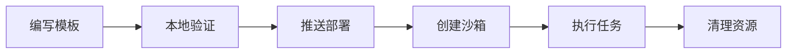

# 从零构建模板到沙箱使用：端到端指南

本指南带你完成一个自定义沙箱模板从编写到生产使用的完整工作流。



---

## 前置条件

- Docker Desktop 已启动（用于本地构建镜像）
- Python 3.9+
- 安装 SDK（**务必带 `[cli]` 扩展**）：

```bash
pip install "easy-sandbox[cli,alicloud]"
```

> **为什么需要 `[cli]` 扩展**：本指南用到的 CLI 特性——从 `template.yaml` 读取默认值（YAML 解析）、解析 `.env` 文件、从 registry 安装模板——都依赖 `[cli]` 扩展，它会引入 **PyYAML** 和 **python-dotenv**。裸装 `pip install easy-sandbox` **不包含**这些依赖，相关功能将不可用。

- 阿里云 AK/SK 配置在 `.env` 文件中：

```env
ALICLOUD_ACCESS_KEY_ID=your-access-key-id
ALICLOUD_ACCESS_KEY_SECRET=your-access-key-secret
ACR_NAMESPACE=your-acr-namespace
```

- ACR 命名空间已在阿里云 ACR 控制台创建（一次性操作）。在控制台中依次打开 **容器镜像服务 ACR → 命名空间 → 创建命名空间**，然后将该命名空间名用作 `ACR_NAMESPACE`（或 `--acr-namespace` 参数）。

> 认证详情参见 [认证配置](authentication.md)。

---

## 替代起点：从 registry 安装现成模板

如果不打算从零编写模板，可以直接用 `ebx install`（`ebx template install` 的别名）从 GitHub 仓库安装现成模板。官方与社区模板的真源是 [awesome-templates](https://github.com/Easy-Sandbox/awesome-templates)——先用 `ebx template search <query>` 在远程索引中发现模板，再用 `ebx template install <name>` 按名安装（也支持完整的 `owner/repo[//subdir][@ref]` 引用）。

> **`install` 现在默认运行完整流水线。** `ebx install <ref> --acr-namespace <ns>` 会在一条命令内完成**下载 → 构建镜像 → 推送 ACR → 通过官方 CreateTemplate API 部署**。若只想把源码下载到本地缓存（`~/.ebx/templates/`）而不构建、不部署，加上 `--download-only`，然后再执行 `ebx template build` / `ebx template deploy`。

> ⚠️ **成本与安全**：默认的 `install`（以及 `ebx template deploy`）会向你的 ACR 镜像仓库推送镜像并在你的阿里云账号上调用官方 `CreateTemplate` API——这些操作可能产生费用。仅想查看源码时请用 `--download-only`。

### 安装选项

| 选项 | 说明 |
|------|------|
| `--acr-namespace` | 构建+部署步骤使用的 ACR 命名空间（环境变量 `ACR_NAMESPACE`，或在 `.env` 中设置） |
| `--cpu` | CPU 核数（默认：来自 `template.yaml` 或 2） |
| `--memory` | 内存 MB（默认：来自 `template.yaml` 或 2048） |
| `-y`, `--yes` | 跳过确认提示 |
| `--download-only` | 仅下载到本地缓存（跳过构建和部署） |
| `--dir PATH` | 将模板源码下载到自定义目录，而非默认的 `~/.ebx/templates` |

### 引用语法

```text
owner/repo                # 整个仓库（默认分支）
owner/repo//subdir        # 仓库子目录
owner/repo@main           # 指定分支
owner/repo//subdir@v1.0   # 子目录 + 指定 tag/branch/commit sha
./my-template             # 本地目录
```

子目录用双斜杠 `//` 分隔，版本引用用 `@` 后缀（tag、分支或 commit sha 均可，通过 GitHub tarball API 拉取，无需仓库发布 Release）。私有仓库与更高限流额度：推荐 `ebx config set github_token`（星号脱敏输入，一次性保存到 `~/.ebx/.env`），而非单次 `--token <github-token>` 覆盖（可能泄漏到 shell history 或进程列表）。

### 仅下载：先检查源码

加上 `--download-only` 后，`install` 只把模板下载到本地缓存——不构建、也不部署：

```bash
$ ebx template install Easy-Sandbox/awesome-templates//python-hello --download-only
Fetching template from Easy-Sandbox/awesome-templates...
Alias   python-hello
Source  /Users/anycodes/.ebx/templates/Easy-Sandbox/awesome-templates/default/python-hello
Cached  /Users/anycodes/.ebx/templates/Easy-Sandbox/awesome-templates/default/python-hello
Status  installed-locally
Template 'python-hello' installed to the local cache. Build and push the image with 'ebx template build'.
```

模板源码被缓存到 `~/.ebx/templates/{owner}/{repo}/{ref}/{name}/`（`ref` 未指定时为 `default`），可直接查看：

```bash
$ ls ~/.ebx/templates/Easy-Sandbox/awesome-templates/default/python-hello/
Dockerfile      README.md       commands.py     template.yaml

$ cat ~/.ebx/templates/Easy-Sandbox/awesome-templates/default/python-hello/template.yaml
name: python-hello
version: "1.0.0"
description: "A minimal Python hello world template for testing"
author: "Easy-Sandbox"
tags:
  - python
  - hello-world
  - example

base: ubuntu:22.04

system_packages:
  - python3
  - python3-pip

capabilities:
  - shell
  - files
  - code
  - ports

ports:
  - 9000

custom_commands:
  run:
    cmd: "python3 {file}"
    description: "Run a Python script"
    cwd: "/app"
    timeout: 60
    args:
      - name: file
        default: "main.py"
        description: "Python file to execute"
  test:
    cmd: "python3 -m pytest {path}"
    description: "Run tests with pytest"
    cwd: "/app"
    timeout: 120
    args:
      - name: path
        default: "."
        description: "Test path or file"

env:
  LANG: C.UTF-8
```

再安装一个 node-web 模板：

```bash
$ ebx template install Easy-Sandbox/awesome-templates//node-web --download-only
Fetching template from Easy-Sandbox/awesome-templates...
Alias   node-web
Source  /Users/anycodes/.ebx/templates/Easy-Sandbox/awesome-templates/default/node-web
Cached  /Users/anycodes/.ebx/templates/Easy-Sandbox/awesome-templates/default/node-web
Status  installed-locally
Template 'node-web' installed to the local cache. Build and push the image with 'ebx template build'.
```

本地目录的用法完全一样：

```bash
$ ebx install ./my-template --download-only
Using local template from ./my-template...
Alias   my-template
Source  ./my-template
Cached  ~/.ebx/templates/my-template
Status  installed-locally
Template 'my-template' installed to the local cache. Build and push the image with 'ebx template build'.
```

### 默认：一次性下载、构建并部署

不带 `--download-only` 时，`install` 会跑完整流水线。它在构建+部署步骤需要一个 ACR 命名空间；若未提供（通过 `--acr-namespace`、`ACR_NAMESPACE` 或 `.env`），它会在构建前停下并明确告诉你如何修复：

```bash
$ ebx install ./my-template -y
Using local template from ./my-template...
Cannot build + deploy. Missing prerequisites:
  • Missing ACR namespace. Provide via:
  1. ebx config set acr_namespace <ns>   (or re-run 'ebx config init')
  2. --acr-namespace flag
  3. export ACR_NAMESPACE=<ns>
  4. ACR_NAMESPACE=<ns> in .env (CWD or ~/.ebx/.env)

Run with --download-only to just download the template.
```

提供命名空间即可运行完整流程（等价于 `ebx template deploy`）：

```bash
ebx install Easy-Sandbox/awesome-templates//python-hello --acr-namespace my-ns
```

### `--download-only` 之后如何使用

- **部署到自己的平台账号**：对缓存目录执行 `ebx template deploy <缓存路径>`（或 `ebx template build` 分步构建推送），流程与下文第三步完全一致。
- **模板已在平台上部署过**：无需 install，直接用模板名创建沙箱即可（`ebx create --template python-hello`）。
- **本地二次开发**：缓存目录就是普通模板源码，可复制出来修改后按本文完整流程走一遍。

---

## 第一步：编写模板

### 脚手架生成新模板（推荐）

最快的起步方式是内置脚手架。`ebx template init` 会生成一个开箱即用的模板目录，你不再需要凭记忆手写 `template.yaml` / `Dockerfile` / `commands.py`。

省略 `DIRECTORY` 参数时，脚手架会在当前工作目录下新建 `./<name>` 子目录。`<name>` 按优先级解析：`--name` > 脚手架案例名（`-t` 的值） > `--from` 拉取到的模板名。

列出可用的脚手架案例：

```bash
$ ebx template init --list
  python       Python 3.11 sandbox with shell, files, and code capabilities
  node         Node.js 20 sandbox with shell, files, and code capabilities
  minimal      Bare-minimum template with only template.yaml + Dockerfile
```

将 Python 模板脚手架生成到 `./my-template`：

```bash
$ ebx template init -t python ./my-template
✅ Template 'my-template' created in ./my-template
Created files:
  Dockerfile
  README.md
  commands.py
  template.yaml

Next steps:
  ebx template deploy ./my-template --acr-namespace <ns>
  ebx install ./my-template --acr-namespace <ns>
```

> 脚手架与凭证配置是两条独立命令：`ebx template init`（本节）只写本地文件，`ebx config init` 存储凭证，`ebx create` 启动云端沙箱。顶层 `ebx init` 快捷方式与 `ebx template init` 委托到完全相同的命令。

### 适配已有源码的项目

目录里已经是一个应用（Flask、Express、一段脚本），还没有 `Dockerfile` / `template.yaml` 时，用 `--adopt`。Qwen Code 只看到一份副本；ebx 把 `Dockerfile`、`commands.py`、`template.yaml`，以及在你还没有时生成的 `.dockerignore`，写回同一目录。

```bash
$ ebx template init --adopt ./my-app --hint "监听 8080"
# 看过预览之后：
$ ebx deploy ./my-app --acr-namespace my-ns
```

`--dry-run` 列出将要发送的全部文件，不调用模型。非交互终端必须带 `-y`。`.env`、密钥、以及内容看起来像密钥的文件不会进入副本，Agent 进程也不会继承云凭证。备份、`--force`、写入前会拒绝哪些结果，见 [编写模板 — 适配已有项目](authoring-templates.md#适配已有项目)。

`ebx template init "描述"` 是另一条 AI 路径：根据一句话**新建**目录。`--adopt` 补的是你已经有的项目。

### 理解生成的文件

脚手架生成的文件布局与你手写时一致：

```text
my-template/
├── template.yaml    # 模板定义（名称、能力、资源）
├── Dockerfile       # 容器构建文件
├── commands.py      # 服务端命令注册（可选）
└── README.md        # 说明文档
```

#### template.yaml

生成的 `template.yaml`（python 案例）：

```yaml
name: my-template
version: "1.0.0"
description: "Python sandbox template"

base: python:3.11-slim

capabilities:
  - shell
  - files
  - code

resources:
  cpu: 2
  memory: 2048
```

**关键字段说明**：

| 字段 | 说明 |
|------|------|
| `name` | 模板唯一标识，用于 `--template` 参数 |
| `base` | 基础 Docker 镜像（当存在 Dockerfile 时此字段仅作参考） |
| `capabilities` | 运行时能力声明：`shell`、`files`、`code`、`terminal`、`ports` |
| `resources.cpu` | CPU 核数（部署时可通过 CLI 参数覆盖） |
| `resources.memory` | 内存 MB（部署时可通过 CLI 参数覆盖） |

完整字段规范参见 [template.yaml 规范](../reference/template-yaml-spec.md)。

#### Dockerfile

生成的 `Dockerfile`（python 案例）：

```dockerfile
FROM python:3.11-slim

ENV DEBIAN_FRONTEND=noninteractive

# Install easy-sandbox SDK.
# When building locally via `ebx template deploy`, the SDK wheel
# is automatically injected into the build context as .whl file.
COPY *.whl /tmp/
RUN if ls /tmp/*.whl 1>/dev/null 2>&1; then \
        pip install --no-cache-dir /tmp/*.whl && rm -f /tmp/*.whl; \
    else \
        pip install --no-cache-dir easy-sandbox; \
    fi

WORKDIR /app
COPY commands.py .

EXPOSE 9000
CMD ["python3", "commands.py"]
```

> **`.whl` 注入机制**：执行 `ebx template deploy` 时，SDK 会自动将当前版本的 wheel 文件注入到 Docker 构建上下文中，确保容器内安装与宿主一致版本的 SDK。源码仓库运行时从工作区构建 wheel；通过 PyPI 安装的 `ebx`（或独立二进制）则从 PyPI 下载同版本的已发布 wheel 并校验 SHA-256。两者都不可行（未发布的版本、或无法访问 PyPI）时不注入任何文件，由镜像内的 `pip install easy-sandbox` 兜底。上面的 `COPY *.whl` + fallback 模式是推荐写法。

### 自定义命令（可选）

在生成的 `template.yaml` 中声明命名命令，可通过 `ebx run <sandbox-id> <command>` 直接调用：

```yaml
custom_commands:
  dev:
    cmd: "python -m http.server {port}"
    description: "启动开发服务器"
    cwd: "/app"
    timeout: 0
    args:
      - name: port
        default: "8080"
        description: "监听端口"

  test:
    cmd: "python -m pytest {path} -v"
    description: "运行测试"
    cwd: "/app"
    timeout: 120
    args:
      - name: path
        default: "."
        description: "测试路径"
```

更复杂的模板（含 `commands.py` 服务端命令注册）参见 [node-web 示例](https://github.com/Easy-Sandbox/awesome-templates/tree/main/node-web)（模板真源仓库）。

---

## 第二步：本地验证

在部署前，先本地验证 Dockerfile 能否正常构建：

```bash
# 构建镜像（必须使用 linux/amd64 平台，FC 运行时为 x86_64）
docker build --platform linux/amd64 --provenance=false -t my-app:test ./my-template

# 快速冒烟测试
docker run --rm my-app:test python3 -c "print('OK')"
```

> **关于 `--provenance=false`**：Docker Buildx 默认会生成 attestation manifest，导致阿里云 FC 镜像优化失败（模板会卡在 `error` 状态）。上面的手动 `docker build` 里之所以要带它，是因为该命令绕过了 SDK。通过 `ebx template deploy` 部署时，**只要启用了 BuildKit，SDK 就会自动为你注入 `--provenance=false`**，因此你通常**无需**手动添加。设置 `DOCKER_BUILDKIT=0` 可跳过该自动注入。

---

## 第三步：部署模板

### 一键部署（推荐）

```bash
# 确保 .env 中已配置 ACR_NAMESPACE
ebx template deploy ./my-template
```

`deploy` 命令内部执行 5 个步骤：

1. **Docker build** — 本地构建镜像（platform `linux/amd64`，`provenance=false`）
2. **ACR login** — 自动使用 AK/SK 兑换临时 Token 并登录 ACR
3. **Docker push** — 推送镜像到 ACR 仓库
4. **CreateTemplate API** — 调用阿里云 FCSandbox 官方 API 创建模板
5. **Poll until READY** — 轮询模板状态直到构建完成

> ⚠️ **成本与安全**：`ebx template deploy`（以及默认的 `ebx install`）会向你的 ACR 镜像仓库推送镜像并在你的阿里云账号上调用官方 `CreateTemplate` API——这些操作可能产生费用。仅部署你确实要运行的模板。

在构建步骤中，只要启用了 BuildKit，SDK 就会自动注入 `--provenance=false` 并打印一条提示——你无需自己添加该参数（设置 `DOCKER_BUILDKIT=0` 可跳过）：

```
ℹ 已自动添加 --provenance=false（避免 FC 镜像优化失败；设置 DOCKER_BUILDKIT=0 可跳过）
```

### 自定义参数

```bash
ebx template deploy ./my-template \
  --acr-namespace my-ns \
  --tag v1.0 \
  --cpu 4 \
  --memory 4096
```

常用选项：

| 选项 | 说明 | 默认值 |
|------|------|--------|
| `--acr-namespace` | ACR 命名空间 | 从环境变量或 `.env` 读取 |
| `--tag` | 镜像标签 | `latest` |
| `--cpu` | CPU 核数 | 从 `template.yaml` 读取，fallback 2 |
| `--memory` | 内存 MB | 从 `template.yaml` 读取，fallback 2048 |
| `--disk-size` | 磁盘 MB | 平台默认 |
| `--timeout` | 构建超时秒数 | 600 |
| `-v, --verbose` | 显示完整 Docker 构建日志 | 关闭 |

### 验证部署

部署完成后，用 `--official-api` 列出模板可查看**真实名称与状态**（`ready` / `building` / `error`）。以下为真实运行输出（2026-09-28，cn-hangzhou，为聚焦重点已截断）：

```bash
$ ebx template list --official-api
┏━━━━━━━━━━━━━━━━━━━━━━┳━━━━━━━━━━━━━━━━━━━━━━━━━━━━━┳━━━━━━━┳━━━━━━━━┓
┃ TemplateID           ┃ Name                        ┃ Alias ┃ Status ┃
┡━━━━━━━━━━━━━━━━━━━━━━╇━━━━━━━━━━━━━━━━━━━━━━━━━━━━━╇━━━━━━━╇━━━━━━━━┩
│ 3tz9v7mdijd9fvkthpq0 │ hermes-agent                │       │ ready  │
│ mia0t3obep8encseaib4 │ codex-agent                 │       │ ready  │
│ dc19rvfbyawxnq64o6ic │ python-hello-prov           │       │ ready  │
│ jc5x7mzsyshg32a15oq5 │ python-hello-v2             │       │ error  │
│ hbsmn7ha04wf9b5klgju │ e2e-python-hello            │       │ error  │
│ 9k0lq3mhdamdm7hy3cgb │ python-hello                │       │ ready  │
│ ogkhjuge1bz34knk5u1v │ node-web                    │       │ ready  │
│ 216g37mamkdfhzrauvxk │ base                        │       │ ready  │
│ …（本次账号共 36 个模板，此处截断）
└──────────────────────┴─────────────────────────────┴───────┴────────┘
```

> **状态含义**：只有 `ready` 的模板才能成功创建沙箱。上表中 `python-hello-v2`、`e2e-python-hello` 等处于 `error` 状态的模板（通常由镜像构建/优化失败导致，参见[故障排查](#故障排查)）无法用于 `ebx create`。

不带 `--official-api` 时走 E2B 兼容接口，仅返回模板 ID（无名称/状态）：

```bash
$ ebx template list
┏━━━━━━━━━━━━━━━━━━━━━━┳━━━━━━━┳━━━━━━━━┓
┃ TemplateID           ┃ Alias ┃ Status ┃
┡━━━━━━━━━━━━━━━━━━━━━━╇━━━━━━━╇━━━━━━━━┩
│ 3tz9v7mdijd9fvkthpq0 │ N/A   │ N/A    │
│ lusxjk8livn9cxs5yl0d │ N/A   │ N/A    │
│ …（共 36 个，此处截断）
└──────────────────────┴───────┴────────┘
```

查看单个模板详情：

```bash
$ ebx template info <template-id> --official-api
```

### 参数默认值优先级

CLI 参数 > `template.yaml` 中的声明 > 硬编码默认值。详见 [CLI 参考](../reference/cli-reference.md)。

---

## 第四步：使用沙箱

### CLI 工作流（真实运行记录）

> **关于以下输出**：均为 **2026-09-28 在 cn-hangzhou 区域真实执行** `ebx` 命令捕获，未做任何虚构。为聚焦关键结果，每条命令在 stderr 上**仅打印一次**的 capability 回退 WARNING（`base` 无本地缓存 `template.yaml` 时的预期行为）已省略。任务 167 起该警告是诊断通道上的单行 `WARNING:`，结果只走 stdout、不再与之混排，原先重复的时间戳日志行已消失。沙箱 ID `sbx-93276a52-1559-466a-8de9-19d5af644283` 为本次真实创建生成，格式为 `sbx-<UUID>`；下文命令中的 `<SANDBOX_ID>` 请替换为你自己的 ID。

**① 创建沙箱**

```bash
$ ebx create --template base
ID           sbx-93276a52-1559-466a-8de9-19d5af644283
Status       running
Template     base
URL          https://49983-sbx-93276a52-1559-466a-8de9-19d5af644283.cn-hangzhou.e2b.fc.aliyuncs.com
EnvdVersion  0.5.2
Sandbox sbx-93276a52-1559-466a-8de9-19d5af644283 created successfully.
```

**② 查看沙箱信息**

```bash
$ ebx info <SANDBOX_ID>
ID           sbx-93276a52-1559-466a-8de9-19d5af644283
Template     base
Status       running
Region       cn-hangzhou
Timeout      300s
URL          https://49983-sbx-93276a52-1559-466a-8de9-19d5af644283.cn-hangzhou.e2b.fc.aliyuncs.com
EnvdVersion  0.5.2
Started      2026-09-28 04:03:13.302944+00:00
Metadata     {'fcSessionDetails': '{"containerId":"c-6ab9e700-…","sessionIdleTimeoutInSeconds":300,"sessionStatus":"Active"}', 'fcSessionID': 'd60cf963-…', …}   # 已截断
```

**③ 执行 Shell 命令**

```bash
$ ebx exec <SANDBOX_ID> 'echo "Hello from sandbox"'
Hello from sandbox

$ ebx exec <SANDBOX_ID> 'node --version'
v20.20.2

$ ebx exec <SANDBOX_ID> 'python3 -c "print(2+2)"'
4
```

**④ 查看目录**

```bash
$ ebx exec <SANDBOX_ID> 'ls -la /home/user'
total 40
drwxr-xr-x 1 user user 4096 Jul 19 08:08 .
drwxr-xr-x 1 root root 4096 Jul  9 07:32 ..
-rw-r--r-- 1 user user  220 Mar  8  2026 .bash_logout
-rw-r--r-- 1 user user 3526 Mar  8  2026 .bashrc
drwxr-xr-x 3 user user 4096 Jul 19 08:08 .config
-rw-r--r-- 1 user user   40 Jul 19 08:08 .npmrc
-rw-r--r-- 1 user user  807 Mar  8  2026 .profile
drwxr-xr-x 2 user user 4096 Jul 16 13:58 log
drwxr-xr-x 2 user user 4096 Jul 16 13:58 workspace
```

**⑤ 写入并读取文件**

```bash
$ ebx exec <SANDBOX_ID> 'sh -c "echo hello > /home/user/test.txt"'
# （无 stdout 输出，退出码 0）

$ ebx exec <SANDBOX_ID> 'cat /home/user/test.txt'
hello
```

**⑥ 上传 / 下载文件**

```bash
$ echo "uploaded from local" > /tmp/ebx_e2e_test.txt

$ ebx upload <SANDBOX_ID> /tmp/ebx_e2e_test.txt /home/user/uploaded.txt
Uploaded /tmp/ebx_e2e_test.txt -> /home/user/uploaded.txt

$ ebx download <SANDBOX_ID> /home/user/uploaded.txt /tmp/ebx_e2e_download.txt
Downloaded /home/user/uploaded.txt -> /tmp/ebx_e2e_download.txt

$ cat /tmp/ebx_e2e_download.txt
uploaded from local
```

**⑦ 查看沙箱系统信息**

```bash
$ ebx sandbox system info <SANDBOX_ID>
OS             Linux
Arch           x86_64
Hostname       c-6ab9e700-1550f19f-ec5ff9d3d0af
CPU_Count      2
Python         3.13.13
Disk_Total_GB  9.81
Disk_Free_GB   9.29
```

**⑧ 列出运行中的沙箱**

```bash
$ ebx list
┏━━━━━━━━━━━━━━━━━━━━━━━━━━━━━━━━━━━━━━━━━━┳━━━━━━━━━━┳━━━━━━━━━┳━━━━━━━━━━━━━┓
┃ ID                                       ┃ Template ┃ Status  ┃ Region      ┃
┡━━━━━━━━━━━━━━━━━━━━━━━━━━━━━━━━━━━━━━━━━━╇━━━━━━━━━━╇━━━━━━━━━╇━━━━━━━━━━━━━┩
│ sbx-93276a52-1559-466a-8de9-19d5af644283 │ base     │ running │ cn-hangzhou │
└──────────────────────────────────────────┴──────────┴─────────┴─────────────┘
```

> **提示**：沙箱刚创建后，服务端列表可能有短暂延迟（最终一致）。若 `ebx list` 暂时为空，稍等片刻重试即可。

**⑨ 销毁沙箱并验证**

```bash
$ ebx kill <SANDBOX_ID> -y
Sandbox sbx-93276a52-1559-466a-8de9-19d5af644283 killed.

$ ebx info <SANDBOX_ID>          # 验证：已销毁，返回 404
[E5000] Resource not found (HTTP 404).
  Suggestion: Verify the sandbox ID, template ID, or endpoint URL.

$ ebx list
No sandboxes found.
```

### 模板名称解析（真实失败案例）

`--template` 既可传模板**名称**也可传**ID**，但只有状态为 `ready` 且镜像可正常拉起的模板才能成功创建。下面是对 `python-hello` 执行创建时的真实输出——尽管 `ebx template list --official-api` 中有一个 `ready` 的 `python-hello`，但本次创建在冷启动阶段被平台重置连接：

```bash
$ ebx create --template python-hello
[E5003] Connection reset by remote: <StreamReset stream_id:1, error_code:2, remote_reset:True>
  Suggestion: The platform closed the connection before responding. This usually means the operation took too long (e.g., sandbox cold start). Try:
  1. Increase HTTP timeout: ebx config set http_timeout 120
  2. Retry the command
  3. Disable HTTP/2: ebx config set http2 false
```

在 `http_timeout=120`、`http2=false` 配置下多次重试仍持续失败，最终报请求超时：

```bash
$ ebx create --template python-hello
[E3001] Request timed out: 
  Suggestion: The HTTP request timed out. Try:
  1. Increase HTTP timeout: ebx config set http_timeout 120
  2. Or set env: export SANDBOX_HTTP_TIMEOUT=120
  3. Check network connectivity
```

> **经验**：创建前先用 `ebx template list --official-api` 确认目标模板为 `ready`；当存在多个同前缀名称（如 `python-hello` / `python-hello-v2` / `python-hello-prov`）时，建议直接用**模板 ID** 避免歧义。若 `ready` 模板仍超时，通常是镜像冷启动过慢，可提高 `http_timeout` 或重试（参见[故障排查](#故障排查)）。

### SDK 工作流（Python）

```python
import asyncio
from easy_sandbox.api.sandbox import Sandbox

async def main():
    # 创建沙箱
    sandbox = await Sandbox.create(template="my-app")
    print(f"Sandbox ID: {sandbox.id}")

    # 执行 Shell 命令
    result = await sandbox.commands.run("python3 -c 'print(42)'")
    print(result.stdout)  # "42\n"

    # 文件操作
    await sandbox.files.write("/app/data.json", '{"key": "value"}')
    content = await sandbox.files.read("/app/data.json")
    print(content)

    # 运行代码（Code Interpreter）
    result = await sandbox.run_code("print('hello from sandbox')")
    print(result.text)

    # 清理
    await sandbox.kill()

asyncio.run(main())
```

**同步版本**（适用于脚本场景）：

```python
from easy_sandbox.api.sandbox import Sandbox

sandbox = Sandbox.create_sync(template="my-app")
result = sandbox.commands.run_sync("echo hello")
print(result.stdout)
sandbox.kill_sync()
```

**Context Manager 模式**（推荐 — 自动清理）：

```python
import asyncio
from easy_sandbox.api.sandbox import Sandbox

async def main():
    async with await Sandbox.create(template="my-app") as sandbox:
        result = await sandbox.commands.run("echo hello")
        print(result.stdout)
    # 退出 with 块后自动销毁沙箱

asyncio.run(main())
```

### Agent 工作流模式

这是 AI Agent 场景的典型模式——创建沙箱执行任务代码，获取结果后销毁：

```python
import asyncio
from easy_sandbox.api.sandbox import Sandbox

async def agent_workflow(task_code: str) -> str:
    """Agent → 创建沙箱 → 执行代码 → 读取结果 → 销毁沙箱"""
    async with await Sandbox.create(template="my-app") as sandbox:
        # 写入任务代码
        await sandbox.files.write("/app/task.py", task_code)

        # 执行
        result = await sandbox.commands.run("python3 /app/task.py")

        # 读取输出
        if result.exit_code == 0:
            try:
                output = await sandbox.files.read("/app/output.txt")
                return output
            except Exception:
                return result.stdout
        else:
            return f"Error (exit {result.exit_code}): {result.stderr}"

# 使用
result = asyncio.run(agent_workflow("""
import json
data = {"status": "done", "items": [1, 2, 3]}
with open("/app/output.txt", "w") as f:
    json.dump(data, f)
print("Task completed")
"""))
print(result)
```

---

## 第五步：清理与迭代

### 销毁沙箱

```bash
# 销毁指定沙箱
ebx kill <sandbox-id>

# 销毁所有运行中的沙箱
ebx kill --all --yes
```

> ⚠️ **数据丢失警告**：`ebx kill --all` 会销毁账号下**所有**运行中的沙箱，其内存/临时数据将永久丢失。不带 `--yes` 时 CLI 会先要求确认——只在确定没有沙箱需要保留的自动化场景下才加 `-y/--yes`。

### 更新模板

修改模板文件后重新部署即可（使用新 tag 避免缓存）：

```bash
# 编辑模板
vim ./my-template/Dockerfile

# 重新部署（使用新版本标签）
ebx template deploy ./my-template --tag v1.1
```

### 删除模板

```bash
ebx template delete <template-id>
```

---

## 故障排查

| 症状 | 可能原因 | 解决方案 |
|------|---------|---------|
| 没有 Dockerfile | 目录还是应用源码，不是模板 | `ebx template init --adopt .`，然后 `ebx deploy` |
| Confirmation required before project files are sent | 非交互的 `--adopt` 没有带 `-y` | 加上 `-y`，或用 `--dry-run` 只看文件列表 |
| Docker build 失败 | Dockerfile 语法错误 / 网络问题 | 加 `-v` 查看详细日志 |
| ACR login 失败 | AK/SK 过期或权限不足 | 检查 `.env` 中的凭证配置 |
| 模板卡在 building 状态 | 平台侧镜像优化中 | 等待或 `ebx template info <id> --official-api` 查看状态 |
| 模板进入 error 状态 | Docker attestation 未禁用 | 确保构建使用 `--provenance=false`（SDK 默认已处理） |
| `E3001` Request timed out | HTTP 超时过短 | `ebx config set http_timeout 120` |
| StreamReset / `E5003` | 平台冷启动慢 | 重试，或 `ebx config set http2 false` 禁用 HTTP/2 |
| 沙箱创建失败 | 模板镜像拉取错误 | 检查 ACR 镜像可访问性和权限 |
| 命令返回 500 | Shell 运算符未包裹 | SDK 已自动处理 `sh -c` 包裹，检查 envd 版本 |

更多排查方法参见 [故障排查](troubleshooting.md) 和 [错误码参考](../reference/error-codes.md)。

---

## 延伸阅读

- [模板编写指南](authoring-templates.md) — 完整模板开发教程
- [template.yaml 规范](../reference/template-yaml-spec.md) — 所有字段定义
- [CLI 参考](../reference/cli-reference.md) — 完整命令速查
- [认证配置](authentication.md) — API Key / AK-SK 双认证模式
- [环境变量](environment-variables.md) — 沙箱环境变量注入与作用域
- [SDK 使用指南](sdk-usage.md) — Python SDK 完整用法
- [模板真源 awesome-templates](https://github.com/Easy-Sandbox/awesome-templates) — 官方与社区模板内容、索引与发布的唯一真源（`ebx template search` / `ebx template install`）
