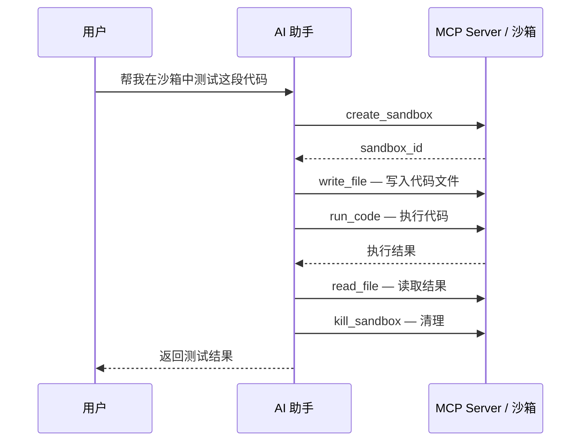

# MCP 集成

Easy Sandbox 提供 MCP（Model Context Protocol）Server，使 AI IDE 和工具能够直接操作沙箱。

---

## 什么是 MCP

MCP（Model Context Protocol）是一个开放协议，允许 AI 模型与外部工具和服务交互。Easy Sandbox 的 MCP Server 以 STDIO 传输、JSON-RPC 2.0 协议运行，为 AI 助手提供沙箱操作能力；远程部署也可使用 Streamable HTTP 传输（见下文）。

### 前置条件

```bash
pip install "easy-sandbox[cli]"     # ebx CLI + MCP STDIO server
export E2B_API_KEY=your-api-key     # 或：ebx config set sandbox_api_key your-api-key
```

---

## 安装到 IDE

### Cursor

```bash
ebx mcp install --target cursor
```

向 `~/.cursor/mcp.json` 写入 `easy-sandbox` 条目，然后重启 Cursor。

### Claude Desktop

```bash
ebx mcp install --target claude
```

写入 `claude_desktop_config.json`（路径取决于操作系统），然后重启 Claude Desktop。

### VS Code

```bash
ebx mcp install --target vscode
```

写入工作区 `.vscode/mcp.json` 的 `servers` 键（`type: stdio`），然后重新加载 VS Code 窗口。这个文件经常会被提交，所以安装器不把 API key 写进去；`ebx mcp start` 从环境变量或 `~/.ebx` 读取。

所有目标注册的都是同一个 STDIO 命令：`ebx mcp start`。命令写成当前解释器旁的 `ebx` 绝对路径（找不到时退回到 `python -m easy_sandbox.cli.main`），这样 IDE 自带的精简 PATH 也能拉起 server。安装器采用合并写入 — 已配置的其他 MCP server 会被保留。配置文件如果不是严格 JSON（注释、尾逗号），安装器会拒绝覆盖。Cursor 和 Claude 的用户级配置在 API key 可用时会嵌入 `env` 块。这把密钥按 [凭证解析](../reference/configuration.md#凭证解析) 取值：进程环境变量，然后 `./.env`，然后 `~/.ebx`。`E2B_API_URL` 和 `SANDBOX_REGION` 只有进程环境变量设置了才会写入；`ebx config set region` 保存的区域在 `ebx mcp start` 启动时再次读取。

### 查看安装状态

```bash
ebx mcp status
# server、transport、工具列表、auth_configured、installed_<ide> 标志

ebx --json mcp status
```

---

## 可用工具

MCP Server 提供 7 个工具：

| 工具名 | 说明 | 参数 |
|--------|------|------|
| `create_sandbox` | 创建新沙箱，并把它设为默认沙箱 | `template`（可选，省略时用 server 配置的模板）、`timeout`（可选，默认 300）、`envs`（可选） |
| `run_code` | 在沙箱中执行代码 | `code`（必填）、`sandbox_id`（可选）、`language`（可选，默认 python）、`timeout`（可选，默认 30） |
| `run_command` | 通过 `sh -c` 执行命令（支持管道、`&&`、`$VAR`、`cd`） | `command`（必填）、`sandbox_id`（可选）、`cwd`（可选，省略时用镜像工作目录）、`timeout`（可选，默认 60，非零退出码视为工具错误） |
| `read_file` | 读取沙箱中的文件 | `path`（必填）、`sandbox_id`（可选）、`encoding`（可选，默认 utf-8） |
| `write_file` | 写入文件到沙箱 | `path`、`content`（必填）、`sandbox_id`（可选） |
| `list_files` | 列出沙箱中的目录内容 | `path`（可选，默认 `/`）、`sandbox_id`（可选） |
| `kill_sandbox` | 销毁沙箱 | `sandbox_id`（可选；省略时销毁默认沙箱。没有默认沙箱时返回错误） |

> **命名说明**：MCP 工具 `run_command` 通过 `sh -c` 执行命令（SDK 中 `sandbox.commands.run(..., shell=True)`），与 SDK 中已弃用的 `Sandbox.run_command()` 方法无关——后者用于调度命名自定义命令，请使用 `Sandbox.custom()` 替代。
>
> **默认沙箱**：`create_sandbox` 的结果会成为默认沙箱，所以随后省略 `sandbox_id` 的 `write_file` / `run_code` / `kill_sandbox` 都作用在刚创建的那只沙箱上。还没有默认沙箱时，第一次省略 `sandbox_id` 的工具调用会懒创建一只。省略 `template` 时使用 server 配置的模板（`ebx mcp start` 默认为 `code-interpreter-v1`）。每次使用沙箱前会按创建时的 `timeout` 延长存活时间。IDE 关闭 server（STDIO）或 `DELETE /mcp` / 空闲超时（HTTP）时会销毁会话里的全部沙箱。

---

## 手动启动 MCP Server（STDIO）

通常 MCP Server 由 IDE 自动启动。手动运行时进程会停在 stdin 上等 JSON-RPC，这是正常状态。启动后会把传输、协议、模板、API key 是否已配置、工具列表和停止方式写到 **stderr**（stdout 只留给 JSON-RPC，密钥本身不会打印）：

```bash
ebx mcp start
```

另一个终端里停止它：

```bash
ebx mcp stop
```

`ebx mcp stop` 向记录的 pid 发送 SIGTERM。前台 STDIO 也可以直接 Ctrl-C。pid 和日志在 `~/.ebx/run/`（`mcp-server.json`、`mcp-server.log`）；测试可用 `EBX_MCP_RUNTIME_DIR` 换目录。`ebx mcp status` 的 `mcp_running` 表示这只本地进程是否还在。

| 选项 | 说明 |
|------|------|
| `--template` | 默认模板（默认 code-interpreter-v1） |
| `--api-key` | API Key 覆盖（环境变量: `E2B_API_KEY`） |
| `--api-url` | API URL 覆盖（环境变量: `E2B_API_URL`） |
| `--domain` | Domain 覆盖（环境变量: `E2B_DOMAIN`） |
| `--http` | 改为 Streamable HTTP（默认 `127.0.0.1:9000`） |
| `--host` / `--port` | HTTP 绑定地址和端口。非回环地址必须带非空 `--auth-token` |
| `--auth-token` | HTTP Bearer token（环境变量: `EBX_MCP_AUTH_TOKEN`） |
| `--background` | 把 HTTP server 放到后台。STDIO 脱离终端后读到 EOF 会退出，所以该选项会改走 HTTP |

后台 HTTP：

```bash
ebx mcp start --http --background
ebx mcp stop
```

父进程打印 pid、`http://127.0.0.1:9000/mcp` 和日志路径后返回。API key 和 token 只放进子进程环境，不出现在命令行参数里。`--quiet` 不打印这些说明。

Server 以 STDIO 模式运行时，通过 stdin/stdout 上的换行分隔 JSON-RPC 2.0 与调用方通信。可以不经 IDE 直接冒烟测试（说明文字在 stderr，管道里仍是 JSON）：

```bash
# 通过管道发送 initialize + tools/list；server 在 stdout 回复
printf '%s\n' \
  '{"jsonrpc":"2.0","id":1,"method":"initialize","params":{}}' \
  '{"jsonrpc":"2.0","id":2,"method":"tools/list","params":{}}' \
  | ebx mcp start | head -n 2
```

---

## 远程服务（Streamable HTTP）

团队共享或远程访问时，将 MCP Server 作为 Streamable HTTP 服务运行，而不是 STDIO。

### 本地以 uvicorn 运行

```bash
pip install "easy-sandbox[mcp]"

export EBX_MCP_AUTH_TOKEN=replace_me   # Bearer token（省略则关闭认证）
export E2B_API_KEY=your-api-key

uvicorn easy_sandbox.agent.mcp_http:asgi_app --host 0.0.0.0 --port 9000
```

端点：`POST /mcp`（JSON-RPC）、`DELETE /mcp`（会话终止）、`GET /health`（健康检查）。`GET /mcp` 返回 405（SSE 通知尚未实现，按 Streamable HTTP 规范用 405 而不是 501）。远程产物必须带非空 Bearer token（`--generate-token` 或 `--auth-token-file`）。带 `Origin` 且不是本机、也不在 `EBX_MCP_ALLOWED_ORIGINS` 里的请求返回 403。

也可以编程式构建应用：

```python
from easy_sandbox.agent.mcp_http import create_mcp_app

app = create_mcp_app(
    auth_token="replace_me",   # None 关闭客户端认证
    api_key="your-api-key",
    template="base",
)
```

### Bearer Token 认证

三层要分开看：

| 入口 | 客户端鉴权 | 怎么配置 |
|------|------------|----------|
| `ebx mcp start`（STDIO） | 没有 Bearer。进程由本机 IDE 拉起，不对外监听 | 沙箱调用用 `E2B_API_KEY` / `ebx config set sandbox_api_key` |
| `ebx mcp start --http` | Bearer。回环地址可以不配 token（启动时会警告）；`--host` 不是回环时必须有非空 `--auth-token` | `--auth-token` 或 `EBX_MCP_AUTH_TOKEN` |
| 阿里云 FC 上的远程函数 | Bearer 必填。产物里的 `app.py` 在 token 为空时拒绝启动，不会变成“免认证” | `ebx mcp deploy --generate-token` 写入函数环境变量 `EBX_MCP_AUTH_TOKEN`。FC HTTP 触发器使用 `anonymous`，这样 MCP 客户端不用阿里云签名；真正的鉴权是应用层 Bearer。`GET /health` 只返回状态和协议，不校验 token，也不含密钥 |

设置 `EBX_MCP_AUTH_TOKEN`（或 `auth_token`）后，`/mcp` 的每个请求必须携带：

```
Authorization: Bearer <token>
```

- 本机回环上未设置 token → 认证关闭，启动时会警告
- token 已设置但为空 → **fail-closed**：所有请求返回 401
- FC 产物未设置或为空 → 进程拒绝启动

token 比较使用常量时间算法。可用 `openssl rand -base64 32` 生成，或让 `ebx mcp deploy --generate-token` 生成。

### 客户端配置（远程）

```json
{
  "mcpServers": {
    "easy-sandbox-remote": {
      "url": "http://your-server:9000/mcp",
      "headers": {
        "Authorization": "Bearer replace_me"
      }
    }
  }
}
```

---

## 生成 FC 部署产物

`ebx mcp deploy` 生成面向阿里云函数计算的待打包产物。它**不**调用 FC API —— 需要通过控制台或 SDK 手动创建函数。

```bash
ebx mcp deploy \
  --generate-token \
  --api-key $E2B_API_KEY \
  --output-dir ./mcp-artifact
```

产物目录包含：

| 文件 | 内容 |
|------|------|
| `requirements.txt` | `easy-sandbox[mcp]`、`uvicorn>=0.29` |
| `app.py` | ASGI 入口，读取 FC 环境变量（`EBX_MCP_AUTH_TOKEN`、`E2B_API_KEY`、`E2B_API_URL`、`E2B_DOMAIN`、`EBX_TEMPLATE`） |
| `config.yaml` | YAML 清单：函数名、地域、运行时 `python3.10`、handler `app.app`、内存/超时、环境变量、HTTP 触发器（POST/GET/DELETE）、会话亲和 |

命令还会打印：手动 FC 部署步骤（打包 → 创建函数 → 创建 HTTP 触发器 → 如支持则启用 `Mcp-Session-Id` 亲和）以及指向 `<FC_HTTP_TRIGGER_URL>/mcp`、Bearer token 打码的 IDE 配置模板。

> **安全**：`config.yaml` 含 API key 与 Bearer token。切勿提交到版本控制。

部署完成后，客户端使用触发器 URL 配置：

```json
{
  "mcpServers": {
    "easy-sandbox-remote": {
      "url": "https://<FC_HTTP_TRIGGER_URL>/mcp",
      "headers": { "Authorization": "Bearer <BEARER_TOKEN>" }
    }
  }
}
```

---

## 场景示例

### 在 Cursor 中使用

安装 MCP 后，在 Cursor 的 AI 对话中，模型可以自动调用 Easy Sandbox 工具：

1. **代码执行**：「在沙箱中运行这段 Python 代码，看看输出是什么」
2. **环境搭建**：「创建一个沙箱，安装 flask 和 sqlalchemy，然后运行我的项目」
3. **文件操作**：「把这个文件写入沙箱的 /app 目录」
4. **调试辅助**：「在沙箱里执行 pip list 看看装了哪些包」

### 典型工作流



### 快速执行一段代码（HTTP，curl）

```bash
# 1. initialize（创建会话；记下 Mcp-Session-Id）
curl -s http://localhost:9000/mcp \
  -H "Content-Type: application/json" \
  -H "Authorization: Bearer replace_me" \
  -d '{"jsonrpc":"2.0","id":1,"method":"initialize","params":{}}'

# 2. 携带会话头调用工具
curl -s http://localhost:9000/mcp \
  -H "Content-Type: application/json" \
  -H "Authorization: Bearer replace_me" \
  -H "Mcp-Session-Id: <步骤1的会话ID>" \
  -d '{"jsonrpc":"2.0","id":2,"method":"tools/call",
       "params":{"name":"run_code","arguments":{"code":"print(1+1)"}}}'

# 3. 终止会话（销毁其沙箱）
curl -s -X DELETE http://localhost:9000/mcp \
  -H "Authorization: Bearer replace_me" \
  -H "Mcp-Session-Id: <步骤1的会话ID>"
```

---

## 故障排查

| 症状 | 可能原因 | 解决方法 |
|------|----------|----------|
| IDE 显示 server 失败 / 无工具 | `ebx` 不在 IDE 的 `PATH` 中 | 在 IDE 配置中使用绝对路径，如 `/Users/you/.venv/bin/ebx` |
| 工具列表正常但每次调用报错 | API key 缺失或无效 | `ebx mcp status` 看 `auth_configured`；设置 `E2B_API_KEY` 或 `ebx config set sandbox_api_key` |
| IDE 重启后 `create_sandbox` 失败 | 后端 API URL/地域不匹配 | 在 server 参数/env 块中传 `--api-url`（或设 `E2B_API_URL`） |
| HTTP 每个请求都 401 | `EBX_MCP_AUTH_TOKEN` 为空（fail-closed） | 设置非空 token。本机回环可以删掉该变量来关闭认证。FC 产物没有 token 时不会启动 |
| HTTP 404 Unknown session | `Mcp-Session-Id` 已过期（空闲 TTL 3600 秒）或实例重启 | 重新发送 `initialize` 创建新会话 |
| HTTP 503 会话上限 | 进程内并发会话超过 100 | 关闭空闲会话（`DELETE /mcp`）或经 `create_mcp_app()` 调高 `max_sessions` |
| `GET /mcp` 返回 405 | SSE 通知尚未实现 | 预期行为 — 只使用 `POST /mcp` |

更普遍的问题：见[故障排查指南](troubleshooting.md)与[错误码](../reference/error-codes.md)。

---

## 技术细节

- **传输协议**：STDIO（换行分隔 JSON-RPC 2.0，协议版本 2024-11-05）与 Streamable HTTP（规范 2025-06-18）。`initialize` 按 transport 协商支持版本 —— 请求版本受支持时原样回显，缺失或不支持时回退到该 transport 自己的版本（因此 HTTP 的 /health 与 initialize 均报告 2025-06-18）
- **沙箱管理**：MCP Server 为每个会话内部维护 `SandboxManager`，管理多个沙箱实例的生命周期
- **默认模板**：`ebx mcp start` 为 `code-interpreter-v1`；HTTP 应用与 `ebx mcp deploy` 产物为 `base`。`create_sandbox` 省略 `template` 时用的就是这个 server 模板
- **STDIO**：单条消息上限 8 MiB；超限的一行会被拒绝，进程继续服务下一条。`ping` 在工具调用进行中也会返回
- **HTTP 会话**：空闲 TTL 3600 秒、每进程最多 100 个并发会话，容量满返回 503

---

## 下一步

- [CLI 教程](cli-tutorial.md) — CLI 完整使用教程
- [SDK 使用指南](sdk-usage.md) — 直接使用 SDK
- [CLI 参考](../reference/cli-reference.md) — MCP 命令详细参考
- [MCP Server 设计](../design/mcp-server.md) — 工具、传输与 FC 部署架构
