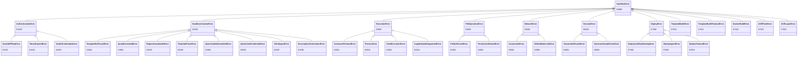

# 错误码参考

所有 SDK 错误都继承自 `SandboxError`，携带 `code`（错误码）、`message`（消息）、`suggestion`（建议）、`docs_url`（文档 URL）属性。

```python
from easy_sandbox.models.errors import SandboxError

try:
    sandbox = await Sandbox.create(template="nonexistent")
except SandboxError as e:
    print(f"[{e.code}] {e.message}")
    print(f"建议: {e.suggestion}")
```

---

## E1xxx — 认证错误（AuthenticationError）

| 错误码 | 异常类 | 含义 | 建议 | 触发场景 |
|--------|--------|------|------|----------|
| E1000 | `AuthenticationError` | 认证失败（基类） | — | 认证相关通用错误 |
| E1001 | `InvalidAPIKeyError` | API Key 无效或缺失 | 检查 `E2B_API_KEY` 环境变量或传入 `api_key` 参数 | 未配置任何 API Key 即调用需认证的 API |
| E1002 | `TokenExpiredError` | 认证令牌已过期 | SDK 应自动刷新 token；持续出现请检查系统时钟同步 | AK/SK 临时令牌过期且自动刷新失败 |
| E1003 | `InvalidCredentialsError` | AK/SK 凭证无效 | 检查 `ALICLOUD_ACCESS_KEY_ID` 和 `ALICLOUD_ACCESS_KEY_SECRET` 环境变量 | AK/SK 为空或格式错误 |

### 排查步骤

1. 运行 `ebx config get sandbox_api_key` 确认认证状态
2. 检查环境变量是否正确设置
3. 确认 API Key 未过期或被吊销
4. 对于 E1002，检查系统时钟是否准确（`date` 命令）

---

## E2xxx — 创建错误（SandboxCreationError）

| 错误码 | 异常类 | 含义 | 建议 | 触发场景 |
|--------|--------|------|------|----------|
| E2000 | `SandboxCreationError` | 创建失败（基类） | — | 沙箱创建相关通用错误 |
| E2001 | `TemplateNotFoundError` | 模板不存在 | 运行 `ebx template list` 查看可用模板 | 指定了不存在的模板名称 |
| E2002 | `QuotaExceededError` | 配额超限 | 销毁空闲沙箱或申请提升配额 | 运行中的沙箱数量超过账户配额 |
| E2003 | `RegionUnavailableError` | 区域不可用 | 尝试其他区域或检查服务可用性 | 请求的区域暂时不可用或不存在 |
| E2004 | `TemplateParseError` | 模板解析失败 | 修复 template.yaml（见校验错误）；能力不会被授予直到模板解析成功 | template.yaml 格式错误或字段无效 |
| E2005 | `QwenCodeNotInstalledError` | 未安装 Qwen Code | 按 Quick Setup 安装官方 standalone（或 `ebx config init`），或用 `ebx create --template <名称>` 跳过 AI 生成 | `ebx create "描述"` 且 PATH 与 `~/.ebx/bin` 均无 Qwen Code，且用户拒绝安装或非 TTY 未传 `-y` |
| E2006 | `QwenCodeCredentialError` | Qwen Code 凭证缺失 | `ebx config set llm_api_key <KEY>` 或 `ebx config init`；也可导出 `DASHSCOPE_API_KEY`/`OPENAI_API_KEY` | AI 路径下 `llm_api_key`、环境变量与 `~/.qwen/settings.json` 均无可用凭证 |
| E2007 | `AICodegenError` | AI 生成失败 | 查看保留的生成目录（`~/.ebx/generated/<名称>`，或 `--dir` 指定位置下）后重试，或改用 `ebx create --template <名称>` | Qwen Code 生成失败/超时，或产出的 Dockerfile、template.yaml 缺失或未通过校验 |
| E2008 | `DescriptionClarificationError` | 描述信息量不足以进行 AI 生成 | 把建议中列出的缺失项（或示例描述）补进 `DESCRIPTION`；或传 `--yes`/`-y` 直接按当前描述生成；或改用 `ebx create --template <名称>` | Agent 自行检索可公开查证的事实后，描述完整度仍低于 80%（缺失的是用户偏好 / 私有约束 / 业务决策）且当前会话无法提问（非 TTY / CI 未传 `-y`），或交互式澄清被取消 / 中断（EOF） |

### 排查步骤

1. 确认模板名称正确（`ebx template list`）
2. 对于 E2002，检查 `ebx list` 是否有大量闲置沙箱
3. 对于 E2004，检查 template.yaml 的 YAML 语法和字段值
4. 对于 E2005–E2008（AI 路径），按输出中的 Quick Setup 操作；不想使用 AI 生成时可显式传 `ebx create --template <名称>`。其中 E2008 需把缺失项（或示例描述）补进参数，或传 `-y` 跳过澄清直接生成

---

## E3xxx — 执行错误（ExecutionError）

| 错误码 | 异常类 | 含义 | 建议 | 触发场景 |
|--------|--------|------|------|----------|
| E3000 | `ExecutionError` | 执行失败（基类） | — | 命令/代码执行相关通用错误 |
| E3001 | `CommandTimeoutError` | 命令执行超时 | 增加 `timeout` 参数或检查命令是否卡死 | `commands.run()` 或 `run_code()` 超过 timeout |
| E3002 | `ProcessError` | 进程非零退出码 | — | 命令返回非零退出码（携带 `exit_code`、`stdout`、`stderr` 属性） |
| E3003 | `CodeExecutionError` | 代码执行失败 | 检查代码语法和运行时依赖 | Code Interpreter 执行代码失败 |
| E3004 | `CapabilityNotSupportedError` | 能力未启用 | 在模板的 `capabilities` 列表中声明所需能力，或使用支持该能力的模板 | 调用了运行时门控能力但未声明（如在无 `code` 能力的模板上调用 `run_code()`）。也会在模板解析时由 `resolve_capabilities()` 抛出 |
| E3005 | `CommandNotFoundError` | 自定义命令未找到 | 检查命令名、模板的 `custom_commands`，以及 SandboxServer 是否已启动（`sandbox.server.start()`） | `Sandbox.custom(name)` / `ebx run <名称>` 无法从模板 `custom_commands`（机制 A）或 SandboxServer 注册表（机制 B）解析该命令——服务端可达但返回 HTTP 404，或 SandboxServer 不可达（连接失败 / 无效响应）。携带 `command_name`、`checked_sources` 属性 |
| E3006 | `EnvdRpcError` | envd 拒绝了 RPC 调用（HTTP >= 400） | 检查命令与参数，或用 `ebx -v` 查看原始错误响应 | 沙箱 envd 返回 HTTP >= 400（例如未知可执行文件触发 `process.Process/Start` 500）。携带 `status_code`、`rpc_path`、`envd_error`（解析后的 JSON 体）与 `body_text`；消息不包含完整沙箱 URL。`ebx connect` 会将其映射为单条友好提示（如 `Command not found: <cmd>`） |

### E3004 详细说明

> **说明（ADR 2026-09-23）**：大多数模块的运行时 `check_capability()` 门控已移除。`CommandsModule`、`FilesModule`、`NetworkModule` 不再在调用时抛出 E3004。**例外：`CodeContextModule` 保留了 `code` 能力门控**——其所有方法（`run`、`create_context`、`list_contexts`、`restart_context`、`remove_context`）在 `code` 能力缺失时仍会抛出 `CapabilityNotSupportedError`（E3004，fail-closed）。E3004 也仍在模板解析/模型校验时抛出（如 `resolve_capabilities()`）。

`CapabilityNotSupportedError` 携带 `capability` 属性，指示缺少的能力名。

```python
try:
    result = await sandbox.run_code("print(1)")
except CapabilityNotSupportedError as e:
    print(f"缺少能力: {e.capability}")  # "code"
```

**标准能力**：`shell`、`files`、`code`、`terminal`、`ports`

**默认能力集**：`{shell, files, code}`（不声明 `capabilities` 时自动获得）

---

## E4xxx — 文件系统错误（FileOperationError）

| 错误码 | 异常类 | 含义 | 建议 | 触发场景 |
|--------|--------|------|------|----------|
| E4000 | `FileOperationError` | 文件操作失败（基类） | — | 文件系统相关通用错误 |
| E4001 | `FileNotFoundError_` | 文件或目录未找到 | 使用 `files.list()` 检查可用文件，或 `files.exists()` 验证路径 | 读取/删除不存在的路径 |
| E4002 | `PermissionDeniedError` | 权限被拒绝 | 检查沙箱中的文件权限 | 操作无权限的文件 |

> **注意**：`FileNotFoundError_` 类名带下划线后缀，以避免遮蔽 Python 内置 `FileNotFoundError`。

---

## E5xxx — 网络错误（NetworkError）

| 错误码 | 异常类 | 含义 | 建议 | 触发场景 |
|--------|--------|------|------|----------|
| E5000 | `NetworkError` | 网络错误（基类） | — | 网络连接相关通用错误 |
| E5000 | `GitHubRateLimitError` | GitHub 匿名 API 限流（拉取模板时触发） | 执行 `ebx config set github_token`（星号脱敏输入；交互终端下 CLI 会主动引导并只重试一次），CI 中注入 `GITHUB_TOKEN` | 未配置 token 时执行 `ebx template install` / `ebx install` / `ebx template search` |
| E5001 | `ConnectionError_` | 连接失败 | 检查网络连通性和防火墙规则 | 无法连接到沙箱服务 |

> **注意**：`ConnectionError_` 类名带下划线后缀，以避免遮蔽 Python 内置 `ConnectionError`。

> **注意**：`GitHubRateLimitError` 与 `NetworkError` 共享 E5000 错误码——对调用方仍是普通网络错误，CLI 通过该子类识别限流并提供一次性交互式 `github_token` 引导。

---

## E6xxx — 会话错误（SessionError）

| 错误码 | 异常类 | 含义 | 建议 | 触发场景 |
|--------|--------|------|------|----------|
| E6000 | `SessionError` | 会话错误（基类） | — | 会话管理相关通用错误 |
| E6001 | `SessionNotFoundError` | 会话未找到 | 检查会话名称是否正确 | 连接/停止不存在的会话 |
| E6002 | `SessionAlreadyExistsError` | 会话名已存在 | 使用其他名称，或先停止已有会话 | 创建同名会话 |

---

## E7xxx — 部署与构建错误

### 部署错误（DeployError）

| 错误码 | 异常类 | 含义 | 建议 | 触发场景 |
|--------|--------|------|------|----------|
| E7000 | `DeployError` | 部署失败（基类） | — | NL 驱动部署相关通用错误 |
| E7001 | `DeployLLMKeyMissingError` | 未找到 LLM API Key | 设置 `EBX_LLM_API_KEY`（或 `BAILIAN_CODING_PLAN_API_KEY`、`DASHSCOPE_API_KEY`、`OPENAI_API_KEY`），执行 `ebx config set llm_api_key <KEY>`，或传入 `llm_api_key=` | SDK `Sandbox.deploy()` 的沙箱内 qwen-code agent 缺少 LLM Key（`ebx deploy` 不会抛出） |
| E7002 | `DeployAgentError` | Agent 返回错误 | 检查 `DeployResult` 的 `raw_output` 获取详情 | qwen-code agent 执行出错 |
| E7003 | `DeployTimeoutError` | 部署超时 | 增加 `max_wall_time` 或简化部署任务 | 部署超过最大时间限制 |

### 模板构建错误

| 错误码 | 异常类 | 含义 | 建议 | 触发场景 |
|--------|--------|------|------|----------|
| E7010 | `TemplateBuildError` | 模板构建失败 | 检查 Dockerfile 和构建日志 | 模板镜像构建错误 |
| E7011 | `TemplateBuildTimeoutError` | 模板构建超时 | 增加构建超时时间或简化 Dockerfile | 镜像构建时间过长 |

### Docker/ACR 错误

| 错误码 | 异常类 | 含义 | 建议 | 触发场景 |
|--------|--------|------|------|----------|
| E7020 | `DockerBuildError` | Docker 构建失败 | 检查 Dockerfile 语法并确保 Docker daemon 正在运行 | 本地 Docker 构建失败 |
| E7021 | `ACRPushError` | 推送到 ACR 失败 | 验证 ACR 凭证和 registry URL，确保 namespace 和仓库存在 | 镜像推送到阿里云 ACR 失败 |
| E7022 | `ACRLoginError` | ACR 登录失败 | 检查 AccessKey/AccessSecret 凭证和 registry URL | 阿里云 ACR 认证失败 |

---

## 异常层级结构


```mermaid
classDiagram
    SandboxError <|-- AuthenticationError
    SandboxError <|-- SandboxCreationError
    SandboxError <|-- ExecutionError
    SandboxError <|-- FileOperationError
    SandboxError <|-- NetworkError
    SandboxError <|-- SessionError
    SandboxError <|-- DeployError
    SandboxError <|-- TemplateBuildError
    SandboxError <|-- TemplateBuildTimeoutError
    SandboxError <|-- DockerBuildError
    SandboxError <|-- ACRPushError
    SandboxError <|-- ACRLoginError

    AuthenticationError <|-- InvalidAPIKeyError
    AuthenticationError <|-- TokenExpiredError
    AuthenticationError <|-- InvalidCredentialsError

    SandboxCreationError <|-- TemplateNotFoundError
    SandboxCreationError <|-- QuotaExceededError
    SandboxCreationError <|-- RegionUnavailableError
    SandboxCreationError <|-- TemplateParseError
    SandboxCreationError <|-- QwenCodeNotInstalledError
    SandboxCreationError <|-- QwenCodeCredentialError
    SandboxCreationError <|-- AICodegenError
    SandboxCreationError <|-- DescriptionClarificationError

    ExecutionError <|-- CommandTimeoutError
    ExecutionError <|-- ProcessError
    ExecutionError <|-- CodeExecutionError
    ExecutionError <|-- CapabilityNotSupportedError

    FileOperationError <|-- FileNotFoundError_
    FileOperationError <|-- PermissionDeniedError

    NetworkError <|-- ConnectionError_
    NetworkError <|-- GitHubRateLimitError

    SessionError <|-- SessionNotFoundError
    SessionError <|-- SessionAlreadyExistsError

    DeployError <|-- DeployLLMKeyMissingError
    DeployError <|-- DeployAgentError
    DeployError <|-- DeployTimeoutError

    class SandboxError { E0000 }
    class AuthenticationError { E1000 }
    class InvalidAPIKeyError { E1001 }
    class TokenExpiredError { E1002 }
    class InvalidCredentialsError { E1003 }
    class SandboxCreationError { E2000 }
    class TemplateNotFoundError { E2001 }
    class QuotaExceededError { E2002 }
    class RegionUnavailableError { E2003 }
    class TemplateParseError { E2004 }
    class QwenCodeNotInstalledError { E2005 }
    class QwenCodeCredentialError { E2006 }
    class AICodegenError { E2007 }
    class DescriptionClarificationError { E2008 }
    class ExecutionError { E3000 }
    class CommandTimeoutError { E3001 }
    class ProcessError { E3002 }
    class CodeExecutionError { E3003 }
    class CapabilityNotSupportedError { E3004 }
    class FileOperationError { E4000 }
    class FileNotFoundError_ { E4001 }
    class PermissionDeniedError { E4002 }
    class NetworkError { E5000 }
    class ConnectionError_ { E5001 }
    class GitHubRateLimitError { E5000 }
    class SessionError { E6000 }
    class SessionNotFoundError { E6001 }
    class SessionAlreadyExistsError { E6002 }
    class DeployError { E7000 }
    class DeployLLMKeyMissingError { E7001 }
    class DeployAgentError { E7002 }
    class DeployTimeoutError { E7003 }
    class TemplateBuildError { E7010 }
    class TemplateBuildTimeoutError { E7011 }
    class DockerBuildError { E7020 }
    class ACRPushError { E7021 }
    class ACRLoginError { E7022 }
```

---

## 导入

```python
from easy_sandbox.models.errors import (
    SandboxError,
    AuthenticationError,
    InvalidAPIKeyError,
    TokenExpiredError,
    InvalidCredentialsError,
    SandboxCreationError,
    TemplateNotFoundError,
    QuotaExceededError,
    RegionUnavailableError,
    TemplateParseError,
    QwenCodeNotInstalledError,
    QwenCodeCredentialError,
    AICodegenError,
    DescriptionClarificationError,
    ExecutionError,
    CommandTimeoutError,
    ProcessError,
    CodeExecutionError,
    CapabilityNotSupportedError,
    FileOperationError,
    FileNotFoundError_,
    PermissionDeniedError,
    NetworkError,
    ConnectionError_,
    GitHubRateLimitError,
    SessionError,
    SessionNotFoundError,
    SessionAlreadyExistsError,
    DeployError,
    DeployLLMKeyMissingError,
    DeployAgentError,
    DeployTimeoutError,
    TemplateBuildError,
    TemplateBuildTimeoutError,
    DockerBuildError,
    ACRPushError,
    ACRLoginError,
)
```
